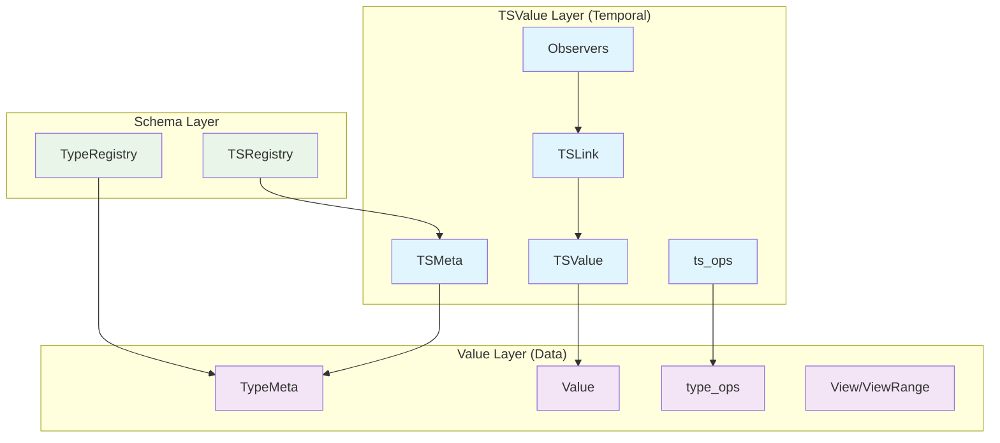
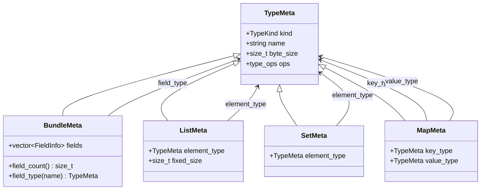
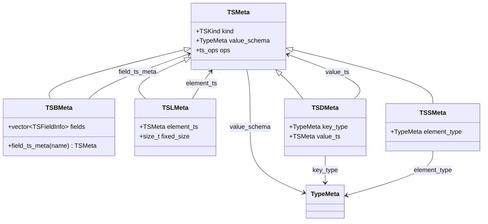

# Design Document: Compact Time-Series Representation

## Overview

The Value/TSValue System Implementation provides a modern C++ architecture for hgraph's time-series data structures that fundamentally separates data representation from temporal semantics. This system replaces the current one-to-one Python port with a sophisticated type-erased, schema-driven approach optimized for buffer-friendly operations while maintaining full compatibility with existing hgraph functionality.

The architecture consists of two primary layers:
- **Value Layer**: Type-erased data containers with schema-driven operations (TypeMeta/type_ops)
- **TSValue Layer**: Time-series overlay providing hierarchical modification tracking and observability (TSMeta/ts_ops)

This separation enables zero-copy bridging between layers, efficient buffer operations, and flexible composition patterns while preserving the rich temporal semantics required for reactive graph computation.

## Architecture

### Dual-Layer Architecture

The system employs a dual-layer architecture that cleanly separates concerns:



**Key Principles:**
- **Type Erasure**: Both layers use runtime schema-driven operations instead of compile-time templates
- **Zero-Copy Bridge**: TSValue overlays directly reference Value data without copying
- **Schema Composition**: TSMeta references TypeMeta, enabling flexible type composition
- **Operation Virtualization**: Both layers use vtable-based operations for extensibility

### Memory Layout Strategy

The system uses a **contiguous overlay** approach where TSValue overlays are stored separately from Value data but maintain precise alignment:

```
Value Storage (Contiguous):
┌─────────────────────────────────────────────────────────────┐
│ [field_a: 8 bytes] [field_b: 8 bytes] [field_c: 8 bytes]   │
└─────────────────────────────────────────────────────────────┘

TSValue Overlay (Parallel Array):
┌─────────────────────────────────────────────────────────────┐
│ [ts_a: timestamp] [ts_b: timestamp] [ts_c: timestamp]       │
│ [observers_a]     [observers_b]     [observers_c]           │
└─────────────────────────────────────────────────────────────┘
```

This approach provides:
- **Cache Efficiency**: Value data remains contiguous for bulk operations
- **Temporal Isolation**: Modification tracking doesn't fragment data layout
- **Flexible Composition**: Overlays can be applied selectively to subsets of data

## Components and Interfaces

### Value Layer Components

#### TypeMeta and TypeRegistry

**TypeMeta** serves as the schema descriptor for all data types:

```cpp
class TypeMeta {
public:
    // Core properties
    TypeKind kind() const;
    std::string_view name() const;
    size_t byte_size() const;
    bool is_fixed_size() const;
    
    // Structure access (bundles/tuples)
    size_t field_count() const;
    std::string_view field_name(size_t index) const;
    const TypeMeta& field_type(size_t index) const;
    const TypeMeta& field_type(std::string_view name) const;
    size_t field_offset(size_t index) const;
    
    // Container access (lists/sets/maps)
    const TypeMeta& element_type() const;
    const TypeMeta& key_type() const;
    const TypeMeta& value_type() const;
    size_t container_size() const; // 0 for dynamic
    
    // Operations
    const type_ops& ops() const;
    
    // Python integration
    void bind_python_type(nb::object py_type);
    nb::object python_type() const;
    
private:
    TypeKind kind_;
    std::string name_;
    size_t byte_size_;
    std::unique_ptr<type_ops> ops_;
    nb::object python_type_; // Optional binding
};
```

**TypeRegistry** manages schema registration and lookup:

```cpp
class TypeRegistry {
public:
    static TypeRegistry& instance();
    
    // Registration (three forms)
    template<typename T>
    void register_type(std::string_view name);
    
    template<typename T>
    void register_type(std::string_view name, std::unique_ptr<type_ops> ops);
    
    void register_type(std::string_view name, std::unique_ptr<type_ops> ops);
    
    // Lookup
    const TypeMeta& get(std::string_view name) const;
    
    template<typename T>
    const TypeMeta& get() const; // Template shortcut
    
    const TypeMeta& from_python_type(nb::object py_type) const;
    
private:
    std::unordered_map<std::string, std::unique_ptr<TypeMeta>> name_cache_;
    std::unordered_map<std::type_index, TypeMeta*> type_cache_;
};
```

#### type_ops Architecture

The **type_ops** structure uses a tag + union design for memory efficiency and extensibility:

```cpp
struct type_ops {
    // Common operations (all types)
    void (*construct)(void* dst);
    void (*destroy)(void* ptr);
    void (*copy)(void* dst, const void* src);
    void (*move)(void* dst, void* src);
    bool (*equals)(const void* a, const void* b);
    size_t (*hash)(const void* ptr);
    std::string (*to_string)(const void* ptr);
    nb::object (*to_python)(const void* ptr);
    void (*from_python)(void* ptr, nb::object obj);
    
    // Kind-specific operations via tagged union
    TypeKind kind;
    union {
        atomic_ops atomic;
        bundle_ops bundle;
        list_ops list;
        set_ops set;
        map_ops map;
    } specific;
};
```

**Kind-specific operations** provide specialized functionality:

```cpp
struct bundle_ops {
    View (*field_at_index)(void* ptr, size_t idx);
    View (*field_at_name)(void* ptr, std::string_view name);
    size_t (*field_count)(const void* ptr);
    std::string_view (*field_name)(const void* ptr, size_t idx);
    ViewPairRange (*items)(const void* ptr);
};

struct list_ops {
    View (*at)(void* ptr, size_t idx);
    void (*append)(void* ptr, View elem);
    void (*clear)(void* ptr);
    size_t (*size)(const void* ptr);
    ViewRange (*values)(const void* ptr);
    ViewPairRange (*items)(const void* ptr);
};

// Similar structures for set_ops, map_ops
```

#### Value and View System

**Value** provides type-erased data storage:

```cpp
class Value {
public:
    explicit Value(const TypeMeta& schema);
    Value(const TypeMeta& schema, nb::object py_obj);
    
    // Schema access
    const TypeMeta& schema() const;
    
    // View creation
    View view();
    const View view() const;
    
    // Specialized views
    BundleView as_bundle();
    ListView as_list();
    SetView as_set();
    MapView as_map();
    
    // Operations
    Value copy() const;
    void copy_from(const View& source);
    void set(const Value& source);
    void apply_delta(const DeltaView& delta);
    
    // Python interop
    void from_python(nb::object obj);
    nb::object to_python() const;
    
private:
    void* data_;
    const TypeMeta* schema_;
};
```

**View** provides non-owning access with path tracking:

```cpp
class View {
public:
    // Schema and ownership
    const TypeMeta& schema() const;
    Value& owner() const;
    const Path& path() const;
    
    // Navigation
    size_t size() const;
    View at(size_t index) const;
    View at(std::string_view name) const;
    
    // Type-safe extraction
    template<typename T>
    T as() const;
    
    template<typename T>
    T* data() const; // Direct pointer access
    
    // Operations
    bool equals(const View& other) const;
    size_t hash() const;
    std::string to_string() const;
    nb::object to_python() const;
    
    // Iteration support
    ViewRange values() const;
    ViewPairRange items() const;
    
private:
    void* data_;
    const TypeMeta* schema_;
    Value* owner_;
    Path path_;
};
```

#### Iterator Concepts

Two iterator types handle all iteration needs:

```cpp
// Single-value iterator
struct ViewRange {
    struct iterator {
        View operator*() const;
        iterator& operator++();
        bool operator!=(const iterator& other) const;
    };
    iterator begin() const;
    iterator end() const;
};

// Key-value pair iterator
struct ViewPairRange {
    struct iterator {
        std::pair<View, View> operator*() const;
        iterator& operator++();
        bool operator!=(const iterator& other) const;
    };
    iterator begin() const;
    iterator end() const;
};
```

### TSValue Layer Components

#### TSMeta and TSRegistry

**TSMeta** describes time-series structure and operations:

```cpp
class TSMeta {
public:
    // Core properties
    TSKind kind() const;
    const TypeMeta& value_schema() const;
    
    // Structure access (TSB)
    size_t field_count() const;
    std::string_view field_name(size_t index) const;
    const TSMeta& field_ts_meta(size_t index) const;
    const TSMeta& field_ts_meta(std::string_view name) const;
    
    // Container access (TSL/TSD/TSS)
    const TSMeta& element_ts_meta() const;
    const TypeMeta& key_type() const;
    const TSMeta& value_ts_meta() const;
    const TypeMeta& element_type() const;
    size_t container_size() const;
    
    // Operations
    const ts_ops& ops() const;
    
    // Python integration
    void bind_scalar_type(nb::object py_type);
    void bind_schema_type(nb::object py_type);
    nb::object scalar_type() const;
    nb::object schema_type() const;
    
private:
    TSKind kind_;
    const TypeMeta* value_schema_;
    std::unique_ptr<ts_ops> ops_;
    nb::object scalar_type_; // CompoundScalar binding
    nb::object schema_type_; // TimeSeriesSchema binding
};
```

#### ts_ops Architecture

**ts_ops** follows the same tag + union pattern as type_ops:

```cpp
struct ts_ops {
    // Common operations (all TS types)
    void (*construct)(void* dst, engine_time_t time);
    void (*destroy)(void* ptr);
    void (*copy)(void* dst, const void* src);
    bool (*modified)(const void* ptr, engine_time_t time);
    bool (*valid)(const void* ptr);
    bool (*all_valid)(const void* ptr);
    engine_time_t (*last_modified_time)(const void* ptr);
    void (*set_modified_time)(void* ptr, engine_time_t time);
    
    // Value access
    View (*value)(const void* ptr);
    void (*set_value)(void* ptr, View value);
    void (*apply_delta)(void* ptr, DeltaView delta);
    
    // Python interop
    nb::object (*to_python)(const void* ptr);
    nb::object (*delta_to_python)(const void* ptr);
    DeltaView (*delta)(const void* ptr);
    
    // Kind-specific operations
    TSKind kind;
    union {
        ts_scalar_ops scalar;
        tsb_ops bundle;
        tsl_ops list;
        tsd_ops dict;
        tss_ops set;
        ref_ops ref;
        signal_ops signal;
    } specific;
};
```

#### TSValue and TSView System

**TSValue** provides time-series storage with overlay tracking:

```cpp
class TSValue {
public:
    explicit TSValue(const TSMeta& schema, engine_time_t time);
    
    // Schema access
    const TSMeta& schema() const;
    const TypeMeta& value_schema() const;
    
    // View creation (time-bound)
    TSView view(engine_time_t time);
    const TSView view(engine_time_t time) const;
    
    // State queries
    bool modified(engine_time_t time) const;
    bool valid() const;
    bool all_valid() const;
    engine_time_t last_modified_time() const;
    
    // Value access
    View value() const;
    void set_value(View value, engine_time_t time);
    void apply_delta(DeltaView delta, engine_time_t time);
    
    // Observer management
    void subscribe(TSInput* observer);
    void unsubscribe(TSInput* observer);
    void notify_observers();
    
    // Python interop
    nb::object to_python() const;
    nb::object delta_to_python(engine_time_t time) const;
    DeltaView delta(engine_time_t time) const;
    
private:
    Value value_storage_;
    void* overlay_data_; // Timestamps + observer lists
    const TSMeta* schema_;
    std::vector<TSInput*> observers_;
};
```

**TSView** provides time-bound access to time-series:

```cpp
class TSView {
public:
    // Time binding
    engine_time_t bound_time() const;
    
    // Schema access
    const TSMeta& schema() const;
    const TypeMeta& value_schema() const;
    
    // State queries (at bound time)
    bool modified() const;
    bool valid() const;
    bool all_valid() const;
    engine_time_t last_modified_time() const;
    
    // Value access
    View value() const;
    template<typename T>
    T value() const; // Typed extraction
    
    // Navigation (TSB/TSL/TSD)
    TSView field(std::string_view name) const;
    TSView operator[](size_t index) const;
    TSView operator[](View key) const;
    
    // Delta access
    DeltaView delta() const;
    nb::object delta_to_python() const;
    
    // Iteration
    ViewRange modified_values() const;
    ViewPairRange modified_items() const;
    ViewRange added() const; // TSS
    ViewRange removed() const; // TSS
    
    // Python interop
    nb::object to_python() const;
    
private:
    TSValue* owner_;
    engine_time_t bound_time_;
    Path path_;
};
```

### TSLink and Dynamic Binding

#### TSLink Architecture

**TSLink** provides symbolic linking with support for partial peering and dynamic routing:

```cpp
class TSLink {
public:
    enum class State {
        Unbound,    // No target
        Bound,      // Connected to target
        Active,     // Bound and notifying
        Passive     // Bound but not notifying
    };
    
    // Binding management
    void bind(TSValue* target);
    void unbind();
    void make_active();
    void make_passive();
    
    // State queries
    State state() const;
    bool is_bound() const;
    bool is_active() const;
    TSValue* target() const;
    
    // Value access (delegates to target)
    View value() const;
    bool modified(engine_time_t time) const;
    bool valid() const;
    
    // Notification handling
    void on_target_modified();
    
private:
    State state_;
    TSValue* target_;
    TSInput* owner_;
};
```

#### REF Implementation

**REF** types use TimeSeriesReference as their value type:

```cpp
class TimeSeriesReference {
public:
    explicit TimeSeriesReference(TSValue* target);
    
    // Target access
    TSValue* target() const;
    bool is_valid() const;
    
    // Equality for use in containers
    bool operator==(const TimeSeriesReference& other) const;
    size_t hash() const;
    
    // Python interop
    nb::object to_python() const;
    static TimeSeriesReference from_python(nb::object obj);
    
private:
    TSValue* target_;
};
```

**REF binding semantics** handle automatic conversion:

```cpp
// REF → TS binding: Extract target and create dynamic link
void bind_ref_to_ts(RefOutput& ref_out, TSInput& ts_in) {
    auto ref_value = ref_out.value();
    if (ref_value.is_valid()) {
        ts_in.bind_dynamic(ref_value.target());
    }
}

// TS → REF binding: Create reference to source
void bind_ts_to_ref(TSOutput& ts_out, RefInput& ref_in) {
    TimeSeriesReference ref(&ts_out);
    ref_in.set_value(ref);
}
```

### Container Hook Integration

#### Hook Architecture

**Container hooks** maintain overlay alignment during set/map operations:

```cpp
class ContainerHooks {
public:
    // Hook registration
    void register_insert_hook(std::function<void(size_t)> hook);
    void register_swap_hook(std::function<void(size_t, size_t)> hook);
    void register_erase_hook(std::function<void(size_t)> hook);
    
    // Hook invocation (called by container operations)
    void on_insert(size_t index);
    void on_swap(size_t index1, size_t index2);
    void on_erase(size_t index);
    
private:
    std::vector<std::function<void(size_t)>> insert_hooks_;
    std::vector<std::function<void(size_t, size_t)>> swap_hooks_;
    std::vector<std::function<void(size_t)>> erase_hooks_;
};
```

**Integration with set/map operations**:

```cpp
// Set implementation with hooks
class HookedSet {
public:
    void insert(View element) {
        size_t index = backing_store_.insert(element);
        hooks_.on_insert(index);
    }
    
    void erase(View element) {
        size_t index = backing_store_.find_index(element);
        backing_store_.swap_with_last(index);
        hooks_.on_swap(index, backing_store_.size() - 1);
        backing_store_.pop_back();
        hooks_.on_erase(backing_store_.size());
    }
    
private:
    std::vector<Value> backing_store_;
    ContainerHooks hooks_;
};
```

## Data Models

### Schema Hierarchy

The type system supports arbitrary nesting of schemas:



### Time-Series Schema Composition

TSMeta references TypeMeta for data layout while adding temporal structure:



### Delta Representation

Each collection type has a corresponding delta schema:

| Collection Type | Delta Structure |
|----------------|-----------------|
| **List** | `Map<size_t, Value>` (index → new_value) |
| **Set** | `{added: Set<Value>, removed: Set<Value>}` |
| **Map** | `{added: Map<Key,Value>, updated: Map<Key,Value>, removed: Set<Key>}` |

```cpp
// Delta schemas are derived from collection schemas
const TypeMeta& list_schema = TypeMeta::get("List<float>");
const TypeMeta& list_delta_schema = list_schema.delta_schema();
// Returns: Map<size_t, float>

const TypeMeta& set_schema = TypeMeta::get("Set<int>");
const TypeMeta& set_delta_schema = set_schema.delta_schema();
// Returns: Bundle<added: Set<int>, removed: Set<int>>
```

### Path System

**Path** tracks navigation through nested structures:

```cpp
class Path {
public:
    // Construction
    Path();
    Path(const Path& parent, std::string_view field_name);
    Path(const Path& parent, size_t index);
    
    // Access
    bool empty() const;
    size_t size() const;
    const PathElement& operator[](size_t index) const;
    
    // Navigation
    Path child(std::string_view field_name) const;
    Path child(size_t index) const;
    Path parent() const;
    
    // String representation
    std::string to_string() const; // "field.subfield[0].other"
    
private:
    std::vector<PathElement> elements_;
};

class PathElement {
public:
    // Construction
    explicit PathElement(std::string_view name);
    explicit PathElement(size_t index);
    
    // Type queries
    bool is_name() const;
    bool is_index() const;
    
    // Access
    std::string_view name() const;
    size_t index() const;
    
private:
    enum class Type { Name, Index };
    Type type_;
    union {
        std::string_view name_;
        size_t index_;
    };
};
```

## Correctness Properties

*A property is a characteristic or behavior that should hold true across all valid executions of a system—essentially, a formal statement about what the system should do. Properties serve as the bridge between human-readable specifications and machine-verifiable correctness guarantees.*

Now I need to use the prework tool to analyze the acceptance criteria before writing the correctness properties:

Based on the prework analysis, I'll now write the correctness properties by consolidating related acceptance criteria into comprehensive properties:

### Property 1: Type System Round-Trip Consistency
*For any* supported data type (atomic or composite), creating a Value, setting data, and retrieving it should preserve the original data exactly.
**Validates: Requirements 1.1, 1.2, 1.3, 1.4, 1.6**

### Property 2: Schema-Data Alignment
*For any* TypeMeta schema and corresponding Value, the schema should accurately describe the Value's structure, size, and field layout.
**Validates: Requirements 1.3, 1.5**

### Property 3: TSValue Overlay Independence
*For any* TSValue with underlying Value data, modifications to the overlay (timestamps, observers) should not affect the Value data, and Value operations should not affect overlay state.
**Validates: Requirements 2.1, 2.6**

### Property 4: Hierarchical Change Propagation
*For any* composite TSValue, when a child element is modified, the parent's last_modified_time should be updated to reflect the change, and this should propagate up the entire hierarchy.
**Validates: Requirements 2.2, 5.5**

### Property 5: Observer Notification Correctness
*For any* TSValue with subscribed observers, when the TSValue is modified, all active observers should be notified exactly once, and passive observers should not be notified.
**Validates: Requirements 2.3, 4.4, 4.6**

### Property 6: View Navigation Consistency
*For any* Value and navigation path, creating a View and navigating to the same path should always return equivalent data, and the View should maintain correct owner and path references.
**Validates: Requirements 3.1, 3.4, 3.5**

### Property 7: Time-Bound View Correctness
*For any* TSValue and engine time, creating a TSView bound to that time should answer modified(), valid(), and delta queries correctly for that specific time.
**Validates: Requirements 3.3**

### Property 8: TSLink Binding Consistency
*For any* TSLink connecting an input to an output, the input should see the same data and modification state as the output, and unbinding should restore local storage behavior.
**Validates: Requirements 4.1, 4.5**

### Property 9: Partial Peering Correctness
*For any* composite TSValue with mixed peering (some children linked, others local), each child should behave according to its peering state independently of other children.
**Validates: Requirements 4.2**

### Property 10: REF Dynamic Rebinding
*For any* REF time-series, changing the reference value should cause linked inputs to dynamically rebind to the new target while maintaining proper sample-time semantics.
**Validates: Requirements 4.3**

### Property 11: Delta Representation Completeness
*For any* collection modification (add, remove, update), the resulting DeltaValue should accurately represent all changes and applying the delta to the original collection should produce the modified collection.
**Validates: Requirements 5.1, 5.2, 5.3, 5.6**

### Property 12: Container Hook Alignment
*For any* container operation (insert, swap, erase) with hooks enabled, the overlay arrays should remain aligned with the backing store indices throughout the operation.
**Validates: Requirements 6.1, 6.2, 6.3, 6.6**

### Property 13: Python Interop Round-Trip
*For any* Value or TSValue, converting to Python and back should preserve the original data and structure exactly.
**Validates: Requirements 7.2, 7.5**

### Property 14: Python API Compatibility
*For any* existing Python time-series operation, the new C++ implementation should produce identical results to the Python implementation.
**Validates: Requirements 7.1, 7.4, 7.6**

### Property 15: Schema Registration Consistency
*For any* type registered in TypeRegistry or TSRegistry, retrieving the schema by name or template should return the same schema object with correct operations.
**Validates: Requirements 8.1, 8.2, 8.4**

### Property 16: Schema Introspection Accuracy
*For any* registered schema, introspection methods should return accurate information about the schema's structure, and validation should correctly identify schema compliance.
**Validates: Requirements 8.6**

## Error Handling

### Type Safety and Runtime Validation

The system employs a multi-layered approach to error handling:

**Schema Validation**:
- All Value operations validate against TypeMeta schema
- Type mismatches throw `std::invalid_argument` with descriptive messages
- Schema compatibility checked at link binding time

**Memory Safety**:
- RAII ensures proper cleanup of type-erased storage
- Views maintain owner references to prevent dangling pointers
- Container operations use bounds checking

**Time-Series Consistency**:
- Invalid time-series access (before first set) returns default values or throws
- Observer notification failures are logged but don't propagate
- Link binding failures leave inputs in unbound state

**Python Integration**:
- Conversion failures throw appropriate Python exceptions
- Type mismatches in from_python() operations are caught and reported
- Memory management between C++ and Python is handled automatically

### Error Recovery Strategies

**Graceful Degradation**:
- Unbound inputs can still be read (return default values)
- Failed observer notifications don't break the notification chain
- Schema mismatches in optional operations are logged but don't fail

**Diagnostic Information**:
- All errors include path information for nested structures
- Schema names and types are included in error messages
- Time-series state (valid/invalid, last modified time) is available for debugging

## Testing Strategy

The testing strategy employs a dual approach combining unit tests for specific scenarios with property-based tests for comprehensive coverage:

### Unit Testing Approach

**Component Isolation**:
- Test individual components (TypeMeta, Value, TSValue) in isolation
- Mock dependencies to focus on specific functionality
- Test error conditions and edge cases explicitly

**Integration Testing**:
- Test interactions between Value and TSValue layers
- Verify linking and observer notification mechanisms
- Test Python interop with real Python objects

**Performance Testing**:
- Benchmark memory layout efficiency for large structures
- Measure observer notification overhead
- Profile delta computation performance

### Property-Based Testing Configuration

**Test Framework**: Use Hypothesis for Python tests and Catch2 with custom generators for C++ tests

**Minimum Iterations**: 100 iterations per property test to ensure statistical coverage

**Property Test Implementation**:
- Each correctness property implemented as a single property-based test
- Tests tagged with feature name and property number for traceability
- Custom generators for complex nested structures

**Example Property Test Structure**:
```cpp
// Feature: compact-timeseries-representation, Property 1: Type System Round-Trip Consistency
TEST_CASE("Type system round-trip consistency", "[property][compact-timeseries-representation]") {
    SECTION("Property 1") {
        // Generate random type schema and data
        // Create Value, set data, retrieve data
        // Verify original data is preserved exactly
    }
}
```

**Generator Strategy**:
- Recursive generators for nested composite types
- Constrained generators respecting schema limitations
- Edge case generators for boundary conditions

**Coverage Areas**:
- All atomic types (bool, int64_t, double, engine_time_t, etc.)
- Nested composite structures up to depth 5
- Collections with various sizes (empty, single element, large)
- Mixed peering scenarios for time-series
- All time-series types (TS, TSB, TSL, TSD, TSS, REF, SIGNAL)

### Test Organization

**Mirror Source Structure**:
- Tests organized to mirror implementation structure
- Separate test files for Value layer and TSValue layer
- Integration tests in dedicated directory

**Continuous Integration**:
- All property tests run on every commit
- Performance regression tests on release branches
- Cross-platform testing (Linux, macOS, Windows)

**Test Data Management**:
- Reproducible test cases using fixed seeds
- Shrinking support for property test failures
- Test case persistence for regression testing

The comprehensive testing strategy ensures that the complex interactions between type erasure, schema-driven operations, and temporal semantics are thoroughly validated across all supported platforms and use cases.