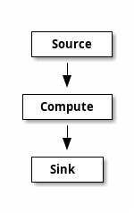
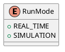

# Forward Propogation Graph

## Introduction

The forward propagation graph (FPG) is a directed acyclic graph (DAG). The graph
is designed to evaluate the flow of data through the graph, where evaluation follows
the rank order of the nodes in the graph.

The graph has 3 types of nodes, namely: source, compute, and sink nodes.
The source nodes are the entry points into the graph, they have only output edges
with no input edges. Sink nodes are the leaves of the node and have no output edges.
Finally, the compute nodes are found between the source and sink nodes. These nodes
have both input and output edges.



The FPG graph is a time-series evaluation engine. That is the graph evaluates information
over time, the time is typically set by the source nodes. There are two types of source
nodes, namely: pull and push source nodes. The pull source nodes express there values
as a tuple of time and value. The graph will evaluate itself asof the time emitted by
a pull source node or wall clock time if the push source node has a value enqueue. 
A push source node will be evaluated at either the time of the
current engine time (as determined by the pull source node values) or at the 
current wall clock time if there are no pending pull source nodes with values to be 
evaluated before the current wall clock time.

The graph is evaluated in waves, the time of the wave (or engine_time) is the time
set by the source node. The wave is evaluated in rank order (defined by the topological
sort order of the graph). Nodes with the same rank may be evaluated in any order, 
although in most implementations, the nodes are flattened into a fully ordered list
and will always be evaluated in that order during the life-time of the graph.

Nodes are only evaluated if the output/s that the input/s of the node have been modified
during the current wave. The value of the outputs of a node are always present.
Thus, once a value is computed it will be available to the inputs of dependent nodes / inputs.
The net result is that the graph only evaluates the path of change, but produces
the same output as if every node were evaluated in each wave.

The nodes of the graph obtain time from the graph context. The key information is
engine_time, this is the time the graph is currently been evaluated for, the
"wall clock" time (wall_clock_time) represent the current live time. The nodes
of a graph may never refer to the system clock (e.g. datetime.now()), but rather
should always reflect the time from the supplied execution context. This allows
the graph to run in a simulation (or backtest) mode where the graph is fed 
historical time-series data to the source nodes and the wall_clock_time is 
treated as the engine_time + engine_lag (or the time taken to the point at which
it is queried). The upshot of this is that the graph can be forced to re-run
different input simulations using exactly the same logic as it would run in real-time,
without having to weight for any artificially introduced delays. I have heard
this referred to as "time-travel", "bullet-time" and "compressed-time".

One of the key advantages of this design for software development is partially
the performance based on reduced computation and largely the ability to run
simulations or backtests without having to modify the logic. If the key use of the
software is for backtest/simulation of computations over time-series data, there
are potentially more efficient solutions, but if the code is designed to run
in real time at least as often as in simulation mode, then this design provides
a powerful tool to develop these type of solutions.

## Graph Runtime

The runtime graph represent the structure that is evaluated at runtime. This
consists of the graph engine, graph context, graph and nodes.


### Graph Engine


```plantuml
interface GraphEngine {
    +graph: Graph
    +run_mode: RunMode
    +run(start_time: datetime, end_time: datetime) -> None
}
@enduml
```

The ``GraphEngine`` is the component that is responsible for evaluating the graph.
This contains the master run-loop. The run-loop evaluates the graph in the time
range provided. The nature of the evaluation is deterimined by the ``run_mode``
of the graph. In ``SIMULATION`` mode the graph will only support pull source nodes
and will evaluate the graph in compressed-time. In ``REAL_TIME`` mode the graph
will support both push and pull source nodes and will evaluate the graph
using true wall clock time, that is in a push source node presents a time in the future,
the engine will wait until the time is reached on the computers clock prior to performing
the computation.

Historical data can also be fed into the system, but in REAL_TIME mode, the graph will
process push source node ticks at whatever time point the engine is when the tick arrives.

### Graph Context

```plantuml
interface ExecutionContext {
    +current_engine_time: datetime
    +wall_clock_time: datetime
    +engine_lag: timedelta
    +next_cycle_engine_time: datetime
    
    +request_engine_stop()
    +is_stop_requested() -> bool
    
    +add_before_evaluation_notification(fn: callback[[], None]) -> None
    +add_after_evaluation_notification(fn: callback[[], None]) -> None
}
```

The most important interface elements are present above. This is available to
all components in the graph and provides state information about the evaluation
of the graph, the most important being the current_engine_time and the wall_clock_time.

The add_before_evaluation_notification and add_after_evaluation_notification are 
useful to inject behavior that needs to be evaluated once either just after the
evaluation of the wave or just before the next wave is started. This is used
extensively by internal components of the graph as well to manage transient state
such as TSS.added / TSS.removed. These are values that are only present for a 
single wave of the graph and need to be cleared down at the end of the wave.

The ExecutionContext is created and owned by the GraphEngine.
There are a number of other key methods and properties on the context, but many
are for internal use and in a C++ engine are unlikely to be exposed to the user.

### Graph

```plantuml
interface Graph {
    +graph_id: tuple[int, ...]
    +nodes: List[Node]
    +schedule: List[datetime]
    +context: ExecutionContext
    +schedule_node(node_ndx: int, time: datetime) -> None
}
```

The graph contains the nodes that belong to the graph. This graph is not the same
as that of the wiring structure, but is the flattened graph of all nodes that 
are to be evaluated within a ``GraphExecutor``. The graph also contains the
evaluation schedule for each node. This is list of datetime values that indicate
the next time the node is scheduled to be evaluated at. The graph is responsible
for scheduling the nodes for evaluation. This is exposed as the ``schedule_node``
method on the class.

### Nodes

As disused in the introduction, there are three key node types: source, compute, 
and sink nodes. Nodes in the graph are represented as classes within the internals
of the system. The base class is as follows:

```plantuml
interface Node {
    +node_ndx: int
    +rank: int
    +inputs: List[Edge]
    +outputs: List[Edge]
    +evaluate(context: ExecutionContext) -> None
}
```


#### Source Nodes

```plantuml
interface SourceNode {
    +value: Any
    +time: datetime
}
```
