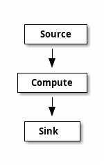
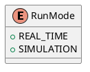
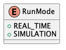
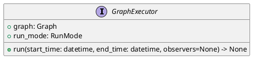
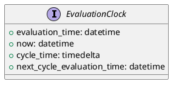
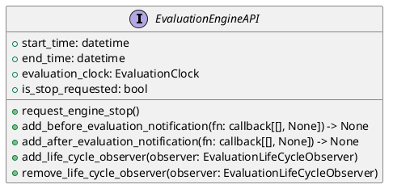
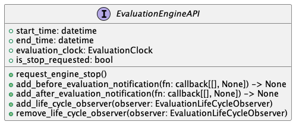
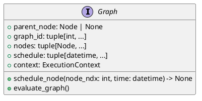
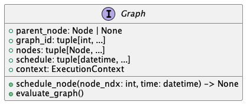
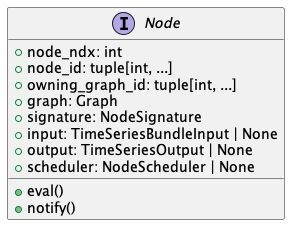

# Forward Propagation Graph

## Introduction

The forward propagation graph (FPG) is a directed acyclic graph (DAG). The graph
is designed to evaluate the flow of data through the graph, where evaluation follows
the rank order of the nodes in the graph.

The graph has 3 types of nodes, namely: ``source``, ``compute``, and `sink` nodes.
The source nodes are the entry points into the graph, they have only output edges
with no input edges. Sink nodes are the leaves of the node and have no output edges.
Finally, the compute nodes are found between the source and sink nodes. These nodes
have both input and output edges.

<--

-->


HGraph (HG) is a FPG graph that is a time-series evaluation engine. That is, the graph evaluates information
over time, the time is typically introduced by the source nodes. There are two types of source
nodes, namely: ``pull`` and `push` source nodes. The pull source nodes express their values
as a tuple of time and value. The graph will evaluate itself as-of the time emitted by
a ``pull`` source node or wall clock time if the push source node has a value enqueued. 
A ``push`` source node will be evaluated at either the time of the
current engine time (``evaluation_time``) (as determined by the pull source node values) or at the 
current wall clock time if there are no pending pull source nodes with values to be 
evaluated before the current wall clock time.

The graph is evaluated in waves, the time of the wave (or ``evaluation_time``) is the time
set by the source node. The wave is evaluated in rank order (defined by the topological
sort order of the graph). Nodes with the same rank may be evaluated in any order, 
although in most implementations, the nodes are flattened into a fully ordered list
and will always be evaluated in that order during the life-time of the graph.

Nodes are only evaluated if the ``output`` associated to the ``input``/s of the node have been modified
during the current wave. The last value of an output of a node is always available to the input.
Thus, once a value is computed it will be available to the inputs of dependent nodes / inputs.
The benefit of this is the ability to reduce computations by only needing to evaluate the parts
of a graph that have been modified, with the other parts still retaining the last computed
value.

The nodes of the graph obtain time from the evaluation engine's clock. The key information is
``evaluation_time``, this is the time the graph is currently been evaluated for, the
``now`` property represents the current live time (often referred to as wall clock time). The nodes
of a graph may never refer to the system clock (e.g. ``datetime.now()``), but rather
should always reflect the time from the supplied evaluation clock. This allows
the graph to run in a simulation (or backtest) mode where the graph is fed 
historical time-series data to the source nodes and the ``now`` property is 
treated as the ``evaluation_time + cycle_time`` (or the time taken  from the time the evaluation
started to the point at which ``cycle_time`` it is queried). The upshot of this is that the graph 
can be forced to re-run different input simulations using exactly the same logic as it would run in real-time,
without having to wait for any artificially introduced delays. This ability is also referred to as *"time-travel"*, 
*"bullet-time"* and *"compressed-time"*.

One of the key advantages of this design for software development is partially
the performance based on reduced computation and largely the ability to run
simulations or back-tests without having to modify the logic. If the key use of the
software is for backtest/simulation of computations over time-series data, there
are potentially more efficient solutions, but if the code is designed to run
in real time at least as often as in simulation mode, then this design provides
a powerful tool to develop these type of solutions.

## Graph Runtime

The runtime graph represent the structure that is evaluated at runtime. This
consists of the graph execution, evaluation engine, evaluation engine api, graph and nodes.


### Evaluation Engine

<--

-->



<--

-->


The ``GraphExecutor`` is the component that is responsible for evaluating the graph.
This contains the master run-loop. The run-loop evaluates the graph in the time
range provided. The nature of the evaluation is determined by the ``run_mode``
of the graph. In ``SIMULATION`` mode the graph will only support pull source nodes
and will evaluate the graph in compressed-time. In ``REAL_TIME`` mode the graph
will support both push and pull source nodes and will evaluate the graph
using true wall clock time, that is in a push source node presents a time in the future,
the executor will wait until the time is reached on the computers clock prior to performing
the computation.

Historical data can also be fed into the system, but in REAL_TIME mode, the graph will
process push source node ticks at whatever time point the engine is when the tick arrives.
(Ticks from the past will run compressed time until the current wall time is reached)

### Evaluation Clock

<--

-->


The evaluation clock is available to be injection into a node. The most useful property is the ``evaluation_time``,
this provides the logical notion of the current time, this is considered as the computation time.
``now`` provides the view of the current wall clock time, which should generally always be larger than the 
``evaluation_time``. In ``SIMULATION`` mode, ``now`` may not necessarily be monotonically increasing over engine-cycles
but will be within an engine-cycle.

The ``cycle-time`` is the time taken from the ``evaluation_time`` to ``now`` in ``REAL_TIME``, in ``SIMULATION`` mode
it is the time from when the engine started the cycle until the point the property is queried.

The ``next_cycle_evaluation_time`` is the smallest next evaluation time possible.

### Evaluation Engine API

<--

-->



This is an injectable property and provides access to the exposed evaluation engine API.

The add_before_evaluation_notification and add_after_evaluation_notification are 
useful to inject behavior that needs to be evaluated once either just after the
evaluation of the wave or just before the next wave is started. This is used
extensively by internal components of the graph as well to manage transient state
such as ``TSS.added`` / ``TSS.removed``. These are values that are only present for a 
single wave of the graph and need to be cleared down at the end of the wave.

The ``EvaluationEngineAPI`` is created and owned by the ``GraphExecutor``.
In nested graphs a custom version of the engine and clocks are constructed to 
support the nested state.

### Graph

<--

-->



The graph contains the nodes that belong to the graph. This ``Graph`` is not the same
as that of the wiring structure, but is the flattened graph of all nodes that 
are to be evaluated within a ``GraphExecutor``. The graph also contains the
evaluation schedule for each node. This is list of datetime values that indicate
the next time the node is scheduled to be evaluated at. The graph is responsible
for scheduling the nodes for evaluation. This is exposed as the ``schedule_node``
method on the class.
This also has the ``evaluation_graph`` behaviour which evaluates a single wave of
execution of the nodes for the ``evaluation_time`` of the graph executor.

### Node

As disused in the introduction, there are three key node types: source, compute, 
and sink nodes. Nodes in the graph are represented as classes within the internals
of the system. The base class is as follows:

<--
```
@startuml node_uml
interface Node {
    + node_ndx: int
    + node_id: tuple[int, ...]
    + owning_graph_id: tuple[int, ...]
    + graph: Graph
    + signature: NodeSignature
    + input: TimeSeriesBundleInput | None
    + output: TimeSeriesOutput | None
    + scheduler: NodeScheduler | None
    + eval()
    + notify()
}
@enduml
```
-->



The node signature describes the important static meta-data of the node. This includes attributes such as the node type.
The inputs and output signatures, etc.

The node has a virtual function ``eval()``, this is called when the node has been scheduled for evaluation. The 
``notify()`` method is called to advice the node to schedule itself for evaluation with it's associated ``graph``.
The node may have an ``input`` and / or an ``output`` (depending on the node type).

In the Python node implementation, this wraps the python function decorated by one of the node decorators (such as 
``compute_node``), the eval method calls the python function with the kwargs as specified in the function signature,
if the function returns a result it is applied to the output property.

