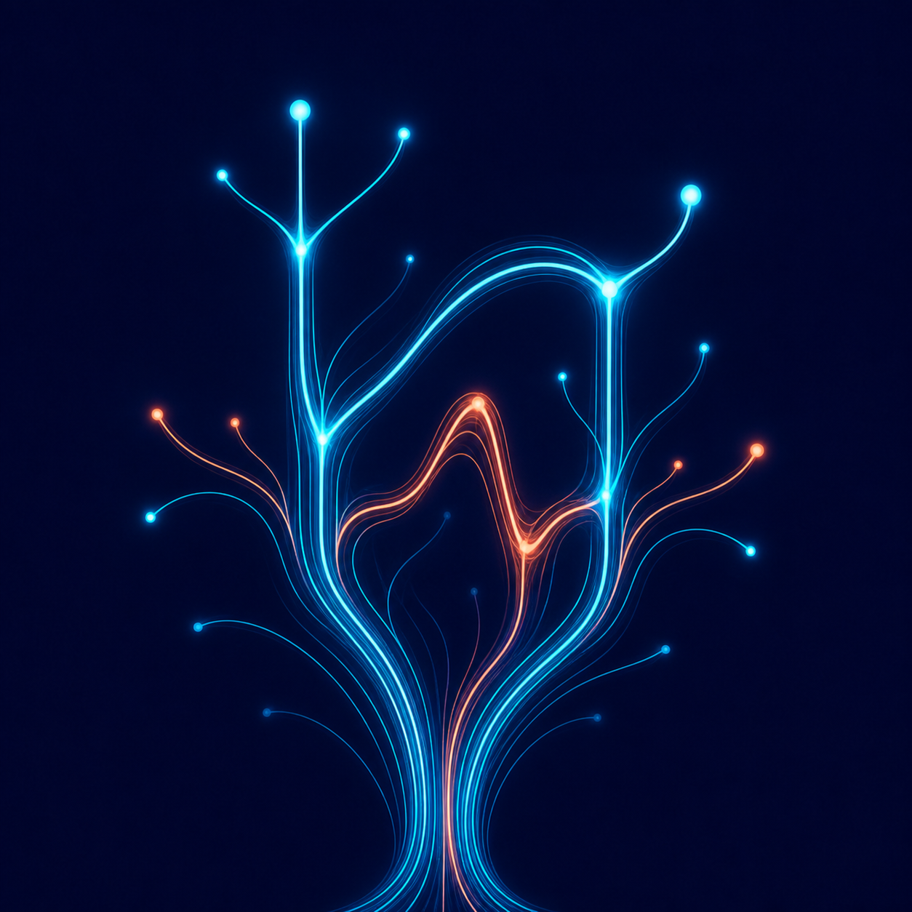
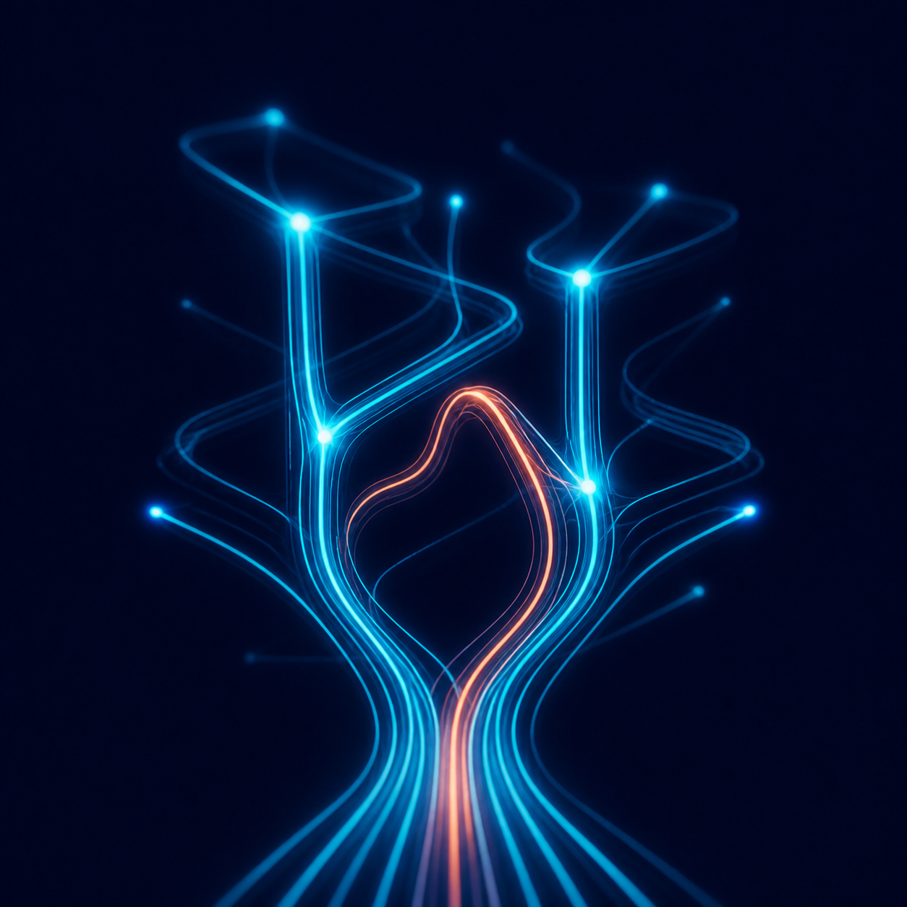
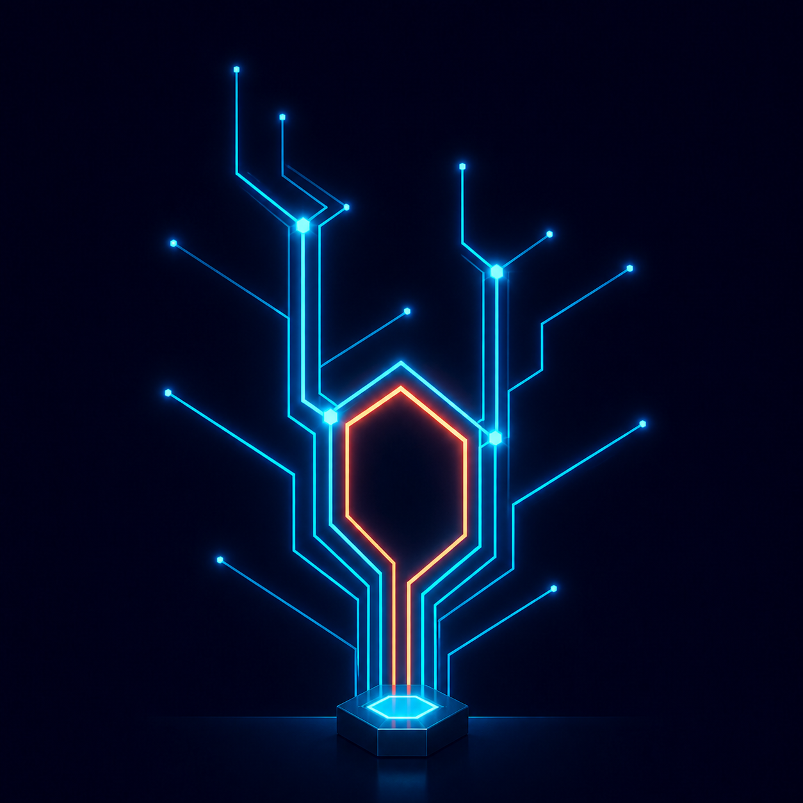
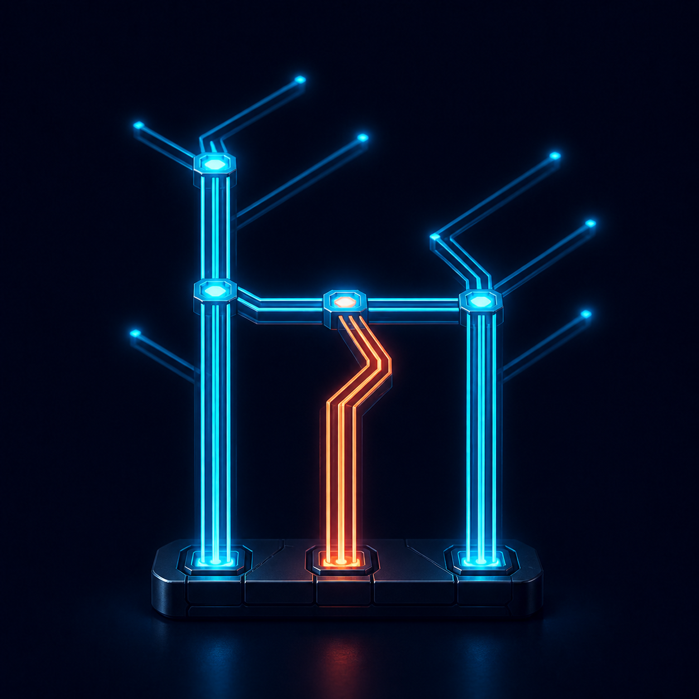
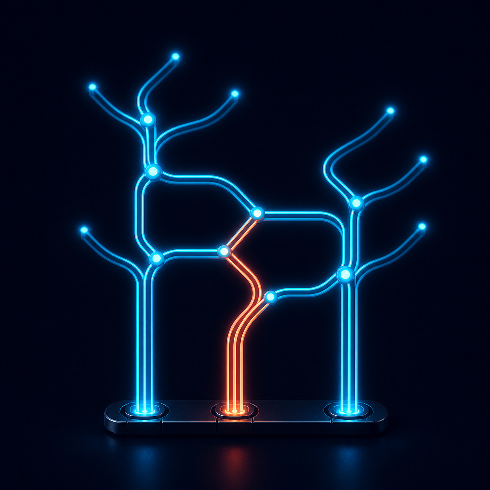

# hgraph Development plugin logo concepts

This directory preserves the generated logo directions considered for the
hgraph Development plugin. They live outside the plugin package so design
history remains versioned without increasing the installed bundle size.

The active plugin logo is
[`plugins/hgraph-development/assets/logo.png`](../../../plugins/hgraph-development/assets/logo.png).
Do not remove these alternatives unless the branding direction has been
explicitly retired.

## 02 — Branching attractor

A luminous root bundle that branches into alternate timelines. This version
retains the clearest organic lowercase `h` silhouette.

## 03 — Three-dimensional worldlines

The root bundle separates across foreground, middle, and rear spatial planes.
It provides the strongest sense of worldlines diverging in depth.

## 04 — Rigid source node

Straight architectural rails originate from a single grounded hexagonal graph
source. This preserves branching while replacing soft curves with explicit
junctions and angular paths.

## 05 — Rigid manifold

Three anchored ports in a solid data manifold feed a rigid lowercase `h`. This
is the most grounded and legible direction, with a more engineered character.

## 06 — Soft branch and join

The grounded three-port manifold remains, while rounded rails split and
reconverge through smaller luminous graph nodes. The coral timeline crosses a
separate path and joins the cyan topology, making fan-out and fan-in explicit
without returning to the organic tree treatment.

## 07 — Aligned directed flow

Three inputs originate from one grounded base and flow upward through aligned
spherical split and join nodes. Bezier paths recombine in different orders
into three outputs, while dim cobalt branches terminate as time-faded dangling
edges. The coral active path remains traceable from its input through the
directed acyclic topology.

## 08 — Transforming joins

Three grounded input colours converge and terminate at a violet transformation
node, from which a new violet result emerges. A separate violet split preserves
that result's identity, while a later join consumes violet and retained input
branches to produce a single gold result. The topology therefore reduces three
inputs to two outputs and distinguishes computation from paths merely touching.

## Generation notes

All concepts were generated with the built-in image tool using the active logo
or the preceding concept as an edit target. The prompts consistently required
an original composition, a midnight navy/cyan/coral palette, no text or
recognizable anime elements, and legibility at plugin-icon sizes.
