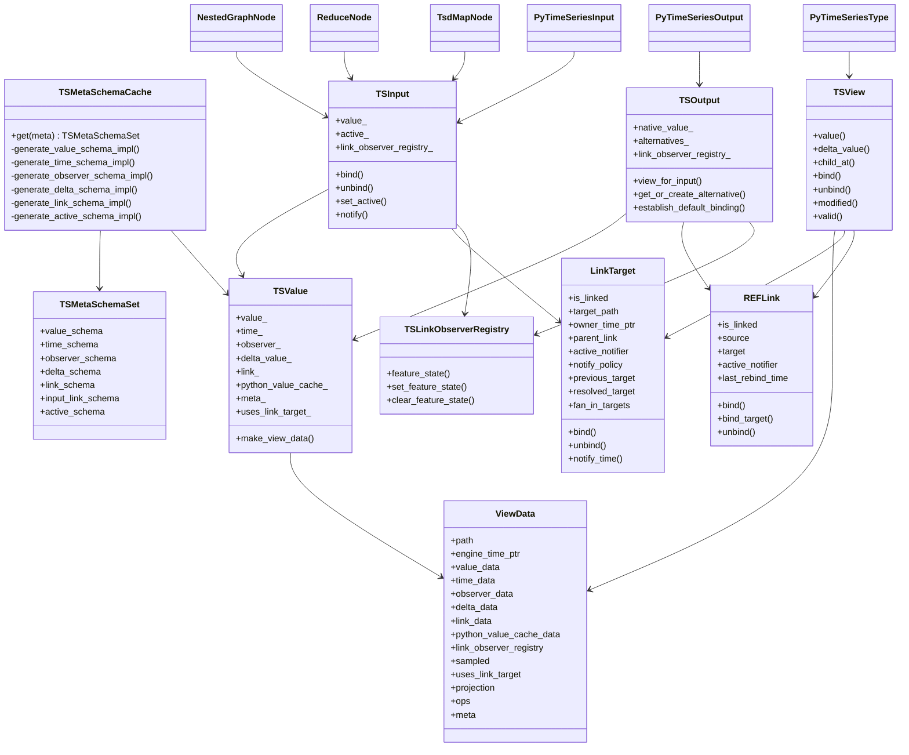

# TS Value Implementation Review Against The Previous Branch

## Scope

This note reviews the `ts_value` design documents in `docs/design/ts_value/design/` and compares them with the implementation on the previous branch, `origin/ts_value_26_02`.

The main implementation sources reviewed were:

- `cpp/include/hgraph/types/time_series/`
- `cpp/src/cpp/types/time_series/`
- `cpp/include/hgraph/nodes/`
- `cpp/src/cpp/nodes/`
- `cpp/include/hgraph/api/python/`
- `cpp/src/cpp/api/python/`
- `hgraph_unit_tests/ts_tests/`

Throughout this document, `TargetLink` refers to the input-side `LinkTarget` implementation type, because that is the concrete runtime object used in the previous branch.

## Implementation UML

## Main Deviations From The Design

| Area | Design intent | Previous-branch implementation | Impact |
| --- | --- | --- | --- |
| Link placement | Input links are emphasized for `TSB`, `TSL`, and `TSD`, with scalar `TS[T]` effectively not participating in link storage | `TSMetaSchemaCache::generate_link_schema_impl()` builds link payloads for scalar, window, set, signal, and ref shapes as well | The runtime uses a more uniform "everything has a link slot" model, which simplifies dispatch but increases payload surface area |
| TSOutput alternatives | The design describes alternatives as selective casts with `REFLink` at positions that need REF dereference and a structural observer for dynamic collections | `TSOutput::establish_default_binding()` recursively binds a whole alternative tree up front, and there is no `AlternativeStructuralObserver` implementation in the branch | Alternative maintenance is more path/link driven than observer-driven, and the documented sync strategy is not the one in code |
| REFLink shape | The design gives `REFLink` a rich dual-chain role similar to `LinkTarget`, including owner time propagation and parent chaining | `REFLink` is relatively thin: `source`, `target`, `active_notifier`, and `last_rebind_time`; much of the hard REF behavior lives in `ts_ops` helpers instead | REF semantics are implemented, but responsibility is distributed across helpers rather than encapsulated in `REFLink` itself |
| Peered vs un-peered | The design frames this mostly as access semantics over one structural model | The implementation adds explicit runtime state like `LinkTarget::peered`, fan-in tracking, and parent/child bind teardown rules in `op_bind()` | Binding mode becomes a concrete runtime state machine, not just an interpretation of timestamps |
| TSW delta | The design says `TSW` does not need delta tracking | `TSMetaSchemaCache::generate_delta_schema_impl()` creates a delta payload for `TSW` | The runtime has already extended beyond the documented delta model |
| Runtime feature state | The design mostly discusses links, timestamps, observers, and deltas | The code adds `TSLinkObserverRegistry` feature-state buckets for removed-child snapshots, visible-key history, and unbound REF item changes | Several semantics needed for parity are implemented as endpoint-scoped extensions rather than first-class parts of the base design |
| Fixed-size TSL binding | The design leans toward collection-level binding for `TSL` | Fixed-size `TSL` binds are child-driven in both input and output setup, with container links frequently left intentionally unbound | Static collections behave closer to `TSB` than the design narrative suggests |

## What The Previous Branch Actually Optimized For

The previous branch did not merely implement the design literally. It optimized for three practical constraints:

1. A single `TSView` / `ViewData` abstraction that can serve native values, input-bound values, output alternatives, and Python wrappers.
2. Python runtime parity, including edge cases that only show up when the Python API asks questions such as "what output is this input bound to right now?" or "what was the removed child value on this tick?"
3. Dynamic graph behavior, especially keyed nested graphs, where the binding target can disappear, reappear, or change identity during the same runtime tick.

That is why the implementation is more helper-heavy than the design. The design captures the major objects, but the branch adds substantial machinery around path resolution, previous-target snapshots, feature-state registries, and active/passive notification policy.

## Core Challenges In Implementing The Design

### 1. The design understates how much schema generation is needed

The design talks about the five parallel schemas, but the implementation actually needs at least seven runtime shape families in practice:

- value
- time
- observer
- delta
- output link
- input link
- active-state

That expansion is visible in `TSMetaSchemaCache`. The extra schemas are not cosmetic. `TSInput` cannot implement activation and selective notification without an `active_` tree, and input/output link storage are different because the runtime treats `LinkTarget` and `REFLink` differently.

### 2. The real problem is not linking, it is identity preservation

The hard part is preserving the identity of a target across:

- direct local values
- bound targets
- REF payload dereference
- previous targets
- sampled views
- dynamic container churn

The code ends up with a family of resolution helpers such as:

- `resolve_bound_target_view_data()`
- `resolve_previous_bound_target_view_data()`
- `resolve_effective_view()`
- `compare_binding_targets()`

Those helpers are the real semantic core. Without them, nested graphs and the Python API cannot tell whether a rebind is a meaningful source change or just another view of the same target.

### 3. Notification policy is a state machine, not a boolean

The design explains the dual notification chains well, but the implementation shows that "notify or not" is not a simple active/passive decision. `LinkTarget` carries policy bits for cases such as:

- REF wrapper to non-REF target
- SIGNAL inputs bound through wrappers
- wrapper-local writes that should not retrigger the observer
- signal descendant fan-in

This is a direct consequence of supporting Python semantics and dynamic rebinding while still delivering efficient O(1) `modified()` and `valid()` queries.

### 4. Feature extensions became necessary for parity

Several important behaviors are implemented as endpoint-owned extension state in `TSLinkObserverRegistry`:

- removed TSD child snapshots
- visible TSD key history
- unbound REF item changes

These are not design accidents. They exist because the base time/link/delta model is not sufficient to answer higher-level semantic questions once dynamic containers and REF rebinding are involved.

### 5. The implementation had to absorb Python-specific semantics

The previous branch is not just a C++ runtime. It is also a compatibility layer for the Python authoring model. That introduces requirements the design only hints at:

- Python-facing `value` and `delta_value` must match historical behavior
- `None`, `REMOVE`, and partial mapping deltas must round-trip correctly
- wrappers must expose parent/child navigation and current binding targets
- wrapper instances must choose their Python type from the effective bound shape, not just the nominal declared shape

This is one reason the `ts_ops` layer is split into many files. Conversion, delta emission, binding, projection, and ref payload handling all influence one another.

## Nested Graphs: Why They Are Harder Than The Base Design Suggests

Nested graphs are where the model stops being "a TSInput is bound to a TSOutput" and becomes "a graph instance keeps rebinding a subgraph as the outer graph evolves."

### What the code does

The branch uses several layers for nested execution:

- `NestedGraphNode` wires outer inputs into an inner graph by binding the inner `"ts"` input directly to the outer view.
- `ReduceNode` and `TsdMapNode` create and destroy nested graph instances keyed by dynamic container content.
- `NestedEvaluationEngine` and key-specific evaluation clocks preserve graph-local scheduling while still deferring to the outer engine.
- `node_binding_utils.h` provides the effective-target comparison and fallback machinery needed to decide when rebinding is actually necessary.

### Additional challenges not explicit in the design

#### Binding must be stable across changing outer representations

For nested graphs, the inner node often does not care whether its source came from:

- a direct outer child
- a bound outer child
- a REF payload target
- a fallback local snapshot

The nested runtime therefore compares effective targets, not just nominal paths. That is why `compare_binding_targets()` and `resolve_effective_view()` are so prominent.

#### Dynamic keyed graphs need fallback state

`ReduceNode` and `TsdMapNode` both have local fallback storage (`local_key_values_`, `local_input_values_`, `local_output_values_`) because dynamic-key deltas are not always sufficient to keep the inner graph meaningful during removals, rebinding, or partial updates.

This is a major implementation reality not captured by the original design. Once a keyed nested graph exists, simply removing the outer binding is often too destructive. The runtime sometimes needs a temporary local `TSValue` to keep delta semantics coherent for one more evaluation.

#### Key deltas are often not enough

The design makes dynamic container deltas sound authoritative. The code shows otherwise:

- keyed nodes often fall back from incremental delta handling to full snapshot reconciliation
- ref-valued `TSD` inputs are especially awkward because key existence and value-target validity can diverge
- projected key sets can produce unstable transient views, so some paths deliberately force full diffs

#### Scheduling crosses graph boundaries

The nested graph code must decide when an outer change should reschedule:

- one keyed inner graph
- all keyed inner graphs
- or none, because the effective target did not really change

That is why multiplexed arguments are explicitly made active on the outer `TsdMapNode`, and why each nested map graph gets its own derived evaluation clock keyed by `value::Value`.

## Reference Management

Reference handling is the hardest part of the implementation because it has to combine link semantics, path semantics, activation semantics, and Python semantics.

### TargetLinks (`LinkTarget`)

The design presents `LinkTarget` mainly as a bound-target payload plus notification wrapper. In the previous branch it is more than that.

`LinkTarget` carries:

- raw target pointers and metadata
- owner-local timestamp propagation state
- active notifier state
- policy bits controlling notification behavior
- previous target snapshots
- resolved target snapshots
- fan-in targets for signal-descendant cases

That makes `LinkTarget` a hybrid object:

- part structural cache
- part notification endpoint
- part rebinding journal

The implementation difficulty is that only some of this state is copied during rebinding. The target-data portion can be replaced, but owner-local fields such as `owner_time_ptr`, `parent_link`, and active-subscription state must survive rebinding. The code therefore has careful copy/move logic in `link_target.cpp` and additional lifecycle handling in `op_bind()` / `op_unbind()`.

### RefLinks (`REFLink`)

The design treats `REFLink` as the core dereference object for output alternatives. The implementation uses `REFLink`, but its actual responsibilities are spread out.

The concrete `REFLink` struct is thin. The harder logic lives in helpers such as:

- `resolve_ref_payload_from_view()`
- `apply_ref_payload()`
- `op_from_python_ref()`
- `resolve_previous_bound_target_view_data()`

That split makes sense in practice because REF behavior depends on more than the current link:

- whether the wrapper itself changed
- whether the resolved target changed
- whether the new target is valid
- whether the change should be sampled
- whether Python should observe a wrapper-local change or a target-local change

### Specific implementation difficulties

#### 1. Distinguishing wrapper change from target change

When a REF output points to a different target that happens to have the same current value, consumers still need to observe a meaningful source change. The code therefore tracks rebind time and previous targets separately from raw target values.

#### 2. Preserving removed-child semantics for dynamic containers

For `TSD` children accessed through refs, removal is not just "the key is gone." The runtime may still need the removed child snapshot for the current tick. That led to the removed-child snapshot feature state in `TSLinkObserverRegistry`.

#### 3. Handling unbound composite references

For unbound composite refs, especially lists and bundles, the runtime needs to remember which items changed even when there is no bound output. That is why REF item-change tracking became another feature-state extension.

#### 4. REF plus SIGNAL is special

Signal semantics are particularly awkward when the signal is driven through a REF wrapper or a projected key-set view. The policy bits on `LinkTarget` show that the implementation had to treat these as first-class cases rather than as incidental consequences of generic link logic.

## Integration With Python

Python integration is not a thin wrapper over C++. It materially shaped the implementation.

### View-first wrapper model

The Python layer is built around `TSView`, `TSInputView`, and `TSOutputView`, not around separate Python-only runtime state. `PyTimeSeriesType`, `PyTimeSeriesInput`, and `PyTimeSeriesOutput` all hold view objects directly.

That is a strong design choice:

- Python wrappers stay close to the C++ runtime model
- parent/child navigation remains path-based
- binding and activation can be forwarded into the same runtime objects used by C++

### Wrapper dispatch uses effective runtime shape

`wrapper_factory_ts_views.cpp` dispatches wrappers by runtime `TSKind`, and for inputs it can dispatch using an explicit effective metadata shape. That matters because the wrapper type a Python user expects is often the type of the bound target, not the nominal declared input meta.

This is especially important for:

- REF inputs bound to non-REF outputs
- nested-graph wiring
- alternative output views

### Python parity drove private runtime helpers

`py_ts_runtime_internal.cpp` adds private bindings for behaviors that the public model alone could not express cleanly:

- dynamic TSD REF outputs
- TSS contains/is-empty runtime outputs
- link-payload inspection and path projection helpers

Those are effectively runtime feature adapters. They exist because the Python API asks semantically rich questions that require more than the base `TSView` interface.

### Python conversion and caching are cross-cutting

The branch also introduces a Python value cache in `TSValue`, plus widespread cache invalidation around binding, rebinding, `from_python()`, and `apply_result()`. That is another implementation concern mostly absent from the design docs.

### Tests show Python compatibility is part of the contract

The reviewed tests make it clear that the implementation target is not just type correctness. It is behavior parity:

- `hgraph_unit_tests/ts_tests/test_ref_behavior.py`
- `hgraph_unit_tests/ts_tests/test_runtime_trace_harness.py`

The runtime trace harness is especially important. It treats the Python runtime as the reference behavior and compares C++ traces against it. That is a stronger requirement than the design documents alone convey.

## Summary

The previous branch does implement the broad architecture described in the design:

- schema-derived parallel storage
- type-erased `TSView`
- endpoint-level `TSInput` / `TSOutput`
- inline link payloads
- explicit REF handling

But the implementation reality is more operational than the design:

- more schemas
- more path resolution
- more feature-state extensions
- more explicit policy around activation and rebinding
- much heavier accommodation of nested graphs and Python behavior

The major lesson for the new code base is that the next design iteration should treat the following as first-class concerns rather than emergent details:

1. effective-target identity resolution
2. endpoint-scoped runtime feature state
3. fixed-container peering vs child binding rules
4. nested-graph fallback state and reconcile strategy
5. Python-facing semantics as a hard compatibility contract
