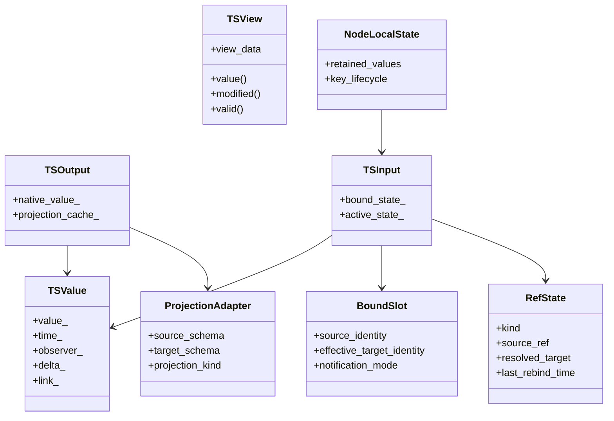

# Simplified Runtime Direction

## Purpose

This document updates the `ts_value` design after reviewing the previous branch implementation.

The previous branch demonstrated real runtime requirements, but it also demonstrated failure modes:

- too much implicit state
- too much fallback behavior in generic infrastructure
- too much duplicated logic across links, refs, alternatives, and wrappers
- too much coupling between Python compatibility and core runtime behavior

This document is the clean implementation direction for the next iteration.

## Design Position

The runtime must support the following real requirements:

1. input/output binding
2. REF rebinding
3. dynamic containers
4. nested graphs
5. Python parity

But it must do so with a smaller and more explicit model than the previous branch.

## Core Principles

### 1. One native runtime model

`TSValue` remains the owning runtime representation.

It still owns parallel structures:

- value
- time
- observer
- delta
- link

However:

- the core runtime should avoid building persistent alternative trees that recursively mirror the native tree
- schema conversion should happen through explicit adapters or projections
- adapters should be created only where a real runtime consumer needs them

This removes a major source of duplication and lifecycle complexity.

### 2. Core runtime state must be explicit

The core runtime must not hide behavior inside generic "fallback" logic.

If a behavior needs state, it must be modeled directly as one of:

- endpoint state
- link state
- adapter state
- node-local state

This means:

- no generic fallback `TSValue` caches in the base binding layer
- no hidden semantic extensions unless they are elevated into the design
- no "try many paths until something works" binding model

### 3. Binding is about effective target identity

The previous branch proved that "bound/unbound" is not enough.

The runtime needs a clean concept of:

- nominal source
- effective target
- target identity change

This should be explicit in the design.

Proposed rule:

- every binding-capable runtime object exposes a cheap identity comparison for its effective target
- rebinding logic uses that identity directly
- nested-graph wiring compares identities rather than replaying generic fallback resolution

### 4. Nested graphs are a first-class design input

The design must be easy to implement for:

- `NestedGraphNode`
- `ReduceNode`
- `TsdMapNode`
- future keyed graph operators

That means:

- graph-boundary binding is an explicit part of the model
- keyed graph lifecycle is explicit
- removal and rebinding semantics are explicit
- node-owned retained state is allowed where the operator semantics require it

This is preferable to pushing keyed-graph edge cases down into generic `TSView` or generic binding helpers.

### 5. Python is an adapter client, not the architect of the core runtime

Python parity remains mandatory.

But the correct architectural response is:

- design explicit core runtime primitives that Python needs
- implement wrapper behavior on top of those primitives
- do not let Python edge cases force generic fallback logic into the heart of the runtime

If a Python-visible behavior is required, it must be represented as an explicit runtime contract.

## Simplified Object Model

## Proposed Simplifications By Area

### Links and binding

Retain:

- explicit link payloads
- active/passive input state
- timestamp propagation

Simplify:

- reduce link state to the minimum necessary for rebinding and notification
- separate structural state from semantic state
- define peered vs un-peered as an explicit input binding mode, not as emergent behavior scattered across bind helpers

Avoid:

- fan-in and policy-bit growth unless each policy is part of the public runtime model
- duplicated binding rules for special Python or REF cases unless represented in the design as named binding modes

### REF handling

Retain:

- REF may point to a target that changes over time
- sampled semantics on target identity change
- composite REF support

Simplify:

- model REF state explicitly as a small state machine
- centralize REF resolution and rebind semantics in one runtime component
- make "previous target" and "current resolved target" explicit parts of the ref model when needed

Avoid:

- splitting REF semantics across many helper files without a single conceptual owner

### TSOutput adaptation

Retain:

- an output may need to serve consumers with a different effective schema

Simplify:

- replace recursive eager alternative trees with explicit projection adapters
- adapters should be local to the required conversion boundary
- structural sync should be an adapter responsibility, not a hidden property of all outputs

Avoid:

- maintaining many mirrored `TSValue` trees per output
- generic alternative sync machinery unless a concrete adapter requires it

### Nested graphs

Retain:

- keyed graph creation and destruction
- graph-local clocks
- graph-boundary input/output wiring

Simplify:

- define graph-boundary binding as a dedicated operation
- keep keyed retained state on the node that owns keyed semantics
- use explicit target identity comparison to decide whether a nested input must rebind

Avoid:

- generic fallback caches in the shared runtime just to make keyed operators work

### Python integration

Retain:

- view-based wrappers
- wrapper dispatch by runtime time-series kind
- parity with Python behavior

Simplify:

- expose explicit runtime queries needed by Python:
  - effective bound target
  - current ref state
  - previous target when sampled semantics require it
  - removed-child snapshots, if they remain part of the contract

Avoid:

- wrapper-driven side channels that mutate generic runtime behavior without being documented in the core design

## Explicit Non-Goals

The next implementation should not attempt to be:

1. maximally generic
2. fully automatic for every schema conversion case
3. driven by hidden fallback heuristics

Those goals produced the complexity seen in the previous branch.

The target is:

1. clear invariants
2. explicit state ownership
3. operator-friendly nested-graph behavior
4. faithful Python parity
5. code that can be maintained by humans

## Required Invariants

Any implementation derived from this design should preserve these invariants:

1. Binding and unbinding must be explicit operations with explicit lifecycle.
2. Effective target identity comparison must be cheap and deterministic.
3. Node scheduling must not depend on hidden fallback reads.
4. If removal snapshots are required, their ownership and lifetime must be explicit.
5. Python-visible semantics must map to explicit runtime concepts.
6. Nested-graph operators may own retained keyed state, but the generic runtime should not own operator-specific fallback state.

## Relationship To Existing Design Documents

This document refines and partially supersedes parts of:

- `04_LINKS_AND_BINDING.md`
- `05_TSOUTPUT_TSINPUT.md`

Specifically:

- eager recursive alternative trees are no longer the preferred direction
- generic fallback-heavy binding logic is explicitly rejected
- nested-graph and Python concerns are now treated as primary design inputs

The remaining design documents should be updated over time to align with this direction.
