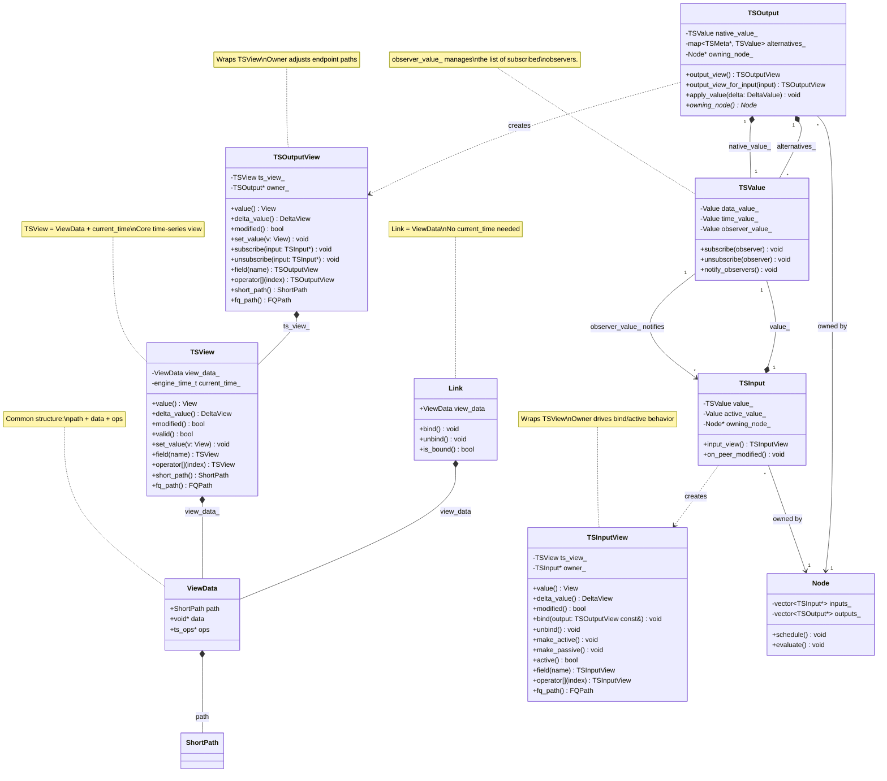
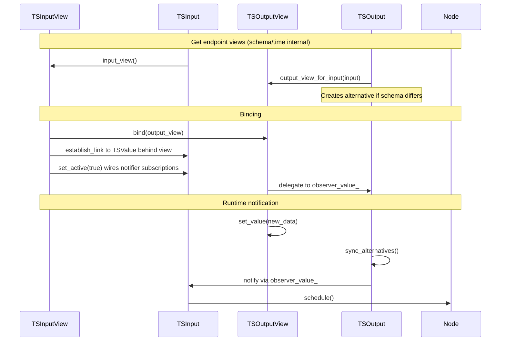
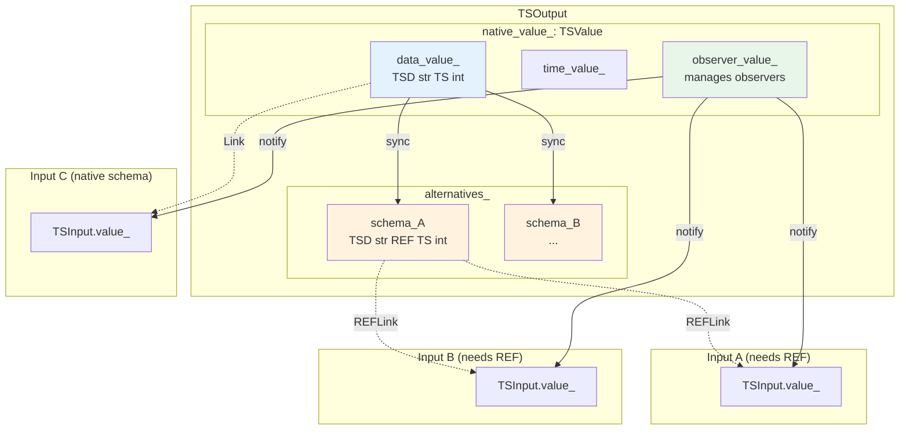
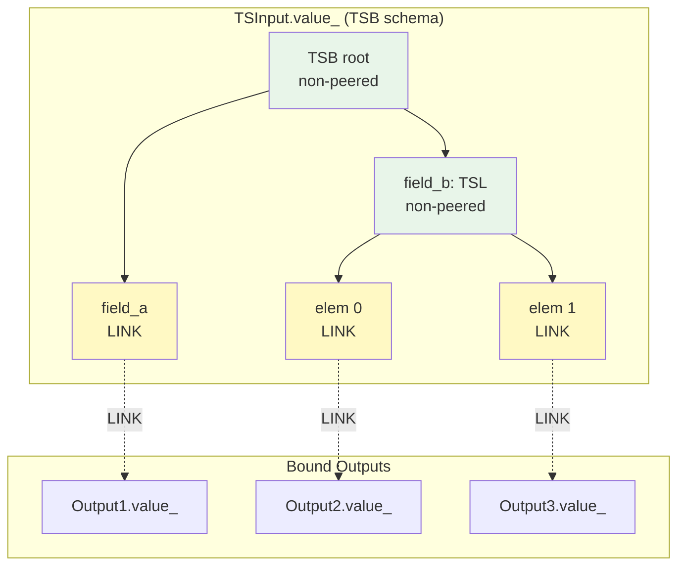
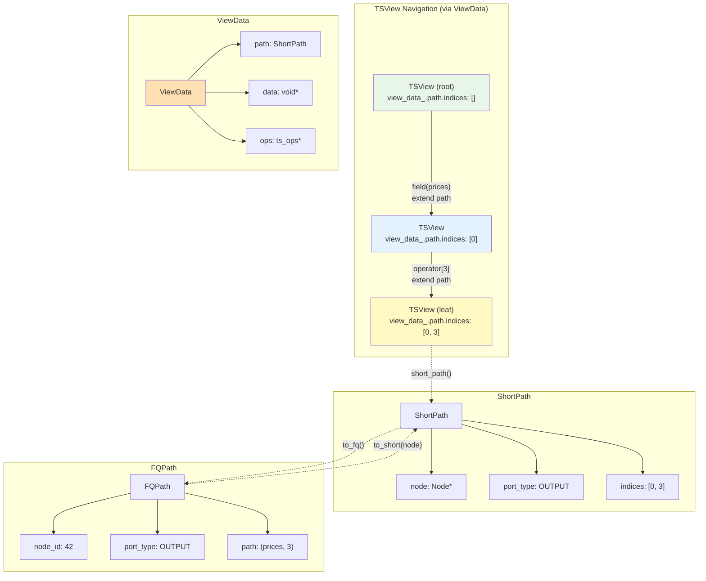
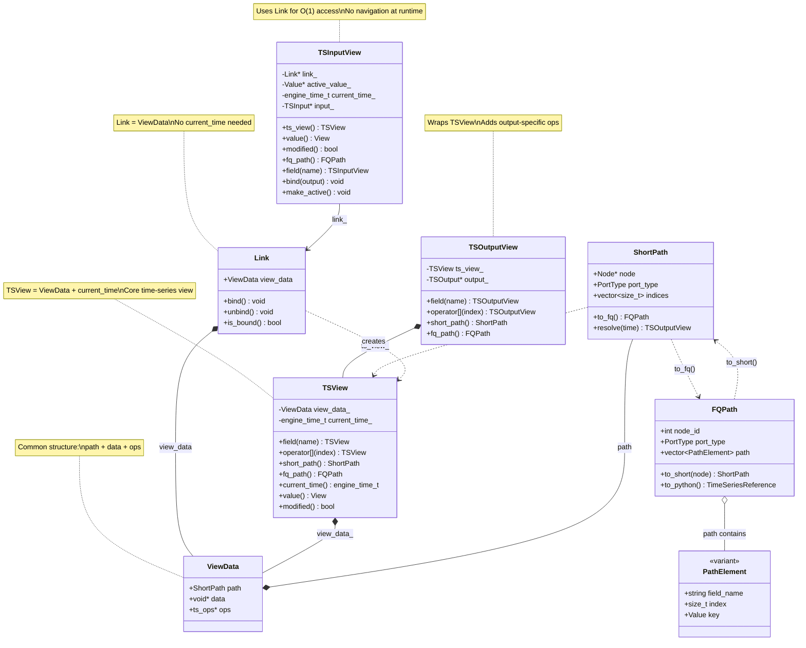
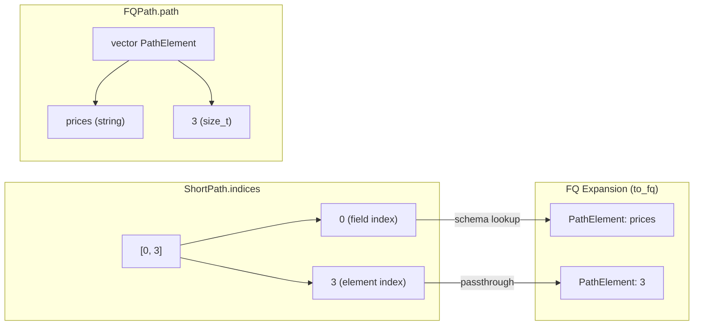
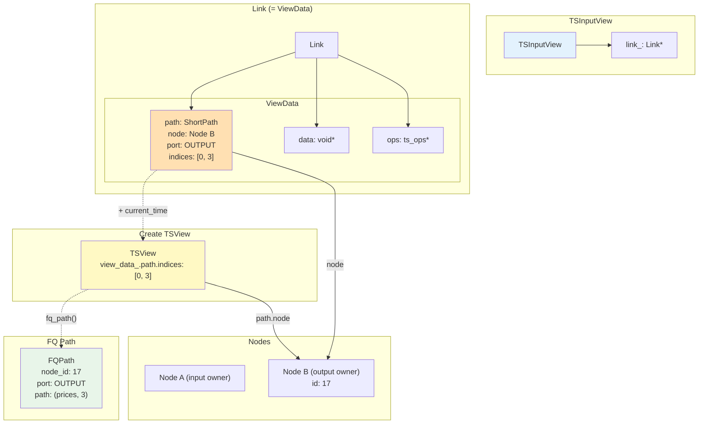

# TSOutput and TSInput: Graph Endpoints

**Parent**: [Overview](00_OVERVIEW.md)

---

## Overview

TSOutput and TSInput are the **graph endpoints** - dedicated objects that connect nodes to the data flow network. They are **not** lightweight TSValue wrappers but rather specialized objects with distinct responsibilities, composed from TSValue while exposing their own API.

- **TSOutput**: The data source - owns and publishes values, manages alternative representations
- **TSInput**: The data consumer - binds to outputs, controls notification subscription

Both utilize [Links](04_LINKS_AND_BINDING.md) internally for their binding behavior.

---

## TSOutput: The Data Source

### Structure

TSOutput owns and manages **multiple representations** of its data:

```
┌─────────────────────────────────────────────────────────────┐
│  TSOutput                                                    │
│                                                              │
│  ┌──────────────────────────────────────────────────────┐   │
│  │  native_value_: TSValue                              │   │
│  │  (native schema of the output)                       │   │
│  │                                                       │   │
│  │  Contains:                                           │   │
│  │  ├── data_value_                                     │   │
│  │  ├── time_value_                                     │   │
│  │  └── observer_value_ ← Manages observer list         │   │
│  └──────────────────────────────────────────────────────┘   │
│                                                              │
│  ┌──────────────────────────────────────────────────────┐   │
│  │  alternatives_: map<TSMeta*, TSValue>                │   │
│  │                                                       │   │
│  │  schema_A → TSValue (cast representation)            │   │
│  │  schema_B → TSValue (cast representation)            │   │
│  │  ...                                                  │   │
│  └──────────────────────────────────────────────────────┘   │
│                                                              │
│  ┌──────────────────────────────────────────────────────┐   │
│  │  owning_node_: Node*                                 │   │
│  └──────────────────────────────────────────────────────┘   │
│                                                              │
│  Core API:                                                   │
│    output_view() → TSOutputView                              │
│    output_view_for_input(input) → TSOutputView               │
│    apply_value(DeltaValue)                                  │
│                                                              │
│  TSOutputView API (type-erased):                            │
│    value(), delta_value(), modified(), valid()              │
│    set_value(), apply_delta()                               │
│    Navigation: field(), operator[]                          │
│    (does NOT support: bind, make_active/passive)            │
└─────────────────────────────────────────────────────────────┘
```

**Note**: TSOutput endpoint access uses the owning node's cached `current_time` pointer internally. Schema selection for alternatives is internal to TSOutput (`output_view_for_input(input)`), not exposed as a schema argument on endpoint view APIs.

### Responsibilities

1. **Own the native value**: The primary TSValue in the output's declared schema
2. **Manage alternative representations**: Created on-demand when inputs require different schemas (cast)
3. **Keep alternatives in sync**: When native value changes, propagate to all alternatives
4. **Notify observers**: When modified, notify all subscribed inputs

### Native Value

The native value is always present and represents the output's declared type:

```cpp
class TSOutput {
    TSValue native_value_;  // Always exists, schema matches output's declared type
    std::map<const TSMeta*, TSValue> alternatives_;
    Node* owning_node_;

public:
    TSOutput(const TSMeta& ts_meta, Node* owner)
        : native_value_(ts_meta), owning_node_(owner) {}

    // Endpoint access (time comes from owning node)
    TSOutputView output_view();
    TSOutputView output_view_for_input(const TSInput& input);

    // Bulk mutation via delta (applies to native, syncs to alternatives)
    void apply_value(const DeltaValue& delta) {
        native_value_.apply_delta(delta);
        sync_alternatives();
    }

    Node* owning_node() const { return owning_node_; }

private:
    TSValue& get_or_create_alternative(const TSMeta& schema) {
        auto it = alternatives_.find(&schema);
        if (it != alternatives_.end()) {
            return it->second;
        }
        auto& alt = alternatives_.emplace(&schema, TSValue(schema)).first->second;
        establish_sync(native_value_, alt);
        return alt;
    }
};

// TSOutputView wraps TSView, adds output-specific operations
class TSOutputView {
    TSView ts_view_;                // Core view (ViewData + current_time)
    TSOutput* output_;              // For subscription management

public:
    // Delegates to TSView for data access
    View value() { return ts_view_.value(); }
    DeltaView delta_value() { return ts_view_.delta_value(); }
    bool modified() { return ts_view_.modified(); }
    bool valid() { return ts_view_.valid(); }

    // Output-specific mutation
    void set_value(View v) { ts_view_.set_value(v); }
    void apply_delta(DeltaView dv) { ts_view_.apply_delta(dv); }

    // Observer management (delegates to observer_value_)
    void subscribe(Notifiable* observer);
    void unsubscribe(Notifiable* observer);

    // Navigation - wraps TSView navigation
    TSOutputView field(std::string_view name);
    TSOutputView operator[](size_t index);
    TSOutputView operator[](View key);
};
```

### Alternative Representations (Cast)

When an input's schema differs from the output's native schema, `output_view_for_input(input)` automatically creates and returns a view of an alternative representation:

```cpp
// Input needs TSD[str, REF[TS[int]]] but output is TSD[str, TS[int]]
TSOutputView out_view = output.output_view_for_input(input);
// Internally creates alternative if needed, returns view of it

// Multiple inputs with same cast requirement share the alternative
TSOutputView view1 = output.output_view_for_input(input1);  // Same alternative
TSOutputView view2 = output.output_view_for_input(input2);  // Same alternative
```

Alternatives are indexed by schema pointer, allowing multiple inputs with the same cast requirement to share a single alternative representation. The `view()` method encapsulates the get-or-create logic.

### Observer Management

Observer management is handled by TSValue's `observer_value_` component. The `TSOutputView` exposes subscription methods:

```cpp
// Usage via view
TSOutput output(ts_meta);
TSOutputView view = output.output_view();

// Subscribe/unsubscribe through the view
view.subscribe(input_ptr);
view.unsubscribe(input_ptr);

// Internally, TSOutputView delegates to observer_value_
class TSOutputView {
public:
    void subscribe(Notifiable* observer) {
        // Delegates to TSValue's observer_value_
        get_ts_value()->subscribe(observer);
    }

    void unsubscribe(Notifiable* observer) {
        get_ts_value()->unsubscribe(observer);
    }
};
```

---

## TSInput: The Data Consumer

### Structure

TSInput owns a **single TSValue** representing its view of bound data:

```
┌─────────────────────────────────────────────────────────────┐
│  TSInput                                                     │
│                                                              │
│  ┌──────────────────────────────────┐                       │
│  │  value_: TSValue                 │                       │
│  │  (input's schema)                │                       │
│  │                                  │                       │
│  │  Structure:                      │                       │
│  │  ├── non-peered nodes (local)    │                       │
│  │  └── LINK leaves → output values │                       │
│  └──────────────────────────────────┘                       │
│                                                              │
│  ┌──────────────────────────────────────────────────────┐   │
│  │  active_value_: Value                                │   │
│  │  (schema mirrors TS schema structure)                │   │
│  │                                                       │   │
│  │  Tracks active/passive state at each level:          │   │
│  │  ├── TSB[a, b] → Bundle[a: bool, b: ...]            │   │
│  │  ├── TSL[TS[T], N] → List[bool, N]                  │   │
│  │  └── TS[T] → bool (leaf)                            │   │
│  └──────────────────────────────────────────────────────┘   │
│                                                              │
│  ┌──────────────────────────────────┐                       │
│  │  owning_node_: Node*             │  ← For scheduling     │
│  └──────────────────────────────────┘                       │
│                                                              │
│  Core API:                                                   │
│    input_view() → TSInputView                                │
│                                                              │
│  TSInputView API (type-erased):                             │
│    value(), delta_value(), modified(), valid()              │
│    bind(), unbind()                                         │
│    make_active(), make_passive(), active()                  │
│    Navigation: field(), operator[]                          │
│    (does NOT support: set_value, subscribe/unsubscribe)     │
└─────────────────────────────────────────────────────────────┘
```

**Note**: The `active_value_` mirrors the TS schema structure, allowing active/passive state to be tracked at each level of a composite input. TSInput also carries a `port_index` (default `0`) so endpoint path conversion can include input-port identity when configured, without exposing that detail through the view API.

### Responsibilities

1. **Own local structure**: The TSValue contains non-peered nodes for the input's schema
2. **Maintain LINKs**: Leaf nodes are LINKs pointing to bound output values
3. **Control subscription**: Active/passive state determines notification behavior
4. **Schedule owning node**: When notified, schedule the node for evaluation

### Value Structure

The input's TSValue has a mixed structure:
- **Non-peered nodes**: Internal structure (bundles, lists, etc.) owned locally
- **LINK leaves**: Terminal nodes that point to output values

```
Input Schema: TSB[a: TS[int], b: TSL[TS[float], 2]]

TSInput.value_:
├── TSB (non-peered, local)
│   ├── a: LINK → Output1.native_value_.a
│   └── b: TSL (non-peered, local)
│       ├── [0]: LINK → Output2.native_value_
│       └── [1]: LINK → Output3.native_value_
```

### Binding

When an input binds to an output, it establishes LINKs from its leaf nodes to the appropriate output values. Binding is done through the `TSInputView`:

```cpp
class TSInput {
    TSValue value_;
    Value active_value_;  // Mirrors TS schema, tracks active state at each level
    Node* owning_node_;

public:
    // Endpoint access (time comes from owning node)
    TSView view();
    TSInputView input_view();
};

// TSInputView wraps TSView + TSInput owner
class TSInputView {
    TSInput* owner_;
    TSView ts_view_;

public:
    // Delegates to TSView
    View value() const { return ts_view_.value(); }
    DeltaView delta_value() const { return ts_view_.delta_value(); }
    bool modified() const { return ts_view_.modified(); }
    bool valid() const { return ts_view_.valid(); }

    // Input-specific binding/activation
    void bind(const TSOutputView& output);
    void unbind();
    void make_active();
    void make_passive();
    bool active() const;

    // Navigation
    TSInputView field(std::string_view name);
    TSInputView operator[](size_t index);
};

// Usage
TSInput input(input_schema, owning_node);
TSInputView in_view = input.input_view();

TSOutput output(output_schema);
// Output selects native/alternative from the input's schema internally
TSOutputView out_view = output.output_view_for_input(input);

in_view.bind(out_view);  // Establishes LINK and re-applies active wiring if needed
```

### Subscription Control

The active state controls whether the input receives notifications. Because `active_value_` mirrors the TS schema structure, active/passive can be controlled at any level of a composite input:

```cpp
// Usage via view - active state is per-path
TSInputView view = input.input_view();

// Make entire input active
view.make_active();

// Or control at finer granularity
view.field("prices").make_active();      // Only prices field active
view.field("metadata").make_passive();   // Metadata passive

// Check active state at current navigation path
bool is_active = view.active();
```

The `active_value_` structure enables fine-grained subscription control:

```cpp
// Example: TSB[prices: TSL[TS[float], 10], metadata: TS[str]]
//
// active_value_ structure:
// Bundle {
//   prices: List[bool, 10]   // Each element can be active/passive
//   metadata: bool           // Leaf active state
// }

// Making prices[3] active subscribes only to that element's output
view.field("prices")[3].make_active();
```

Internally, `make_active()` and `make_passive()` update the corresponding position in `active_value_` and notify the TS ops layer to attach/detach link observers for that path.

---

## Navigation Paths

Paths describe the location of a time-series value within the graph. Two path types are defined:

- **ShortPath**: Compact runtime format with `Node*` pointer - used in Links and for navigation
- **FQPath**: Fully qualified format with `node_id` integer - used for serialization and Python

Paths are tracked on endpoint views through TSView/ViewData. For outputs, `TSOutputView::short_path()` includes the output `port_index` as the first index. For inputs, default `port_index=0` keeps existing root-relative paths, and non-zero input ports are prefixed in endpoint paths.

### Path Types

```cpp
// ShortPath: Compact runtime path with Node* pointer
struct ShortPath {
    Node* node;                     // Owning node
    PortType port_type;             // OUTPUT, STATE, or ERROR
    std::vector<size_t> indices;    // Navigation indices

    // Convert to fully qualified path (for serialization/Python)
    FQPath to_fq() const;

    // Produce an OutputView at the given time
    TSOutputView resolve(engine_time_t current_time) const;
};

// FQPath: Fully qualified path with node_id (serializable)
struct FQPath {
    int node_id;                            // Node identifier
    PortType port_type;                     // OUTPUT, STATE, or ERROR
    std::vector<PathElement> path;          // Field names, indices, and keys

    // Convert to ShortPath given a Node* (from graph lookup)
    ShortPath to_short(Node* node) const;

    // Python representation
    nb::object to_python() const;  // Returns TimeSeriesReference
};

// PathElement: Used in FQPath for human-readable paths
using PathElement = std::variant<
    std::string,    // Field name (bundle)
    size_t,         // Index (list)
    Value           // Key (dict)
>;
```

### ShortPath Operations

```cpp
// ShortPath can resolve to an OutputView
TSOutputView ShortPath::resolve(engine_time_t current_time) const {
    // Get root output from node
    TSOutput* output = node->get_output(port_type);

    // Get root view
    TSOutputView view = output->output_view();
    view.set_current_time_ptr(&current_time);

    // Navigate using indices
    for (size_t idx : indices) {
        view = view[idx];
    }
    return view;
}

// ShortPath can expand to FQPath
FQPath ShortPath::to_fq() const {
    FQPath result{node->id(), port_type, {}};

    // Expand indices to PathElements using schema
    TSOutputView view = node->get_output(port_type)->output_view();  // Schema access only
    for (size_t idx : indices) {
        result.path.push_back(view.index_to_path_element(idx));
        view = view[idx];
    }
    return result;
}
```

### FQPath Operations

```cpp
// FQPath can convert to ShortPath given the Node*
ShortPath FQPath::to_short(Node* node) const {
    ShortPath result{node, port_type, {}};

    // Convert PathElements to indices using schema
    TSOutputView view = node->get_output(port_type)->output_view();  // Schema access only
    for (const auto& elem : path) {
        size_t idx = view.path_element_to_index(elem);
        result.indices.push_back(idx);
        view = view[idx];
    }
    return result;
}

// FQPath to Python
nb::object FQPath::to_python() const {
    // Returns TimeSeriesReference(node_id, port_type, path)
    return make_time_series_reference(node_id, port_type, path);
}
```

### TSOutputView and Path Access

TSOutputView is a graph endpoint wrapper over `TSView` with owner-aware path conversion:

```cpp
class TSOutputView {
    TSOutput* owner_;
    TSView ts_view_;

public:
    View value() const { return ts_view_.value(); }
    DeltaView delta_value() const { return ts_view_.delta_value(); }
    bool modified() const { return ts_view_.modified(); }
    bool valid() const { return ts_view_.valid(); }
    void set_value(const View& v) { ts_view_.set_value(v); }
    void apply_delta(const View& d) { ts_view_.apply_delta(d); }

    // Includes output port index as first short index.
    ShortPath short_path() const;
    FQPath fq_path() const;
};
```

`TSOutput::view()` and `TSOutput::output_view()` keep runtime TS navigation schema-local internally, then `TSOutputView::short_path()` prepends `port_index` for endpoint-visible paths (required for FQ conversion).

### TSInputView and Link Access

TSInputView also wraps `TSView`, plus owning `TSInput` for bind/activation actions:

```cpp
class TSInputView {
    TSInput* owner_;
    TSView ts_view_;

public:
    ShortPath short_path() const;
    FQPath fq_path() const;
    View value() const { return ts_view_.value(); }
    DeltaView delta_value() const { return ts_view_.delta_value(); }
    bool modified() const { return ts_view_.modified(); }
    bool valid() const { return ts_view_.valid(); }
    void bind(const TSOutputView& output);
    void unbind();
    void make_active();
    void make_passive();
    bool active() const;
};
```

**Key points**:
- Endpoint APIs (`TSInput::input_view()`, `TSOutput::output_view()`, `TSOutput::output_view_for_input()`) do not take `current_time` or schema arguments.
- Runtime wrappers can override a returned view's time pointer for tests/simulation, but endpoint APIs keep that internal.
- `TSInput` still uses link-backed storage internally; `TSInputView` exposes TSView-style access to it.

### Port Type Enum

The port type distinguishes different node endpoints:

```cpp
enum class PortType : int {
    OUTPUT = 0,     // Regular time-series output (index 0+)
    INPUT = -3,     // Time-series input
    STATE = -2,     // Recordable state output (STATE_PATH)
    ERROR = -1,     // Error output (ERROR_PATH)
};
```

These match the existing wiring constants where `ERROR_PATH = -1` and `STATE_PATH = -2`.

### TSD and Stable Index Strategy

For **TSD** (dict), the short path uses a **stable index** rather than the actual key value. TSD internally maintains a stable mapping from keys to integer offsets:

```cpp
TSDView stock_prices = ...;  // TSD[str, TS[float]]

// Navigate by key
auto view = stock_prices["AAPL"];

// Short path uses the stable index, not the key
// If "AAPL" is at internal offset 7:
// short_path.indices = [7]   (not ["AAPL"])

// The stable index remains constant even as other keys are added/removed
stock_prices["MSFT"];  // Gets offset 8
stock_prices.remove("GOOG");  // "AAPL" still at offset 7
```

This stable index strategy ensures:
- Short path indices remain a uniform `vector<size_t>` for all container types
- Index stability under mutation (important for long-lived views)
- Efficient path comparison without key type knowledge

### Persistent Path (Fully Qualified)

The fully qualified (FQ) persistent path consists of two parts:
1. **node_id**: Identifies the owning node (output or input)
2. **expanded path**: The navigation steps using field names and actual key values

```cpp
TSBView bundle = ...;  // TSB[prices: TSL[TS[float], 10], metadata: TS[str]]

// Navigate to prices[3]
auto view = bundle.field("prices")[3];

// Fully qualified path:
// - node_id: identifier of the owning node
// - expanded_path: ["prices", 3]
FQPath fq_path = view.fq_path();
```

The expanded path uses:
- **Field names** for bundles (not indices)
- **Indices** for positional containers (TSL)
- **Actual key values** for dicts (TSD)

```cpp
// PathElement is a variant that can hold different key types
using PathElement = std::variant<std::string, size_t, /* other key types */>;

// FQPath structure
struct FQPath {
    NodeId node_id;                       // Identifies the owning node
    std::vector<PathElement> expanded;    // Navigation steps
};

// Expanded path examples:
// []                        - root of node
// ["bid"]                   - field "bid"
// ["prices", 3]             - field "prices", element 3
// ["users", "AAPL", "name"] - field "users", key "AAPL", field "name"
```

The FQ path is:
- **Self-describing**: Readable without knowing the schema
- **Globally resolvable**: Can navigate from any context using node_id
- **Stable across schema evolution**: Field names survive reordering
- **Suitable for serialization**: Can be stored and restored

#### TSD Keys in Expanded Path

For **TSD**, the expanded path stores the **actual key value**, not the stable index:

```cpp
TSDView stock_prices = ...;  // TSD[str, TS[float]]

auto view = stock_prices["AAPL"];

// Short path:  node + port + [7]                 (stable index only)
// FQ path:     {node_id: 42, expanded: ["AAPL"]} (actual key value)
```

This means the FQ path can reconstruct navigation even if the TSD's internal layout changes, while the short path provides efficient runtime access within a single session.

### Path Usage

```cpp
// Get current paths
auto sp = view.short_path();    // ShortPath: node + port_type + [0, 3] indices
auto fq = view.fq_path();       // {node_id: 42, expanded: ["prices", 3]}

// Navigate using FQ path (from anywhere)
TSOutputView target = graph.resolve(fq);   // Finds node, then navigates to path

// Compare paths
bool same_location = (view1.short_path() == view2.short_path());  // Includes node + indices
bool same_global = (view1.fq_path() == view2.fq_path());          // Includes node_id + path
```

### When to Use Each Form

| Use Case | Recommended Path |
|----------|-----------------|
| Internal navigation (same node) | Short path (performance) |
| Cross-node references | FQ path (includes node_id) |
| Debugging / logging | FQ path (readable, complete) |
| Serialization | FQ path (stable, restorable) |
| Path comparison (runtime) | Short path (efficient, includes Node*) |
| Path comparison (serialization) | FQ path (uses node_id) |

### Path and Ownership

The navigation path enables tracing back to the owning node:

```cpp
TSInputView view = input.input_view().field("prices")[3];

// The view knows:
// - Its path: ["prices", 3]
// - Its owning TSInput
// - Via TSInput: the owning Node

Node* owner = view.owning_node();  // Traces through path to root
```

This is essential for:
- Scheduling the correct node when an input is notified
- Subscription management (active/passive at specific paths)
- Error reporting with full context

---

## API Comparison

| Aspect | TSOutput / TSOutputView | TSInput / TSInputView |
|--------|-------------------------|----------------------|
| **Core owns** | Native TSValue + alternatives map | Single TSValue |
| **View access** | `output_view()` / `output_view_for_input(input)` → TSOutputView | `input_view()` → TSInputView |
| **Read** | `value()`, `delta_value()`, `modified()`, `valid()` | `value()`, `delta_value()`, `modified()`, `valid()` |
| **Mutation** | `set_value()`, `apply_delta()` | Read-only (no mutation methods) |
| **Bind** | Not applicable (sources) | `bind()`, `unbind()` |
| **Active/Passive** | Not applicable | `make_active()`, `make_passive()` |
| **Observers** | `subscribe()`, `unsubscribe()` | Is an observer, receives notifications |
| **Cast support** | `output_view_for_input(input)` resolves native vs alternative internally | `bind(output)` drives output schema selection via input metadata |

---

## Composition Model

Both TSOutput and TSInput are composed from TSValue and expose type-erased endpoint views. Endpoint API surface is intentionally minimal: no schema argument and no explicit current-time argument.

```cpp
class TSOutput {
    TSValue native_value_;
    std::map<const TSMeta*, TSValue> alternatives_;
    Node* owning_node_;
    size_t port_index_;

public:
    TSView view();                                    // native schema
    TSView view_for_input(const TSInput& input);      // native or alternative
    TSOutputView output_view();
    TSOutputView output_view_for_input(const TSInput& input);
};

class TSInput {
    TSValue value_;
    Value active_value_;  // mirrors TS schema, bool at each level
    Node* owning_node_;

public:
    TSView view();
    TSInputView input_view();
};

class TSView {
    ViewData view_data_;
    const engine_time_t* engine_time_ptr;
};

class TSOutputView {
    TSOutput* owner_;
    TSView ts_view_;
    ShortPath short_path() const;   // prepends output port index
    FQPath fq_path() const;
};

class TSInputView {
    TSInput* owner_;
    TSView ts_view_;
    void bind(const TSOutputView& output);
    void make_active();
    void make_passive();
};
```

This composition approach:
- Encapsulates the TSValue implementation details
- Allows TSOutput and TSInput to have different APIs appropriate to their roles
- Enables future implementation changes without affecting the external interface

---

## UML Diagrams

### Class Structure



### Input Binding Flow



### Output Alternative Management



**Note**: Inputs that require REF schema (alternatives) use REFLink, while inputs with native schema use regular Link.

### Input Value Structure



### Navigation Path Structure



### Link and Path Structure



### PathElement Type (FQ Path Only)

PathElement is used only when **expanding ShortPath to FQPath** (for Python/serialization). ShortPath stores indices as `vector<size_t>`.



FQ path expansion requires the schema to convert indices back to field names and TSD stable indices back to actual key values.

### Link-Based Input Access



**Key points**:
- Link = ViewData (ShortPath + data + ops) - no current_time
- TSInputView uses Link for O(1) access without navigation
- TSView = ViewData + current_time - created when needed
- `fq_path()` on TSInputView delegates to Link's ViewData.path

---

## Relationship to Other Concepts

### TSValue
TSOutput and TSInput are **composed from** TSValue. See [Time-Series](03_TIME_SERIES.md) for TSValue details.

### Links
The binding mechanism uses [Links](04_LINKS_AND_BINDING.md) - inputs establish LINKs to output values. The LINK provides zero-copy access and notification capability.

### Cast
When input and output schemas differ, [Cast](04_LINKS_AND_BINDING.md#cast-logic-schema-conversion-at-bind-time) creates alternative representations. The output owns and syncs these alternatives.

### Memory Stability
Both native values and alternatives must maintain [memory stability](04_LINKS_AND_BINDING.md#memory-stability-requirements) so that LINKs remain valid under mutation.

---

## Best Practices

### For Output Usage

1. **Prefer native schema**: Design outputs with schemas that most consumers need directly
2. **Minimize alternatives**: Each alternative adds sync overhead
3. **Batch mutations**: Multiple set_value() calls trigger multiple syncs; batch when possible

### For Input Usage

1. **Use passive when appropriate**: If an input shouldn't trigger evaluation, make it passive
2. **Match schemas when possible**: Direct binding is more efficient than cast
3. **Bind at appropriate granularity**: Bind whole structures when you need the whole thing

---

---

## Cross-Graph Wiring

Nested graph nodes (NestedGraphNode, ComponentNode, TryExceptNode) contain inner graphs whose boundary stub nodes must be connected to the outer component's inputs and outputs. Since TSInput and TSOutput objects are immutable once created, all wiring uses the link/forwarding mechanism.

### Input Wiring

Inner stub source nodes receive data from the outer component's input fields. During `wire_graph()`, the outer input's field view (which contains resolved upstream pointers) is bound to the inner node's TSInput:

```cpp
auto outer_field = outer_input_view.field("arg_name");
auto inner_input = inner_node->ts_input()->view(time);
inner_input.ts_view().bind(outer_field.ts_view());
```

This populates the inner's LinkTarget with the upstream output's data pointers and establishes time-accounting subscription. Node-scheduling is set up later during `start()` → `_initialise_inputs()` → `set_active(true)`.

### Output Wiring

Inner sink nodes write to the outer component's output storage. This is achieved through a **Node-level output override**: the inner sink node's `output()` method is redirected to return the outer node's TSOutputView.

```cpp
// During wire_graph():
auto inner_sink_node = m_active_graph_->nodes()[m_output_node_id_];
inner_sink_node->set_output_override(this);  // "this" = outer node
```

After the override is set, `inner_sink->output().from_python(value)` writes directly to the outer's storage, stamps outer's timestamps, and notifies outer's observers (which includes downstream nodes). The inner sink's own TSOutput is effectively unused.

The override is cleared during `dispose()` to prevent dangling pointers:
```cpp
inner_sink_node->clear_output_override();
```

### TryExceptNode Special Case

TryExceptNode uses a **hybrid approach** because its output is a bundle with "out" and "exception" fields. Only the "out" sub-field maps to the inner graph's sink:

1. During `wire_outputs()`, the outer "out" field is bound to the inner output for observer notification
2. During `do_eval()`, when the inner output is modified, values are explicitly copied to the outer "out" field
3. The "exception" field is written directly by TryExceptNode's `do_eval()` catch block

### Lifecycle Ordering

| Phase | What Happens |
|-------|-------------|
| Outer graph wiring | Downstream TSInput LinkTargets → outer TSOutput storage |
| `initialise()` | Creates inner graph, calls `wire_graph()` |
| `wire_graph()` | Binds inner inputs, sets up output override (`set_output_override`) |
| `start()` | `_initialise_inputs()` → `set_active(true)` for node-scheduling |
| `dispose()` | Clears output override (`clear_output_override`), releases inner graph |

---

## Next

- [Access Patterns](06_ACCESS_PATTERNS.md) - Reading and writing through views
- [Delta and Change Tracking](07_DELTA.md) - Incremental processing
