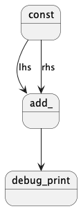
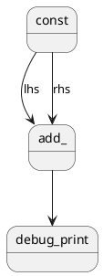

HGraph Program Anatomy
======================

HGraph has two key types of functions, namely graph and nodes. The graph describes
the wiring logic (or how nodes are to be connected), and the nodes describe
the actions to be performed on the data flow.

All HGraph functions use the following syntax to describe the shape of the component:

[Component Signature](component_signature.md)

All decorators follow this general approach to describing functions in HGraph.
Note that from a signature perspective, the ``@graph`` decorator is the same as the differnt
node decorators. The intention is that a node can be converted into a graph and visa-versa
without any obvious changes to the use of function. This allows for easy refactoring of 
the implementation of a component, either breaking up complex nodes into smaller
parts and using a graph to wrap the parts together, or to take a graph and convert it
into a bespoke node for performance reasons.

Graphs
------

These functions are decorated with the ``@graph`` decorator.
The function is only ever called once when the graph is wired (prior to the evaluation
of the graph). The function can call other graphs or nodes. When `calling` the nodes you are
in reality only indicating a relationship between the nodes (or describing the edges in the graph).

It is best-practice to write the bulk of the logic in the form of graph functions.

For example:

```python
from hgraph import graph, run_graph
from hgraph.nodes import const, debug_print

@graph
def what_is_one_plus_one():
    one = const(1)
    one_plus_one = one + one  # NOTE: This is equivalent to add_(one, one), lots of syntactic sugar
    debug_print("1 + 1", one_plus_one)

run_graph(what_is_one_plus_one)
```

In this case, when run initiates its wiring, the graph ``what_is_one_plus_one`` is evaluated, this builds a wiring
graph that looks a bit like this:


<details>


</details>

Thus the graph consist of three nodes *(const, add_ and debug_print)* and three edges 
*( (const:out, add_:rhs), (const:out, add_:lhs), (add_:out, debug_print:ts))*.


Nodes
-----

Nodes are wired in graphs, but the node function is called whenever the time-series inputs
are ticked (the value changes over time). The node performs a computation and can emit
a result (if it is a ``@compute_node``).

Following the example above, lets look at a few node styles:

```python
from hgraph import generator, compute_node, sink_node, SCALAR, TS, MIN_ST

@generator
def const(value: int) -> TS[int]:
    """ A simplified version of a const generator"""
    yield MIN_ST, value
    
@compute_node
def add_(lhs: TS[int], rhs: TS[int]) -> TS[int]:
    return lhs.value + rhs.value

@sink_node
def debug_print(label: str, ts: TS[int]):
    print(f"{label}: {ts.value}")
```

The ``@generator`` node is an example of a source node (pull source node). In this case the generator is responsible
for yielding a datetime, value tuple. The datetime is the time that the value should be introduced into the graph at.
In simulation mode the graph will run until there are no new values introduced by the PULL source nodes.

The ``@compute_node`` is the work-horse of the node types. It takes in time-series values (in this case ``lhs`` and 
``rhs``) and produces output values (in this case of type ``TS[int]`` or a time-series of integer values.)
The function just needs to return a scalar value that can be applied to the time-series value and produce an appropriate
time-series values. Note that the inputs (i.e. ``TS[int]``) are objects and have properties, one of which is the current
value of the time-series. The current value is effectively the last cumulative state of the time-series.

The ``@sink_node`` is the mechanism to exit the graph, it only has inputs and produces no values. In this case the 
``debug_print`` is taking the value and printing it to std_out.

Note how the ``const`` and ``debug_print`` accept **scalar values** (and by **scalar values** we mean values that do
not change over time). These are provided as is to the function and uniquely distinguish one node from another that 
otherwise have the same signature (for example, ``const(1)`` and ``const(2)`` are different nodes in the graph, but 
``const(1)`` and another instance of ``const(1)`` are equivalent in the graph).

It is also worth noting, that scalar values must be immutable values. Only values defined by Hg type system are
supported as valid scalar inputs.

Nodes are able to access additional properties by indicating their interest in the property by defining it in the 
function signature, this is further described below:

[Node Signature Extension](node_signature.md).


