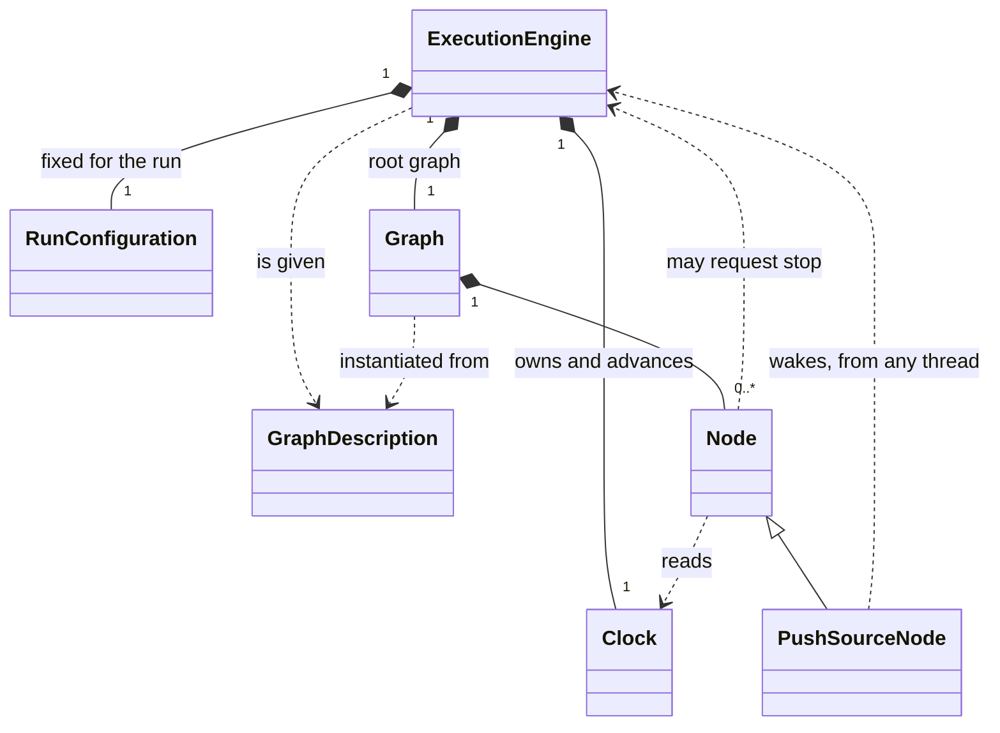
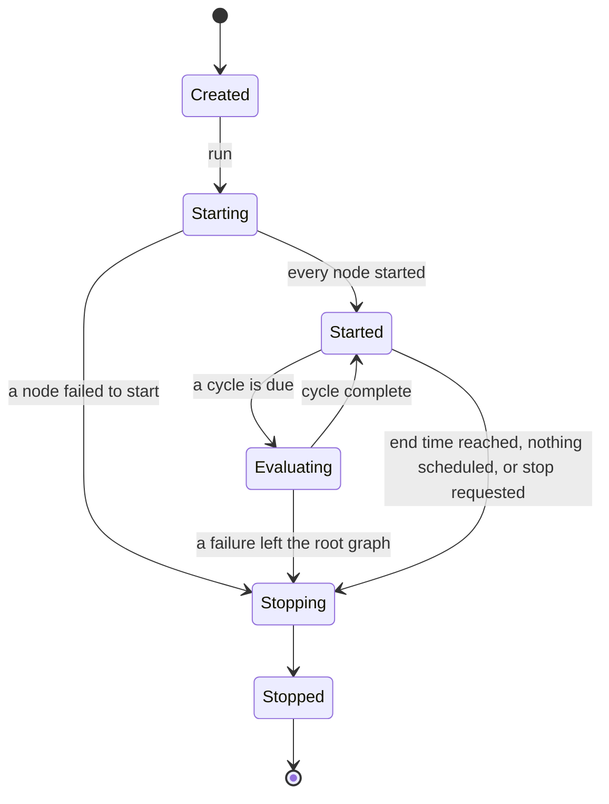
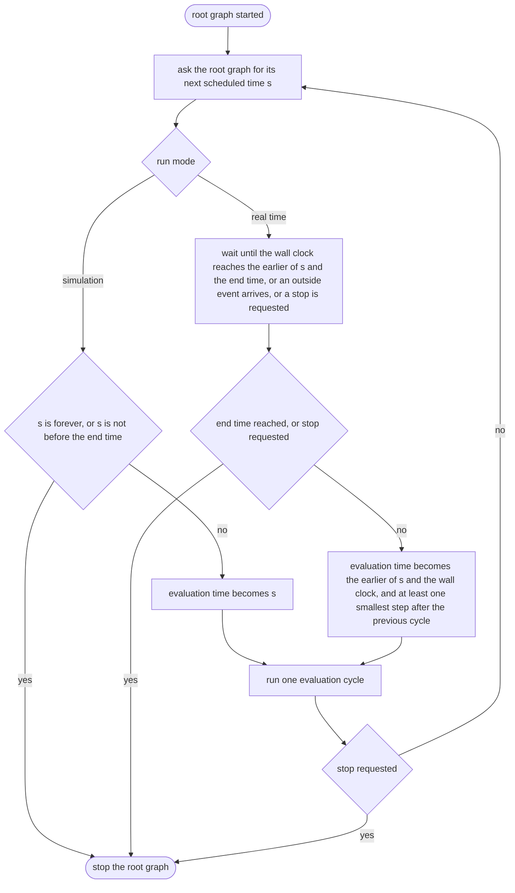
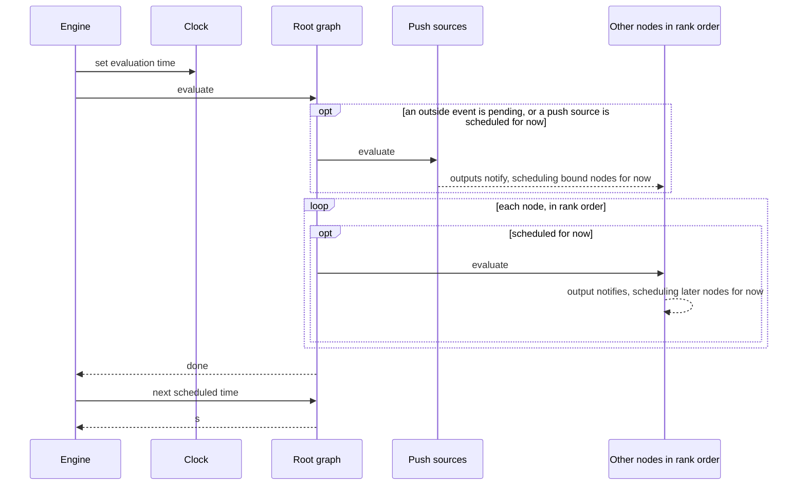

Execution Engine
================

Status: proposed consolidated specification; intended rules and implementation
evidence are distinguished in [Evidence](evidence.md). No full runtime
conformance is claimed.

The execution engine is responsible for setting up the evaluation loop.
The engine has one graph associated to it. The engine will call the different lifecycle methods of the graph.

Concept
-------

The engine is where the evaluation phase begins. It is given a **graph
description** produced by wiring, instantiates the root graph from it, and
owns the resulting **run**: one root graph, taken from start to stop exactly
once. It owns time for that run and decides *when* each evaluation cycle
happens. It does not decide *what* is evaluated in a cycle or in what order —
that is the graph's schedule and rank order (see Graph).

The engine's whole view of the graph is four things: *start*, *evaluate at
this time*, *what is your next scheduled time?*, and *stop*. It does not
evaluate nodes, order them, or know anything about time-series types. A graph
owned by a node presents the same four things to its owner, which is what
lets a graph be driven by an engine or by a parent node without knowing
which.

### Time

Time is an instant on the UTC timeline at **microsecond** resolution. A
duration is a count of microseconds. Five values have names:

| Name | Meaning |
|---|---|
| *never* (`MIN_DT`) | Before every time. The last modified time of something never modified; the schedule of a node that is not scheduled |
| *earliest start* (`MIN_ST`) | *never* plus one step. The earliest a run may start |
| *latest end* (`MAX_ET`) | *forever* minus one step. The latest a run may end |
| *forever* (`MAX_DT`) | After every time. A graph's next scheduled time when nothing is scheduled |
| *smallest step* (`MIN_TD`) | One microsecond. The smallest gap between two cycles |

All runtime code reads time from the clock. Nothing but the clock itself
reads the computer's clock.

### Run modes

A run is in one of two modes. A graph behaves identically in both; only the
source of time differs. The same graph is a backtest in simulation and a live
process in real time.

| Mode | When a cycle runs | Outside events | Deterministic |
|---|---|---|---|
| **Simulation** | At the next scheduled time, immediately. Time is compressed: the engine never waits | Not permitted: a graph with a push source is refused | Yes |
| **Real time** | When the wall clock reaches the next scheduled time, or when an outside event arrives, whichever is first. If the engine is already late it does not wait | Permitted | No |

Relationships
-------------

- The engine **is given** a graph description and does not own it: the same
  description may be instantiated again, by another engine or at another
  time.
- The engine **owns** the run configuration, the clock and the root graph.
  Nothing else owns a clock: every graph in the run, nested ones included,
  reads the engine's.
- The engine **uses** the root graph only through start, evaluate, next
  scheduled time and stop.
- A node **reads** the clock and **may request a stop**. It reaches both as
  injectables (see Injectables); it never holds the engine itself.
- A push source **wakes** the engine when an event is admitted to its queue.
  This is the only thing another thread can cause the engine to do.

State
-----

**Run configuration** — set before the run, never changed during it.

| Item | Values | Notes |
|---|---|---|
| mode | simulation, real time | |
| start time | *earliest start* or later | Inclusive: the first cycle may run at the start time |
| end time | later than the start time, *latest end* or earlier | Exclusive: no cycle runs at the end time |
| failure handling | *stop, then report* (the default), or *report, then stop* | Only the order differs; the graph is stopped either way. See points to settle |

**Clock** — changed only by the engine; read by anything. The clock is best
thought of as a struct: one value with four read-only properties.

| Property | Type | Meaning | Changes |
|---|---|---|---|
| evaluation time | `datetime` | The time of the current cycle: the event time that caused the graph to run, and the graph's logical "now" | Once, before each cycle. Constant throughout the cycle |
| now | `datetime` | The engine's estimate of wall-clock time. In real time, the computer's clock in UTC. In simulation, evaluation time plus the lag | Continuously |
| lag | `duration` | The real time that has passed between the start of the current cycle and the moment it is read. Measured on the computer's clock in both modes. hgraph calls this *cycle time* | Continuously; restarts each cycle |
| next cycle evaluation time | `datetime` | The earliest time a following cycle could have: evaluation time plus the smallest step | With evaluation time |

Simulated *now* describes the likely lag in the system: had this event
arrived in real time, the wall clock would by now read about the evaluation
time plus however long the cycle has been running. It is deliberately a cheap
estimate. It ignores cumulative effects — a backlog built up over earlier
cycles — because an estimate that included them would still be inaccurate
and would cost a great deal to compute.

Evaluation time behaves like a monotonic clock: it is guaranteed to increase
from one cycle to the next. In real time that guarantee can briefly put it
ahead of *now* — when events arrive within one smallest step of each other,
the second cycle is moved one step past the first. This happens only in real
time; in simulation *now* is never earlier than evaluation time.

**Run state** — the engine's own.

| Item | Values | Changed by |
|---|---|---|
| lifecycle | created (the root graph is instantiated), starting, started, evaluating, stopping, stopped | The engine |
| stop requested | no, yes | Any node, through engine control; never cleared |
| outside event pending | no, yes | Set by a push source from any thread; cleared when the push sources are evaluated. There is exactly one per run, which is what makes it engine state; whether an implementation keeps it in the engine or in the root graph is its own choice |

There is no transition out of Stopped other than disposal: a run is never
restarted.

Behaviour
---------

### Instantiating

The root graph is instantiated from the graph description: its nodes, their
inputs, outputs and state come into being and its edges are bound. Nothing
has started and nothing has ticked, but the graph is complete and can be
inspected. How a graph is instantiated is specified in Graph.

### Starting

Evaluation time is set to the start time and the root graph is started, its
nodes in rank order. Nodes may schedule themselves for the start time, which
is how the first cycle comes to exist: nothing is scheduled by default.

### The evaluation loop

- The engine never skips a scheduled time and never merges two. When a
  real-time run falls behind it works through the backlog at the scheduled
  times, in order, without waiting. If events need combining, a source node
  does that before it introduces them.
- A real-time graph with nothing scheduled waits for an outside event or the
  end time. A simulation with nothing scheduled is finished.

### The evaluation cycle

The engine's part of a cycle is small: set the evaluation time, ask the root
graph to evaluate, and read its next scheduled time. The scan itself is
specified in Graph. What matters here is that push sources hold the lowest
ranks and so are evaluated before everything else: an outside event enters
the graph at the top of the cycle that admits it.

A graph owned by a node is evaluated inside that node's evaluation, at the
same evaluation time. It has no push sources, and where the engine reads the
root graph's next scheduled time, the owning node is scheduled for its
child's.

### Outside events

Other threads meet the run in exactly one place: a push source's queue. A
sender may be called from any thread; it admits an event to the queue or
refuses it, and waking the engine is its only effect on the run. The event
enters the graph when the push source is next evaluated, stamped with that
cycle's evaluation time. Events carry no time of their own, which is why they
cannot be admitted in simulation.

How pending events are handed over — one at a time, all at once, combined —
and whether a full queue refuses, belong to the push queue (see Node): they
are choices of queue, not of engine and not of node.

### Ending

- The run ends when the end time is reached, when a simulation has nothing
  left scheduled, or when a stop has been requested.
- Any node may **request a stop**. The current cycle completes; no further
  cycle runs; the graph is stopped normally.
- A failure that no node captures (see Node) leaves the root graph and ends
  the run. The graph is stopped and the failure is reported to whoever
  started the run — by default in that order, so that every stop has run by
  the time the failure is seen. The report identifies the node and the
  phase — start, evaluate or stop — in which it failed.
- Stopping runs the root graph's nodes in reverse rank order. A failure
  during stop does not prevent the remaining nodes being stopped; the first
  failure is what is reported.

Rules
-----

- **ENG-1** A run instantiates exactly one root graph from a graph
  description, and takes it through start, zero or more cycles, and stop,
  once each. There is no restart; the description can be instantiated again.
- **ENG-2** Evaluation time is constant within a cycle, and each cycle's
  evaluation time is later than the one before it.
- **ENG-3** The start time is inclusive and the end time is exclusive: no
  cycle runs before the start time, and none at or after the end time.
- **ENG-4** A cycle runs at the root graph's next scheduled time or, in real
  time only, at an earlier time because an outside event arrived. No
  scheduled time before the end time is skipped, and no two are merged.
- **ENG-5** In simulation the engine does not wait; the run ends when nothing
  is scheduled before the end time.
- **ENG-6** In real time the engine does not evaluate a scheduled time before
  the wall clock reaches it, and does not wait when it is already late.
- **ENG-7** A graph containing a push source is refused in simulation.
- **ENG-8** Push sources are evaluated before every other node in a cycle.
- **ENG-9** A stop request lets the current cycle complete and prevents the
  next.
- **ENG-10** Whenever a run ends — normally, by request or by failure —
  every node that started is stopped, in reverse rank order.
- **ENG-11** Only the engine advances the clock. Nodes observe it.
- **ENG-12** Every graph in a run, at any depth of nesting, reads the same
  clock.
- **ENG-13** In real time *now* is the computer's clock; evaluation time may
  briefly lead it, because ENG-2 takes precedence. In simulation *now* is
  evaluation time plus the lag, and so is never earlier than evaluation time.
- **ENG-14** The lag is real elapsed time in both modes, measured from the
  start of the current cycle.
- **ENG-15** Simulation is deterministic: the same graph, inputs, start time
  and end time produce the same sequence of cycles and the same ticks,
  provided no node's behaviour depends on *now* or the lag.
- **ENG-16** *never* is before *earliest start*, which is before *latest
  end*, which is before *forever*. *Earliest start* is *never* plus one
  smallest step, and *latest end* is *forever* minus one. No arithmetic on a
  time gives a result outside *never* to *forever*.

Deferred
--------

Facilities hgraph's engine has that no concept above needs yet. Each is
specified when an implementation requires it.

- **Externally driven mode.** A third mode with no loop: the caller starts
  the run, steps it one cycle at a time supplying each evaluation time, and
  stops it. It exists so that a graph hosted elsewhere — another process —
  can be an ordinary child graph. A caller stepping a graph takes on the
  engine's obligations: never backwards, and never past work that is due.
- **Observers.** Before-and-after notifications for graph and node start,
  evaluation and stop, one set per run, seeing nested graphs too. Tracing,
  profiling and diagnostics are built on them. hgraph pairs every *before*
  with an *after* for evaluation and stop even on failure, but not for start.
- **One-shot cycle callbacks.** Work registered to run once, just before or
  just after the current cycle; drained until none remain.
- **Run-wide shared state.** A keyed store seeded before the run, shared by
  every graph in it, and readable afterwards.
- **Run logger.** Which logger a run uses, and that nested graphs share it.
- **Phase hook.** A host may wrap each whole phase — start, each cycle,
  stop — so that, for instance, a language bridge holds its lock for exactly
  that span.
- **Runaway guard.** Failing a run whose graph reschedules itself one
  smallest step ahead for more than a configured number of cycles.
- **Pausing a cycle.** hgraph lets a node pause the cycle it is in and have
  it resumed at the same evaluation time (mesh uses this while waiting on a
  dependency). ENG-2 assumes no such thing exists.

Points to settle
----------------

1. **Failure handling: is *report, then stop* a concept?** What hgraph does:

   - A failure that no node captures escapes the root graph. The engine
     must then do two things: stop the graph (every started node's stop, in
     reverse rank order) and report the failure to whoever started the run.
   - hgraph's `cleanup_on_error` option chooses the **order**. *True* (the
     default): stop first, then report — by the time the caller sees the
     failure, every stop hook has run. *False*: report first — the caller
     receives the failure together with the failed run, still started, and
     the stop happens when the caller lets go of it.
   - It exists for **inspection**. Stop hooks close resources and unbind
     edges; after them, the state that explains the failure is gone. With
     *false*, a debugger, a test or an exception handler can look at live
     values and the schedule as they were when the node failed. In Python the
     failed run is kept alive by the raised exception and torn down when the
     exception is released.
   - What it **cannot** change: the stop is mandatory in both cases (ENG-10
     holds), no further cycle runs, and no tick differs. A graph cannot
     observe which was chosen. Only the host can.
   - hgraph has a second, separate setting alongside it: how much context the
     report of an escaped failure carries — how far upstream of the failing
     node to walk, and whether to include the input values found there. That
     is the content of a node error and belongs in Node.

   The choice: specify only *stop, then report* and move the alternative to
   Deferred, as a facility for hosts and debuggers; or keep both as run
   configuration, as drafted. Since no graph can tell the difference, the
   test for what belongs here says defer.
