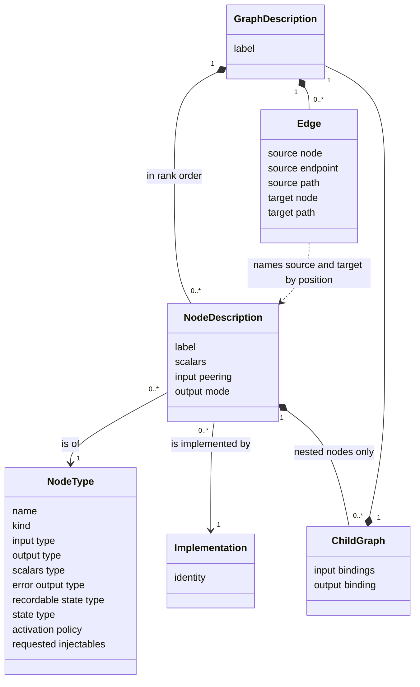
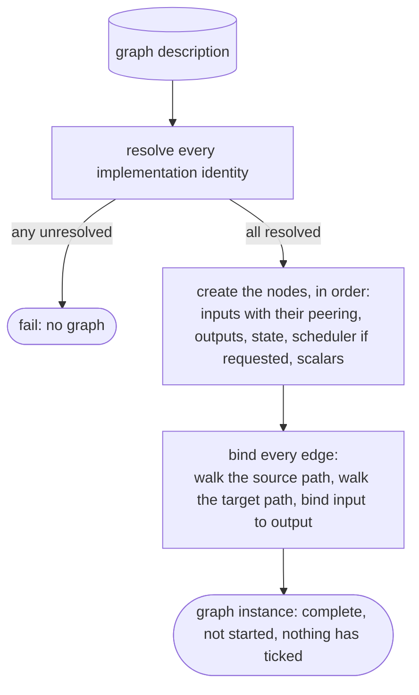
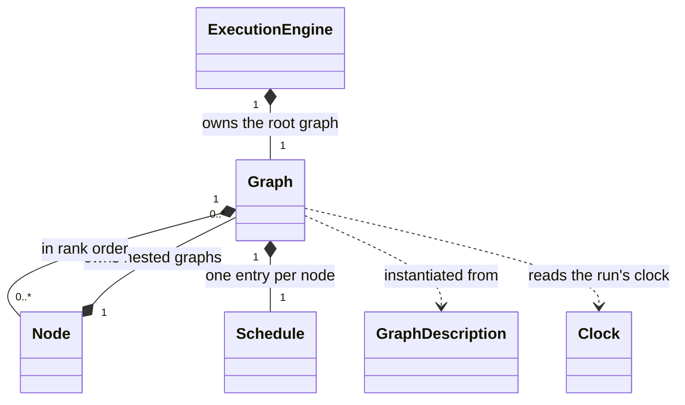
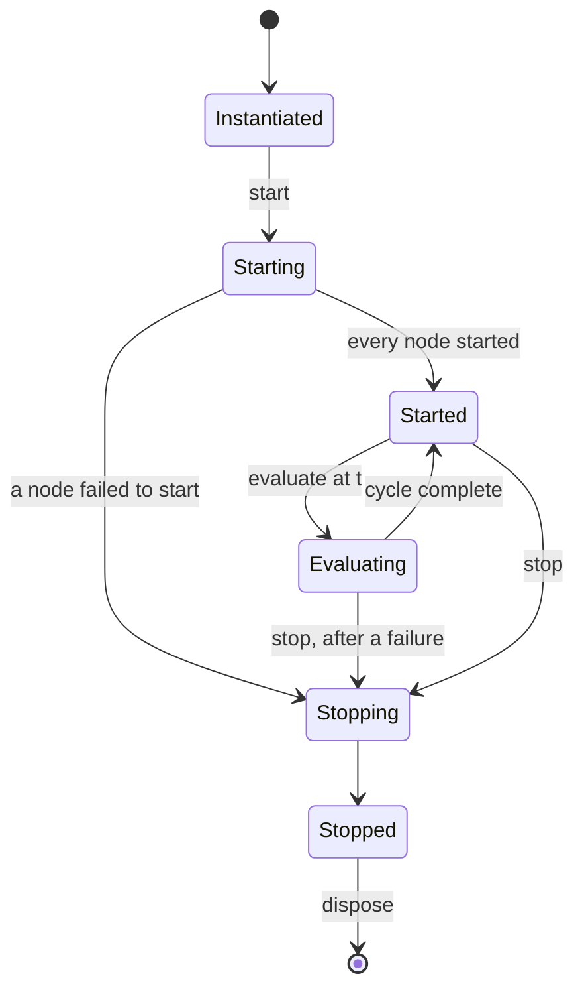
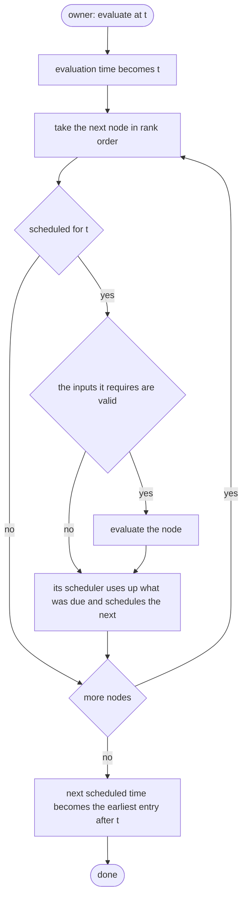

Graph
=====

Status: draft. See [Evidence](evidence.md) for implementation status.

A graph exists in two forms, one for each phase of the runtime. In the wiring
phase it is a **graph description**: what the graph will be. In the
evaluation phase it is a **graph instance**: nodes that exist, hold values
and can be evaluated. Part 1 covers the description, Part 2 the instance.

Concept
-------

A **graph description** is a complete, inert account of a graph: which nodes
it has, in what order, how each is configured, what implements each, and
which inputs are bound to which outputs. It is what the wiring phase
produces and the only thing the evaluation phase is given.

Three properties make it what it is:

- **It is plain data.** Nothing in it is live: no time-series, no resource,
  no reference into a running process. It can therefore be kept, copied and
  — the goal — written out and loaded again.
- **It is complete.** Every decision wiring makes is already made: types are
  resolved, overloads selected, nodes ordered. Instantiating needs no further
  choices, only the description and something that can supply the named
  implementations.
- **It is reusable.** Instantiating does not consume or change it. The same
  description gives the root graph of a run, or gives a nested node as many
  child graphs as it asks for, whenever it asks.

hgraph calls this a *graph builder*.

Part 1 — The graph description
------------------------------

### Relationships

- A graph description **owns** its node descriptions and its edges.
- A node description **refers to** a node type — what kind of node it is —
  and to an implementation — its behaviour. Many nodes share one type;
  several implementations may satisfy one type.
- A nested node's description **owns** the descriptions of the graphs it may
  instantiate, each with the bindings that join it to its owner. This is
  recursive: a child graph description is a graph description.
- An edge **refers to** two nodes of the same graph description, by their
  position in the order. Edges never cross from one graph description into
  another; that is what boundary bindings are for.
- All of them **refer to** scalar and time-series types (see Scalar types,
  Time-series types).

### State

A description does not change once wiring has finished, so its state is
simply its contents.

**Graph description**

| Item | What it is |
|---|---|
| label | A name, for diagnostics |
| nodes | The node descriptions, in **rank order**. The order is the evaluation order, fixed by wiring. Push sources, if any, come first |
| edges | The bindings between those nodes |

**Node description** — one node of this graph.

| Item | What it is |
|---|---|
| node type | What kind of node this is (below) |
| implementation | What supplies start, eval and stop (below) |
| label | A name for this node, for diagnostics and error reports |
| scalars | The node's fixed configuration values; their shape is the node type's scalars type |
| input peering | For each position in the node's input, whether it is **peered** (bound as a whole to one output), a **non-peered** parent (exists only on the input side; its children are bound separately), or **local** (the input holds its own time-series, with no output behind it) |
| output mode | Whether the node **owns** its output, or **forwards** — writes through to an output owned elsewhere, as a child graph's final node does to its owner's output |
| child graphs | Nested nodes only: the graphs this node may instantiate (below) |

**Node type** — shared by every node of that type. The name, kind, input
type, output type and scalars type are the node's **signature**: what a
caller sees and wiring connects. Everything after them is for the runtime
and the implementation, and no caller sees it.

| Item | What it is |
|---|---|
| name | |
| kind | push source, pull source, compute, sink, nested |
| input type | A time-series type — always a bundle, one field per input — or none |
| output type | A time-series type, or none |
| scalars type | A scalar struct type, or none |
| *— not in the signature —* | |
| error output type | A time-series type, present when the node's failures are captured; with how much context a captured error carries |
| recordable state type | A time-series type, or none. The value is held on the node instance |
| state type | A scalar type, or none. The value is held on the node instance |
| active inputs | Which inputs schedule the node when notified. Absent means all; present and empty means none |
| valid inputs | Which inputs must be valid for the node to be evaluated. Absent means all; present and empty means none |
| all-valid inputs | Which inputs must be *all valid* |
| structural inputs | Which collection inputs notify on changes of membership only, not on changes to their members' values |
| requested injectables | What the implementation asks to be given: system facilities (the clock, the logger, engine control) and what the node instance holds (its scheduler, output, state, recordable state). A node that does not ask for a scheduler does not have one |
| schedule on start | Whether the node is scheduled for the start time when it starts |

**Implementation** — the node's behaviour, by name.

| Item | What it is |
|---|---|
| identity | A stable name for what supplies start, eval and stop. Resolved to real behaviour when the graph is instantiated, against whatever implementations the runtime has been given |

**Edge** — one input bound to one output.

| Item | What it is |
|---|---|
| source node | Position of the producing node in the order |
| source endpoint | Which of that node's outputs: its **output**, its **error output**, or its **recordable state** |
| source path | Steps from that output down to the time-series being bound: a field of a bundle, an element of a fixed list. One special last step names a dictionary's **key set** |
| target node | Position of the consuming node |
| target path | Steps from that node's input down to the input being bound |

**Child graph** — a graph a nested node may instantiate, and how it joins its
owner.

| Item | What it is |
|---|---|
| graph description | The child |
| input bindings | Pairs: a position in the *owner's* input, and an input inside the child (a node and a path). When the child is instantiated, that child input is bound to **the same output the owner's input is bound to**. There is no intermediate node |
| output binding | One of: a time-series inside the child (a node and a path) whose values become the owner's output; or a position in the owner's input that is passed straight through as the owner's output |

### Behaviour

A description does one thing: it is **instantiated**.

- Creating a nested node gives it its child graph *descriptions*. It does not
  instantiate them; the node does that itself, when and as often as it
  chooses, during its own start or evaluation.
- Instantiating a child graph is the same procedure, followed by its boundary
  bindings.
- An instantiated graph has no schedule entries and no valid time-series.
  Everything after this point belongs to Part 2.

### Rules

- **GRF-1** A description contains no live object and nothing local to a
  process. Instantiating it does not change it.
- **GRF-2** Instantiation is repeatable. Two graphs instantiated from one
  description are independent and behave identically.
- **GRF-3** The order of nodes in a description is the rank order of every
  graph instantiated from it.
- **GRF-4** Every edge runs from a node to a node later in the order.
- **GRF-5** Push sources precede every other node, and appear only in a
  description used for a root graph.
- **GRF-6** An input position is the target of at most one edge. A position
  that is the target of none is unbound when the graph is instantiated.
- **GRF-7** An edge's source and target have compatible types. Wiring
  establishes this; loading a stored description must establish it again.
- **GRF-8** A node's scalars conform to its node type's scalars type.
- **GRF-9** Instantiation either produces a complete graph or produces none.
  An implementation identity that cannot be resolved is a failure, not a
  node left out.
- **GRF-10** A child graph's bindings name only positions in its owner's
  input and endpoints inside the child.

Part 2 — The graph instance
---------------------------

### Concept

A graph instance is a description brought to life. It adds the three things a
description cannot have: **values**, held in its nodes' time-series; a
**schedule**, saying which node next needs evaluating and when; and a
**lifecycle**.

A graph is a passive thing. It does nothing until its **owner** asks, and its
owner asks only four things: *start*, *evaluate at this time*, *what is your
next scheduled time?*, and *stop*. The owner of a **root graph** is the
execution engine. The owner of a **nested graph** is a node, which asks the
same four things from inside its own start, evaluation and stop. A graph
cannot tell which kind of owner it has, and behaves the same for both.

Within a graph the order of the nodes — their **rank** — is everything. It is
fixed by the description and never changes. It is the order in which nodes
are started and evaluated, the reverse of the order in which they are
stopped, and the reason an evaluation cycle needs only a single pass: data
only ever flows from a lower rank to a higher one.

### Relationships

- A graph **is owned by** exactly one owner: the engine, or a node.
- A graph **owns** its nodes and its schedule. A node owns its inputs,
  outputs and state (see Node).
- Every graph in a run, however deeply nested, **reads** the one clock the
  engine owns. A nested graph has no clock, no run mode and no push sources
  of its own.
- An input in one graph may be **bound to** an output in a graph that
  encloses it. Nothing else crosses a graph's boundary.

### State

| Item | Values | Changed by |
|---|---|---|
| lifecycle | instantiated, starting, started, evaluating, stopping, stopped | The graph, when its owner asks |
| evaluation time | The time of the cycle in progress, or of the last one completed. Before the first cycle it is one step before the start time, so that the first cycle may be *at* the start time | The graph, at the start of each cycle, from what its owner supplies |
| schedule | For each node: the next time it needs evaluating, or *never* | Notification, a node's scheduler, schedule-on-start |
| next scheduled time | The earliest schedule entry later than the evaluation time; *forever* if there is none | Follows the schedule |
| owner | The engine, or a node together with whatever that node uses to tell its graphs apart — a key, a branch | Fixed at instantiation |

The schedule holds **one** time per node: the earliest at which it needs
evaluating. A node that wants to be woken at several future times keeps them
in its own scheduler (see Node), and only the earliest of them appears here.

### Behaviour

#### Scheduling a node

To schedule node *n* for time *t*:

- If *t* is before the evaluation time, it is an error.
- If *t* is the evaluation time, *n*'s entry becomes *t*, whatever it held,
  and *n* will be evaluated in the current cycle, provided the scan has not
  yet reached it. It always can be, when the graph was wired correctly:
  whatever schedules *n* for now is of lower rank than *n*. Before the first
  cycle, scheduling for the start time is how the first cycle comes to exist.
- Otherwise *n*'s entry becomes *t* if it has no entry, if its entry has
  already been used, or if *t* is earlier than its entry. An unused entry
  never moves later.

Evaluating a node uses its entry, whatever woke it. A later time the node
had asked for is not lost: its scheduler still holds the request and writes
it back after the eval (Node, "The scheduler"). So a node woken early by an
input, which then replaces its request with a later one, is next evaluated
at the later time — not also at the one it replaced.

Everything that wakes a node does it this way: a notification on an active
input, the node's own scheduler, schedule-on-start, and a nested graph
reporting its next scheduled time to its owner.

#### Notification becomes scheduling

An input notified by an output or binding change passes the notification up
through its non-peered parents. If active, it schedules its node for now.
Writes while the output is already modified do not notify again (TS-6);
invalidation notifies separately (TS-7). Several inputs or a scheduler may
schedule the same node; scheduling is idempotent: many notifications, one
evaluation (GRF-16).

#### The evaluation cycle

- The scan is a single pass. A node evaluated early in the pass may schedule
  later nodes for *t*, and the pass reaches them; nothing is revisited.
- In a root graph the push sources hold the lowest ranks, so outside events
  enter at the top of the pass (see Execution engine).
- A schedule entry equal to *t* is the only reason a node is considered at
  all. Whether it is then evaluated is the node's admission rule (see Node).
- When the pass is complete, a root graph's owner reads the next scheduled
  time; a nested graph's owner is scheduled for it.

#### Start and stop

**Start** runs through the nodes in rank order, starting each. If a node
fails to start, the nodes already started are stopped, in reverse order, and
the failure goes to the owner. The node that failed is not stopped: it never
started.

**Stop** runs through the started nodes in reverse rank order, so that a node
is always stopped before the nodes it depends on. Every node gets its stop
even if another's fails; the first failure is what the owner receives. When
the nodes are stopped, every input is unbound — while every output still
exists — so that nothing is left referring across nodes when the graph is
disposed.

A stopped graph is never started again.

#### A graph owned by a node

- **Boundary.** When a nested graph is instantiated, its owner applies the
  child graph's bindings (Part 1). A child input is bound directly to the
  same output, outside the child, that the owner's own input is bound to:
  the child reads the real producer, with nothing in between. The owner's
  output either is the child's chosen time-series, written through, or is
  one of the owner's own inputs passed straight on.
- **Parallel graphs.** Graphs owned by the same node have no relationship
  with one another beyond sharing a parent. Everything a nested graph reads
  comes either from a lower-ranked node inside it or, through its boundary,
  from the parent graph. Nothing in one is bound to, or refers to, anything
  in another, and so there is no order between them to keep.
- **Time.** A nested graph is evaluated only from inside its owner's
  evaluation, at the owner's evaluation time, on the same clock.
- **Schedule.** After evaluating a nested graph, its owner is scheduled for
  the nested graph's next scheduled time, if it has one. And if something
  schedules a node inside a nested graph while that graph is *not* being
  evaluated, the owner is scheduled for that time there and then. Either way
  the rule is the same: the owner wakes no later than its child needs.
- **Lifetime.** The owner instantiates, starts, stops and disposes of its
  graphs when it chooses — at its own start, or during any evaluation. A
  nested graph is always stopped before it is disposed of, and is not
  disposed of in the cycle in which it is stopped: inputs elsewhere may still
  be reading what it produced in that cycle.
- **Failure.** A failure inside a nested graph leaves it through the owner's
  evaluation. The owner may capture it; otherwise it continues outward, and
  if it leaves the root graph it ends the run.

This, with inputs that can be re-bound (see Time-series types), is the whole
of what the runtime provides for a graph that changes shape as it runs.

### Rules

- **GRF-11** A node is evaluated in a cycle only if its schedule entry equals
  the evaluation time; at most once; in rank order.
- **GRF-12** Scheduling a node for a time before the evaluation time is an
  error.
- **GRF-13** Scheduling for the current time a node the scan has already
  passed is a fault in the graph. It is never silently carried to a later
  cycle.
- **GRF-14** A schedule entry, once set, moves only earlier until it is used.
  Evaluating a node uses its entry, however the node was woken.
- **GRF-15** A node that produces is evaluated before every node bound to it
  that is evaluated in the same cycle — however the binding was made: by an
  edge, at a nested graph's boundary, or through a reference.
- **GRF-16** However many times a node's inputs are notified in a cycle, the
  node is evaluated once.
- **GRF-17** A passive input never schedules its node.
- **GRF-18** Nodes start in rank order and stop in reverse. Every node that
  started is stopped exactly once; a node that failed to start is not
  stopped.
- **GRF-19** When a graph stops, its inputs are unbound before any output is
  disposed of.
- **GRF-20** A stopped graph is never started again.
- **GRF-21** A nested graph is evaluated only inside its owner's evaluation,
  at its owner's evaluation time.
- **GRF-22** The owner of a nested graph is scheduled no later than that
  graph's next scheduled time.
- **GRF-23** A nested graph is stopped before it is disposed of, and not
  disposed of in the cycle in which it is stopped.
- **GRF-24** An input is bound only to an output in its own graph or in a
  graph that encloses it. Graphs owned by the same node share nothing but
  their parent.

Deferred
--------

Things hgraph's graphs carry that no concept above needs yet.

- **Observers**: before and after a graph's start, evaluation and stop, and
  each node's (see Execution engine).
- **Pausing a cycle**: a node suspending the pass, to be resumed at the same
  evaluation time.
- **A readable dump** of a graph: its nodes, their labels and schedule
  entries.

- **Initial shared state** and **traits**: keyed values seeded at wiring and
  copied onto each instance; traits are looked up through the chain of owning
  graphs. They go with run-wide shared state (see Execution engine).
- **Checkpoint identity** of a node. Goes with checkpointing.
- **Whether any node needs the host's phase hook.** Goes with the phase hook.

Points to settle
----------------

1. **How an implementation is named.** This is the crux of a storable
   description. In hgraph today a node's behaviour is held as function
   pointers and a process-local token; the builder can also retain opaque
   extension state. None of that can be written out, which is why hgraph's
   RFC 0022 manifest can identify a wired graph but not rebuild one. A stable
   identity needs a namespace (HGL already has module and provider
   identities, with fingerprints), a way to supply implementations to the
   runtime before instantiating, and a rule for generic implementations —
   one identity per resolved type, or an identity plus type arguments.
2. **What implements a node written in HGL?** A node whose behaviour is an
   HGL body (`when`, `state`) has no ready-made implementation to name. Either
   the compiler also produces compiled code, registered under an identity the
   description names; or the description carries the body itself in a form
   the runtime can execute. The second makes a description fully
   self-contained; the first does not.
3. **How types appear.** hgraph refers to types by interned address. A
   storable description must carry them — by value, as a table of the types
   it uses, or by canonical name. It must also carry, for each abstract
   struct family, the closed set of concrete members wiring knew about:
   hgraph freezes that set when wiring finishes, and a graph ignores members
   registered later.
4. **Is input peering stored, or derived?** The target paths of the edges
   already say which input positions are bound, and everything above a bound
   position is a non-peered parent. hgraph stores the peering explicitly;
   what cannot be derived from edges is a **local** input, and a collection
   input whose members are created while the graph runs.
5. **Structural inputs** are listed because hgraph's node type has them. They
   need a definition in Time-series types before they can stay.
6. **Output mode** is set per node by whoever builds a nested node, not by
   the node's author. Is "forwards" part of the node description, or implied
   by the child graph's output binding?
7. **Scheduling in the past.** hgraph's graph treats it as an error; hgraph's
   node scheduler quietly ignores a request for a time that is not in the
   future. GRF-12 takes the first. Should a node's scheduler be as strict?
8. **A cancelled request still wakes the node.** When a node cancels its only
   pending request, the schedule entry already written stays, so the node is
   considered once with nothing due. hgraph accepts this. It is harmless but
   observable: the node's evaluation runs.
9. **Nothing reaches backward.** Settled: every edge runs forward (GRF-4),
   and an input bound through a reference is held to the same rule (see
   Time-series types, TS-20) — a reference chooses *which* upstream output to
   read, never a downstream one. What looks like backward flow in hgraph is
   not a binding: a feedback is a sink scheduling a source for a later cycle,
   and the paired source and sink that services are built from are library.
   Across graphs the rule is GRF-24: a nested graph reads from inside itself
   or from its parent, never from a parallel graph. The one residue is a
   reference carried backward through a feedback (Time-series types,
   point 4).
10. **How long a stopped nested graph is kept.** GRF-23 says only "not in the
    same cycle". hgraph keeps a switch's old branch until the next switch.

Sources
-------

In hgraph: `docs/source/developer_guide/architecture.rst` (rank, the graph
schedule, the cycle, start and stop order) and `nested_graphs.rst` (boundary
binding, scheduling delegation — for the components, not the nodes built on
them); `include/hgraph/runtime/graph.h` (the graph builder, edges);
`runtime/node.h` (node builder, node type, node type descriptor);
`types/time_series/endpoint_schema.h` (peered, non-peered, local);
`runtime/nested_graph_node.h` and `runtime/child_graph_inspection.h` (child
graphs and their bindings); RFC 0022 (the manifest). The original Python
builder was not available to check against.
