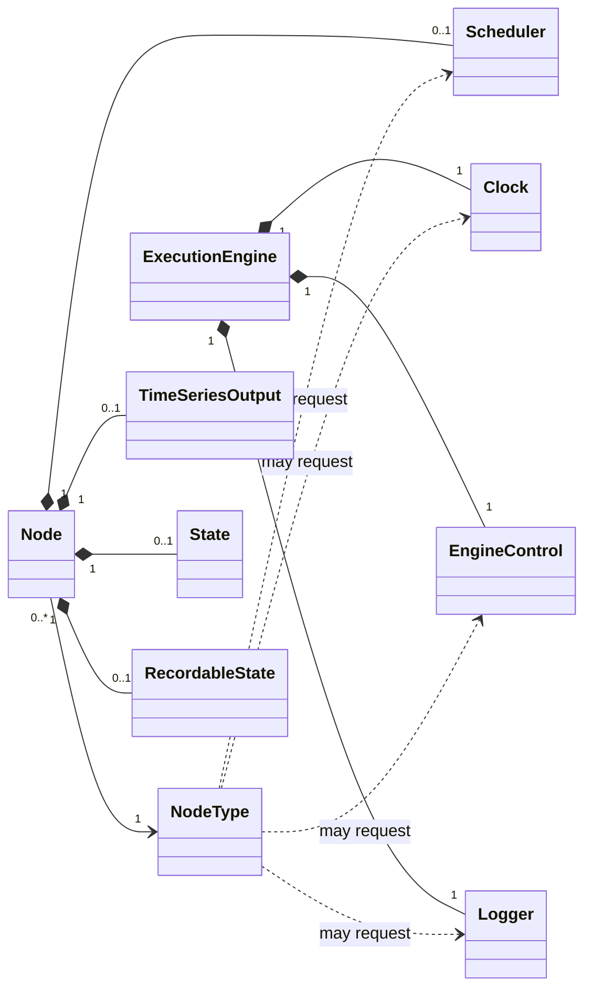

Injectables
===========

Status: draft. See [Evidence](evidence.md) for implementation status.

An injectable is a facility of the runtime that a node asks for by name: the
clock, its scheduler, a logger, its own output. It is how a node reaches
anything that is not an input, an output it writes, or a scalar it was
configured with.

Concept
-------

A node's **signature** is its inputs, its output and its scalars. That is
what a caller sees and what wiring connects. Everything else a node needs in
order to do its work is **injected**: not defined on the signature, asked for
by the node, and made available to the implementation when its start, eval
or stop is called.

Injectables are of two sorts, reached in the same way:

- **System facilities**, which belong to the run and are the same for every
  node in it: the clock, the logger, engine control.
- **What the node instance itself holds**: its scheduler, its output, its
  state and its recordable state. These are not services of the runtime —
  state and recordable state are *values*, held on the node instance for as
  long as it lives — but they are injectables all the same, because they are
  absent from the signature and handed to the implementation on request.

Three things follow from making these requests explicit.

- **A caller never sees them.** Asking for the clock does not add a
  parameter, change the node's kind, or affect how it is wired.
- **The runtime knows what each node uses.** A node that does not ask for a
  scheduler has none and carries no cost for one. A node that does not ask
  for the clock cannot depend on *now* or the lag, the two readings that make
  a simulation non-deterministic (see Execution engine).
- **What is injected is borrowed.** The access is good for the call it was
  supplied to; a node does not hold on to an injectable between evaluations,
  it asks again. That is about the access, not about what lies behind it: a
  node's state is there, unchanged, the next time it asks.

### The injectables

| Injectable | Held by | What it gives the node |
|---|---|---|
| **clock** | the run | A struct of four read-only properties: evaluation time, *now*, lag, next cycle evaluation time |
| **logger** | the run | Somewhere to write messages, identified as coming from this node |
| **engine control** | the run | The run's mode, start time and end time; whether a stop has been requested; and the means to request one |
| **scheduler** | the node instance | The node's own scheduler: request, cancel, query (see Node) |
| **output** | the node instance | The node's own output, to read what it holds and to write it piece by piece rather than all at once |
| **state** | the node instance | The node's private state: a value |
| **recordable state** | the node instance | The node's recordable state: a time-series value |

In HGL, `inject out, logger, clock, scheduler` asks for the output, the
logger, the clock and the scheduler; `state` and `cache` declarations ask for
recordable state and state.

Relationships
-------------

- What is injected is never owned by the injectable mechanism itself. Each
  injectable is a **view** of something owned elsewhere: by the engine, one
  per run, shared by every node of every graph in it; or by the node.
- A **node type** lists the injectables its implementation requests. The list
  is part of the graph description (see Graph).
- A nested graph's nodes get the *same* clock, logger and engine control as
  the root graph's. There is one of each per run.

State
-----

An injectable has no state of its own. What it shows is state specified
elsewhere:

| Injectable | Shows | Specified in | The node may |
|---|---|---|---|
| clock | The clock's four properties | Execution engine | Read |
| engine control | Run configuration; *stop requested* | Execution engine | Read; set *stop requested* |
| logger | — | below | Write messages |
| scheduler | The node's pending requests | Node | Read and change |
| output | The node's output time-series | Time-series types | Read and write |
| state | The node's state | Node | Read and write |
| recordable state | The node's recordable state | Node | Read and write |

Behaviour
---------

### Asking

A node type names the injectables its implementation uses. Each of start,
eval and stop may use a different subset. Using one that was not asked for is
an error; for the scheduler in particular, because a node that did not ask
for one does not have one.

### When each is available

| Injectable | start | eval | stop |
|---|---|---|---|
| clock | yes; evaluation time is the start time | yes | yes |
| scheduler | yes; may request the start time itself | yes | yes, though a request made in stop can never fall due |
| output | read | read and write | read |
| state, recordable state | yes | yes | yes |
| logger | yes | yes | yes |
| engine control | yes | yes | yes |

### What each does

**Clock.** One injectable, best thought of as a **struct**: a single value
with four read-only properties, defined in Execution engine — **evaluation
time**, **now**, **lag** and **next cycle evaluation time**. Evaluation time
and *now* are not separate injectables; a node asks for the clock and reads
the property it needs. *Evaluation time* and *next cycle evaluation time* are
the same for every node in a cycle; *now* and *lag* move as the cycle
proceeds, so two nodes in one cycle read different values.

Treating these as properties of one value, rather than as free-standing
operators, also keeps the names out of each other's way: hgraph already has
an operator called `lag`, which delays a time-series and has nothing to do
with the clock.

One consequence: a description shows that a node uses the clock, but not
*which* reading. Whether a graph's behaviour depends on *now* — and so
whether a simulation of it is deterministic — cannot be told from the
description. A compiler can tell, because it sees which operation the node
calls.

**Scheduler.** The whole of the node's scheduler as specified in Node:
request a time or a delay, optionally tagged and optionally on the wall
clock; cancel; ask whether anything is pending, when the next request is, and
whether the node is scheduled *now*. HGL exposes a subset: request by delay
or by instant, optionally on the wall clock; whether anything is pending; and
the next request. Tags are not exposed in HGL.

**Output.** Without it a node's only way to write is to return a complete
value from eval. With it a node can read what its output currently holds —
its type, its value, whether it is valid — and write to parts of it: set one
key of a dictionary, add to a set, leave the rest alone. The writes of one
eval make one delta (see Node, NOD-6).

The output is the node's own, and is available to it throughout — but never
to anything outside the node this way. In **start** it can be read: it has
normally not ticked yet, so what there is to read is its type, which is what
a node needs in order to prepare whatever it will later write with. In
**eval** it is read and written. In **stop** it can be read: what the node
last produced.

**State and recordable state.** Give the implementation the node's own
memory, as specified in Node. They are values held on the node instance:
they come into being with it, last until it is disposed of, and are the same
values from one call to the next — what is borrowed for the call is the
access, not the memory. No other node can ask for them.

**Logger.** Follows the shape common to logging interfaces — Python's
`logging`, spdlog — and no more than that:

- **levels** of increasing severity: trace, debug, info, warn, error,
  critical;
- one operation per level, taking a message and the values to format into
  it;
- a way to ask **whether a level is enabled**, so that a node can avoid the
  work of preparing a message nobody will see;
- a message below the enabled level is dropped, and its text is never built.

Messages are attributed to the node that wrote them. Which level is enabled,
how a message is laid out and where it goes are the run's configuration.
Logging has no effect on the graph.

**Engine control.** Reports the run's mode, start time and end time, and
whether a stop has been requested. **Request stop** asks the engine to end
the run: the current cycle completes, no other begins, and the graph is
stopped in the ordinary way (see Execution engine).

Rules
-----

- **INJ-1** An injectable is not part of a node's signature: it adds no
  input, no output and no scalar, and does not change the node's kind.
- **INJ-2** An implementation uses only the injectables its node type
  requests.
- **INJ-3** Access through an injectable is good for the call it was
  supplied to, and not beyond. What it gives access to may last longer: state
  and recordable state are held on the node instance, from instantiation to
  disposal, and keep their contents from one call to the next.
- **INJ-4** A node has a scheduler only if its type requests one.
- **INJ-5** There is one clock, one logger and one engine control per run,
  and every node of every graph in the run is given the same ones.
- **INJ-6** Nothing a node can be injected with lets it change the clock.
- **INJ-7** Evaluation time and next cycle evaluation time read the same for
  every node in a cycle.
- **INJ-8** A node's output is available to that node in start, eval and
  stop, and through injection to nothing else. It is written in eval.
- **INJ-9** Logging never changes what a graph computes.
- **INJ-10** Requesting a stop takes effect after the current cycle.
- **INJ-11** Evaluation time and *now* are read from the one clock
  injectable. They are not injectables in their own right.
- **INJ-12** A logger has the levels trace, debug, info, warn, error and
  critical, in that order of severity, and can be asked whether a level is
  enabled. A message below the enabled level is dropped without its text
  being built.

Deferred
--------

- **Run-wide shared state** and **traits**: keyed stores a node may read
  and, for shared state, write (see Execution engine, Graph).
- **The node itself**: its label, its position, its path from the root graph.
  Used for diagnostics.
- **One-shot cycle callbacks** and **observers**, reached through engine
  control in hgraph (see Execution engine).
- **Evaluation time on its own**, as a shorthand for asking for the clock and
  reading one thing.
- **A lighter scheduler** for nodes that only ask to be woken (see Node).

Points to settle
----------------

1. **Writing the output in start.** Reading is settled (INJ-8). Writing in
   start is possible in principle, and hgraph does not do it:

   - Of the node implementations in hgraph's C++ standard library, 59 have a
     start that is handed the output. Every one of them only *reads its
     type* — to work out, once, how values of that type are built or
     converted, and keep the answer in state. None writes a value.
   - No stop is handed the output at all.
   - What a write in start would mean is clear enough: a tick at the start
     time, before the first cycle, which schedules the nodes bound to it for
     the start time — so they run in the first cycle, as they would after
     schedule-on-start and an eval. It would let a node publish an initial
     value without being evaluated.
   - Recordable state may already be given its first value in start
     (NOD-8). Allowing the same for the output would make the two alike in
     this respect as well.

   Left out for now, since nothing needs it; the rule to change is INJ-8.
2. **`lag` is on the runtime's clock and not yet on HGL's.** HGL's `clock`
   (ADR 0010) has `evaluation_time()`, `now()` and
   `next_cycle_evaluation_time()`. The ADR drew that list from "what the
   native stream nodes actually use" and does not mention lag either way.
   Until it is added, an HGL node can recover it as `now - evaluation time`
   in simulation, where that is exactly the lag; in real time the same
   difference also includes however late the cycle started, and the two
   cannot be told apart. Adding `lag` to HGL's `clock` is a language
   extension, so it lands in hgraph first.

Sources
-------

In hgraph: `docs/source/developer_guide/architecture.rst` (clock, engine
control, run logger); `user_guide/cpp/authoring_nodes.rst` (what a node may
request); `include/hgraph/runtime/node_scheduler.h` and `executor.h`; HGL's
`language-model.md` (`inject`) and ADR 0010 (the clock and scheduler
surfaces).
