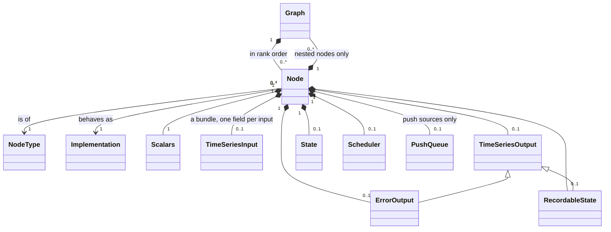
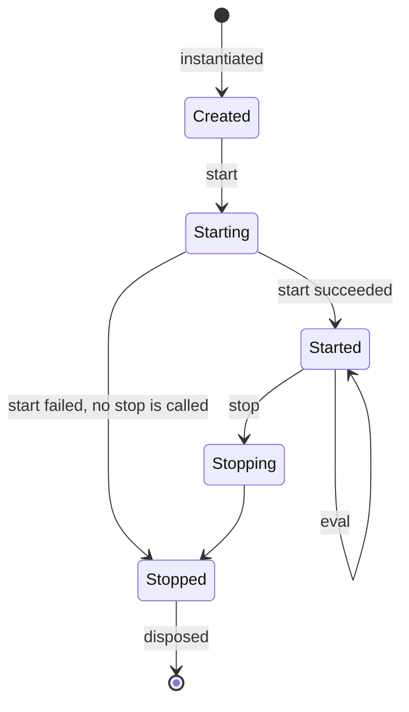
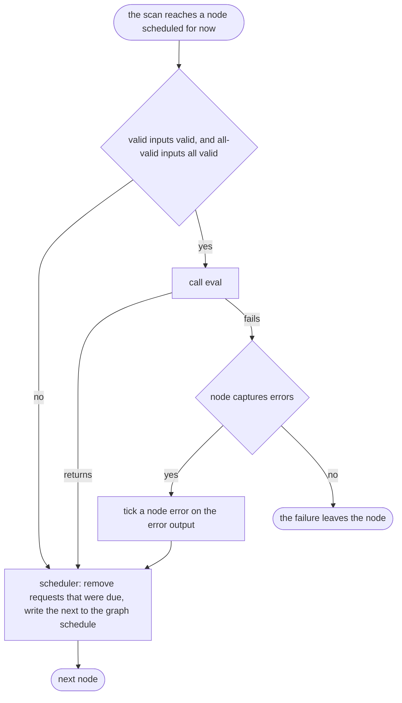

Node
====

Status: draft. See [Evidence](evidence.md) for implementation status.

A node is the unit of behaviour in a graph. Everything a graph *does* — take
in an event, compute, remember, schedule, report a failure, write to the
outside world — is done by a node.

Concept
-------

A node is three things, kept apart:

- its **type** — everything the runtime has to know to make and run one:
  what goes in, what comes out, what it keeps, and when it wants to be
  evaluated. This is data, and is part of the graph description (see Graph).
  Within the type, the **signature** is the part a caller sees and wiring
  connects: the inputs, the output and the scalars. State, recordable state,
  the scheduler and the rest are not in the signature;
- its **implementation** — the behaviour: a **start**, an **eval** and a
  **stop**. The implementation is what a node author writes;
- the **instance** — the node in a running graph: its inputs and outputs, its
  state, its place in the rank order, its lifecycle.

The runtime decides *whether* a node is evaluated; the implementation decides
*what happens* when it is. An implementation never has to ask "should I run?"
— by the time eval is called, the node was scheduled for this evaluation
time and the inputs it declared it needs are valid.

### Kinds

There are five kinds of node. The kind says where a node sits in the flow of
data; it follows from the shape of the node's signature.

| Kind | Inputs | Output | What it is for |
|---|---|---|---|
| **Push source** | none | yes | Admits events from outside, arriving from other threads at times the graph cannot predict. Root graph only; real time only; holds the lowest ranks |
| **Pull source** | none | yes | Produces values on a schedule of its own making: a constant, a timer, a replayed recording, a generator |
| **Compute** | yes | yes | Inputs to output |
| **Sink** | yes | none | Inputs to an effect outside the graph: a write, a send, a log, a recording |
| **Nested** | any | any | Owns one or more graphs and evaluates them as part of its own evaluation |

The special nodes that build larger behaviour — switch, map, reduce, mesh,
feedback, try/except — are nested nodes, or pairs of a sink and a pull
source. They are not specified here; they are written against this chapter.

Relationships
-------------

- A node **belongs to** one graph and has one position in it, its rank.
- A node **owns** everything in the lower half of the diagram. Which of them
  it has is fixed by its type.
- A node's inputs are a single **bundle** with one field for each declared
  input. That bundle is non-peered: it has no output behind it, and each
  field is bound separately (see Time-series types).
- The **error output** and the **recordable state** are time-series outputs
  like the main one. Other nodes may bind to them; an edge names which of the
  three it starts from.
- A node never holds another node. Nodes meet only through bindings.

State
-----

| Item | Values | Changed by | Seen by |
|---|---|---|---|
| lifecycle | created, starting, started, stopping, stopped | The graph | The node itself |
| scalars | Fixed at instantiation, from the description | Nobody | The implementation |
| inputs | Each input: bound or not, active or passive; and what it shows of its output | Bindings, by the graph or by a nested owner. Active/passive, by the node | The implementation, read-only |
| output | A time-series | The implementation, during eval | Every input bound to it |
| error output | A time-series carrying node errors | The runtime, when eval fails and the node captures errors | Every input bound to it |
| recordable state | A time-series | The implementation | The implementation; and anything bound to it |
| state | A scalar value | The implementation | The implementation only |
| scheduler | Pending requests: a time, and optionally a tag, each | The implementation; and the runtime, which removes requests as they fall due | The implementation |
| push queue | Events admitted and not yet delivered | Senders on other threads add; eval removes | The implementation |
| nested graphs | Graphs in any lifecycle state | The implementation | The implementation |

### State and recordable state

A node may keep two different kinds of memory, and the difference matters.
Both are values held on the node instance, from instantiation to disposal.
Neither is defined on the node's signature: a caller cannot see that a node
has them, and the implementation reaches them as injectables (see
Injectables).

**State** is a private value. It exists from instantiation until disposal,
it is read and written only by the node, it never ticks, and nothing outside
the node can see it. It is a cache: a node must behave the same whether its
state survived or was rebuilt from equivalent inputs, recordable history and
pending work. The same future events must give the same observations and
effects. A lost running total is not a cache. Native `State` does not enforce
this distinction.

**Recordable state** is a time-series the node owns, and it **works the same
as the output**. The node reads what it holds and writes to it during eval —
the whole of it, or piece by piece — and the writes of one eval make one
delta and one tick, exactly as for the output (NOD-6). Like the output it
can be seen from outside: bound to, recorded, and restored before the node
starts. It differs from the output in two ways, both because it is the
node's *own* memory. It does not schedule the node and is not part of the
node's admission rule, so a node is never woken by what it remembers. And it
may be given its first value in start, where the output may not be written
— unless it was restored, in which case start leaves it alone. It is for
memory that determines what the node does next and cannot be rebuilt — a
running total, the last value seen, events not yet dealt with.

A node restored from a recording finds its recordable state already valid
when start is called, and must not overwrite it. Its plain state is empty,
and start rebuilds it.

In HGL, `state` is recordable state and `cache` is state. HGL hides the
intended machinery: to the code, a `state` is a variable that is read and
assigned, and that it is a time-series underneath — ticking, recordable, restorable —
does not show. Mixed HGL state/cache lowering remains separate work; see
[implementation evidence](evidence.md).

Behaviour
---------

### Start

1. The inputs the node type declares active are made active (by default, all
   of them).
2. The implementation's **start** is called. It may read scalars, set up
   state, give recordable state its first value, schedule the node, and —
   for a push source — receive its sender. It may read its output — which
   has normally not ticked, so that what it reads is the output's type — but
   does not write it. Following HGL, start does not read inputs.
3. The node is started.
4. If the node type says **schedule on start**, the node is scheduled for the
   start time.

If start fails, the node's inputs are made passive again, the node is
**not** stopped — it never started — and the failure goes to the graph, which
stops the nodes that did start (see Graph).

Nothing is scheduled by default. A node that should run in the first cycle
says so, with schedule-on-start or by using its scheduler in start.

### Admission

A node is evaluated in a cycle when all of these hold:

1. its schedule entry equals the evaluation time (see Graph);
2. every input listed as a **valid input** is valid — by default, every
   input;
3. every input listed as an **all-valid input** is all valid.

If 1 holds but 2 or 3 does not, eval is not called. The node's scheduler
still moves on. Validity is checked afresh every time; nothing is latched.

Admission does not look at *modified*. A node is woken by notifications, and
a notification is not always a tick (see Time-series types): an implementation
that cares which input changed asks the input.

### Eval

During eval an implementation may:

- read any of its inputs, active or passive: value, delta, valid, modified,
  last modified time;
- write its own output, and only its own. Writing nothing means no tick. A
  write to the whole output replaces any earlier write in the same eval;
  writes to different children of a collection output accumulate into one
  delta; repeated writes to the same child keep the last;
- read and write its state and its recordable state;
- use its scheduler;
- make an input active or passive. This changes what will wake the node from
  now on; it never makes an input appear modified;
- instantiate, start, evaluate, stop and dispose of graphs it owns, and
  re-bind their inputs;
- use any injectable it asked for (see Injectables);
- request that the run stop;
- fail.

It may not write another node's output, change anything it reads from an
input, or cause a node of lower rank to be evaluated in the current cycle.
What an input gives is a read-only view, good for this cycle. A node that
wants to keep it — in its state, say — keeps a copy (see Scalar types).

### Stop

The implementation's **stop** is called once, for every node that started.
It is for ending what start began. It may read its output — what the node
last produced — but does not write it. After stop the node is never started
again.

### The scheduler

A node that asks for one has a scheduler: its own control over when it is
next evaluated, independent of its inputs.

- A **request** is a time, given as an instant or as a delay from the
  evaluation time, with an optional **tag**.
- Any number of requests may be pending. A request made with a tag replaces
  the pending request with the same tag.
- A request can be cancelled: by tag, or the earliest, or all.
- Once the node has started, a request must be for the future. During start,
  a request for the start time is allowed — this is how a source gets going.
- Only the **earliest** pending request is written into the graph's schedule.
- After each eval — and after each time the node was scheduled but not
  admitted — every request due at or before the evaluation time is removed,
  and the next earliest, if any, is written to the graph's schedule.
- An implementation can ask whether it is **scheduled now** — whether one of
  its own requests is why this cycle is happening — and, by tag, which.
- In real time a request may be for a **wall-clock** time instead of an
  evaluation time. It becomes an ordinary request when the wall clock reaches
  it. In simulation a wall-clock request is refused.

### Sources

A **pull source** has no inputs, so nothing wakes it but itself. It schedules
itself in start, and again in each eval for as long as it has more to
produce.

A **push source** is how another thread gets data into a graph. It is a node
with a **push queue**, and the two are separate things.

**The push queue** is the runtime's one way of moving changes from one thread
to another. It is not a kind of node. It has two ends:

- a **sender**, which may be called from any thread. It **admits** an event
  to the queue, or refuses it. Admission is the only thing another thread
  can do to a run. It wakes the engine;
- a **receiving end**, used only by the push source, in its eval, to **take**
  what has been admitted.

Order of admission is kept. A queue may be **bounded**: a full queue refuses,
and a sender that is willing to wait is admitted when there is room.
Back-pressure is applied at admission and nowhere else.

What *take* hands over is the queue's **type**, and choosing it is choosing
an implementation of the queue, not a different node:

| Queue type | Takes | If more is pending |
|---|---|---|
| one at a time | The oldest event | The push source asks for another cycle |
| everything at once | Every pending event, as one tuple in order of admission. Never an empty one | Nothing is left |
| combined | The pending events folded into one current value | Nothing is left |

**The push source node** does very little. In start it is given its queue's
sender, which it hands to whatever will produce the events. In eval it takes
from the queue and writes what it took to its output. In stop the sender is
closed first: later calls are refused, and callers waiting for room are
released.

**The node's signature has to match its queue's type.** For events of type
`X`, a queue that hands over one at a time gives a node whose output is a TS
of `X`; a queue that hands over everything at once gives a node whose output
is a TS of a tuple of `X`, or something equivalent; a combining queue gives a
node whose output is whatever the combined value is.

Events carry no time. They take the evaluation time of the cycle that
delivers them, which is why a push source cannot exist in simulation, and why
a graph with one is not deterministic.

### Failure

When an implementation's eval fails:

- If the node **captures errors**, the runtime writes a **node error** to the
  node's error output, and the cycle carries on. Whatever the node wrote to
  its output before it failed stands. The graph can bind to the error output
  and deal with the failure as data.
- Otherwise the failure leaves the node. It passes up through the evaluation
  of whatever nested nodes enclose it, any of which may capture it; if it
  leaves the root graph it ends the run (see Execution engine).

A **node error** says which node failed and why: the node's name and label,
where in the graph it sits, the message, and — to the depth the node type
asks for — the chain of upstream nodes whose ticks led to this evaluation,
optionally with the values they carried.

A failure in start or stop is never captured. It always goes to the graph.

Rules
-----

- **NOD-1** A node's lifecycle is created, started, stopped, in that order,
  each at most once. Eval is called only while started.
- **NOD-2** Eval is called only when the node is scheduled for the evaluation
  time and its valid and all-valid inputs are valid. Validity is checked at
  each evaluation.
- **NOD-3** Eval is called at most once per node per cycle.
- **NOD-4** A node is not scheduled unless something schedules it: an active
  input, its scheduler, or schedule-on-start.
- **NOD-5** A node writes only its own output, error output and recordable
  state. An eval that writes nothing causes no tick.
- **NOD-6** Within one eval: a whole-output write replaces earlier writes;
  writes to different children accumulate; writes to the same child keep the
  last. Recordable state is written under the same rule.
- **NOD-7** Making an input active or passive never changes whether it reads
  modified.
- **NOD-8** Recordable state behaves as an output of its node, with two
  differences: it never schedules its own node and is never part of its
  admission; and it may be given its first value in start.
- **NOD-9** A node behaves the same whether its state was kept or rebuilt.
  Only recordable state may carry what cannot be rebuilt.
- **NOD-10** Start does not overwrite recordable state that is already valid.
- **NOD-11** A node whose start fails is not stopped. Every node whose start
  succeeded is stopped exactly once.
- **NOD-12** After a node is evaluated, or scheduled but not admitted, no
  scheduler request at or before the evaluation time remains.
- **NOD-13** A tagged request replaces the pending request with that tag.
- **NOD-14** Once a node has started, its scheduler accepts only future
  times. During start it also accepts the start time.
- **NOD-15** A wall-clock request is refused in simulation.
- **NOD-16** A push source exists only in a root graph, and only in real
  time.
- **NOD-17** A push queue keeps the order of admission. A bounded queue
  refuses at capacity and admits again once something has been taken.
  Back-pressure is applied at admission only.
- **NOD-18** When a push source stops, its sender is closed before its stop
  is called.
- **NOD-19** When a node that captures errors fails in eval, exactly one node
  error ticks on its error output in that cycle, the cycle continues, and
  what the node had already written stands.
- **NOD-20** A failure in start or stop is never captured.
- **NOD-21** A node does not change what it reads from an input, and what it
  keeps from an input beyond the evaluation is a copy.
- **NOD-22** A node may read its own output in start, eval and stop. It
  writes it only in eval.
- **NOD-23** A push queue is the only way a change moves from another thread
  into a graph. Its sender may be called from any thread; its receiving end
  is used only by its push source, in eval.
- **NOD-24** A push source's output type matches what its queue hands over:
  for events of type `X`, a TS of `X` when they are taken one at a time, and a
  TS of a tuple of `X`, or an equivalent, when everything pending is taken at
  once. A queue that takes everything at once never hands over an empty
  tuple.

Deferred
--------

- **Checkpointing a node**: saving and restoring inputs, outputs and pending
  scheduler requests, and which nodes can be left out.
- **Run-wide shared state** as something a node can ask for (see Execution
  engine).
- **A lighter scheduler** for nodes that only ever ask to be woken and never
  cancel or query. hgraph has one so that such a node carries no scheduler
  state; it is an optimisation of the scheduler above, not a second concept.
- **Pausing**: a node suspending the cycle it is in.
- **Values owned by a language bridge**, and the marking of nodes that handle
  them.

Points to settle
----------------

1. **Inputs in start and stop.** Settled for the output: a node may read it
   in start, eval and stop, and writes it in eval (NOD-22); whether it might
   also be written in start is Injectables, point 1. For inputs, HGL gives
   start and stop no access at all (ADR 0010: "`start` and `stop` have no
   temporal input access"), which is stricter than this chapter is about the
   output. This draft follows HGL for inputs. Is that the runtime's rule, or
   only the language's?
2. **The output on a cycle that fails.** hgraph says what was written before
   the failure stands, and calls the result "unspecified" in places. NOD-19
   says it stands. Should a failing eval instead leave no tick on the main
   output at all?
3. **A request for the past** is quietly ignored by hgraph's scheduler but is
   an error in hgraph's graph schedule (see Graph, point 7).
4. **Where the queue's type is recorded.** Settled: how pending events are
   handed over is a choice of queue implementation, not of node, and the
   node's signature has to match it (NOD-24). A graph description names a
   node's implementation and its type (see Graph). Is the queue's type part
   of the push source's implementation identity, or a separate item in the
   node description that instantiation checks against the output type?
5. **Structural inputs** — inputs that notify on changes of membership only —
   are in the node type (see Graph) and not yet defined anywhere.
6. **Error capture for nested nodes.** hgraph captures errors for ordinary
   nodes and lists capture for nested, switch and mesh nodes as unfinished.
   Here a nested node that wants to capture a child's failure does so in its
   own eval.

Sources
-------

In hgraph: `docs/source/developer_guide/architecture.rst` (lifecycle, node
evaluation, the node scheduler); `developer_guide/error_handling.rst`;
`user_guide/cpp/authoring_nodes.rst`; RFC 0027 (push source queues);
`include/hgraph/runtime/node.h` and `node_scheduler.h`; HGL's
`language-model.md` (function abstraction, `state`, `cache`, `when`) and ADRs
0008 to 0011.
