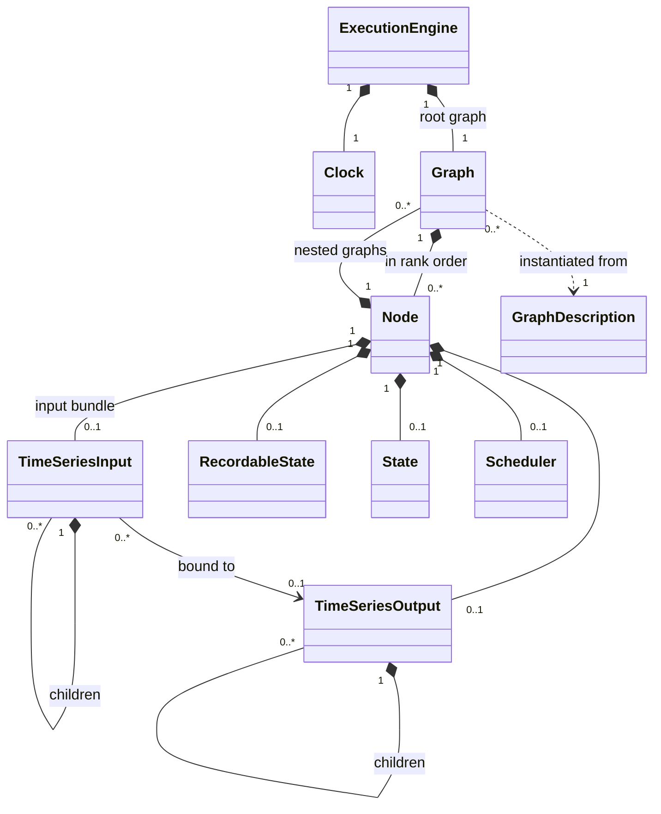
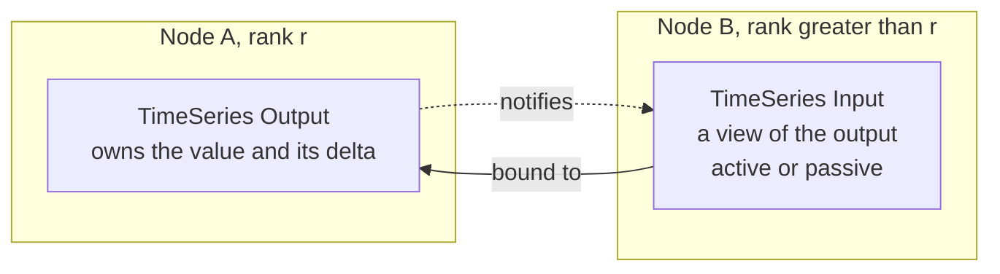
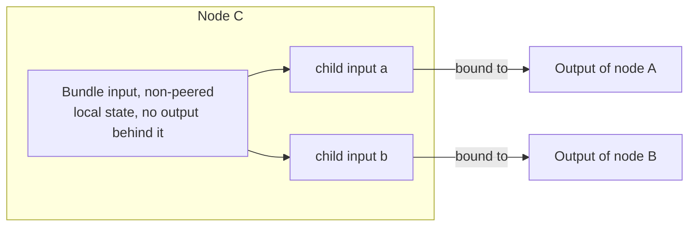
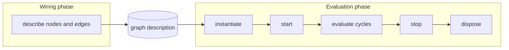

HGraph Runtime Specification
============================

Status: draft. See [Evidence](evidence.md) for implementation status.

This specification describes what an HGraph runtime *is*: the concepts it is
made of, how they relate, and the behaviour a program running on it can rely
on. It is written from the existing hgraph runtime and its documentation, but
it describes the concept and not that implementation.

The runtime covers:
1. Graph Execution Engine
2. Graph representation
3. Node representation
4. TimeSeries Types
5. Scalar Types
6. Injectables, system API types such as "Clock", "logger", etc.

The runtime provides these structures and nothing above them. It does **not**
specify special nodes such as map, switch, reduce or mesh; it specifies the
components such nodes are built from — a node that owns graphs, a graph that
can be built, started, evaluated and stopped while its parent runs, inputs
that can be re-bound, collections whose members come and go. If a special
node cannot be built from what is specified here, the specification is
missing a component, not a node.

What the runtime is
-------------------

An HGraph program is a **forward propagation graph**: a directed, acyclic
graph whose nodes compute and whose edges carry **time-series** — values that
change over time. The runtime evaluates that graph in **time order**. Time
advances in discrete steps; at each step only the nodes with something to do
are evaluated, in dependency order, each at most once, and every change they
make is visible downstream within the same step.

The runtime is reactive (work happens because something changed), incremental
(a change is described by a delta, not a new snapshot), and, when run against
recorded or simulated time, deterministic (the same graph and the same inputs
give the same ticks).

The runtime works in two distinct phases. In the **wiring** phase the nodes
and the relationships between them are *described*: the result is a **graph
description**, and nothing in it is live — no time-series exists, nothing can
tick. In the **evaluation** phase a graph is *instantiated* from a
description, then started, evaluated, stopped and disposed of. The
description is the only thing that passes from one phase to the other, and it
can be instantiated any number of times: once for the root graph, and on
demand by a nested node for each child graph it needs.

Structure
---------

A node also carries its **scalars** (fixed configuration values), optionally
an **error output**, and the **injectables** it has asked for. A nested graph
is a Graph like any other: it contains nodes, which may in turn own graphs.

Nodes are joined by **edges**. An edge is an input bound to an output:

Not every input is bound. A bundle or list input whose children are bound
separately, to different outputs, has no output of its own to view: it is
**non-peered**, exists only on the input side, and holds its own state. Its
children are the inputs that are bound. This removes a redundant collection-
assembly node, usually for a single consumer. With several consumers, sharing
one node and output may cost less and simplify binding. Local cached state
is allowed; a child scan on every read is not required.

The model in brief
------------------

**Time.** Time is an instant on the UTC timeline at microsecond resolution.
A run is a sequence of **evaluation cycles**, each at exactly one
**evaluation time**. Evaluation time never moves backwards, and everything
that happens at the same time happens in the same cycle. Nothing in the
runtime reads a wall clock except through the clock.

**Time-series.** An owned output has a **value** (its current state, which
persists until changed), a **delta value** (what changed in this cycle), a
**last modified time**, and two flags read from that time: it is **valid**
(it has a value) once its last modified time is no longer *never*, and it is
**modified** when its last modified time equals the evaluation time — and
only then. A modification is a **tick**. Reading the value of a time-series
that is not valid gives **nil**, the standard representation of no value; so
does reading the delta of one that is not modified. Inputs can add child-change,
sampling and binding observations (TS-7, TS-14–TS-15).

Separately, a time-series **notifies** whoever is watching it when its state
changes. Every tick notifies. So does *losing* validity, which is not a tick:
output invalidation resets the last modified time to *never*, so the output
reads neither valid nor modified and its value is nil — yet the nodes
watching it are woken. A node can therefore be evaluated when none of its
inputs reads modified.

There are eight kinds: a single value (TS), a bundle of named time-series
(TSB), a list (TSL), a set (TSS), a keyed dictionary of time-series (TSD), a
rolling window (TSW), a reference to another time-series (REF), and a
payload-free input observation (SIGNAL). Collections contain child time-series,
and a child's tick is a tick of every one of its ancestors.

**Scalar values.** What a time-series carries. The atomic values are
booleans, numbers, strings, bytes, the date and time types, and enums. The
composite kinds are tuple, struct, list, set and map, and **any**, which
holds a value of whatever type it is given. **Nil** is the one representation
of no value, used wherever a value may be absent. A value has a type with a
stable identity. Only a value's owner can change it, and only in its own
evaluation: everyone else is handed a read-only view that is stable for the
cycle, and keeps a value beyond the cycle only by copying it. A time-series
type is derived from the scalar type it carries.

**Outputs and inputs.** An **output** owns a time-series. An **input** that is
**bound** to an output is a view of it and owns no value: it is **peered**
with that output. A collection input need not be peered as a whole. When the
children of a bundle or list input are bound separately to different outputs,
the parent is **non-peered**: it has no output behind it, and its state — when
it was last modified, whether it is valid — is the input's own, derived from
its children. An input may be bound, unbound and re-bound while the graph
runs. An input is either **active** — a notification on it schedules its
node — or **passive** — readable, but it does not wake the node.

**Node.** A node is the unit of behaviour. It has a **start**, an **eval**
and a **stop**, zero or more inputs, at most one output, optionally state,
and optionally a **scheduler**. The scheduler is the node's own control over
when it is scheduled: with it a node can ask to be evaluated at a future
time, hold several such requests at once, and cancel them. There are five
kinds: **push source** (admits events from outside, from
other threads; root graph only, and ranked before everything else), **pull
source** (produces values on its own schedule), **compute** (inputs to
output), **sink** (inputs to a side effect), and **nested** (owns and
evaluates other graphs). A node is evaluated only when it is scheduled for the
current evaluation time *and* the inputs it requires are valid. Nothing is
scheduled by default: a node runs because an active input notified it,
because its scheduler has a request due, or because it asked to run at start.

**Graph.** A graph is an ordered set of nodes and the edges between them.
The order is the **rank** order, and it is the evaluation order: an input is
only ever bound to the output of an earlier node. The graph owns the
**schedule** — for each node, the next time it needs evaluating — and the
schedule is the only thing that causes a node to be evaluated. A notification
on an active input, a node's scheduler, and start-up scheduling all work by
writing the schedule.

**Evaluation cycle.** The graph scans its nodes in rank order and evaluates
those scheduled for now. A node whose output notifies schedules the nodes
bound to it, for now; they are later in the order, so the scan reaches them
in the same cycle. Each node therefore runs at most once per cycle and always
sees inputs that are complete for that cycle.

**Execution engine.** The engine owns a run of one root graph and decides
*when* cycles happen. In **simulation** it jumps straight to the next
scheduled time; in **real time** it waits for the wall clock or an outside
event.

**Graphs inside nodes.** A nested node owns one or more graphs. It builds
them from a description, starts them, evaluates them inside its own
evaluation at the same evaluation time, and stops and disposes of them —
any of these while the parent graph is running. A child graph's inputs are
bound to outputs outside it, and its next scheduled time becomes its parent
node's. This is the whole of what the runtime says about a graph that
changes shape as it runs; which child graphs exist, and when, is the
business of whoever writes the nested node.

**The outside world.** Data enters only through source nodes and leaves only
through sink nodes. Everything between is evaluated on one thread.

**Injectables.** What a node's implementation asks to be given, beyond its
inputs, output and scalars. Some are facilities of the run, the same for
every node: the clock, a logger, engine control. Others are held on the node
instance itself: its scheduler, its own output, its state and its recordable
state. None of them is defined on the node's **signature** — a caller cannot
tell that a node uses them.

**Errors.** A failure inside a node either becomes a tick on that node's
error output, where the graph can handle it, or ends the run.

The life of a run
-----------------

| Phase | Step | What happens |
|---|---|---|
| Wiring | Describe | The nodes and the relationships between them are described, giving a graph description: each node's type, its scalars and what implements it; the nodes' order; the edges. Nothing is live. |
| Evaluation | Instantiate | A graph is built from the description: its nodes, their inputs, outputs and state. Edges are bound, so an instantiated graph can be inspected before it runs. |
| | Start | Nodes are started in rank order. A node that fails to start ends the run: it gets no stop, and the nodes already started are stopped in reverse order. |
| | Evaluate | Cycles run from the start time (inclusive) until the end time (exclusive) is reached, nothing remains scheduled, or a stop is requested. |
| | Stop | Nodes are stopped in reverse rank order. Every started node gets exactly one stop attempt, even if another's stop fails. |
| | Dispose | The graph is released. A stopped graph is never started again; a fresh one can always be instantiated from the description. |

A graph owned by a nested node goes through instantiate, start, evaluate,
stop and dispose in the same way, at times its owner chooses, inside the
owner's own evaluation. The owner holds the child's *description* from the
wiring phase and instantiates from it on demand.

A description is meant to be storable: written out after wiring, loaded
later, and instantiated without wiring again. For that to be possible it must
be plain data — it names what implements a node by a stable identity and
never holds the implementation itself, a live resource, or anything
process-local. hgraph does not do this today; it is a goal the description is
specified to allow.

Fundamental rules
-----------------

Each chapter states its rules in full. These are the ones everything else
rests on.

1. Evaluation time never decreases, and is constant within a cycle.
2. The start time is inclusive and the end time is exclusive.
3. All work due at one time is done in one cycle. The engine never skips or
   merges scheduled times; combining events is a source node's business.
4. Within a cycle, nodes are evaluated in rank order, each at most once.
5. An input is bound only to an output of lower rank — whether by an edge, at
   the boundary of a nested graph, or through a reference. Nothing reads
   downstream. What must flow backward is a feedback: a sink scheduling a
   source for a later cycle, not a binding.
6. The schedule is the only activation gate. There is no other way to cause a
   node to be evaluated.
7. A node may schedule a later-ranked node for the current time, and any node
   for a future time. Never an earlier-ranked node for the current time, and
   never any node for the past.
8. An owned output is modified exactly when its last modified time equals
   the evaluation time, and valid exactly when that time is not *never*.
   Sampled and non-peered inputs have the observation rules in Time-series
   types. The logical value of an invalid series is nil; so is the delta of
   an unmodified one.
9. Becoming invalid resets the last modified time to *never*. It is
   therefore not a tick — the time-series reads neither valid nor modified —
   but it notifies, and an active input bound to it schedules its node.
10. Applying an output's successive deltas reproduces its value; dictionaries
    also need their membership changes (TS-5).
11. A child's tick is its ancestors' tick.
12. Evaluation is single-threaded. Other threads meet the graph only at a push
    source's queue.
13. In simulation, the same graph with the same inputs produces the same
    ticks, provided no node depends on *now* or the lag — both are measured
    on the computer's clock.
14. Start runs in rank order; stop runs in reverse; stop is final.

Chapters
--------

| # | Chapter | File | State |
|---|---|---|---|
| 1 | Execution engine | [execution_engine.md](execution_engine.md) | first draft |
| 2 | Graph | [graph.md](graph.md) | first draft |
| 3 | Node | [node.md](node.md) | first draft |
| 4 | Time-series types | [time_series.md](time_series.md) | first draft |
| 5 | Scalar types | [scalar_types.md](scalar_types.md) | first draft |
| 6 | Injectables | [injectables.md](injectables.md) | first draft |

Cases and supporting notes:

- [Conformance](conformance.md) and cases for [atomic series](cases_atomic.md),
  [collections](cases_collections.md), and [lifecycle](cases_lifecycle.md).
- [Representations](representations.md) and the bounded [layout example](layout_example.md).
- [Boundary contracts](boundaries.md), [evidence](evidence.md), and the
  [PR extraction and model review](extraction.md).

Concepts that cut across the six live in one chapter and are referred to from
the others:

| Concept | Lives in |
|---|---|
| Time, the clock, run modes, the evaluation loop, ending a run | Execution engine |
| Rank, edges, the schedule, the evaluation cycle | Graph |
| The graph description (wiring phase), and instantiating a graph from it (evaluation phase) | Graph; a node's part of the description is in Node |
| A graph owned by a node: its boundary, its lifetime, how its schedule reaches its parent | Graph, with the owning side in Node |
| Node kinds, lifecycle, when a node is admitted to evaluation | Node |
| Push and pull sources, sinks, queues and threads | Node |
| Node errors and the error output | Node; what ends a run is in Execution engine |
| State and recordable state | Node |
| The node scheduler | Node, which contains it; a node reaches it as an injectable, and its effect on the schedule is in Graph |
| Value, delta, valid, modified, notification; binding, peered and non-peered, active and passive, references | Time-series types |

Outside this specification: *how* a description comes to be written —
operator and type resolution, and the interface a compiler or an author
calls; the language and its compiler; special nodes (map, switch, reduce, mesh, feedback, try/except)
and the rest of the operator library; services, adaptors and contexts;
language bridges; checkpointing; distribution.

How this specification is written
---------------------------------

These are intended rules. Proposals and implementation gaps are marked in
[Evidence](evidence.md); the written cases do not certify a runtime.

**Concept first.** The specification starts from the concept and is refined
only as far as working behaviour requires. A facility hgraph has that no
concept here yet needs — externally driven stepping, observers, run-wide
shared state, pausing a cycle — is *deferred*, not rejected: it is named in
its chapter's Deferred section and specified when an implementation needs it.

**Every chapter has the same shape**, moving from concept to explicit detail:

1. **Concept** — what it is and why it exists, in prose.
2. **Relationships** — what it owns, what it refers to, what owns it, and
   in what numbers; a class diagram.
3. **State** — what it holds, the values each item can take, and who may
   change it; a state diagram where there is a lifecycle.
4. **Behaviour** — what it does and in response to what; flow or sequence
   diagrams.
5. **Rules** — numbered statements a test could check (`ENG-1`, `GRF-1`,
   `NOD-1`, `TS-1`, `VAL-1`, `INJ-1`). A test names the rule it checks.
6. **Deferred**, and **Points to settle**.
7. **Evidence and cases** — what supports a rule, and what a test should see.
   See [Evidence](evidence.md) and [Conformance](conformance.md).

**What belongs.** Could a node author, a graph author, or a test observing
ticks tell the difference? Evaluation order, validity, what a delta contains
and when a node wakes are in. Storage layout, dispatch mechanism, memory
management and the spelling of an API are out. Names are the concept's, not
an API's; where HGL already names a concept (`valid`, `modified`,
`scheduler`), that name is used.

**Which hgraph.** The C++ runtime's design rulings win. The Python
implementation holds the original design intent and is used to disambiguate
where the C++ documents are silent or unclear. hgraph's older specification
chapters describe the Python-era runtime and are used for framing only. The
known disagreements are listed in
[evidence and compatibility record](evidence.md).

Vocabulary
----------

| Term | Meaning |
|---|---|
| Active / passive | Whether a notification on an input schedules its node |
| All valid | A collection is valid and so is each of its immediate children. One level; not recursive |
| Bind | Attach an input to an output. *Unbind*, *rebind* likewise |
| Cycle | One evaluation of the graph, at one evaluation time |
| Delta | What changed in a time-series in this cycle |
| Edge | A binding from an output to an input |
| Evaluation time | The time of the current cycle; the graph's logical "now" |
| Graph description | What the wiring phase produces and a graph is instantiated from: plain data, never live |
| Lag | The real time that has passed since the current cycle began. Also called cycle time, or evaluation lag |
| Modified | For an owned output, last modified time equals evaluation time. Inputs also observe sampling and keyed withdrawal (TS-14–TS-15). Invalidation of an owned output is not a modification |
| Nil | The standard representation of no value: what an invalid time-series gives for its value, and an unmodified one for its delta |
| Notify | Tell whoever is watching a time-series that its state changed. Every tick notifies; so does becoming invalid, and so can a change of binding |
| Now | The engine's estimate of wall-clock time. In real time, the computer's clock; in simulation, evaluation time plus the lag |
| Peered / non-peered | A peered input is bound to one output and is a view of it. A non-peered collection input has no output behind it; its children are bound separately and its state is its own |
| Rank | A node's position in the evaluation order |
| Sampled | An input reports modified because it was (re)bound, not because its output ticked |
| Schedule | For each node, the next time it needs evaluating |
| Signature | A node's inputs, output and scalars: what a caller sees and wiring connects. State, recordable state and the other injectables are not in it |
| Tick | A modification of a time-series |
| Valid | The endpoint supplies a value under its shape and binding rules. An owned output has a last modified time other than *never* |
| View / copy | A view is a read-only look at a value someone else owns, stable for the cycle. A copy is an independent value, and the only way to keep one beyond the cycle |
| Wiring | The phase in which a graph is described. Nothing is instantiated and nothing can tick |

Points to settle
----------------

1. **What a graph description contains.** Settled: it is what passes from
   wiring to evaluation, it is plain data, and it is meant to be storable and
   instantiated on demand. A first pass at its contents, taken from hgraph's
   graph builder, is in [Graph](graph.md). The hard part it leaves open is
   how a description names what implements a node: hgraph holds behaviour as
   process-local function pointers, which is why its RFC 0022 manifest can
   *identify* a wired program but not rebuild one.
2. **How much of the wiring phase is specified depends on how HGL is
   compiled**, and that is not yet decided.
   - *The compiler emits code that does the wiring when run* — what has been
     done so far. The runtime must then provide everything that code calls:
     the wiring interface, type resolution, operator resolution. All of it
     has to be specified here.
   - *The compiler does the wiring itself and emits a stored graph
     description* that the runtime loads and instantiates. Wiring then lives
     in the compiler, and the runtime tracks only the description.

   This specification is written so that the second is possible — the
   description is complete and self-contained — and so far says nothing the
   first would need. If the first route is kept, a Wiring chapter is owed.

Notes for the chapters
----------------------

Settled here, with a detail left for the chapter that owns it.

- **Time-series: output modification and input observation.** An owned
  output derives modified and valid from its last modified time. A child's
  invalidation marks its owned parent modified (TS-7). A still-valid assembled
  input records child-change time locally; it may cache the result. A wholly
  invalid structure resets to *never* (TS-26). Sampling adds an input-side
  observation. Keyed withdrawal may report removals while unbound (TS-15);
  the chapter keeps
  that compatibility question explicit.
- **Time-series: dictionaries.** *Added* and *removed* are about membership.
  A key is added when it joins, whether or not its child is valid (TS-19).
- **Time-series: references keep rank order** (TS-20).
- **Scalar types: the list.** `any` is a value kind of the runtime. Cyclic
  buffer and queue are not: hgraph has them to implement windows, and they
  are an implementation's concern. `zoned_time` is new in HGL and is to be
  supported by hgraph; `bytes` exists in hgraph and HGL has not spelled it
  yet. Both are in the runtime's scalar list.
- **Scalar types: who may change a value.** Only its owner, in its own
  evaluation. Readers get a read-only view, stable for the cycle; to keep a
  value is to copy it (VAL-1, VAL-16, VAL-17).

Sources
-------

In hgraph: `docs/source/developer_guide/architecture.rst` (the engine, the
cycle, lifecycle); `developer_guide/data_structures/` and
`binding_vocabulary.rst` (time-series and values); `developer_guide/
nested_graphs.rst` (for the components nested nodes rely on, not the nodes);
the RFCs, notably 0002 (temporal types), 0022 (serialisable graph manifest),
0027 (push queues), 0031 (unbounded lists), 0036 (reference transparency); the Python implementation for design
intent; the older `docs/source/specification/` chapters for framing;
`language/docs/design/` for the names HGL gives these concepts; and the
`.hgspec` runtime-contract draft (PR #796).

[Dynamic-case validation](validation.md) records the TSD, REF and nested-graph
expectations, executed traces and implementation variations.

[Fixed collection cases](cases_fixed.md) validate the next TSL/TSB slice,
including nesting and whole-output versus child bindings. User rulings
and recorded variations are in its [comparison report](validation/fixed/README.md).
