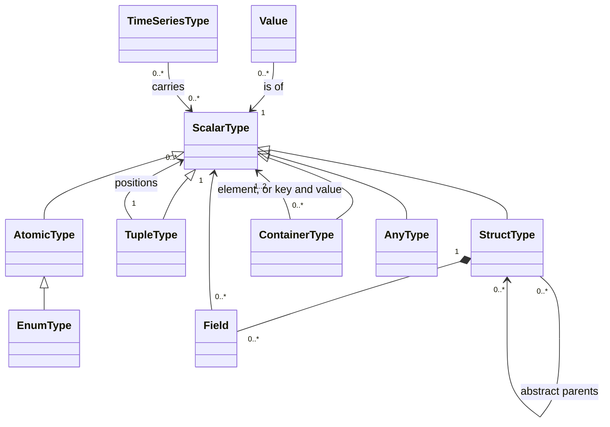

Scalar types
============

Status: draft. See [Evidence](evidence.md) for implementation status.

A scalar value is a piece of data with no time in it. It is what a
time-series carries from one tick to the next, what a node is configured
with, and what a node keeps as state. "Scalar" here means *not a
time-series*; it does not mean small — a map of structs is a scalar value.

Concept
-------

- **A value is read-only to everyone but its owner, and stable for a whole
  cycle.** Whoever is handed a value — a node reading an input, a function
  passed an argument — is handed a read-only **view** of it and cannot
  change it. The owner may: an output may hold its value in an efficient
  mutable form and update it in place. But it does so only in its own node's
  evaluation, so that from the end of that evaluation to the end of the cycle
  every reader sees the same thing. A value that changes from cycle to cycle
  is, in effect, what a time-series *is*.
- **To keep a value is to copy it.** A view is good for the cycle in which it
  was obtained. Anything that outlives the cycle — a node's state, a value
  written on to another output — holds a **copy**, which is an independent
  value that nothing else will change. How cheap a copy is, and whether one
  is physically made, is an implementation's business; that the holder
  cannot see later changes is the contract.
- **Every value has a type, and a type has an identity.** Two descriptions of
  the same type are the same type, wherever they were written. Identity is
  what lets wiring check an edge, a stored graph description be loaded, and
  two processes agree about what they exchange.
- **Types are resolved before anything runs.** A generic node is written
  against type variables; by the end of wiring every variable has a concrete
  type. Nothing in a running graph is generic, and no value is of an
  undetermined type — except inside an **any**, which exists for exactly
  that.
- **Nil is the one representation of no value.** It is what an unset field
  holds, what an invalid time-series gives, and what an empty **any** holds.

### The atomic types

| Type | Meaning |
|---|---|
| `bool` | True or false |
| `i64` | A 64-bit signed integer |
| `f64` | A 64-bit floating-point number |
| `str` | Text |
| `bytes` | Uninterpreted bytes |
| `date` | A calendar date, with no zone |
| `time` | A time of day, with no zone |
| `datetime` | An instant on the UTC timeline, to the microsecond. The type of evaluation time |
| `duration` | A length of time, in microseconds |
| `civil_datetime` | A date and time of day as read from a wall clock, with no zone and therefore not an instant |
| `timezone` | A named time zone |
| `zoned_datetime` | An instant together with its zone and the offset that zone gave it |
| `zoned_time` | A time of day in a named zone |
| an **enum** | A named type with a fixed, ordered list of named members, each with an integer |
| a **native atomic** | A type supplied from outside the language, opaque to it, brought in with whatever capabilities it declares |

### The composite kinds

| Kind | Meaning |
|---|---|
| **tuple** | A fixed number of values, each of its own type, by position |
| **struct** | Named fields, each of its own type. The scalar counterpart of a bundle |
| **list** | Values of one type, in order; of a fixed length or any length |
| **set** | Distinct values of one type, in no order |
| **map** | Distinct keys of one type, each with a value of another |
| **any** | A value of whatever type it is given, or nil. The value carries its type with it |

### Structs

A struct is **nominal**: its identity is its name, qualified by where it was
declared, together with its type arguments if it is generic. Two structs with
the same fields and different names are different types. A tuple, by
contrast, is **structural**: its identity is the types of its positions.

A field may be **optional**, meaning it may be left unset and hold nil. A
field that is not optional has a value in every complete struct, either given
or from its default.

A struct may **contain itself**: a field may be of the struct's own type, or
of another struct that leads back to it — a list node, a tree, an expression.
Such a field is always optional, since a struct that had to contain another
of itself could never be finished; nil is where the structure ends. A value
built this way is always a finite tree. It is compared, hashed, ordered and
copied all the way down.

Structs may form **families**. An **abstract** struct is never constructed;
it declares fields that its descendants share. A concrete struct is always a
leaf. A position typed as an abstract struct holds a value of exactly one of
its concrete descendants, and the value knows which. The family is
**closed**: the set of concrete members is fixed when wiring ends, and a
graph does not see members that appear later.

### From scalar types to time-series types

A time-series type is built from scalar types (see Time-series types): a TS
carries one scalar type, a TSS its element type, a TSD a key type and a child
time-series type. HGL derives the time-series type *from* the scalar type —
a struct becomes a bundle, a map a dictionary of time-series, a list a list
of time-series — and `atomic<T>` stops the derivation, giving one TS that
carries the whole of `T`. That derivation is the compiler's business. What
the runtime sees is its result.

Relationships
-------------

*Container* stands for list, set and map.

- A value **is of** exactly one type. An **any** is of type *any* and holds a
  value that is of its own type.
- A composite type **refers to** the types of its parts. Types may be nested
  to any depth.
- A struct **inherits from** any number of abstract structs, never from a
  concrete one.

State
-----

A value has no state beyond its content, and nobody but its owner can change
that. A **type** holds:

| Item | For | Meaning |
|---|---|---|
| kind | every type | Atomic, tuple, struct, list, set, map, any |
| name | enums, structs, native atomics | The qualified name that is the type's identity |
| parts | composites | Position types; fields (name, type, optional or not, default); element type; key and value types; fixed length or capacity |
| members | enums | The ordered members, each a name and an integer |
| parents | structs | The abstract structs it inherits from |
| abstract | structs | Whether it can be constructed |
| capabilities | every type | Which of the optional operations below its values support |

### Capabilities

Every value can be **copied** and turned into **text**. Three further
operations are optional, and a type either has each or does not:

| Capability | Means | Needed by |
|---|---|---|
| **equality** | Two values can be compared for being the same | Set elements; map keys |
| **hash** | A value can be used as a key | Set elements; map keys; the elements of a TSS; the keys of a TSD |
| **order** | Two values can be compared for which comes first. May be partial | Sorting, and the comparison operators |

A composite has a capability when its parts allow it:

| Kind | equality | hash | order |
|---|---|---|---|
| tuple, struct | every part has it | every part has it | every part has it |
| list | the element has it | the element has it | the element has it |
| set | the element has equality and hash | the element has equality and hash | never |
| map | the key has equality and hash | and the value has hash too | never |
| any | claimed; may fail when used | claimed; may fail when used | claimed; may fail when used |

An **any** cannot know what it will hold, so it claims every capability and
fails at the point of use if the value inside lacks one.

Behaviour
---------

- **Equality.** Values of different types are not equal. Two structs are
  equal when they are the same concrete struct and their fields are equal;
  two values of an abstract type are equal only if they are the same concrete
  member. Set and map equality ignore order. Unset equals unset.
- **Hash.** Equal values have equal hashes. A set's hash does not depend on
  the order its elements were added. Asking for the hash of a value that has
  none is an error, not a default.
- **Order.** Unset comes before set. An enum orders by its members'
  integers. Values of an abstract type order only within the same concrete
  member. A set or a map has no order.
- **Text.** Every value has a text form. An enum's is its member's name. A
  set or a map has no order, so its text lists its members in no specified
  order, and equal sets or maps may render differently (ruling 2026-09-24).
- **Constructing a struct.** Fields are given by name. A field not given
  takes its default; a field with no default must be given unless it is
  optional, in which case it is unset. A struct built with nothing given and
  every field optional is entirely unset.
- **Time arithmetic** is checked. A result outside the representable range
  is an error; it never wraps.
- **Identity.** Declaring a type that already exists gives the existing
  type. Declaring an enum or a struct under a name already in use, with a
  different definition, is an error.

Rules
-----

- **VAL-1** A value can be changed only by its owner. Whatever is handed a
  value is handed a read-only view of it.
- **VAL-2** The same description of a type, given twice, is one type.
- **VAL-3** A struct or enum is identified by its qualified name and type
  arguments; a tuple by the types of its positions. A named type never equals
  an unnamed one.
- **VAL-4** Generic struct types with different type arguments are different
  types, and neither is a subtype of the other.
- **VAL-5** Re-declaring a named type with a different definition is an
  error.
- **VAL-6** No value in a running graph has an unresolved type.
- **VAL-7** Equal values have equal hashes.
- **VAL-8** Set and map equality and hash do not depend on order.
- **VAL-9** A composite type has equality, hash or order exactly as the
  capability table says.
- **VAL-10** A TSS element type and a TSD key type must have equality and
  hash. This is checked when the type is formed, not when a value arrives.
- **VAL-11** Asking a value for an operation its type lacks is an error.
- **VAL-12** Unset equals unset and orders before set. A struct constructed
  with nothing given is unset in every optional field.
- **VAL-13** An enum's values order by their integers, and its text is the
  member's name.
- **VAL-14** A value of an abstract type is of exactly one concrete member,
  fixed when it was made. The members of a family are fixed when wiring ends.
- **VAL-15** Time arithmetic that leaves the representable range is an error.
- **VAL-16** A view does not change during the cycle in which it was
  obtained.
- **VAL-17** A value kept beyond the cycle in which it was read is a copy. A
  copy is independent: no later change to the original is visible through it.
- **VAL-18** A struct may have a field of its own type, directly or through
  other structs. Every such field is optional. Equality, hash, order and copy
  follow the whole depth of the value.

Deferred
--------

- **Serial forms.** hgraph has a binary form and a JSON form, registered per
  atomic type. They are needed for recording, replay and distribution, and
  go with those.
- **How an owner holds a value it changes in place.** hgraph lets a container
  type be declared mutable, as a separate type from its read-only form, and
  wraps values so that a reader gets a view and a keeper gets a copy without
  either having to know. That is how VAL-1, VAL-16 and VAL-17 are *met*; the
  rules themselves are the concept.
- **Cyclic buffer and queue.** hgraph has both as value kinds. They exist to
  implement windows (TSW) — they are the changing store behind one, not
  values a graph passes around — and so are an implementation's concern.
- **Shared and owned handles** to struct values. hgraph uses a shared handle
  to avoid copying large values, and an owned one-pointer handle as the way a
  struct holds a field of its own type. Both are mechanisms: VAL-18 is the
  concept the second one serves.
- **Values belonging to a language bridge**, such as an arbitrary Python
  object. They are **any**-kind values whose capabilities the bridge
  supplies.
- **Library scalars**: narrower integers and floats, periods, ranges of dates
  and instants, data frames and series. Each is a native atomic or a struct
  as far as this chapter is concerned.
- **Types as values**: a type passed as a node's scalar, to select behaviour
  at wiring time. It matters to wiring, not to a running graph.

Points to settle
----------------

1. **Arithmetic the language has not settled.** HGL leaves open `i64`
   overflow, integer division and remainder on negative operands, division by
   zero at run time, and how `NaN` compares. hgraph's own arithmetic table is
   the reference until it does. These are operator questions, but the answers
   fix what `i64` and `f64` *are*.
2. **Strings.** Ordering, indexing, length and normalisation of `str` are
   undefined in HGL.
3. **An unknown enum integer.** hgraph's native text form falls back to the
   number; HGL rejects the value. A runtime that receives one from outside —
   a recording, another process — needs one answer.
4. **Clearing an optional field through a delta.** In a bundle's delta an
   absent field means "no change", so there is no way to say "this optional
   field is now unset". HGL rejects the attempt until there is.
5. **Field order with several abstract parents.** Field order is part of a
   struct's identity as data; hgraph and HGL both leave the order across
   multiple parents undecided.
6. **Map equality.** As read from hgraph's type registry, a map has equality
   when its *key* has equality and hash; the value type is not mentioned. It
   presumably has to have equality too. The capability table follows the
   registry and should be checked.
7. **Recursive fields across modules.** VAL-18 is settled. HGL ADR 0012 is
   accepted and implemented for its admitted domain in both backends at the
   [audited revision](evidence.md). A recursive edge is optional and an atomic
   boundary, so temporalization terminates. Direct and mutual recursive edges
   are supported; recursion through containers remains excluded by that ADR.
   Importing a struct from another module still waits for general struct
   imports. The earlier statement that HGL rejects all recursive fields is
   superseded.

Sources
-------

In hgraph: `docs/source/developer_guide/data_structures/schemas/scalar.rst`
and `core_concepts.rst`; RFC 0002 (the date and time types), RFC 0028 (shared
values), RFC 0033 (types as values), RFC 0035 (the type layer without
Python); the capability rules in `src/hgraph/types/metadata/
type_registry.cpp`; HGL's `language-model.md` (structs, families, generics,
enums) and `type-extensions.md`.
