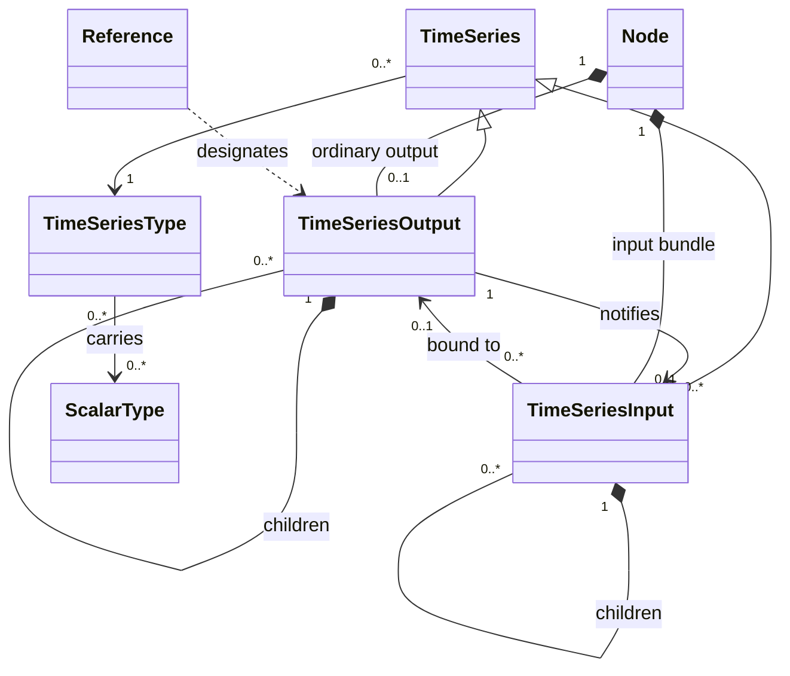
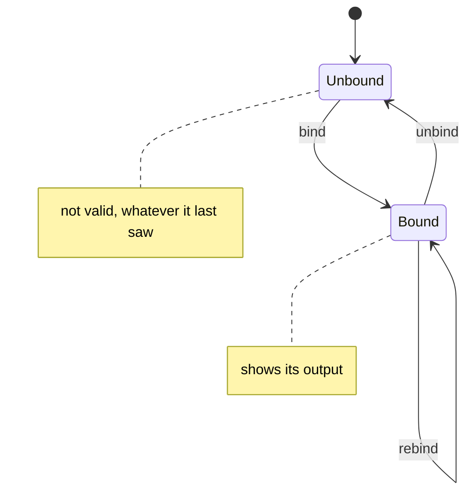
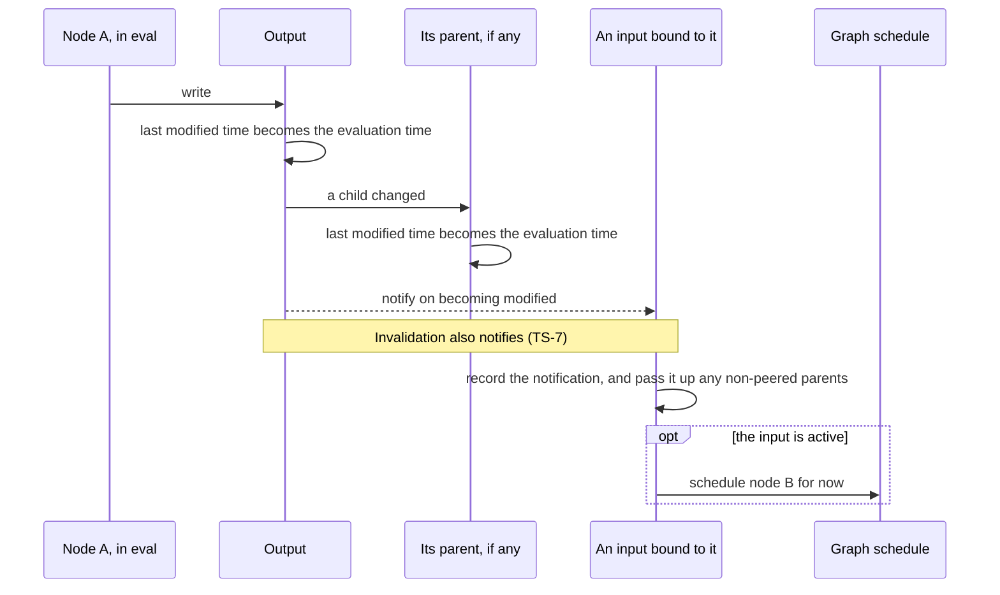

Time-series types
=================

Status: draft. See [Evidence](evidence.md) for implementation status.

A time-series is a value that changes over time. It is what flows along every
edge of a graph, what every node reads and writes, and the thing that makes
the runtime incremental: a time-series knows not only what it is, but what
about it changed in this cycle.

Concept
-------

### What every time-series has

The timestamp definitions below describe owned outputs. Inputs reflect them
or add child-change, sampling and binding observations (TS-7, TS-14–TS-15).

| Property | Meaning |
|---|---|
| **value** | Its current state. Persists from cycle to cycle until changed |
| **delta value** | What changed in this cycle, and only that |
| **last modified time** | The evaluation time of its latest tick; *never* if it has not ticked, or has been invalidated |
| **valid** | It has a value: its last modified time is not *never* |
| **modified** | It ticked in this cycle: its last modified time equals the evaluation time. Nothing else makes it modified |
| **all valid** | For a collection: it is valid and so is each of its immediate children. One level; never recursive |

A **tick** is a modification. Reading the value of a time-series that is not
valid gives **nil**; so does reading the delta of one that is not modified.

Valid does not mean non-empty. A set that has ticked and holds nothing is
valid; a set that has never ticked is not.

### Outputs and inputs

An **output** owns a time-series: the value, the delta, the last modified
time. It belongs to the node that writes it, and only that node, in its own
evaluation, changes it. The output may hold its value in whatever form is
efficient and change it in place from one cycle to the next. Everything else
sees the value **read-only**, and sees it **stable**: once the owner's
evaluation is over, what the output shows does not change for the rest of
the cycle. A reader that wants to keep what it saw beyond the cycle takes a
**copy** (see Scalar types).

An **input** belongs to a node that reads. An input **bound** to an output is
a view of that output — it is **peered** with it — and owns no output value: asking
the input for its value asks the output.

Not every input is peered. A collection input whose children are bound
separately to different outputs is **non-peered**: it exists only on the
input side, with local state driven by its children. It removes a collection-
assembly node: its observations should match that node's result. This usually
saves work for one consumer; several consumers may favour a shared node and
output. That is a cost choice, not a different collection contract.
An input may also be **local**, holding a time-series of its own with no
output behind it.

An input is **active** or **passive**. A notification on an active input
schedules its node. A passive input is just as readable, and keeps track of
what it has seen, but wakes nothing.

### Notification

A time-series **notifies** whoever is watching it when its state changes.
Every tick notifies. So do two things that are not ticks: **becoming
invalid**, and some **changes of binding**. Notification is what wakes nodes
(see Graph); *modified* is what a woken node reads to find out what changed.
The two usually coincide. A wholly invalid fixed input reads unmodified.
Within a still-valid assembled structure, child invalidation is a local change
observation (TS-7). A node may also be scheduled with no modified input and
discover the change through *valid*.

### The kinds

| Kind | In HGL | What it is |
|---|---|---|
| **TS** | `f64`, `atomic<T>` | One scalar value that changes over time |
| **TSB** | a `struct`, a tuple | A bundle of named time-series, each ticking on its own. A tuple is a bundle with positions for names |
| **TSL** | `list<T, n>`, `list<T>` | A list of time-series: a fixed number of them, or a list that grows and shrinks at its end |
| **TSS** | `set<T>` | A set of scalar values, with what was added and removed |
| **TSD** | `map<K, V>` | A dictionary from scalar keys to time-series, whose keys come and go while the graph runs |
| **TSW** | `rolling<T, size>` | A window over the most recent values of one scalar: the last *n* ticks, or the last span of time |
| **REF** | — | A reference to another time-series: a value that says *which* time-series, not what it holds |
| **SIGNAL** | `signal` | A tick with no payload |

TSB, TSL and TSD are **collections**: they contain child time-series. A child
is a complete time-series in its own right, with its own value, delta and
last modified time. TSS and TSW hold scalar values and have no children.

Relationships
-------------

- A time-series **has** a type, and its type says which scalar types it
  carries (see Scalar types). From the type alone one can say what its value
  looks like and what its delta looks like (the table under State).
- A collection **owns** its children. A child's tick is a tick of its parent,
  and so of every ancestor up to the output or input at the top.
- An input is **bound to** at most one output. An output **notifies** any
  number of inputs. Binding can change while the graph runs.
- A binding can be made at any level: a whole bundle input to a whole bundle
  output, or one field of a bundle input to anything of the right type.
  Everything beneath a peered input is part of that one binding.
- A **reference** designates an output without being bound to it. It is a
  scalar value, and travels through the graph as one.

State
-----

### Common state

| Item | Held by | Notes |
|---|---|---|
| value, delta | An output; a local input | A peered input has none of its own |
| last modified time | Outputs and local input observation state | A plain peered input reports its output's; sampling and assembled child changes add local observations |
| watchers | An output | The inputs bound to it |
| bound to | An input | An output, or nothing |
| role | An input | Peered, non-peered or local. A reference may change a fixed collection between whole-output and child bindings |
| active | An input | Set from the node type when the node starts; the node may change it |

A **non-peered** fixed input is valid when any child is valid, and all valid
when itself and every child are valid. While it remains valid, child ticks
and invalidations update its change time; modified means that time is now.
An invalidated child's input view also records that change, with nil value
and delta. Idle reads retain the change time, not an older sibling's time.

When the whole structure becomes invalid, its time and descendant observation
state reset to *never*, unmodified. Binding to an invalid target also clears
old sample state (TS-14). Implementations may cache these observations from
child events; reads need not scan children (TS-27).

### Value and delta, by kind

| Kind | Value | Delta | All valid |
|---|---|---|---|
| TS | The scalar | The same scalar | Same as valid |
| TSB | Every declared field, with nil for an invalid child | The valid modified fields, by name, each with its own delta | Every field valid |
| TSL, fixed | The elements, by position | The valid modified elements, by position, each with its own delta | Every element valid |
| TSL, growing | The elements, by position | Positions removed from the end, and the modified elements by position. Never both added and removed positions in one cycle | Every element valid |
| TSS | The set | The elements **added** and the elements **removed** | Same as valid |
| TSD | The live keys, each with its child's value — nil where the child is not yet valid | The keys **removed**, and the modified keys each with its child's delta. Which keys were **added** in this cycle is asked of the dictionary; it is not a separate part of the delta | Every live key's child valid. Removed keys do not count |
| TSW | The values in the window, oldest first, each with the time it arrived | The value that arrived in this cycle | The window holds its minimum: enough ticks, or enough span |
| REF | The reference | The reference | Same as valid |
| SIGNAL | True | True | Same as valid |

A valid TSB value has its full declared structure, recursively. A named bundle
is a struct, not a sparse map. An invalid nested bundle occupies its field as
nil; a wholly invalid bundle reads nil. Deltas remain sparse (TS-24).

A TSW is valid from its first value. Only *all valid* waits for the minimum.

Behaviour
---------

### A tick

- An admitted publication of the value a time-series already holds is still
  a tick: equal scalar values may carry a signal. REF is the exception; an
  unchanged designation causes no additional tick or sampling (TS-16).
  An operator may suppress an equal scalar result before publication; a
  conformance adapter must identify that boundary.
- Further writes while already modified do not notify again; the final
  delta describes the net change. Invalidation notifies separately (TS-7).
- The delta is read through *modified*: in any later cycle it reads nil,
  whatever was there. Nothing sweeps deltas away at the end of a cycle, and
  nothing needs to.

### Becoming invalid

An output can lose its value. Its last modified time goes back to
*never*, so it reads not valid and not modified, and its value reads nil. Its
children, if it has any, become invalid with it. Its watchers are notified,
and its owned parent is told a child changed, so that parent reads modified
in that cycle. A still-valid assembled input records the change on its child
view and parent, as an assembly node would. The producer stays invalid and
unmodified. If the assembled structure becomes invalid, all its observation
times reset to *never* instead (TS-26).

### Collections within a cycle

- **Sets.** Adding and then removing the same element in one cycle cancels
  out: it appears in neither *added* nor *removed*. The set has still ticked.
  *Added* and *removed* never share an element.
- **Dictionaries.** *Added* and *removed* are about **membership**. A key is
  added when it joins the dictionary, whether or not its child has a value
  yet, and removed when it leaves. A child becoming valid or invalid does not
  add or remove its key. A removed key and its child stay readable for the
  rest of the cycle: a node can see what was removed, and what it last held.
  Putting the key back in the same cycle gives back the *same* child, and the
  key is then neither added nor removed. After the cycle a removed key's
  child is gone, and inputs that were bound to it are unbound.
- **Growing lists** shrink only from the end. Removed elements are kept for
  the rest of the cycle in the same way, and growing again in that cycle
  brings the same elements back.
- A dictionary's **key set** is itself a time-series, a TSS, that can be
  bound to on its own. It ticks when keys come and go and not when their
  values change.

### Binding

| Event | What the input reads afterwards | Notification |
|---|---|---|
| **bind** | The output's state, as it is, including the output's own last modified time. If the output ticked two cycles ago the input reads valid and not modified | None |
| **bind, sampled** | A valid target reads modified with its sampled delta; an invalid target reads unmodified, time *never*, and nil delta | A changed binding notifies; an active input schedules its node |
| **unbind** | Not valid | None — except a TSS or TSD input, which ticks once to report every element or key it was showing as removed |
| **rebind** | An unbind and a bind in one step. A TSS or TSD input ticks once with the difference: keys only in the old output removed, keys only in the new one added, and the children of the new one read as modified | As sampled bind |

A sampled valid input reports the sampling time; its producer keeps its own
time. A sampled scalar's delta is its value; a collection reports its valid
children's sampled deltas. Sampling descends through valid children. An invalid
target reads unmodified with time *never* and contributes no sampled delta, recursively.
It inherits neither the previous binding's time nor the sampling time.
A passive input has the same observations as an active one.

Fixed collection rebinding compares each child's target. Unchanged bindings
keep their observation state; changed valid targets are sampled. Parent deltas
contain those children's deltas. Changing whole A to A.left + B.right samples
only right, even though the parent's peering changes (TS-25).

A keyed withdrawal is an input-side event: the input is invalid and modified,
has no current members, and reports the former members as removed for this
cycle. Its last modified time is `never`; the withdrawal event, not an owned
output timestamp, makes it modified. The removal delta is readable while
invalid. Physical teardown detaches silently and does not synthesize this
running-graph withdrawal. See [reference cases](cases_references.md).

Sampling is how an input brought into a running graph — a new branch of a
switch, a new key of a map — sees values that were set before it existed.

When an output is disposed of, its bindings must be detached before its
storage is destroyed. Teardown itself must not schedule work against that
storage; this is distinct from an explicit keyed withdrawal while running.

### References

A **reference** is a scalar value that designates a time-series output. It is
one of: **empty**; a reference to **one output**; or, for a bundle or a fixed
list, a reference **per child**. A reference to a reference is just the inner
reference.

- A REF ticks on its first publication, including empty, and on a changed
  designation. Publishing the same designation again causes no additional
  tick, notification or sampling: a REF routes data; it is not a signal.
  Target-value equality is irrelevant; two outputs remain distinct targets.
  A REF does **not** tick when its target ticks. A node holding a REF input
  is therefore not woken by the data, only by the re-pointing — which is the
  point: references let a node route a time-series without paying for its
  traffic.
- Node code may store a reference, pass it on, compare it and write it to a
  REF output. It may not look through it. The only way to read what a
  reference designates is to bind an input to it.
- **A reference and the thing it refers to are interchangeable at a binding.**
  A `REF<X>` input may be bound to an `X` output: the input's value is a
  reference to that output, and it ticks when the binding is made and not
  when the output ticks. An `X` input may be bound to a `REF<X>` output: the
  input follows the reference — each time the reference changes, the input is
  re-bound, sampled, to the newly designated output, and from then on shows
  that output's ticks as though bound to it directly. An empty reference
  leaves the input unbound.
- **A reference does not escape rank order.** What a reference designates is,
  by definition, one of two things: an output of a node of **lower rank in
  the same graph**, or an output that came in **from the parent graph** —
  which, seen from the parent, is of lower rank than the nested node that
  owns this graph. Either way it has already been evaluated in the cycle.
  That is simply where references come from: a reference is made from an
  output a node can already see, and it travels along edges, which only run
  forward. A reference is a way of choosing *which* upstream output to read,
  never a way of reading downstream or sideways. Graphs owned by the same
  node are parallel: they share a parent and nothing else, and nothing in one
  refers to anything in another.

### SIGNAL

A SIGNAL input may be bound to an output of any kind. It shows only that the
output ticked: it reads modified when the output does, and has no value worth
reading. It is how a node says "wake me when that changes; I do not care what
it is".

Rules
-----

- **TS-1** An owned output is modified exactly when its last modified time
  equals the evaluation time, and valid exactly when that time is not
  *never*. A plain peered input reflects the output. A non-peered input
  maintains child-change observations while valid (TS-7, TS-27); sampling
  adds the input-side observation in TS-14. An unbound input is not valid;
  keyed withdrawal retains the removal observation in TS-15 (see Points to settle).
- **TS-2** The value of a time-series that is not valid is nil. The delta of
  one that is not modified is nil.
- **TS-3** An owned output's last modified time never decreases, except
  that invalidation returns it to *never*. A still-valid assembled input
  records child invalidation at the current time and retains it while idle;
  it does not fall back to an older sibling time. Invalid structures reset
  to *never*, including locally cached observations.
- **TS-4** A child modified in a cycle means every ancestor is modified in
  that cycle.
- **TS-5** Applying an output's deltas and child-validity changes in order,
  from its last invalid state, reproduces its value. Invalidation replaces a
  fixed child's value with nil. TSD also needs membership changes:
  published-value deltas alone omit keys with invalid children.
- **TS-6** Marking a time-series modified notifies its watchers. Further
  writes while it is already modified do not notify, even an input that
  began watching between writes. Invalidation notifies separately (TS-7).
  Several notifications still cause only one node evaluation (GRF-16).
- **TS-7** Output invalidation notifies, resets its time to *never*, and is
  not a tick. Its owned parent reads modified. In a still-valid assembled
  input, the affected child view and parent record the current change time
  and read modified; the invalid child's value and delta remain nil.
  If the whole input becomes invalid, TS-26 clears those observations.
- **TS-8** A passive input never schedules its node. Making an input active
  or passive does not change what it reads, and never itself schedules the
  node — not even when its source has already ticked in the cycle.
- **TS-9** All valid implies valid. TSB, TSL and TSD additionally require
  every immediate live child to be valid, without asking its all_valid.
  Removed children do not count. TS, TSS, REF and SIGNAL use valid; TSW additionally
  requires its minimum. An empty collection passes only if itself valid.
- **TS-10** In a set's delta, *added* and *removed* share no element. An
  element added and removed in one cycle is in neither.
- **TS-11** A key removed from a dictionary, and its child, are readable for
  the rest of that cycle. The key restored in that cycle is the same child,
  with its previous value and timestamp unless explicitly written. From the
  next engine cycle, a key that remained removed and its child are absent
  from both live and removed observations. This applies to reference-valued
  children too; removing one does not destroy its independently owned target.
- **TS-12** A growing list shrinks only from its end, and never reports
  positions both added and removed in one cycle.
- **TS-13** A window is valid from its first value, and all valid once it
  holds its minimum.
- **TS-14** A plain bind causes no notification. A sampled valid target reads
  modified in its cycle: a scalar's delta is its value; a collection reports
  valid children's sampled deltas. An invalid target and its invalid
  descendants read unmodified, time *never*, and no delta.
  Sampling changes input observations, never producer timestamps.
- **TS-15** Unbinding causes no notification, except that a set or dictionary
  input reports what it was showing as removed.
- **TS-16** A REF ticks on its first publication or a changed designation,
  never on an equal repeat or because its target ticked. Equality compares
  endpoint identities and, for child references, their designation tree;
  it does not compare target values. Equal repeats cause no additional work.
- **TS-17** An input follows changes of its REF. Changed valid targets are
  sampled; unchanged fixed child bindings are preserved (TS-25).
  An empty reference unbinds it.
- **TS-18** A SIGNAL input is modified exactly when the output it is bound to
  is.
- **TS-19** A dictionary key is *added* when it joins the dictionary, whether
  or not its child is valid, and *removed* when it leaves. A child becoming
  valid or invalid neither adds nor removes its key.
- **TS-20** A reference designates an output of a node of lower rank in the
  same graph, or an output that entered from the parent graph. An input bound
  through a reference is therefore bound only to an output already evaluated
  in the cycle. Nothing refers into a parallel graph.
- **TS-21** Only an output's own node changes it, and only during that
  node's evaluation. From the end of that evaluation to the end of the cycle,
  what the output shows does not change.
- **TS-22** What an input gives is read-only. Anything kept from it beyond
  the cycle is a copy.
- **TS-23** A saved reference does not extend an endpoint's lifetime. From
  the first engine cycle after its dictionary key remained removed at cycle
  end, it designates nothing and binding through it leaves the input unbound. Reusing the key
  or its storage cannot retarget the old reference. Reclamation may be lazy;
  expiry must be observable at that cycle boundary.
- **TS-24** A valid TSB value contains every declared field, including nil
  for invalid children. Apply this at each valid nested bundle. Its schema
  does not shrink with validity; its delta contains only changed valid fields.
- **TS-25** Fixed child bindings survive changes between peered and assembled
  parents. Rebinding samples only changed valid targets; unchanged targets
  retain their times and delta state. Each parent includes its valid modified
  children's deltas. Binding an invalid target clears previous sample state.
- **TS-26** Whole TSL/TSB invalidation resets the collection and every child
  to invalid, unmodified, time *never*, value nil and delta nil. This also
  clears local observations when an assembled input loses its last valid
  child. It notifies; clearing is not a publication of an all-invalid value.
  Resetting input observations never changes independently owned producers.
- **TS-27** Non-peered fixed collections fold an assembly node into its
  consumer. Time and modification may be maintained locally from child events;
  reads need not recompute them. Caches obey invalidation and rebind resets.
  Several consumers may instead share one assembly node and output.

Deferred
--------

- **Clearing a window**, and windows that evict on a timer rather than on
  arrival (hgraph RFCs 0006 and 0007, neither accepted).
- **How the two directions of reference binding are carried out.** hgraph
  has the *output* own a converted view of itself for each kind of input that
  asks; that is a mechanism, and only what an input sees is specified here.
- **Choices of representation** for an output's value.

Points to settle
----------------

1. **When is an owned bundle valid?** A bundle *output* is valid once it has
   ticked, and in hgraph stays valid even if its only valid field is later
   invalidated. A non-peered bundle *input* is valid only while some child
   is. The same bundle can therefore read differently from its two ends.
2. **Keyed withdrawal** is specified under Binding and exercised by
   REF-DICTIONARY. It is the explicit input-side exception to the owned-output
   timestamp rule. Implementation variations are recorded separately.
3. **Expired stored references** follow TS-23, confirmed 2026-09-21.
   REF-EXPIRES fixes the cycle boundary and distinguishes using a saved
   reference from inserting a new dictionary member.
4. **A reference carried backward.** TS-20 holds by construction so long as
   references travel only along edges. The one way to break it is to carry a
   reference backward — through a feedback, into a lower-ranked node — and
   bind through it there: that node would then read an output not yet
   evaluated in the cycle. Is that simply a mistake in the graph, or
   something the runtime should refuse when the input is bound?
5. **When are two types compatible at a binding?** GRF-7 requires an edge's
   source and target to have compatible types, and nothing yet says what
   that means in full. The pieces that are stated: the same type is
   compatible; a reference and what it refers to are interchangeable; a
   SIGNAL input accepts any output. The piece that is not: hgraph lets a
   named bundle and an un-named bundle with the same fields be bound to each
   other, but not two bundles with different names. It needs one rule, here,
   before bundles are built.
6. **Structural inputs.** hgraph lets a node type mark a collection input as
   waking the node only when members come and go. It is a third setting
   beside active and passive, and is not defined here yet.
7. **The delta of a whole value.** HGL leaves the result shape of `delta(x)`
   open. The table under State is hgraph's.
8. **Before the first tick.** HGL leaves `valid` and `last_modified` before a
   first tick open. TS-1 and TS-2 answer it: not valid, *never*, nil.

Sources
-------

In hgraph: `docs/source/developer_guide/data_structures/schemas/
time_series.rst` (tick semantics, value and delta by kind);
`data_structures/plans_and_ops/time_series.rst` and `linking_strategies.rst`
(binding, sampling, keyed unbinds, delta visibility);
`developer_guide/binding_vocabulary.rst`; RFC 0031 (growing lists), RFC 0036
(references); the ruling of 2026-09-19 on `all_valid`; HGL's
`language-model.md` (canonical temporal types, temporal metadata, collection
traversal).
