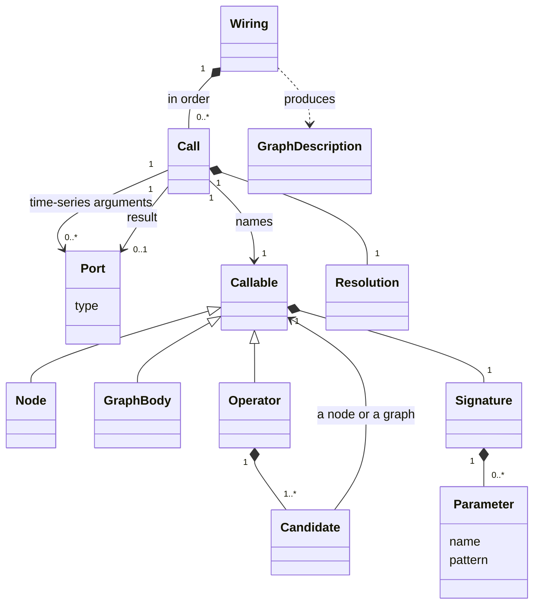
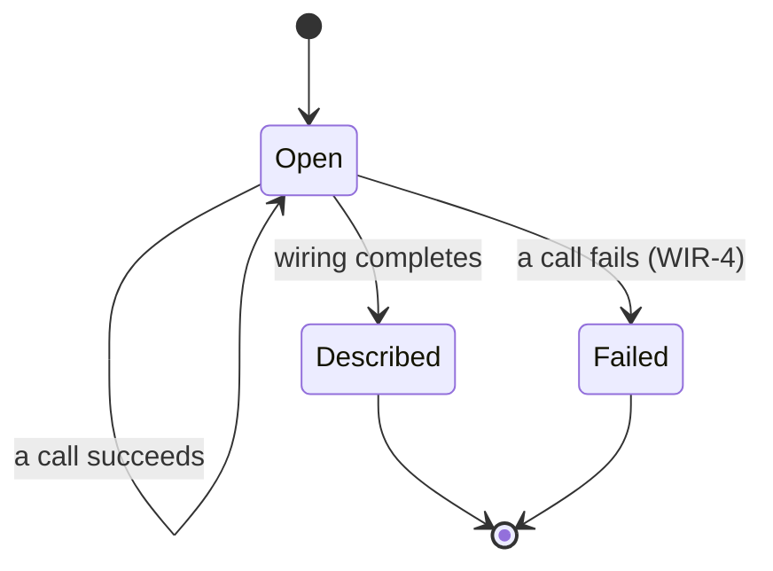
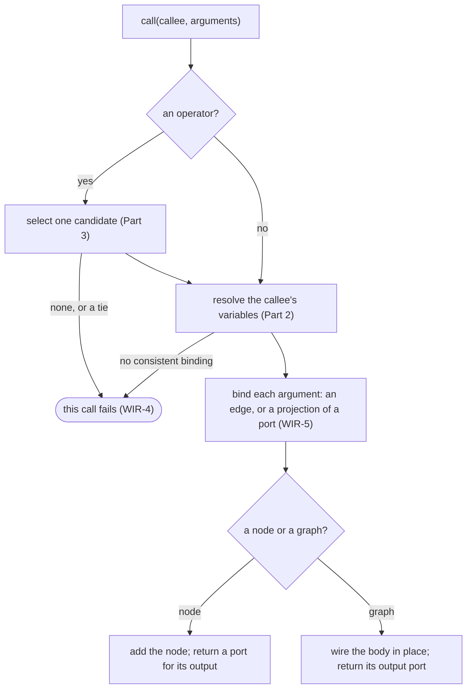
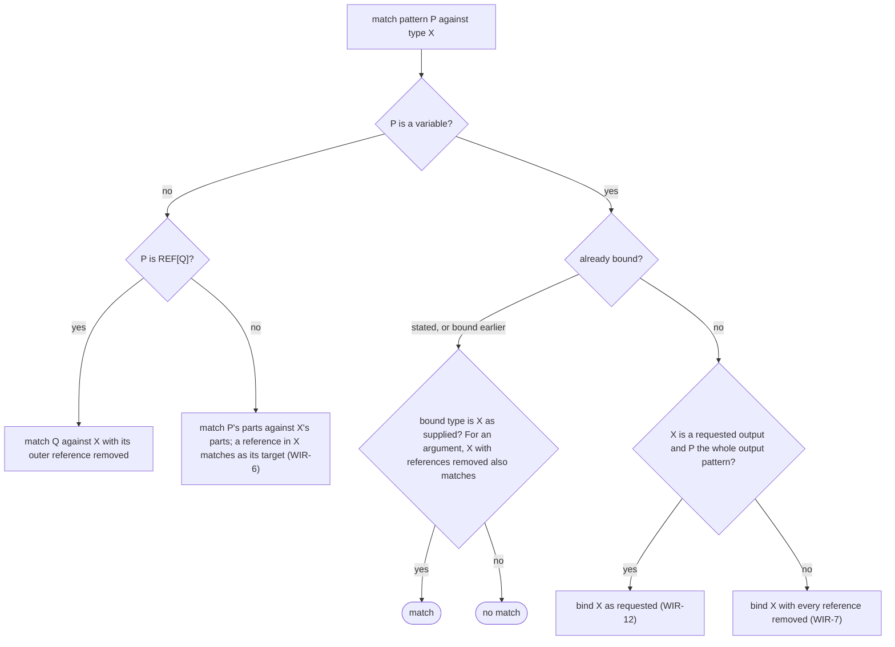
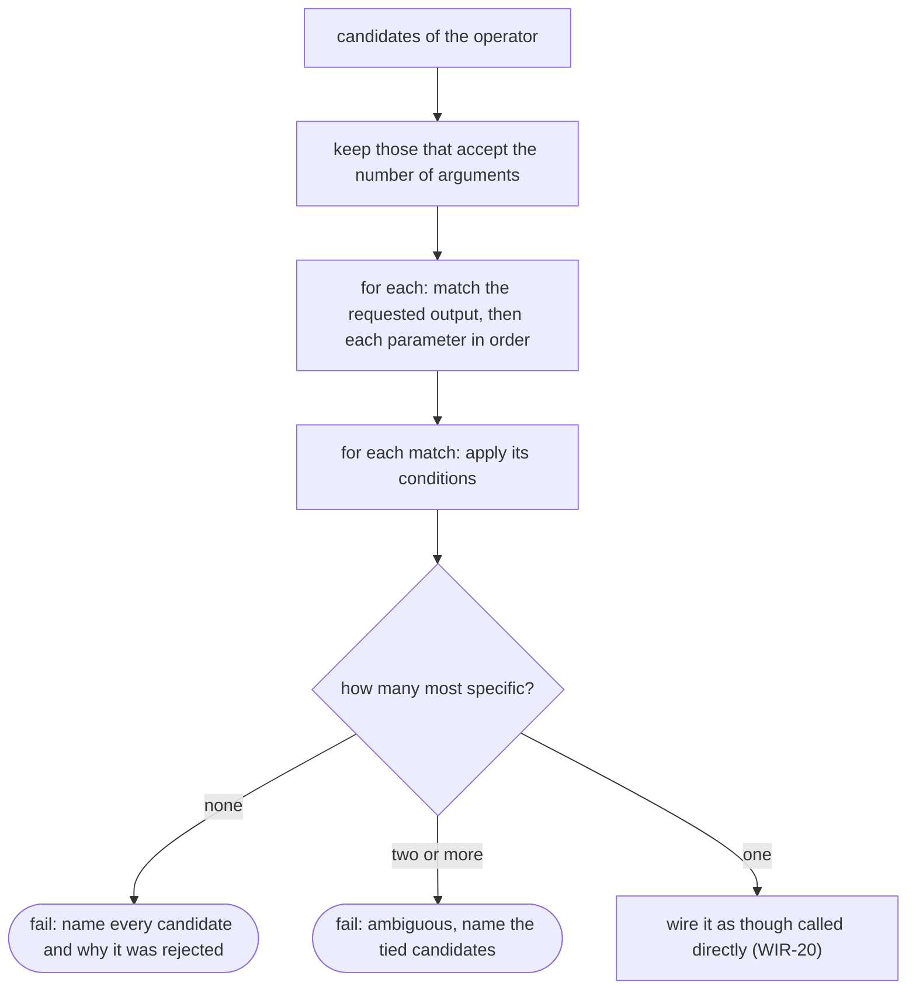

Wiring
======

Status: draft, 2026-09-26. Type resolution (Part 2), projections (WIR-5) and
candidate selection (WIR-16 to WIR-18) are validated against Python hgraph
0.5.41 and the C++ runtime ([wiring validation](validation/wiring/README.md)).
The other rules are a first draft from the C++ implementation and its
developer guide; the Evidence table says which.

Wiring is the phase that writes a [graph description](graph.md). HGL compiles
to code that does the wiring when it runs, so the runtime provides what that
code calls: the wiring interface, type resolution and operator resolution
(point to settle 2 of the [overview](overview.md)). This chapter specifies
them. Every front end that describes graphs — Python wiring, C++ wiring, the
HGL compiler — follows these rules.

Concept
-------

A graph is described by **calls**. A call names a node, a graph or an
operator and supplies **arguments**: time-series arguments, which are
**ports**, and scalars. Calling a node adds the node to the description and
returns a port for its output. Calling a graph wires the graph's body in
place. Calling an operator selects one of its implementations, its
**candidates**, and calls that.

A **port** is an output that will exist when the graph runs. It has a type
and no value. Nothing can be read through it: the graph it belongs to has
not been built, let alone started.

Each parameter of a signature declares its type as a **pattern**. A pattern
is a concrete type, or contains **type variables**: `TIME_SERIES_TYPE`, a
key type `K`, a list size `SIZE`, a bundle schema. A signature with variables
is **generic**. Wiring a generic call **resolves** it: each variable is bound
to a type, and the call is then as concrete as if it had been written out.

Every call makes three decisions:

1. **Which implementation** — operator resolution (Part 3).
2. **What types** — type resolution (Part 2).
3. **How each argument binds** — an edge from the argument's output to the
   callee's input. Binding follows [Time-series types](time_series.md): in
   particular, a reference and the thing it refers to are interchangeable at
   a binding.

**References are explicit.** A reference is how a value is reached, not what
it is. A node that consumes values and is handed a reference token would
format, compare or record the token: plausible output that is wrong. So a
type variable never binds a reference by accident. A node sees a reference
only where its signature, or its caller, says so.

Part 1 — The wiring interface
-----------------------------

### Relationships

A wiring session holds the calls made so far and produces one description.
A call names what it calls, takes ports and scalars, and returns at most one
port. Its resolution holds a binding for each of the callee's type
variables.

### State

A port's type is fixed when the port is made and never changes. A session
is open until it produces its description. A call that fails fails the
graph: it does not wire, and the error says where and why (WIR-4). Catching
the error does not reopen the session.

### Behaviour

### Rules

- **WIR-1** Wiring describes a graph and never evaluates it. No time-series
  of the graph being described exists during wiring; a port has a type and no
  value. A constant computed during wiring is the result of an operator's
  **constant kernel**: the candidate is selected exactly as a wired call
  would select it (Part 3), and its kernel is a function of the call's
  scalars and type arguments, called directly. It reads no time-series, and
  to the graph being described its result is a scalar.
- **WIR-2** Every port has one time-series type, fixed when the port is made.
  No type variable survives into a description.
- **WIR-3** A call binds each argument to a parameter of the callee's
  signature. A time-series argument becomes an edge to the callee's input,
  or a projection of a port (WIR-5); a scalar argument becomes part of the
  callee's scalars (GRF-8).
- **WIR-4** A call that cannot be wired fails at that call, with an error
  that names the call and the reason. The call is not repaired: wiring never
  substitutes another candidate, drops an argument or skips the call. The
  failure fails the graph: it does not wire, even when the graph's own
  wiring code catches the error, because what the failed call already
  wired cannot easily be undone (owner rulings 2026-09-26). The error says
  where and why. Where: the call, named as its author declared it, and the
  path of graph calls that led to it. Why: the arguments' types, and each
  candidate's reason for not matching.
- **WIR-5** Selecting a field of a bundle port, or an element of a
  fixed-size list port, by a name or index known at wiring time, is a
  **structural projection**: it adds no node and yields that part of the
  port, with its type as supplied. Beneath a reference the part is not known
  until run time, so selecting it adds a node that publishes a reference to
  the part.

Part 2 — Type resolution
------------------------

### Concept

A variable is bound by matching a pattern against a type. Where the type
comes from decides how the variable binds:

| The type comes from | The variable binds |
|---|---|
| An argument | The argument's type with every reference removed, at every depth |
| A pattern that names a reference, `REF[T]` | Beneath the reference, then as above |
| A stated resolution, made before matching | The stated type, references included |
| A requested output, when the variable is the whole output pattern | The requested type, references included |
| A requested output, when the variable is nested in a structure | As for an argument |
| A structural projection | Nothing: a projection resolves no variable |

The first row is the rule; the other rows are the ways code that depends on
a reference says so. A requested output is the caller stating the type it
wants: an explicit output type, or a type argument such as
`nothing[REF[TS[int]]]`.

For example, a map of references, `TSD[str, REF[TS[int]]]`, passed to a
generic `TIME_SERIES_TYPE` input binds the variable to `TSD[str, TS[int]]`.
The input then follows each reference and sees the values; a key whose value
ticks makes the input modified.

### Behaviour

### Rules

- **WIR-6** For matching, a reference is compatible with the type it refers
  to, in both directions and at any depth. What an endpoint observes is
  decided when it is bound ([Time-series types](time_series.md), references).
- **WIR-7** A type variable bound from an argument binds the argument's type
  with every reference removed, at every depth. This holds for a bare
  variable and for a bundle's schema variable.
- **WIR-8** A generic input therefore observes values. Bound to a source
  whose type holds references, it follows them (TS-17) and is modified when a
  referenced value is. A node observes a reference only where its signature
  declares one.
- **WIR-9** Code that depends on a reference declares it, in one of the four
  ways WIR-10 to WIR-13 give. Nothing else makes a variable bind a reference.
- **WIR-10** A reference in a pattern: the variable binds beneath it.
  `REF[T]` given `REF[X]`, or `X`, binds `T` to `X` with its references
  removed.
- **WIR-11** A stated resolution: a variable given a type before matching
  keeps it, references included. A port matches the variable when its type
  is the stated type, as supplied or with its references removed. The
  variable's constraints, and a schema variable's bundle kind, still apply.
- **WIR-12** A requested output. A variable that is the whole output pattern,
  bare or a bundle's schema variable, binds the requested type as requested,
  references at any depth kept. A request for a reference to a bundle,
  `REF[X]`, where the output pattern is a bundle, binds the pattern to `X`:
  the output is the bundle, and a reference and its target are
  interchangeable at a binding. A variable nested inside a structural output
  pattern binds as WIR-7 says. A variable already stated must be the requested type,
  references included, or the candidate does not match.
- **WIR-13** A structural projection (WIR-5) resolves no variable. A field
  or element declared as a reference stays a reference.
- **WIR-14** Resolution is one set of rules. Every front end resolves a call
  by WIR-6 to WIR-13 and WIR-15. A front end that resolves a call itself,
  rather than asking the runtime, reaches the bindings the runtime would
  reach for the same call.
- **WIR-15** Bundles match by their fields: two bundle types match when they
  have the same field names, each with a matching type. Fields pair by name;
  their order does not matter. A bundle's name counts only when both are
  named, and then the names must be equal. So a named bundle and an unnamed
  bundle with the same fields match, in any order, and two named bundles
  with the same fields but different names do not. This holds wherever two
  types are compared: an argument against a parameter, a repeated variable,
  a stated or requested type, and a service implementation's output against
  its interface. (Owner rulings 2026-09-26.)

Part 3 — Operator resolution
----------------------------

### Concept

An **operator** is a name with a general signature and a set of
candidates, each a node or a graph with its own signature. A call names the
operator, never a candidate. The candidates whose signatures match the call,
and whose conditions admit it, compete; the most specific wins.

Specificity is a partial order on signatures, made total by comparing them
part by part: a concrete type is more specific than a variable, and a
variable inside a structure is more specific than a bare one. `TS[int]` is
more specific than `TS[SCALAR]`, which is more specific than
`TIME_SERIES_TYPE`; `TSL[TS[int], SIZE]` than `TSL[TIME_SERIES_TYPE, SIZE]`.

**The operator's signature and its candidates.** An operator states a
minimum shape; its candidates are the potential matches. Every operator
behaves as if its signature ended with `*args, **kwargs`: a call may pass
arguments the operator does not declare, and they go to the candidates. A
candidate has the operator's parameters and may declare more, with or
without defaults; it may refine a declared type but never widen it. The
operator's signature checks that each candidate has that shape when the
candidate is registered or compiled; after that, the arguments a call
actually supplies decide which candidates match (owner rulings 2026-09-26).

### Behaviour

### Rules

- **WIR-16** An operator call selects exactly one candidate: the most
  specific of the candidates that match the call and whose conditions admit
  it. If none match, the call fails, and the error names each candidate and
  why it was rejected. If two or more are most specific, the call fails as
  ambiguous, naming them.
- **WIR-17** A candidate matches in this order: the requested output first,
  then the parameters in the order declared. A variable bound earlier
  constrains every later appearance; a repeated variable binds once.
- **WIR-18** Specificity: a concrete type is more specific than a variable;
  a variable inside a structure is more specific than a bare variable;
  structures compare part by part; a reference adds nothing (WIR-6); a
  repeated variable counts once. Scalar parameters separate only candidates
  that are equally specific in their time-series parameters.
- **WIR-19** Selection depends only on the call and the candidates, never on
  the order in which the candidates were registered.
- **WIR-20** The selected candidate is wired as though it had been called
  directly. A node candidate adds its node; a graph candidate is wired in
  place and adds no node of its own.
- **WIR-21** A call is matched against each candidate's own signature
  (WIR-16 to WIR-18), not against the operator's. The operator's signature
  is the minimum each candidate meets and a guide to callers.
- **WIR-22** Every operator accepts arguments beyond those it declares, as
  if its signature ended with `*args, **kwargs`, and a call passes them to
  the candidates. A candidate has every parameter the operator declares and
  may declare more, with or without defaults. A parameter the operator
  declares optional (with a default) may be absent from a candidate, which
  then matches only calls that do not supply it: `min_(lhs, rhs = optional)`
  admits a unary candidate over a collection. A candidate that requires an
  argument the call does not supply does not match; that is not an error.
- **WIR-23** A candidate may refine a declared parameter or output to a
  narrower type (a concrete type for a variable, a structure for a bare
  variable). It never widens one: every type a candidate accepts for a
  declared parameter is one the operator's parameter accepts, and a
  variable the operator constrains stays within those constraints.
- **WIR-24** A front end checks each candidate against the operator's
  signature when it registers or compiles the candidate, and rejects one
  that does not have the operator's shape (WIR-22, WIR-23). The arguments a
  call supplies then decide which of the remaining candidates match.

Deferred
--------

Specified in hgraph's developer guide (`operators.rst`, `graph_wiring.rst`),
as a description of the C++ implementation, and not yet here. The first four
are next: code HGL generates calls operators that rely on them, so they need
rules and cases here as type resolution has.

- **Defaults and default resolvers**, and **conditions** on candidates
  (`requires`): what a condition may read, and when defaults are applied
  relative to matching.
- **Keyword and variadic packs**: how `**kwargs` and variadic parameters
  match and rank.
- **Type arguments**: a parameter whose argument is a type, and how a
  non-type argument passes over a defaulted type argument (RFC 0033).
- **Constants evaluated at wiring** (WIR-1's constant kernel): which
  operators declare one, and what an eager call needs that a wired call gets
  from its graph, such as a recordable id (`record_replay_table.rst`,
  "P1 — const-evaluable operators"; RFC 0042).
- **Context inputs and services**: inputs bound by name from an enclosing
  scope rather than by an argument.
- **Wiring diagnostics**: labels and source locations carried into the
  description.
- **Conditional wiring**: a test made while wiring (can this call be
  wired?) that includes a block of wiring only when it passes, as Swift's
  `#if` and `canImport` conditions include code (owner direction
  2026-09-26). Since a failure cannot be caught (WIR-4), this is how a graph
  chooses between two ways of wiring. It is to be designed for HGL first
  (owner, 2026-09-26), and needs an RFC. Until then the runtimes do not
  enforce WIR-4 against a caught failure (WV-10, not corrected).
- **Nested graphs**: `map_`, `switch_`, `reduce` and `mesh_` build their
  child graphs from the ports as supplied; they are library, not runtime
  (see [Overview](overview.md)).

Points to settle
----------------

1. **Does a bundle's name take part in matching?** Settled 2026-09-26
   (owner): only when both bundles are named; otherwise fields alone decide.
   This is WIR-15.
2. **A requested reference for a bundle pattern.** Settled 2026-09-26
   (owner): requesting `REF[X]` is a reasonable output type; WIR-12 satisfies
   it with the bundle `X`, since a reference and its target are
   interchangeable at a binding.
3. **Selecting an element by a key known only at run time.** Settled
   2026-09-26 (owner): the call is still fully typed once wired. `getitem_`
   on a TSL by a `TS[int]` index, or on a TSD by a `TS[K]` key, declares its
   input as a value, so the input resolves with references removed (WIR-7),
   and declares its output as `REF[E]` (or `REF[V]`): it publishes a
   reference to the selected element's value. A selected element whose type
   does not match that output is a run-time error.
4. **HGL's map of references.** Settled 2026-09-26 (owner): HGL's
   `map<K, ref<V>>` is a map containing references, `TSD[K, REF[V]]`. There
   is no reference around the map itself.
5. **A failure that wiring code catches.** Settled 2026-09-26 (owner): a
   wiring failure always fails the graph, even when the graph's own code
   catches the error, because what the failed call already wired cannot
   easily be undone. This is WIR-4. A choice between two ways of wiring is
   made by an explicit test instead; that construct is deferred.

6. **A candidate wider than the operator.** Settled 2026-09-26 (owner): a
   candidate cannot widen the operator it implements (WIR-23), and the check
   of WIR-24 rejects it.

Evidence and cases
------------------

[Wiring cases](cases_wiring.md) give the derivations; the
[wiring validation](validation/wiring/README.md) records the Python 0.5.41
and C++ observations.

| Rules | Evidence |
|---|---|
| WIR-5, WIR-6 to WIR-13 | Wiring cases, run on both runtimes and held by `python/tests/test_wiring_contract.py`; the same cases through native C++ wiring in `tests/cpp/test_wiring_contract.cpp`. The C++ matcher and its static unifier are checked row by row in `tests/cpp/test_operators.cpp` ("resolving a generic dereferences everything at every depth (#847)") |
| WIR-14 | The HGL front end was observed to vary (WV-2) and is corrected; `language/tests/ir/lower_tests.cpp` replays the front-end case |
| WIR-15 | The bundle-identity case, run on both runtimes |
| WIR-21 to WIR-24 | The operator-contract case, run on both runtimes and the HGL front end, and through native C++ wiring in `tests/cpp/test_wiring_contract.cpp` |
| WIR-4, WIR-16 to WIR-18 | Wiring cases for selection, ambiguity, no candidate and repeated variables, in both test files above. Ranking in detail: `operators.rst` ("Ranking") and the dispatch tests in `tests/cpp/test_operators.cpp` |
| WIR-1 to WIR-3, WIR-19, WIR-20 | Source evidence only: `graph_wiring.rst` ("Graphs flatten", "Identity at wiring time"), `operators.rst` ("OperatorRegistry and resolution") |

The owner's ruling of 2026-09-24 (issue #847) states WIR-7 and WIR-9:
"whenever resolving a generic, we de-reference everything. If the code
depends on REF it must express that."

Sources
-------

In hgraph: `docs/source/developer_guide/writing_nodes.rst` ("A generic
time-series parameter binds the DEREFERENCED type", "The matcher and unifier
contract"), `operators.rst` (resolution, ranking, REF transparency, type
arguments), `graph_wiring.rst` and `wiring.rst`;
`src/hgraph/types/type_pattern.cpp` (the runtime matcher),
`include/hgraph/types/type_resolution.h` (the static unifier),
`src/hgraph/types/operator_dispatch.cpp` (selection). For HGL:
`language/docs/design/type-extensions.md` (`ref<T>`) and
`language/src/ir/generic_substitution.cpp` (its generic inference).
