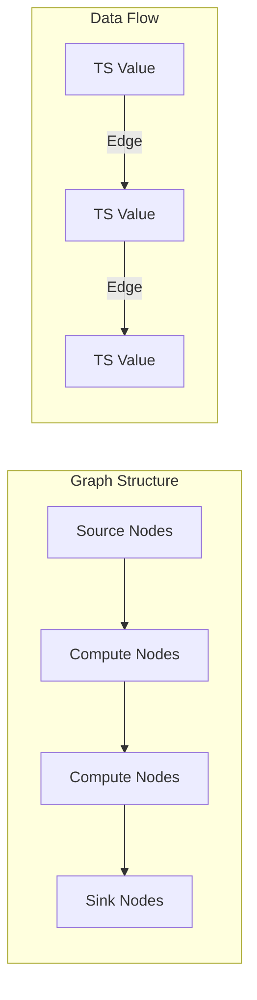
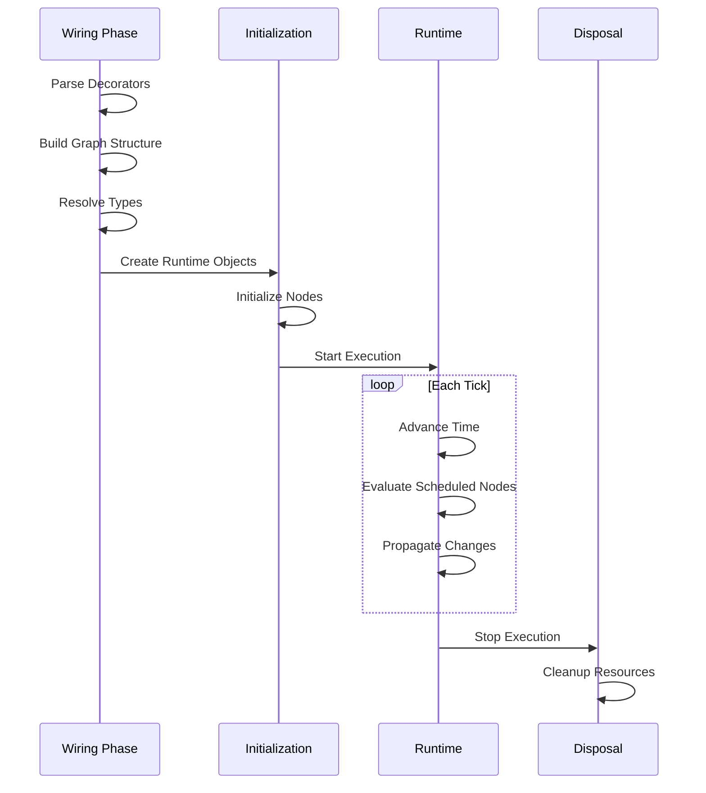

# Specification Index

**Version:** 1.0 Draft
**Last Updated:** 2025-12-20
**Status:** Initial Draft

---

## Document Purpose

This specification serves as the authoritative reference for the HGraph programming language and runtime system. It is designed to enable implementation of compatible HGraph runtimes in any programming language while maintaining semantic equivalence with the reference Python implementation.

This document follows the model of language specifications like the C++ Standard, providing:
- Precise behavioral definitions
- Type system semantics
- Runtime execution model
- API contracts and interfaces

---

## Document Structure

```mermaid
graph TD
    A[INDEX.md] --> B[01_OVERVIEW.md]
    A --> C[02_TYPE_SYSTEM.md]
    A --> D[03_WIRING_SYSTEM.md]
    A --> E[04_RUNTIME_SYSTEM.md]
    A --> F[05_TIME_SERIES_TYPES.md]
    A --> G[06_NODE_TYPES.md]
    A --> H[07_OPERATORS.md]
    A --> I[08_ADVANCED_CONCEPTS.md]
    A --> J[09_CONTROL_FLOW.md]
    A --> K[10_DATA_SOURCES.md]

    B --> B1[Core Concepts]
    B --> B2[Architecture Diagrams]
    B --> B3[Execution Model]

    C --> C1[Scalar Types]
    C --> C2[Time-Series Types]
    C --> C3[Type Resolution]

    D --> D1[Decorators]
    D --> D2[Graph Building]
    D --> D3[Type Resolution]

    E --> E1[Lifecycle]
    E --> E2[Scheduler]
    E --> E3[Evaluation Loop]

    F --> F1[TS - Scalar TS]
    F --> F2[TSB - Bundle]
    F --> F3[TSL - List]
    F --> F4[TSD - Dict]
    F --> F5[TSS - Set]
    F --> F6[TSW - Window]
    F --> F7[REF - Reference]

    G --> G1[compute_node]
    G --> G2[sink_node]
    G --> G3[graph]
    G --> G4[Source Nodes]
    G --> G5[Services]

    H --> H1[Arithmetic]
    H --> H2[Comparison]
    H --> H3[Collection]
    H --> H4[Overloading]

    I --> I1[Operators]
    I --> I2[Resolvers]
    I --> I3[Services]
    I --> I4[Adaptors]

    J --> J1[switch_]
    J --> J2[map_]
    J --> J3[reduce_]
    J --> J4[feedback]

    K --> K1[Generators]
    K --> K2[Push Sources]
    K --> K3[Record/Replay]
```

---

## Table of Contents

### Part I: Foundation

| Document | Description |
|----------|-------------|
| [01_OVERVIEW.md](01_OVERVIEW.md) | Core concepts, architecture, and high-level design |

### Part II: Type System

| Document | Description |
|----------|-------------|
| [02_TYPE_SYSTEM.md](02_TYPE_SYSTEM.md) | Complete type hierarchy, parsing, and resolution |

### Part III: Graph Construction (Wiring)

| Document | Description |
|----------|-------------|
| [03_WIRING_SYSTEM.md](03_WIRING_SYSTEM.md) | Graph construction, decorators, and type resolution |

### Part IV: Execution

| Document | Description |
|----------|-------------|
| [04_RUNTIME_SYSTEM.md](04_RUNTIME_SYSTEM.md) | Runtime architecture, lifecycle, and evaluation |

### Part V: Time-Series Semantics

| Document | Description |
|----------|-------------|
| [05_TIME_SERIES_TYPES.md](05_TIME_SERIES_TYPES.md) | Detailed semantics for each time-series type |

### Part VI: Node Specifications

| Document | Description |
|----------|-------------|
| [06_NODE_TYPES.md](06_NODE_TYPES.md) | All node types and their behavioral contracts |

### Part VII: Standard Library

| Document | Description |
|----------|-------------|
| [07_OPERATORS.md](07_OPERATORS.md) | Built-in operators and functions |

### Part VIII: Advanced Features

| Document | Description |
|----------|-------------|
| [08_ADVANCED_CONCEPTS.md](08_ADVANCED_CONCEPTS.md) | Operator overloading, resolvers, services, adaptors, components |
| [09_CONTROL_FLOW.md](09_CONTROL_FLOW.md) | switch_, map_, reduce_, mesh_, feedback |
| [10_DATA_SOURCES.md](10_DATA_SOURCES.md) | Generators, push sources, record/replay |

---

## Key Concepts Quick Reference

### What is HGraph?

HGraph is a **functional reactive programming (FRP) framework** that models computation as a **forward propagation graph** of time-series values. Programs are expressed as dataflow graphs where:

- **Nodes** perform computations or side effects
- **Edges** connect node outputs to inputs, propagating time-series values
- **Time-series** represent values that change over time
- **Evaluation** proceeds in discrete time steps (ticks)

### Core Abstractions

| Abstraction | Description |
|-------------|-------------|
| **Time-Series** | A sequence of values over discrete time |
| **Node** | A computation unit with inputs and outputs |
| **Graph** | A composition of connected nodes |
| **Edge** | A connection carrying time-series values |
| **Tick** | A discrete evaluation point in time |

### Execution Phases

---

## Conformance Levels

An implementation may claim conformance at different levels:

| Level | Requirements |
|-------|--------------|
| **Core** | Basic type system, TS[T], compute_node, sink_node, graph |
| **Collections** | TSB, TSL, TSD, TSS, TSW types |
| **Services** | Service infrastructure (subscription, reference, request-reply) |
| **Full** | All features including components, adaptors |

---

## Reading Guide

### For Language Implementers
Start with: Overview → Type System → Runtime System → Time-Series Types → Advanced Concepts

### For Library Developers
Start with: Overview → Node Types → Operators → Advanced Concepts → Control Flow

### For Users
Start with: Overview → Node Types → Time-Series Types → Control Flow → Data Sources

---

## Reference Implementation

The reference implementation is the Python codebase at:
- **Core**: `hgraph/_types/`, `hgraph/_wiring/`, `hgraph/_runtime/`
- **Implementations**: `hgraph/_impl/`
- **Tests**: `hgraph_unit_tests/`

When this specification and the reference implementation differ, the reference implementation is authoritative pending specification updates.

---

## Notation Conventions

### Type Notation

| Notation | Meaning |
|----------|---------|
| `TS[T]` | Time-series of scalar type T |
| `TSB[Schema]` | Time-series bundle with named fields |
| `TSL[T, Size]` | Time-series list of fixed size |
| `TSD[K, V]` | Time-series dictionary with key K and value V |
| `TSS[T]` | Time-series set of scalar T |
| `TSW[T, Size]` | Time-series window (sliding buffer) |
| `REF[T]` | Reference to time-series T |
| `SCALAR` | Any scalar (non-time-series) type |
| `TIME_SERIES_TYPE` | Any time-series type |

### Behavioral Notation

| Term | Meaning |
|------|---------|
| **modified** | Value changed in current tick |
| **valid** | Value exists and can be read |
| **active** | Input subscription is active |
| **bound** | Input is connected to an output |
| **tick** | Single evaluation time point |

---

## Document History

| Version | Date | Changes |
|---------|------|---------|
| 1.0 Draft | 2025-12-20 | Initial specification draft |

---

*This specification is derived from the HGraph reference implementation and existing design documents.*
