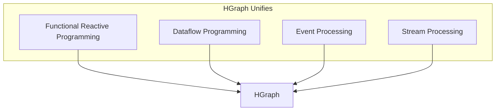
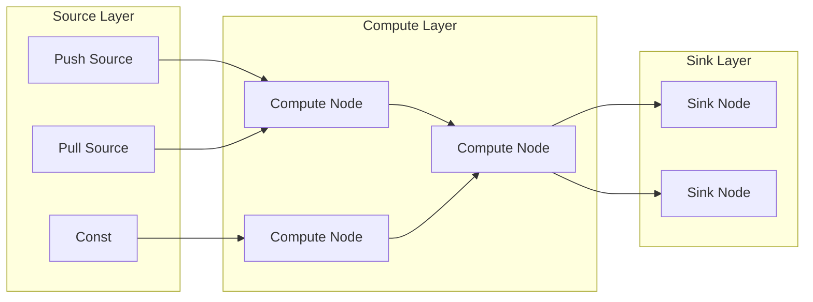
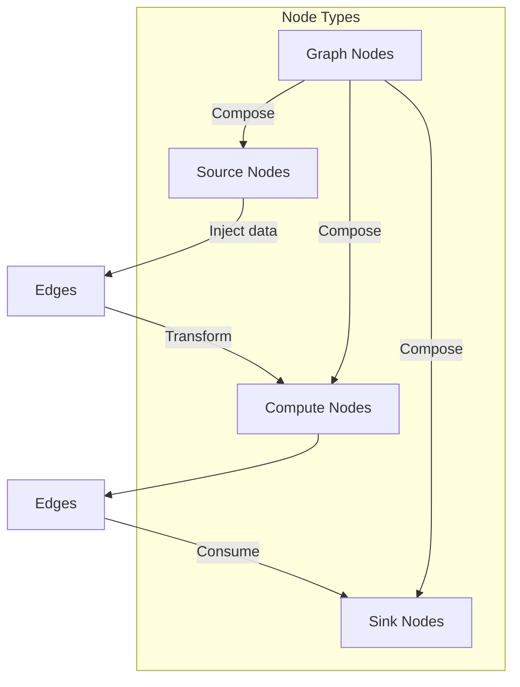
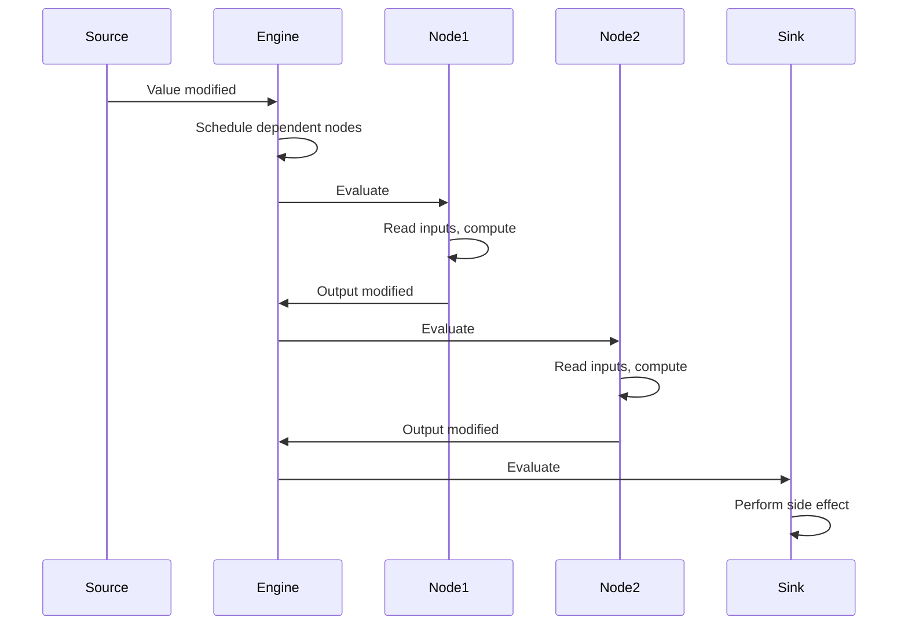
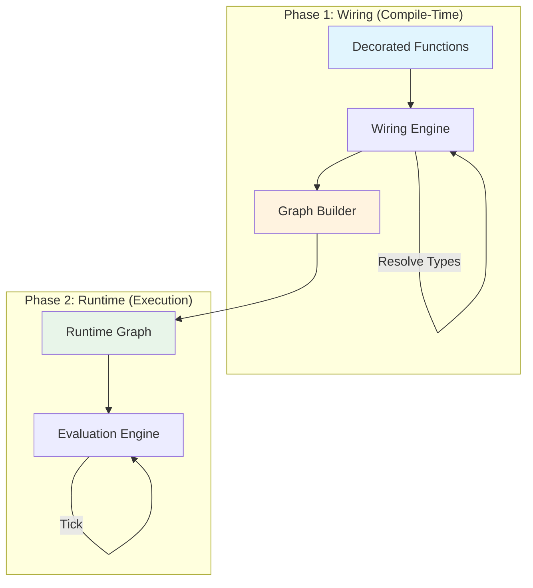
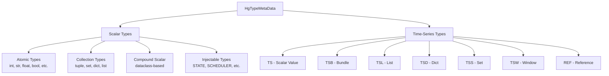
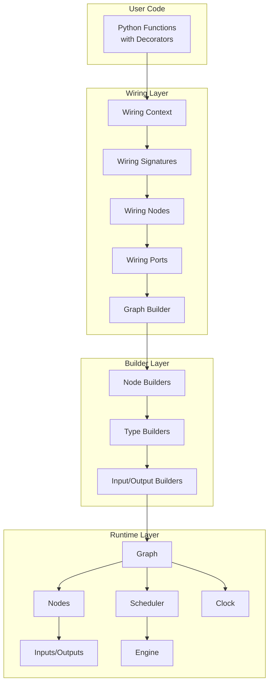
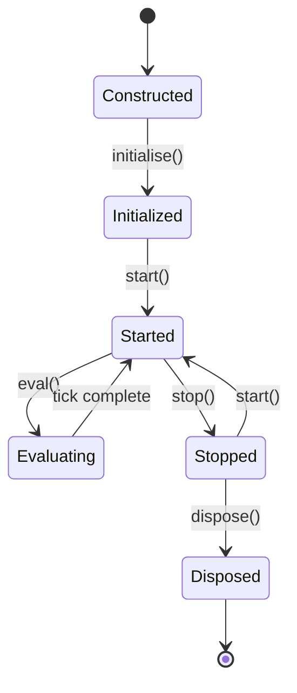

# Part I: Overview

**Version:** 1.0 Draft
**Last Updated:** 2025-12-20

---

## 1. Introduction

### 1.1 What is HGraph?

HGraph is a **functional reactive programming (FRP) framework** implementing event-driven computation through a **forward propagation graph** (FPG) paradigm. It provides:

- A Python DSL for defining reactive computations
- A type-safe time-series abstraction layer
- An efficient runtime for event propagation
- Support for both simulation and real-time execution

### 1.2 Design Goals

1. **Declarative**: Programs describe *what* to compute, not *when*
2. **Type-Safe**: Full type checking at graph construction time
3. **Reactive**: Computation is triggered by data changes
4. **Composable**: Complex graphs built from simple, reusable components
5. **Deterministic**: Same inputs produce same outputs (for simulation)
6. **Efficient**: Minimal unnecessary computation through change tracking

### 1.3 Key Innovation

HGraph unifies several programming paradigms:



---

## 2. Core Concepts

### 2.1 Forward Propagation Graph (FPG)

An HGraph program is a **directed acyclic graph (DAG)** where:

- **Nodes** are computation units (functions decorated with `@compute_node`, `@sink_node`, etc.)
- **Edges** are connections that carry time-series values
- **Evaluation** proceeds forward from sources to sinks



### 2.2 Time-Series

A **time-series** is a sequence of values that change over discrete time points (ticks):

```
Time:    t1      t2      t3      t4      t5
         │       │       │       │       │
TS[int]: 10  →  10  →  15  →  15  →  20
              (no change) (modified)    (modified)
```

**Properties of time-series:**

| Property | Description |
|----------|-------------|
| `value` | Current value at this tick |
| `delta_value` | Change since last tick (type-specific) |
| `modified` | True if value changed this tick |
| `valid` | True if value exists and can be read |
| `last_modified_time` | Time of most recent modification |

### 2.3 Nodes

Nodes are the computational units of HGraph:



| Node Type | Purpose | Has Output? |
|-----------|---------|-------------|
| `@push_source_node` | Inject async events | Yes |
| `@pull_source_node` | Generate scheduled values | Yes |
| `@compute_node` | Transform time-series | Yes |
| `@sink_node` | Perform side effects | No |
| `@graph` | Compose other nodes | Depends |

### 2.4 Evaluation Model

HGraph uses a **push-based reactive evaluation** model:



**Key evaluation rules:**

1. Nodes only evaluate when their **active inputs** are modified
2. Nodes only evaluate when their **valid inputs** have values
3. Evaluation proceeds in **topological order** (sources before dependents)
4. All nodes scheduled for a tick evaluate before time advances

---

## 3. Two-Phase Architecture

HGraph separates **graph construction** (wiring) from **execution** (runtime):



### 3.1 Wiring Phase

During wiring:

1. **Parse decorators** and extract signatures
2. **Resolve type variables** from concrete inputs
3. **Validate type compatibility** between connections
4. **Build graph structure** (nodes and edges)
5. **Create builders** for runtime instantiation

### 3.2 Runtime Phase

During runtime:

1. **Initialize** all nodes in topological order
2. **Start** nodes (create threads, open resources)
3. **Evaluate** in a loop until end time or stop requested
4. **Stop** nodes (cleanup threads)
5. **Dispose** all nodes in reverse topological order

---

## 4. Execution Modes

HGraph supports two execution modes:

### 4.1 Simulation Mode

```python
evaluate_graph(my_graph,
    run_mode=EvaluationMode.SIMULATION,
    start_time=datetime(2024, 1, 1),
    end_time=datetime(2024, 1, 2))
```

**Characteristics:**
- Time advances as fast as possible
- Push sources **not allowed**
- Deterministic and reproducible
- `now` = `evaluation_time` + computation time

### 4.2 Real-Time Mode

```python
evaluate_graph(my_graph,
    run_mode=EvaluationMode.REAL_TIME)
```

**Characteristics:**
- Time advances with wall clock
- Push sources **allowed**
- Engine sleeps between scheduled events
- `now` = actual wall clock time

---

## 5. Type System Overview

HGraph has a rich type system with two major branches:



### 5.1 Scalar Types

Values that exist at a single point in time:

- **Atomic**: `int`, `float`, `str`, `bool`, `datetime`, `timedelta`, etc.
- **Collections**: `tuple[T, ...]`, `set[T]`, `dict[K, V]`
- **Compound**: Dataclass-based composite types

### 5.2 Time-Series Types

Values that change over time:

| Type | Description |
|------|-------------|
| `TS[T]` | Single scalar value changing over time |
| `TSB[Schema]` | Bundle of named time-series fields |
| `TSL[T, Size]` | Fixed-size list of time-series |
| `TSD[K, V]` | Dynamic dictionary of time-series |
| `TSS[T]` | Set with add/remove tracking |
| `TSW[T, Size]` | Sliding window buffer |
| `REF[T]` | Indirect reference to another time-series |

---

## 6. Hello World Example

```python
from hgraph import graph, TS, const, debug_print, run_graph

@graph
def hello_world():
    message = const("Hello, HGraph!")
    debug_print("Message", message)

run_graph(hello_world)
```

**Output:**
```
[1970-01-01 00:00:00.000001][1] Message: Hello, HGraph!
```

### Explanation:

1. `@graph` marks `hello_world` as a wiring function
2. `const("Hello, HGraph!")` creates a `TS[str]` source
3. `debug_print` is a sink node that outputs to console
4. `run_graph` constructs and executes the graph

---

## 7. Component Architecture



---

## 8. Lifecycle Overview

All runtime components follow a consistent lifecycle:



| Phase | Description |
|-------|-------------|
| **Constructed** | Object created, properties set |
| **Initialized** | One-time setup, cache preparation |
| **Started** | Active operation, resources acquired |
| **Evaluating** | Processing data in evaluation loop |
| **Stopped** | Paused, resources may be released |
| **Disposed** | Final cleanup, no recovery possible |

---

## 9. Key Invariants

### 9.1 Modification Tracking

```
modified = (evaluation_time == last_modified_time)
```

A time-series is **modified** only if it was changed in the current tick.

### 9.2 Notification Idempotency

Notifications are **deduplicated per tick**:
```python
if notify_time != current_time:
    notify_time = current_time
    propagate_to_parent()
```

### 9.3 Topological Ordering

Nodes are always evaluated in **topological order**:
- Sources before compute nodes
- Compute nodes before their dependents
- All predecessors evaluated before any successor

### 9.4 Validity Propagation

```
input.valid = input.bound and input.output.valid
```

An input is valid only if bound to a valid output.

---

## 10. Reference Locations

| Component | Python Location | C++ Location |
|-----------|-----------------|--------------|
| Types | `hgraph/_types/` | `cpp/include/hgraph/types/` |
| Wiring | `hgraph/_wiring/` | N/A (Python only) |
| Runtime | `hgraph/_impl/_runtime/` | `cpp/src/cpp/` |
| Builders | `hgraph/_builder/` | `cpp/include/hgraph/builders/` |
| Operators | `hgraph/_operators/` | N/A (Python only) |

---

## 11. Next Steps

Continue to:
- [02_TYPE_SYSTEM.md](02_TYPE_SYSTEM.md) - Complete type system specification
- [03_WIRING_SYSTEM.md](03_WIRING_SYSTEM.md) - Graph construction details
- [04_RUNTIME_SYSTEM.md](04_RUNTIME_SYSTEM.md) - Execution semantics
