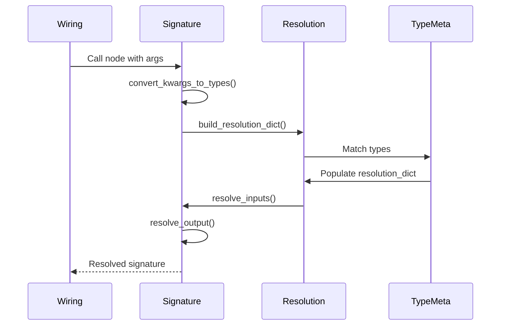

# Part II: Type System

**Version:** 1.0 Draft
**Last Updated:** 2025-12-20

---

## 1. Type System Architecture

### 1.1 Overview

The HGraph type system provides:
- **Static type checking** at graph construction (wiring) time
- **Generic type resolution** for polymorphic nodes
- **Type metadata** for runtime introspection

### 1.2 Type Hierarchy

```mermaid
graph TD
    HT[HgTypeMetaData]

    HT --> SC[HgScalarTypeMetaData]
    HT --> TS[HgTimeSeriesTypeMetaData]
    HT --> TOT[HgTypeOfTypeMetaData]

    SC --> AT[HgAtomicType]
    SC --> STV[HgScalarTypeVar]
    SC --> INJ[HgInjectableType]
    SC --> COL[HgCollectionType]
    SC --> CMP[HgCompoundScalarType]
    SC --> OBJ[HgObjectType]

    INJ --> ST[HgStateType]
    INJ --> RST[HgRecordableStateType]
    INJ --> SCH[HgSchedulerType]
    INJ --> CLK[HgEvaluationClockType]
    INJ --> ENG[HgEvaluationEngineApiType]
    INJ --> LOG[HgLoggerType]
    INJ --> NOD[HgNodeType]
    INJ --> TRT[HgTraitsType]
    INJ --> OUT[HgOutputType]

    COL --> TUP[HgTupleScalarType]
    COL --> SET[HgSetScalarType]
    COL --> DCT[HgDictScalarType]
    COL --> ARR[HgArrayScalarTypeMetaData]

    TUP --> TUPC[HgTupleCollectionScalarType]
    TUP --> TUPF[HgTupleFixedScalarType]

    TS --> TSM[HgTSTypeMetaData]
    TS --> TSOM[HgTSOutTypeMetaData]
    TS --> TSBM[HgTimeSeriesSchemaTypeMetaData]
    TS --> TSBT[HgTSBTypeMetaData]
    TS --> TSLM[HgTSLTypeMetaData]
    TS --> TSLO[HgTSLOutTypeMetaData]
    TS --> TSDM[HgTSDTypeMetaData]
    TS --> TSDO[HgTSDOutTypeMetaData]
    TS --> TSSM[HgTSSTypeMetaData]
    TS --> TSSO[HgTSSOutTypeMetaData]
    TS --> TSWM[HgTSWTypeMetaData]
    TS --> TSWO[HgTSWOutTypeMetaData]
    TS --> REFM[HgREFTypeMetaData]
    TS --> REFO[HgREFOutTypeMetaData]
    TS --> TSTV[HgTsTypeVarTypeMetaData]
    TS --> SIG[HgSignalMetaData]
    TS --> CTX[HgCONTEXTTypeMetaData]
```



**Notes:**
- "Out" variants are output-specific time-series types
- `HgTypeOfTypeMetaData` handles `type[T]` constructs
- `HgSignalMetaData` represents the SIGNAL type
- `HgCONTEXTTypeMetaData` represents the CONTEXT type

---

## 2. Scalar Types

Scalar types represent values at a single point in time (non-time-series).

### 2.1 Atomic Types

**Reference:** `hgraph/_types/_scalar_type_meta_data.py:222-296`

Primitive types with no internal structure:

| Type | Python Type | Notes |
|------|-------------|-------|
| `bool` | `bool` | Boolean values |
| `int` | `int` | Arbitrary precision integers |
| `float` | `float` | IEEE 754 double precision |
| `str` | `str` | Unicode strings |
| `bytes` | `bytes` | Binary data |
| `date` | `datetime.date` | Calendar dates |
| `datetime` | `datetime.datetime` | Timestamps |
| `time` | `datetime.time` | Time of day |
| `timedelta` | `datetime.timedelta` | Time durations |
| `Size[N]` | `Size` | Fixed integer size marker |
| `Enum` | Enum subclass | Enumeration types |

**Properties:**
```python
is_atomic = True
is_resolved = True
is_scalar = True
```

### 2.2 Collection Types

**Reference:** `hgraph/_types/_scalar_type_meta_data.py:648-1130`

#### 2.2.1 Tuple Types

| Variant | Example | Description |
|---------|---------|-------------|
| Homogeneous | `tuple[int, ...]` | Variable-length, same type |
| Fixed | `tuple[int, str, float]` | Fixed-length, mixed types |

```python
# Parsing
tuple[int, ...]  → HgTupleCollectionScalarType(HgAtomicType(int))
tuple[int, str]  → HgTupleFixedScalarType([HgAtomicType(int), HgAtomicType(str)])
```

#### 2.2.2 Set Type

```python
set[T] → HgSetScalarType(element_type)
```

#### 2.2.3 Dict Type

```python
dict[K, V] → HgDictScalarType(key_type, value_type)
```

#### 2.2.4 Array Type (NumPy)

```python
ndarray[T] → HgArrayScalarTypeMetaData(element_type, shape)
```

### 2.3 Compound Scalar Types

**Reference:** `hgraph/_types/_scalar_type_meta_data.py:1130-1250`

Dataclass-based composite types extending `CompoundScalar`:

```python
from hgraph import CompoundScalar
from dataclasses import dataclass

@dataclass(frozen=True)
class Trade(CompoundScalar):
    symbol: str
    price: float
    quantity: int
```

**Properties:**
- `meta_data_schema`: Dict mapping field names to HgScalarTypeMetaData
- `is_atomic = False`
- Supports generic parameters via TypeVar

### 2.4 Injectable Types

**Reference:** `hgraph/_types/_scalar_type_meta_data.py:324-650`

Special types that are injected by the runtime:

| Type | Injector | Purpose |
|------|----------|---------|
| `STATE[T]` | StateInjector | Mutable state container |
| `RECORDABLE_STATE[T]` | RecordableStateInjector | State with record/replay support |
| `SCHEDULER` | SchedulerInjector | Task scheduling |
| `CLOCK` | EvaluationClockInjector | Time access |
| `ENGINE_API` | EvaluationEngineApiInjector | Engine control |
| `LOGGER` | LoggerInjector | Logging facility |
| `NODE` | NodeInjector | Current node reference |
| `TRAITS` | TraitsInjector | Graph traits access |
| `OUTPUT[T]` | OutputInjector | Direct output access |

**Usage:**
```python
@compute_node
def my_node(ts: TS[int], _state: STATE[dict] = None) -> TS[int]:
    if _state.value is None:
        _state.value = {}
    # ...
```

### 2.5 Scalar Type Variables

**Reference:** `hgraph/_types/_scalar_type_meta_data.py:98-220`

Generic type parameters for polymorphic nodes:

```python
from typing import TypeVar

SCALAR = TypeVar('SCALAR')
NUMBER = TypeVar('NUMBER', int, float)

@compute_node
def double(value: TS[SCALAR]) -> TS[SCALAR]:
    return value.value * 2
```

**Properties:**
- `is_resolved = False` (until resolved)
- `is_generic = True`
- `constraints`: Sequence of allowed types (from TypeVar bounds)

---

## 3. Time-Series Types

Time-series types represent values that change over discrete time.

### 3.1 Base Time-Series Type

**Reference:** `hgraph/_types/_time_series_meta_data.py:19-92`

All time-series types share:

```python
is_scalar = False
is_atomic = False
```

**Common Properties:**

| Property | Description |
|----------|-------------|
| `value` | Current value at this tick |
| `delta_value` | Change since last tick |
| `modified` | True if value changed this tick |
| `valid` | True if value exists |
| `all_valid` | True if all children valid (collections) |
| `last_modified_time` | Time of last modification |

### 3.2 TS[T] - Scalar Time-Series

**Reference:** `hgraph/_types/_ts_meta_data.py`

The fundamental time-series type holding a single scalar value:

```python
TS[int]    # Time-series of integers
TS[str]    # Time-series of strings
TS[Trade]  # Time-series of compound scalars
```

**Metadata:**
- `value_scalar_tp`: The scalar type T

**Semantics:**
- `delta_value = value` (for scalars, delta is the full value)

### 3.3 TSB[Schema] - Time-Series Bundle

**Reference:** `hgraph/_types/_tsb_meta_data.py`

A composite of named time-series fields:

```python
from hgraph import TimeSeriesSchema, TS, TSB

@dataclass(frozen=True)
class PriceData(TimeSeriesSchema):
    bid: TS[float]
    ask: TS[float]
    volume: TS[int]

# Usage
def my_node(data: TSB[PriceData]) -> TS[float]:
    return data.bid.value - data.ask.value
```

**Metadata:**
- `py_type`: The schema class
- `meta_data_schema`: Dict mapping field names to HgTimeSeriesTypeMetaData

**Semantics:**
- `value`: Dict or dataclass instance of all valid field values
- `delta_value`: Dict of only modified fields
- `valid`: True if ANY field is valid
- `all_valid`: True if ALL fields are valid
- `modified`: True if ANY field is modified

### 3.4 TSL[T, Size] - Time-Series List

**Reference:** `hgraph/_types/_tsl_meta_data.py`

A fixed-size list of time-series:

```python
from hgraph import TSL, TS, Size

# Fixed size list of 3 integers
def process(values: TSL[TS[int], Size[3]]) -> TS[int]:
    return sum(v.value for v in values if v.valid)
```

**Metadata:**
- `value_tp`: Element time-series type
- `size_tp`: Size specification

**Semantics:**
- `value`: Tuple of values (None for invalid elements)
- `delta_value`: Dict mapping indices to modified values
- `valid`: True if ANY element is valid
- `all_valid`: True if ALL elements are valid

### 3.5 TSD[K, V] - Time-Series Dictionary

**Reference:** `hgraph/_types/_tsd_meta_data.py`

A dynamic dictionary with key tracking:

```python
from hgraph import TSD, TS

# Dictionary keyed by symbol
def process(prices: TSD[str, TS[float]]) -> TS[float]:
    return sum(prices.values())
```

**Metadata:**
- `key_tp`: Key scalar type
- `value_tp`: Value time-series type

**Semantics:**
- `value`: frozendict of current entries
- `delta_value`: frozendict with modified values + REMOVE sentinels
- `keys()`: Current key set
- `added()`: Keys added this tick
- `removed()`: Keys removed this tick
- `valid`: True if any entry valid

**Key Tracking:**
```python
# Access key set as TSS
prices.key_set  # Returns TSS[str]

# Check additions/removals
if "AAPL" in prices.added():
    ...
```

### 3.6 TSS[T] - Time-Series Set

**Reference:** `hgraph/_types/_tss_meta_data.py`

A set with add/remove delta tracking:

```python
from hgraph import TSS

def process(symbols: TSS[str]) -> TS[int]:
    return len(symbols.value)
```

**Metadata:**
- `value_scalar_tp`: Element scalar type

**Semantics:**
- `value`: Current set contents
- `delta_value`: SetDelta with `added` and `removed` sets
- `added()`: Elements added this tick
- `removed()`: Elements removed this tick

### 3.7 TSW[T, Size, MinSize] - Time-Series Window

**Reference:** `hgraph/_types/_tsw_meta_data.py`

A sliding window buffer:

```python
from hgraph import TSW, WindowSize

# Window of last 10 values
def moving_avg(values: TSW[float, WindowSize[10]]) -> TS[float]:
    return sum(values.value) / len(values.value)
```

**Metadata:**
- `value_scalar_tp`: Element type
- `size_tp`: Maximum window size
- `min_size_tp`: Minimum size for validity

**Semantics:**
- `value`: Array/deque of buffered values (or None if min_size not met)
- `delta_value`: Last added value if modified
- `value_times`: Array of timestamps for each value
- `all_valid`: True if `len >= min_size`

**Variants:**
- **Fixed Window**: By tick count
- **Time Window**: By time duration

### 3.8 REF[T] - Reference Type

**Reference:** `hgraph/_types/_ref_meta_data.py`

An indirect reference to another time-series:

```python
from hgraph import REF, TS

def process(ref: REF[TS[float]]) -> TS[float]:
    if ref.valid:
        return ref.value.value
```

**Metadata:**
- `value_tp`: Referenced time-series type
- `is_reference = True`

**Semantics:**
- `value`: TimeSeriesReference object
- `dereference()`: Returns the underlying time-series type
- `has_references = True`

---

## 4. Type Resolution

### 4.1 Resolution Process



### 4.2 Type Matching

**Reference:** `hgraph/_types/_type_meta_data.py:118-133`

Types match according to these rules:

| Type A | Type B | Matches? |
|--------|--------|----------|
| `TS[int]` | `TS[int]` | Yes (exact) |
| `TS[int]` | `TS[SCALAR]` | Yes (A more specific) |
| `TS[SCALAR]` | `TS[int]` | Yes (B resolves A) |
| `TSL[TS[int], Size[3]]` | `TSL[TS[int], Size[3]]` | Yes |
| `TSL[TS[int], Size[3]]` | `TSL[TS[int], SIZE]` | Yes |

### 4.3 Generic Rank

**Reference:** `hgraph/_types/_generic_rank_util.py`

For overload resolution, types are ranked by specificity:

```python
# Lower rank = more specific
TS[int]            # rank ≈ 1e-10 (atomic)
TS[SCALAR]         # rank ≈ 0.9+ (constrained TypeVar)
TIME_SERIES_TYPE   # rank ≈ 1.0 (unconstrained)
```

When multiple overloads match, the most specific (lowest rank) wins.

### 4.4 Resolution Dictionary

The resolution dictionary maps TypeVar to resolved HgTypeMetaData:

```python
resolution_dict = {
    SCALAR: HgAtomicType(int),
    TIME_SERIES_TYPE: HgTSTypeMetaData(HgAtomicType(int))
}
```

---

## 5. Type Parsing

### 5.1 Entry Point

**Reference:** `hgraph/_types/_type_meta_data.py:83-97`

```python
@classmethod
@lru_cache(maxsize=None)
def parse_type(cls, value_tp) -> Optional["HgTypeMetaData"]:
    """Parse a Python type into HGraph type metadata"""
    parse_order = (HgTimeSeriesTypeMetaData, HgScalarTypeMetaData)
    for parser in parse_order:
        if meta_data := parser.parse_type(value_tp):
            return meta_data
    raise ParseError(f"Unable to parse '{value_tp}'")
```

### 5.2 Parser Order

Time-series parsers (tried in order):
1. `HgTSTypeMetaData` - TS[T]
2. `HgTSOutTypeMetaData` - TS_OUT[T]
3. `HgTSWTypeMetaData` - TSW[...]
4. `HgTSWOutTypeMetaData` - TSW_OUT[...]
5. `HgTSLTypeMetaData` - TSL[...]
6. `HgTSLOutTypeMetaData` - TSL_OUT[...]
7. `HgTSSTypeMetaData` - TSS[T]
8. `HgTSSOutTypeMetaData` - TSS_OUT[T]
9. `HgTSDTypeMetaData` - TSD[K, V]
10. `HgTSDOutTypeMetaData` - TSD_OUT[K, V]
11. `HgTimeSeriesSchemaTypeMetaData` - TSB[Schema]
12. `HgTSBTypeMetaData` - Bundle subtype
13. `HgTsTypeVarTypeMetaData` - TypeVar
14. `HgREFTypeMetaData` - REF[T]
15. `HgREFOutTypeMetaData` - REF_OUT[T]
16. `HgSignalMetaData` - SIGNAL
17. `HgCONTEXTTypeMetaData` - CONTEXT

Scalar parsers (tried in order):
1. `HgAtomicType` - primitives
2. `HgTupleScalarType` - tuples
3. `HgDictScalarType` - dicts
4. `HgSetScalarType` - sets
5. `HgCompoundScalarType` - dataclasses
6. `HgScalarTypeVar` - TypeVar
7. `HgTypeOfTypeMetaData` - type[T]
8. `HgArrayScalarTypeMetaData` - ndarray
9. `HgInjectableType` - base injectable
10. `HgStateType` - STATE[T]
11. `HgRecordableStateType` - RECORDABLE_STATE[T]
12. `HgObjectType` - catch-all

---

## 6. Type Properties Summary

| Type | is_scalar | is_atomic | is_resolved | has_references |
|------|-----------|-----------|-------------|----------------|
| `int` | True | True | True | False |
| `TS[int]` | False | False | True | False |
| `TS[SCALAR]` | False | False | False | False |
| `TSB[Schema]` | False | False | Depends | Depends |
| `TSD[K, V]` | False | False | Depends | Depends |
| `REF[T]` | False | False | Depends | True |
| `STATE[T]` | True | False | Depends | False |

---

## 7. Schema System

### 7.1 AbstractSchema

**Reference:** `hgraph/_types/_schema_type.py:33-100`

Base class for both `CompoundScalar` and `TimeSeriesSchema`:

```python
class AbstractSchema:
    __meta_data_schema__: frozendict[str, "HgTypeMetaData"]
    __resolved__: dict[str, Type["AbstractSchema"]]
    __parameters__: tuple[TypeVar, ...]
```

### 7.2 TimeSeriesSchema

**Reference:** `hgraph/_types/_tsb_type.py:70-150`

Schema for TSB bundles:

```python
@dataclass(frozen=True)
class MySchema(TimeSeriesSchema):
    field1: TS[int]
    field2: TS[str]

# Generates:
__meta_data_schema__ = {
    'field1': HgTSTypeMetaData(HgAtomicType(int)),
    'field2': HgTSTypeMetaData(HgAtomicType(str))
}
```

### 7.3 Schema ↔ Scalar Conversion

```python
# Schema to scalar type
MySchema.scalar_type()  # Returns corresponding CompoundScalar

# Scalar to schema type
TimeSeriesSchema.from_scalar_schema(MyCompoundScalar)
```

---

## 8. Implementation Notes

### 8.1 Output Type Variants

Each time-series type has a corresponding output variant used internally:

| Input Type | Output Type | Purpose |
|------------|-------------|---------|
| TS[T] | TS_OUT[T] | Writable time-series |
| TSL[T, Size] | TSL_OUT[T, Size] | Writable list |
| TSD[K, V] | TSD_OUT[K, V] | Writable dictionary |
| TSS[T] | TSS_OUT[T] | Writable set |
| TSW[T, Size] | TSW_OUT[T, Size] | Writable window |
| REF[T] | REF_OUT[T] | Writable reference |

These are used by node implementations to write output values; users typically interact with input types.

### 8.2 Special Types

**SIGNAL Type:**
- A specialized time-series type representing a tick without a value
- `is_context_wired = True`
- Used for triggering without data transfer

**CONTEXT Type:**
- Context-wired time-series for accessing context outputs
- `is_context_wired = True`
- Used in conjunction with `set_context` / `get_context` patterns

**TimeSeriesReference:**
- The scalar form of `REF[T]`
- Allows storing a reference to a time-series in scalar variables

---

## 9. Next Steps

Continue to:
- [03_WIRING_SYSTEM.md](03_WIRING_SYSTEM.md) - Graph construction and type resolution
- [05_TIME_SERIES_TYPES.md](05_TIME_SERIES_TYPES.md) - Detailed time-series semantics
