# Part III: Wiring System

**Version:** 1.0 Draft
**Last Updated:** 2025-12-20

---

## 1. Introduction

The **wiring system** is responsible for constructing the forward propagation graph from decorated Python functions. It operates at "compile time" (before runtime evaluation), performing:

- Signature extraction from decorators
- Type resolution and validation
- Graph structure assembly
- Builder creation for runtime instantiation

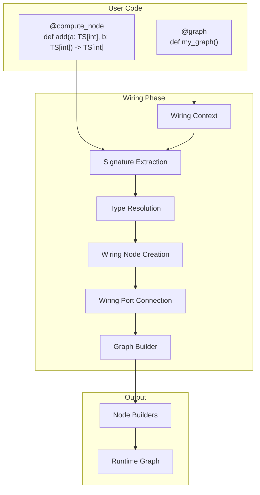

---

## 2. Decorators

Decorators mark Python functions for inclusion in the graph and define their behavioral characteristics.

### 2.1 Decorator Hierarchy

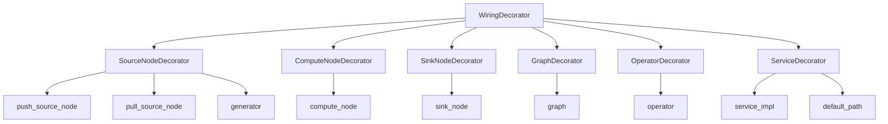

### 2.2 Decorator Definitions

#### 2.2.1 compute_node

```python
@compute_node
def add(a: TS[int], b: TS[int]) -> TS[int]:
    return a.value + b.value
```

**Properties:**
| Property | Description |
|----------|-------------|
| Inputs | One or more time-series or scalar inputs |
| Output | Required (returns time-series) |
| Evaluation | When active inputs are modified |
| Side Effects | Not permitted |

#### 2.2.2 sink_node

```python
@sink_node
def log_value(ts: TS[int]):
    print(f"Value: {ts.value}")
```

**Properties:**
| Property | Description |
|----------|-------------|
| Inputs | One or more time-series or scalar inputs |
| Output | None (no return value) |
| Evaluation | When active inputs are modified |
| Side Effects | Permitted and expected |

#### 2.2.3 graph

```python
@graph
def my_graph(x: TS[int]) -> TS[int]:
    doubled = multiply(x, const(2))
    return doubled
```

**Properties:**
| Property | Description |
|----------|-------------|
| Inputs | Any types (forwarded to contained nodes) |
| Output | Optional (can return time-series) |
| Body | Wiring calls, not evaluated at runtime |
| Purpose | Composition of other nodes |

#### 2.2.4 push_source_node

```python
@push_source_node
def async_events() -> TS[str]:
    """Inject asynchronous events into the graph."""
    pass  # Sender object provided by runtime
```

**Properties:**
| Property | Description |
|----------|-------------|
| Output | Required time-series |
| Trigger | External event (async callback) |
| Mode | Real-time only |
| Sender | Runtime provides sender object |

#### 2.2.5 pull_source_node

```python
@pull_source_node
def scheduled_data() -> TS[float]:
    """Generate values on a schedule."""
    return get_next_value()
```

**Properties:**
| Property | Description |
|----------|-------------|
| Output | Required time-series |
| Trigger | Scheduler-driven |
| Mode | Both simulation and real-time |
| Scheduling | Node schedules itself for future ticks |

#### 2.2.6 generator

```python
@generator
def counter(start: int = 0) -> TS[int]:
    """Generate a sequence of values."""
    count = start
    while True:
        yield count
        count += 1
```

**Properties:**
| Property | Description |
|----------|-------------|
| Output | Required time-series |
| Body | Python generator (yields values) |
| Scheduling | Yields control between evaluations |

#### 2.2.7 operator

```python
@operator
def add_(lhs: TS[SCALAR], rhs: TS[SCALAR]) -> TS[SCALAR]:
    """Overloaded addition operator."""
    ...
```

**Properties:**
| Property | Description |
|----------|-------------|
| Purpose | Overload resolution for operators |
| Multiple Implementations | Can have multiple with different signatures |
| Selection | Based on input types and generic rank |

---

## 3. Wiring Context

The **WiringContext** maintains state during graph construction.

### 3.1 Context Stack

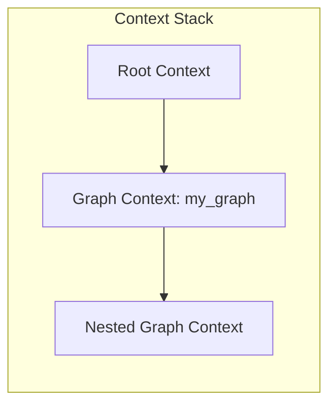

### 3.2 Context Architecture

The `WiringContext` class uses **dynamic property storage** via `**kwargs`:

```python
class WiringContext:
    _stack: ClassVar[list[dict[str, Any]]] = []

    def __init__(self, **kwargs):
        self._stack.append(kwargs)

    def __getattr__(self, item):
        # Searches stack from top to bottom for property
        for frame in reversed(self._stack):
            if item in frame:
                return frame[item]
        raise AttributeError(item)
```

**Common Dynamic Properties** (set by callers):

| Property | Description |
|----------|-------------|
| `current_signature` | Active wiring signature |
| `current_arg` | Current argument being processed |
| `current_kwargs` | Input keyword arguments |

**Note:** Properties are not predefined. Any key-value pair can be stored and retrieved from the context stack.

### 3.3 WiringGraphContext

For graph-level wiring, `WiringGraphContext` provides additional structure:

| Property | Description |
|----------|-------------|
| `sink_nodes` | Collection of sink nodes in the graph |
| `services` | Service registrations |

### 3.4 Context Management

```python
# Entering a new context
with WiringContext(
    current_signature=signature,
    current_kwargs={"x": input_ts}
):
    result = wiring_function()
```

---

## 4. Signatures

**Signatures** define the input/output contract for nodes.

### 4.1 Signature Extraction

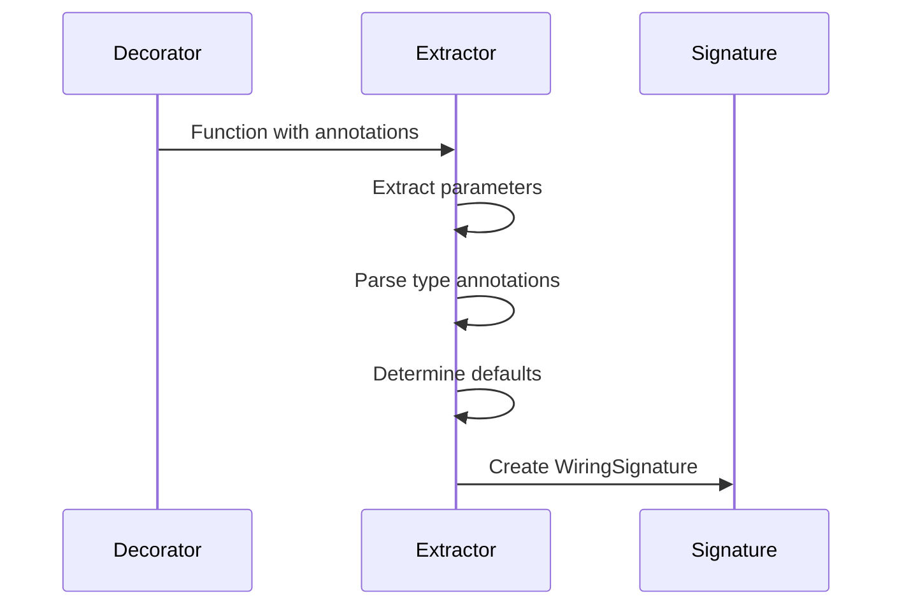

### 4.2 WiringNodeSignature

**Reference:** `hgraph/_wiring/_wiring_node_signature.py`

The actual class is `WiringNodeSignature` with many fields:

```python
@dataclass(frozen=True)
class WiringNodeSignature:
    # Core identity
    node_type: WiringNodeType
    name: str
    args: tuple[str, ...]

    # Types and defaults
    defaults: frozendict[str, Any]
    input_types: frozendict[str, HgTypeMetaData]
    output_type: HgTimeSeriesTypeMetaData | None

    # Input categorization
    time_series_args: frozenset[str]
    injectables: InjectableTypesEnum  # Note: NOT 'injectable_inputs'
    context_inputs: frozenset[str]
    unresolved_args: frozenset[str]

    # Signature modifiers
    active_inputs: frozenset[str] | None
    valid_inputs: frozenset[str] | None
    all_valid_inputs: frozenset[str] | None

    # Additional metadata
    src_location: SourceCodeDetails
    label: str | None
    deprecated: str | bool
    requires: Callable | None

    # Variadic support
    kw_only_args: frozenset[str]
    var_arg: str | None
    var_kwarg: str | None
```

**Query Properties:**
- `uses_scheduler`, `uses_clock`, `uses_engine`, `uses_state`
- `uses_recordable_state`, `uses_output_feedback`
- `scalar_inputs`, `time_series_inputs`, `positional_inputs`

### 4.3 Argument Categories

| Category | Description | Example |
|----------|-------------|---------|
| Scalar Args | Python values, resolved at wiring | `multiplier: int = 2` |
| Time-Series Args | TS inputs, connected at wiring | `x: TS[float]` |
| Injectable Args | Provided by runtime | `state: STATE[dict]` |
| Keyword-Only | After `*` in signature | `*, active: bool = True` |

### 4.4 Special Signature Elements

#### 4.4.1 `*args` and `**kwargs`

```python
@compute_node
def sum_all(*ts: TSL[TS[int], SIZE]) -> TS[int]:
    return sum(t.value for t in ts if t.valid)
```

#### 4.4.2 Unresolved Types

```python
@compute_node
def generic_add(a: TS[SCALAR], b: TS[SCALAR]) -> TS[SCALAR]:
    return a.value + b.value
```

---

## 5. Wiring Nodes and Ports

### 5.1 Wiring Node

A **WiringNodeInstance** represents a node during graph construction:

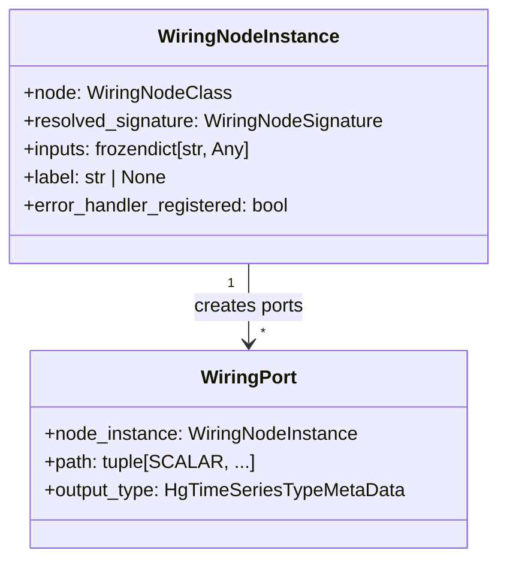

**Key Properties:**
| Property | Description |
|----------|-------------|
| `node` | The WiringNodeClass (factory) |
| `resolved_signature` | Fully resolved signature |
| `inputs` | Input values/ports dict |
| `is_stub` | True if this is a stub node |
| `is_source_node` | True if node is a source |
| `output_type` | Output type metadata |

**Note:** Unlike the simplified UML, `rank` and `node_id` are not direct properties. Ranking is handled via `ranking_alternatives`, and node IDs are assigned during graph building.

### 5.2 Wiring Port

A **WiringPort** represents a connectable output:

| Property | Description |
|----------|-------------|
| `node_instance` | Owning wiring node |
| `path` | Path tuple within the node (for accessing bundle fields) |
| `output_type` | Type metadata (derived from node + path) |

### 5.3 Port Connections

```mermaid
graph LR
    subgraph "Node A"
        OA[Output Port<br/>TS&#91;int&#93;]
    end

    subgraph "Node B"
        IB[Input Port<br/>TS&#91;int&#93;]
    end

    OA --> IB
```

Connections are established when:
1. An output port is passed as an input to another node
2. Types are validated for compatibility
3. The connection is recorded in the graph builder

---

## 6. Type Resolution

### 6.1 Resolution Process

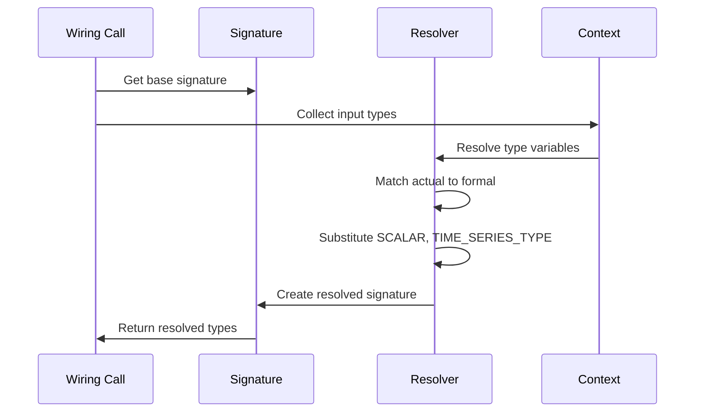

### 6.2 Type Variable Resolution

When a signature contains type variables (`SCALAR`, `TIME_SERIES_TYPE`), they are resolved from the actual inputs:

```python
# Signature: def add(a: TS[SCALAR], b: TS[SCALAR]) -> TS[SCALAR]
# Call: add(ts_int, ts_int)  where ts_int: TS[int]

# Resolution:
#   SCALAR -> int
#   Result: TS[int]
```

### 6.3 Resolution Table

| Type Variable | Resolves To |
|---------------|-------------|
| `SCALAR` | Any atomic or compound scalar type |
| `TIME_SERIES_TYPE` | Any time-series type |
| `SIZE` | Literal integer (for TSL) |
| `TypeVar("T")` | Inferred from first occurrence |

### 6.4 Generic Rank

When multiple operator implementations match, **generic rank** determines selection:

```python
# Rank 0: Exact type match
def add_(lhs: TS[int], rhs: TS[int]) -> TS[int]: ...

# Rank 1: One type variable
def add_(lhs: TS[SCALAR], rhs: TS[SCALAR]) -> TS[SCALAR]: ...

# Rank 2: More general
def add_(lhs: TIME_SERIES_TYPE, rhs: TIME_SERIES_TYPE) -> TIME_SERIES_TYPE: ...
```

Lower rank is preferred.

---

## 7. Graph Building

### 7.1 Graph Builder

The **GraphBuilder** accumulates wiring nodes into a runtime graph structure:

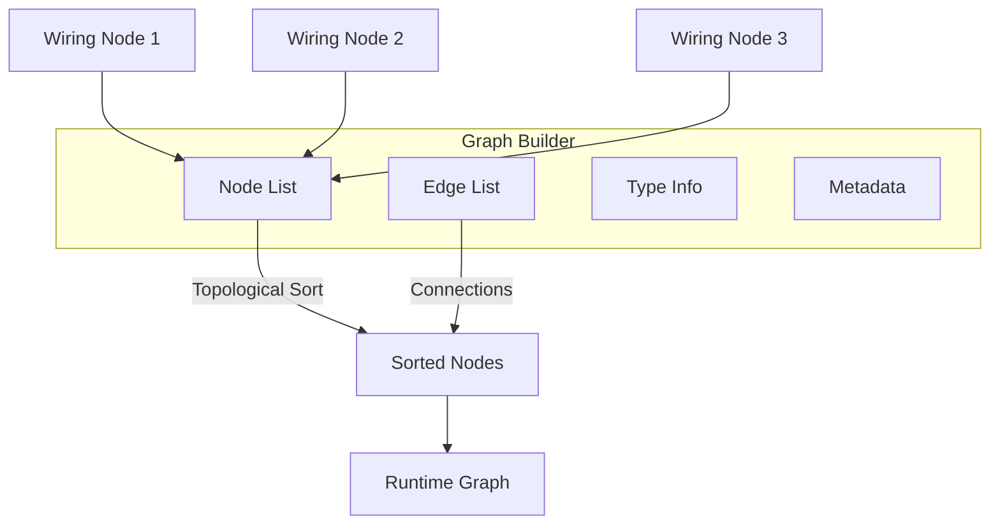

### 7.2 Graph Construction Sequence

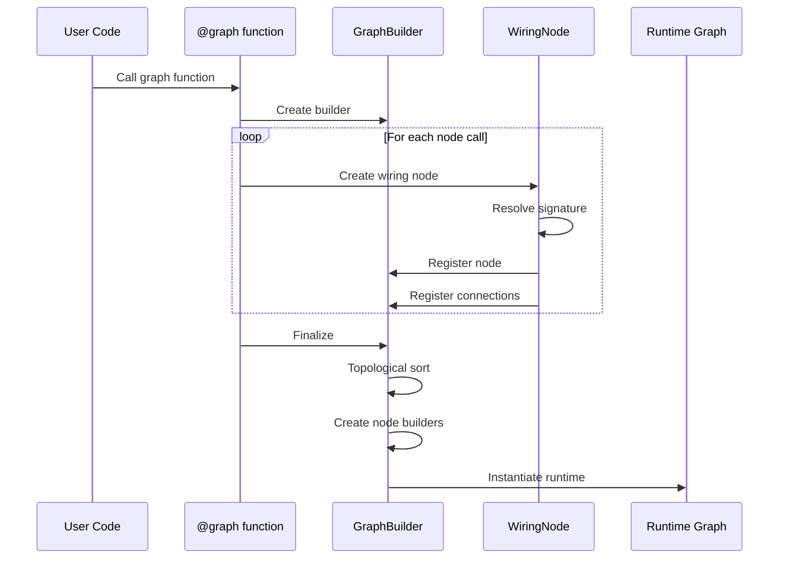

### 7.3 Node ID Assignment

Nodes are assigned sequential IDs during wiring:

| Step | Action |
|------|--------|
| 1 | Create wiring node |
| 2 | Assign next available ID |
| 3 | Record in graph builder |
| 4 | Maintain ID → node mapping |

---

## 8. Nested Graphs and Expansion

### 8.1 Graph Expansion

When a `@graph` is called within another graph, it **expands** inline:

```python
@graph
def outer():
    x = source_node()
    y = inner_graph(x)  # inner_graph expands here
    sink_node(y)
```

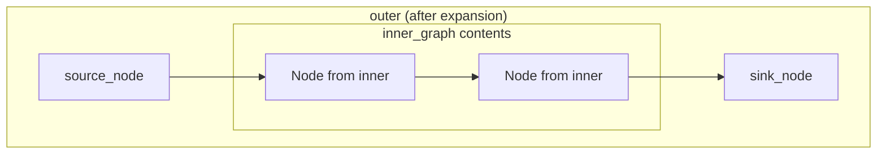

### 8.2 Nested Graph Semantics

| Aspect | Behavior |
|--------|----------|
| Identity | Nodes from nested graphs get unique IDs |
| Scope | Local variables isolated per expansion |
| Types | Resolved at point of call |
| Recursion | Not directly supported (would be infinite) |

---

## 9. Error Handling at Wiring Time

### 9.1 Wiring Errors

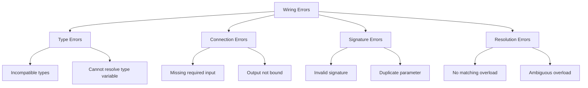

### 9.2 Error Messages

Wiring errors include context about:
- Source location (file, line)
- Node signature
- Input values and their types
- Expected vs. actual types

---

## 10. Wiring-Time Evaluation

Some constructs evaluate at wiring time, not runtime:

### 10.1 Scalar Arguments

```python
@graph
def my_graph():
    # '2' evaluated at wiring time
    x = const(compute_something())  # compute_something() runs at wiring
    doubled = multiply(x, const(2))
```

### 10.2 Wiring-Time Functions

| Function | Purpose |
|----------|---------|
| `if_then_else(cond, true_branch, false_branch)` | Wiring-time conditional |
| `match_()` | Wiring-time pattern matching |
| `nothing()` | Null time-series (no connection) |

---

## 11. Special Wiring Constructs

### 11.1 Feedback Loops

```python
@graph
def with_feedback() -> TS[int]:
    fb = feedback(TS[int])
    current = add(const(1), fb())
    fb(current)  # Feed output back
    return current
```

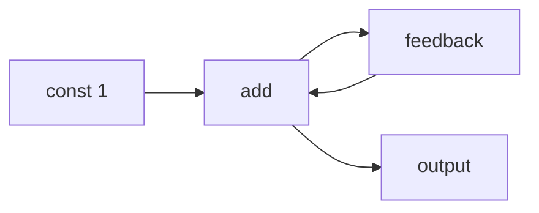

### 11.2 Switch

```python
@graph
def switcher(selector: TS[bool], a: TS[int], b: TS[int]) -> TS[int]:
    return switch_(
        selector,
        {True: a, False: b}
    )
```

### 11.3 Map Over Collection

```python
@graph
def process_dict(d: TSD[str, TS[int]]) -> TSD[str, TS[int]]:
    return map_(double, d)
```

---

## 12. Builder Creation

### 12.1 From Wiring to Builders

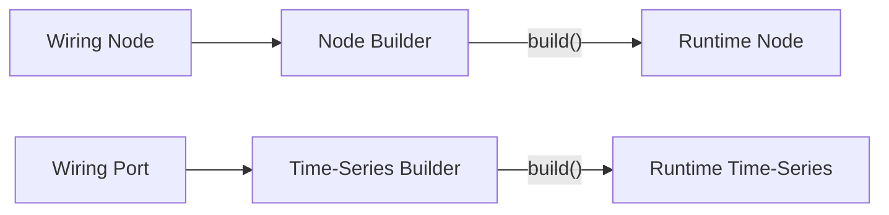

### 12.2 Builder Types

| Builder | Creates |
|---------|---------|
| `NodeBuilder` | Runtime node instances |
| `GraphBuilder` | Runtime graph structures |
| `TSInputBuilder` | Time-series input instances |
| `TSOutputBuilder` | Time-series output instances |
| `TSBundleBuilder` | Bundle instances with fields |
| `TSDictBuilder` | Dictionary instances |
| `TSListBuilder` | Fixed-size list instances |

---

## 13. Implementation Notes

### 13.1 Additional Decorators

**@const_fn Decorator:**
Wraps constant functions that accept scalar inputs and produce constant values:

```python
@const_fn
def calculate(a: int, b: int) -> TS[int]:
    return a + b

# Can be called both inside and outside graphs
result_in_graph = calculate(1, 2)    # Returns TS[int]
result_outside = calculate(1, 2)      # Returns scalar int (3)
```

### 13.2 Complete WiringNodeType Enum

| Value | Name | Description |
|-------|------|-------------|
| 1 | `COMPUTE_NODE` | Standard computation node |
| 2 | `SINK_NODE` | Node with no output (side effects only) |
| 3 | `GRAPH` | Nested graph container |
| 4 | `PUSH_SOURCE_NODE` | Asynchronous push source |
| 5 | `PULL_SOURCE_NODE` | Scheduled pull source |
| 6 | `REF_SVC` | Reference service interface |
| 7 | `SUBS_SVC` | Subscription service interface |
| 8 | `REQ_REP_SVC` | Request-reply service interface |
| 9 | `SVC_IMPL` | Service implementation |
| 10 | `OPERATOR` | Operator signature (no implementation) |
| 11 | `ADAPTOR` | Single-client adaptor interface |
| 12 | `ADAPTOR_IMPL` | Single-client adaptor implementation |
| 13 | `SERVICE_ADAPTOR` | Multi-client service adaptor interface |
| 14 | `SERVICE_ADAPTOR_IMPL` | Multi-client service adaptor implementation |
| 15 | `COMPONENT` | Graph with record/replay constraints |
| 16 | `CONST_FN` | Constant function wrapper |

### 13.3 WiringNodeInstanceContext

The `WiringNodeInstanceContext` provides caching infrastructure for node instances:

- Maintains a stack-based context for caching `WiringNodeInstance` objects
- Uses an `InputsKey` wrapper for hashable caching
- Tracks graph nesting depth
- Prevents duplicate node creation

```python
with WiringNodeInstanceContext():
    # Node instances are cached within this context
    instance = create_wiring_node_instance(...)
```

---

## 14. Reference Locations

| Component | Location |
|-----------|----------|
| Decorators | `hgraph/_wiring/_decorators.py` |
| WiringContext | `hgraph/_wiring/_wiring_context.py` |
| WiringSignature | `hgraph/_wiring/_wiring_signature.py` |
| WiringNode | `hgraph/_wiring/_wiring_node.py` |
| WiringPort | `hgraph/_wiring/_wiring_port.py` |
| GraphBuilder | `hgraph/_builder/_graph_builder.py` |
| NodeBuilder | `hgraph/_builder/_node_builder.py` |
| Type Resolution | `hgraph/_wiring/_type_resolution.py` |

---

## 14. Next Steps

Continue to:
- [04_RUNTIME_SYSTEM.md](04_RUNTIME_SYSTEM.md) - Execution semantics
- [05_TIME_SERIES_TYPES.md](05_TIME_SERIES_TYPES.md) - Time-series type details
- [06_NODE_TYPES.md](06_NODE_TYPES.md) - Node specifications

