# Part IV: Runtime System

**Version:** 1.0 Draft
**Last Updated:** 2025-12-20

---

## 1. Introduction

The **runtime system** executes the graph constructed during wiring. It manages:

- Object lifecycle (initialization, start, stop, disposal)
- Time progression and scheduling
- Evaluation ordering and execution
- Event propagation and notification

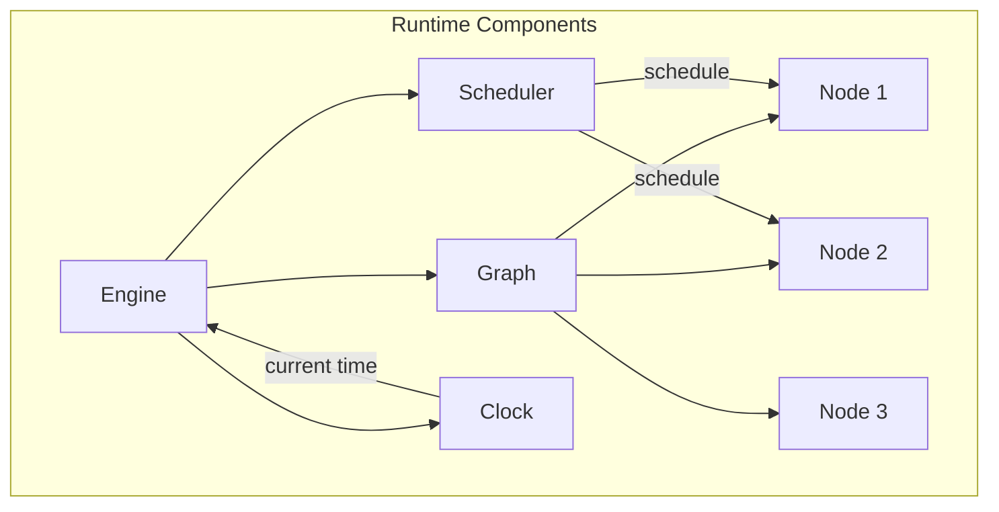

---

## 2. Lifecycle

All runtime components follow a consistent lifecycle:

### 2.1 State Machine

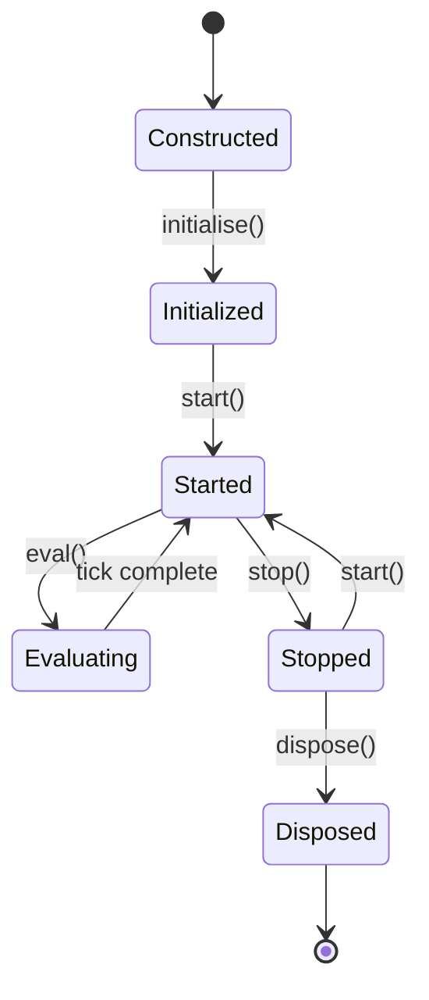

### 2.2 Lifecycle Methods

| Method | Description | Called When |
|--------|-------------|-------------|
| `initialise()` | One-time setup, allocate resources | Before first start |
| `start()` | Begin active operation | Each run/resume |
| `eval()` | Perform computation | Each scheduled tick |
| `stop()` | Pause operation | End run or pause |
| `dispose()` | Release all resources | Final cleanup |

### 2.3 Lifecycle Guarantees

| Guarantee | Description |
|-----------|-------------|
| Single Init | `initialise()` called exactly once |
| Matched Start/Stop | Every `start()` has matching `stop()` |
| Order | `initialise` → `start` → (eval)* → `stop` → `dispose` |
| Topological | Nodes initialized/started in dependency order |
| Reverse Dispose | Nodes disposed in reverse dependency order |

---

## 3. Graph

The **Graph** is the top-level runtime container:

### 3.1 Graph Structure

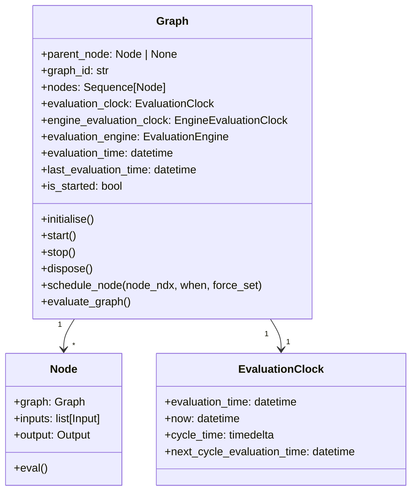

### 3.2 Graph Properties

| Property | Type | Description |
|----------|------|-------------|
| `parent_node` | `Node | None` | Parent node if nested graph |
| `graph_id` | `str` | Unique graph identifier |
| `nodes` | `Sequence[Node]` | All nodes in topological order |
| `evaluation_time` | `datetime` | Current tick's time |
| `last_evaluation_time` | `datetime` | Time of last evaluation |
| `evaluation_clock` | `EvaluationClock` | User-facing clock |
| `engine_evaluation_clock` | `EngineEvaluationClock` | Engine clock (internal) |
| `evaluation_engine` | `EvaluationEngine` | Evaluation engine |
| `evaluation_engine_api` | `EvaluationEngineApi` | Engine API interface |
| `traits` | `GraphTraits` | Graph configuration traits |
| `receiver` | `_SenderReceiverState` | Push source event receiver |
| `schedule` | `list[datetime]` | Scheduled evaluation times |
| `is_started` | `bool` | True if graph is running |

---

## 4. Scheduler

The **Scheduler** manages when nodes are evaluated:

### 4.1 Scheduling Model

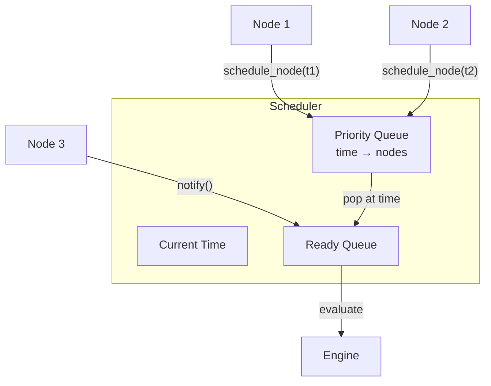

### 4.2 Scheduling Operations

| Operation | Description |
|-----------|-------------|
| `schedule(node, time)` | Add node to be evaluated at `time` |
| `pop_scheduled_nodes(time)` | Get all nodes scheduled for `time` |
| `next_scheduled_time()` | Return next time with pending nodes |
| `has_pending()` | True if any nodes are scheduled |

### 4.3 Priority Ordering

Within a single tick, nodes are ordered by:

1. **Topological rank** (sources before dependents)
2. **Node ID** (for deterministic ordering within same rank)

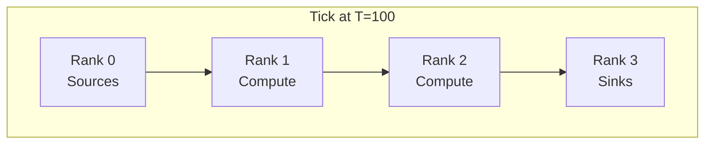

---

## 5. Clock

The **Clock** provides time management:

### 5.1 Clock Types

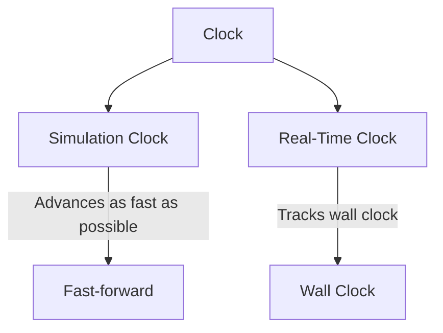

### 5.2 Clock Properties

| Property | Description |
|----------|-------------|
| `now` | Current time |
| `evaluation_time` | Time being evaluated |
| `push_time` | Source of async events |
| `cycle_id` | Current evaluation cycle ID |

### 5.3 Time Semantics

| Mode | Time Behavior |
|------|---------------|
| Simulation | Jumps directly to next scheduled event |
| Real-Time | Sleeps until next scheduled event |

---

## 6. Evaluation Loop

### 6.1 Main Loop

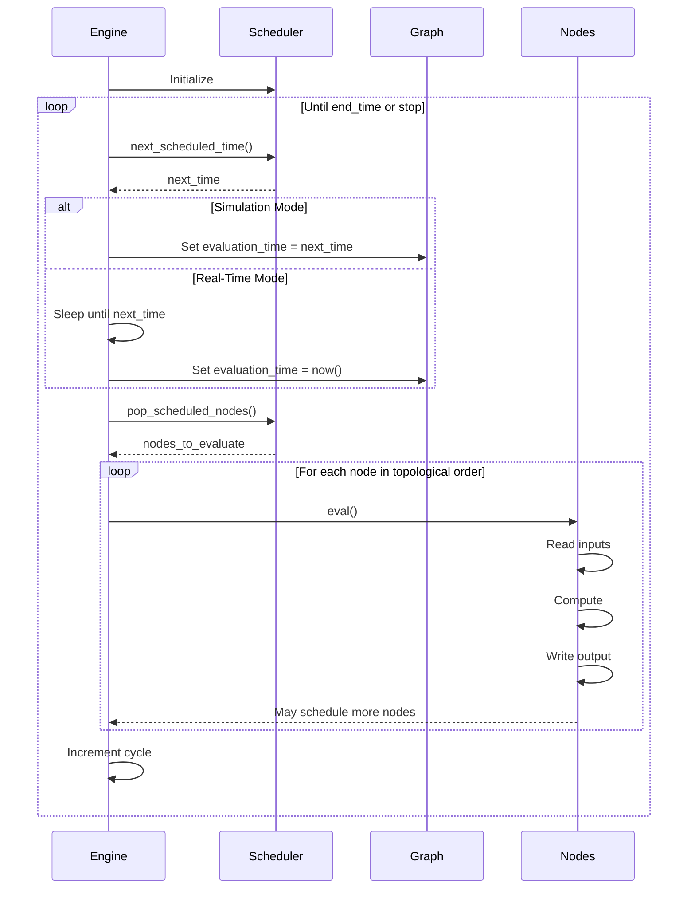

### 6.2 Evaluation Phases Per Tick

| Phase | Description |
|-------|-------------|
| 1. Collect | Get all nodes scheduled for current time |
| 2. Sort | Order by topological rank |
| 3. Evaluate | Call `eval()` on each node |
| 4. Propagate | Handle notifications and scheduling |
| 5. Cleanup | Reset per-tick state |

### 6.3 Node Evaluation

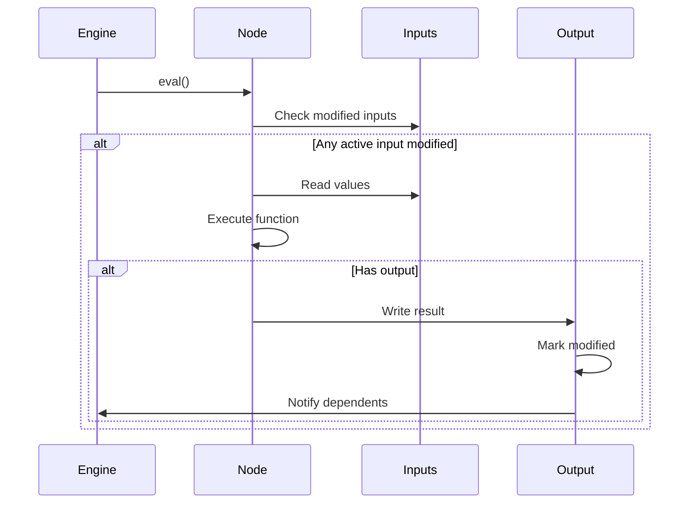

---

## 7. Notification System

### 7.1 Notification Flow

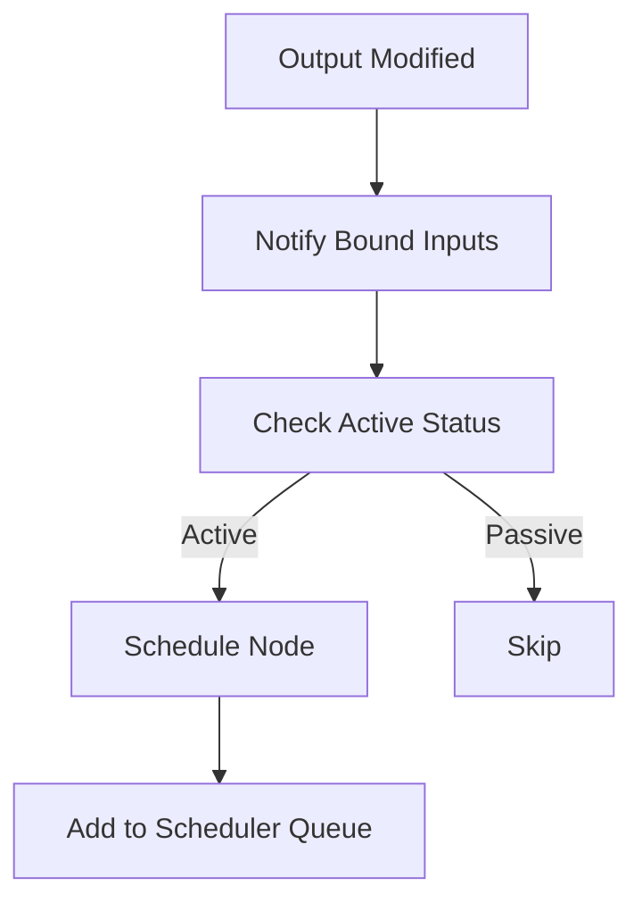

### 7.2 Notification Idempotency

Notifications are deduplicated per evaluation time:

```python
def notify(self, evaluation_time):
    if self._notify_time != evaluation_time:
        self._notify_time = evaluation_time
        self._propagate_to_parent()
        self._schedule_node()
```

### 7.3 Parent Chain Notification

For nested time-series (bundles, collections):

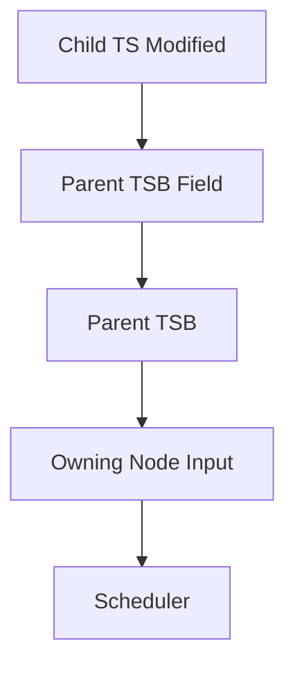

---

## 8. Input/Output Binding

### 8.1 Binding Model

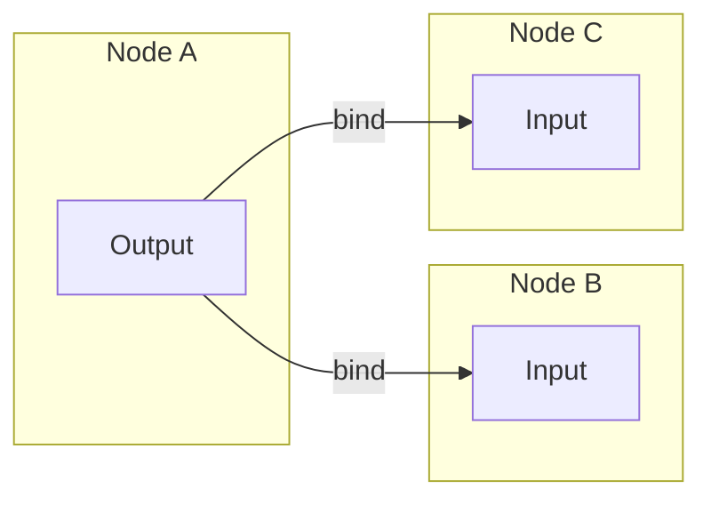

### 8.2 Binding Operations

| Operation | Description |
|-----------|-------------|
| `bind_output(output)` | Connect input to output |
| `unbind_output()` | Disconnect from output |
| `bound` | True if connected to an output |

### 8.3 Binding Effects

When binding occurs:
1. Input marks itself as bound
2. Input subscribes to output notifications
3. If output is valid, input copies current value
4. If input is active, node is scheduled

---

## 9. Active/Passive Subscriptions

### 9.1 Subscription Model

| State | Behavior |
|-------|----------|
| **Active** | Input triggers node evaluation on modification |
| **Passive** | Input receives updates but doesn't trigger evaluation |

### 9.2 State Transitions

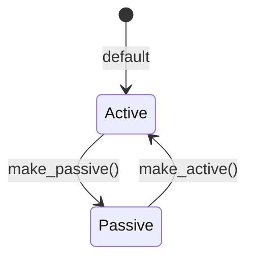

### 9.3 Subscription Use Cases

```python
@compute_node
def sample(trigger: TS[bool], value: TS[int]) -> TS[int]:
    """Only emit when trigger fires, using current value."""
    # 'value' could be passive - only read when trigger fires
    return value.value
```

---

## 10. Modification Tracking

### 10.1 Tracking Invariant

```
modified = (last_modified_time == evaluation_time)
```

A time-series is **modified** if it was changed in the current tick.

### 10.2 Tracking Implementation

| Property | Description |
|----------|-------------|
| `last_modified_time` | Time of most recent modification |
| `modified` | Computed: `last_modified_time == now` |

### 10.3 Modification Propagation

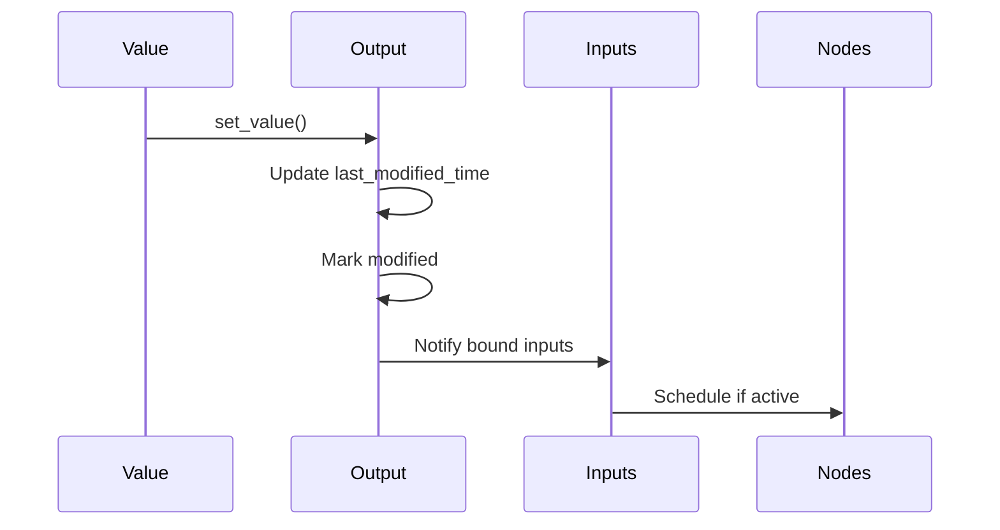

---

## 11. Error Handling

### 11.1 Error Types

| Error Type | Description |
|------------|-------------|
| `GraphError` | General graph errors |
| `NodeError` | Node-specific errors |
| `SchedulerError` | Scheduling failures |
| `EvaluationError` | Runtime evaluation failures |

### 11.2 Error Propagation

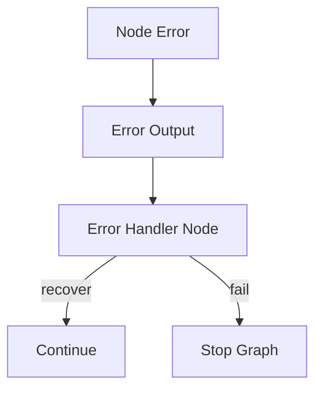

### 11.3 Error Outputs

Nodes can have optional error outputs:

```python
@compute_node
def risky_operation(x: TS[int]) -> TSB[ValueWithError]:
    try:
        result = complex_calculation(x.value)
        return {"value": result, "error": None}
    except Exception as e:
        return {"value": None, "error": str(e)}
```

---

## 12. Execution Modes

### 12.1 Simulation Mode

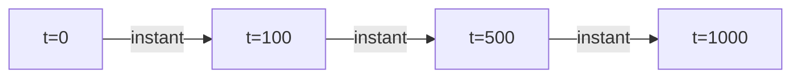

**Characteristics:**
- Time jumps to next scheduled event
- No push sources allowed
- Deterministic execution
- Reproducible results

### 12.2 Real-Time Mode

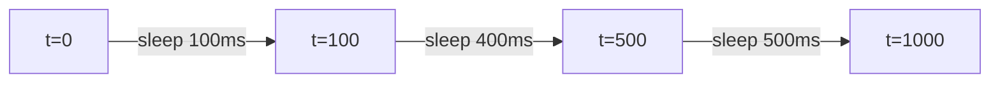

**Characteristics:**
- Time tracks wall clock
- Push sources allowed
- Non-deterministic (external events)
- May process late events

### 12.3 Mode Comparison

| Aspect | Simulation | Real-Time |
|--------|------------|-----------|
| Time progression | As fast as possible | Wall clock |
| Push sources | Prohibited | Allowed |
| Determinism | Guaranteed | Not guaranteed |
| Reproducibility | Full | Limited |
| Use case | Backtesting | Live operation |

---

## 13. Injectable Types

### 13.1 Available Injectables

| Injectable | Description |
|------------|-------------|
| `STATE[T]` | Mutable state container |
| `SCHEDULER` | Node scheduling access |
| `CLOCK` | Time information |
| `REPLAY_STATE` | State with replay support |
| `OUTPUT` | Direct output access |
| `CONTEXT` | Runtime context |

### 13.2 Usage

```python
@compute_node
def stateful_counter(
    trigger: TS[bool],
    state: STATE[int] = 0
) -> TS[int]:
    if trigger.value:
        state.value += 1
    return state.value
```

### 13.3 Injection Lifecycle

| Injectable | When Provided |
|------------|---------------|
| `STATE` | Created at initialization |
| `SCHEDULER` | Available from start |
| `CLOCK` | Available always |

---

## 14. Engine Configuration

### 14.1 Configuration Options

| Option | Description |
|--------|-------------|
| `start_time` | Evaluation start time |
| `end_time` | Evaluation end time (optional) |
| `run_mode` | SIMULATION or REAL_TIME |
| `trace` | Enable execution tracing |

### 14.2 run_graph Function

```python
def run_graph(
    graph: GraphBuilder,
    start_time: datetime = MIN_DT,
    end_time: datetime | None = None,
    run_mode: EvaluationMode = SIMULATION,
    **kwargs
) -> dict[str, Any] | None:
    """Execute a graph."""
```

---

## 15. Thread Safety

### 15.1 Threading Model

| Component | Thread Safety |
|-----------|---------------|
| Scheduler | Single-threaded access |
| Evaluation | Single evaluation thread |
| Push sources | Multi-threaded injection |
| Internal state | Protected by evaluation model |

### 15.2 Push Source Threading

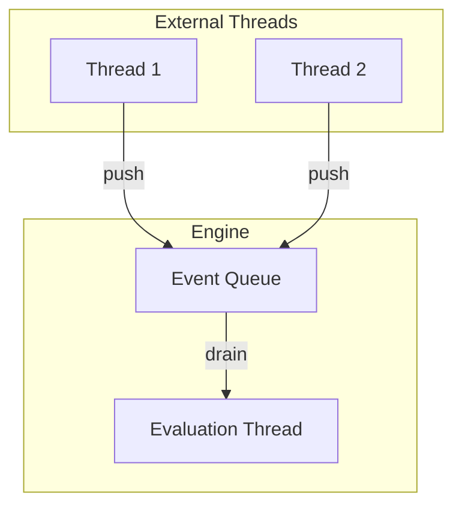

---

## 16. Implementation Notes

### 16.1 Push Source Node Processing Phase

Push source nodes have special handling in the evaluation loop that occurs BEFORE normal compute nodes:

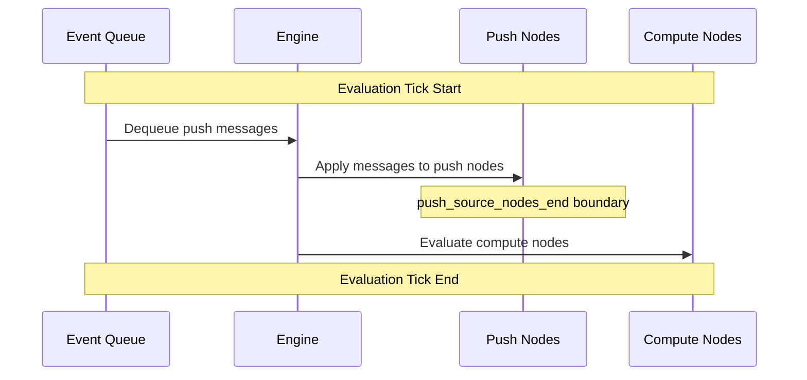

If message application fails, messages are re-queued with backpressure signaling.

### 16.2 Field-Level Modification Tracking (TSB)

Time-series bundles support field-level modification tracking:

```python
# When a bundle field is modified:
field_output.set(new_value)

# This triggers parent chain notification:
self._parent_or_node.mark_child_modified(self, modified_time)
```

This enables:
- Downstream node scheduling when individual TSB fields change (not just the bundle)
- Efficient delta tracking for nested structures
- Parent chain notification for TSD and nested bundles

### 16.3 Node Evaluation Guard Conditions

Nodes evaluate only when ALL of the following are satisfied:

| Condition | Description |
|-----------|-------------|
| Required inputs valid | All non-optional inputs have valid values |
| Collection completeness | For `all_valid=True`, all collection elements valid |
| Trigger present | Either input modified OR scheduler triggered |
| Scheduler verification | For scheduler-using nodes, something actually triggered scheduling |

### 16.4 Node-Level Scheduling (NodeSchedulerImpl)

Each node can access its own scheduler via `_scheduler: SCHEDULER` injectable:

```python
@compute_node
def my_node(ts: TS[int], _scheduler: SCHEDULER = None) -> TS[int]:
    if ts.modified:
        _scheduler.schedule(MIN_TD * 5, tag="delayed")  # Schedule future tick
        return ts.value
    if _scheduler.is_scheduled_now:
        return -1  # Handle scheduled tick
```

**Features:**
- Sorted event list with optional tags
- Alarm support with callbacks
- `is_scheduled_now` property for checking current tick
- Wall clock scheduling for real-time mode

---

## 17. Reference Locations

| Component | Python Location | C++ Location |
|-----------|-----------------|--------------|
| Graph | `hgraph/_impl/_runtime/_graph.py` | `cpp/src/cpp/runtime/` |
| Node | `hgraph/_impl/_runtime/_node.py` | `cpp/src/cpp/runtime/` |
| Scheduler | `hgraph/_impl/_runtime/_scheduler.py` | `cpp/src/cpp/runtime/` |
| Evaluation Engine | `hgraph/_impl/_runtime/_evaluation_engine.py` | `cpp/src/cpp/runtime/` |
| Clock | `hgraph/_impl/_runtime/_clock.py` | `cpp/src/cpp/runtime/` |

---

## 17. Next Steps

Continue to:
- [05_TIME_SERIES_TYPES.md](05_TIME_SERIES_TYPES.md) - Time-series type details
- [06_NODE_TYPES.md](06_NODE_TYPES.md) - Node specifications
- [07_OPERATORS.md](07_OPERATORS.md) - Built-in operators

