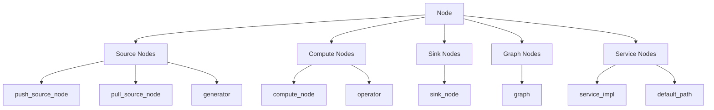
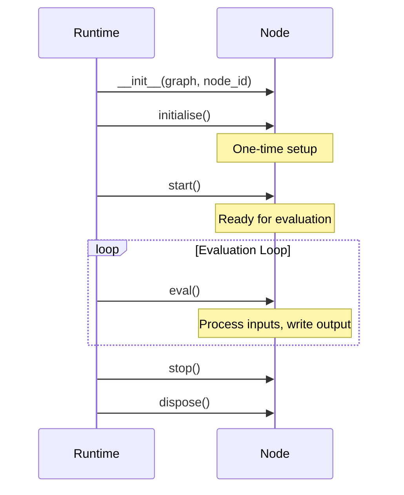
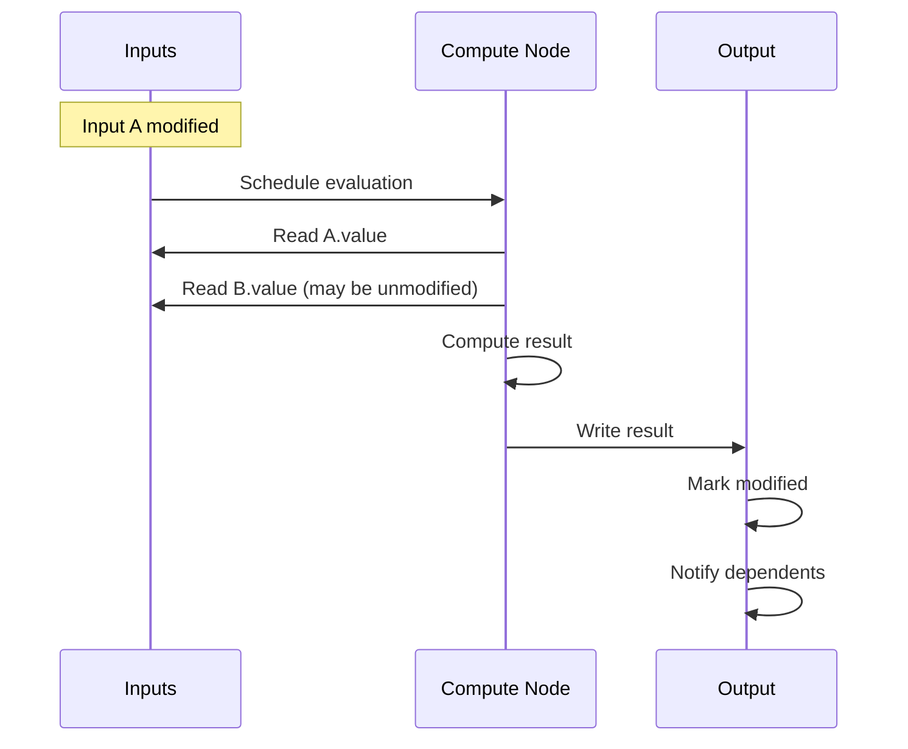
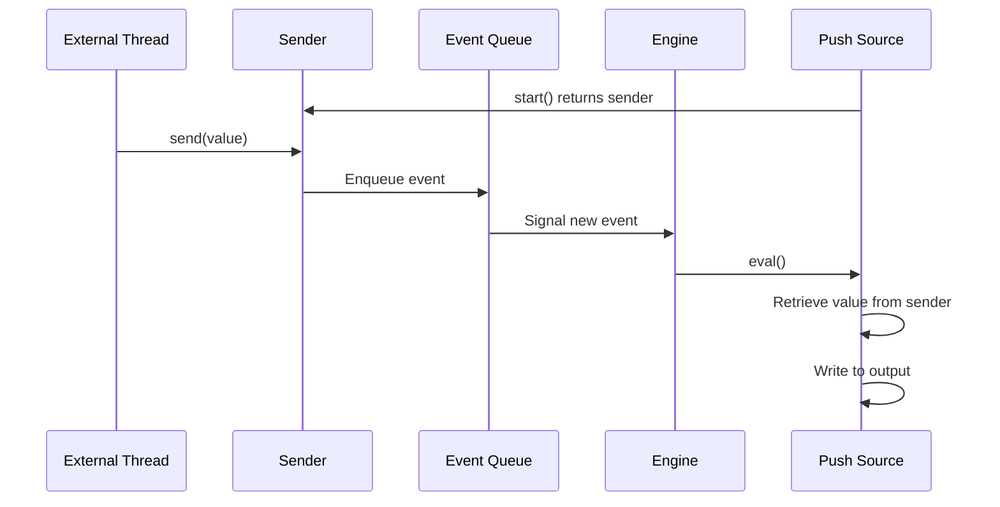
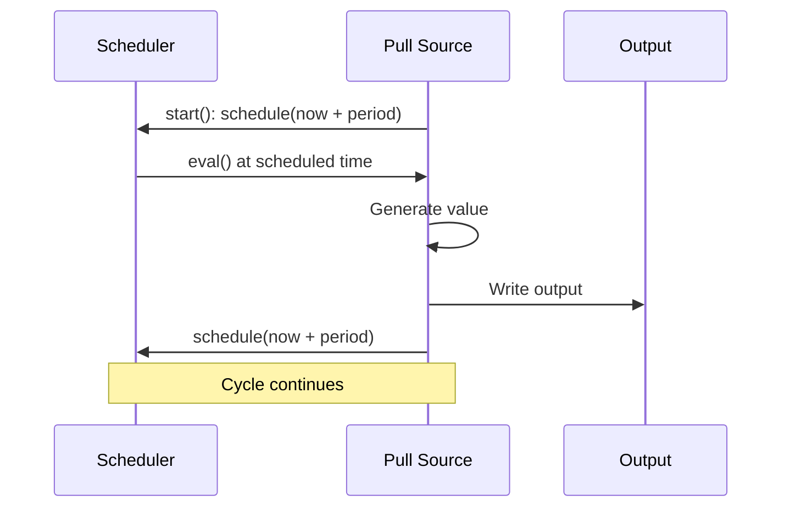
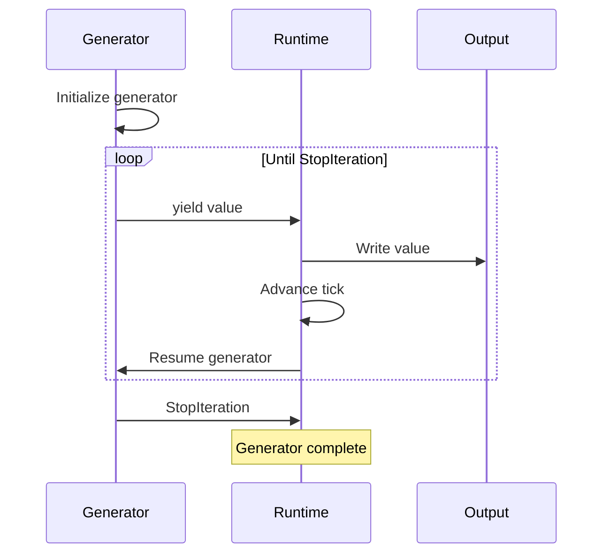
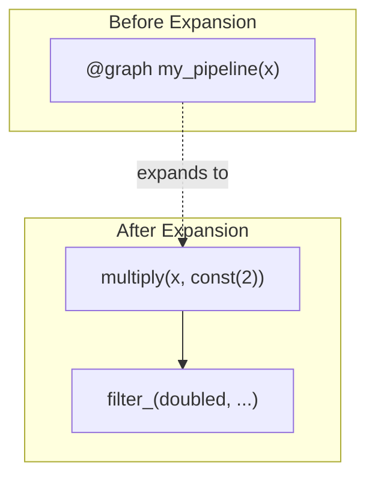
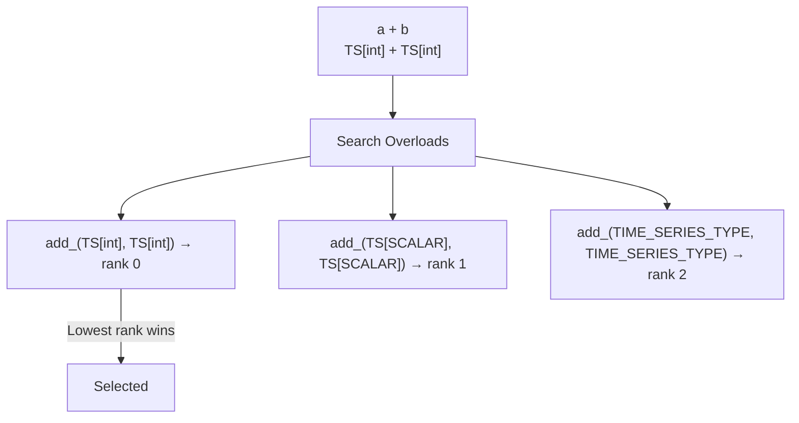
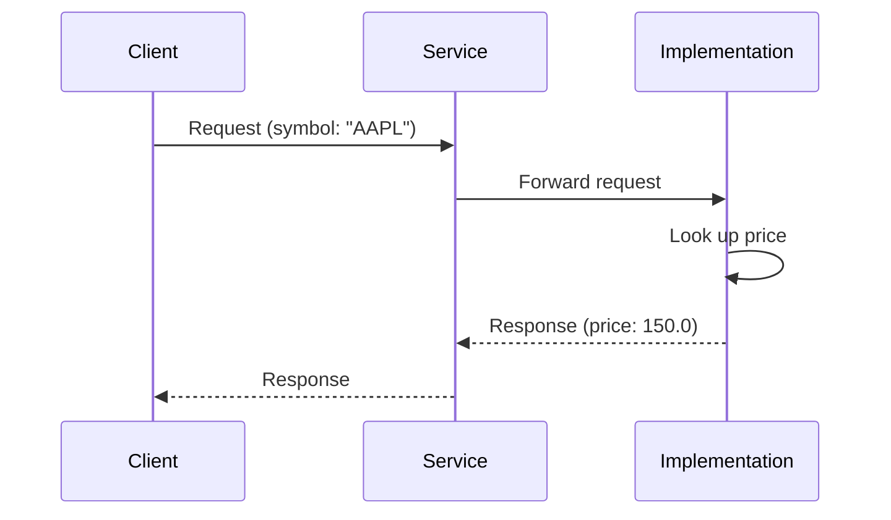
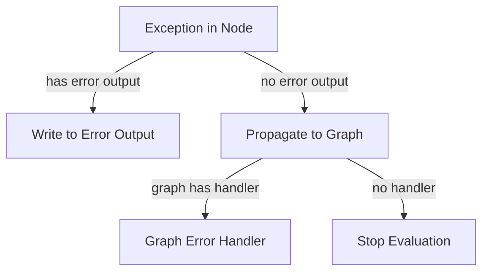

# Part VI: Node Types

**Version:** 1.0 Draft
**Last Updated:** 2025-12-20

---

## 1. Introduction

Nodes are the computational units of HGraph. Each node type has specific characteristics regarding inputs, outputs, evaluation, and lifecycle.



---

## 2. Node Base Properties

All nodes share common properties and behaviors:

### 2.1 Common Properties

| Property | Type | Description |
|----------|------|-------------|
| `node_id` | `int` | Unique identifier within graph |
| `graph` | `Graph` | Owning graph reference |
| `inputs` | `list[Input]` | List of time-series inputs |
| `output` | `Output | None` | Optional time-series output |
| `error_output` | `Output | None` | Optional error output |
| `signature` | `WiringSignature` | Type signature |
| `state` | `STATE[T] | None` | Optional mutable state |

### 2.2 Node Lifecycle



### 2.3 Evaluation Trigger

A node is scheduled for evaluation when:
1. An **active input** is modified, OR
2. The node schedules itself (sources), OR
3. Initial tick after start (some node types)

---

## 3. Compute Node

The most common node type, transforming inputs to outputs.

### 3.1 Declaration

```python
@compute_node
def add(a: TS[int], b: TS[int]) -> TS[int]:
    return a.value + b.value
```

### 3.2 Properties

| Property | Value |
|----------|-------|
| Inputs | One or more (at least one time-series) |
| Output | Required |
| Side Effects | Not permitted |
| Evaluation | When active inputs modified |

### 3.3 Evaluation Semantics



### 3.4 Return Value Handling

```python
@compute_node
def example(x: TS[int]) -> TS[int]:
    if x.value < 0:
        return None      # No output, output not modified
    return x.value * 2   # Output modified with value
```

| Return Value | Effect |
|--------------|--------|
| Value | Output set and marked modified |
| `None` | Output unchanged, not marked modified |
| Exception | Error output if present, otherwise propagates |

### 3.5 Multiple Outputs (Bundle)

```python
@compute_node
def split(x: TS[int]) -> TSB[SplitResult]:
    return {"positive": x.value if x.value > 0 else None,
            "negative": x.value if x.value < 0 else None}
```

---

## 4. Sink Node

Nodes that consume time-series and produce side effects.

### 4.1 Declaration

```python
@sink_node
def print_value(value: TS[int]):
    print(f"Value: {value.value}")
```

### 4.2 Properties

| Property | Value |
|----------|-------|
| Inputs | One or more (at least one time-series) |
| Output | None |
| Side Effects | Permitted and expected |
| Evaluation | When active inputs modified |

### 4.3 Use Cases

- Logging and debugging (`debug_print`)
- External system integration
- File/database writes
- Network communication

### 4.4 No Return Value

```python
@sink_node
def log_to_file(msg: TS[str], path: str = "log.txt"):
    with open(path, "a") as f:
        f.write(f"{msg.value}\n")
    # No return statement - this is correct
```

---

## 5. Push Source Node

Injects asynchronous external events into the graph.

### 5.1 Declaration

```python
@push_source_node
def websocket_events() -> TS[str]:
    ...
```

### 5.2 Properties

| Property | Value |
|----------|-------|
| Inputs | Scalars only (no time-series) |
| Output | Required |
| Evaluation | Triggered by external event |
| Mode | Real-time only (not simulation) |

### 5.3 Sender Pattern



### 5.4 Implementation Pattern

```python
@push_source_node
def external_source() -> TS[MyEvent]:
    """
    The runtime provides a 'sender' object.
    External code calls sender.send(value).
    Node evaluation retrieves and outputs the value.
    """
    pass  # Body handled by runtime
```

### 5.5 Restrictions

- **Cannot be used in simulation mode** - would break determinism
- Thread-safe sender required
- Events queued until next evaluation opportunity

---

## 6. Pull Source Node

Generates scheduled values without external triggers.

### 6.1 Declaration

```python
@pull_source_node
def clock_ticks(period: timedelta = timedelta(seconds=1)) -> TS[datetime]:
    """Emit current time periodically."""
    return datetime.now()
```

### 6.2 Properties

| Property | Value |
|----------|-------|
| Inputs | Scalars only (no time-series) |
| Output | Required |
| Evaluation | Self-scheduled |
| Mode | Both simulation and real-time |

### 6.3 Scheduling Pattern



### 6.4 Scheduler Access

```python
@pull_source_node
def scheduled_source(
    scheduler: SCHEDULER,
    interval: timedelta
) -> TS[int]:
    scheduler.schedule(scheduler.now + interval)
    return generate_value()
```

---

## 7. Generator

Python generator-based source using yield.

### 7.1 Declaration

```python
@generator
def counter(start: int = 0) -> TS[int]:
    count = start
    while True:
        yield count
        count += 1
```

### 7.2 Properties

| Property | Value |
|----------|-------|
| Inputs | Scalars only |
| Output | Required |
| Body | Python generator (yields values) |
| Scheduling | Each yield advances one tick |

### 7.3 Execution Pattern



### 7.4 Time Control

```python
@generator
def timed_events(scheduler: SCHEDULER) -> TS[str]:
    yield "start"
    scheduler.advance(timedelta(seconds=5))  # Skip 5 seconds
    yield "after 5 seconds"
```

---

## 8. Graph

Composition of other nodes.

### 8.1 Declaration

```python
@graph
def my_pipeline(x: TS[int]) -> TS[int]:
    doubled = multiply(x, const(2))
    filtered = filter_(doubled, lambda v: v > 0)
    return filtered
```

### 8.2 Properties

| Property | Value |
|----------|-------|
| Inputs | Any types |
| Output | Optional |
| Body | Wiring code (not evaluated at runtime) |
| Expansion | Inlined at wiring time |

### 8.3 Expansion Behavior



### 8.4 No Runtime Representation

Graphs expand completely at wiring time:
- No graph node exists at runtime
- Contained nodes exist independently
- Inputs/outputs connected directly

---

## 9. Operator

Function overloading for time-series operations.

### 9.1 Declaration

```python
@operator
def add_(lhs: TS[int], rhs: TS[int]) -> TS[int]:
    return lhs.value + rhs.value

@operator
def add_(lhs: TS[SCALAR], rhs: TS[SCALAR]) -> TS[SCALAR]:
    return lhs.value + rhs.value  # Generic fallback
```

### 9.2 Properties

| Property | Value |
|----------|-------|
| Purpose | Multiple implementations of same operation |
| Selection | Based on input types and generic rank |
| Behavior | Like compute_node after selection |

### 9.3 Overload Resolution



### 9.4 Generic Rank Calculation

| Signature | Rank |
|-----------|------|
| Exact types (`TS[int]`) | 0 |
| One type variable | 1 |
| More type variables | +1 each |
| General `TIME_SERIES_TYPE` | Higher |

---

## 10. Service Infrastructure

Services enable request-reply and subscription patterns.

### 10.1 Service Definition

```python
@service
def price_service(request: TS[str]) -> TS[float]:
    """Request price by symbol."""
    ...
```

### 10.2 Service Implementation

```python
@service_impl(interface=price_service)
def price_service_impl(request: TS[str], prices: TSD[str, TS[float]]) -> TS[float]:
    """Implementation using price TSD."""
    return prices[request.value].value
```

### 10.3 Service Types

| Type | Pattern | Description |
|------|---------|-------------|
| `service` | Request-Reply | One request → one response |
| `subscription_service` | Publish-Subscribe | Subscribe → stream of updates |
| `reference_service` | Reference | Get reference to shared data |

### 10.4 Service Flow



---

## 11. Special Nodes

### 11.1 Const

Creates a constant time-series value.

```python
const(42)               # TS[int] always 42
const("hello")          # TS[str]
const(MyData(...))      # TS[MyData]
```

**Behavior:**
- Outputs value once at start
- Never modified again
- Valid for entire graph lifetime

### 11.2 Feedback

Creates a loop in the graph.

```python
@graph
def with_feedback() -> TS[int]:
    fb = feedback(TS[int], delay=1)
    current = add(source(), fb())
    fb(current)
    return current
```

**Behavior:**
- Creates delayed binding
- Value from tick N available at tick N+delay
- Enables iterative computations

### 11.3 Switch

Dynamically selects between alternatives.

```python
switch_(
    selector,           # TS[K]
    {
        key1: branch1,  # TS[V]
        key2: branch2,  # TS[V]
    }
)
```

**Behavior:**
- Output follows currently selected branch
- Branches may be lazily evaluated
- Selection change triggers output modification

### 11.4 Map

Applies function over collection.

```python
map_(
    double,             # Mapping function
    tsd                 # TSD[K, TS[V]]
)  # Returns TSD[K, TS[W]]
```

**Behavior:**
- Creates one node instance per key
- Automatically handles key additions/removals
- Maintains per-key state if applicable

---

## 12. Injectable Parameters

Special parameters provided by the runtime:

### 12.1 STATE

```python
@compute_node
def counter(
    trigger: TS[bool],
    state: STATE[int] = 0
) -> TS[int]:
    if trigger.value:
        state.value += 1
    return state.value
```

| Property | Description |
|----------|-------------|
| Purpose | Mutable state across evaluations |
| Initialization | Default value or factory |
| Lifecycle | Created at node init, disposed at node dispose |

### 12.2 SCHEDULER

```python
@pull_source_node
def scheduled(
    scheduler: SCHEDULER,
    interval: timedelta
) -> TS[int]:
    scheduler.schedule(scheduler.now + interval)
    return current_value()
```

| Property | Description |
|----------|-------------|
| Purpose | Schedule future evaluations |
| `now` | Current evaluation time |
| `schedule(time)` | Schedule node for future time |

### 12.3 CLOCK

```python
@compute_node
def timestamped(
    value: TS[int],
    clock: CLOCK
) -> TSB[TimestampedValue]:
    return {"time": clock.now, "value": value.value}
```

| Property | Description |
|----------|-------------|
| Purpose | Access current time |
| `now` | Current evaluation time |
| `cycle_id` | Current evaluation cycle |

### 12.4 OUTPUT

```python
@compute_node(all_valid=("a", "b"))
def conditional_output(
    a: TS[int],
    b: TS[int],
    output: OUTPUT[TS[int]]
) -> TS[int]:
    output.value = a.value + b.value
    return None  # Already set via OUTPUT
```

| Property | Description |
|----------|-------------|
| Purpose | Direct output manipulation |
| Use Case | Complex output patterns |

---

## 13. Node Decorators

### 13.1 Common Decorator Parameters

| Parameter | Description |
|-----------|-------------|
| `active` | Tuple of input names that are active by default |
| `valid` | Tuple of input names that must be valid to evaluate |
| `all_valid` | Tuple of input names where all nested values must be valid |
| `deprecated` | Mark node as deprecated with message |
| `requires` | List of required optional inputs |

### 13.2 Example

```python
@compute_node(
    active=("trigger",),           # Only trigger is active
    valid=("value",),              # value must be valid to evaluate
    deprecated="Use new_function instead"
)
def old_function(trigger: TS[bool], value: TS[int]) -> TS[int]:
    return value.value
```

---

## 14. Error Handling in Nodes

### 14.1 Error Output

```python
@compute_node
def safe_divide(a: TS[float], b: TS[float]) -> TSB[ResultOrError]:
    if b.value == 0:
        return {"error": "Division by zero", "result": None}
    return {"result": a.value / b.value, "error": None}
```

### 14.2 Exception Propagation



---

## 15. Reference Locations

| Node Type | Location |
|-----------|----------|
| compute_node | `hgraph/_wiring/_decorators.py` |
| sink_node | `hgraph/_wiring/_decorators.py` |
| push_source_node | `hgraph/_wiring/_decorators.py` |
| pull_source_node | `hgraph/_wiring/_decorators.py` |
| generator | `hgraph/_wiring/_decorators.py` |
| graph | `hgraph/_wiring/_decorators.py` |
| operator | `hgraph/_wiring/_decorators.py` |
| service | `hgraph/_wiring/_service_interface.py` |
| Node Runtime | `hgraph/_impl/_runtime/_node.py` |

---

## 16. Next Steps

Continue to:
- [07_OPERATORS.md](07_OPERATORS.md) - Built-in operators and functions

