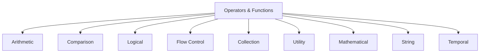
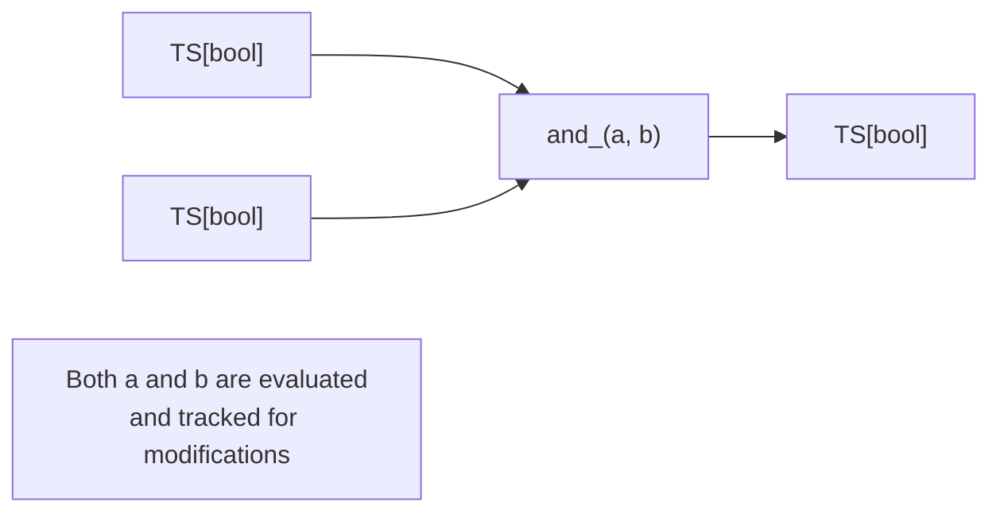
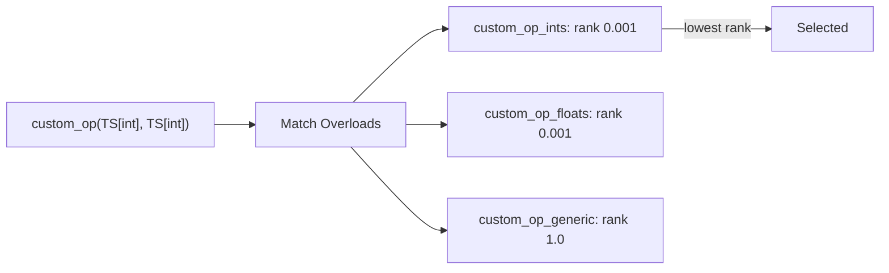

# Part VII: Operators and Standard Library

**Version:** 1.0 Draft
**Last Updated:** 2025-12-20

---

## 1. Introduction

HGraph provides a comprehensive set of built-in operators and functions for common time-series operations. These are organized into categories:



---

## 2. Arithmetic Operators

### 2.1 Binary Arithmetic

| Operator | Function | Description |
|----------|----------|-------------|
| `a + b` | `add_(a, b)` | Addition |
| `a - b` | `sub_(a, b)` | Subtraction |
| `a * b` | `mul_(a, b)` | Multiplication |
| `a / b` | `div_(a, b)` | Division |
| `a // b` | `floordiv_(a, b)` | Floor division |
| `a % b` | `mod_(a, b)` | Modulo |
| `a ** b` | `pow_(a, b)` | Power |

### 2.2 Unary Arithmetic

| Operator | Function | Description |
|----------|----------|-------------|
| `-a` | `neg_(a)` | Negation |
| `+a` | `pos_(a)` | Positive (identity) |
| `abs(a)` | `abs_(a)` | Absolute value |

### 2.3 Type Signatures

```python
# Scalar time-series
add_(lhs: TS[SCALAR], rhs: TS[SCALAR]) -> TS[SCALAR]

# With scalar constant
add_(lhs: TS[SCALAR], rhs: SCALAR) -> TS[SCALAR]
add_(lhs: SCALAR, rhs: TS[SCALAR]) -> TS[SCALAR]

# Collection time-series
add_(lhs: TSD[K, TS[V]], rhs: TSD[K, TS[V]]) -> TSD[K, TS[V]]
```

### 2.4 Example

```python
@graph
def arithmetic_example(x: TS[float], y: TS[float]) -> TS[float]:
    sum_ = x + y
    diff = x - y
    product = sum_ * diff
    result = product / const(2.0)
    return result
```

---

## 3. Comparison Operators

### 3.1 Comparison Functions

| Operator | Function | Description |
|----------|----------|-------------|
| `a == b` | `eq_(a, b)` | Equal |
| `a != b` | `ne_(a, b)` | Not equal |
| `a < b` | `lt_(a, b)` | Less than |
| `a <= b` | `le_(a, b)` | Less or equal |
| `a > b` | `gt_(a, b)` | Greater than |
| `a >= b` | `ge_(a, b)` | Greater or equal |

### 3.2 Type Signatures

```python
eq_(lhs: TS[SCALAR], rhs: TS[SCALAR]) -> TS[bool]
lt_(lhs: TS[SCALAR], rhs: TS[SCALAR]) -> TS[bool]
```

### 3.3 Example

```python
@graph
def comparison_example(temp: TS[float], threshold: float) -> TS[bool]:
    return temp > const(threshold)
```

---

## 4. Logical Operators

### 4.1 Boolean Operations

| Operator | Function | Description |
|----------|----------|-------------|
| `a & b` | `and_(a, b)` | Logical AND |
| `a \| b` | `or_(a, b)` | Logical OR |
| `~a` | `not_(a)` | Logical NOT |
| `a ^ b` | `xor_(a, b)` | Logical XOR |

### 4.2 Type Signatures

```python
and_(lhs: TS[bool], rhs: TS[bool]) -> TS[bool]
not_(a: TS[bool]) -> TS[bool]
```

### 4.3 Short-Circuit Behavior

Unlike Python's native operators, HGraph's logical operators evaluate both branches (reactive semantics):



---

## 5. Flow Control

### 5.1 Conditional Functions

| Function | Description |
|----------|-------------|
| `if_(cond, true, false)` | Conditional selection |
| `if_then_else(cond, true, false)` | Wiring-time conditional |
| `switch_(selector, branches)` | Multi-way selection |
| `match_(value, patterns)` | Pattern matching |

### 5.2 if_

Runtime conditional that outputs based on condition:

```python
@graph
def conditional(flag: TS[bool], a: TS[int], b: TS[int]) -> TS[int]:
    return if_(flag, a, b)
```

**Behavior:**
- When `flag` is True, output follows `a`
- When `flag` is False, output follows `b`
- Both branches remain active

### 5.3 switch_

Dynamic multi-branch selection:

```python
@graph
def multi_select(key: TS[str], sources: TSD[str, TS[float]]) -> TS[float]:
    return switch_({
        "fast": sources["fast"],
        "slow": sources["slow"],
        "default": const(0.0)
    }, key)
```

### 5.4 gate

Controls output based on condition:

```python
gate(condition: TS[bool], ts: TS[T]) -> TS[T]
# Output ts.value only when condition is True
```

### 5.5 sample

Samples value when trigger fires:

```python
sample(trigger: TS[bool], ts: TS[T]) -> TS[T]
# Output ts.value when trigger becomes True
```

---

## 6. Collection Operations

### 6.1 TSD (Dictionary) Operations

| Function | Description |
|----------|-------------|
| `tsd[key]` | Get value for key |
| `tsd.keys()` | Get all keys |
| `len_(tsd)` | Number of entries |
| `contains_(tsd, key)` | Check key existence |
| `merge_(tsd1, tsd2)` | Merge dictionaries |

### 6.2 TSL (List) Operations

| Function | Description |
|----------|-------------|
| `tsl[index]` | Get element at index |
| `len_(tsl)` | Number of elements |
| `sum_(tsl)` | Sum all elements |
| `mean_(tsl)` | Average of elements |

### 6.3 TSS (Set) Operations

| Function | Description |
|----------|-------------|
| `contains_(tss, item)` | Check membership |
| `len_(tss)` | Number of items |
| `union_(tss1, tss2)` | Set union |
| `intersection_(tss1, tss2)` | Set intersection |
| `difference_(tss1, tss2)` | Set difference |

### 6.4 Map Operations

```python
# Apply function to each element
map_(func, tsd) -> TSD[K, TS[W]]
map_(func, tsl) -> TSL[TS[W], Size]

# Example
@graph
def double_all(prices: TSD[str, TS[float]]) -> TSD[str, TS[float]]:
    return map_(lambda p: p * 2, prices)
```

### 6.5 Reduce Operations

```python
# Reduce collection to single value
reduce_(func, tsd, initial) -> TS[T]
reduce_(func, tsl, initial) -> TS[T]

# Example
@graph
def sum_prices(prices: TSD[str, TS[float]]) -> TS[float]:
    return reduce_(add_, prices.values(), const(0.0))
```

---

## 7. Window Operations

### 7.1 Window Creation

```python
window(ts: TS[T], size: int) -> TSW[T, Size]
# Create sliding window of last N values
```

### 7.2 Window Functions

| Function | Description |
|----------|-------------|
| `sum_(window)` | Sum of window values |
| `mean_(window)` | Mean of window values |
| `min_(window)` | Minimum value |
| `max_(window)` | Maximum value |
| `std_(window)` | Standard deviation |
| `var_(window)` | Variance |

### 7.3 Example

```python
@graph
def moving_average(price: TS[float], period: int) -> TS[float]:
    w = window(price, period)
    return mean_(w)
```

---

## 8. Temporal Operations

### 8.1 Time Functions

| Function | Description |
|----------|-------------|
| `now()` | Current evaluation time |
| `delay(ts, periods)` | Delay by N ticks |
| `lag(ts, time)` | Delay by time duration |
| `diff_(ts)` | Difference from previous |
| `ticked(ts)` | True when ts modified |

### 8.2 Scheduling Functions

| Function | Description |
|----------|-------------|
| `schedule(time, value)` | Emit at scheduled time |
| `throttle(ts, period)` | Limit update rate |
| `debounce(ts, period)` | Delay until quiet |
| `timeout(ts, period)` | Detect no updates |

### 8.3 Example

```python
@graph
def rate_of_change(price: TS[float]) -> TS[float]:
    prev = lag(price, timedelta(seconds=1))
    return if_(prev.valid, price - prev, const(0.0))
```

---

## 9. Aggregation Functions

### 9.1 Basic Aggregations

| Function | Description |
|----------|-------------|
| `sum_(...)` | Sum values |
| `mean_(...)` | Average values |
| `min_(...)` | Minimum value |
| `max_(...)` | Maximum value |
| `count_(...)` | Count items |

### 9.2 Statistical Aggregations

| Function | Description |
|----------|-------------|
| `std_(...)` | Standard deviation |
| `var_(...)` | Variance |
| `median_(...)` | Median value |
| `percentile_(...)` | Percentile calculation |

### 9.3 Time-Weighted

```python
# Time-weighted average
twap_(price: TS[float]) -> TS[float]

# Volume-weighted average
vwap_(price: TS[float], volume: TS[float]) -> TS[float]
```

---

## 10. String Operations

### 10.1 String Functions

| Function | Description |
|----------|-------------|
| `format_(template, *args)` | String formatting |
| `concat_(a, b)` | String concatenation |
| `split_(s, sep)` | Split string |
| `join_(sep, strings)` | Join strings |
| `upper_(s)` | Uppercase |
| `lower_(s)` | Lowercase |
| `strip_(s)` | Remove whitespace |

### 10.2 Example

```python
@graph
def format_message(symbol: TS[str], price: TS[float]) -> TS[str]:
    return format_("{}: ${:.2f}", symbol, price)
```

---

## 11. Mathematical Functions

### 11.1 Basic Math

| Function | Description |
|----------|-------------|
| `sqrt_(x)` | Square root |
| `exp_(x)` | Exponential |
| `log_(x)` | Natural logarithm |
| `log10_(x)` | Base-10 logarithm |
| `floor_(x)` | Floor |
| `ceil_(x)` | Ceiling |
| `round_(x, n)` | Round to n decimals |

### 11.2 Trigonometric

| Function | Description |
|----------|-------------|
| `sin_(x)` | Sine |
| `cos_(x)` | Cosine |
| `tan_(x)` | Tangent |
| `asin_(x)` | Arc sine |
| `acos_(x)` | Arc cosine |
| `atan_(x)` | Arc tangent |
| `atan2_(y, x)` | Two-argument arc tangent |

---

## 12. Utility Functions

### 12.1 Type Conversion

| Function | Description |
|----------|-------------|
| `cast_(ts, type)` | Type conversion |
| `to_int_(ts)` | Convert to int |
| `to_float_(ts)` | Convert to float |
| `to_str_(ts)` | Convert to string |

### 12.2 Default Values

| Function | Description |
|----------|-------------|
| `default_(ts, value)` | Use value if ts invalid |
| `coalesce_(ts1, ts2, ...)` | First valid value |

### 12.3 Debugging

| Function | Description |
|----------|-------------|
| `debug_print(label, ts)` | Print to console |
| `trace(ts)` | Trace modifications |
| `log_(level, message, ts)` | Log with level |

### 12.4 Example

```python
@graph
def safe_divide(a: TS[float], b: TS[float]) -> TS[float]:
    result = a / b
    return default_(result, const(0.0))
```

---

## 13. Collection Constructors

### 13.1 const

Create constant time-series:

```python
const(value: T) -> TS[T]
const(42)           # TS[int]
const("hello")      # TS[str]
const({"a": 1})     # TS[dict]
```

### 13.2 nothing

Create null/empty time-series:

```python
nothing(TS[int])    # Unbound TS[int]
```

### 13.3 feedback

Create delayed feedback loop:

```python
@graph
def accumulator() -> TS[int]:
    fb = feedback(TS[int], delay=1)
    current = add(source(), default_(fb(), const(0)))
    fb(current)
    return current
```

---

## 14. Higher-Order Functions

### 14.1 map_

Apply function to collection elements:

```python
map_(func: Callable[[TS[T]], TS[U]], coll: TSD[K, TS[T]]) -> TSD[K, TS[U]]
```

### 14.2 filter_

Filter collection by predicate:

```python
filter_(pred: Callable[[TS[T]], TS[bool]], coll: TSD[K, TS[T]]) -> TSD[K, TS[T]]
```

### 14.3 reduce_

Reduce collection to single value:

```python
reduce_(func: Callable[[TS[T], TS[T]], TS[T]], coll, initial) -> TS[T]
```

### 14.4 fold_

Fold with state:

```python
fold_(func: Callable[[TS[S], TS[T]], TS[S]], coll, initial: TS[S]) -> TS[S]
```

---

## 15. Operator Overloading

Python operators are mapped to HGraph functions:

### 15.1 Arithmetic Operators

| Python | HGraph |
|--------|--------|
| `a + b` | `add_(a, b)` |
| `a - b` | `sub_(a, b)` |
| `a * b` | `mul_(a, b)` |
| `a / b` | `div_(a, b)` |
| `a // b` | `floordiv_(a, b)` |
| `a % b` | `mod_(a, b)` |
| `a ** b` | `pow_(a, b)` |

### 15.2 Comparison Operators

| Python | HGraph |
|--------|--------|
| `a == b` | `eq_(a, b)` |
| `a != b` | `ne_(a, b)` |
| `a < b` | `lt_(a, b)` |
| `a <= b` | `le_(a, b)` |
| `a > b` | `gt_(a, b)` |
| `a >= b` | `ge_(a, b)` |

### 15.3 Logical Operators

| Python | HGraph |
|--------|--------|
| `a & b` | `and_(a, b)` |
| `a \| b` | `or_(a, b)` |
| `~a` | `not_(a)` |
| `a ^ b` | `xor_(a, b)` |

### 15.4 Indexing

| Python | HGraph |
|--------|--------|
| `a[key]` | `getitem_(a, key)` |
| `a[key] = v` | `setitem_(a, key, v)` |

---

## 16. Extending Operators

### 16.1 Creating New Operators

Define new operators using the `@operator` decorator:

```python
@operator
def custom_op(lhs: TIME_SERIES_TYPE, rhs: TIME_SERIES_TYPE) -> TIME_SERIES_TYPE:
    """Custom binary operation."""
```

### 16.2 Adding Overloads

Register implementations using `overloads` parameter:

```python
@compute_node(overloads=custom_op)
def custom_op_ints(lhs: TS[int], rhs: TS[int]) -> TS[int]:
    return lhs.value + rhs.value * 2

@compute_node(overloads=custom_op)
def custom_op_floats(lhs: TS[float], rhs: TS[float]) -> TS[float]:
    return lhs.value + rhs.value * 2.0
```

### 16.3 Overload Resolution

When an operator is called, the best overload is selected by:

1. **Type matching**: Try to resolve each overload's signature
2. **Rank calculation**: Calculate specificity rank for each candidate
3. **Selection**: Choose the candidate with lowest rank (most specific)



### 16.4 Generic Rank

Type specificity is quantified by generic rank:

| Type | Rank |
|------|------|
| Concrete (`TS[int]`) | ~0.001 |
| TypeVar (`TS[SCALAR]`) | ~1.0 |
| Most generic (`TIME_SERIES_TYPE`) | ~1.0+ |

Lower rank = more specific = preferred.

### 16.5 Import Requirements

Overloads must be imported before use:

```python
# In __init__.py or imported module
from my_package._impl._operators import custom_op_ints, custom_op_floats
```

For more details on operator overloading and custom resolvers, see [08_ADVANCED_CONCEPTS.md](08_ADVANCED_CONCEPTS.md).

---

## 17. Reference Locations

| Category | Location |
|----------|----------|
| Operators | `hgraph/_wiring/_decorators.py` |
| OperatorWiringNodeClass | `hgraph/_wiring/_wiring_node_class/_operator_wiring_node.py` |
| Generic Rank | `hgraph/_types/_generic_rank_util.py` |

---

## 18. Standard Library Reference Locations

| Category | Location |
|----------|----------|
| Arithmetic | `hgraph/_operators/_operators.py` |
| Comparison | `hgraph/_operators/_operators.py` |
| Logical | `hgraph/_operators/_operators.py` |
| Flow Control | `hgraph/_operators/_flow_control.py` |
| Collection | `hgraph/_operators/_tsd_operators.py` |
| Window | `hgraph/_operators/_window_operators.py` |
| Temporal | `hgraph/_operators/_time_operators.py` |
| Math | `hgraph/_operators/_math_operators.py` |
| String | `hgraph/_operators/_string_operators.py` |
| Utility | `hgraph/_operators/_util_operators.py` |

---

## 19. Summary

HGraph's operator system provides:

1. **Familiar Python syntax** through operator overloading
2. **Type-safe operations** with automatic type resolution
3. **Reactive semantics** with modification tracking
4. **Collection support** for TSD, TSL, TSS, TSW
5. **Higher-order functions** for functional programming
6. **Extensibility** through the `@operator` decorator

