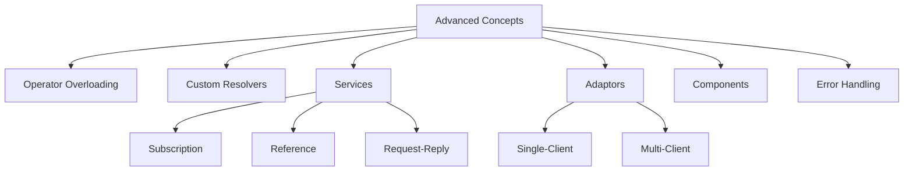
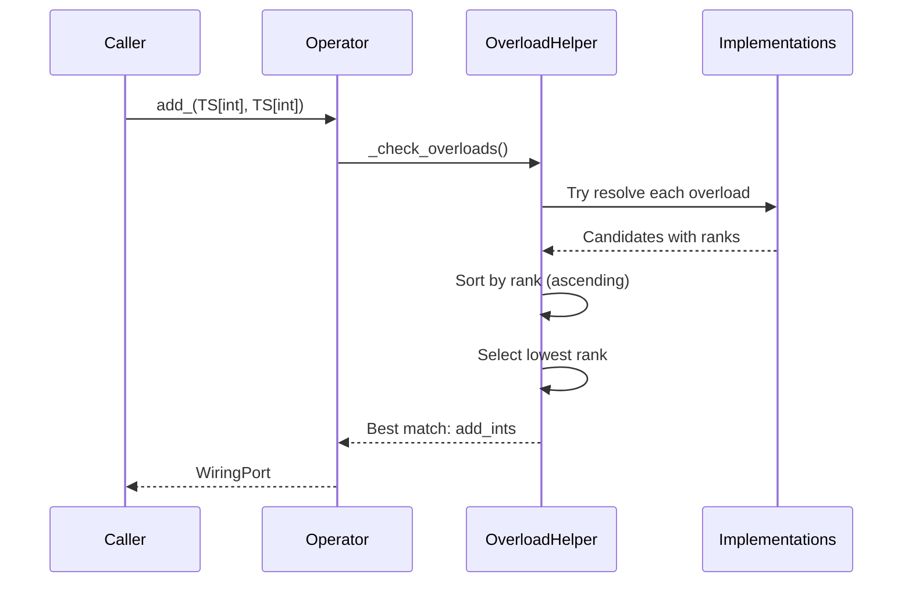
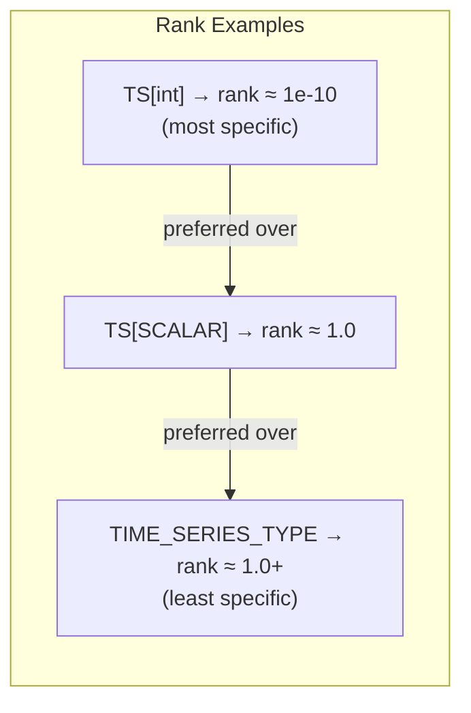
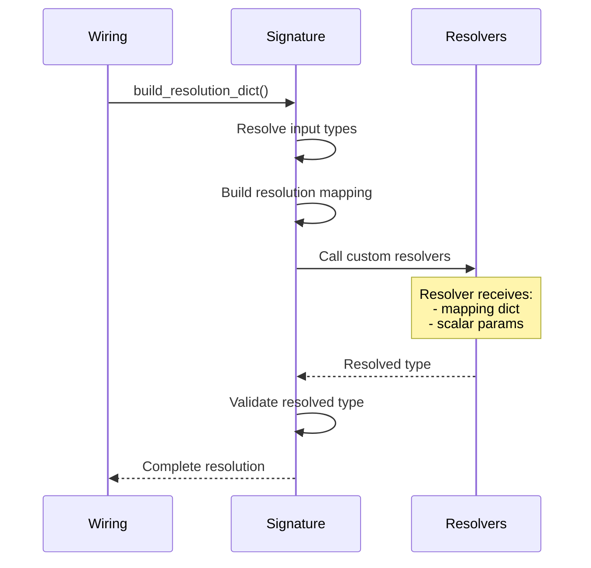
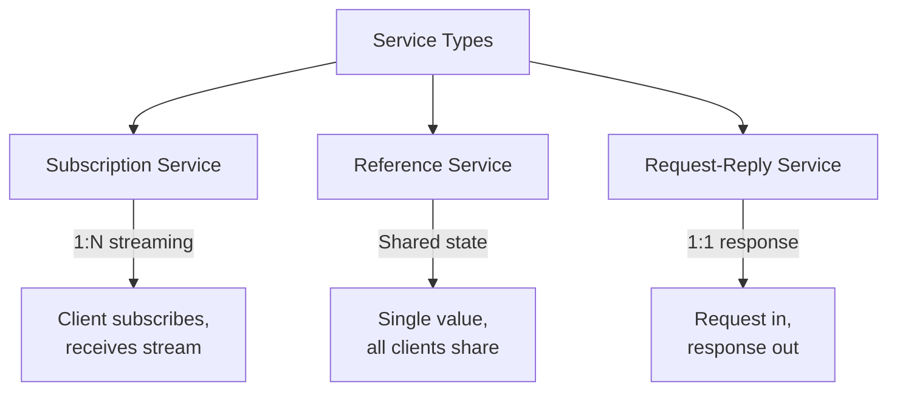
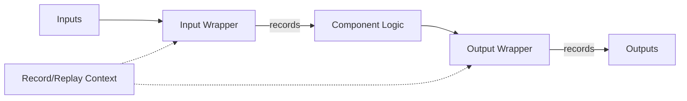

# Part VIII: Advanced Concepts

**Version:** 1.0 Draft
**Last Updated:** 2025-12-20

---

## 1. Introduction

This document covers advanced HGraph concepts including:

- Operator overloading and resolution
- Custom type resolvers
- Services (subscription, reference, request-reply)
- Adaptors (single-client and multi-client)
- Components
- Error handling



---

## 2. Operator Overloading

### 2.1 The @operator Decorator

The `@operator` decorator defines a polymorphic operation signature without implementation:

```python
@operator
def add_(lhs: TIME_SERIES_TYPE, rhs: TIME_SERIES_TYPE_1) -> DEFAULT[OUT]:
    """This represents the ``+`` operator for time series types."""
```

**Key Characteristics:**
- Creates an `OperatorWiringNodeClass` instance
- Function body is empty (`...` or `pass`)
- Defines generic type parameters that implementations can specialize
- Does NOT enforce exact signature matching (template-like behavior)

### 2.2 Registering Overloads

Implementations register via the `overloads` parameter:

```python
@compute_node(overloads=add_)
def add_ints(lhs: TS[int], rhs: TS[int]) -> TS[int]:
    return lhs.value + rhs.value

@compute_node(overloads=add_)
def add_floats(lhs: TS[float], rhs: TS[float]) -> TS[float]:
    return lhs.value + rhs.value

@compute_node(overloads=add_)
def add_generic(lhs: TS[SCALAR], rhs: TS[SCALAR]) -> TS[SCALAR]:
    return lhs.value + rhs.value  # Fallback for any scalar
```

### 2.3 Complete Working Example

```python
from hgraph import operator, compute_node, graph, TS, TIME_SERIES_TYPE, SIZE, TSL

# Step 1: Define the operator signature
@operator
def add(lhs: TIME_SERIES_TYPE, rhs: TIME_SERIES_TYPE) -> TIME_SERIES_TYPE:
    """Generic addition operator."""
    ...

# Step 2: Register type-specific overloads
@compute_node(overloads=add)
def add_default(lhs: TIME_SERIES_TYPE, rhs: TIME_SERIES_TYPE) -> TIME_SERIES_TYPE:
    """Fallback implementation for any type."""
    return lhs.value + rhs.value

@compute_node(overloads=add)
def add_ints(lhs: TS[int], rhs: TS[int]) -> TS[int]:
    """Specialized for integers - adds extra 1."""
    return lhs.value + rhs.value + 1

@compute_node(overloads=add)
def add_strs(lhs: TS[str], rhs: TS[str]) -> TS[str]:
    """Specialized for strings - adds suffix."""
    return lhs.value + rhs.value + "~"

@graph(overloads=add)
def add_tsls(lhs: TSL[TIME_SERIES_TYPE, SIZE], rhs: TSL[TIME_SERIES_TYPE, SIZE]) -> TSL[TIME_SERIES_TYPE, SIZE]:
    """Specialized for time-series lists."""
    return TSL.from_ts(*[a + b for a, b in zip(lhs, rhs)])

# Step 3: Use the operator - correct overload selected automatically
@graph
def test_add(lhs: TIME_SERIES_TYPE, rhs: TIME_SERIES_TYPE) -> TIME_SERIES_TYPE:
    return add(lhs, rhs)

# Results:
# add(TS[int](1), TS[int](2))     -> 4    (uses add_ints: 1+2+1)
# add(TS[float](1.0), TS[float](2.0)) -> 3.0  (uses add_default)
# add(TS[str]("a"), TS[str]("b")) -> "ab~" (uses add_strs)
```

### 2.4 Overload Resolution



**Resolution Algorithm:**

1. **Collect Candidates:** Try to resolve each overload's signature against provided arguments
2. **Calculate Ranks:** Each candidate receives a rank based on type specificity
3. **Select Best:** Choose the candidate with the lowest rank (most specific)

| Outcome | Action |
|---------|--------|
| One clear winner | Use that overload |
| Multiple same rank | Raise ambiguity error |
| No candidates | Raise "no overload found" error |

### 2.5 Generic Rank System

The rank quantifies type specificity. Lower rank = more specific = preferred.



**Rank Calculation:**

```python
def _calc_rank(signature: WiringNodeSignature) -> float:
    if signature.node_type == WiringNodeType.OPERATOR:
        return 1e6  # Operators themselves have lowest priority

    ranks = []
    for k, t in signature.input_types.items():
        if signature.defaults.get(k) != AUTO_RESOLVE:
            if t.is_scalar:
                rank = scale_rank(t.generic_rank, 0.001)  # Scalars scaled down
            elif k in (signature.var_arg, signature.var_kwarg):
                rank = scale_rank(t.generic_rank, 100.0)  # Var args scaled up
            else:
                rank = t.generic_rank  # Time-series get full rank
            ranks.append(rank)

    return sum(combine_ranks(ranks).values())
```

**Type Rank Values:**

| Type | Rank | Notes |
|------|------|-------|
| Concrete (`int`, `str`) | ~1e-10 | Very specific |
| TypeVar (`SCALAR`) | ~1.0 | Generic |
| `TIME_SERIES_TYPE` | ~1.0 | Generic |
| Nested generics | Scaled | Combines inner ranks |

### 2.6 Real-World Example: Number Operators

From `hgraph/_impl/_operators/_number_operators.py`:

```python
from hgraph import add_, sub_, mul_, div_, compute_node, TS, NUMBER, NUMBER_2
from hgraph._operators._operators import DivideByZero

@compute_node(overloads=add_)
def add_float_to_int(lhs: TS[int], rhs: TS[float]) -> TS[float]:
    """Adds a timeseries of float to a timeseries of int."""
    return lhs.value + rhs.value

@compute_node(overloads=add_)
def add_int_to_float(lhs: TS[float], rhs: TS[int]) -> TS[float]:
    """Adds a timeseries of int to a timeseries of float."""
    return lhs.value + rhs.value

@compute_node(overloads=div_)
def div_numbers(
    lhs: TS[NUMBER],
    rhs: TS[NUMBER_2],
    divide_by_zero: DivideByZero = DivideByZero.ERROR
) -> TS[float]:
    """Divides numeric timeseries with configurable zero handling."""
    try:
        return lhs.value / rhs.value
    except ZeroDivisionError:
        match divide_by_zero:
            case DivideByZero.NAN:
                return float("NaN")
            case DivideByZero.INF:
                return float("inf")
            case DivideByZero.NONE:
                return None  # No output
            case DivideByZero.ZERO:
                return 0.0
            case _:
                raise
```

### 2.7 Python Operator Mapping

Operators are mapped to Python special methods:

```python
WiringPort.__add__ = lambda x, y: add_(x, y)
WiringPort.__sub__ = lambda x, y: sub_(x, y)
WiringPort.__mul__ = lambda x, y: mul_(x, y)
# ... etc
```

### 2.8 Import Requirements

Overloads must be imported before use. The typical pattern:

```python
# In package __init__.py
from my_package._impl._operators import (
    add_ints,
    add_floats,
    add_strings,
    # ... all overloads
)
```

---

## 3. Custom Resolvers

### 3.1 AUTO_RESOLVE Sentinel

`AUTO_RESOLVE` marks parameters that should be automatically resolved from input types:

```python
AUTO_RESOLVE = object()  # Sentinel value

@compute_node
def my_node(ts: TS[SCALAR], _tp: type[SCALAR] = AUTO_RESOLVE) -> TS[SCALAR]:
    # _tp will be automatically resolved to the actual SCALAR type
    return ts.value
```

**Usage Pattern:**
- Used as default value for type parameters
- Wiring system resolves actual type from TypeVar resolution
- Common for extracting types from resolved inputs

### 3.2 Custom Resolver Functions

The `resolvers` parameter provides custom type resolution logic:

```python
@compute_node(
    resolvers={SCALAR: lambda mapping, attr: mapping[COMPOUND_SCALAR].meta_data_schema[attr].py_type}
)
def getattr_cs(ts: TS[COMPOUND_SCALAR], attr: str, default: TS[SCALAR] = None) -> TS[SCALAR]:
    return getattr(ts.value, attr, default.value)
```

### 3.3 Resolver Function Signatures

**Style 1: Single Parameter (Mapping Only)**
```python
lambda mapping: resolved_type
```
Resolver receives only the resolution mapping dictionary.

**Style 2: Multiple Parameters (Mapping + Scalars)**
```python
lambda mapping, param1, param2: resolved_type
```
Resolver receives mapping plus named scalar parameters from the function.

### 3.4 Resolution Process



### 3.5 Resolver Examples

**Example 1: Attribute Type Resolution**

From `hgraph/_impl/_operators/_getattr.py`:

```python
@compute_node(
    overloads=getattr_,
    resolvers={SCALAR: lambda mapping, attr: mapping[COMPOUND_SCALAR].meta_data_schema[attr].py_type},
)
def getattr_cs(ts: TS[COMPOUND_SCALAR], attr: str, default_value: TS[SCALAR] = None) -> TS[SCALAR]:
    """Get attribute from compound scalar, resolving output type from schema."""
    attr_value = getattr(ts.value, attr, default_value.value)
    return default_value.value if attr_value is None else attr_value

@compute_node(
    overloads=setattr_,
    resolvers={SCALAR: lambda mapping, attr: mapping[COMPOUND_SCALAR].meta_data_schema[attr].py_type},
)
def setattr_cs(ts: TS[COMPOUND_SCALAR], attr: str, value: TS[SCALAR]) -> TS[COMPOUND_SCALAR]:
    """Set attribute on compound scalar."""
    v = copy(ts.value)
    setattr(v, attr, value.value)
    return v
```

**Example 2: Tuple Element Type Resolution**

From `hgraph/_impl/_operators/_tuple_operators.py`:

```python
def _item_type(tuple_tp: Type[TUPLE], index: int) -> Type:
    """Resolve the type of a tuple element at given index."""
    if isinstance(tuple_tp, HgTupleFixedScalarType):
        return tuple_tp.element_types[index]
    elif isinstance(tuple_tp, HgTupleCollectionScalarType):
        return tuple_tp.element_type
    raise IncorrectTypeBinding(TUPLE, tuple_tp)

@compute_node(
    overloads=getitem_,
    resolvers={SCALAR: lambda mapping, key: _item_type(mapping[TUPLE], key)}
)
def getitem_tuple_fixed(ts: TS[TUPLE], key: int) -> TS[SCALAR]:
    """Get element from tuple at index, with type resolution."""
    return ts.value[key]
```

**Example 3: DataFrame Schema Resolution**

From `hgraph/_impl/_operators/_data_frame_operators.py`:

```python
def _cs_from_frame(mapping, df: pl.DataFrame) -> COMPOUND_SCALAR:
    """Create compound scalar type from DataFrame schema."""
    schema = df.schema
    return compound_scalar(**{k: _convert_type(v) for k, v in schema.items()})

def _extract_scalar(mapping, df, value_col) -> SCALAR:
    """Extract scalar type from DataFrame column."""
    schema = df.schema
    return _convert_type(schema[value_col])

@generator(
    overloads=from_data_frame,
    resolvers={SCALAR: _extract_scalar, COMPOUND_SCALAR: _cs_from_frame},
)
def from_data_frame_ts(
    df: Frame[COMPOUND_SCALAR],
    dt_col: str = "date",
    value_col: str = "value",
    _df_tp: type[COMPOUND_SCALAR] = AUTO_RESOLVE,
) -> TS[SCALAR]:
    """Generate time-series from DataFrame column."""
    # ... implementation
```

**Example 4: Function Return Type Resolution**

```python
@compute_node(
    valid=("fn",),
    resolvers={TIME_SERIES_TYPE: lambda m, fn: TS[fn.__annotations__["return"]]}
)
def apply(fn: TS[Callable], *args: TSB[TS_SCHEMA]) -> DEFAULT[TIME_SERIES_TYPE]:
    """Apply callable, resolving output type from function annotation."""
    fn_ = fn.value
    return fn_(*args)
```

### 3.6 Unit Test Example

```python
def test_func_resolve():
    def x(x) -> str:
        return str(x)

    @compute_node(
        resolvers={SCALAR_1: lambda mapping, f: f.__annotations__["return"]}
    )
    def call(ts: TS[SCALAR], f: type(x)) -> TS[SCALAR_1]:
        return f(ts.value)

    assert eval_node(call[SCALAR:int], [1, 2], f=x) == ["1", "2"]
```

---

## 4. Services

Services enable request-reply and publish-subscribe patterns within HGraph.

### 4.1 Service Types Overview



### 4.2 Subscription Service

A streaming service where clients subscribe with keys and receive ongoing updates.

**Definition:**
```python
@subscription_service
def my_subs_service(path: str, subscription: TS[str]) -> TS[str]:
    """The service description."""
```

**Implementation:**
```python
@service_impl(interfaces=my_subs_service)
def my_subs_service_impl(subscription: TSS[str]) -> TSD[str, TS[str]]:
    """Implementation receives set of subscriptions, returns dict of results."""
    return map_(pass_through_node, __keys__=subscription, __key_arg__="ts")
```

**Complete Working Example:**

```python
from hgraph import (
    subscription_service, service_impl, graph, register_service,
    default_path, TS, TSS, TSD, TSL, SIZE, map_, pass_through
)

@subscription_service
def my_subs_service(path: str, subscription: TS[str]) -> TS[str]:
    """Subscribe to receive string updates."""

@graph
def subscription_instance(key: TS[str]) -> TS[str]:
    return key

@service_impl(interfaces=my_subs_service)
def my_subs_service_impl(subscription: TSS[str]) -> TSD[str, TS[str]]:
    return map_(pass_through_node, __keys__=subscription, __key_arg__="ts")

@graph
def main(sub1: TS[str], sub2: TS[str], sub3: TS[str]) -> TSL[TS[str], SIZE]:
    register_service(default_path, my_subs_service_impl)
    return TSL.from_ts(
        pass_through_node(my_subs_service(default_path, sub1)),
        pass_through_node(my_subs_service(default_path, sub2)),
        pass_through_node(my_subs_service(default_path, sub3)),
    )

# Usage:
# eval_node(main, ["topic1", None, None], ["topic2", None, None], [None, None, "topic1"])
# Result: [None, {0: "topic1", 1: "topic2"}, {2: "topic1"}]
```

**Characteristics:**
- Input: Individual `TS[T]` per client
- Implementation receives: `TSS[T]` (set of subscriptions)
- Implementation returns: `TSD[T, TS[Result]]` (keyed results)

### 4.3 Reference Service

A service producing a single shared value independent of requesters.

**Definition:**
```python
@reference_service
def my_service(path: str = None) -> TSD[str, TS[str]]:
    """The service description."""
```

**Implementation:**
```python
@service_impl(interfaces=my_service)
def my_service_impl() -> TSD[str, TS[str]]:
    return const(frozendict({"test": "a value"}), TSD[str, TS[str]])
```

**Complete Working Example:**

```python
from hgraph import (
    reference_service, service_impl, graph, register_service,
    default_path, TS, TSD, const, frozendict
)

@reference_service
def config_service(path: str = None) -> TSD[str, TS[str]]:
    """Get shared configuration."""

@service_impl(interfaces=config_service)
def config_service_impl() -> TSD[str, TS[str]]:
    return const(frozendict({"api_key": "secret", "endpoint": "https://api.example.com"}))

@graph
def main() -> TS[str]:
    register_service(default_path, config_service_impl)
    config = config_service()
    return config["api_key"]

# Usage: eval_node(main) == ["secret"]
```

**Characteristics:**
- Single output shared by all clients
- Output type automatically wrapped as `REF[TIME_SERIES_TYPE]`
- Auto-binds to `ref_svc://<module>.<name>` if no path provided

### 4.4 Request-Reply Service

A synchronous request-response pattern with timeout handling.

**Definition:**
```python
@request_reply_service
def add_one_service(path: str, ts: TS[int]) -> TS[int]:
    """The service description."""
```

**Implementation:**
```python
@service_impl(interfaces=add_one_service)
def add_one_service_impl(ts: TSD[int, TS[int]]) -> TSD[int, TS[int]]:
    return map_(lambda x: x + 1, ts)
```

**Complete Working Example:**

```python
from hgraph import (
    request_reply_service, service_impl, graph, register_service,
    default_path, TS, TSD, map_
)

@request_reply_service
def add_service(path: str, ts: TS[int], ts1: TS[int]) -> TS[int]:
    """Add two numbers via service."""

@service_impl(interfaces=add_service)
def add_service_impl(ts: TSD[int, TS[int]], ts1: TSD[int, TS[int]]) -> TSD[int, TS[int]]:
    return map_(lambda x, y: x + y, ts, ts1)

@graph
def main(x: TS[int], y: TS[int]) -> TS[int]:
    register_service(default_path, add_service_impl)
    return add_service(default_path, x, y)

# Usage: eval_node(main, [1], [2]) == [None, None, 3]
# Note: Two None ticks for service setup latency
```

**Response Type:**
```python
TSB[ReqRepResponse[TIME_SERIES_TYPE_1]]
# Contains:
#   result: TIME_SERIES_TYPE_1
#   time_out: TS[bool]
#   error: TS[str]
```

### 4.5 Multi-Service Implementation

A single implementation can serve multiple service interfaces:

```python
from hgraph import (
    request_reply_service, reference_service, subscription_service,
    service_impl, get_service_inputs, set_service_output
)

@request_reply_service
def submit(path: str, ts: TS[int]): ...

@reference_service
def receive(path: str) -> TSS[int]: ...

@subscription_service
def subscribe(path: str, ts: TS[int]) -> TS[bool]: ...

@service_impl(interfaces=(submit, receive, subscribe))
def impl(path: str):
    """Single implementation handles all three service interfaces."""
    submissions: TSD[int, TS[int]] = get_service_inputs(path, submit).ts
    items = flip(submissions).key_set
    set_service_output(path, receive, items)
    set_service_output(
        path,
        subscribe,
        map_(
            lambda key, i: contains_(i, key),
            __keys__=subscribe.wire_impl_inputs_stub(path).ts,
            i=pass_through_node(items),
        ),
    )
```

**Helper Functions:**

| Function | Purpose |
|----------|---------|
| `get_service_inputs(path, service)` | Retrieve the combined inputs for a service interface (returns struct with input fields) |
| `set_service_output(path, service, output)` | Set the output for a service interface to broadcast to clients |

### 4.6 Service Registration

```python
from hgraph import register_service, default_path

# Register implementation for a path
register_service("my_path", my_impl, resolution_dict={...})

# Use default path
register_service(default_path, my_impl)
```

**Path Format:** `<service_type>://<path>/<function_name>`

---

## 5. Adaptors

Adaptors provide bidirectional connectivity between HGraph and external systems.

### 5.1 Single-Client Adaptor

For point-to-point external communication.

**Interface Definition:**
```python
@adaptor
def my_adaptor(path: str, ts: TS[int]) -> TS[int]:
    """Send data out, receive data in."""
```

**Implementation:**
```python
@adaptor_impl(interfaces=my_adaptor)
def my_adaptor_impl(path: str, ts: TS[int]) -> TS[int]:
    queue_sink(path, ts)      # Send to external
    return queue_source(path)  # Receive from external
```

**Complete Working Example:**

```python
from hgraph import (
    adaptor, adaptor_impl, graph, register_adaptor,
    TS, queue_sink, queue_source, count, schedule,
    stop_on_value, evaluate_graph, GraphConfiguration, EvaluationMode
)
from datetime import timedelta

@adaptor
def my_adaptor(path: str, ts: TS[int]) -> TS[int]:
    """Echo adaptor - sends and receives integers."""

@adaptor_impl(interfaces=my_adaptor)
def my_adaptor_impl(path: str, ts: TS[int]) -> TS[int]:
    queue_sink(path, ts)
    return queue_source(path)

@graph
def g() -> TS[int]:
    register_adaptor("test_adaptor", my_adaptor_impl)
    result = my_adaptor(
        "test_adaptor",
        count(schedule(timedelta(milliseconds=10), max_ticks=10))
    )
    stop_on_value(result, 10)
    return result

# Execute in real-time mode
result = evaluate_graph(
    g,
    GraphConfiguration(
        run_mode=EvaluationMode.REAL_TIME,
        end_time=timedelta(milliseconds=1000)
    )
)
# result: [(t1, 1), (t2, 2), ..., (t10, 10)]
```

**With Parameters:**

```python
@adaptor
def my_adaptor(path: str, b: bool, ts: TS[int]) -> TS[int]: ...

@adaptor_impl(interfaces=my_adaptor)
def my_adaptor_impl(path: str, b: bool, ts: TS[int]) -> TS[int]:
    path = f"{path}_{b}"  # Use parameter to customize path
    queue_sink(path, ts if b else ts + 1)
    return queue_source(path)
```

### 5.2 Multi-Client Service Adaptor

For multiple concurrent client connections.

**Interface Definition:**
```python
@service_adaptor
def my_adaptor(path: str, ts: TS[int]) -> TS[int]:
    """Handle multiple client requests."""
```

**Implementation:**
```python
@service_adaptor_impl(interfaces=my_adaptor)
def my_adaptor_impl(path: str, ts: TSD[int, TS[int]]) -> TSD[int, TS[int]]:
    """Implementation receives multiplexed by ClientId."""
    tsd_queue_sink(path, ts)
    return tsd_queue_source(path)
```

**Complete Working Example:**

```python
from hgraph import (
    service_adaptor, service_adaptor_impl, graph, register_adaptor,
    TS, TSD, TSL, Size, tsd_queue_sink, tsd_queue_source, map_,
    count, schedule, combine, stop_on_tsl_values, evaluate_graph
)
from datetime import timedelta

@service_adaptor
def my_adaptor(path: str, ts: TS[int]) -> TS[int]: ...

@service_adaptor_impl(interfaces=my_adaptor)
def my_adaptor_impl(path: str, b: bool, ts: TSD[int, TS[int]]) -> TSD[int, TS[int]]:
    path = f"{path}_{b}"
    tsd_queue_sink(path, ts if b else map_(lambda x: x + 1, ts))
    return tsd_queue_source(path)

@graph
def g() -> TSL[TS[int], Size[2]]:
    register_adaptor(None, my_adaptor_impl, b=False)
    a1 = my_adaptor("test", ts=count(schedule(timedelta(milliseconds=10), max_ticks=10)))
    a2 = my_adaptor("test", ts=count(schedule(timedelta(milliseconds=11), max_ticks=10)))
    result = combine(a1, a2)
    stop_on_tsl_values(result, 11, 11)
    return result
```

**Characteristics:**
- Each client gets unique integer `ClientId`
- Requests combined as `TSD[ClientId, Request]`
- Responses multiplexed as `TSD[ClientId, Response]`

**Sink-Only Adaptor:**

```python
@service_adaptor
def my_adaptor(path: str, ts: TS[int]):
    """Sink-only - no return value."""

@service_adaptor_impl(interfaces=my_adaptor)
def my_adaptor_impl(path: str, ts: TSD[int, TS[int]]):
    log_(f"{path}: {{}}", ts)
```

---

## 6. Components

Components are reusable graph building blocks with record/replay support.

### 6.1 Definition

```python
@component
def my_component(ts: TS[float], key: str) -> TS[float]:
    """A reusable computation component."""
    return ts + 1.0

# Usage:
# eval_node(my_component, ts=[1.0, 2.0, 3.0], key="key_1") == [2.0, 3.0, 4.0]
```

### 6.2 With Dynamic Recordable ID

```python
@component(recordable_id="Test_{key}")
def my_component(ts: TS[float], key: TS[str]) -> TS[float]:
    """Component with dynamic recordable ID based on key parameter."""
    return ts + 1.0

# The recordable_id supports format strings from time-series string (TS[str]) parameters
```

### 6.3 Complete Record/Replay Example

```python
from hgraph import (
    component, graph, TS, TSD, map_, add_,
    RecordReplayContext, RecordReplayEnum, set_record_replay_model,
    IN_MEMORY, GlobalState, frozendict as fd
)

@component
def my_component(a: TSD[str, TS[float]], b: TSD[str, TS[float]]) -> TSD[str, TS[float]]:
    """Component that adds two TSDs element-wise."""
    return map_(add_[TS[float]], a, b)

def test_record_replay():
    with GlobalState() as gs:
        set_record_replay_model(IN_MEMORY)

        # Record execution
        with RecordReplayContext(mode=RecordReplayEnum.RECORD):
            result = eval_node(
                my_component,
                a=[fd(a=1.0, b=2.0), fd(a=2.0)],
                b=[fd(a=3.0, b=2.0), fd(b=1.0)]
            )
            assert result == [fd(a=4.0, b=4.0), fd(a=5.0, b=3.0)]

        # Replay recorded data
        with RecordReplayContext(mode=RecordReplayEnum.REPLAY):
            result = eval_node(my_component, a=[], b=[])
            assert result == [fd(a=4.0, b=4.0), fd(a=5.0, b=3.0)]
```

### 6.4 Characteristics

| Property | Description |
|----------|-------------|
| Inputs | Must have time-series inputs (required) |
| Output | Must have time-series output (required) |
| Record/Replay | Automatic wrapper for input/output recording |
| References | Inputs/outputs converted to reference form |
| Nesting | `has_nested_graphs = True` |

### 6.5 Record/Replay Integration



---

## 7. Error Handling

### 7.1 try_except Pattern

Wraps graphs with exception catching:

```python
from hgraph import try_except, TSB, TryExceptResult

result = try_except(risky_node, input_ts, __trace_back_depth__=2)
# result: TSB[TryExceptResult[output_type]]
```

### 7.2 Complete Working Examples

**Basic try_except:**

```python
from hgraph import graph, TS, TSB, TryExceptResult, try_except, div_

@graph
def main(lhs: TS[float], rhs: TS[float]) -> TSB[TryExceptResult[TS[float]]]:
    return try_except(div_[TS[float]], lhs, rhs)

result = eval_node(main, [1.0, 2.0, 3.0], [1.0, 2.0, 0.0])
# result[0] == {"out": 1.0}
# result[1] == {"out": 1.0}
# result[2].keys() == {"exception"}  # Division by zero caught
```

**try_except with Graph:**

```python
@graph
def error_prone(lhs: TS[float], rhs: TS[float]) -> TS[float]:
    return lhs / rhs

@graph
def main(lhs: TS[float], rhs: TS[float]) -> TSB[TryExceptResult[TS[float]]]:
    return try_except(error_prone, lhs, rhs)

result = eval_node(main, [1.0, 2.0], [2.0, 0.0])
# result[0]["out"] == 0.5
# result[1]["exception"] is not None
```

**try_except with Map (Multi-client errors):**

```python
from hgraph import TryExceptTsdMapResult, REF

schema = ts_schema(out=TSD[int, REF[TS[float]]], error=TSD[int, TS[NodeError]])

@graph
def main(lhs: TSD[int, TS[float]], rhs: TSD[int, TS[float]]) -> TSB[TryExceptTsdMapResult[int, TSD[int, TS[float]]]]:
    return try_except(map_, div_[TS[float]], lhs, rhs)

result = eval_node(main, [{0: 1.0}, {1: 2.0}, {2: 3.0}], [{0: 1.0}, {1: 2.0}, {2: 0.0}])
# result[0] == {"out": frozendict({0: 1.0})}
# result[1] == {"out": frozendict({1: 1.0})}
# result[2] contains "exception" for key 2
```

**try_except with Sink Nodes:**

```python
from hgraph import sink_node, NodeError

@sink_node
def risky_sink(ts: TS[float]):
    if ts.value == 2.0:
        raise RuntimeError("Test error")

@graph
def main(ts: TS[float]) -> TS[NodeError]:
    return try_except(risky_sink, ts)

result = eval_node(main, [1.0, 2.0])
# result[0] is None  # No error
# result[1].error_msg.endswith("Test error")  # Error captured
```

### 7.3 exception_time_series

Lightweight error extraction for single nodes:

```python
from hgraph import exception_time_series, ts_schema, NodeError

schema = ts_schema(out=TS[float], error=TS[NodeError])

@graph
def main(lhs: TS[float], rhs: TS[float]) -> TSB[schema]:
    out = lhs / rhs
    return TSB[schema].from_ts(out=out, error=exception_time_series(out))

result = eval_node(main, [1.0, 2.0, 3.0], [1.0, 2.0, 0.0])
# result[0:2] == [{"out": 1.0}, {"out": 1.0}]
# result[2].keys() == {"error"}
```

### 7.4 Parameters

| Parameter | Description |
|-----------|-------------|
| `__trace_back_depth__` | Stack frames to capture (default: 1) |
| `__capture_values__` | Capture input values in traceback (default: False) |

### 7.5 Exception Output by Node Type

| Node Type | Exception Output |
|-----------|------------------|
| compute_node | `TSB[TryExceptResult[output_type]]` |
| sink_node | `TS[NodeError]` |
| TSD map | `TSB[TryExceptTsdMapResult]` |

### 7.6 NodeError Type

```python
class NodeError:
    """Contains exception information from node evaluation."""
    exception_type: type
    message: str
    traceback: str
    input_values: dict | None  # If __capture_values__=True
```

---

## 8. Reference Locations

| Concept | Python Location |
|---------|-----------------|
| @operator | `hgraph/_wiring/_decorators.py` |
| OperatorWiringNodeClass | `hgraph/_wiring/_wiring_node_class/_operator_wiring_node.py` |
| Generic Rank | `hgraph/_types/_generic_rank_util.py` |
| AUTO_RESOLVE | `hgraph/_types/_type_meta_data.py` |
| Custom Resolvers | `hgraph/_wiring/_wiring_node_signature.py` |
| @subscription_service | `hgraph/_wiring/_decorators.py` |
| @reference_service | `hgraph/_wiring/_decorators.py` |
| @request_reply_service | `hgraph/_wiring/_decorators.py` |
| @service_impl | `hgraph/_wiring/_decorators.py` |
| @adaptor | `hgraph/_wiring/_decorators.py` |
| @service_adaptor | `hgraph/_wiring/_decorators.py` |
| @component | `hgraph/_wiring/_wiring_node_class/_component_node_class.py` |
| try_except | `hgraph/_wiring/_exception_handling.py` |
| NodeError | `hgraph/_types/_error_type.py` |

---

## 9. Next Steps

Continue to:
- [09_CONTROL_FLOW.md](09_CONTROL_FLOW.md) - Control flow constructs
- [10_DATA_SOURCES.md](10_DATA_SOURCES.md) - Data source patterns

