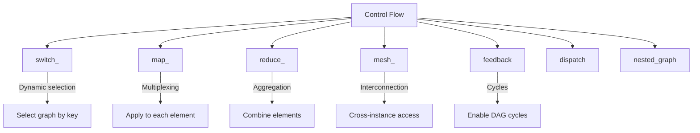
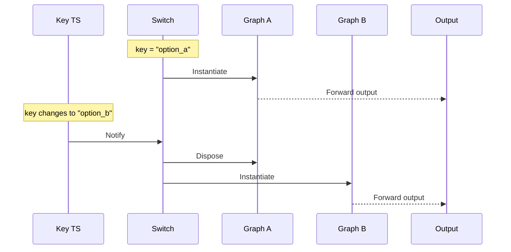
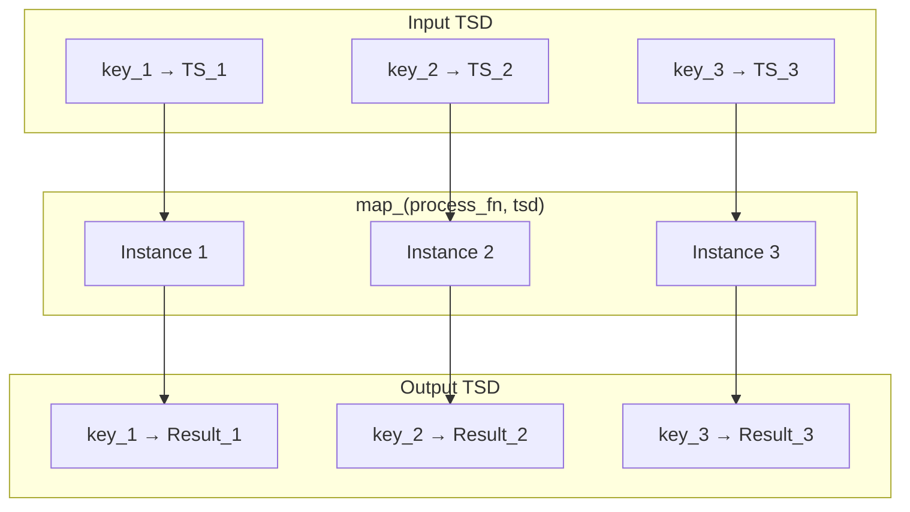
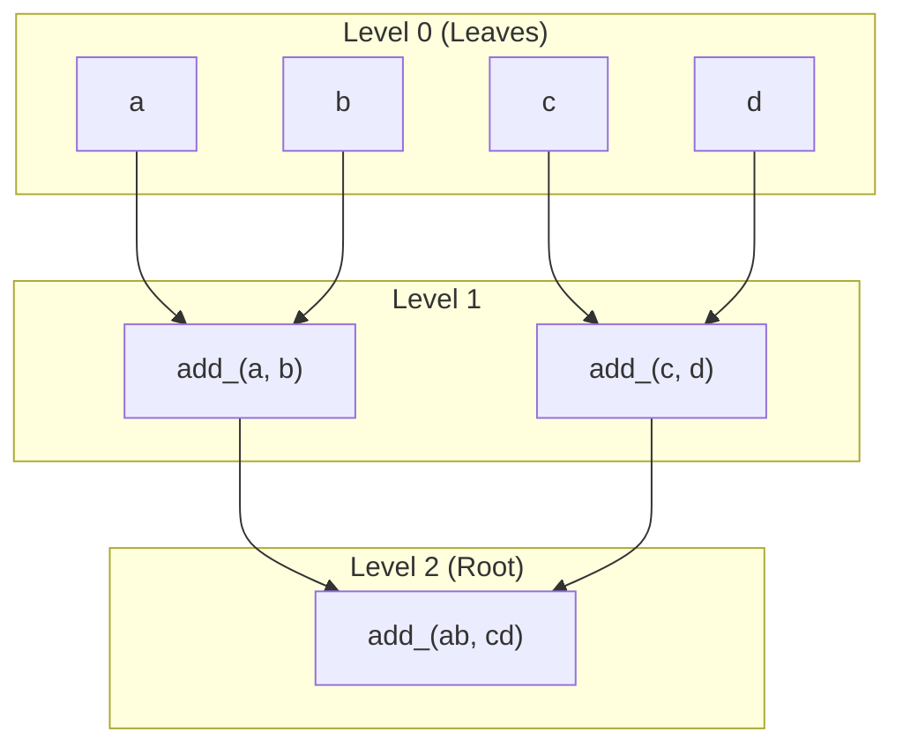
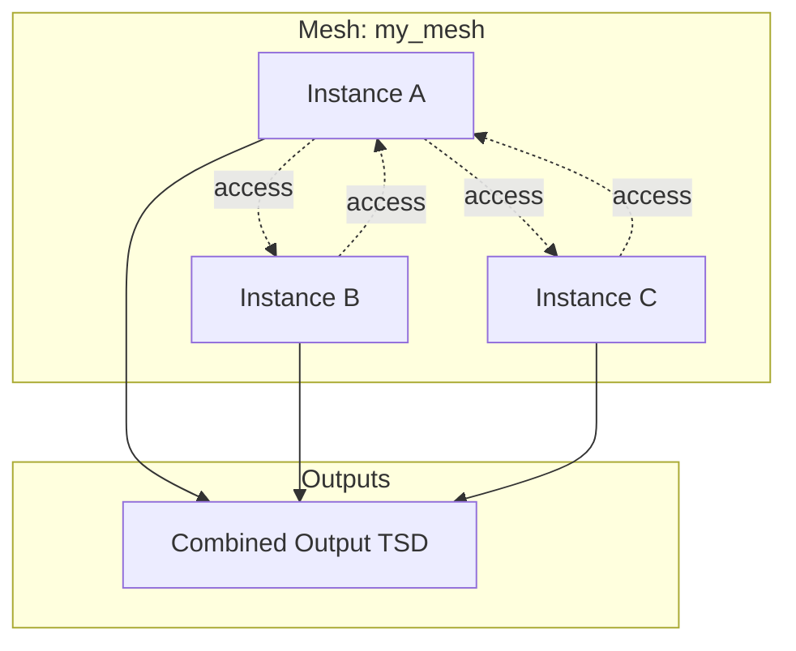
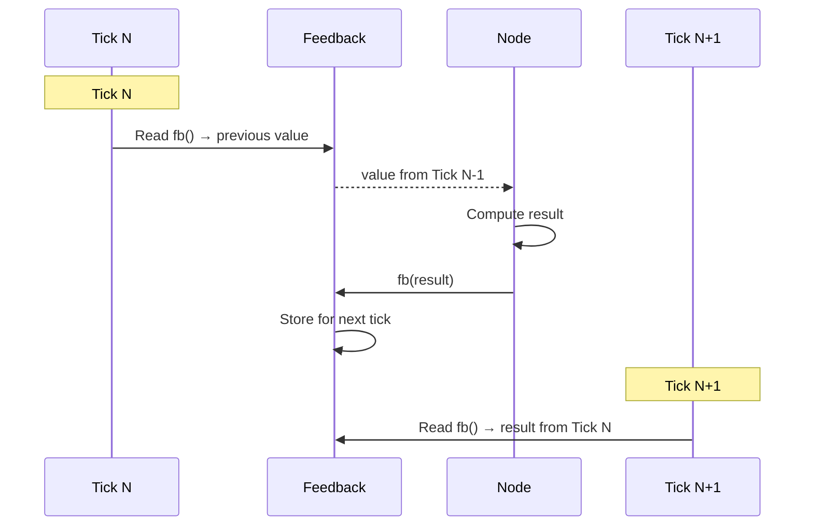

# Part IX: Control Flow

**Version:** 1.0 Draft
**Last Updated:** 2025-12-20

---

## 1. Introduction

HGraph provides several control flow constructs for dynamic graph composition and data routing:



---

## 2. switch_ (Dynamic Graph Selection)

### 2.1 Overview

`switch_` dynamically selects and instantiates graphs based on a key value:

```python
result = switch_(
    key,                    # TS[SCALAR] - selection key
    {
        "option_a": graph_a,
        "option_b": graph_b,
        DEFAULT: fallback_graph,
    },
    *args, **kwargs
)
```

### 2.2 Execution Model



### 2.3 Complete Working Examples

**Basic switch_ with named graphs:**

```python
from hgraph import graph, TS, switch_

@graph
def _add(lhs: TS[int], rhs: TS[int]) -> TS[int]:
    return lhs + rhs

@graph
def _sub(lhs: TS[int], rhs: TS[int]) -> TS[int]:
    return lhs - rhs

@graph
def switch_test(key: TS[str], lhs: TS[int], rhs: TS[int]) -> TS[int]:
    return switch_(key, {"add": _add, "sub": _sub}, lhs, rhs)

# Usage:
# eval_node(switch_test, ["add", "sub"], [1, 2], [3, 4])
# Result: [4, -2]  # First tick: 1+3=4, Second tick: 2-4=-2
```

**With scalar arguments:**

```python
from hgraph import graph, TS, SCALAR, const, switch_

@graph
def graph_1(value: SCALAR) -> TS[SCALAR]:
    return const(f"{value}_1")

@graph
def graph_2(value: SCALAR) -> TS[SCALAR]:
    return const(f"{value}_2")

@graph
def switch_test(key: TS[str], value: SCALAR) -> TS[SCALAR]:
    return switch_(key, {"one": graph_1, "two": graph_2}, value)

# Usage:
# eval_node(switch_test, ["one", "two"], "test")
# Result: ["test_1", "test_2"]
```

**With DEFAULT case:**

```python
from hgraph import graph, TS, switch_, DEFAULT, const

@graph
def switch_test(key: TS[str]) -> TS[str]:
    return switch_(
        key,
        {
            "known": lambda: const("known value"),
            DEFAULT: lambda: const("default value"),  # Catches all other keys
        }
    )

# Usage:
# eval_node(switch_test, ["known", "unknown", "other"])
# Result: ["known value", "default value", "default value"]
```

**Key as first argument to selected graph:**

```python
from hgraph import graph, TS, switch_, format_

@graph
def handler(key: TS[str], data: TS[int]) -> TS[str]:
    """Graph receives key as first argument."""
    return format_("{}: {}", key, data)

@graph
def switch_test(key: TS[str], data: TS[int]) -> TS[str]:
    return switch_(key, {"a": handler, "b": handler}, data)

# Usage:
# eval_node(switch_test, ["a", "b"], [1, 2])
# Result: ["a: 1", "b: 2"]
```

### 2.4 Parameters

| Parameter | Type | Description |
|-----------|------|-------------|
| `key` | `TS[SCALAR]` | Selection key (must be scalar time-series) |
| `cases` | `dict[SCALAR, Callable]` | Mapping of key values to graph functions |
| `reload_on_ticked` | `bool` | Reload graph when key ticks (default: False) |
| `*args, **kwargs` | any | Arguments passed to selected graph |

### 2.5 Key Characteristics

- Graphs are instantiated when key value matches
- Previous graph is disposed when key changes to different value
- First argument to graph can optionally be the key itself
- Uses `DEFAULT` marker for catch-all case
- Graphs maintain their own state between evaluations

---

## 3. map_ (Multiplexed Computation)

### 3.1 Overview

`map_` applies a graph/node to each element of a collection:

```python
# Apply to TSD
result = map_(process_fn, tsd_input)  # TSD[K, TS[V]] -> TSD[K, TS[W]]

# Apply to TSL
result = map_(process_fn, tsl_input)  # TSL[TS[V], Size] -> TSL[TS[W], Size]
```

### 3.2 Execution Model



### 3.3 Complete Working Examples

**Basic TSD map with key argument:**

```python
from hgraph import graph, TS, TSD, TSS, SCALAR, map_, add_, debug_print

@graph
def f_sum(key: TS[SCALAR], lhs: TS[int], rhs: TS[int]) -> TS[int]:
    """Graph receives key as first argument."""
    result = add_(lhs, rhs)
    debug_print("key", key)
    debug_print("sum", result)
    return result

@graph
def map_test(keys: TSS[str], ts1: TSD[str, TS[int]], ts2: TSD[str, TS[int]]) -> TSD[str, TS[int]]:
    return map_(f_sum, lhs=ts1, rhs=ts2)

# Usage:
# eval_node(map_test, [{"a", "b"}], [{"a": 1}, {"b": 2}], [{"a": 2}, {"b": 3}])
# Result: [{"a": 3}, {"b": 5}]
```

**Map with operators (no key arg):**

```python
from hgraph import graph, TS, TSD, TSS, map_
from hgraph._impl._operators._scalar_operators import add_scalars

@graph
def map_test(keys: TSS[str], ts1: TSD[str, TS[int]], ts2: TSD[str, TS[int]]) -> TSD[str, TS[int]]:
    return map_(add_scalars, ts1, ts2, __keys__=keys)
```

**Map with lambda functions:**

```python
from hgraph import graph, TS, TSD, map_

@graph
def map_with_key(tsd: TSD[int, TS[int]]) -> TSD[int, TS[int]]:
    """Lambda receives key as first argument."""
    return map_(lambda key, v: v + key, tsd)

@graph
def map_without_key(tsd: TSD[int, TS[int]]) -> TSD[int, TS[int]]:
    """Lambda without key argument."""
    return map_(lambda v: v + 1, tsd)
```

**Map with pass-through (broadcast) arguments:**

```python
from hgraph import graph, TS, TSD, map_, pass_through

@graph
def map_with_broadcast(tsd: TSD[int, TS[int]], multiplier: TS[int]) -> TSD[int, TS[int]]:
    """Multiplier is passed to all instances unchanged."""
    return map_(lambda v, m: v * m, tsd, pass_through(multiplier))

# Or without explicit pass_through for non-TSD inputs:
@graph
def map_simple_broadcast(tsd: TSD[int, TS[int]], offset: TS[int]) -> TSD[int, TS[int]]:
    return map_(lambda v, o: v + o, tsd, offset)
```

**TSL map (Time-Series List):**

```python
from hgraph import graph, TS, TSL, SIZE, map_

@graph
def process(value: TS[int]) -> TS[int]:
    return value * 2

@graph
def map_tsl(tsl: TSL[TS[int], SIZE]) -> TSL[TS[int], SIZE]:
    return map_(process, tsl)

# Usage with Size[3]:
# eval_node(map_tsl, [[1, 2, 3], [4, 5, 6]])
# Result: [[2, 4, 6], [8, 10, 12]]
```

### 3.4 Input Markers

| Marker | Purpose |
|--------|---------|
| `no_key(tsd)` | Exclude from key inference |
| `pass_through(tsd)` | Prevent demultiplexing, pass whole TSD |

```python
from hgraph import graph, TS, TSD, map_, pass_through, no_key

@graph
def map_with_markers(
    prices: TSD[str, TS[float]],
    config: TSD[str, TS[float]],
    reference: TSD[str, TS[float]]
) -> TSD[str, TS[float]]:
    return map_(
        calculate,
        prices,                    # Demultiplexed by key
        pass_through(config),      # Passed as-is to each instance
        no_key(reference),         # Excluded from key inference
    )
```

### 3.5 Explicit Key Control

```python
from hgraph import graph, TS, TSD, TSS, map_

@graph
def map_explicit_keys(
    data: TSD[str, TS[int]],
    explicit_keys: TSS[str]
) -> TSD[str, TS[int]]:
    return map_(
        process_fn,
        __keys__=explicit_keys,     # Explicit key set
        __key_arg__="symbol",       # Parameter name for key value
        data=data,
    )
```

### 3.6 Parameters

| Parameter | Type | Description |
|-----------|------|-------------|
| `func` | `Callable` | Graph/node to apply |
| `__keys__` | `TSS[SCALAR]` | Explicit key set (optional) |
| `__key_arg__` | `str` | Parameter name for key value |
| `__label__` | `str` | Label for debugging |

### 3.7 Key Characteristics

- Instances created automatically when keys added to TSD
- Instances disposed when keys removed from TSD
- Per-key state maintained independently
- First argument can be the key if function accepts it
- Non-TSD inputs are broadcast to all instances

---

## 4. reduce_ (Collection Aggregation)

### 4.1 Overview

`reduce_` aggregates collection elements into a single value:

```python
total = reduce_(add_, prices, zero=const(0.0))
```

### 4.2 Complete Working Examples

**Basic TSD reduce:**

```python
from hgraph import graph, TS, TSD, reduce, add_

@graph
def sum_all(tsd: TSD[str, TS[int]]) -> TS[int]:
    return reduce(add_, tsd, 0)

# Usage:
# Input: {"a": 1, "b": 4, "c": 7}
# Output: 12
```

**TSD reduce with dynamic key changes:**

```python
from hgraph import graph, TS, TSD, reduce, add_, REMOVE_IF_EXISTS

@graph
def dynamic_sum(tsd: TSD[str, TS[int]]) -> TS[int]:
    return reduce(add_, tsd)

# Usage:
# eval_node(dynamic_sum,
#     [{"a": 1, "b": 2, "c": 3}, {"b": REMOVE_IF_EXISTS}, {"a": REMOVE_IF_EXISTS}])
# Result: [6, 4, 3]  # Sum adjusts as keys are removed
```

**TSL reduce (Fixed-Size List):**

```python
from hgraph import graph, TS, TSL, SIZE, reduce, add_

@graph
def sum_list(tsl: TSL[TS[int], SIZE]) -> TS[int]:
    return reduce(add_, tsl, 0)

# Usage with Size[2]:
# eval_node(sum_list, [None, {0: 1}, None, {1: 2}])
# Result: [0, 1, None, 3]  # Tree reduction for associative operators
```

**Non-associative reduce (tuple concatenation):**

```python
from hgraph import graph, TS, reduce, format_

@graph
def concat_tuple(items: TS[tuple[int, ...]], zero: TS[str]) -> TS[str]:
    return reduce(
        lambda x, y: format_("{x}, {y}", x=x, y=y),
        items,
        zero,
        is_associative=False  # Must be linear for order-dependent operations
    )

# Usage:
# eval_node(concat_tuple, [(1, 2), (1,), ()], ["a"])
# Result: ["a, 1, 2", "a, 1", "a"]
```

**Nested reduce with map:**

```python
from hgraph import graph, TS, TSD, map_, reduce, default

@graph
def nested_sum(items: TSD[int, TSD[int, TS[int]]]) -> TSD[int, TS[int]]:
    """Reduce nested TSD to single TSD."""
    return items.reduce(
        lambda x, y: map_(
            lambda i, j: default(i, 0) + default(j, 0),
            x, y
        )
    )
```

### 4.3 Reduction Strategies

| Strategy | Constraint | Performance |
|----------|------------|-------------|
| **Associative** | `(a + b) + c = a + (b + c)` | Tree-reduce (fast on changes) |
| **Non-associative** | Order matters | Linear reduce (TSL only) |

### 4.4 Tree-Reduce Algorithm



**Benefit:** When one element changes, only O(log N) nodes re-evaluate.

### 4.5 Parameters

| Parameter | Type | Description |
|-----------|------|-------------|
| `func` | `Callable` | Binary reduction function |
| `ts` | `TSD[K, V]` or `TSL[V, Size]` | Collection to reduce |
| `zero` | `TIME_SERIES_TYPE` | Identity element |
| `is_associative` | `bool` | Enable tree-reduce (default: True) |

### 4.6 Constraints

- **TSD:** Function must be commutative AND associative (order not guaranteed)
- **TSL:** Order preserved; non-associative functions allowed if `is_associative=False`

---

## 5. mesh_ (Interconnected Map)

### 5.1 Overview

`mesh_` creates a map where instances can access outputs of other instances:

```python
mesh_output = mesh_(
    process_fn,
    tsd_input,
    __name__="my_mesh",
)

# Access mesh from within process_fn using get_mesh()
```

### 5.2 Complete Working Examples

**Fibonacci with mesh (recursive computation):**

```python
from hgraph import graph, TS, TSD, TSS, mesh_, switch_, const, DEFAULT

@graph
def fib(n: TS[int]) -> TS[int]:
    """Compute Fibonacci using mesh for memoization."""
    return switch_(
        n,
        {
            0: lambda key: const(0),
            1: lambda key: const(1),
            DEFAULT: lambda key: mesh_("fib")[key - 1] + mesh_("fib")[key - 2],
        },
    )

@graph
def compute_fib(indices: TSS[int]) -> TSD[int, TS[int]]:
    return mesh_(fib, __key_arg__="n", __keys__=indices, __name__="fib")

# Usage:
# eval_node(compute_fib, [{7}, {8}, {9}])[-1]
# Result: {7: 13, 8: 21, 9: 34}
```

**Calculator with cross-instance references:**

```python
from hgraph import graph, TS, TSD, TSS, mesh_, switch_, contains_, pass_through

@graph
def perform_op(op_name: TS[str], lhs: TS[float], rhs: TS[float]) -> TS[float]:
    return switch_(
        op_name,
        {
            "+": lambda l, r: l + r,
            "-": lambda l, r: l - r,
            "*": lambda l, r: l * r,
            "/": lambda l, r: l / r
        },
        lhs, rhs,
    )

@graph
def get_arg(name: TS[str], vars: TSD[str, TS[float]]) -> TS[float]:
    """Get argument from variables or from other mesh instances."""
    return switch_(
        contains_(vars, name),
        {
            True: lambda n, v: v[n],             # From variables
            False: lambda n, v: mesh_("calc")[n], # From mesh
        },
        n=name, v=vars
    )

@graph
def operation(instr: TS[tuple[str, ...]], vars: TSD[str, TS[float]]) -> TS[float]:
    """Instruction format: (operator, arg1, arg2)"""
    return perform_op(instr[0], get_arg(instr[1], vars), get_arg(instr[2], vars))

@graph
def calculator(
    instructions: TSD[str, TS[tuple[str, ...]]],
    vars: TSD[str, TS[float]]
) -> TSD[str, TS[float]]:
    return mesh_(operation, instructions, pass_through(vars), __name__="calc")

# Usage:
# instructions = {"a": ("+", "x", "y"), "b": ("*", "a", "z")}
# vars = {"x": 2.0, "y": 3.0, "z": 4.0}
# Result: {"a": 5.0, "b": 20.0}  # b references a's output
```

**Mesh with contains check:**

```python
from hgraph import graph, TS, TSD, TSS, mesh_, contains_

@graph
def check_prev(key: TS[int]) -> TS[bool]:
    """Check if previous key exists in mesh."""
    return contains_(mesh_("_"), key - 1)

@graph
def check_predecessors(keys: TSS[int]) -> TSD[int, TS[bool]]:
    return mesh_(check_prev, __keys__=keys, __name__="_")

# Usage:
# eval_node(check_predecessors, [{1}, {2}, {3}, {5}, None, {4}])
# Result: [{1: False}, {2: True}, {3: True}, {5: False}, None, {4: True, 5: True}]
```

### 5.3 Execution Model



### 5.4 Parameters

| Parameter | Type | Description |
|-----------|------|-------------|
| `func` | `Callable` | Graph to instantiate |
| `__name__` | `str` | Mesh identifier for `get_mesh()` |
| `__keys__` | `TSS[SCALAR]` | Explicit key set |
| `__key_arg__` | `str` | Parameter name for key value |

### 5.5 Accessing Mesh

```python
from hgraph import get_mesh

# Within a graph instance:
mesh = mesh_("my_mesh")           # Unnamed mesh from current context
mesh = get_mesh("my_mesh")        # Named mesh by identifier
other_output = mesh[other_key]    # Access other instance's output
```

### 5.6 Restrictions

- TSD inputs only (TSL not supported)
- Cross-instance access is by reference (REF)
- Careful with circular dependencies (use feedback for cycles)

---

## 6. feedback (Cycle Creation)

### 6.1 Overview

`feedback` enables cycles in the otherwise DAG-based graph:

```python
fb = feedback(TS[int], default=0)
result = accumulator(input_ts, fb())  # Use feedback value
fb(result)                            # Bind output to feedback
```

### 6.2 Execution Model



### 6.3 Complete Working Examples

**Running sum (cumulative):**

```python
from hgraph import graph, compute_node, TS, feedback

@compute_node(active=("ts",), valid=("ts",))
def add_prev(ts: TS[float], prev_ts: TS[float]) -> TS[float]:
    return ts.value + prev_ts.value

@graph
def running_sum(ts: TS[float]) -> TS[float]:
    fb = feedback(TS[float], 0.0)
    out = add_prev(ts, fb())
    fb(out)
    return out

# Usage:
# eval_node(running_sum, [1.0, 2.0, 3.0])
# Result: [1.0, 3.0, 6.0]  # Cumulative sum
```

**Position tracking (trading example):**

```python
from hgraph import graph, compute_node, TS, feedback

@compute_node(active=("target",))
def trade_delta(target: TS[float], prev_position: TS[float]) -> TS[float]:
    """Calculate trade needed to reach target position."""
    return target.value - prev_position.value

@compute_node(active=("traded",))
def update_position(traded: TS[float], prev_position: TS[float]) -> TS[float]:
    """Update position after trade."""
    return traded.value + prev_position.value

@graph
def trade(signal: TS[float], aum: float) -> TS[float]:
    """Convert signal to position via trading."""
    position_feedback = feedback(TS[float], 0.0)

    # Calculate trade and new position
    delta = trade_delta(signal * aum, position_feedback())
    position = update_position(delta, position_feedback())

    # Bind position back to feedback
    position_feedback(position)

    return position

# Usage:
# eval_node(trade, [0.75, 0.8, 0.5, 0.6], 100.0)
# Result: [75.0, 80.0, 50.0, 60.0]
```

**State machine:**

```python
from hgraph import graph, TS, feedback, switch_

@graph
def state_machine(event: TS[str]) -> TS[str]:
    """Simple state machine with feedback."""
    state_fb = feedback(TS[str], "idle")

    new_state = switch_(
        state_fb(),
        {
            "idle": lambda e: switch_(e, {"start": lambda: const("running"), DEFAULT: lambda: const("idle")}, e),
            "running": lambda e: switch_(e, {"stop": lambda: const("idle"), DEFAULT: lambda: const("running")}, e),
        },
        event
    )

    state_fb(new_state)
    return new_state
```

### 6.4 Parameters

| Parameter | Type | Description |
|-----------|------|-------------|
| `tp_or_wp` | `type[TIME_SERIES_TYPE]` or `WiringPort` | Type or existing port |
| `default` | `SCALAR` | Initial value (before first feedback) |

### 6.5 Best Practices

| Practice | Reason |
|----------|--------|
| Mark feedback inputs as passive | Prior cycle values shouldn't trigger re-evaluation |
| Use explicit default values | Ensures defined behavior on first tick |
| Avoid multiple feedback bindings | Each feedback should have single writer |
| Use `active=()` on feedback consumers | Prevents feedback from driving evaluation |

---

## 7. dispatch (Runtime Type Dispatch)

### 7.1 Overview

`dispatch` selects overloads based on runtime type information:

```python
@dispatch
def process(item: TS[BaseType]) -> TS[str]:
    """Dispatch based on actual type of item."""

@graph(overloads=process)
def process_type_a(item: TS[TypeA]) -> TS[str]:
    return const("Type A")

@graph(overloads=process)
def process_type_b(item: TS[TypeB]) -> TS[str]:
    return const("Type B")
```

### 7.2 Runtime Selection

```mermaid
graph TD
    IN[Input: TS[BaseType]]
    D[dispatch]

    D --> |"TypeA"| OA[process_type_a]
    D --> |"TypeB"| OB[process_type_b]
    D --> |"BaseType"| OD[Default Handler]

    IN --> D
```

### 7.3 Parameters

| Parameter | Type | Description |
|-----------|------|-------------|
| `fn` | `Callable` | Base dispatch signature |
| `on` | `Tuple[str, ...]` | Parameter names to dispatch on |

### 7.4 dispatch_ Function

For inline dispatch without decorator:

```python
result = dispatch_(overloaded_fn, input_ts, __on__=("item",))
```

---

## 8. nested_graph (Reference-Based Composition)

### 8.1 Overview

`nested_graph` wraps a graph with reference-based inputs/outputs:

```python
result = nested_graph(my_graph, ref_input1, ref_input2)
```

### 8.2 Behavior

- All time-series inputs converted to `REF[TIME_SERIES_TYPE]`
- Output converted to `REF[TIME_SERIES_TYPE]`
- Enables indirect coupling between graph components

---

## 9. lift (Scalar to Time-Series)

### 9.1 Overview

`lift` converts pure scalar functions into time-series compute nodes:

```python
from hgraph import lift

# Original scalar function
def calculate(a: int, b: float) -> float:
    return a * b

# Lifted to time-series
ts_calculate = lift(calculate)
result = ts_calculate(ts_a, ts_b)  # TS[float]
```

### 9.2 Behavior

- Extracts `.value` from inputs when valid
- Returns `None` if any input invalid
- Wraps output as `TS[return_type]`

### 9.3 Parameters

| Parameter | Type | Description |
|-----------|------|-------------|
| `fn` | `Callable` | Scalar function to lift |
| `inputs` | `dict` | Override input types |
| `output` | `type` | Override output type |
| `active` | `Sequence` | Active input names |
| `valid` | `Sequence` | Required valid inputs |
| `dedup_output` | `bool` | Deduplicate output values |

---

## 10. Context (Time-Series Context Managers)

### 10.1 Overview

Context provides Python context manager support for time-series:

```python
with my_context_ts:
    value = get_context(MyContextType)
    # Use context value
```

### 10.2 Functions

| Function | Description |
|----------|-------------|
| `enter_ts_context(context)` | Enter context |
| `exit_ts_context(context)` | Exit context |
| `get_context(name, tp)` | Retrieve context value |
| `capture_context(path, ts, state)` | Capture context state |

---

## 11. Input Markers

### 11.1 Available Markers

| Marker | Purpose |
|--------|---------|
| `pass_through(tsd)` | Prevents demultiplexing in map_ |
| `no_key(tsd)` | Exclude from key inference |
| `passive(ts)` | Mark input as passive (non-driving) |

### 11.2 Usage

```python
from hgraph import map_, pass_through, no_key

result = map_(
    process_fn,
    active_input,           # Demultiplexed
    pass_through(shared),   # Passed as-is
    no_key(reference),      # Excluded from key inference
)
```

---

## 12. Summary Table

| Construct | Purpose | Input Type | Output Type | Use Case |
|-----------|---------|-----------|------------|----------|
| **switch_** | Select graph dynamically | TS[SCALAR] key + graphs | Output of selected graph | Conditional logic, routing |
| **map_** | Multiplexed computation | TSD or TSL | TSD or TSL | Per-instance computation |
| **reduce_** | Aggregate collection | TSD or TSL | TS[RESULT] | Summation, aggregation |
| **mesh_** | Interconnected instances | TSD | TSD | Recursive, cross-referential |
| **feedback** | Create cycles | TS[V] (bound) | TS[V] (delayed) | State tracking, accumulation |

---

## 13. Reference Locations

| Construct | Python Location |
|-----------|-----------------|
| switch_ | `hgraph/_wiring/_switch.py` |
| map_ | `hgraph/_wiring/_map.py` |
| reduce_ | `hgraph/_wiring/_reduce.py` |
| mesh_ | `hgraph/_wiring/_mesh.py` |
| feedback | `hgraph/_runtime/_feedback.py` |
| dispatch | `hgraph/_wiring/_dispatch.py` |
| nested_graph | `hgraph/_wiring/_nested_graph.py` |
| lift | `hgraph/_wiring/_lift.py` |
| Context | `hgraph/_wiring/_context_wiring.py` |
| Markers | `hgraph/_wiring/_markers.py` |

---

## 14. Next Steps

Continue to:
- [10_DATA_SOURCES.md](10_DATA_SOURCES.md) - Data source patterns

