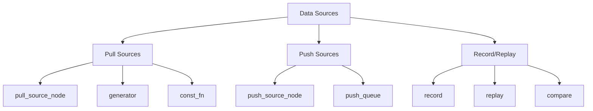
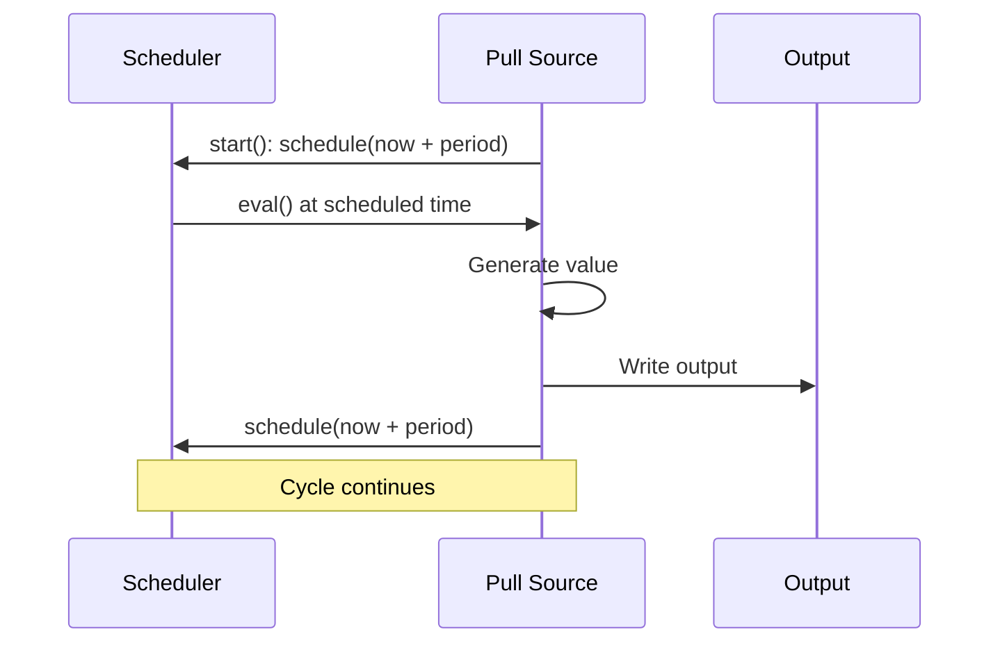
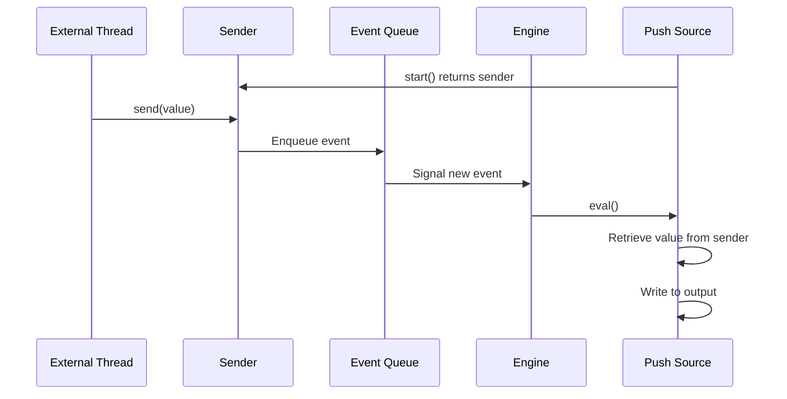
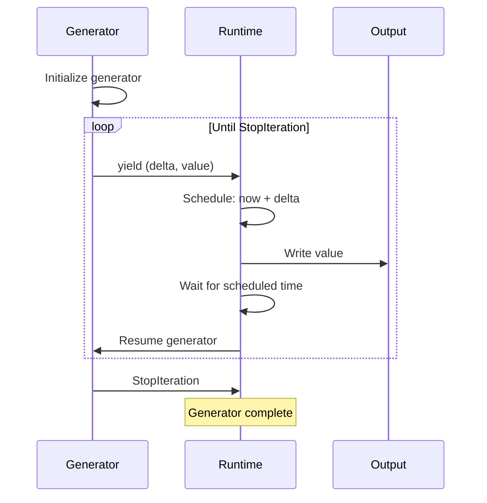
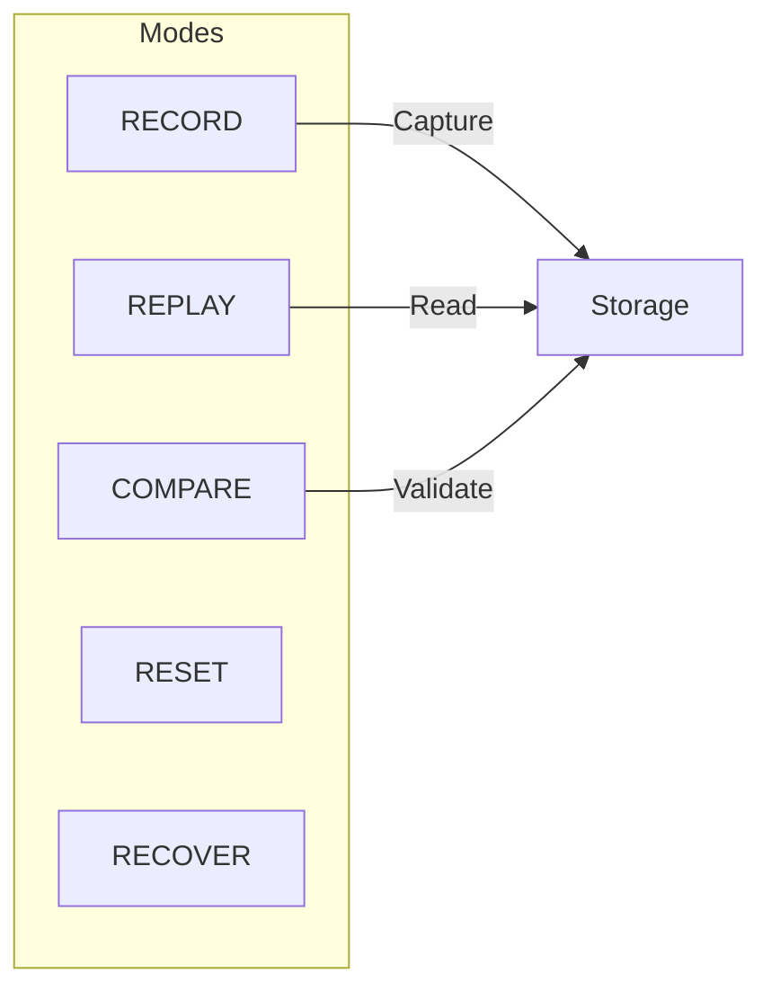
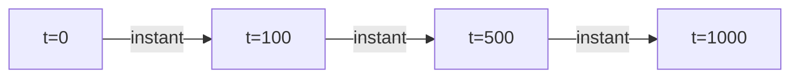
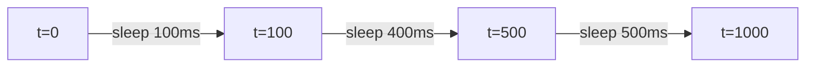

# Part X: Data Sources and Record/Replay

**Version:** 1.0 Draft
**Last Updated:** 2025-12-20

---

## 1. Introduction

HGraph provides various mechanisms for data ingestion:



---

## 2. Pull Source Nodes

### 2.1 @pull_source_node Decorator

Pull sources generate data on demand, typically on a schedule. This is the base decorator for pull-based source nodes:

```python
@pull_source_node
def clock_ticks(period: timedelta = timedelta(seconds=1)) -> TS[datetime]:
    """Emit current time periodically."""
    return datetime.now()
```

**Implementation Pattern:**

```python
# From hgraph/_wiring/_decorators.py
def pull_source_node(
    fn: SOURCE_NODE_SIGNATURE = None,
    /,
    node_impl=None,
    resolvers: Mapping["TypeVar", Callable] = None,
    requires: Callable[[..., ...], bool] = None,
    label: str | None = None,
    deprecated: bool | str = False,
) -> SOURCE_NODE_SIGNATURE:
    """
    Used to indicate the signature for a source node.
    For Python source nodes use either generator or source_adapter annotations.
    """
```

### 2.2 Scheduling Pattern



### 2.3 With Scheduler Access

Scheduler injection allows nodes to control their own timing:

```python
# From hgraph_unit_tests/_runtime/test_scheduler.py
from hgraph import compute_node, TS, SCHEDULER, MIN_TD

@compute_node
def my_scheduler(ts: TS[int], tag: str = None, _scheduler: SCHEDULER = None) -> TS[int]:
    if ts.modified:
        _scheduler.schedule(MIN_TD * ts.value, tag)
        return ts.value
    if _scheduler.is_scheduled_now:
        return -1

# Scheduler with wall clock for real-time mode
@compute_node
def my_scheduler_realtime(ts: TS[int], tag: str = None, _scheduler: SCHEDULER = None) -> TS[int]:
    if ts.modified:
        _scheduler.schedule(MIN_TD * ts.value, tag, on_wall_clock=True)
        return ts.value
    if _scheduler.is_scheduled_now:
        return -1
```

### 2.4 Context Wiring Pattern

```python
# From hgraph/_wiring/_context_wiring.py
@pull_source_node(node_impl=ContextNodeClass)
def get_context_output(path: str, depth: int) -> REF[CONTEXT_TIME_SERIES_TYPE]:
    """Uses the special node to extract a context output from the global state."""
```

### 2.5 Characteristics

| Property | Value |
|----------|-------|
| Inputs | Scalars only (no time-series) |
| Output | Required |
| Evaluation | Self-scheduled |
| Mode | Both simulation and real-time |

---

## 3. Push Source Nodes

### 3.1 @push_source_node Decorator

Push sources receive asynchronous external events:

```python
@push_source_node
def websocket_events() -> TS[str]:
    """Receive websocket messages."""
    ...
```

### 3.2 Sender Pattern



### 3.3 Characteristics

| Property | Value |
|----------|-------|
| Inputs | Scalars only (no time-series) |
| Output | Required |
| Evaluation | Triggered by external event |
| Mode | Real-time only (breaks simulation determinism) |

---

## 4. Generator

### 4.1 @generator Decorator

Generators create pull sources from Python generator functions. This is the most common way to implement pull source nodes:

```python
@generator
def signal() -> TS[bool]:
    while True:
        yield (timedelta(milliseconds=1), True)
```

### 4.2 Yield Format

Generator yields tuples of `(time_delta_or_datetime, value)`:

```python
# Yield with timedelta (relative time)
@generator
def countdown(start: int) -> TS[int]:
    for i in range(start, 0, -1):
        yield (timedelta(seconds=1), i)
    yield (timedelta(seconds=1), 0)
    # Generator ends, source stops

# Yield with datetime (absolute time)
@generator
def timed_events(_clock: EvaluationClock = None) -> TS[str]:
    for i in range(5):
        yield _clock.next_cycle_evaluation_time, f"event_{i}"
```

### 4.3 Real-World Examples

**Example 1: const() Implementation**

```python
# From hgraph/_impl/_operators/_time_series_conversion.py
@generator(overloads=const)
def const_default(
    value: SCALAR,
    tp: type[OUT] = TS[SCALAR],
    delay: timedelta = timedelta(),
    _api: EvaluationEngineApi = None,
) -> DEFAULT[OUT]:
    """
    Produces a single tick at the start of the graph evaluation.

    :param value: The value to emit
    :param tp: Output type, defaults to TS[SCALAR]
    :param delay: Amount of time to delay the value
    :param _api: Evaluation API (injected)
    :return: A single tick of the value supplied
    """
    yield _api.start_time + delay, value
```

**Example 2: nothing() Implementation**

```python
# From hgraph/_impl/_operators/_graph_operators.py
@generator(overloads=nothing)
def nothing_impl(tp: type[OUT] = AUTO_RESOLVE) -> DEFAULT[OUT]:
    """
    Produces no ticks ever.
    """
    yield from ()
```

**Example 3: schedule() Implementation**

```python
# From hgraph/_impl/_operators/_stream_operators.py
@generator(overloads=schedule)
def schedule_scalar(delay: timedelta, initial_delay: bool = True, max_ticks: int = sys.maxsize) -> TS[bool]:
    """Emit True at regular intervals."""
    initial_timedelta = delay if initial_delay else timedelta()
    yield (initial_timedelta, True)
    for _ in range(max_ticks - 1):
        yield (delay, True)
```

**Example 4: Generator with Resolvers (DataFrame Integration)**

```python
# From hgraph/adaptors/data_frame/_data_source_generators.py
@generator(resolvers={SCALAR: _extract_scalar})
def ts_from_data_source(
    dfs: type[DATA_FRAME_SOURCE],
    dt_col: str = "date",
    value_col: str = "value",
    offset: timedelta = timedelta(),
    _api: EvaluationEngineApi = None,
) -> TS[SCALAR]:
    """Stream values from a DataFrame source."""
    df: pl.DataFrame
    dfs_instance = DataStore.instance().get_data_source(dfs)
    dt_converter = _dt_converter(dfs_instance.schema[dt_col])
    for df in dfs_instance.iter_frames(start_time=_api.start_time, end_time=_api.end_time):
        if df.is_empty():
            continue
        for dt, value in df.select([dt_col, value_col]).iter_rows(named=False):
            dt = dt_converter(dt)
            yield dt + offset, value
```

**Example 5: Generator with TSB (Bundle) Output**

```python
# From hgraph/adaptors/data_frame/_data_source_generators.py
@generator(resolvers={TS_SCHEMA: _extract_schema})
def tsb_from_data_source(
    dfs: type[DATA_FRAME_SOURCE],
    dt_col: str,
    offset: timedelta = timedelta(),
    _api: EvaluationEngineApi = None
) -> TSB[TS_SCHEMA]:
    """Stream rows from DataFrame as bundles."""
    dfs_instance = DataStore.instance().get_data_source(dfs)
    dt_converter = _dt_converter(dfs_instance.schema[dt_col])
    for df in dfs_instance.iter_frames(start_time=_api.start_time, end_time=_api.end_time):
        for value in df.iter_rows(named=True):
            dt = dt_converter(value.pop(dt_col))
            yield dt + offset, value
```

**Example 6: Generator in Service Implementation**

```python
# From hgraph_unit_tests/_wiring/test_service.py
@service_impl(interfaces=(data,))
@generator
def impl() -> TS[str]:
    yield MIN_ST, "Test"
```

### 4.4 Execution Model



### 4.5 Injectable Parameters

Generators can inject runtime objects:

| Parameter | Type | Description |
|-----------|------|-------------|
| `_api` | `EvaluationEngineApi` | Access to start/end time |
| `_clock` | `EvaluationClock` | Access to current evaluation time |
| `_traits` | `Traits` | Node metadata |
| `_state` | `STATE[...]` | Stateful storage |

### 4.6 Error Handling

```python
# Duplicate time yields raise errors
@generator
def play_duplicate() -> TS[int]:
    yield MIN_ST, 1
    yield MIN_ST, 2  # Raises NodeException - duplicate time not allowed
```

---

## 5. Push Queue

### 5.1 @push_queue Decorator

Push queues enable asynchronous external data injection with thread-safe semantics:

```python
@push_queue(TS[str])
def my_message_sender(sender: Callable[[str], None], values: tuple[str, ...]):
    """
    The sender callable is provided by the runtime.
    Call sender(value) from any thread to inject data into the graph.
    """
    def _sender(values):
        for value in values:
            sender(value)
            time.sleep(0.1)
    threading.Thread(target=_sender, args=(values,)).start()
```

### 5.2 Real-World Examples

**Example 1: Interactive User Input**

```python
# From docs_md/quick_start/push_source_node.py
import sys
import threading
from typing import Callable
from datetime import timedelta
from hgraph import push_queue, TS, graph, evaluate_graph, GraphConfiguration, EvaluationMode, debug_print, if_true, stop_engine

def _user_input(sender: Callable[[str], None]):
    while True:
        s = sys.stdin.readline().strip("\n")
        sender(s)
        if s == "exit":
            break

@push_queue(TS[str])
def user_input(sender: Callable[[str], None]):
    threading.Thread(target=_user_input, args=(sender,)).start()

@graph
def main():
    in_ = user_input()
    debug_print(">", in_)
    stop_engine(if_true(in_ == "exit"))

evaluate_graph(main, GraphConfiguration(run_mode=EvaluationMode.REAL_TIME, end_time=timedelta(minutes=2)))
```

**Example 2: Basic String Messages**

```python
# From hgraph_unit_tests/nodes/test_push_queue.py
def test_push_queue():
    def _sender(sender: Callable[[str], None], values: [str]):
        for value in values:
            sender(value)
            time.sleep(0.1)

    @push_queue(TS[str])
    def my_message_sender(sender: Callable[[str], None], values: tuple[str, ...]):
        threading.Thread(target=_sender, args=(sender, values)).start()

    @graph
    def main():
        messages = my_message_sender(("1", "2", "3"))
        record(messages)
        stop_engine(if_true(messages == const("3")), "Completed Processing request")

    with GlobalState():
        evaluate_graph(main, GraphConfiguration(run_mode=EvaluationMode.REAL_TIME, end_time=timedelta(seconds=1)))
        values = get_recorded_value()

    assert [v[1] for v in values] == ["1", "2", "3"]
```

### 5.3 Batch Mode

Collect multiple values into tuples before sending:

```python
# From hgraph_unit_tests/nodes/test_push_queue.py
def test_batch_push_queue():
    def _sender(sender: Callable[[str], None], values: [str]):
        for value in values:
            sender(value)

    @push_queue(TS[Tuple[str, ...]])
    def my_message_sender(sender: Callable[[str], None], values: tuple[str, ...], batch: bool = True):
        threading.Thread(target=_sender, args=(sender, values)).start()

    @graph
    def main():
        messages = my_message_sender(("1", "2", "3"))
        record(messages)
        stop_engine(if_true(contains_(messages, const("3"))))

    with GlobalState():
        evaluate_graph(main, GraphConfiguration(run_mode=EvaluationMode.REAL_TIME, end_time=timedelta(seconds=1)))
        values = get_recorded_value()

    # All values batched together in one tuple
    assert [v[1] for v in values] == [("1", "2", "3")]
```

### 5.4 Elide Mode

Skip intermediate values, only forward final state changes:

```python
# From hgraph_unit_tests/nodes/test_push_queue.py
def test_elide_push_queue():
    def _sender(sender: Callable[[str], None], values: [str]):
        for value in values:
            sender(value)

    @push_queue(TS[str])
    def my_message_sender(sender: Callable[[str], None], values: tuple[str, ...], elide: bool = True):
        threading.Thread(target=_sender, args=(sender, values)).start()

    @graph
    def main():
        messages = my_message_sender(("1", "2", "3"))
        record(messages)
        stop_engine(if_true(messages == const("3")))

    with GlobalState():
        evaluate_graph(main, GraphConfiguration(run_mode=EvaluationMode.REAL_TIME, end_time=timedelta(seconds=1)))
        values = get_recorded_value()

    # Only final value recorded (intermediate values elided)
    assert [v[1] for v in values] == ["3"]
```

### 5.5 TSD (Time Series Dictionary) Queue

For multi-keyed data streams:

```python
# From hgraph_unit_tests/nodes/test_push_queue.py
def test_tsd_push_queue():
    def _sender(sender: Callable[[str, float], None], values: Tuple[dict[str, float]]):
        for value in values:
            sender(value)
            time.sleep(0.01)

    @push_queue(TSD[str, TS[float]])
    def my_message_sender(sender: Callable[[str, float], None], values: tuple[dict[str, float], ...]):
        threading.Thread(target=_sender, args=(sender, values)).start()

    @graph
    def main():
        messages = my_message_sender(({"a": 1.0}, {"b": 2.0}, {"c": 3.0}, {"a": REMOVE}, {'c': 4.0}))
        record(messages)
        stop_engine(if_true(messages['c'] == 4.0))

    with GlobalState():
        evaluate_graph(main, GraphConfiguration(run_mode=EvaluationMode.REAL_TIME, end_time=timedelta(seconds=1)))
        values = get_recorded_value()

    assert [v[1] for v in values] == [{"a": 1.0}, {"b": 2.0}, {"c": 3.0}, {"a": REMOVE}, {'c': 4.0}]
```

### 5.6 Integration Patterns

**Kafka Integration:**

```python
# From hgraph/adaptors/kafka/_impl.py
from kafka import KafkaConsumer
from typing import Callable
from threading import Thread, Event

@push_queue(TS[bytes])
def _message_subscriber_queue(sender: Callable[[SCALAR], None] = None, *, topic: str):
    KafkaMessageState.instance().set_subscriber_sender(topic, sender)

class KafkaConsumerThread(Thread):
    def __init__(self, topic, consumer: KafkaConsumer, sender: Callable[[bytes], None]):
        super().__init__()
        self.topic = topic
        self.consumer = consumer
        self.sender = sender
        self._stop_event = Event()

    def run(self):
        try:
            while not self._stop_event.is_set():
                records = self.consumer.poll(timeout_ms=1000, max_records=1000)
                all_messages = [m for tp, messages in records.items() for m in messages]
                if len(records) > 1:
                    all_messages = sorted(all_messages, key=lambda m: (m.timestamp, m.topic, m.offset))
                for msg in all_messages:
                    self.sender(msg.value)  # Inject into graph
        except Exception:
            error(f"Failure in Kafka on topic: {self.topic}", exc_info=True)
        finally:
            self.consumer.close()

    def stop(self):
        self._stop_event.set()
```

**WebSocket Server Integration:**

```python
# From hgraph/adaptors/tornado/websocket_server_adaptor.py
@push_queue(TSD[int, TS[WebSocketConnectRequest]])
def connections_from_web(
    sender, path: str = "tornado_websocket_server_adaptor", elide: bool = True
) -> TSD[int, TS[WebSocketConnectRequest]]:
    GlobalState.instance()[f"websocket_server_adaptor://{path}/connect_queue"] = sender
    return None

@push_queue(TSD[int, TS[tuple[STR_OR_BYTES, ...]]])
def messages_from_web(
    sender, path: str = "tornado_websocket_server_adaptor", batch: bool = True
) -> TSD[int, TS[tuple[bytes, ...]]]:
    GlobalState.instance()[f"websocket_server_adaptor://{path}/message_queue"] = sender
    return None
```

### 5.7 Parameters

| Parameter | Type | Default | Description |
|-----------|------|---------|-------------|
| `tp` | `type[TIME_SERIES_TYPE]` | Required | Output type specification |
| `batch` | `bool` | `False` | Collect values into tuples |
| `elide` | `bool` | `False` | Skip intermediate updates |

---

## 6. const_fn

### 6.1 Overview

`const_fn` wraps pure scalar functions as time-series sources with dual usage:

```python
@const_fn
def calculate(a: int, b: int) -> TS[int]:
    return a + b
```

### 6.2 Real-World Examples

**Example 1: Basic Usage**

```python
# From hgraph_unit_tests/_wiring/_test_const_fn.py
from hgraph import const_fn, TS, graph, const
from hgraph.test import eval_node

def test_const_fn_as_ts():
    @const_fn
    def my_const_fn(a: int, b: int) -> TS[int]:
        return a + b

    assert eval_node(my_const_fn, 1, 2) == [3]

def test_const_fn_as_scalar():
    @const_fn
    def my_const_fn(a: int, b: int) -> TS[int]:
        return a + b

    # Outside graph: returns scalar directly
    assert my_const_fn(1, 2) == 3
```

**Example 2: Value Access in Graph**

```python
# From hgraph_unit_tests/_wiring/_test_const_fn.py
def test_const_fn_value_in_graph():
    @const_fn
    def my_const_fn(a: int, b: int) -> TS[int]:
        return a + b

    @graph
    def my_graph() -> TS[bool]:
        # Access .value during wiring for conditional logic
        if my_const_fn(1, 2).value == 3:
            return const(True)
        else:
            return const(False)

    assert eval_node(my_graph) == [True]
```

**Example 3: Operator Overloading**

```python
# From hgraph_unit_tests/_wiring/_test_const_fn.py
from hgraph import operator, TIME_SERIES_TYPE

def test_const_fn_resolution():
    @operator
    def my_const_operator(tp: type[TIME_SERIES_TYPE]) -> TS[str]: ...

    @const_fn(overloads=my_const_operator)
    def my_const_fn_int(tp: type[TS[int]]) -> TS[str]:
        return "int"

    @const_fn(overloads=my_const_operator)
    def my_const_fn_float(tp: type[TS[float]]) -> TS[str]:
        return "float"

    assert my_const_operator(TS[int]) == "int"
    assert my_const_operator(TS[float]) == "float"
```

### 6.3 Characteristics

| Property | Description |
|----------|-------------|
| Return | Constant `TS[return_type]` in graph, scalar outside |
| Evaluation | Once at wiring time |
| Context | Can be used both in and outside graphs |
| Overloads | Supports `overloads=` parameter |

---

## 7. Record/Replay System

### 7.1 Overview

The record/replay system enables:
- Recording graph execution for later analysis
- Replaying recorded data for testing
- Comparing recorded vs live execution (back-testing)



### 7.2 API Definition

```python
# From hgraph/_operators/_record_replay.py
from enum import IntFlag, auto

class RecordReplayEnum(IntFlag):
    """Enum for record/replay modes"""
    NONE = 0
    RECORD = auto()          # Records the recordable components
    REPLAY = auto()          # Replays the inputs
    COMPARE = auto()         # Back-testing mode - replays and compares outputs
    REPLAY_OUTPUT = auto()   # Replays outputs until last, then continues
    RESET = auto()           # Re-record ignoring current state
    RECOVER = auto()         # Recover state from recorded data and continue

class RecordReplayContext:
    """Context manager for record/replay operations"""
    def __init__(self, mode: RecordReplayEnum = RecordReplayEnum.RECORD, recordable_id: str = None):
        self._mode = mode
        self._recordable_id = recordable_id

    def __enter__(self) -> "RecordReplayContext":
        self._instance.append(self)
        return self

    def __exit__(self, exc_type, exc_val, exc_tb):
        self._instance.pop()

# Core operators
@operator
def record(ts: DEFAULT[TIME_SERIES_TYPE], key: str, recordable_id: str = None):
    """Record the ts value tied to recordable_id + key"""
    ...

@operator
def replay(key: str, tp: type[OUT] = AUTO_RESOLVE, recordable_id: str = None) -> OUT:
    """Replay the ts using the id provided in the context"""

@operator
def replay_const(key: str, tp: type[OUT] = AUTO_RESOLVE, recordable_id: str = None,
                 tm: datetime = None, as_of: datetime = None) -> OUT:
    """Return const time-series of values <= start_time for initialization"""

@operator
def compare(lhs: TIME_SERIES_TYPE, rhs: TIME_SERIES_TYPE):
    """Compare two time series (when COMPARE mode is set)"""
```

### 7.3 Real-World Examples

**Example 1: Simple Replay**

```python
# From hgraph_unit_tests/nodes/test_replay.py
from hgraph import graph, TS, print_, replay, GlobalState, evaluate_graph, GraphConfiguration
from hgraph._impl._operators._record_replay_in_memory import SimpleArrayReplaySource, set_replay_values

def test_replay_simple():
    """Simple replay from in-memory source"""
    with GlobalState():
        # Configure replay source
        set_replay_values("test", SimpleArrayReplaySource(["1", "2", "3"]))

        @graph
        def main():
            values = replay("test", TS[str])
            print_(values)

        evaluate_graph(main, GraphConfiguration())
```

**Example 2: Record and Replay Combined**

```python
# From hgraph_unit_tests/nodes/test_recorder.py
from hgraph import graph, TS, MIN_ST, MIN_TD, print_, replay, record, GlobalState, evaluate_graph
from hgraph._impl._operators._record_replay_in_memory import SimpleArrayReplaySource, set_replay_values, get_recorded_value

def test_recorder():
    """Record values while replaying"""
    with GlobalState():
        set_replay_values("test", SimpleArrayReplaySource(["1", "2", "3"]))

        @graph
        def main():
            value_ts = replay("test", TS[str])
            record(value_ts)  # Record the replayed values
            print_(value_ts)

        evaluate_graph(main, GraphConfiguration())

        # Verify recorded values
        values = get_recorded_value()
        assert values == [(MIN_ST, "1"), (MIN_ST + MIN_TD, "2"), (MIN_ST + 2 * MIN_TD, "3")]
```

**Example 3: Generator-Based Replay Implementation**

```python
# From hgraph/_impl/_operators/_record_replay_in_memory.py
class SimpleArrayReplaySource(ReplaySource):
    """Simple source that yields values at regular intervals"""
    def __init__(self, values: list[Any], start_time: datetime = MIN_ST):
        self.values = values
        self.start_time = start_time

    def __iter__(self) -> Iterable[tuple[datetime, Any]]:
        next_engine_time = self.start_time
        for value in self.values:
            if value is not None:
                yield next_engine_time, value
            next_engine_time += MIN_TD

@generator(overloads=replay, requires=record_replay_model_restriction(IN_MEMORY, True))
def replay_from_memory(key: str, tp: type[TIME_SERIES_TYPE] = AUTO_RESOLVE,
                       is_operator: bool = False, recordable_id: str = None,
                       _traits: Traits = None, _clock: EvaluationClock = None) -> TIME_SERIES_TYPE:
    """Replay values from global state"""
    recordable_id = get_fq_recordable_id(_traits, recordable_id)
    recordable_id = f":memory:{recordable_id}"
    source = GlobalState.instance().get(f"{recordable_id}.{key}", None)
    if source is None:
        raise ValueError(f"Replay source with label '{key}' does not exist")
    tm = _clock.evaluation_time
    for ts, v in source:
        if ts < tm:
            continue
        if v is not None:
            yield ts, v
```

**Example 4: Record to Memory Implementation**

```python
# From hgraph/_impl/_operators/_record_replay_in_memory.py
@sink_node(overloads=record, requires=record_replay_model_restriction(IN_MEMORY, True))
def record_to_memory(ts: TIME_SERIES_TYPE, key: str = "out", is_operator: bool = False,
                     recordable_id: str = None, _api: EvaluationEngineApi = None,
                     _state: STATE = None, _traits: Traits = None):
    """Record values to global state"""
    _state.record_value.append((_api.evaluation_clock.evaluation_time, ts.delta_value))

@record_to_memory.start
def record_to_memory_start(key: str, is_operator: bool, recordable_id: str,
                           _state: STATE, _traits: Traits):
    recordable_id = get_fq_recordable_id(_traits, recordable_id)
    recordable_id = f":memory:{recordable_id}.{key}"
    _state.recordable_id = recordable_id
    _state.record_value = []

@record_to_memory.stop
def record_to_memory_stop(_state: STATE, _api: EvaluationEngineApi):
    global_state = GlobalState.instance()
    global_state[_state.recordable_id] = _state.record_value
```

### 7.4 DataFrame Storage Backend

```python
# From hgraph/adaptors/data_frame/_data_frame_record_replay.py
from abc import ABC, abstractmethod
import polars as pl

class DataFrameStorage(ABC):
    """Abstract storage for recording/replaying dataframes"""

    @abstractmethod
    def read_frame(self, path: str, start_time: datetime = None,
                   end_time: datetime = None, as_of: datetime = None) -> pl.DataFrame:
        """Read dataframe with optional time range filtering"""

    @abstractmethod
    def write_frame(self, path: str, df: pl.DataFrame,
                    mode: WriteMode = WriteMode.OVERWRITE, as_of: datetime = None) -> pl.DataFrame:
        """Write dataframe with optional mode (EXTEND/OVERWRITE/MERGE)"""

class MemoryDataFrameStorage(BaseDataFrameStorage):
    """In-memory dataframe storage for testing"""
    def __init__(self):
        super().__init__()
        self._frames = {}

    def _write(self, path: Path, df: pl.DataFrame):
        self._frames[str(path)] = df

    def _read(self, path: Path) -> pl.DataFrame:
        return self._frames.get(str(path), None)

class FileBasedDataFrameStorage(BaseDataFrameStorage):
    """File-system-based dataframe storage using parquet"""
    def __init__(self, path: Path):
        super().__init__()
        self._path = path
        path.mkdir(parents=True, exist_ok=True)

    def _read(self, path: Path) -> pl.DataFrame:
        return pl.read_parquet(self._path / f"{path}.parquet")

    def _write(self, path, df):
        df.write_parquet(self._path / f"{path}.parquet")
```

**DataFrame Record/Replay Tests:**

```python
# From hgraph_unit_tests/adaptors/data_frame/test_data_frame_record_replay.py
from hgraph import GlobalState, set_record_replay_model, record, TS, set_as_of, MIN_ST, MIN_TD, replay, TSD
from hgraph.adaptors.data_frame import DATA_FRAME_RECORD_REPLAY, MemoryDataFrameStorage, set_data_frame_overrides
from hgraph.test import eval_node

def test_data_frame_record():
    """Record to dataframe storage"""
    with GlobalState() as gs, MemoryDataFrameStorage() as ds:
        set_record_replay_model(DATA_FRAME_RECORD_REPLAY)
        set_as_of(MIN_ST + MIN_TD * 30)
        eval_node(record[TS[int]], ts=[1, 2, 3], key="ts", recordable_id="test")

        assert len(ds._frames) == 1
        df = next(iter(ds._frames.values()))
        assert len(df) == 3
        assert df["value"][0] == 1

def test_data_frame_record_replay():
    """Record and replay from dataframe"""
    with GlobalState() as gs, MemoryDataFrameStorage() as ds:
        set_record_replay_model(DATA_FRAME_RECORD_REPLAY)
        set_as_of(MIN_ST + MIN_TD * 30)
        eval_node(record[TS[int]], ts=[1, 2, 3], key="ts", recordable_id="test")

        assert eval_node(replay[TS[int]], key="ts", recordable_id="test") == [1, 2, 3]

def test_data_frame_record_replay_tsd():
    """Record TSD with partitioning"""
    with GlobalState() as gs, MemoryDataFrameStorage() as ds:
        set_record_replay_model(DATA_FRAME_RECORD_REPLAY)
        set_as_of(MIN_ST + MIN_TD * 30)
        set_table_schema_date_key("date")
        set_data_frame_overrides(key="ts", recordable_id="test", track_as_of=False,
                                track_removes=False, partition_keys=["id"])
        eval_node(record[TSD[str, TS[int]]], ts=[{"a": 1}, {"b": 2}, {"a": 3}],
                 key="ts", recordable_id="test")

        df = next(iter(ds._frames.values()))
        assert [k for k in df.schema] == ["date", "id", "value"]
```

### 7.5 Storage Configuration

```python
from hgraph import set_record_replay_model, IN_MEMORY
from hgraph.adaptors.data_frame import DATA_FRAME_RECORD_REPLAY, set_data_frame_record_path

# Use in-memory storage
set_record_replay_model(IN_MEMORY)

# Use DataFrame storage
set_record_replay_model(DATA_FRAME_RECORD_REPLAY)
set_data_frame_record_path(Path("/path/to/recordings"))

# Configure DataFrame recording options
set_data_frame_overrides(
    key="my_key",
    recordable_id="my_id",
    track_as_of=True,      # Track as_of column
    track_removes=True,     # Track remove operations
    partition_keys=["id"]   # Partition by id column
)
```

---

## 8. Source Node Comparison

| Source Type | Scheduling | External Events | Deterministic | Mode |
|-------------|------------|-----------------|---------------|------|
| pull_source_node | Self-scheduled | No | Yes | Both |
| push_source_node | Event-driven | Yes | No | Real-time |
| generator | Yield-based | No | Yes | Both |
| push_queue | Event-driven | Yes | No | Real-time |
| const_fn | Once | No | Yes | Both |

---

## 9. Execution Modes

### 9.1 Simulation Mode



**Characteristics:**
- Time jumps to next scheduled event
- Push sources not allowed
- Deterministic execution
- Reproducible results

### 9.2 Real-Time Mode



**Characteristics:**
- Time tracks wall clock
- Push sources allowed
- Non-deterministic (external events)
- May process late events

### 9.3 Mode Selection

```python
from hgraph import run_graph, EvaluationMode, GraphConfiguration

# Simulation (default)
run_graph(my_graph, GraphConfiguration(
    start_time=start_time,
    end_time=end_time,
    run_mode=EvaluationMode.SIMULATION
))

# Real-time
run_graph(my_graph, GraphConfiguration(
    start_time=start_time,
    end_time=timedelta(minutes=5),  # Duration for real-time
    run_mode=EvaluationMode.REAL_TIME
))
```

---

## 10. const (Constant Source)

### 10.1 Operator Signature

```python
# From hgraph/_operators/_time_series_conversion.py
@operator
def const(
    value: SCALAR,
    tp: type[OUT] = TS[SCALAR],
    delay: timedelta = timedelta(),
) -> DEFAULT[OUT]:
    """
    Produces a single tick at the start of the graph evaluation.

    :param value: The value to emit
    :param tp: Output type, defaults to TS[SCALAR]
    :param delay: Amount of time to delay the value
    :return: A single tick of the value supplied
    """
```

### 10.2 Usage Examples

```python
# From hgraph_unit_tests/_operators/test_const.py
from hgraph import const, MIN_TD
from hgraph.test import eval_node

def test_const():
    assert eval_node(const, 1) == [1]

def test_delayed_const():
    assert eval_node(const, 1, delay=MIN_TD * 2) == [None, None, 1]

# Create different types
forty_two = const(42)                              # TS[int]
greeting = const("hello")                          # TS[str]
config = const(frozendict({"a": 1}), TSD[str, TS[int]])  # TSD
```

### 10.3 Behavior

- Outputs value once at start (or after delay)
- Never modified again
- Valid for entire graph lifetime

---

## 11. nothing (Null Source)

### 11.1 Operator Signature

```python
# From hgraph/_operators/_graph_operators.py
@operator
def nothing(tp: type[OUT] = AUTO_RESOLVE) -> DEFAULT[OUT]:
    """
    Produces no ticks ever. Can be used in two ways:

    ```python
    nothing[TS[int]]()
    ```

    or

    ```python
    nothing(TS[int])
    ```

    This is equivalent to None for time-series inputs.
    """
```

### 11.2 Usage

```python
from hgraph import nothing

# Create unbound/null time-series
empty_int = nothing(TS[int])

# Or using type indexing
empty_str = nothing[TS[str]]()
```

### 11.3 Behavior

- Creates time-series that is never valid
- Useful as placeholder or for optional paths
- Equivalent to `None` for unconnected inputs

---

## 12. Reference Locations

| Concept | Python Location |
|---------|-----------------|
| @pull_source_node | `hgraph/_wiring/_decorators.py` |
| @push_source_node | `hgraph/_wiring/_decorators.py` |
| @generator | `hgraph/_wiring/_decorators.py` |
| @push_queue | `hgraph/_wiring/_decorators.py` |
| @const_fn | `hgraph/_wiring/_decorators.py` |
| Record/Replay API | `hgraph/_operators/_record_replay.py` |
| In-Memory Storage | `hgraph/_impl/_operators/_record_replay_in_memory.py` |
| DataFrame Storage | `hgraph/adaptors/data_frame/_data_frame_record_replay.py` |
| const | `hgraph/_operators/_time_series_conversion.py` |
| nothing | `hgraph/_operators/_graph_operators.py` |

---

## 13. Summary

HGraph's data source system provides:

1. **Pull sources** (`@pull_source_node`, `@generator`) for scheduled, deterministic data generation
2. **Push sources** (`@push_source_node`, `@push_queue`) for asynchronous external event handling
3. **Generators** for convenient Python generator integration with rich timing control
4. **Push queues** with batching and eliding for high-throughput external data injection
5. **const_fn** for dual-use scalar functions in and outside graphs
6. **Record/Replay** for testing, debugging, and back-testing with multiple storage backends
7. **Mode selection** for simulation vs real-time execution

The separation of pull and push sources ensures that simulation mode remains deterministic while real-time mode can handle external events. The record/replay system enables reproducible testing and back-testing of live systems.

