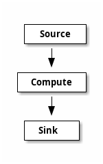

# Forward Propagation Graph

## Introduction

The forward propagation graph (FPG) is a directed acyclic graph (DAG). The graph
is designed to evaluate the flow of data through the graph, where evaluation follows
the rank order of the nodes in the graph.

The graph has 3 types of nodes, namely: ``source``, ``compute``, and `sink` nodes.
The source nodes are the entry points into the graph, they have only output edges
with no input edges. Sink nodes are the leaves of the node and have no output edges.
Finally, the compute nodes are found between the source and sink nodes. These nodes
have both input and output edges.

HGraph (HG) is a FPG graph that is a time-series evaluation engine. That is, the graph evaluates information
over time, the time is typically introduced by the source nodes. There are two types of source
nodes, namely: ``pull`` and `push` source nodes. The pull source nodes express their values
as a tuple of time and value. The graph will evaluate itself as-of the time emitted by
a ``pull`` source node or wall clock time if the push source node has a value enqueued. 
A ``push`` source node will be evaluated at either the time of the
current engine time (``evaluation_time``) (as determined by the pull source node values) or at the 
current wall clock time if there are no pending pull source nodes with values to be 
evaluated before the current wall clock time.

The graph is evaluated in waves, the time of the wave (or ``evaluation_time``) is the time
set by the source node. The wave is evaluated in rank order (defined by the topological
sort order of the graph). Nodes with the same rank may be evaluated in any order, 
although in most implementations, the nodes are flattened into a fully ordered list
and will always be evaluated in that order during the life-time of the graph.

Nodes are only evaluated if the ``output`` associated to the ``input``/s of the node have been modified
during the current wave. The last value of an output of a node is always available to the input.
Thus, once a value is computed, it will be available to the inputs of dependent nodes / inputs.
The benefit of this is the ability to reduce computations by only needing to evaluate the parts
of a graph that have been modified, with the other parts still retaining the last computed
value.

The nodes of the graph obtain time from the evaluation engine's clock. The key information is
``evaluation_time``, this is the time the graph is currently been evaluated for, the
``now`` property represents the current live time (often referred to as wall clock time). The nodes
of a graph may never refer to the system clock (e.g. ``datetime.now()``), but rather
should always reflect the time from the supplied evaluation clock. This allows
the graph to run in a simulation (or backtest) mode where the graph is fed 
historical time-series data to the source nodes and the ``now`` property is 
treated as the ``evaluation_time + cycle_time`` (or the time taken  from the time the evaluation
started to the point at which ``cycle_time`` it is queried). The upshot of this is that the graph 
can be forced to re-run different input simulations using exactly the same logic as it would run in real-time,
without having to wait for any artificially introduced delays. This ability is also referred to as *"time-travel"*, 
*"bullet-time"* and *"compressed-time"*.

One of the key advantages of this design for software development is partially
the performance based on reduced computation and largely the ability to run
simulations or back-tests without having to modify the logic. If the key use of the
software is for backtest/simulation of computations over time-series data, there
are potentially more efficient solutions, but if the code is designed to run
in real time at least as often as in simulation mode, then this design provides
a powerful tool to develop these types of solutions.

