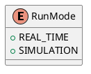
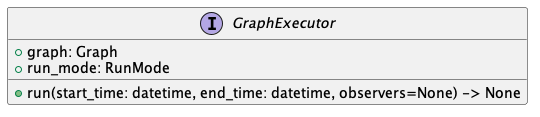
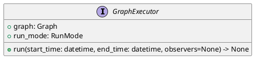
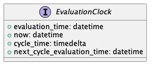
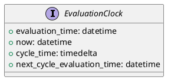
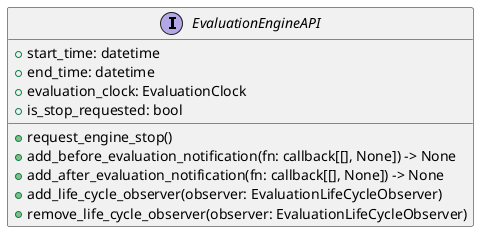
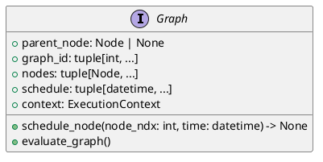

## Graph Runtime

The runtime graph represents the structure which is evaluated at runtime. This
consists of the graph execution, evaluation engine, evaluation engine api, graph and nodes.


### Evaluation Engine


<details>

</details>


<details>

</details>


The ``GraphExecutor`` is the component that is responsible for evaluating the graph.
This contains the master run-loop. The run-loop evaluates the graph in the time
range provided. The nature of the evaluation is determined by the ``run_mode``
of the graph. In ``SIMULATION`` mode the graph will only support pull source nodes
and will evaluate the graph in compressed-time. In ``REAL_TIME`` mode the graph
will support both push and pull source nodes and will evaluate the graph
using true wall clock time, that is in a push source node presents a time in the future,
the executor will wait until the time is reached on the computers clock prior to performing
the computation.

Historical data can also be fed into the system, but in REAL_TIME mode, the graph will
process push source node ticks at whatever time point the engine is when the tick arrives.
(Ticks from the past will run compressed time until the current wall time is reached)

### Evaluation Clock


<details>

</details>

The evaluation clock is available to be injected into a node. The most useful property is the ``evaluation_time``,
this provides the logical notion of the current time, this is considered as the computation time.
``now`` provides the view of the current wall clock time, which should generally always be larger than the 
``evaluation_time``. In ``SIMULATION`` mode, ``now`` may not necessarily be monotonically increasing over engine-cycles
but will be within an engine-cycle.

The ``cycle-time`` is the time taken from the ``evaluation_time`` to ``now`` in ``REAL_TIME``, in ``SIMULATION`` mode
it is the time from when the engine started the cycle until the point the property is queried.

The ``next_cycle_evaluation_time`` is the smallest next evaluation time possible.

### Evaluation Engine API


<details>

</details>

This is an injectable property and provides access to the exposed evaluation engine API.

The add_before_evaluation_notification and add_after_evaluation_notification are 
useful to inject behavior that needs to be evaluated once either just after the
evaluation of the wave or just before the next wave is started. This is used
extensively by internal components of the graph as well to manage transient state
such as ``TSS.added`` / ``TSS.removed``. These are values that are only present for a 
single wave of the graph and need to be cleared down at the end of the wave.

The ``EvaluationEngineAPI`` is created and owned by the ``GraphExecutor``.
In nested graphs a custom version of the engine and clocks are constructed to 
support the nested state.

### Graph


<details>

</details>

The graph contains the nodes that belong to the graph. This ``Graph`` is not the same
as that of the wiring structure, but is the flattened graph of all nodes that 
are to be evaluated within a ``GraphExecutor``. The graph also contains the
evaluation schedule for each node. This is list of datetime values that indicate
the next time the node is scheduled to be evaluated at. The graph is responsible
for scheduling the nodes for evaluation. This is exposed as the ``schedule_node``
method on the class.
This also has the ``evaluation_graph`` behaviour which evaluates a single wave of
execution of the nodes for the ``evaluation_time`` of the graph executor.

### Node

As discussed in the introduction, there are three key node types: source, compute, 
and sink nodes. Nodes in the graph are represented as classes within the internals
of the system. The base class is as follows:


<details>
```
@startuml node_uml
interface Node {
    + node_ndx: int
    + node_id: tuple[int, ...]
    + owning_graph_id: tuple[int, ...]
    + graph: Graph
    + signature: NodeSignature
    + input: TimeSeriesBundleInput | None
    + output: TimeSeriesOutput | None
    + scheduler: SCHEDULER | None
    + eval()
    + notify()
}
@enduml
```
</details>

The node signature describes the important static meta-data of the node. This includes attributes such as the node type,
the inputs and output signatures, etc.

The node has a virtual function ``eval()``, this is called when the node has been scheduled for evaluation. The 
``notify()`` method is called to advise the node to schedule itself for evaluation with its associated ``graph``.
The node may have an ``input`` and / or an ``output`` (depending on the node type).

In the Python node implementation, this wraps the python function decorated by one of the node decorators (such as 
``compute_node``), the eval method calls the python function with the kwargs as specified in the function signature,
if the function returns a result it is applied to the output property.

