# HGraph Language Design Specification
## Part V: Time-Series Types

**Version:** 1.0 Draft
**Last Updated:** 2025-12-20

---

## 1. Introduction

Time-series types are the fundamental data containers in HGraph. They represent values that change over discrete time points (ticks) and propagate through the computation graph.

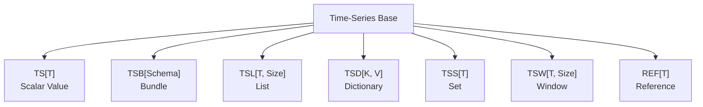

---

## 2. Common Properties

All time-series types share these properties:

### 2.1 Property Table

| Property | Type | Description |
|----------|------|-------------|
| `value` | `T` | Current value (read) |
| `delta_value` | varies | Change since last tick |
| `modified` | `bool` | True if changed this tick |
| `valid` | `bool` | True if has a value |
| `all_valid` | `bool` | True if all nested values valid |
| `last_modified_time` | `datetime` | Time of last modification |

### 2.2 Modification Semantics

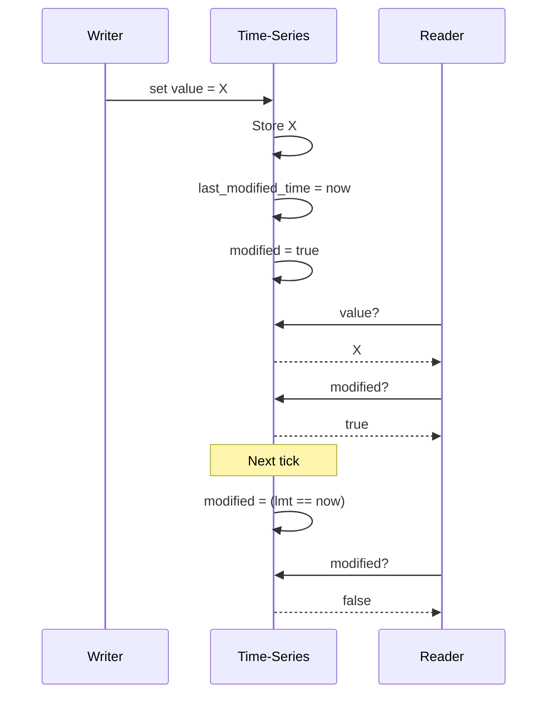

---

## 3. TS[T] - Scalar Time-Series

The simplest time-series type, containing a single scalar value.

### 3.1 Type Definition

```python
TS[T]  # where T is any scalar type
```

Examples:
- `TS[int]` - Time-series of integers
- `TS[str]` - Time-series of strings
- `TS[MyDataClass]` - Time-series of compound scalar

### 3.2 Properties

| Property | Type | Description |
|----------|------|-------------|
| `value` | `T` | Current scalar value |
| `delta_value` | `T` | Same as value (no delta for scalars) |

### 3.3 Output Operations

```python
output.value = new_value      # Set value and mark modified
output.apply_result(value)    # Set if value is not None
output.invalidate()           # Mark as invalid
output.copy_from_input(inp)   # Copy from input
output.copy_from_output(out)  # Copy from output
```

### 3.4 Input Operations

```python
value = input.value           # Read current value
is_mod = input.modified       # Check if modified
input.make_active()           # Subscribe to modifications
input.make_passive()          # Unsubscribe from modifications
```

### 3.5 Memory Layout

```
┌─────────────────────────────────────┐
│ TS[T] Output                        │
├─────────────────────────────────────┤
│ value: T (scalar storage)           │
│ last_modified_time: datetime        │
│ valid: bool                         │
└─────────────────────────────────────┘
```

---

## 4. TSB[Schema] - Time-Series Bundle

A structured collection of named time-series fields, similar to a dataclass.

### 4.1 Type Definition

```python
class MyBundle(TimeSeriesSchema):
    price: TS[float]
    quantity: TS[int]
    symbol: TS[str]

TSB[MyBundle]  # Bundle following the schema
```

### 4.2 Schema Definition

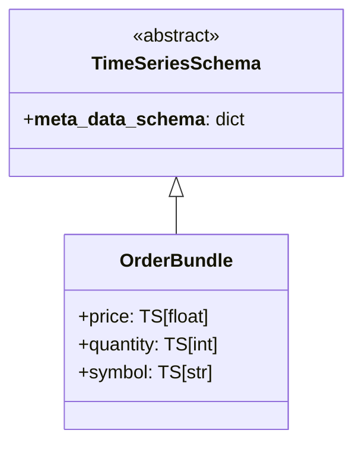

### 4.3 Properties

| Property | Type | Description |
|----------|------|-------------|
| `value` | `dict` | Dictionary of all field values |
| `delta_value` | `dict` | Dictionary of modified field values only |
| `modified` | `bool` | True if any field modified |
| `valid` | `bool` | True if at least one field valid |
| `all_valid` | `bool` | True if all fields valid |

### 4.4 Field Access

```python
# Attribute access
bundle.price              # TS[float] for price field
bundle.price.value        # float value

# Dictionary access
bundle["price"]           # TS[float] for price field

# Get all values
bundle.value              # {"price": 100.5, "quantity": 10, "symbol": "AAPL"}
bundle.delta_value        # Only modified fields
```

### 4.5 Field Modification

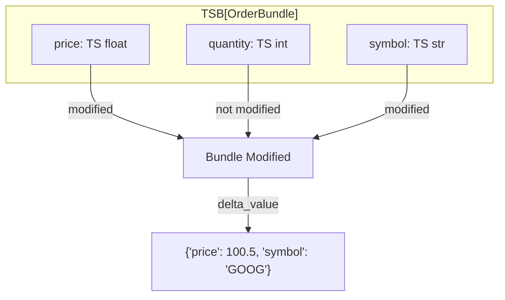

### 4.6 Memory Layout

```
┌──────────────────────────────────────────────┐
│ TSB[Schema] Output                           │
├──────────────────────────────────────────────┤
│ field_outputs: list[TS Output]               │
│ ├── [0] price: TS[float]                     │
│ ├── [1] quantity: TS[int]                    │
│ └── [2] symbol: TS[str]                      │
│ last_modified_time: datetime                 │
│ field_modification_mask: bitset              │
└──────────────────────────────────────────────┘
```

---

## 5. TSL[T, Size] - Time-Series List

A fixed-size list of identical time-series elements.

### 5.1 Type Definition

```python
TSL[TS[int], Size[3]]    # List of 3 TS[int] elements
TSL[TS[float], SIZE]     # List with size resolved at wiring
```

### 5.2 Properties

| Property | Type | Description |
|----------|------|-------------|
| `value` | `tuple[T, ...]` | Tuple of all element values |
| `delta_value` | `dict[int, T]` | Map of index to modified value |
| `modified` | `bool` | True if any element modified |
| `valid` | `bool` | True if at least one element valid |
| `all_valid` | `bool` | True if all elements valid |

### 5.3 Element Access

```python
# Index access
tsl[0]              # First element (TS[int])
tsl[0].value        # Value of first element
tsl[-1]             # Last element

# Iteration
for ts in tsl:
    if ts.valid and ts.modified:
        process(ts.value)

# Length
len(tsl)            # Fixed size
```

### 5.4 Modification Tracking

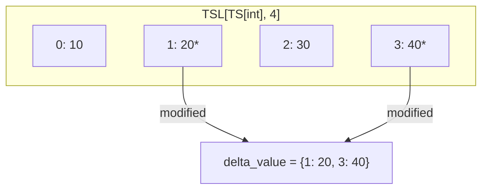

### 5.5 Memory Layout

```
┌─────────────────────────────────────────────┐
│ TSL[T, Size] Output                         │
├─────────────────────────────────────────────┤
│ elements: array[TS Output, Size]            │
│ ├── [0] TS[T]                               │
│ ├── [1] TS[T]                               │
│ └── ... (fixed size)                        │
│ last_modified_time: datetime                │
│ modification_mask: bitset[Size]             │
└─────────────────────────────────────────────┘
```

---

## 6. TSD[K, V] - Time-Series Dictionary

A dynamic dictionary mapping keys to time-series values.

### 6.1 Type Definition

```python
TSD[str, TS[float]]      # Dict with string keys, TS[float] values
TSD[int, TSB[Schema]]    # Dict with int keys, bundle values
```

### 6.2 Properties

| Property | Type | Description |
|----------|------|-------------|
| `value` | `dict[K, V]` | Dictionary of key to value |
| `delta_value` | `TSDDelta` | Added, removed, and modified keys |
| `modified` | `bool` | True if any change occurred |
| `valid` | `bool` | True (always valid, may be empty) |
| `all_valid` | `bool` | True if all values valid |
| `added` | `frozenset[K]` | Keys added this tick |
| `removed` | `frozenset[K]` | Keys removed this tick |

### 6.3 Key Operations

```python
# Access by key
tsd["key"]              # TS[V] for key
tsd["key"].value        # Value for key
tsd.get("key")          # Optional access

# Key enumeration
tsd.keys()              # All current keys
tsd.added               # Keys added this tick
tsd.removed             # Keys removed this tick

# Iteration
for key, ts in tsd.items():
    if ts.modified:
        process(key, ts.value)
```

### 6.4 Delta Semantics

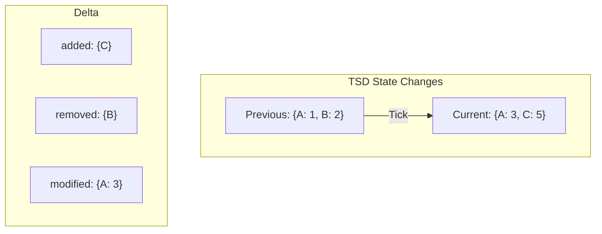

### 6.5 Output Operations

```python
output["key"] = value       # Add or update key
del output["key"]           # Remove key
output.clear()              # Remove all keys
```

### 6.6 Memory Layout

```
┌─────────────────────────────────────────────┐
│ TSD[K, V] Output                            │
├─────────────────────────────────────────────┤
│ entries: dict[K, TS[V] Output]              │
│ added_keys: set[K]                          │
│ removed_keys: set[K]                        │
│ removed_values: dict[K, V] (for delta)      │
│ last_modified_time: datetime                │
└─────────────────────────────────────────────┘
```

---

## 7. TSS[T] - Time-Series Set

A dynamic set of scalar values with add/remove tracking.

### 7.1 Type Definition

```python
TSS[str]        # Set of strings
TSS[int]        # Set of integers
```

### 7.2 Properties

| Property | Type | Description |
|----------|------|-------------|
| `value` | `frozenset[T]` | Current set of values |
| `delta_value` | `TSSDelta` | Added and removed items |
| `modified` | `bool` | True if add/remove occurred |
| `valid` | `bool` | True (always valid, may be empty) |
| `added` | `frozenset[T]` | Items added this tick |
| `removed` | `frozenset[T]` | Items removed this tick |

### 7.3 Set Operations

```python
# Membership
item in tss             # Check membership
len(tss)                # Number of elements

# Delta access
tss.added               # Items added this tick
tss.removed             # Items removed this tick

# Iteration
for item in tss:
    process(item)

for item in tss.added:
    handle_new(item)
```

### 7.4 Delta Semantics

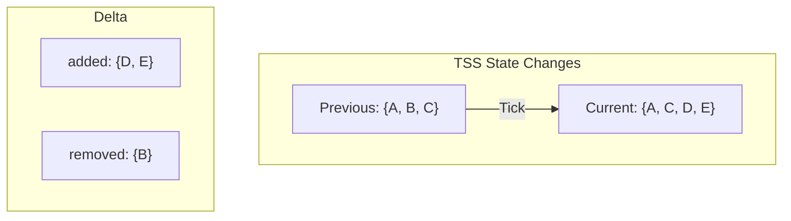

### 7.5 Output Operations

```python
output.add(item)        # Add item to set
output.remove(item)     # Remove item from set
output.discard(item)    # Remove if present
output.clear()          # Remove all items
output.update(items)    # Add multiple items
```

---

## 8. TSW[T, Size] - Time-Series Window

A sliding window buffer that maintains the last N values.

### 8.1 Type Definition

```python
TSW[int, Size[10]]      # Window of last 10 integers
TSW[float, SIZE]        # Window with size resolved at wiring
```

### 8.2 Properties

| Property | Type | Description |
|----------|------|-------------|
| `value` | `tuple[T, ...]` | All values in window (oldest first) |
| `delta_value` | `tuple[T, ...]` | Values added this tick |
| `modified` | `bool` | True if value added |
| `valid` | `bool` | True if window has any values |
| `count` | `int` | Number of values in window |
| `full` | `bool` | True if window is at capacity |

### 8.3 Window Access

```python
# Index access (0 = oldest)
window[0]               # Oldest value
window[-1]              # Newest value
window[5]               # 6th value

# Properties
len(window)             # Current count (may be < Size)
window.full             # True if count == Size

# Iteration
for value in window:
    process(value)
```

### 8.4 Window Behavior

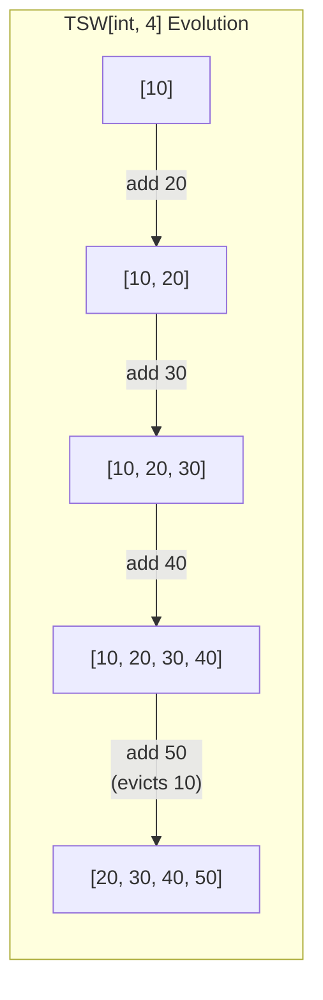

### 8.5 Memory Layout

```
┌─────────────────────────────────────────────┐
│ TSW[T, Size] Output                         │
├─────────────────────────────────────────────┤
│ buffer: circular_buffer[T, Size]            │
│ count: int                                  │
│ head: int (write position)                  │
│ last_modified_time: datetime                │
└─────────────────────────────────────────────┘
```

---

## 9. REF[T] - Time-Series Reference

An indirect reference to another time-series, enabling dynamic rebinding.

### 9.1 Type Definition

```python
REF[TS[int]]            # Reference to TS[int]
REF[TSB[Schema]]        # Reference to bundle
REF[TSD[K, V]]          # Reference to dictionary
```

### 9.2 Properties

| Property | Type | Description |
|----------|------|-------------|
| `value` | `T` | Value of referenced time-series |
| `delta_value` | varies | Delta of referenced time-series |
| `modified` | `bool` | True if reference or target modified |
| `valid` | `bool` | True if bound and target valid |

### 9.3 Reference Semantics

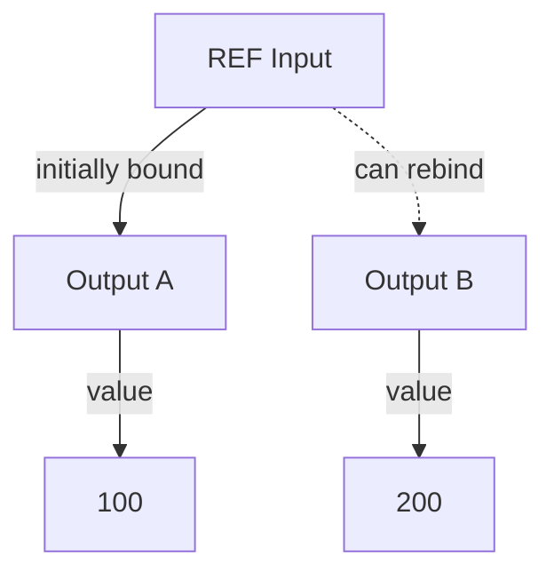

### 9.4 Reference Operations

```python
# Reading through reference
ref.value               # Value of target
ref.modified            # True if ref changed or target modified
ref.valid               # True if bound to valid target

# Output operations (binding)
ref_output.value = output_ts    # Bind to a time-series
ref_output.invalidate()         # Unbind
```

### 9.5 Two Modification Conditions

A REF is considered modified when:
1. **Reference changed**: The binding to a different target
2. **Target modified**: The bound target's value changed

```python
if ref.modified:
    # Either we're now looking at different data,
    # or the data we're looking at changed
    new_value = ref.value
```

### 9.6 Use Cases

```python
@graph
def dynamic_source(selector: TS[str], sources: TSD[str, TS[float]]) -> TS[float]:
    """Select which source to read based on selector."""
    return sample(selector, sources[selector])  # Returns REF
```

---

## 10. Validity Semantics

### 10.1 Validity Rules

| Type | `valid` | `all_valid` |
|------|---------|-------------|
| TS[T] | Has value | Same as valid |
| TSB | At least one field valid | All fields valid |
| TSL | At least one element valid | All elements valid |
| TSD | Always true (empty is valid) | All values valid |
| TSS | Always true (empty is valid) | Same as valid |
| TSW | Has at least one value | Same as valid |
| REF | Bound and target valid | Target all_valid |

### 10.2 Validity Propagation

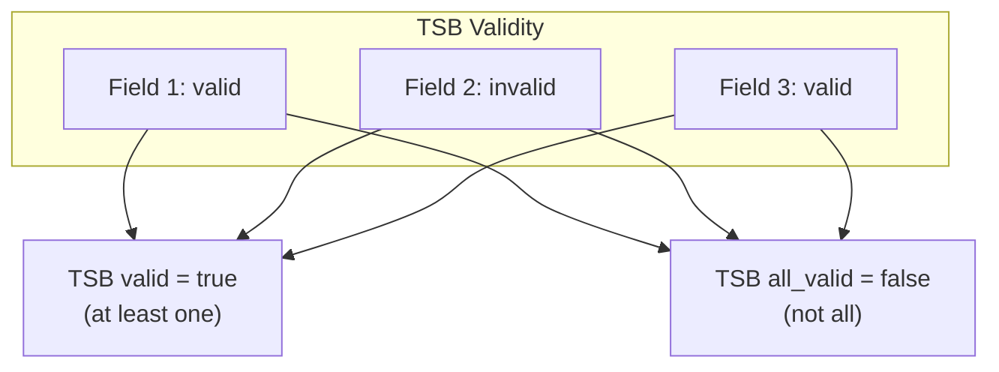

---

## 11. Delta Value Semantics

### 11.1 Delta Types by Time-Series

| Type | Delta Type | Contents |
|------|------------|----------|
| TS[T] | `T` | Same as value |
| TSB | `dict` | Only modified field values |
| TSL | `dict[int, T]` | Index to modified value |
| TSD | `TSDDelta` | added, removed, modified |
| TSS | `TSSDelta` | added, removed |
| TSW | `tuple[T, ...]` | Values added this tick |
| REF | varies | Delta of target |

### 11.2 Delta Accumulation

Within a single tick, multiple modifications accumulate:

```python
# Multiple modifications in one tick
output.value = 10
output.value = 20
output.value = 30
# delta_value = 30 (final value)

# For collections
tsd["a"] = 1
tsd["a"] = 2
del tsd["a"]
tsd["a"] = 3
# Result: {"a": 3} with "a" in modified (not added, since it existed before this tick's changes)
```

---

## 12. Input/Output Architecture

### 12.1 Overview

Each time-series type has distinct Input and Output implementations:

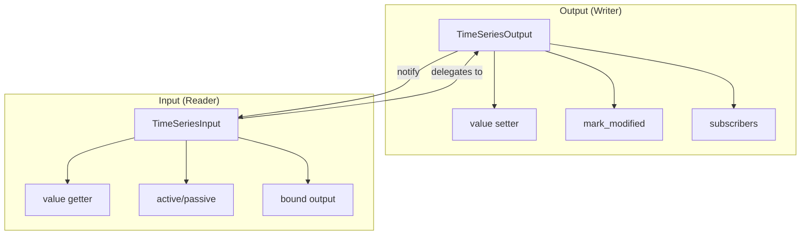

### 12.2 Input Properties

Inputs are readers that delegate to their bound output:

| Property | Description |
|----------|-------------|
| `value` | Returns `output.value` if bound |
| `delta_value` | Returns `output.delta_value` if bound |
| `modified` | True if output modified OR input was sampled (rebound) |
| `valid` | True if bound AND output is valid |
| `bound` | True if connected to an output |
| `active` | True if subscribed to output changes |

**Sampling Semantics:**

When an input is bound during node execution, it records a "sample time":

```python
# If a node rebinds an input during execution:
input.bind_output(new_output)
# Then input.modified returns True (even if output not modified)
# This ensures the node sees the binding change
```

### 12.3 Output Properties

Outputs are writers that hold actual values and notify subscribers:

| Property | Description |
|----------|-------------|
| `value` | Current point-in-time value (settable) |
| `delta_value` | Change/event this tick |
| `modified` | True if `last_modified_time == current_evaluation_time` |
| `valid` | True if `last_modified_time > MIN_DT` |
| `last_modified_time` | Datetime of last modification |

### 12.4 Active vs Passive Subscriptions

```python
@compute_node
def my_node(
    price: TS[float],           # Active by default - triggers node
    quantity: TS[int] = None,   # Optional, passive
) -> TS[float]:
    # Node evaluates when price changes
    # quantity is available but doesn't trigger evaluation
    qty = quantity.value if quantity.valid else 1
    return price.value * qty
```

**State Transitions:**

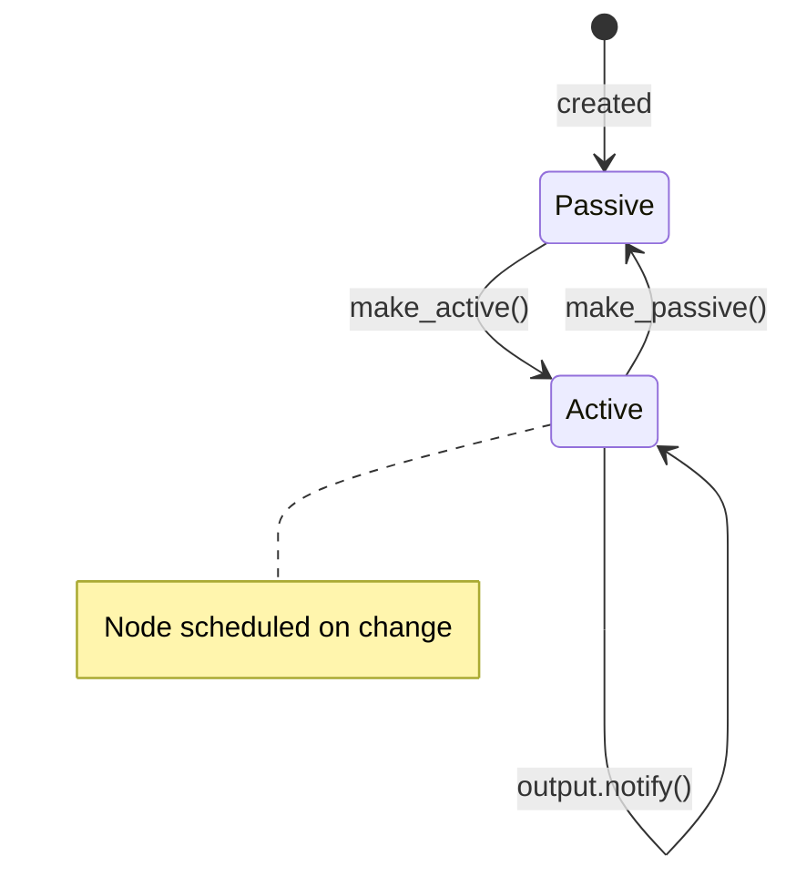

---

## 13. Setting Values on Outputs

### 13.1 Scalar Time-Series (TS[T])

For simple scalar types, setting value directly marks the output as modified:

```python
@compute_node
def process(ts: TS[int]) -> TS[int]:
    return ts.value * 2  # Return value sets output.value
```

**Direct value setting:**

```python
output.value = 42           # Sets value, marks modified
output.value = None         # Invalidates the output
output.apply_result(value)  # Sets if value is not None
```

**Delta behavior:** For TS[T], `delta_value` equals `value` (the change IS the value).

### 13.2 Time-Series Bundle (TSB)

TSB values can be set field-by-field or as a whole:

**Method 1: Return Dictionary (Recommended)**

```python
@compute_node(valid=[])  # valid=[] means node runs even without all inputs valid
def create_bundle(x: TS[int], y: TS[str]) -> TSB[MySchema]:
    out = {}
    if x.modified:
        out["x"] = x.value
    if y.modified:
        out["y"] = y.value
    return out  # Only modified fields in dict
```

**Method 2: Return CompoundScalar**

```python
@dataclass
class MyScalar(CompoundScalar):
    x: int
    y: str

@compute_node
def create_from_scalar(x: TS[int], y: TS[str]) -> TSB[MyScalar]:
    return MyScalar(x=x.value, y=y.value)
```

**Delta behavior:** `delta_value` returns dict of only modified fields:

```python
# If only 'x' was set this tick:
tsb.delta_value  # {"x": 42}  - 'y' not included

# Full value includes all valid fields:
tsb.value  # {"x": 42, "y": "hello"} or MyScalar(x=42, y="hello")
```

### 13.3 Time-Series Dictionary (TSD)

TSD supports dynamic key addition, update, and removal:

**Adding/Updating Keys:**

```python
@compute_node
def update_prices(symbol: TS[str], price: TS[float]) -> TSD[str, TS[float]]:
    return {symbol.value: price.value}  # Adds or updates key
```

**Removing Keys with REMOVE:**

```python
from hgraph import REMOVE, REMOVE_IF_EXISTS

@compute_node
def manage_positions(
    symbol: TS[str],
    action: TS[str],
    qty: TS[int]
) -> TSD[str, TS[int]]:
    if action.value == "close":
        return {symbol.value: REMOVE}  # Remove key (error if missing)
    elif action.value == "close_if_exists":
        return {symbol.value: REMOVE_IF_EXISTS}  # Safe removal
    else:
        return {symbol.value: qty.value}  # Add/update
```

**REMOVE Sentinel Behavior:**

| Sentinel | Key Exists | Key Missing |
|----------|------------|-------------|
| `REMOVE` | Removes key | Raises error |
| `REMOVE_IF_EXISTS` | Removes key | No-op |

**Delta behavior:**

```python
# After adding "a": 10, updating "b": 20, removing "c":
tsd.delta_value  # frozendict({"a": 10, "b": 20, "c": REMOVE})
```

### 13.4 Time-Series List (TSL)

TSL uses index-based assignment with fixed size:

```python
@compute_node
def create_coords(x: TS[float], y: TS[float], z: TS[float]) -> TSL[TS[float], Size[3]]:
    out = {}
    if x.modified:
        out[0] = x.value
    if y.modified:
        out[1] = y.value
    if z.modified:
        out[2] = z.value
    return out  # Dict with modified indices only
```

**Alternative: Tuple/List assignment (all elements):**

```python
return (x.value, y.value, z.value)  # Sets all three
```

**Delta behavior:**

```python
# If only index 0 was modified:
tsl.delta_value  # {0: 1.5}  - Only modified indices
```

### 13.5 Time-Series Set (TSS)

TSS tracks set membership with add/remove delta tracking:

**Method 1: SetDelta (Explicit)**

```python
from hgraph import set_delta

@compute_node
def manage_tags(add_tag: TS[str], remove_tag: TS[str]) -> TSS[str]:
    added = {add_tag.value} if add_tag.modified else frozenset()
    removed = {remove_tag.value} if remove_tag.modified else frozenset()
    return set_delta(added=added, removed=removed, tp=str)
```

**Method 2: Removed Marker**

```python
from hgraph import Removed

@compute_node
def update_tags(tag: TS[str], active: TS[bool]) -> TSS[str]:
    if active.value:
        return [tag.value]           # Add element
    else:
        return [Removed(tag.value)]  # Remove element
```

**Method 3: Full Set Replacement**

```python
@compute_node
def set_all_tags(tags: TS[tuple[str, ...]]) -> TSS[str]:
    return frozenset(tags.value)  # Computes delta automatically
```

**Delta behavior:**

```python
# SetDelta contains added and removed sets:
tss.delta_value.added    # Elements added this tick
tss.delta_value.removed  # Elements removed this tick
```

---

## 14. Delta Value Creation

### 14.1 How Delta Values Are Computed

Each type computes delta values differently:

**TS[T] (Scalar):**
```python
@property
def delta_value(self):
    return self._value  # Delta IS the value
```

**TSB (Bundle):**
```python
@property
def delta_value(self):
    # Only modified AND valid fields
    return {k: ts.delta_value for k, ts in self.items() if ts.modified and ts.valid}
```

**TSD (Dictionary):**
```python
@property
def delta_value(self):
    return frozendict(chain(
        # Modified values
        ((k, v.delta_value) for k, v in self.items() if v.modified and v.valid),
        # Removed keys
        ((k, REMOVE) for k in self.removed_keys()),
    ))
```

**TSL (List):**
```python
@property
def delta_value(self):
    # Dict of modified indices
    return {i: ts.delta_value for i, ts in enumerate(self._ts_values) if ts.modified}
```

**TSS (Set):**
```python
@property
def delta_value(self):
    # SetDelta with added/removed
    return set_delta(self._added, self._removed, self._tp)
```

### 14.2 Delta Composition for Nested Types

For nested structures (e.g., `TSD[str, TSB[Schema]]`), deltas compose recursively:

```python
# Outer TSD delta:
{
    "key1": {"field_a": 10},  # Inner TSB delta (only modified fields)
    "key2": REMOVE,           # Key removed
}
```

### 14.3 Modification Tracking

Modification is tracked via timestamp comparison:

```python
# Output marks modification:
def mark_modified(self, modified_time=None):
    if modified_time is None:
        modified_time = self.owning_graph.evaluation_clock.evaluation_time
    self._last_modified_time = modified_time
    self._notify(modified_time)  # Notify subscribers

# Modified check:
@property
def modified(self) -> bool:
    return self._last_modified_time == self.evaluation_clock.evaluation_time
```

### 14.4 Parent Chain Notification

For nested outputs (bundle fields, collection elements), modifications propagate up:

```python
# Child output marks parent as modified:
def mark_modified(self, modified_time=None):
    # ... set own modified time ...
    if self.has_parent_output:
        self._parent_or_node.mark_child_modified(self, modified_time)
    self._notify(modified_time)
```

This enables fine-grained tracking where only the specific modified paths trigger downstream nodes.

---

## 15. Type Conversion

### 15.1 Scalar to Time-Series

```python
const(5)                # int -> TS[int]
const("hello")          # str -> TS[str]
const(MyData(...))      # MyData -> TS[MyData]
```

### 15.2 Collection to Time-Series

```python
const({"a": 1, "b": 2}, TSD[str, TS[int]])   # dict -> TSD
const([1, 2, 3], TSL[TS[int], Size[3]])      # list -> TSL
const({1, 2, 3}, TSS[int])                   # set -> TSS
```

### 15.3 Time-Series Unwrapping

```python
collect(tsd, max_size=100)   # TSD -> TS[dict]
to_list(tsl)                 # TSL -> TS[tuple]
to_set(tss)                  # TSS -> TS[frozenset]
```

---

## 16. Reference Locations

| Type | Python Location | C++ Location |
|------|-----------------|--------------|
| TS | `hgraph/_impl/_types/_ts.py` | `cpp/include/hgraph/types/time_series/` |
| TSB | `hgraph/_impl/_types/_tsb.py` | `cpp/include/hgraph/types/time_series/` |
| TSL | `hgraph/_impl/_types/_tsl.py` | `cpp/include/hgraph/types/time_series/` |
| TSD | `hgraph/_impl/_types/_tsd.py` | `cpp/include/hgraph/types/time_series/` |
| TSS | `hgraph/_impl/_types/_tss.py` | `cpp/include/hgraph/types/time_series/` |
| TSW | `hgraph/_impl/_types/_tsw.py` | `cpp/include/hgraph/types/time_series/` |
| REF | `hgraph/_impl/_types/_ref.py` | `cpp/include/hgraph/types/time_series/` |

---

## 17. Next Steps

Continue to:
- [06_NODE_TYPES.md](06_NODE_TYPES.md) - Node specifications
- [07_OPERATORS.md](07_OPERATORS.md) - Built-in operators

