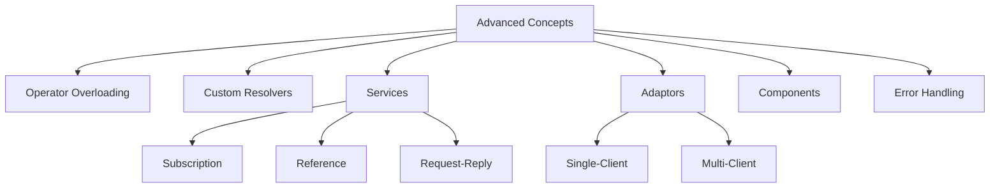
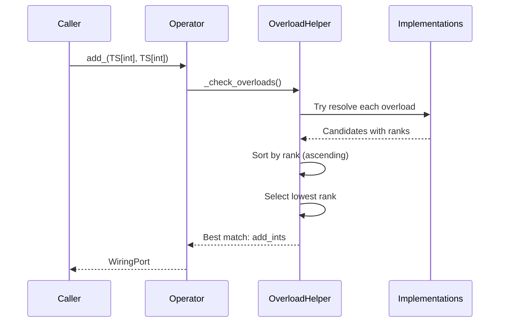
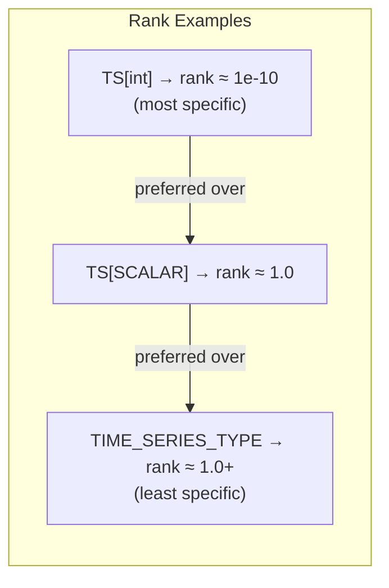
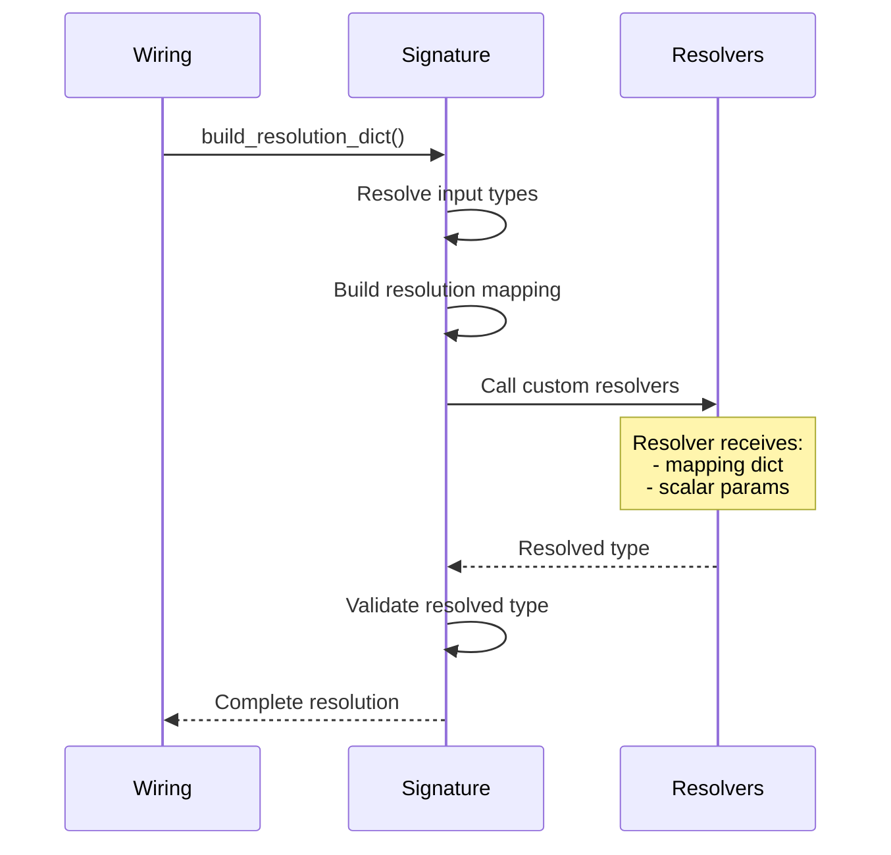
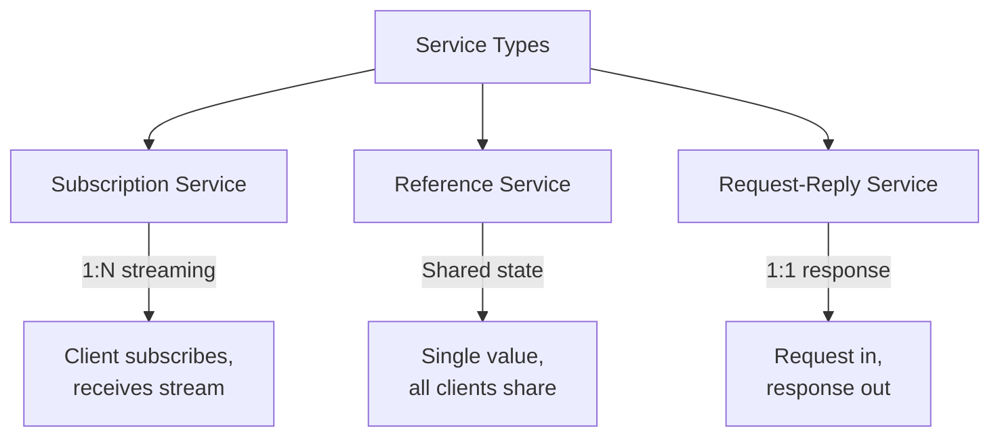
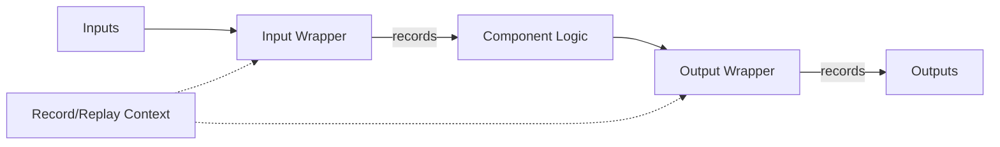

# HGraph Language Design Specification
## Part VIII: Advanced Concepts

**Version:** 1.0 Draft
**Last Updated:** 2025-12-20

---

## 1. Introduction

This document covers advanced HGraph concepts including:

- Operator overloading and resolution
- Custom type resolvers
- Services (subscription, reference, request-reply)
- Adaptors (single-client and multi-client)
- Components
- Error handling



---

## 2. Operator Overloading

### 2.1 The @operator Decorator

The `@operator` decorator defines a polymorphic operation signature without implementation:

```python
@operator
def add_(lhs: TIME_SERIES_TYPE, rhs: TIME_SERIES_TYPE_1) -> DEFAULT[OUT]:
    """This represents the ``+`` operator for time series types."""
```

**Key Characteristics:**
- Creates an `OperatorWiringNodeClass` instance
- Function body is empty (`...` or `pass`)
- Defines generic type parameters that implementations can specialize
- Does NOT enforce exact signature matching (template-like behavior)

### 2.2 Registering Overloads

Implementations register via the `overloads` parameter:

```python
@compute_node(overloads=add_)
def add_ints(lhs: TS[int], rhs: TS[int]) -> TS[int]:
    return lhs.value + rhs.value

@compute_node(overloads=add_)
def add_floats(lhs: TS[float], rhs: TS[float]) -> TS[float]:
    return lhs.value + rhs.value

@compute_node(overloads=add_)
def add_generic(lhs: TS[SCALAR], rhs: TS[SCALAR]) -> TS[SCALAR]:
    return lhs.value + rhs.value  # Fallback for any scalar
```

### 2.3 Overload Resolution



**Resolution Algorithm:**

1. **Collect Candidates:** Try to resolve each overload's signature against provided arguments
2. **Calculate Ranks:** Each candidate receives a rank based on type specificity
3. **Select Best:** Choose the candidate with the lowest rank (most specific)

| Outcome | Action |
|---------|--------|
| One clear winner | Use that overload |
| Multiple same rank | Raise ambiguity error |
| No candidates | Raise "no overload found" error |

### 2.4 Generic Rank System

The rank quantifies type specificity. Lower rank = more specific = preferred.



**Rank Calculation:**

```python
def _calc_rank(signature: WiringNodeSignature) -> float:
    if signature.node_type == WiringNodeType.OPERATOR:
        return 1e6  # Operators themselves have lowest priority

    ranks = []
    for k, t in signature.input_types.items():
        if signature.defaults.get(k) != AUTO_RESOLVE:
            if t.is_scalar:
                rank = scale_rank(t.generic_rank, 0.001)  # Scalars scaled down
            elif k in (signature.var_arg, signature.var_kwarg):
                rank = scale_rank(t.generic_rank, 100.0)  # Var args scaled up
            else:
                rank = t.generic_rank  # Time-series get full rank
            ranks.append(rank)

    return sum(combine_ranks(ranks).values())
```

**Type Rank Values:**

| Type | Rank | Notes |
|------|------|-------|
| Concrete (`int`, `str`) | ~1e-10 | Very specific |
| TypeVar (`SCALAR`) | ~1.0 | Generic |
| `TIME_SERIES_TYPE` | ~1.0 | Generic |
| Nested generics | Scaled | Combines inner ranks |

### 2.5 Python Operator Mapping

Operators are mapped to Python special methods:

```python
WiringPort.__add__ = lambda x, y: add_(x, y)
WiringPort.__sub__ = lambda x, y: sub_(x, y)
WiringPort.__mul__ = lambda x, y: mul_(x, y)
# ... etc
```

---

## 3. Custom Resolvers

### 3.1 AUTO_RESOLVE Sentinel

`AUTO_RESOLVE` marks parameters that should be automatically resolved from input types:

```python
AUTO_RESOLVE = object()  # Sentinel value

@compute_node
def my_node(ts: TS[SCALAR], _tp: type[SCALAR] = AUTO_RESOLVE) -> TS[SCALAR]:
    # _tp will be automatically resolved to the actual SCALAR type
    return ts.value
```

**Usage Pattern:**
- Used as default value for type parameters
- Wiring system resolves actual type from TypeVar resolution
- Common for extracting types from resolved inputs

### 3.2 Custom Resolver Functions

The `resolvers` parameter provides custom type resolution logic:

```python
@compute_node(resolvers={SCALAR: lambda mapping, attr: mapping[COMPOUND_SCALAR].meta_data_schema[attr].py_type})
def getattr_cs(ts: TS[COMPOUND_SCALAR], attr: str, default: TS[SCALAR] = None) -> TS[SCALAR]:
    return getattr(ts.value, attr, default.value)
```

### 3.3 Resolver Function Signatures

**Style 1: Single Parameter**
```python
lambda mapping: resolved_type
```
Resolver receives only the resolution mapping dictionary.

**Style 2: Multiple Parameters**
```python
lambda mapping, param1, param2: resolved_type
```
Resolver receives mapping plus named scalar parameters from the function.

### 3.4 Resolution Process



### 3.5 Resolver Examples

**Attribute Type Resolution:**
```python
@compute_node(
    resolvers={SCALAR: lambda mapping, attr: mapping[COMPOUND_SCALAR].meta_data_schema[attr].py_type}
)
def getattr_cs(ts: TS[COMPOUND_SCALAR], attr: str) -> TS[SCALAR]:
    return getattr(ts.value, attr)
```

**Function Return Type:**
```python
@compute_node(
    resolvers={TIME_SERIES_TYPE: lambda m, fn: TS[fn.__annotations__["return"]]}
)
def apply(fn: TS[Callable], *args) -> DEFAULT[TIME_SERIES_TYPE]:
    return fn.value(*args)
```

**Array Dimension Reduction:**
```python
def _get_item_resolver(m, idx):
    arr = m[ARRAY].py_type
    dimensions = extract_dimensions_from_array(arr)
    if len(dimensions) == len(idx):
        return TS[extract_scalar(arr)]  # Full index → scalar
    else:
        return TS[Array[scalar, *remaining_dims]]  # Partial → smaller array

@compute_node(overloads=get_item, resolvers={OUT: _get_item_resolver})
def get_item_int(ts: TS[ARRAY], idx: int) -> OUT:
    return ts.value[idx]
```

---

## 4. Services

Services enable request-reply and publish-subscribe patterns within HGraph.

### 4.1 Service Types Overview



### 4.2 Subscription Service

A streaming service where clients subscribe with keys and receive ongoing updates.

**Definition:**
```python
@subscription_service
def price_feed(path: str | None, symbol: TS[str]) -> TS[float]:
    """Subscribe to price updates for a symbol."""
```

**Implementation:**
```python
@service_impl(interface=price_feed)
def price_feed_impl(symbol: TSD[RequesterId, TS[str]]) -> TSD[RequesterId, TS[float]]:
    """Implementation receives multiplexed requests, returns multiplexed responses."""
    # Requests keyed by RequesterId
    # Responses keyed by same RequesterId
```

**Characteristics:**
- Clients identified by `RequesterId`
- Inputs multiplexed as `TSD[RequesterId, TS[input_type]]`
- Outputs multiplexed as `TSD[RequesterId, TS[output_type]]`

### 4.3 Reference Service

A service producing a single shared value independent of requesters.

**Definition:**
```python
@reference_service
def config_service(path: str | None) -> TS[Config]:
    """Get shared configuration."""
```

**Characteristics:**
- Single output shared by all clients
- Output type automatically wrapped as `REF[TIME_SERIES_TYPE]`
- Auto-binds to `ref_svc://<module>.<name>` if no path provided

### 4.4 Request-Reply Service

A synchronous request-response pattern with timeout handling.

**Definition:**
```python
@request_reply_service
def calculate(path: str | None, request: TS[CalcRequest]) -> TS[CalcResult]:
    """Submit calculation request, get result."""
```

**Response Type:**
```python
TSB[ReqRepResponse[TIME_SERIES_TYPE_1]]
# Contains:
#   result: TIME_SERIES_TYPE_1
#   time_out: TS[bool]
#   error: TS[str]
```

### 4.5 Service Registration

```python
from hgraph import register_service, default_path

# Register implementation for a path
register_service("my_path", my_impl, resolution_dict={...})

# Use default path
register_service(default_path, my_impl)
```

**Path Format:** `<service_type>://<path>/<function_name>`

---

## 5. Adaptors

Adaptors provide bidirectional connectivity between HGraph and external systems.

### 5.1 Single-Client Adaptor

For point-to-point external communication.

**Interface Definition:**
```python
@adaptor
def external_connection(data_out: TS[bytes]) -> TS[bytes]:
    """Send data out, receive data in."""
```

**Implementation:**
```python
@adaptor_impl(external_connection)
def tcp_adaptor(data_out: TS[bytes]) -> TS[bytes]:
    """TCP socket implementation."""
```

**Usage:**
```python
# Send to external system
external_connection.from_graph(path="tcp://host:port")(my_output)

# Receive from external system
incoming = external_connection.to_graph(path="tcp://host:port")()
```

### 5.2 Multi-Client Service Adaptor

For multiple concurrent client connections.

**Interface Definition:**
```python
@service_adaptor
def client_handler(request: TS[Request]) -> TS[Response]:
    """Handle multiple client requests."""
```

**Implementation:**
```python
@service_adaptor_impl(client_handler)
def client_handler_impl(request: TSD[ClientId, TS[Request]]) -> TSD[ClientId, TS[Response]]:
    """Implementation receives multiplexed by ClientId."""
```

**Characteristics:**
- Each client gets unique integer `ClientId`
- Requests combined as `TSD[ClientId, Request]`
- Responses multiplexed as `TSD[ClientId, Response]`

---

## 6. Components

Components are reusable graph building blocks with record/replay support.

### 6.1 Definition

```python
@component
def my_component(input1: TS[int], input2: TS[float]) -> TS[float]:
    """A reusable computation component."""
    processed = process(input1)
    return combine(processed, input2)
```

### 6.2 Characteristics

| Property | Description |
|----------|-------------|
| Inputs | Must have time-series inputs (required) |
| Output | Must have time-series output (required) |
| Record/Replay | Automatic wrapper for input/output recording |
| References | Inputs/outputs converted to reference form |
| Nesting | `has_nested_graphs = True` |

### 6.3 Record/Replay Integration



---

## 7. Error Handling

### 7.1 try_except Pattern

Wraps graphs with exception catching:

```python
from hgraph import try_except

result = try_except(risky_node, input_ts, __trace_back_depth__=2)
# result: TSB[TryExceptResult[output_type]]
```

**Result Schema:**
```python
class TryExceptResult(TimeSeriesSchema):
    exception: TS[NodeError]
    out: TIME_SERIES_TYPE
```

### 7.2 Parameters

| Parameter | Description |
|-----------|-------------|
| `__trace_back_depth__` | Stack frames to capture (default: 1) |
| `__capture_values__` | Capture input values in traceback (default: False) |

### 7.3 Exception Output by Node Type

| Node Type | Exception Output |
|-----------|------------------|
| compute_node | `TSB[TryExceptResult[output_type]]` |
| sink_node | `TS[NodeError]` |
| TSD map | `TSB[TryExceptTsdMapResult]` |

### 7.4 NodeError Type

```python
class NodeError:
    """Contains exception information from node evaluation."""
    exception_type: type
    message: str
    traceback: str
    input_values: dict | None  # If __capture_values__=True
```

---

## 8. Reference Locations

| Concept | Python Location |
|---------|-----------------|
| @operator | `hgraph/_wiring/_decorators.py` |
| OperatorWiringNodeClass | `hgraph/_wiring/_wiring_node_class/_operator_wiring_node.py` |
| Generic Rank | `hgraph/_types/_generic_rank_util.py` |
| AUTO_RESOLVE | `hgraph/_types/_type_meta_data.py` |
| Custom Resolvers | `hgraph/_wiring/_wiring_node_signature.py` |
| @subscription_service | `hgraph/_wiring/_decorators.py` |
| @reference_service | `hgraph/_wiring/_decorators.py` |
| @request_reply_service | `hgraph/_wiring/_decorators.py` |
| @service_impl | `hgraph/_wiring/_decorators.py` |
| @adaptor | `hgraph/_wiring/_decorators.py` |
| @service_adaptor | `hgraph/_wiring/_decorators.py` |
| @component | `hgraph/_wiring/_wiring_node_class/_component_node_class.py` |
| try_except | `hgraph/_wiring/_exception_handling.py` |
| NodeError | `hgraph/_types/_error_type.py` |

---

## 9. Next Steps

Continue to:
- [09_CONTROL_FLOW.md](09_CONTROL_FLOW.md) - Control flow constructs
- [10_DATA_SOURCES.md](10_DATA_SOURCES.md) - Data source patterns

