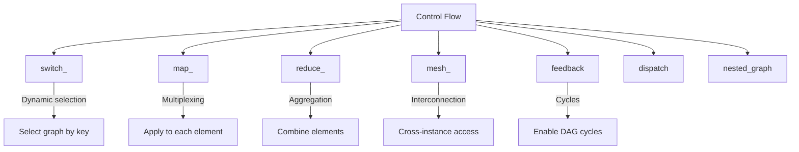
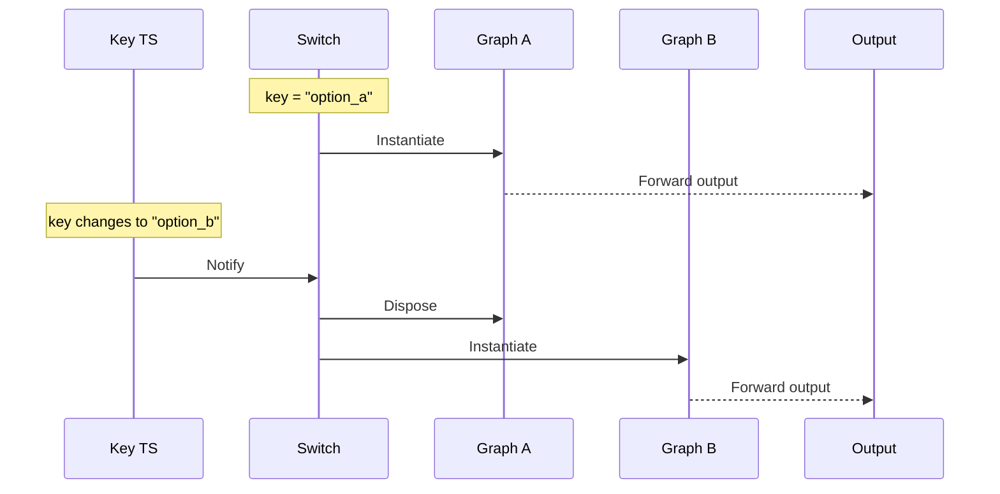
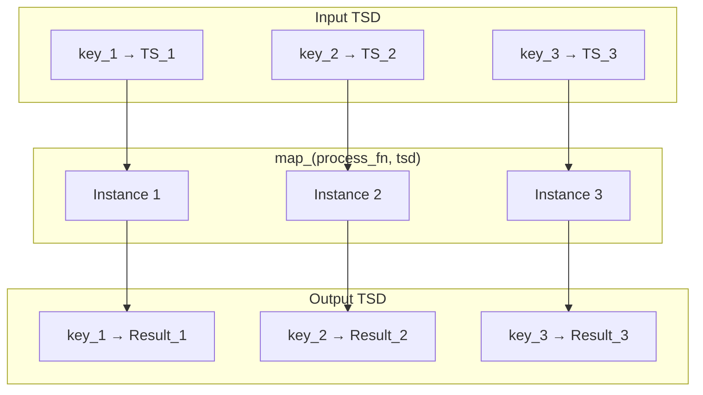
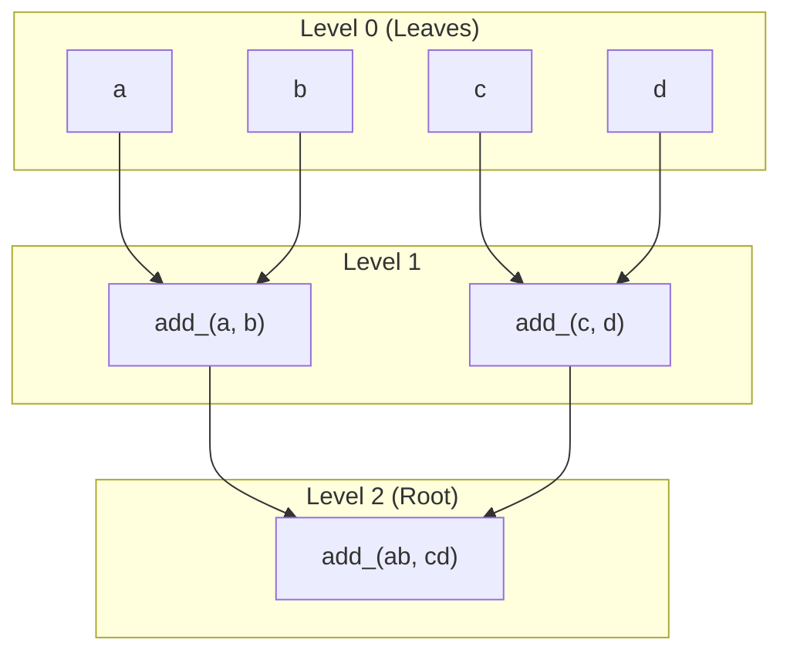
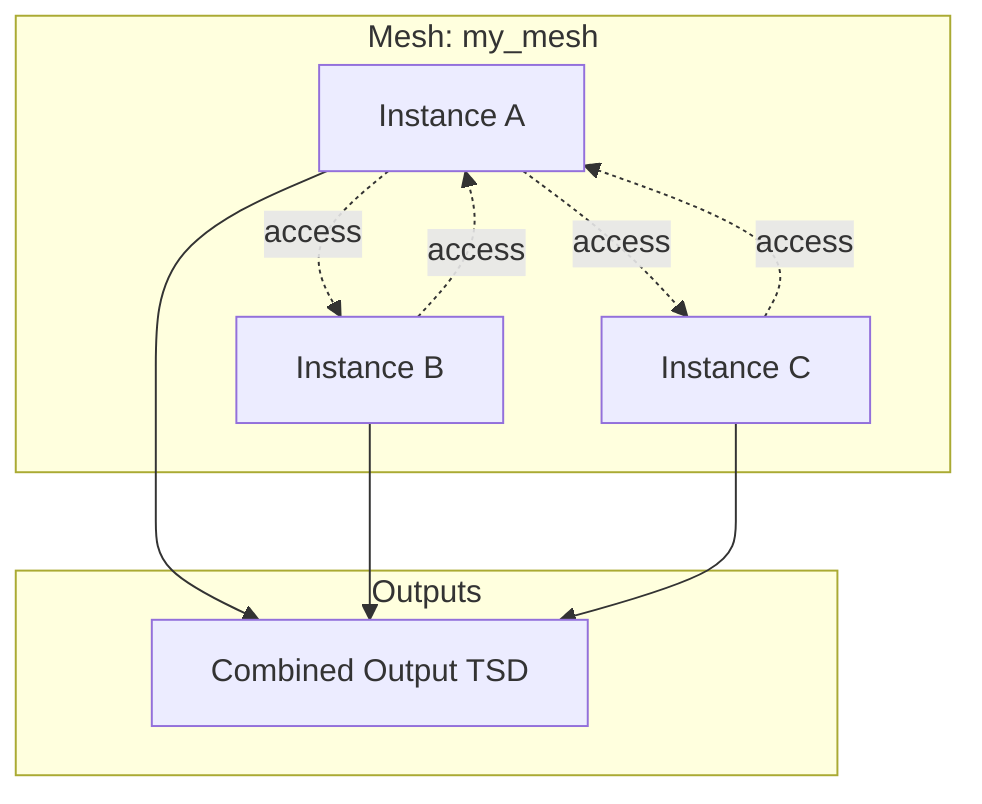
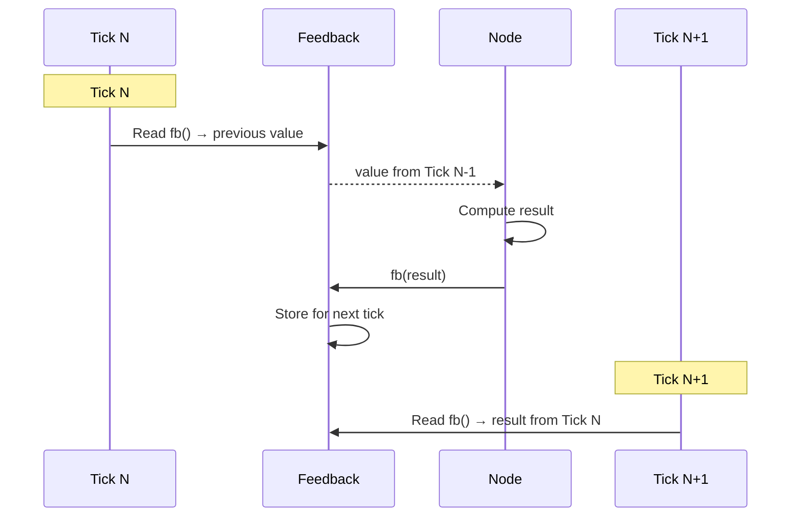

# HGraph Language Design Specification
## Part IX: Control Flow

**Version:** 1.0 Draft
**Last Updated:** 2025-12-20

---

## 1. Introduction

HGraph provides several control flow constructs for dynamic graph composition and data routing:



---

## 2. switch_ (Dynamic Graph Selection)

### 2.1 Overview

`switch_` dynamically selects and instantiates graphs based on a key value:

```python
result = switch_(
    key,                    # TS[SCALAR] - selection key
    {
        "option_a": graph_a,
        "option_b": graph_b,
        DEFAULT: fallback_graph,
    },
    *args, **kwargs
)
```

### 2.2 Execution Model



### 2.3 Parameters

| Parameter | Type | Description |
|-----------|------|-------------|
| `key` | `TS[SCALAR]` | Selection key (must be scalar time-series) |
| `cases` | `dict[SCALAR, Callable]` | Mapping of key values to graph functions |
| `reload_on_ticked` | `bool` | Reload graph when key ticks (default: False) |
| `*args, **kwargs` | any | Arguments passed to selected graph |

### 2.4 DEFAULT Marker

Use `DEFAULT` for catch-all case:

```python
from hgraph import switch_, DEFAULT

result = switch_(key, {
    "known": known_handler,
    DEFAULT: unknown_handler,  # Matches any other value
}, input_ts)
```

### 2.5 Key as Graph Argument

The selected graph can optionally receive the key as its first argument:

```python
@graph
def handler(key: TS[str], data: TS[int]) -> TS[str]:
    return format_("{}: {}", key, data)

result = switch_(key, {"a": handler, "b": handler}, data)
```

---

## 3. map_ (Multiplexed Computation)

### 3.1 Overview

`map_` applies a graph/node to each element of a collection:

```python
# Apply to TSD
result = map_(process_fn, tsd_input)  # TSD[K, TS[V]] -> TSD[K, TS[W]]

# Apply to TSL
result = map_(process_fn, tsl_input)  # TSL[TS[V], Size] -> TSL[TS[W], Size]
```

### 3.2 Execution Model



### 3.3 Automatic Key Management

- Instances created automatically when keys added
- Instances disposed when keys removed
- Per-key state maintained independently

### 3.4 Input Markers

| Marker | Purpose |
|--------|---------|
| `no_key(tsd)` | Exclude from key inference |
| `pass_through(tsd)` | Prevent demultiplexing, pass whole TSD |

```python
# Pass whole TSD as context, demultiplex only prices
result = map_(
    calculate,
    prices,                    # Demultiplexed by key
    pass_through(config_tsd),  # Passed as-is to each instance
)
```

### 3.5 Explicit Key Control

```python
# Specify keys explicitly
result = map_(
    process_fn,
    __keys__=explicit_keys,     # TSS[SCALAR] of keys
    __key_arg__="symbol",       # Parameter name for key value
    data=prices,
)
```

### 3.6 Parameters

| Parameter | Type | Description |
|-----------|------|-------------|
| `func` | `Callable` | Graph/node to apply |
| `__keys__` | `TSS[SCALAR]` | Explicit key set (optional) |
| `__key_arg__` | `str` | Parameter name for key value |
| `__label__` | `str` | Label for debugging |

---

## 4. reduce_ (Collection Aggregation)

### 4.1 Overview

`reduce_` aggregates collection elements into a single value:

```python
total = reduce_(add_, prices, zero=const(0.0))
```

### 4.2 Reduction Strategies

| Strategy | Constraint | Performance |
|----------|------------|-------------|
| **Associative** | `(a + b) + c = a + (b + c)` | Tree-reduce (fast on changes) |
| **Non-associative** | Order matters | Linear reduce (TSL only) |

### 4.3 Tree-Reduce Algorithm



**Benefit:** When one element changes, only O(log N) nodes re-evaluate.

### 4.4 Parameters

| Parameter | Type | Description |
|-----------|------|-------------|
| `func` | `Callable` | Binary reduction function |
| `ts` | `TSD[K, V]` or `TSL[V, Size]` | Collection to reduce |
| `zero` | `TIME_SERIES_TYPE` | Identity element |
| `is_associative` | `bool` | Enable tree-reduce (default: True) |

### 4.5 Constraints

- **TSD:** Function must be commutative AND associative (order not guaranteed)
- **TSL:** Order preserved; non-associative functions allowed if `is_associative=False`

---

## 5. mesh_ (Interconnected Map)

### 5.1 Overview

`mesh_` creates a map where instances can access outputs of other instances:

```python
mesh_output = mesh_(
    process_fn,
    tsd_input,
    __name__="my_mesh",
)

# Access mesh from within process_fn:
@graph
def process_fn(data: TS[int]) -> TS[int]:
    mesh = get_mesh("my_mesh")
    other_value = mesh.out["other_key"]  # Access other instance's output
    return data + other_value
```

### 5.2 Execution Model



### 5.3 Parameters

| Parameter | Type | Description |
|-----------|------|-------------|
| `func` | `Callable` | Graph to instantiate |
| `__name__` | `str` | Mesh identifier for `get_mesh()` |

### 5.4 Accessing Mesh

```python
from hgraph import get_mesh

mesh = get_mesh("my_mesh")
other_output = mesh.out[other_key]  # REF to other instance's output
```

### 5.5 Restrictions

- TSD inputs only (TSL not supported)
- Cross-instance access is by reference (REF)
- Careful with circular dependencies

---

## 6. feedback (Cycle Creation)

### 6.1 Overview

`feedback` enables cycles in the otherwise DAG-based graph:

```python
fb = feedback(TS[int], default=0)
result = accumulator(input_ts, fb())  # Use feedback value
fb(result)                            # Bind output to feedback
```

### 6.2 Execution Model



### 6.3 Parameters

| Parameter | Type | Description |
|-----------|------|-------------|
| `tp_or_wp` | `type[TIME_SERIES_TYPE]` or `WiringPort` | Type or existing port |
| `default` | `SCALAR` | Initial value (before first feedback) |

### 6.4 Usage Pattern

```python
@graph
def running_sum(values: TS[int]) -> TS[int]:
    fb = feedback(TS[int], default=0)
    total = values + fb()  # Add current value to running total
    fb(total)              # Feed total back
    return total
```

### 6.5 Best Practices

| Practice | Reason |
|----------|--------|
| Mark feedback inputs as passive | Prior cycle values shouldn't trigger re-evaluation |
| Use explicit default values | Ensures defined behavior on first tick |
| Avoid multiple feedback bindings | Each feedback should have single writer |

---

## 7. dispatch (Runtime Type Dispatch)

### 7.1 Overview

`dispatch` selects overloads based on runtime type information:

```python
@dispatch
def process(item: TS[BaseType]) -> TS[str]:
    """Dispatch based on actual type of item."""

@graph(overloads=process)
def process_type_a(item: TS[TypeA]) -> TS[str]:
    return "Type A"

@graph(overloads=process)
def process_type_b(item: TS[TypeB]) -> TS[str]:
    return "Type B"
```

### 7.2 Runtime Selection

```mermaid
graph TD
    IN[Input: TS[BaseType]]
    D[dispatch]

    D --> |"TypeA"| OA[process_type_a]
    D --> |"TypeB"| OB[process_type_b]
    D --> |"BaseType"| OD[Default Handler]

    IN --> D
```

### 7.3 Parameters

| Parameter | Type | Description |
|-----------|------|-------------|
| `fn` | `Callable` | Base dispatch signature |
| `on` | `Tuple[str, ...]` | Parameter names to dispatch on |

### 7.4 dispatch_ Function

For inline dispatch without decorator:

```python
result = dispatch_(overloaded_fn, input_ts, __on__=("item",))
```

---

## 8. nested_graph (Reference-Based Composition)

### 8.1 Overview

`nested_graph` wraps a graph with reference-based inputs/outputs:

```python
result = nested_graph(my_graph, ref_input1, ref_input2)
```

### 8.2 Behavior

- All time-series inputs converted to `REF[TIME_SERIES_TYPE]`
- Output converted to `REF[TIME_SERIES_TYPE]`
- Enables indirect coupling between graph components

---

## 9. lift (Scalar to Time-Series)

### 9.1 Overview

`lift` converts pure scalar functions into time-series compute nodes:

```python
# Original scalar function
def calculate(a: int, b: float) -> float:
    return a * b

# Lifted to time-series
ts_calculate = lift(calculate)
result = ts_calculate(ts_a, ts_b)  # TS[float]
```

### 9.2 Behavior

- Extracts `.value` from inputs when valid
- Returns `None` if any input invalid
- Wraps output as `TS[return_type]`

### 9.3 Parameters

| Parameter | Type | Description |
|-----------|------|-------------|
| `fn` | `Callable` | Scalar function to lift |
| `inputs` | `dict` | Override input types |
| `output` | `type` | Override output type |
| `active` | `Sequence` | Active input names |
| `valid` | `Sequence` | Required valid inputs |
| `dedup_output` | `bool` | Deduplicate output values |

---

## 10. Context (Time-Series Context Managers)

### 10.1 Overview

Context provides Python context manager support for time-series:

```python
with my_context_ts:
    value = get_context(MyContextType)
    # Use context value
```

### 10.2 Functions

| Function | Description |
|----------|-------------|
| `enter_ts_context(context)` | Enter context |
| `exit_ts_context(context)` | Exit context |
| `get_context(name, tp)` | Retrieve context value |
| `capture_context(path, ts, state)` | Capture context state |

---

## 11. Input Markers

### 11.1 Available Markers

| Marker | Purpose |
|--------|---------|
| `pass_through(tsd)` | Prevents demultiplexing in map_ |
| `no_key(tsd)` | Exclude from key inference |
| `passive(ts)` | Mark input as passive (non-driving) |

### 11.2 Usage

```python
result = map_(
    process_fn,
    active_input,           # Demultiplexed
    pass_through(shared),   # Passed as-is
    no_key(reference),      # Excluded from key inference
)
```

---

## 12. Reference Locations

| Construct | Python Location |
|-----------|-----------------|
| switch_ | `hgraph/_wiring/_switch.py` |
| map_ | `hgraph/_wiring/_map.py` |
| reduce_ | `hgraph/_wiring/_reduce.py` |
| mesh_ | `hgraph/_wiring/_mesh.py` |
| feedback | `hgraph/_runtime/_feedback.py` |
| dispatch | `hgraph/_wiring/_dispatch.py` |
| nested_graph | `hgraph/_wiring/_nested_graph.py` |
| lift | `hgraph/_wiring/_lift.py` |
| Context | `hgraph/_wiring/_context_wiring.py` |
| Markers | `hgraph/_wiring/_markers.py` |

---

## 13. Next Steps

Continue to:
- [10_DATA_SOURCES.md](10_DATA_SOURCES.md) - Data source patterns

