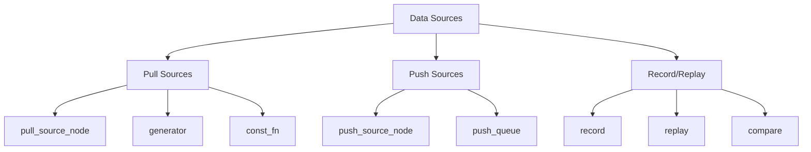
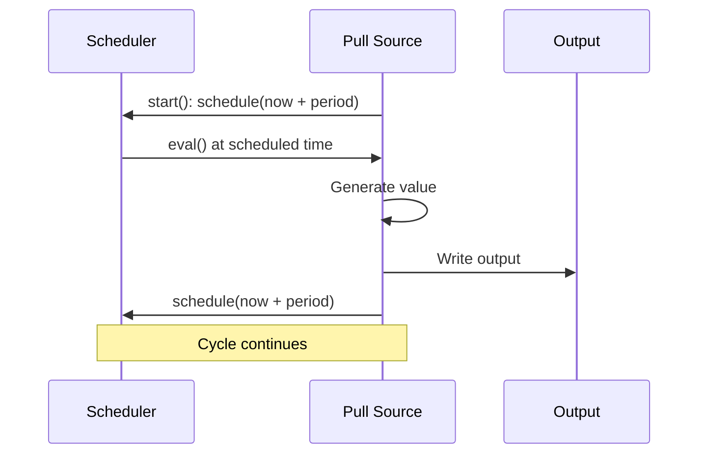
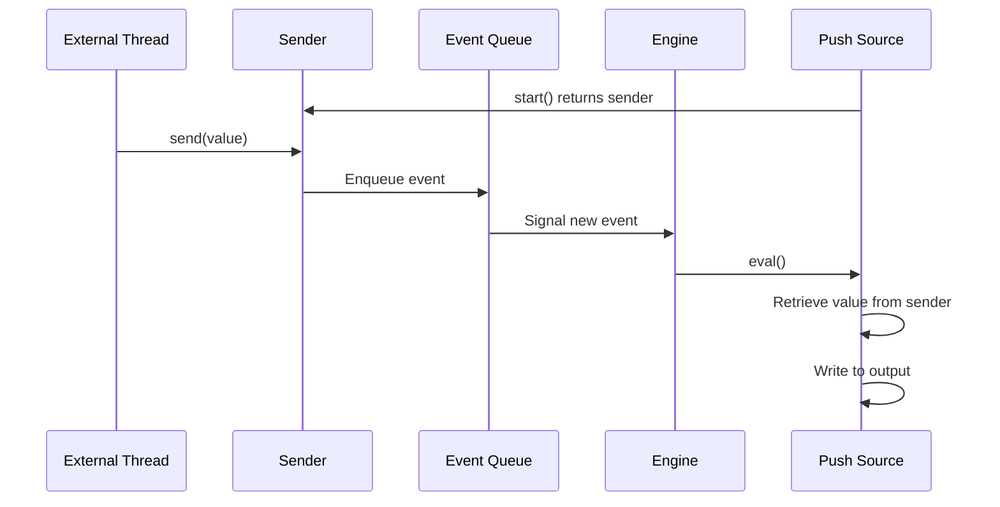
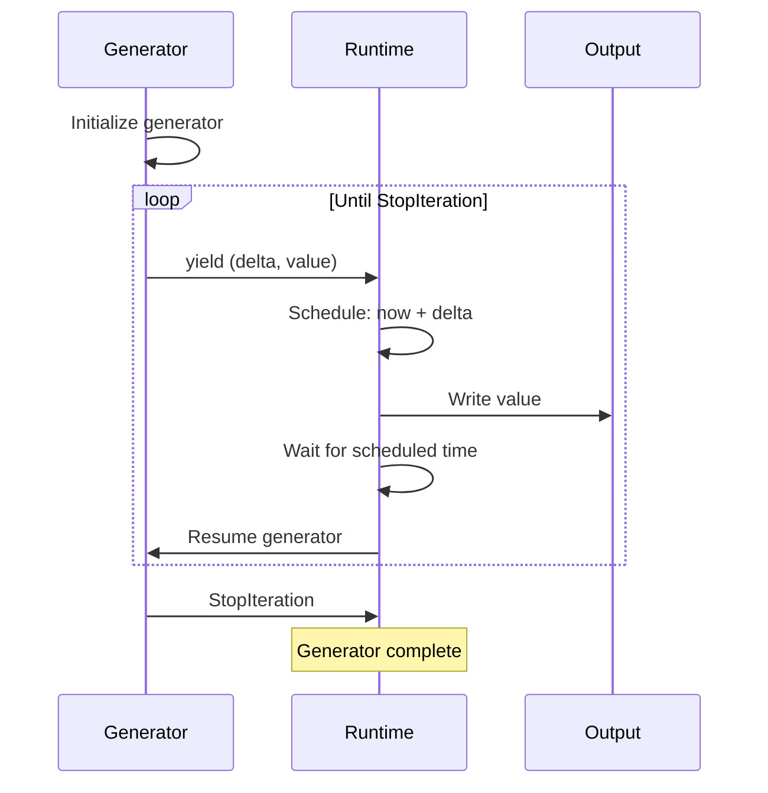
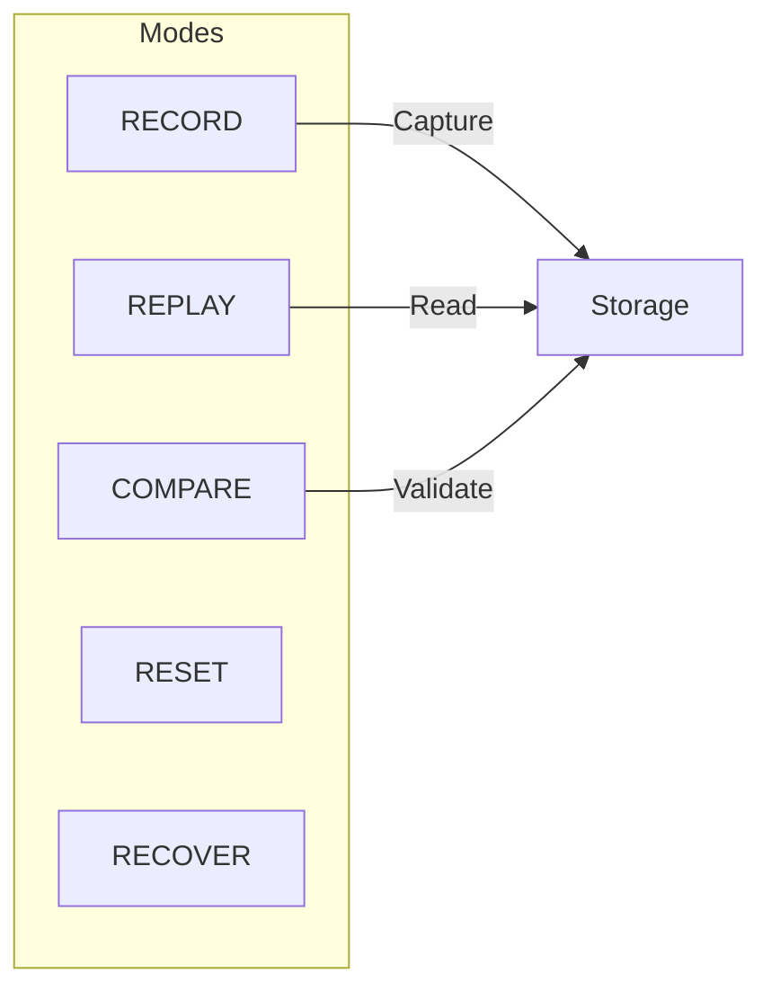
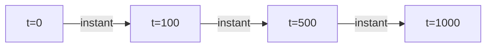
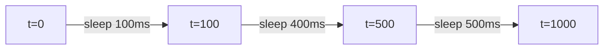

# HGraph Language Design Specification
## Part X: Data Sources and Record/Replay

**Version:** 1.0 Draft
**Last Updated:** 2025-12-20

---

## 1. Introduction

HGraph provides various mechanisms for data ingestion:



---

## 2. Pull Source Nodes

### 2.1 @pull_source_node Decorator

Pull sources generate data on demand, typically on a schedule:

```python
@pull_source_node
def clock_ticks(period: timedelta = timedelta(seconds=1)) -> TS[datetime]:
    """Emit current time periodically."""
    return datetime.now()
```

### 2.2 Scheduling Pattern



### 2.3 With Scheduler Access

```python
@pull_source_node
def scheduled_source(scheduler: SCHEDULER, interval: timedelta) -> TS[int]:
    scheduler.schedule(scheduler.now + interval)
    return generate_value()
```

### 2.4 Characteristics

| Property | Value |
|----------|-------|
| Inputs | Scalars only (no time-series) |
| Output | Required |
| Evaluation | Self-scheduled |
| Mode | Both simulation and real-time |

---

## 3. Push Source Nodes

### 3.1 @push_source_node Decorator

Push sources receive asynchronous external events:

```python
@push_source_node
def websocket_events() -> TS[str]:
    """Receive websocket messages."""
    ...
```

### 3.2 Sender Pattern



### 3.3 Characteristics

| Property | Value |
|----------|-------|
| Inputs | Scalars only (no time-series) |
| Output | Required |
| Evaluation | Triggered by external event |
| Mode | Real-time only (breaks simulation determinism) |

---

## 4. Generator

### 4.1 @generator Decorator

Generators create pull sources from Python generator functions:

```python
@generator
def signal() -> TS[bool]:
    while True:
        yield (timedelta(milliseconds=1), True)
```

### 4.2 Yield Format

Generator yields tuples of `(time_delta, value)`:

```python
@generator
def countdown(start: int) -> TS[int]:
    for i in range(start, 0, -1):
        yield (timedelta(seconds=1), i)
    yield (timedelta(seconds=1), 0)
    # Generator ends, source stops
```

### 4.3 Execution Model



### 4.4 Time Control

```python
@generator
def timed_events(scheduler: SCHEDULER) -> TS[str]:
    yield (timedelta(0), "start")
    scheduler.advance(timedelta(seconds=5))  # Skip ahead
    yield (timedelta(0), "after 5 seconds")
```

---

## 5. Push Queue

### 5.1 @push_queue Decorator

Push queues enable asynchronous external data injection:

```python
@push_queue(TS[int])
def external_values(sender: Callable[[int], None], interval: int = 100):
    """
    Start background process that calls sender(value) to inject data.
    """
    def background_loop():
        while True:
            value = fetch_external_value()
            sender(value)
            time.sleep(interval / 1000)

    threading.Thread(target=background_loop, daemon=True).start()
```

### 5.2 Usage

```python
# In graph
values = external_values(interval=50)

# External code can inject values via sender
```

### 5.3 Batch Mode

For high-throughput scenarios:

```python
@push_queue(TS[tuple[int, ...]], batch=True)
def batched_values(sender: Callable[[tuple[int, ...]], None]):
    def background():
        buffer = []
        while True:
            buffer.append(get_value())
            if len(buffer) >= 100:
                sender(tuple(buffer))
                buffer.clear()
    threading.Thread(target=background, daemon=True).start()
```

### 5.4 Parameters

| Parameter | Type | Description |
|-----------|------|-------------|
| `tp` | `type[TIME_SERIES_TYPE]` | Output type specification |
| `batch` | `bool` | Enable batching (output must be `TS[tuple[...]]`) |

---

## 6. const_fn

### 6.1 Overview

`const_fn` wraps pure scalar functions as time-series sources:

```python
@const_fn
def calculate(a: int, b: int) -> int:
    return a + b
```

### 6.2 Dual Usage

```python
# In graph context: returns TS[int]
result_ts = calculate(1, 2)

# Outside graph: returns scalar
result_scalar = calculate(1, 2).value  # 3
```

### 6.3 Characteristics

- Output is constant `TS[return_type]`
- Evaluated once at wiring time
- Can be used both in and outside graphs

---

## 7. Record/Replay System

### 7.1 Overview

The record/replay system enables:
- Recording graph execution for later analysis
- Replaying recorded data for testing
- Comparing recorded vs live execution



### 7.2 RecordReplayEnum Flags

| Flag | Description |
|------|-------------|
| `RECORD` | Capture execution to storage |
| `REPLAY` | Use recorded data instead of live |
| `COMPARE` | Back-test: compare live vs recorded |
| `REPLAY_OUTPUT` | Replay only outputs until exhausted |
| `RESET` | Re-record, ignoring existing data |
| `RECOVER` | Recover state from checkpoint, continue |

### 7.3 Context Manager

```python
from hgraph import RecordReplayContext, RecordReplayEnum

with RecordReplayContext(mode=RecordReplayEnum.RECORD, recordable_id="my_run"):
    run_graph(my_graph, start_time, end_time)
```

### 7.4 Recording Functions

```python
from hgraph import record, replay, compare

@graph
def my_graph(input: TS[int]) -> TS[int]:
    # Record input for later replay
    record(input, "input_stream")

    result = process(input)

    # Record output
    record(result, "output_stream")
    return result
```

### 7.5 Replaying

```python
@graph
def replay_graph() -> TS[int]:
    # Replay previously recorded input
    input = replay("input_stream", TS[int])
    return process(input)
```

### 7.6 Comparison (Back-testing)

```python
@graph
def backtest_graph(live_input: TS[int]) -> TS[bool]:
    # Compare live output against recorded
    live_result = process(live_input)
    matches = compare("output_stream", live_result)
    return matches
```

### 7.7 Storage Configuration

```python
from hgraph import set_record_replay_model, IN_MEMORY

# Use in-memory storage
set_record_replay_model(IN_MEMORY)

# Or configure custom storage backend
set_record_replay_model("postgresql://...")
```

---

## 8. Source Node Comparison

| Source Type | Scheduling | External Events | Deterministic | Mode |
|-------------|------------|-----------------|---------------|------|
| pull_source_node | Self-scheduled | No | Yes | Both |
| push_source_node | Event-driven | Yes | No | Real-time |
| generator | Yield-based | No | Yes | Both |
| push_queue | Event-driven | Yes | No | Real-time |
| const_fn | Once | No | Yes | Both |

---

## 9. Execution Modes

### 9.1 Simulation Mode



**Characteristics:**
- Time jumps to next scheduled event
- Push sources not allowed
- Deterministic execution
- Reproducible results

### 9.2 Real-Time Mode



**Characteristics:**
- Time tracks wall clock
- Push sources allowed
- Non-deterministic (external events)
- May process late events

### 9.3 Mode Selection

```python
from hgraph import run_graph, EvaluationMode

# Simulation (default)
run_graph(my_graph, start_time, end_time, run_mode=EvaluationMode.SIMULATION)

# Real-time
run_graph(my_graph, start_time, run_mode=EvaluationMode.REAL_TIME)
```

---

## 10. const (Constant Source)

### 10.1 Usage

```python
from hgraph import const

# Create constant time-series values
forty_two = const(42)           # TS[int]
greeting = const("hello")       # TS[str]
config = const({"key": "val"})  # TS[dict]
```

### 10.2 Behavior

- Outputs value once at start
- Never modified again
- Valid for entire graph lifetime

---

## 11. nothing (Null Source)

### 11.1 Usage

```python
from hgraph import nothing

# Create unbound/null time-series
empty_int = nothing(TS[int])
```

### 11.2 Behavior

- Creates time-series that is never valid
- Useful as placeholder or for optional paths

---

## 12. Reference Locations

| Concept | Python Location |
|---------|-----------------|
| @pull_source_node | `hgraph/_wiring/_decorators.py` |
| @push_source_node | `hgraph/_wiring/_decorators.py` |
| @generator | `hgraph/_wiring/_decorators.py` |
| @push_queue | `hgraph/_wiring/_decorators.py` |
| @const_fn | `hgraph/_wiring/_decorators.py` |
| Record/Replay | `hgraph/_operators/_record_replay.py` |
| RecordReplayContext | `hgraph/_operators/_record_replay.py` |
| const | `hgraph/_wiring/_source_node.py` |
| nothing | `hgraph/_wiring/_source_node.py` |

---

## 13. Summary

HGraph's data source system provides:

1. **Pull sources** for scheduled, deterministic data generation
2. **Push sources** for asynchronous external event handling
3. **Generators** for convenient Python generator integration
4. **Push queues** for high-throughput external data injection
5. **Record/Replay** for testing, debugging, and back-testing
6. **Mode selection** for simulation vs real-time execution

The separation of pull and push sources ensures that simulation mode remains deterministic while real-time mode can handle external events.

