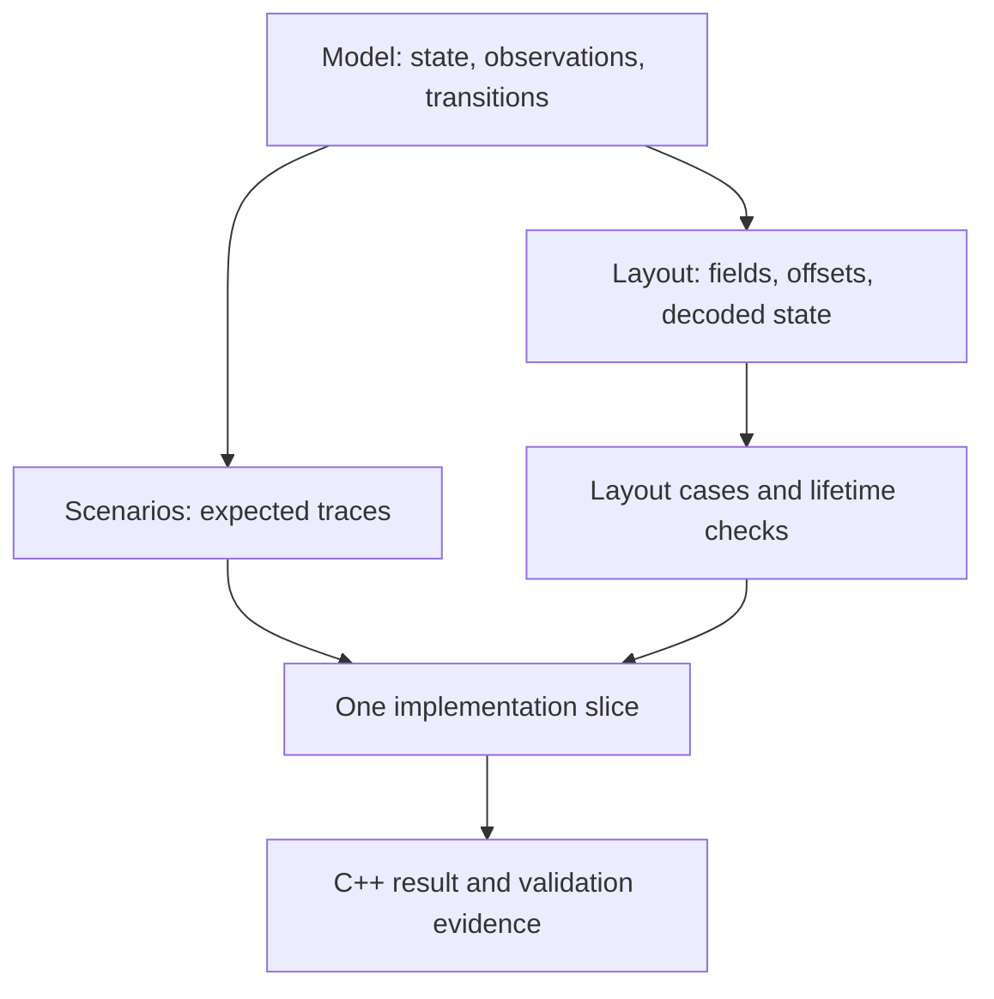
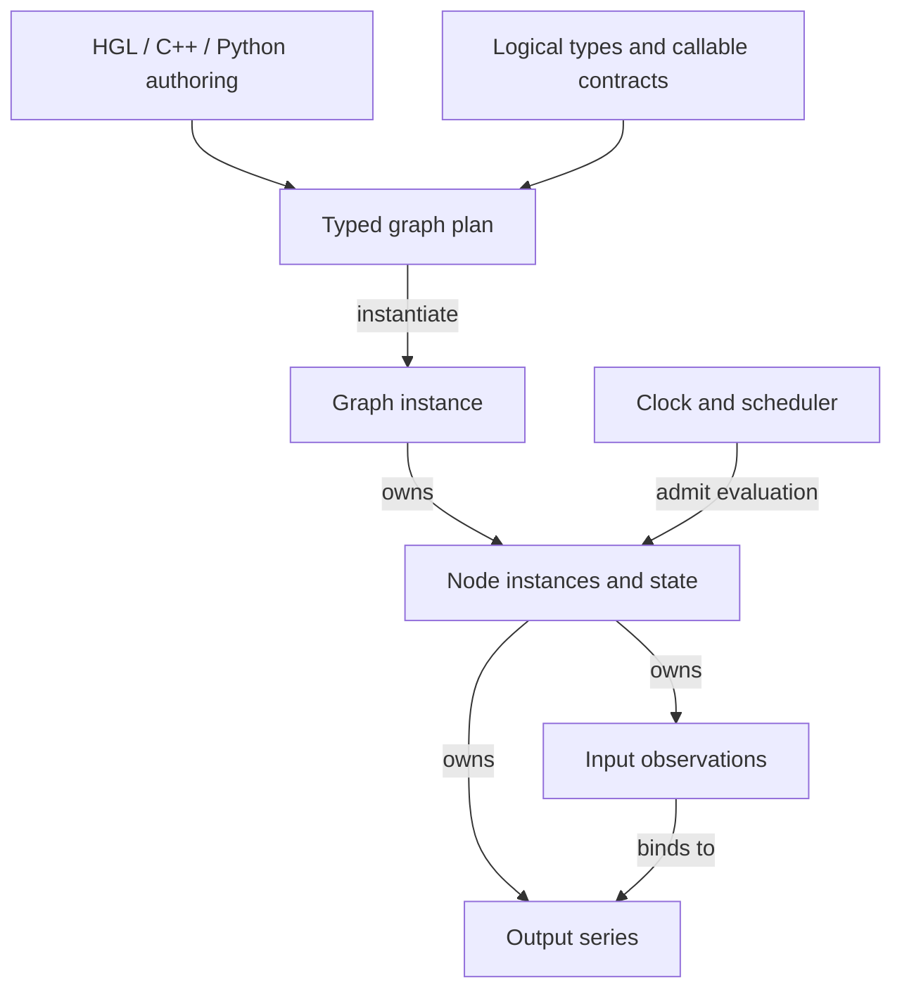
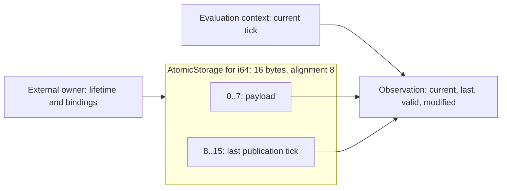
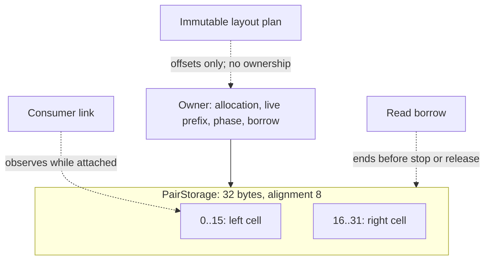
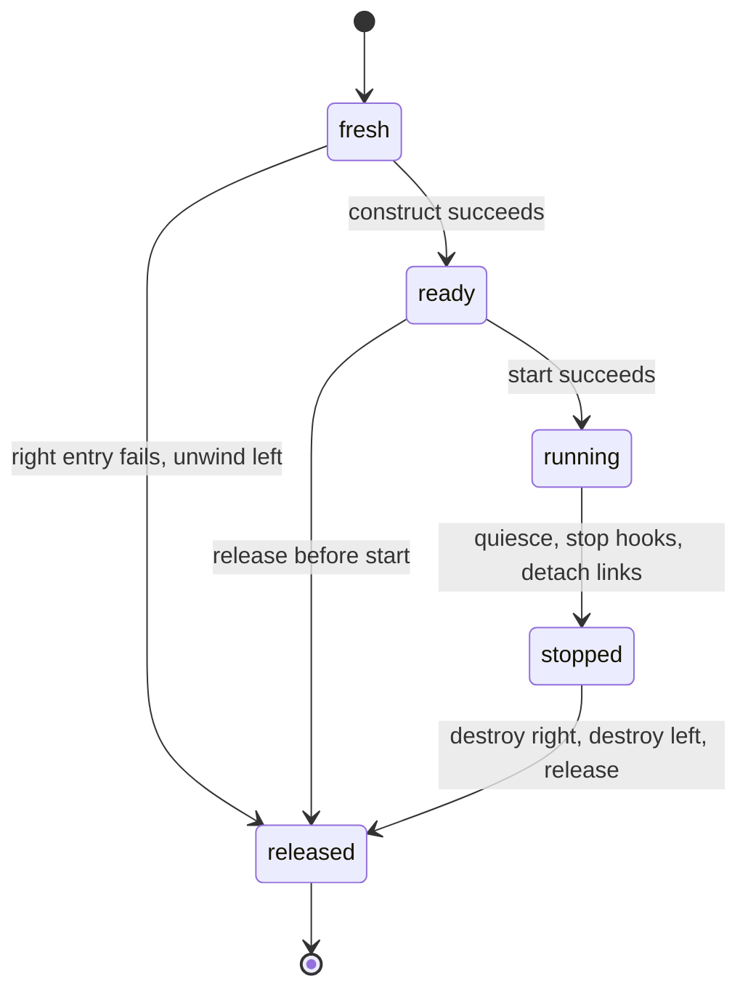
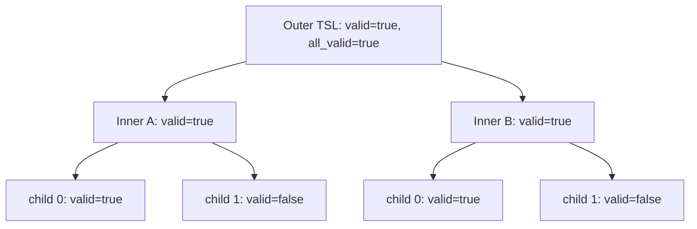

# Reviewable contracts, layouts, and traces

Status: notation experiment, revision 1. No parser, generator, or C++ prototype
is implemented. The intended first use is to guide a bounded C++ simplification.

Read the pictures and the short explanations here first. Each picture links
to one focused specification file. The [notation reference](syntax.md) defines
the constructs used in those files. The syntax remains deliberately small:
models say what happens, layouts say where objects live, and scenarios say
exactly what a reviewer should expect to observe.

## The shape of a review

These are separate views of the same contract, not competing specifications.
The model and layout contain stable rule IDs. Scenarios reference those IDs.
An implementation slice identifies its requirements, permitted changes,
dependencies, checks, and unresolved questions. A disagreement between a
diagram, rule, and trace is a specification defect to resolve before using it
as an implementation instruction.

This can guide a cleanup of the existing C++ runtime. An alternative engine
remains a possible consumer of the behavioral contracts, but implementing a
new runtime or another language is not necessary to make progress.

The high-level runtime responsibilities remain recognizable:

This is a responsibility diagram, not a proposed C++ class hierarchy. The first
layout example covers a region inside an output series; the ownership example
tests a small owner independently of the whole graph. Keeping that boundary
visible prevents a small storage proposal from silently redesigning scheduling.

## 1. An atomic cell: retain a value, derive its flags

[Atomic publication and storage](examples/atomic.hgspec) starts with a cell
whose last publication is either absent or associated with a logical tick.
The environment supplies the current tick. The cell can derive `valid` and
`modified` from those facts instead of independently storing both flags.

This is a proposed **cell region**, not a claim that an existing hgraph endpoint
is 16 bytes. Scheduling, observer lists, endpoint ownership, and metadata are
outside this region. The layout does not remove those responsibilities or
demonstrate a whole-runtime memory saving.

The example uses an abstract `publish` event already admitted by its owner.
It deliberately does not decide the deduplication or batching policy of every
native setter. An equal publication remains an event:

| Action | Current | Last publication | Valid | Modified |
| --- | --- | --- | --- | --- |
| begin tick 10 | absent | never | false | false |
| publish 7 | 7 | 10 | true | true |
| begin tick 20 | 7 | 10 | true | false |
| begin tick 30, publish 7 | 7 | 30 | true | true |

The `.hgspec` scenario expands compound rows into individual steps. It also
checks repeated observation without consuming the change.

The layout places payload first, aligns the timestamp after it, and rounds the
total size up to the region alignment. Additional cases exercise a one-byte
payload and an over-aligned payload. Unsupported sizes and arithmetic overflow
have explicit planning errors. No raw C++ struct layout is assumed.

## 2. Ownership: one region, two separately constructed objects

[Pair ownership](examples/owner.hgspec) places two atomic cells in one region.
Its owner lives outside that region and controls construction, hooks, links,
and borrowing. The example is synchronous and allows one read borrow at a time.

The constructor sequence is left then right. The failure case injects a fault
at entry to right construction, before any right subobject is live. Only left
is destroyed, and the allocation is released. This tests owner rollback without
pretending that ordinary i64 construction throws. Partial construction inside
a payload type needs a separate failure case and cleanup contract.

A live borrow makes stop or release fail with `BorrowLive`, with no partial
effects. The trace records exact hook order, live object count, allocation
ownership, and link/borrow state. Startup failure and concurrent callbacks are
outside this example; their omission is explicit rather than hidden in a
diagram's missing arrow.

## 3. An established behavior: `all_valid` is one level deep

[Single-level validity](examples/validity.hgspec) shows how an existing decision
fits the notation. It is not another proposal to change that behavior.

The outer list asks its immediate children for `valid`, not `all_valid`.
Invalid grandchildren do not make the outer list fail this check. A separate
case verifies that TSD uses its own `valid` without walking its values.

## From review to a bounded implementation

The [implementation slice example](examples/atomic-slice.hgspec) is the handoff
unit. It describes an isolated C++ proof of the atomic cell, not a task to
replace all TSData storage. It names what to implement, what to preserve, how
to test it, and what evidence is still missing for production integration.

The first proof should run the behavioral scenario against the C++ cell and
check the layout cases. A later integration slice must identify the existing
public API adapter, preserve current behavior, and satisfy the repository's
native/Python acceptance gates. Counts or diagrams alone do not prove a
simplification: compare the old and new responsibilities and measured costs.

Future stacked PRs should each add or revise one such unit. Their descriptions
should identify the decisions changed and the scenarios affected. Keep the
previous layer reviewable; update a parent only to correct its own scope or
facts. This folder stays isolated from core guides and build targets while
the design is being explored.

## Revision 1 review evidence

The finite corpus was checked on 2026-09-14: seven scenarios and 30 action
steps matched their model transitions, six layout cases matched the placement
formulas, and all six diagrams were rendered and visually inspected. Rule
references and local links were also checked.

This was a one-off consistency check of the examples, not a maintained parser,
a proof of every prose rule, or a run against hgraph. No C++ implementation,
layout conformance, runtime equivalence, or memory saving is claimed yet.
