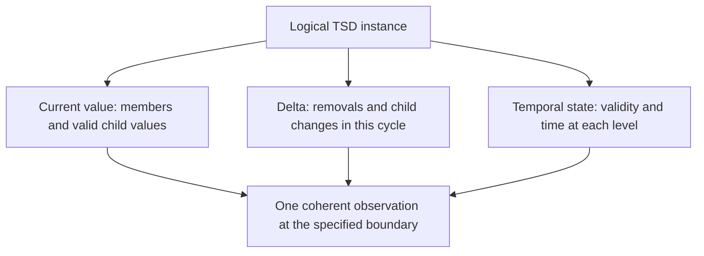
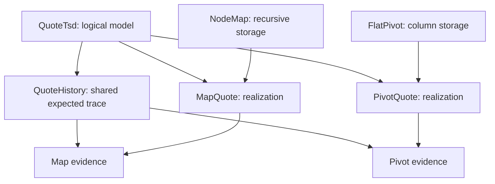
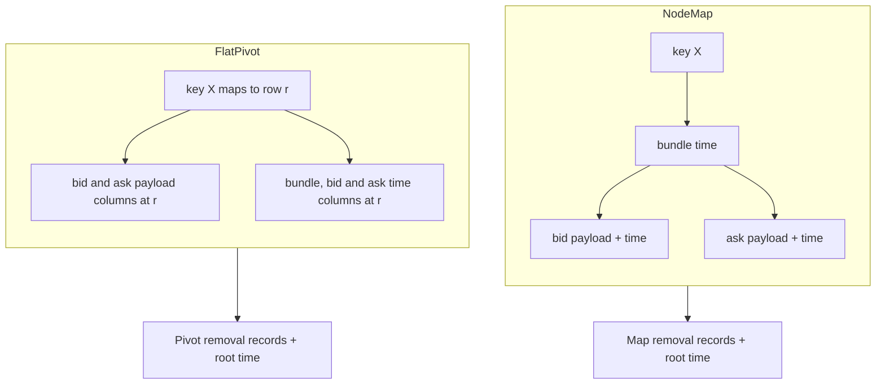

# Behavior, storage, and the relationship between them

Status: proposed notation revision 2. These examples specify candidate designs;
they do not implement or select a replacement for current C++ storage.

A TSD has a logical contract independently of whether its implementation uses
a map, a pivot table, or a composition of representations. Specify that contract
once. Put each storage design in a separate declaration, and connect it through
a named **realization** that explains how it preserves the contract. Changing
storage must not require rewriting the expected behavioral traces.

## Three logical surfaces, any suitable storage organization

These are observable responsibilities, not three required allocations. Current
and delta values may share payloads; delta membership may use sparse tracking;
time may be inline, in columns, or external. A realization must explain how all
three observations describe the same logical instant, including their nesting.
Sharing storage must preserve the specified observation lifetime. An owning
captured value and a borrowed live view need separate lifetime contracts.

The logical type also stays separate from the scalar shape of its current
value. `TSD<text, TSD<text, TS<i64>>>` contains temporal dictionaries as children.
Flattening their current values into scalar maps loses independent membership,
validity, modification times, and deltas unless the realization preserves those
facts elsewhere. HGL's type meaning must not depend on which storage wins
planning; a target capability or layout requirement is an additional constraint.

The current implementation already distinguishes these responsibilities in
[time-series schemas](../../../docs/source/developer_guide/data_structures/schemas/time_series.rst)
and [plans and operations](../../../docs/source/developer_guide/data_structures/plans_and_ops/time_series.rst).
Those files are evidence, not a required implementation structure for this
experiment. Their older recursive `all_valid` wording is not adopted:
[the established single-level rule](../core-model.md#3-endpoints-observations-and-change)
continues to apply.

## Dependencies point through a realization

Read arrows as inputs to a review or check. The model and its scenarios have
no dependency on a storage declaration. The two realizations depend on the
same model and link it to different representations. A representation can
also serve several models, each through a separately scoped realization.

| Declaration | Owns | Example |
| --- | --- | --- |
| `model` | Domain, abstract state, observations, transitions, errors and progress | [QuoteTsd](examples/tsd-behavior.hgspec) |
| `scenario` | A fixed expected projection at explicit action boundaries | [QuoteHistory](examples/tsd-behavior.hgspec) |
| `representation` | Storage organization, schema eligibility, ownership and resource rules | [NodeMap / FlatPivot](examples/tsd-storage.hgspec) |
| `layout` | Exact placement, alignment and extent in a named region | [AtomicStorage](examples/atomic.hgspec) |
| `realization` | State relation, action mapping and required behavioral cases | [MapQuote / PivotQuote](examples/tsd-realizations.hgspec) |

An abstract `state` is not a request for a member variable. A realization may
derive many model facts from one stored fact, or combine several storage
components into one observation. Its relation must hold initially and after
**every admitted action**, not just at the final snapshot. Internal operations
must terminate under the model's assumptions and cannot introduce additional
observable events or errors. An excluded operation remains an explicit gap in
that model's coverage; it does not become an implementation freedom.

Revision 2 also moves the atomic example's layout `bind` into the standalone
`AtomicCell` realization and removes its encoding rule from the logical trace.
The atomic behavior and 16-byte cell proposal are unchanged.

## One trace, two storage organizations

The finite fixture uses `TSD<text, TSB{bid: TS<i64>, ask: TS<i64>}>`, a single
permitted key `X`, and at most one admitted publication or removal per tick.
Publishing a field creates its key if absent. Initial fields are invalid.
These restrictions make the first relationship review small; this is not the
complete TSD contract or proof of arbitrary collection growth.

Here “pivot” means transposing fixed child paths into columns, with the outer
keys selecting rows. It does not mean aggregating or combining logical values.

Both designs have information beyond the current payload. In the map design,
timestamps follow the child objects. In the pivot design, timestamps follow
each temporal path in columns. A single timestamp for a whole row cannot
replace the field times in this fixture.

| Tick / admitted event | Current value | Current-cycle delta | Root / row / bid / ask times |
| --- | --- | --- | --- |
| 10: publish bid 7 | `{X: {bid: 7}}` | modified `{X: {bid: 7}}` | `10 / 10 / 10 / never` |
| 20: publish ask 9 | `{X: {bid: 7, ask: 9}}` | modified `{X: {ask: 9}}` | `20 / 20 / 10 / 20` |
| 30: publish bid 7 again | `{X: {bid: 7, ask: 9}}` | modified `{X: {bid: 7}}` | `30 / 30 / 30 / 20` |
| 40: no publication | `{X: {bid: 7, ask: 9}}` | absent | `30 / 30 / 30 / 20` |
| 50: remove X | `{}` | removed `{X}` | `50 / absent / absent / absent` |
| 60: publish bid 7 | `{X: {bid: 7}}` | modified `{X: {bid: 7}}` | `60 / 60 / 60 / never` |

Unlisted delta categories are empty. The `.hgspec` case expands the table into
individual begin/action/inspection steps. Its lists are explicit observation
projections, not new runtime API value types. The root remains valid, and hence
`all_valid`, after removal; a newly reinserted row has an invalid ask.

This trace catches several incorrect relationships: reconstructing deltas from
snapshot differences loses tick 30; using one row time changes ask incorrectly;
erasing all removal information loses tick 50; failing to initialize a reused
row resurrects ask at tick 60. Passing it still leaves multiple keys, same-tick
composition, empty insertion, references, failures, and borrowing unspecified.

## Eligibility is separate from conformance

The [storage declarations](examples/tsd-storage.hgspec) define exact predicates
for these **named candidates**, with positive and negative cases. A different
pivot strategy can accept a different domain. No universal claim is made that
maps support everything or that column storage cannot support dynamic nesting.

| Logical child shape under the outer TSD | NodeMap | FlatPivot | Behavioral relationship in this revision |
| --- | --- | --- | --- |
| Fixed bid/ask TSB of i64 series | Eligible | Eligible | Both relate to the same finite QuoteTsd model |
| Fixed nested TSB of i64 series | Eligible | Eligible | Model and realization still needed |
| Nested dynamic TSD of i64 series | Eligible recursively | UnsupportedShape | NodeMap model and realization still needed |
| Fixed TSL or REF | UnsupportedShape | UnsupportedShape | Outside these candidates |

Eligibility depends on the **full temporal schema**, not just its snapshot
schema or leaf byte size. Planning must also check required operations, target
traits, ownership, borrows, stable-address requirements and resource bounds.
For example, neither candidate currently promises stable raw child addresses;
a consumer requiring them cannot use this profile merely because its type is
eligible. “Eligible” establishes neither speed nor lower memory consumption.

Selection belongs to an immutable plan for the declared scope. If the selected
candidate is unsuitable, planning can try another eligible candidate only when
the requested physical constraints permit that choice. If no candidate meets
the requirements, planning fails before construction. It must not accept a
schema by discarding temporal behavior or switching semantics during execution.
The plan records the selected realization and all child choices.

A hybrid, such as a map whose fixed bundle children use a packed layout, needs
its own composition contract. That contract must cover child identity, updates
propagating to parent times and deltas, observation coherence, ownership, and
removal/reuse. Independent child conformance is necessary but does not prove
the composed parent. Migration while live likewise needs an explicit protocol.

## Keep relationships and evidence visible

This table is the initial registry. Declaration names resolve through the
linked files and the syntax reference; it is deliberately not a tool database.

| Realization | Model | Storage | Required scenarios | Design / implementation / native evidence |
| --- | --- | --- | --- | --- |
| [AtomicCell](examples/atomic.hgspec) | AtomicI64 | AtomicStorage with i64 | AtomicRetention, AtomicZeroTick | Proposed / absent / absent |
| [MapQuote](examples/tsd-realizations.hgspec) | QuoteTsd | NodeMap | QuoteHistory | Proposed / absent / absent |
| [PivotQuote](examples/tsd-realizations.hgspec) | QuoteTsd | FlatPivot | QuoteHistory | Proposed / absent / absent |

A future evidence record pins the specification commit, notation revision,
model and rule IDs, representation/layout arguments, realization, target
compiler/traits, implementation commit, public driver mapping, exact scenarios,
physical checks, and results. Unchecked prose and excluded domains are listed
explicitly. Reports distinguish schema eligibility, behavioral conformance,
physical conformance, and measured performance.

Review changes using these rules:

- A behavioral change identifies every affected realization and scenario;
  existing verification becomes stale until checked against the new contract.
- A storage change identifies its realizations and physical checks; unchanged
  behavioral scenarios run again without modifying their expected values.
- A realization change rechecks both sides, including every state relation,
  admitted action and boundary assumption. An adapter cannot repair a mismatch
  by suppressing publications, manufacturing times, or hiding removals.
- Adding support for a nested shape adds its model, eligibility case,
  composition relationship and traces. A broader storage predicate alone is
  insufficient to mark that shape implemented or conforming.

The next implementation slice can compare these two realizations only within
the finite quote domain. It must add explicit byte layouts, ownership and
failure boundaries before claiming physical conformance or measuring costs.
The current PR supplies reviewable contracts and examples only.
