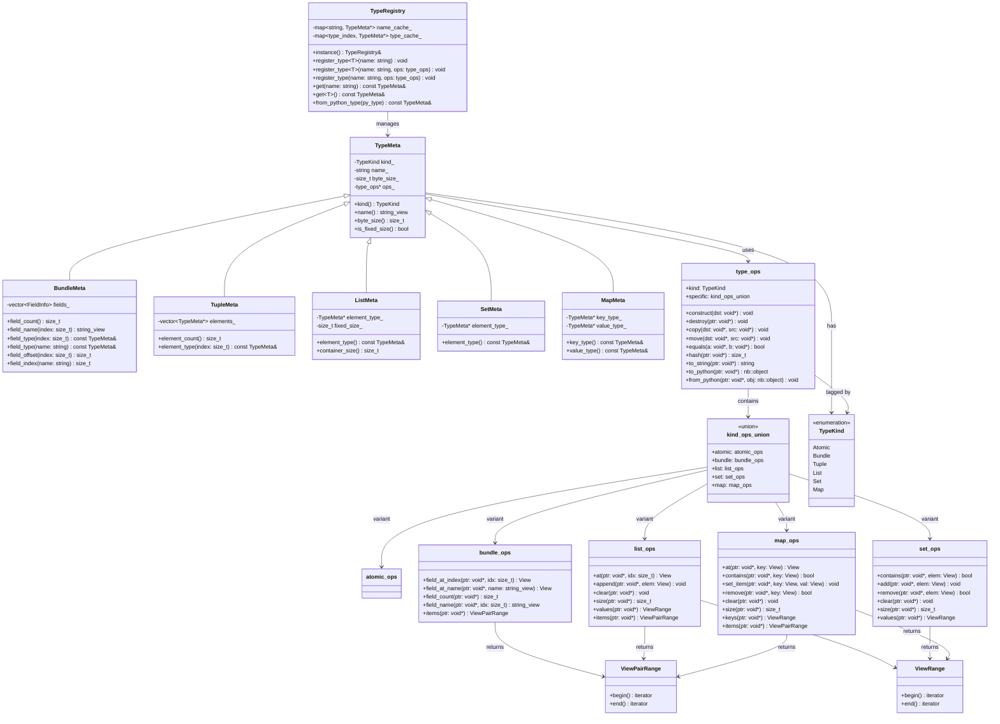
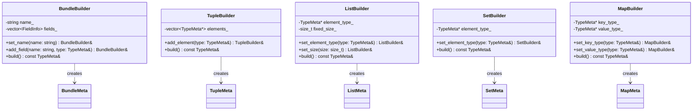
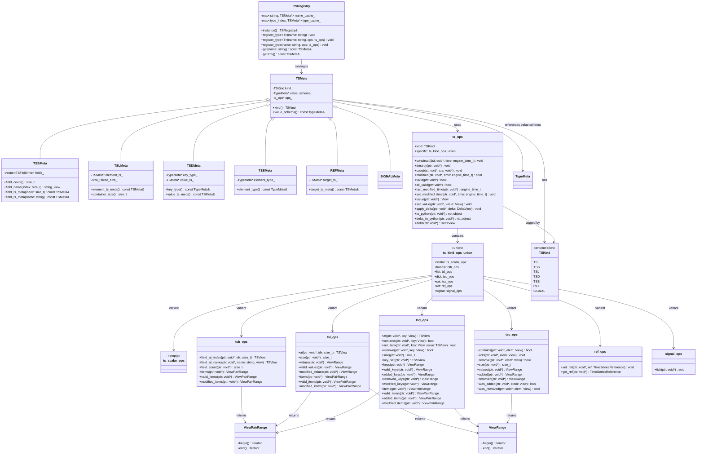
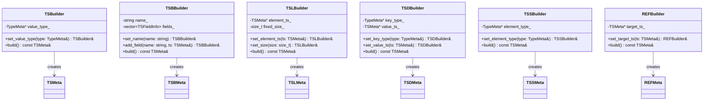
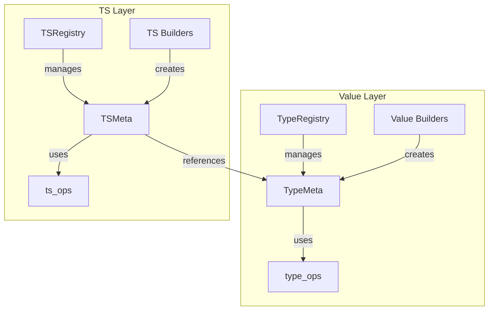

# Schema: Defining Types

**Parent**: [Overview](00_OVERVIEW.md)

---

## What Is a Schema?

A **schema** describes the structure and capabilities of a type. It defines:
- What kind of type it is (atomic, bundle, list, etc.)
- For composites: the structure of children
- For time-series: the temporal overlay structure

Schemas are **metadata** - they describe data, not the data itself.

---

## Two Schema Layers

### Value Schema (TypeMeta)

Describes how data is laid out in memory:

```
TypeMeta for a Point bundle:
├── kind: Bundle
├── name: "Point"
├── size: 24 bytes (three doubles)
├── fields:
│   ├── field[0]: name="x", type=double, offset=0
│   ├── field[1]: name="y", type=double, offset=8
│   └── field[2]: name="z", type=double, offset=16
└── ops: (operations vtable)
```

Value schema knows nothing about time.

### Time-Series Schema (TSMeta)

Describes the time-series structure on top of data:

```
TSMeta for a Quote TSB:
├── kind: TSB
├── value_schema: → Point TypeMeta
├── fields:
│   ├── field[0]: name="bid", ts_type=TS[double]
│   ├── field[1]: name="ask", ts_type=TS[double]
│   └── field[2]: name="time", ts_type=TS[engine_time_t]
└── ops: (ts operations vtable)
```

TS schema adds change tracking structure.

### Relationship

```
┌───────────────────────────────────────┐
│           TSMeta (TS[int])            │
│  ┌─────────────────────────────────┐  │
│  │     TypeMeta (int)              │  │
│  │     (data layout)               │  │
│  └─────────────────────────────────┘  │
│  + modification tracking structure    │
│  + observer attachment points         │
└───────────────────────────────────────┘
```

Every TSMeta references a TypeMeta for its data storage.

---

## Type Registration

Types must be registered with the type system before use. This establishes the mapping between type identifiers and their schemas.

**Note:** Registration is a C++ operation. The Python TypeMeta API provides read-only access (`get`) to retrieve schemas, but does not support registration.

### Registering Types

All type registration uses `register_type`. The API has three forms:

```cpp
TypeRegistry& registry = TypeRegistry::instance();

// 1. Template with auto-generated ops (for simple/atomic types)
//    Generates type_ops from the atomic ops generator
registry.register_type<bool>("bool");
registry.register_type<int64_t>("int");
registry.register_type<double>("float");
registry.register_type<engine_date_t>("date");
registry.register_type<engine_time_t>("datetime");
registry.register_type<engine_time_delta_t>("timedelta");
registry.register_type<nb::object>("object");  // Important: arbitrary Python objects

// 2. Template with explicit ops (for types needing custom behavior)
//    Populates both name and type caches
registry.register_type<MyCustomType>("MyCustomType", my_type_ops);

// 3. Name-only with explicit ops (no template shortcut)
//    Only populates name cache
registry.register_type("MyCustomType", my_type_ops);
```

After registration, retrieve schema by name:

```cpp
const TypeMeta& int_schema = TypeMeta::get("int");
const TypeMeta& float_schema = TypeMeta::get("float");
const TypeMeta& object_schema = TypeMeta::get("object");
```

### Template Shortcut API

When a type is registered with `register_type<T>("name")` (template form), the registry maintains two caches:
1. **Name cache**: Maps string name → TypeMeta (e.g., `"int"` → int TypeMeta)
2. **Type cache**: Maps C++ type → TypeMeta (e.g., `int64_t` → int TypeMeta)

This enables a template shortcut for retrieval:

```cpp
// These are equivalent for template-registered types:
const TypeMeta& schema1 = TypeMeta::get("int");      // Name-based (primary)
const TypeMeta& schema2 = TypeMeta::get<int64_t>();  // Template shortcut

// The template version looks up the C++ type in the type cache
// and returns the same TypeMeta as the name-based version
```

The template shortcut extends to time-series types:

```cpp
// TS<int64_t> internally resolves to TS with TypeMeta::get("int")
using PriceTS = TS<double>;      // Resolves via TypeMeta::get<double>() → "float"
using FlagTS = TS<bool>;         // Resolves via TypeMeta::get<bool>() → "bool"
```

**Important**: The template shortcut only works for types registered using the template form of `register_type<T>()`. Types registered only by name must use the name-based API.

### Built-in Atomic Types

| Type | Python | C++ | Size | Notes |
|------|--------|-----|------|-------|
| `bool` | `bool` | `bool` | 1 byte | |
| `int` | `int` | `int64_t` | 8 bytes | 64-bit signed |
| `float` | `float` | `double` | 8 bytes | 64-bit IEEE |
| `date` | `datetime.date` | `engine_date_t` | 4 bytes | Year-month-day |
| `datetime` | `datetime.datetime` | `engine_time_t` | 8 bytes | Microsecond precision |
| `timedelta` | `datetime.timedelta` | `engine_time_delta_t` | 8 bytes | Microsecond precision |
| `object` | `object` | `nb::object` | 8 bytes | Wrapper around PyObject* (arbitrary Python object) |

**Note**: String (`str`) is not currently supported but the type system is extensible.

---

## Compound Scalars

User-defined scalar types that are treated atomically (no per-field change tracking).

### Named vs Unnamed Types

Compound types are uniquely determined by their fields and field order. The type system supports both named and unnamed registration:

- **Unnamed**: The structural schema (fields + order) is registered without a name. The schema's name property returns `"UnNamedCompoundScalar"`.
- **Named**: A name is associated with a structural schema. Multiple names can alias the same underlying structure.

```cpp
// Register unnamed (structural only)
const TypeMeta& unnamed = BundleBuilder()
    .add_field("x", TypeMeta::get("float"))
    .add_field("y", TypeMeta::get("float"))
    .build();
// unnamed.name() == "UnNamedCompoundScalar"

// Register named (wraps structural schema with name)
const TypeMeta& point = BundleBuilder()
    .set_name("Point")
    .add_field("x", TypeMeta::get("float"))
    .add_field("y", TypeMeta::get("float"))
    .build();
// point.name() == "Point"

// Same structure can have multiple name aliases
const TypeMeta& vec2d = BundleBuilder()
    .set_name("Vec2D")
    .add_field("x", TypeMeta::get("float"))
    .add_field("y", TypeMeta::get("float"))
    .build();
// vec2d.name() == "Vec2D", but underlying structure is same as Point
```

When looking up a schema by name, you get the named schema (which holds both the name and the structural type schema). The structural schema can be shared across multiple named types.

**Equality semantics:**

```cpp
// Unnamed == Named: compares underlying structural schema only
unnamed == point;   // true (same fields and order)
unnamed == vec2d;   // true (same fields and order)

// Named == Named: requires name to match
point == vec2d;     // false (different names, even though same structure)
point == point;     // true
```

### Python Mapping

In Python, compound scalars are defined by inheriting from `CompoundScalar`. The C++ schema system can retrieve these schemas via `TypeMeta::from_python_type()`. When a Python `CompoundScalar` is registered, both the structural schema and the Python type association are stored.

For example:

```python
from hgraph import CompoundScalar
from dataclasses import dataclass

@dataclass
class Point(CompoundScalar):
    x: float
    y: float
    z: float
```

### C++ Schema Definition

**Option 1: Static type definition (fully compile-time)**
```cpp
using PointSchema = Bundle<
    name<"Point">,
    field<"x", double>,
    field<"y", double>,
    field<"z", double>
>;

using MoneySchema = Bundle<
    name<"Money">,
    field<"amount", double>,
    field<"currency_code", int64_t>
>;

// Get TypeMeta by name (after registration)
const TypeMeta& point_schema = TypeMeta::get("Point");
const TypeMeta& money_schema = TypeMeta::get("Money");
```

**Option 2: Fluent builder (runtime construction)**
```cpp
const TypeMeta& point_schema = BundleBuilder()
    .set_name("Point")
    .add_field("x", TypeMeta::get("float"))
    .add_field("y", TypeMeta::get("float"))
    .add_field("z", TypeMeta::get("float"))
    .build();

const TypeMeta& money_schema = BundleBuilder()
    .set_name("Money")
    .add_field("amount", TypeMeta::get("float"))
    .add_field("currency_code", TypeMeta::get("int"))
    .build();
```

**Option 3: From Python type**
```cpp
// Retrieve schema from registered Python CompoundScalar type
const TypeMeta& point_schema = TypeMeta::from_python_type(point_py_type);
```

### Binding Python Types (Optional)

A Python dataclass type can be bound to a compound scalar schema to enable proper Python object construction during `to_python()` conversion. Without a binding, `to_python()` returns a dict; with a binding, it returns an instance of the bound type.

```cpp
// Retroactive binding - bind after schema already exists
// Useful when schema was created via static template definition
const TypeMeta& point_schema = TypeMeta::get("Point");
point_schema.bind_python_type(point_py_type);

// Binding during builder construction
const TypeMeta& point_schema = BundleBuilder()
    .set_name("Point")
    .add_field("x", TypeMeta::get("float"))
    .add_field("y", TypeMeta::get("float"))
    .add_field("z", TypeMeta::get("float"))
    .set_python_type(point_py_type)  // Optional binding
    .build();
```

Retroactive binding is particularly useful when schemas are defined using static templates:

```cpp
// Static template definition (no Python type available at compile time)
using PointSchema = Bundle<
    name<"Point">,
    field<"x", double>,
    field<"y", double>,
    field<"z", double>
>;

// Later, when Python type becomes available, bind it retroactively
const TypeMeta& schema = TypeMeta::get("Point");
schema.bind_python_type(point_py_type);
```

The binding affects `to_python()` behavior:
- **Without binding**: Returns a Python `dict` with field names as keys
- **With binding**: Constructs an instance of the bound type using the dict as `**kwargs`

### Working with Compound Scalar Values

```cpp
// Create value
Value point(point_schema);
point.at("x").set<double>(1.0);
point.at("y").set<double>(2.0);
point.at("z").set<double>(3.0);

// Read value
View v = point.view();
double x = v.at("x").as<double>();
double y = v.at("y").as<double>();
double z = v.at("z").as<double>();

// Interop with Python CompoundScalar instances
point.from_python(py_point_obj);
nb::object py_obj = point.to_python();
```

Note: ``from_python`` can convert from a python dictionary or a schema complient class. 
      The ``to_python`` will convert the value to a dictionary if no python schema type is 
      bound to the c++ schema, alternatively it will attempt to convert to the bound python
      implementation type. This is done by applying the dict as kwargs to the type's constructor.
---

## Composite Value Types

### List

Homogeneous sequence of values.

**Static Definition:**
```cpp
// Dynamic list of doubles
using PriceList = List<double>;

// Fixed-size list (capacity 10)
using FixedPriceList = List<double, 10>;

// List of Python objects
using ObjectList = List<nb::object>;
```

**Builder:**
```cpp
// Dynamic list
const TypeMeta& list_schema = ListBuilder()
    .set_element_type(TypeMeta::get("float"))
    .build();

// Fixed-size list
const TypeMeta& fixed_list_schema = ListBuilder()
    .set_element_type(TypeMeta::get("float"))
    .set_size(10)
    .build();
```

### Set

Unordered collection of unique hashable values.

**Static Definition:**
```cpp
using IdSet = Set<int64_t>;
```

**Builder:**
```cpp
const TypeMeta& set_schema = SetBuilder()
    .set_element_type(TypeMeta::get("int"))
    .build();
```

### Map

Key-value pairs with hashable keys.

**Static Definition:**
```cpp
using ScoreMap = Map<int64_t, double>;

// Map with object values
using DataMap = Map<int64_t, nb::object>;
```

**Builder:**
```cpp
const TypeMeta& map_schema = MapBuilder()
    .set_key_type(TypeMeta::get("int"))
    .set_value_type(TypeMeta::get("float"))
    .build();
```

### Tuple

Positional-only bundle (no field names).

**Static Definition:**
```cpp
using Pair = Tuple<int64_t, double>;
using Triple = Tuple<double, double, double>;
```

**Builder:**
```cpp
const TypeMeta& pair_schema = TupleBuilder()
    .add_element(TypeMeta::get("int"))
    .add_element(TypeMeta::get("float"))
    .build();
```

---

## Time-Series Types

Time-series schemas wrap value schemas and add temporal tracking.

### TS[T] - Scalar Time-Series

```cpp
using PriceTS = TS<double>;
using FlagTS = TS<bool>;
using TimeTS = TS<engine_time_t>;
using PointTS = TS<PointSchema>;    // Compound scalar
using ObjectTS = TS<nb::object>;    // Arbitrary Python object
```

### TSB - Bundle Time-Series

Each field is independently tracked. In Python, TSB schemas are defined by inheriting from `TimeSeriesSchema`. The C++ schema system can retrieve these via the TSRegistry.

```cpp
// Static definition
using QuoteSchema = TSB<
    name<"Quote">,
    field<"bid", TS<double>>,
    field<"ask", TS<double>>,
    field<"time", TS<engine_time_t>>
>;

// Or via builder
const TSMeta& quote_ts = TSBBuilder()
    .set_name("Quote")
    .add_field("bid", TSBuilder().set_value_type(TypeMeta::get("float")).build())
    .add_field("ask", TSBuilder().set_value_type(TypeMeta::get("float")).build())
    .add_field("time", TSBuilder().set_value_type(TypeMeta::get("datetime")).build())
    .build();
```

#### Binding Python Types for TSB (Optional)

TSB schemas can bind two optional Python types:

1. **Scalar type**: The Python dataclass (CompoundScalar) representing the underlying value structure. Used by `to_python()` on the scalar value.
2. **Schema type**: The Python TimeSeriesSchema class. This serves dual purpose - it defines the TS schema in Python and instances of it represent the time-series type.

```cpp
// Bind both types during builder construction
const TSMeta& quote_ts = TSBBuilder()
    .set_name("Quote")
    .add_field("bid", TSBuilder().set_value_type(TypeMeta::get("float")).build())
    .add_field("ask", TSBuilder().set_value_type(TypeMeta::get("float")).build())
    .add_field("time", TSBuilder().set_value_type(TypeMeta::get("datetime")).build())
    .set_scalar_type(quote_scalar_py_type)   // Optional: Python CompoundScalar
    .set_schema_type(quote_schema_py_type)   // Optional: Python TimeSeriesSchema
    .build();

// Retroactive binding for static template definitions
const TSMeta& quote_ts = TSMeta::get("Quote");
quote_ts.bind_scalar_type(quote_scalar_py_type);
quote_ts.bind_schema_type(quote_schema_py_type);
```

In Python, these types are typically defined as:

```python
@dataclass
class Quote(CompoundScalar):
    bid: float
    ask: float
    time: datetime

class QuoteSchema(TimeSeriesSchema):
    bid: TS[float]
    ask: TS[float]
    time: TS[datetime]
```

The scalar type binding affects value conversion (same as compound scalars). The schema type binding enables proper Python type representation when working with the time-series schema from Python.

### TSL - List Time-Series

List of independent time-series elements.

```cpp
// Fixed-size list of 10 float time-series
using PriceListTS = TSL<TS<double>, 10>;

// Dynamic list (size 0)
using DynamicPriceListTS = TSL<TS<double>, 0>;

// List of bundles
using QuoteListTS = TSL<TSB<QuoteSchema>, 5>;

// List of object time-series
using ObjectListTS = TSL<TS<nb::object>, 0>;
```

### TSD - Dict Time-Series

Scalar keys mapping to time-series values.

```cpp
using PriceDictTS = TSD<int64_t, TS<double>>;
using OrderDictTS = TSD<int64_t, TSB<QuoteSchema>>;
```

### TSS - Set Time-Series

Set of scalar values that changes over time.

```cpp
using ActiveIdsTS = TSS<int64_t>;
```

### REF - Reference Time-Series

Dynamic reference to another time-series.

```cpp
using PriceRefTS = REF<TS<double>>;
using QuoteRefTS = REF<TSB<QuoteSchema>>;
```

### SIGNAL

Tick notification with no data.

```cpp
using HeartbeatTS = SIGNAL;
```

---

## TypeMeta API

### Core Properties

```cpp
const TypeMeta& schema = ...;

// Kind
TypeKind kind = schema.kind();          // TypeKind::Bundle, List, etc.

// Name (for named types)
std::string_view name = schema.name();  // "Point", "Money", etc.

// Size
size_t byte_size = schema.byte_size();  // Memory size in bytes
bool is_fixed = schema.is_fixed_size(); // True if size is fixed
```

### Bundle/Tuple Field Access

```cpp
const TypeMeta& bundle_schema = ...;

// Field count
size_t count = bundle_schema.field_count();

// Field by index
std::string_view name = bundle_schema.field_name(0);
const TypeMeta& field_type = bundle_schema.field_type(0);
size_t offset = bundle_schema.field_offset(0);

// Field by name
size_t index = bundle_schema.field_index("x");
const TypeMeta& field_type = bundle_schema.field_type("x");
```

### Container Element Access

```cpp
// Given a list schema (from builder or registration)
const TypeMeta& list_schema = ...;
const TypeMeta& element_type = list_schema.element_type();

// Given a map schema
const TypeMeta& map_schema = ...;
const TypeMeta& key_type = map_schema.key_type();
const TypeMeta& value_type = map_schema.value_type();

// Container size (for fixed-size containers)
size_t fixed_size = list_schema.container_size();  // 0 for dynamic
```

---

## TSMeta API

### Core Properties

```cpp
// Given a TS schema (from builder or registration)
const TSMeta& ts_meta = ...;

// Kind
TSKind kind = ts_meta.kind();           // TSKind::TS, TSB, TSL, etc.

// Underlying value schema
const TypeMeta& value_schema = ts_meta.value_schema();
```

### TSB Field Access

```cpp
// Given a TSB schema
const TSMeta& tsb_meta = ...;

// Field count
size_t count = tsb_meta.field_count();

// Field by index
std::string_view name = tsb_meta.field_name(0);
const TSMeta& field_ts_meta = tsb_meta.field_ts_meta(0);

// Field by name
const TSMeta& bid_meta = tsb_meta.field_ts_meta("bid");
```

### Container TS Access

```cpp
// Given a TSL schema
const TSMeta& tsl_meta = ...;
const TSMeta& element_ts = tsl_meta.element_ts_meta();
size_t fixed_size = tsl_meta.container_size();  // 10 for TSL<..., 10>, 0 for dynamic

// Given a TSD schema
const TSMeta& tsd_meta = ...;
const TypeMeta& key_type = tsd_meta.key_type();
const TSMeta& value_ts = tsd_meta.value_ts_meta();
```

---

## Schema Composition

Schemas can nest arbitrarily:

```cpp
// Bundle containing list of bundles
using PositionSchema = Bundle<
    name<"Position">,
    field<"symbol", int64_t>,
    field<"quantity", int64_t>,
    field<"price", double>
>;

using PortfolioSchema = TSB<
    name<"Portfolio">,
    field<"id", TS<int64_t>>,
    field<"positions", TSL<TSB<PositionSchema>, 0>>
>;

// Nested dicts
using NestedDictTS = TSD<int64_t, TSD<int64_t, TS<double>>>;

// With object types for flexibility
using FlexibleSchema = TSB<
    name<"Flexible">,
    field<"data", TS<nb::object>>,
    field<"metadata", TS<nb::object>>
>;
```

---

## Memory Layout

### Contiguous Data

Value schemas describe contiguous memory layouts where possible:

```
Bundle with fields [x: double, y: double, z: double]

Memory: [x: 8 bytes][y: 8 bytes][z: 8 bytes] = 24 bytes
        offset 0    offset 8    offset 16
```

This enables:
- Direct memory mapping
- Efficient bulk operations
- Buffer protocol compatibility

### Variable-Size Types

Some types have variable size:
- Dynamic `List` (variable elements)
- `Set` and `Map` (variable entries)

These use indirect storage (pointers to heap).

**Note**: `nb::object` is fixed size (8 bytes) as it's a wrapper around `PyObject*`. The Python object itself lives on the Python heap, but the `nb::object` holder is just a pointer.

---

## Adding New Types

Custom types can be added to the type system by implementing the required operations and registering with the TypeRegistry.

### type_ops Architecture

The `type_ops` structure uses a **tag + union** design that balances memory efficiency with extensibility. See [Schema Research](01_SCHEMA_research.md) for the full design analysis.

```cpp
struct type_ops {
    // Common operations (all types must implement)
    void (*construct)(void* dst);
    void (*destroy)(void* ptr);
    void (*copy)(void* dst, const void* src);
    void (*move)(void* dst, void* src);
    bool (*equals)(const void* a, const void* b);
    size_t (*hash)(const void* ptr);
    std::string (*to_string)(const void* ptr);
    nb::object (*to_python)(const void* ptr);
    void (*from_python)(void* ptr, nb::object obj);

    // Kind-specific operations via tagged union
    TypeKind kind;
    union {
        atomic_ops atomic;
        bundle_ops bundle;
        list_ops list;
        set_ops set;
        map_ops map;
    } specific;
};
```

**Design rationale:**
- **Union reuses memory**: Kind-specific ops don't waste space for other kinds
- **No heap allocation**: All function pointers stored inline or in static tables
- **Single indirection**: Common ops called directly via function pointer
- **Type-safe dispatch**: Kind tag ensures correct union member access

### Iterator Types

Two iterator concepts cover all iteration needs (shared with ts_ops layer):

```cpp
// Single-value iterator - yields View per element
// Used for: keys, values, indices, elements
struct ViewRange {
    struct iterator {
        View operator*() const;
        iterator& operator++();
        bool operator!=(const iterator& other) const;
    };
    iterator begin() const;
    iterator end() const;
};

// Key-value pair iterator - yields pair of Views per element
// Used for: items, field name+value pairs
struct ViewPairRange {
    struct iterator {
        std::pair<View, View> operator*() const;  // (key/name, value)
        iterator& operator++();
        bool operator!=(const iterator& other) const;
    };
    iterator begin() const;
    iterator end() const;
};
```

### Kind-Specific Operations

Each kind has its own operations table:

```cpp
struct atomic_ops {
    // Atomic types have no additional ops beyond common
};

struct bundle_ops {
    View (*field_at_index)(void* ptr, size_t idx);
    View (*field_at_name)(void* ptr, std::string_view name);
    size_t (*field_count)(const void* ptr);
    std::string_view (*field_name)(const void* ptr, size_t idx);
    // Iteration (ViewPairRange: field_name -> value)
    ViewPairRange (*items)(const void* ptr);
};

struct list_ops {
    View (*at)(void* ptr, size_t idx);
    void (*append)(void* ptr, View elem);
    void (*clear)(void* ptr);
    size_t (*size)(const void* ptr);
    // Iteration
    ViewRange (*values)(const void* ptr);
    ViewPairRange (*items)(const void* ptr);  // index -> value
};

struct set_ops {
    bool (*contains)(const void* ptr, View elem);
    void (*add)(void* ptr, View elem);
    bool (*remove)(void* ptr, View elem);
    void (*clear)(void* ptr);
    size_t (*size)(const void* ptr);
    // Iteration
    ViewRange (*values)(const void* ptr);
};

struct map_ops {
    View (*at)(void* ptr, View key);
    bool (*contains)(const void* ptr, View key);
    void (*set_item)(void* ptr, View key, View val);
    bool (*remove)(void* ptr, View key);
    void (*clear)(void* ptr);
    size_t (*size)(const void* ptr);
    // Iteration
    ViewRange (*keys)(const void* ptr);
    ViewPairRange (*items)(const void* ptr);  // key -> value
};
```

### Implementing a Custom Atomic Type

To add a new atomic type:

```cpp
// 1. Define the operations
namespace my_type_impl {
    void construct(void* dst) {
        new(dst) MyType();
    }

    void destroy(void* ptr) {
        static_cast<MyType*>(ptr)->~MyType();
    }

    void copy(void* dst, const void* src) {
        new(dst) MyType(*static_cast<const MyType*>(src));
    }

    void move(void* dst, void* src) {
        new(dst) MyType(std::move(*static_cast<MyType*>(src)));
    }

    bool equals(const void* a, const void* b) {
        return *static_cast<const MyType*>(a) == *static_cast<const MyType*>(b);
    }

    size_t hash(const void* ptr) {
        return std::hash<MyType>{}(*static_cast<const MyType*>(ptr));
    }

    std::string to_string(const void* ptr) {
        return static_cast<const MyType*>(ptr)->to_string();
    }

    nb::object to_python(const void* ptr) {
        return nb::cast(*static_cast<const MyType*>(ptr));
    }

    void from_python(void* ptr, nb::object obj) {
        *static_cast<MyType*>(ptr) = nb::cast<MyType>(obj);
    }
}

// 2. Create the ops table
static const type_ops MY_TYPE_OPS = {
    .construct = my_type_impl::construct,
    .destroy = my_type_impl::destroy,
    .copy = my_type_impl::copy,
    .move = my_type_impl::move,
    .equals = my_type_impl::equals,
    .hash = my_type_impl::hash,
    .to_string = my_type_impl::to_string,
    .to_python = my_type_impl::to_python,
    .from_python = my_type_impl::from_python,
    .kind = TypeKind::Atomic,
    .specific = { .atomic = {} }
};

// 3. Register the type
TypeRegistry::instance().register_type<MyType>("my_type", MY_TYPE_OPS);
```

### Implementing a Custom Collection Type

For collection types, implement both common ops and kind-specific ops:

```cpp
// For a custom list-like type
static const list_ops MY_LIST_SPECIFIC_OPS = {
    .at = my_list_impl::at,
    .append = my_list_impl::append,
    .clear = my_list_impl::clear,
    .size = my_list_impl::size
};

static const type_ops MY_LIST_OPS = {
    .construct = my_list_impl::construct,
    .destroy = my_list_impl::destroy,
    // ... common ops
    .kind = TypeKind::List,
    .specific = { .list = MY_LIST_SPECIFIC_OPS }
};
```

### Operations Contract

All types must satisfy these contracts:

| Operation | Contract |
|-----------|----------|
| `construct` | Initialize memory to valid default state |
| `destroy` | Release all resources, leave memory uninitialized |
| `copy` | Create independent copy in uninitialized memory |
| `move` | Transfer ownership, source left in valid but unspecified state |
| `equals` | Reflexive, symmetric, transitive equality |
| `hash` | Equal values must have equal hashes |
| `to_string` | Human-readable representation for debugging |
| `to_python` | Convert to appropriate Python object |
| `from_python` | Parse Python object, throw on type mismatch |

---

## Adding New Time-Series Types

Time-series types require their own operations table (`ts_ops`) in addition to the underlying value's `type_ops`.

### ts_ops Architecture

The `ts_ops` structure follows the same **tag + union** design as `type_ops`:

```cpp
struct ts_ops {
    // Common operations (all TS types must implement)
    void (*construct)(void* dst, engine_time_t time);
    void (*destroy)(void* ptr);
    void (*copy)(void* dst, const void* src);
    bool (*modified)(const void* ptr, engine_time_t time);
    bool (*valid)(const void* ptr);
    bool (*all_valid)(const void* ptr);  // For composites: all children valid
    engine_time_t (*last_modified_time)(const void* ptr);
    void (*set_modified_time)(void* ptr, engine_time_t time);

    // Value access (all TS types)
    View (*value)(const void* ptr);
    void (*set_value)(void* ptr, View value);
    void (*apply_delta)(void* ptr, DeltaView delta);

    // Python interop
    nb::object (*to_python)(const void* ptr);
    nb::object (*delta_to_python)(const void* ptr);
    DeltaView (*delta)(const void* ptr);

    // Kind-specific operations via tagged union
    TSKind kind;
    union {
        ts_scalar_ops scalar;      // TS[T]
        tsb_ops bundle;            // TSB
        tsl_ops list;              // TSL
        tsd_ops dict;              // TSD
        tss_ops set;               // TSS
        ref_ops ref;               // REF
        signal_ops signal;         // SIGNAL
    } specific;
};
```

### TS Kind-Specific Operations

The TS layer uses the same `ViewRange` and `ViewPairRange` iterator types as the value layer (see [Iterator Types](#iterator-types) above).

```cpp
struct ts_scalar_ops {
    // Scalar TS has no additional ops beyond common
};

struct tsb_ops {
    TSView (*field_at_index)(void* ptr, size_t idx);
    TSView (*field_at_name)(void* ptr, std::string_view name);
    size_t (*field_count)(const void* ptr);
    // Iteration (all return ViewPairRange: field_name -> TSView)
    ViewPairRange (*items)(const void* ptr);
    ViewPairRange (*valid_items)(const void* ptr);
    ViewPairRange (*modified_items)(const void* ptr);
};

struct tsl_ops {
    TSView (*at)(void* ptr, size_t idx);
    size_t (*size)(const void* ptr);
    // Values iteration (ViewRange of TSView)
    ViewRange (*values)(const void* ptr);
    ViewRange (*valid_values)(const void* ptr);
    ViewRange (*modified_values)(const void* ptr);
    // Items iteration (ViewPairRange: index -> TSView)
    ViewPairRange (*items)(const void* ptr);
    ViewPairRange (*valid_items)(const void* ptr);
    ViewPairRange (*modified_items)(const void* ptr);
};

struct tsd_ops {
    TSView (*at)(void* ptr, View key);
    bool (*contains)(const void* ptr, View key);
    void (*set_item)(void* ptr, View key, TSView value);
    bool (*remove)(void* ptr, View key);
    size_t (*size)(const void* ptr);
    TSSView (*key_set)(const void* ptr);  // Keys as TSS-like view
    // Keys iteration (ViewRange)
    ViewRange (*keys)(const void* ptr);
    ViewRange (*valid_keys)(const void* ptr);
    ViewRange (*added_keys)(const void* ptr);
    ViewRange (*removed_keys)(const void* ptr);
    ViewRange (*modified_keys)(const void* ptr);
    // Items iteration (ViewPairRange: key -> TSView)
    ViewPairRange (*items)(const void* ptr);
    ViewPairRange (*valid_items)(const void* ptr);
    ViewPairRange (*added_items)(const void* ptr);
    ViewPairRange (*modified_items)(const void* ptr);
};

struct tss_ops {
    bool (*contains)(const void* ptr, View elem);
    void (*add)(void* ptr, View elem);
    bool (*remove)(void* ptr, View elem);
    size_t (*size)(const void* ptr);
    // Values iteration (ViewRange)
    ViewRange (*values)(const void* ptr);
    ViewRange (*added)(const void* ptr);
    ViewRange (*removed)(const void* ptr);
    bool (*was_added)(const void* ptr, View elem);
    bool (*was_removed)(const void* ptr, View elem);
};

struct ref_ops {
    void (*set_ref)(void* ptr, TimeSeriesReference ref);
    TimeSeriesReference (*get_ref)(const void* ptr);
};

struct signal_ops {
    void (*tick)(void* ptr);
};
```

### Implementing a Custom TS Type

```cpp
// 1. Define common TS operations
namespace my_ts_impl {
    void construct(void* dst, engine_time_t time) {
        new(dst) MyTS(time);
    }

    bool modified(const void* ptr, engine_time_t time) {
        return static_cast<const MyTS*>(ptr)->last_modified_time() == time;
    }

    bool valid(const void* ptr) {
        return static_cast<const MyTS*>(ptr)->valid();
    }

    engine_time_t last_modified_time(const void* ptr) {
        return static_cast<const MyTS*>(ptr)->last_modified_time();
    }

    // ... etc
}

// 2. Define kind-specific operations
static const ts_scalar_ops MY_TS_SCALAR_OPS = {
    .set_value = my_ts_impl::set_value,
    .value = my_ts_impl::value
};

// 3. Create the ops table
static const ts_ops MY_TS_OPS = {
    .construct = my_ts_impl::construct,
    .destroy = my_ts_impl::destroy,
    .copy = my_ts_impl::copy,
    .modified = my_ts_impl::modified,
    .valid = my_ts_impl::valid,
    .last_modified_time = my_ts_impl::last_modified_time,
    .set_modified_time = my_ts_impl::set_modified_time,
    .to_python = my_ts_impl::to_python,
    .delta_to_python = my_ts_impl::delta_to_python,
    .delta = my_ts_impl::delta,
    .kind = TSKind::TS,
    .specific = { .scalar = MY_TS_SCALAR_OPS }
};

// 4. Register the TS type
TSRegistry::instance().register_type("my_ts", MY_TS_OPS);
```

### TS Operations Contract

| Operation | Contract |
|-----------|----------|
| `construct` | Initialize with given time, default to invalid state |
| `modified` | True if last_modified_time equals given time |
| `valid` | True if time-series has been set at least once |
| `all_valid` | True if time-series and all children are valid (composites); same as `valid` for scalars |
| `last_modified_time` | Engine time of most recent modification |
| `set_modified_time` | Update modification time (triggers observer notification) |
| `value` | Return View of current value (all TS types) |
| `set_value` | Set value from View, marks as modified (all TS types) |
| `apply_delta` | Apply DeltaView to current value, marks as modified |
| `to_python` | Convert current value to Python object |
| `delta_to_python` | Convert delta to Python object |
| `delta` | Return DeltaView representing current tick's changes |

---

## Core API Structure

### Class Diagram - Value Schema



### Class Diagram - Value Builders



### Class Diagram - Time-Series Schema



### Class Diagram - Time-Series Builders



### Relationships Overview



### Static Type Templates

For compile-time type definitions:

```cpp
// Value types
Bundle<name<"Name">, field<"f1", T1>, field<"f2", T2>, ...>
Tuple<T1, T2, ...>
List<T>
List<T, Size>
Set<T>
Map<K, V>

// Time-series types
TS<T>
TSB<name<"Name">, field<"f1", TS<T1>>, ...>
TSL<TSType, Size>
TSD<K, TSType>
TSS<T>
REF<TSType>
SIGNAL
```

---

## Next

- [Value](02_VALUE.md) - Constructing and operating on values
- [Time-Series](03_TIME_SERIES.md) - Adding time semantics to values
