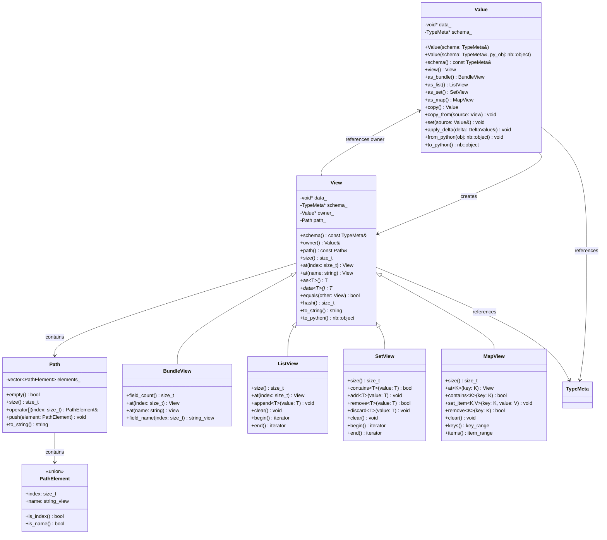
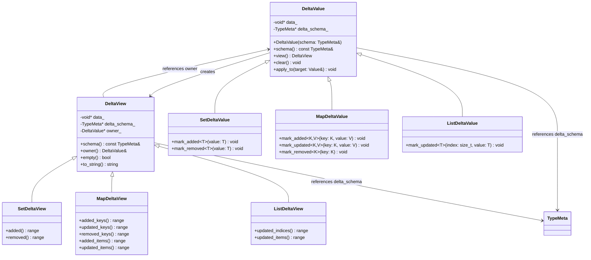
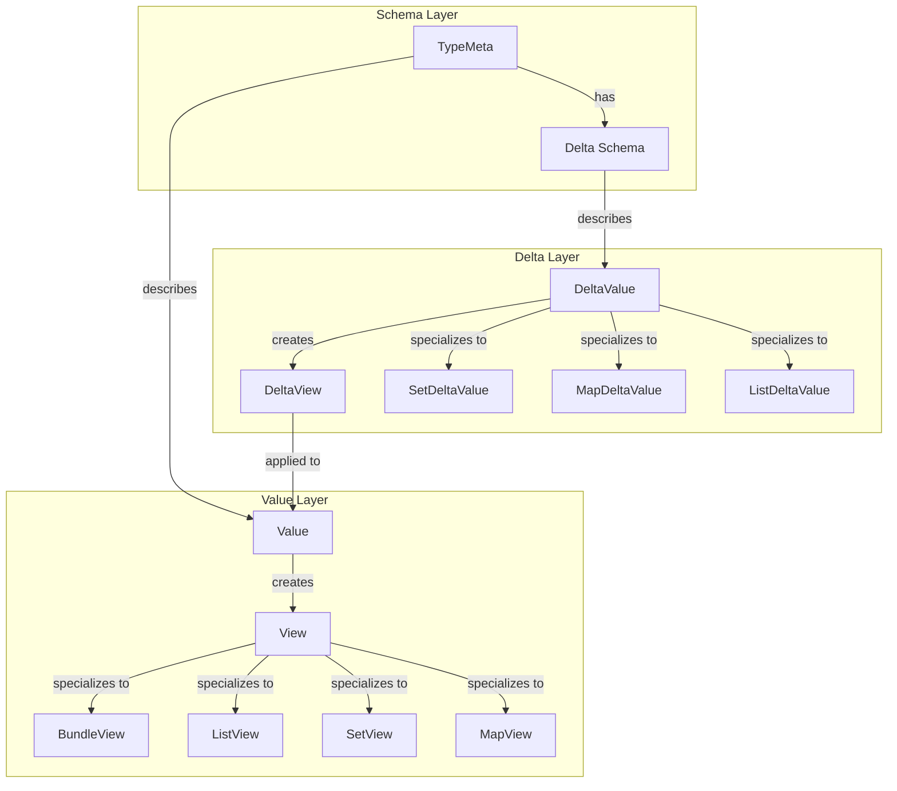

# Value: Constructing and Operating on Data

**Parent**: [Overview](00_OVERVIEW.md) | **Prerequisite**: [Schema](01_SCHEMA.md)

---

## What Is a Value?

A **Value** is a container for type-erased data. All Values are **scalar** (scalar in time - a single point, not a sequence). Values include atomic types (int, float, etc.) and composite types (bundles, lists, sets, maps).

Values are the **data layer** - they don't know anything about time, modification tracking, or observers. That's the job of time-series.

Every Value has an associated **schema** (TypeMeta) that describes its structure. You need a schema to construct a Value.

---

## Constructing Values

### From Schema

Values are constructed from their schema:

```cpp
#include <hgraph/types/value.h>

// Get schema by name (primary API)
const TypeMeta& int_schema = TypeMeta::get("int");
const TypeMeta& float_schema = TypeMeta::get("float");
const TypeMeta& datetime_schema = TypeMeta::get("datetime");

// Template shortcut (for types registered with register_type<T>)
const TypeMeta& int_schema2 = TypeMeta::get<int64_t>();

// Bundle schema (from registry or builder)
const TypeMeta& point_schema = TypeMeta::get("Point");

// Construct a value from schema
Value value(int_schema);            // Uninitialized int value
Value point_value(point_schema);    // Uninitialized bundle value

// Construct and initialize from Python object
Value value(int_schema, nb::int_(42));
Value point(point_schema, nb::dict("x"_a=1.0, "y"_a=2.0, "z"_a=3.0));
```

### Default Values

Newly constructed values have default state:

| Type | Default |
|------|---------|
| `bool` | false |
| `int` | 0 |
| `float` | 0.0 |
| `date` | MIN_DT date component |
| `datetime` | MIN_DT |
| `timedelta` | MIN_TD |
| `object` | None |
| Bundle | All fields at their defaults |
| List | Empty (size 0) |
| Set | Empty |
| Map | Empty |

---

## View: Accessing Values

A **View** provides access to a Value's data. Views are lightweight - they don't own data, they provide a perspective on it.

### What Values Provide

Values support the fundamental operations needed for data handling:

| Operation | Purpose |
|-----------|---------|
| **Storage ops** | Create, move, destroy (lifecycle management) |
| **Collection ops** | Equality, hash (for use in sets/maps) |
| **Logging** | `to_string()` for debugging and error reporting |
| **Python interop** | `to_python()`, `from_python()` conversion |

### Kind-Specific Views

Views provide type-erased accessors to the data based on kind. For each kind there is an associated view that provides the API appropriate for that structure:

```cpp
// Get a view from a Value
View v = value.view();              // Base view

// Kind-specific views provide specialized access
BundleView bv = value.as_bundle();  // Bundle-specific API
ListView lv = value.as_list();      // List-specific API
SetView sv = value.as_set();        // Set-specific API
MapView mv = value.as_map();        // Map-specific API
```

The base `View` provides common operations. Kind-specific views add the accessors relevant to that structure (field access for bundles, index access for lists, etc.).

```cpp
// Views are cheap to copy (pointer + schema + owner + path)
View v2 = v;                        // Shallow copy
```

### View Owner and Path

Every View maintains a reference to its **owning Value** and the **path** traversed to reach it:

```cpp
Value point(point_schema);
point.at("x").set<double>(1.0);

// Get a nested view
View x_view = point.view().at("x");

// Access owner and path
Value& owner = x_view.owner();        // Reference to 'point'
const Path& path = x_view.path();     // Path: ["x"]
std::string path_str = path.to_string();  // "x"

// Deeper nesting
Value nested(nested_schema);
View deep = nested.view().at("a").at(0).at("b");
// deep.path() → ["a", 0, "b"]
// deep.owner() → reference to 'nested'
```

The path tracks both named access (fields) and indexed access (list elements):

```cpp
// Path elements can be names or indices
for (size_t i = 0; i < path.size(); ++i) {
    const PathElement& elem = path[i];
    if (elem.is_name()) {
        std::cout << "." << elem.name;
    } else {
        std::cout << "[" << elem.index << "]";
    }
}
```

This enables navigation back to the root and understanding the view's context within the value structure.

### Reading Atomic Values

```cpp
View v = ...;

// Type-safe extraction
bool b = v.as<bool>();                      // Extract as bool
int64_t x = v.as<int64_t>();                // Extract as int
double f = v.as<double>();                  // Extract as float
engine_time_t dt = v.as<engine_time_t>();   // Extract as datetime

// Check type before extraction
if (v.schema().kind() == TypeKind::Atomic) {
    int64_t x = v.as<int64_t>();
}

// Convert to Python
nb::object py = v.to_python();
```

### Reading Bundle Values

```cpp
View point = ...;  // Bundle with fields x, y, z (all float)

// By field name
View x_view = point.at("x");        // Returns View
double x = point.at("x").as<double>();

// By index
View first = point.at(0);           // First field
double x = point.at(0).as<double>();

// Iteration
for (size_t i = 0; i < point.size(); ++i) {
    View field = point.at(i);
    std::string_view name = point.schema().field_name(i);
    std::cout << name << " = " << field.to_string() << "\n";
}

// Size
size_t num_fields = point.size();   // 3
```

### Reading List Values

```cpp
View prices = ...;  // List of float

// By index
View first = prices.at(0);
double first_val = prices.at(0).as<double>();

// Iteration
for (size_t i = 0; i < prices.size(); ++i) {
    double price = prices.at(i).as<double>();
    std::cout << price << "\n";
}

// Range-based iteration
for (View elem : prices) {
    std::cout << elem.as<double>() << "\n";
}

// Size
size_t count = prices.size();
```

### Reading Set Values

```cpp
View active_ids = ...;  // Set of int

// Membership
bool found = active_ids.contains(42);

// Iteration (order not guaranteed)
for (View elem : active_ids) {
    std::cout << elem.as<int64_t>() << "\n";
}

// Size
size_t count = active_ids.size();
```

### Reading Map Values

```cpp
View scores = ...;  // Map of int -> float

// By key
View score = scores.at(42);
double player_score = scores.at(42).as<double>();

// Key existence
bool has_player = scores.contains(42);

// Iteration
for (auto [key, value] : scores.items()) {
    std::cout << key.as<int64_t>() << ": "
              << value.as<double>() << "\n";
}

// Keys only
for (View key : scores.keys()) {
    std::cout << key.as<int64_t>() << "\n";
}

// Size
size_t count = scores.size();
```

---

## Writing Values

### Setting Atomic Values

```cpp
Value value(TypeMeta::get("int"));

// Type-safe setting
value.set<bool>(true);
value.set<int64_t>(42);
value.set<double>(3.14);
value.set<engine_time_t>(engine_time_t::now());

// From Python object
value.from_python(nb::int_(42));
```

### Modifying Bundle Values

```cpp
Value point(TypeMeta::get("Point"));

// Set individual fields
point.at("x").set<double>(1.0);
point.at("y").set<double>(2.0);
point.at(2).set<double>(3.0);       // z by index

// Set all at once from Python dict
point.from_python(nb::dict("x"_a=1.0, "y"_a=2.0, "z"_a=3.0));
```

### Modifying List Values

```cpp
Value prices(ListBuilder().set_element_type(TypeMeta::get("float")).build());

// Set element
prices.at(0).set<double>(100.0);

// Append (dynamic lists only)
prices.append(100.0);               // Typed append
prices.append_python(nb::float_(100.0)); // From Python

// Clear
prices.clear();

// Set all at once from Python list
prices.from_python(nb::list(nb::float_(100.0), nb::float_(101.0)));
```

### Modifying Set Values

```cpp
Value active_ids(SetBuilder().set_element_type(TypeMeta::get("int")).build());

// Add element
active_ids.add(42);
active_ids.add_python(nb::int_(42));

// Remove element
active_ids.remove(99);              // Returns bool
active_ids.discard(99);             // No error if not present

// Clear
active_ids.clear();

// Set all at once from Python set
active_ids.from_python(nb::set(nb::int_(1), nb::int_(2), nb::int_(3)));
```

### Modifying Map Values

```cpp
Value scores(MapBuilder()
    .set_key_type(TypeMeta::get("int"))
    .set_value_type(TypeMeta::get("float"))
    .build());

// Set entry
scores.set_item(42, 150.0);
scores.at(42).set<double>(150.0);   // If key exists

// Remove entry
scores.remove(99);                  // Returns bool

// Clear
scores.clear();

// Set all at once from Python dict
scores.from_python(nb::dict(nb::arg(42)=150.0, nb::arg(99)=140.0));
```

### Bulk Operations on Collections

Collections support bulk value assignment and delta application.

#### Full Value Assignment

Replace entire collection contents from another value of the same schema:

```cpp
Value prices1(list_schema);
Value prices2(list_schema);

// Populate prices1...
prices1.append(100.0);
prices1.append(101.0);

// Copy entire value
prices2.set(prices1);              // Full replacement
prices2.copy_from(prices1);        // Equivalent
```

#### Delta Values

A **DeltaValue** represents changes to apply to a collection. Unlike a regular Value which represents complete state, a DeltaValue represents a transition: additions, removals, and updates.

```cpp
// Create a delta for a set
DeltaValue set_delta(set_schema);
set_delta.mark_added(42);          // Element to add
set_delta.mark_added(43);
set_delta.mark_removed(99);        // Element to remove

// Create a delta for a map
DeltaValue map_delta(map_schema);
map_delta.mark_added(42, 150.0);   // Key-value to add
map_delta.mark_updated(43, 160.0); // Key-value to update
map_delta.mark_removed(99);        // Key to remove

// Create a delta for a list (index-based)
DeltaValue list_delta(list_schema);
list_delta.mark_updated(0, 100.5); // Update element at index
```

#### Applying Deltas

Apply a delta to transform a value:

```cpp
Value active_ids(set_schema);
active_ids.add(99);
active_ids.add(100);

DeltaValue delta(set_schema);
delta.mark_added(42);
delta.mark_removed(99);

// Apply the delta
active_ids.apply_delta(delta);
// Result: active_ids contains {42, 100}
```

#### Delta Schema

Each collection type has an associated delta schema:

| Value Type | Delta Representation |
|------------|---------------------|
| List | Index → new value (updates only) |
| Set | Added elements + removed elements |
| Map | Added entries + updated entries + removed keys |

```cpp
// Get delta schema from value schema
const TypeMeta& delta_schema = value_schema.delta_schema();

// Create delta with explicit schema
DeltaValue delta(delta_schema);
```

---

## Common Operations

### Comparison

```cpp
View a = ...;
View b = ...;

// Equality
bool eq = a.equals(b);
bool eq = (a == b);                 // Operator overload

// For ordered types
bool lt = a.less_than(b);
int cmp = a.compare(b);             // -1, 0, or 1
```

### Copying

```cpp
// Copy value
Value copy = value.copy();

// Copy into existing (must have same schema)
target.copy_from(source);

// Copy from View
Value copy(view.schema());
copy.copy_from(view);
```

### String Representation

```cpp
View v = ...;

// Human-readable string
std::string s = v.to_string();

// Stream output
std::cout << v << "\n";             // Uses to_string()
```

### Hashing

For hashable types (atomic scalars, tuples of hashable types):

```cpp
View v = ...;

// Hash value (only for hashable types)
size_t h = v.hash();
```

---

## Type Information

### Querying Schema

```cpp
View v = ...;

// Get schema
const TypeMeta& schema = v.schema();

// Schema properties
TypeKind kind = schema.kind();
size_t size = schema.byte_size();
bool is_fixed = schema.is_fixed_size();

// For bundles
size_t field_count = schema.field_count();
std::string_view name = schema.field_name(0);
const TypeMeta& field_schema = schema.field_type(0);

// For containers
const TypeMeta& elem_schema = schema.element_type();  // List/Set
const TypeMeta& key_schema = schema.key_type();       // Map
const TypeMeta& val_schema = schema.value_type();     // Map
```

### Type Kind Checking

```cpp
switch (schema.kind()) {
    case TypeKind::Bundle:
        // Handle bundle
        break;
    case TypeKind::List:
        // Handle list
        break;
    case TypeKind::Int:
        // Handle int
        break;
    // etc.
}
```

---

## Memory and Performance

### Contiguous Layout

Composite values store their data contiguously where possible:

```
Bundle[x: float, y: float, z: float]

Memory: [x: 8 bytes][y: 8 bytes][z: 8 bytes] = 24 bytes contiguous
```

This enables:
- Cache-friendly access
- Direct memory mapping for interop (numpy, Arrow)
- Efficient bulk operations

### Type-Erasure Trade-offs

Values are type-erased - the container doesn't know `T` at compile time:

| Aspect | Benefit | Cost |
|--------|---------|------|
| Flexibility | Runtime schema changes | Virtual dispatch overhead |
| Code size | No template bloat | Schema lookup per access |
| Interop | Easy Python/C++ bridging | Type checking at runtime |

For hot paths in C++, use typed extraction once and cache:

```cpp
// Less efficient: repeated type extraction
for (int i = 0; i < 1000000; ++i) {
    double x = view.at("x").as<double>();  // Schema lookup each time
    process(x);
}

// More efficient: extract once
double* x_ptr = view.at("x").data<double>();  // Direct pointer
for (int i = 0; i < 1000000; ++i) {
    process(*x_ptr);
}
```

---

## Relationship to Time-Series

A **time-series** wraps a **value** and adds:
- Modification time tracking (validity is derived from this - a time-series is valid if it has been modified at least once)
- Observer notifications
- Delta computation

```
┌─────────────────────────────────────┐
│           Time-Series               │
│  ┌───────────────────────────────┐  │
│  │           Value               │  │
│  │  (the actual data)            │  │
│  └───────────────────────────────┘  │
│  + last_modified_time               │
│  + observers                        │
└─────────────────────────────────────┘
```

### Accessing Values from Time-Series

```cpp
// Input (read-only)
TSInput price = ...;

// Access the value (type-erased)
View v = price.value();                   // Returns type-erased View
double current = v.as<double>();          // Extract typed value
nb::object py_val = price.to_python();    // Get as Python object

// Time-series properties
bool changed = price.modified();          // True if changed this tick
bool is_set = price.valid();              // True if ever been set
engine_time_t last_mod = price.last_modified_time();  // Time of last modification

// Output (read-write)
TSOutput price_out = ...;
price_out.set_value(42.0);                // Set value (marks modified)

// For composites - access nested values
TSInput quote = ...;  // TSB[bid: TS[float], ask: TS[float]]
double bid = quote.field("bid").value().as<double>();  // Field's current value
nb::object full = quote.to_python();                   // Entire bundle as Python object
```

---

## Python Interop

Values convert to and from Python objects:

```cpp
Value value(TypeMeta::get("Point"));

// Python -> Value
value.from_python(nb::dict("x"_a=1.0, "y"_a=2.0, "z"_a=3.0));

// Value -> Python
nb::object py_obj = value.to_python();
```

The conversion follows the schema:
- Atomic types map to Python primitives (bool, int, float, date, datetime, timedelta)
- `object` type passes through as-is
- Bundles map to dicts (or dataclass instances if schema has a Python type)
- Lists map to Python lists
- Sets map to Python frozensets
- Maps map to Python dicts (or frozendicts)

---

## Core API Structure

### Class Diagram - Value



### Class Diagram - DeltaValue and DeltaView



### Relationships Overview



### Value Operations Summary


---

## Next

- [Time-Series](03_TIME_SERIES.md) - Adding time semantics to values
- [Links and Binding](04_LINKS_AND_BINDING.md) - How data flows between nodes
