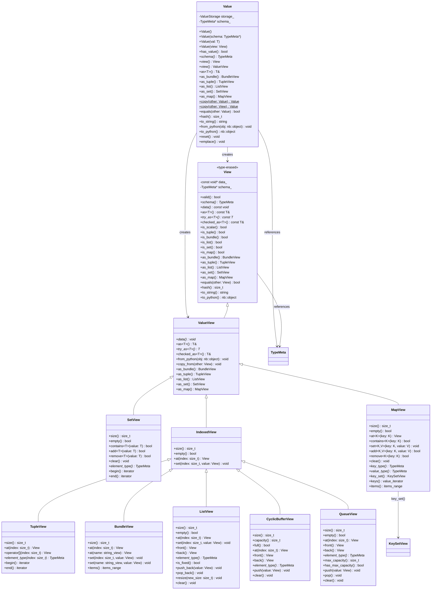

# Value: Constructing and Operating on Data

**Parent**: [Overview](00_OVERVIEW.md) | **Prerequisite**: [Schema](01_SCHEMA.md)

---

## What Is a Value?

A **Value** is a container for type-erased data. All Values are **scalar** (scalar in time - a single point, not a sequence). Values include atomic types (int, float, etc.) and composite types (bundles, lists, sets, maps).

Values are the **data layer** - they don't know anything about time, modification tracking, or observers. That's the job of time-series.

Every Value has an associated **schema** (TypeMeta) that describes its structure. You need a schema to construct a Value.

---

## Constructing Values

### From Schema

Values are constructed from their schema:

```cpp
#include <hgraph/types/value.h>

// Get schema by name (primary API)
const TypeMeta* int_schema = TypeMeta::get("int");
const TypeMeta* float_schema = TypeMeta::get("float");
const TypeMeta* datetime_schema = TypeMeta::get("datetime");

// Template shortcut (for types registered with register_type<T>)
const TypeMeta* int_schema2 = TypeMeta::get<int64_t>();

// Bundle schema (from registry or builder)
const TypeMeta* point_schema = TypeMeta::get("Point");

// Construct a value from schema
Value value(int_schema);            // Typed-null int value
Value point_value(point_schema);    // Typed-null bundle value

// Initialize from Python object
value.from_python(nb::int_(42));
point_value.from_python(nb::dict("x"_a=1.0, "y"_a=2.0, "z"_a=3.0));
```

### Default Values

Typed-null values become default-initialized after `emplace()`:

| Type | Default |
|------|---------|
| `bool` | false |
| `int` | 0 |
| `float` | 0.0 |
| `date` | MIN_DT date component |
| `datetime` | MIN_DT |
| `timedelta` | MIN_TD |
| `object` | None |
| Bundle | All fields at their defaults |
| List | Empty (size 0) |
| Set | Empty |
| Map | Empty |

### Null Values

Values can represent null (None) using `std::optional`-style semantics. Unlike a simple "no value" state, Value maintains a **typed null** - the schema is always preserved even when null.

```cpp
// Create a typed null value (has schema, but no data)
Value null_int(TypeMeta::get("int"));
assert(!null_int.has_value());           // Is null
assert(std::string_view(null_int.schema()->name) == "int"); // But schema is accessible

// Emplace to construct a value (makes non-null)
null_int.emplace();  // Default constructs (0 for int)
assert(null_int.has_value());

// Check for null
if (value.has_value()) {
    // Safe to access data
    View v = value.view();
}

// Boolean context
if (value) {
    // Has a value
}

// Make existing value null (preserves schema)
value.reset();
```

**Python Interop:**

```cpp
// Null Value converts to Python None
Value null_val(TypeMeta::get("int"));
nb::object py = null_val.to_python();  // Returns nb::none()

// Python None converts to null Value
value.from_python(nb::none());  // Calls reset(), makes value null
```

**Key Points:**

- `Value(schema)` preserves schema while null (`has_value() == false`)
- Default-constructed `Value()` has no schema until assigned/constructed from schema
- `schema()` is safe to call (returns `nullptr` if no schema)
- `data()` and `view()` throw `std::bad_optional_access` when null
- `reset()` makes the value null but preserves the schema
- `emplace()` constructs a default value, making it non-null

---

## View: Accessing Values

A **View** provides access to a Value's data. Views are lightweight - they don't own data, they provide a perspective on it.

### What Values Provide

Values support the fundamental operations needed for data handling:

| Operation | Purpose |
|-----------|---------|
| **Storage ops** | Create, move, destroy (lifecycle management) |
| **Collection ops** | Equality, hash (for use in sets/maps) |
| **Logging** | `to_string()` for debugging and error reporting |
| **Python interop** | `to_python()`, `from_python()` conversion |

### Kind-Specific Views

Views provide type-erased accessors to the data based on kind. For each kind there is an associated view that provides the API appropriate for that structure:

```cpp
// Get a view from a Value
View v = value.view();              // Base view

// Kind-specific views provide specialized access (throwing on type mismatch)
TupleView tv = value.as_tuple();    // Tuple-specific API (heterogeneous indexed)
BundleView bv = value.as_bundle();  // Bundle-specific API (named fields)
ListView lv = value.as_list();      // List-specific API (homogeneous indexed)
SetView sv = value.as_set();        // Set-specific API (unique elements)
MapView mv = value.as_map();        // Map-specific API (key-value pairs)
CyclicBufferView cbv = value.as_cyclic_buffer();  // Cyclic buffer API
QueueView qv = value.as_queue();    // Queue API (FIFO)

// Safe conversions (return std::optional, nullopt on type mismatch)
std::optional<BundleView> maybe_bv = v.try_as_bundle();
if (maybe_bv) {
    // Use *maybe_bv
}

// Type checking before conversion
if (v.is_bundle()) {
    BundleView bv = v.as_bundle();  // Safe - we checked first
}
```

The base `View` provides common operations. Kind-specific views add the accessors relevant to that structure (field access for bundles, index access for lists, etc.).

```cpp
// Views are cheap to copy (pointer + schema)
View v2 = v;                        // Shallow copy
```

### View Context

Current `View`/`ValueView` APIs are intentionally minimal: they carry data pointer + schema and do not expose public owner/path metadata. Context tracking is handled at higher layers when needed.

### Reading Atomic Values

```cpp
View v = ...;

// Type-safe extraction
bool b = v.as<bool>();                      // Extract as bool
int64_t x = v.as<int64_t>();                // Extract as int
double f = v.as<double>();                  // Extract as float
engine_time_t dt = v.as<engine_time_t>();   // Extract as datetime

// Check type before extraction
if (v.schema()->kind == TypeKind::Atomic) {
    int64_t x = v.as<int64_t>();
}

// Convert to Python
nb::object py = v.to_python();
```

### Reading Bundle Values

```cpp
View point = ...;  // Bundle with fields x, y, z (all float)
BundleView bundle = point.as_bundle();

// By field name
View x_view = bundle.at("x");
double x = bundle.at("x").as<double>();

// By index
View first = bundle.at(0);          // First field
double x = bundle.at(0).as<double>();

// Iteration
for (auto [name, field] : bundle.items()) {
    std::cout << name << " = " << field.to_string() << "\n";
}

// Size
size_t num_fields = bundle.size();
```

### Reading List Values

```cpp
View prices = ...;  // List of float
ListView list = prices.as_list();

// By index
View first = list.at(0);
double first_val = list.at(0).as<double>();

// Iteration
for (size_t i = 0; i < list.size(); ++i) {
    double price = list.at(i).as<double>();
    std::cout << price << "\n";
}

// Range-based iteration
for (View elem : list) {
    std::cout << elem.as<double>() << "\n";
}

// Size
size_t count = list.size();
```

### Reading Set Values

```cpp
View active_ids = ...;  // Set of int
SetView set = active_ids.as_set();

// Membership
bool found = set.contains(42);

// Iteration (order not guaranteed)
for (View elem : set) {
    std::cout << elem.as<int64_t>() << "\n";
}

// Size
size_t count = set.size();
```

### Reading Map Values

```cpp
View scores = ...;  // Map of int -> float
MapView map = scores.as_map();

// By key
View score = map.at(42);
double player_score = map.at(42).as<double>();

// Key existence
bool has_player = map.contains(42);

// Iteration over (key, value) pairs
for (auto [key, value] : map.items()) {
    std::cout << key.as<int64_t>() << ": "
              << value.as<double>() << "\n";
}

// Keys as a SetView (for set operations like contains, iteration)
KeySetView key_set = map.key_set();
for (View key : key_set) {
    std::cout << key.as<int64_t>() << "\n";
}

// Keys as value iterator (just the keys)
for (View key : map.keys()) {
    std::cout << key.as<int64_t>() << "\n";
}

// Size
size_t count = map.size();
```

> **Performance Note**: Sets and Maps provide **O(1)** average-case lookup, insertion, and deletion. They are implemented using hash-based containers internally.

---

## Writing Values

### Setting Atomic Values

```cpp
Value value(TypeMeta::get("int"));
value.emplace();

// Type-safe mutation via typed reference
value.as<int64_t>() = 42;

// From Python object
value.from_python(nb::int_(42));
```

### Modifying Bundle Values

```cpp
Value point(TypeMeta::get("Point"));
point.emplace();
auto bundle = point.as_bundle();

// Set individual fields
bundle.set("x", 1.0);
bundle.set("y", 2.0);
bundle.set("z", 3.0);

// Set all at once from Python dict
point.from_python(nb::dict("x"_a=1.0, "y"_a=2.0, "z"_a=3.0));
```

### Modifying List Values

```cpp
Value prices(ListBuilder().set_element_type(TypeMeta::get("float")).build());
prices.emplace();
auto list = prices.as_list();

// Set element
list.resize(1);
list.set(0, 100.0);

// Append (dynamic lists only)
list.push_back(101.0);

// Clear
list.clear();

// Set all at once from Python list
prices.from_python(nb::list(nb::float_(100.0), nb::float_(101.0)));
```

### Modifying Set Values

```cpp
Value active_ids(SetBuilder().set_element_type(TypeMeta::get("int")).build());
active_ids.emplace();
auto set = active_ids.as_set();

// Add element (returns true if added, false if already present)
bool added = set.add(42);

// Remove element (returns true if removed, false if not present)
bool removed = set.remove(99);

// Clear
set.clear();

// Set all at once from Python set
active_ids.from_python(nb::set(nb::int_(1), nb::int_(2), nb::int_(3)));
```

### Modifying Map Values

```cpp
Value scores(MapBuilder()
    .set_key_type(TypeMeta::get("int"))
    .set_value_type(TypeMeta::get("float"))
    .build());
scores.emplace();
auto map = scores.as_map();

// Set entry
map.set(42, 150.0);
map.add(99, 140.0);

// Remove entry
map.remove(99);                     // Returns bool

// Clear
map.clear();

// Set all at once from Python dict
scores.from_python(nb::dict(nb::arg(42)=150.0, nb::arg(99)=140.0));
```

### Bulk Operations on Collections

Collections support bulk value assignment and delta application.

#### Full Value Assignment

Replace entire collection contents from another value of the same schema:

```cpp
Value prices1(list_schema);
Value prices2(list_schema);
prices1.emplace();
prices2.emplace();
auto list1 = prices1.as_list();

// Populate prices1...
list1.push_back(100.0);
list1.push_back(101.0);

// Copy entire value
prices2 = Value::copy(prices1);     // Explicit copy API
```

#### Delta Values

A **DeltaValue** represents changes to apply to a collection. Unlike a regular Value which represents complete state, a DeltaValue represents a transition: additions, removals, and updates.

```cpp
// Create a delta for a set
DeltaValue set_delta(set_schema);
set_delta.mark_added(42);          // Element to add
set_delta.mark_added(43);
set_delta.mark_removed(99);        // Element to remove

// Create a delta for a map
DeltaValue map_delta(map_schema);
map_delta.mark_added(42, 150.0);   // Key-value to add
map_delta.mark_updated(43, 160.0); // Key-value to update
map_delta.mark_removed(99);        // Key to remove

// Create a delta for a list (index-based)
DeltaValue list_delta(list_schema);
list_delta.mark_updated(0, 100.5); // Update element at index
```

#### Applying Deltas

Apply a delta to transform a value:

```cpp
Value active_ids(set_schema);
active_ids.add(99);
active_ids.add(100);

DeltaValue delta(set_schema);
delta.mark_added(42);
delta.mark_removed(99);

// Apply the delta
active_ids.apply_delta(delta);
// Result: active_ids contains {42, 100}
```

#### Delta Schema

Each collection type has an associated delta schema:

| Value Type | Delta Representation |
|------------|---------------------|
| List | Index → new value (updates only) |
| Set | Added elements + removed elements |
| Map | Added entries + updated entries + removed keys |

```cpp
// Get delta schema from value schema
const TypeMeta& delta_schema = value_schema.delta_schema();

// Create delta with explicit schema
DeltaValue delta(delta_schema);
```

---

## Common Operations

### Comparison

```cpp
View a = ...;
View b = ...;

// Equality
bool eq = a.equals(b);
bool eq = (a == b);                 // Operator overload
```

### Copying

```cpp
// Copy value
Value copy = Value::copy(value);

// Copy from View
Value from_view = Value::copy(view);
```

### String Representation

```cpp
View v = ...;

// Human-readable string
std::string s = v.to_string();

// Stream output
std::cout << v << "\n";             // Uses to_string()
```

### Hashing

For hashable types (atomic scalars, tuples of hashable types):

```cpp
View v = ...;

// Hash value (only for hashable types)
size_t h = v.hash();
```

---

## Type Information

### Querying Schema

```cpp
View v = ...;

// Get schema
const TypeMeta* schema = v.schema();

// Schema properties
TypeKind kind = schema->kind;
size_t size = schema->size;
bool is_fixed = schema->is_fixed_size();

// For bundles
size_t field_count = schema->field_count;
std::string_view name = schema->fields[0].name;
const TypeMeta* field_schema = schema->fields[0].type;

// For containers
const TypeMeta* elem_schema = schema->element_type;   // List/Set
const TypeMeta* key_schema = schema->key_type;        // Map
const TypeMeta* val_schema = schema->element_type;    // Map value type
```

### Type Kind Checking

```cpp
switch (schema->kind) {
    case TypeKind::Bundle:
        // Handle bundle
        break;
    case TypeKind::List:
        // Handle list
        break;
    case TypeKind::Atomic:
        // Handle scalar
        break;
    // etc.
}
```

---

## Memory and Performance

### Contiguous Layout

Composite values store their data contiguously where possible:

```
Bundle[x: float, y: float, z: float]

Memory: [x: 8 bytes][y: 8 bytes][z: 8 bytes] = 24 bytes contiguous
```

This enables:
- Cache-friendly access
- Direct memory mapping for interop (numpy, Arrow)
- Efficient bulk operations

### Type-Erasure Trade-offs

Values are type-erased - the container doesn't know `T` at compile time:

| Aspect | Benefit | Cost |
|--------|---------|------|
| Flexibility | Runtime schema changes | Virtual dispatch overhead |
| Code size | No template bloat | Schema lookup per access |
| Interop | Easy Python/C++ bridging | Type checking at runtime |

For hot paths in C++, use typed extraction once and cache:

```cpp
// Less efficient: repeated type extraction
for (int i = 0; i < 1000000; ++i) {
    double x = view.at("x").as<double>();  // Schema lookup each time
    process(x);
}

// More efficient: extract once
double* x_ptr = view.at("x").data<double>();  // Direct pointer
for (int i = 0; i < 1000000; ++i) {
    process(*x_ptr);
}
```

---

## Python Interop

Values convert to and from Python objects:

```cpp
Value value(TypeMeta::get("Point"));

// Python -> Value
value.from_python(nb::dict("x"_a=1.0, "y"_a=2.0, "z"_a=3.0));

// Value -> Python
nb::object py_obj = value.to_python();
```

The conversion follows the schema:
- Atomic types map to Python primitives (bool, int, float, date, datetime, timedelta)
- `object` type passes through as-is
- Bundles map to dicts (or dataclass instances if schema has a Python type)
- Lists map to Python lists
- Sets map to Python sets
- Maps map to Python dicts

---

## Core API Structure

### Class Diagram - Value



### Class Diagram - DeltaValue and DeltaView


### Relationships Overview


### Value Operations Summary


---

## Next

- [Time-Series](03_TIME_SERIES.md) - Adding time semantics to values
- [Links and Binding](04_LINKS_AND_BINDING.md) - How data flows between nodes
