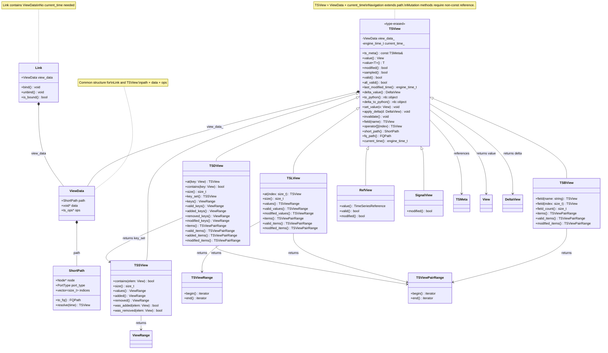
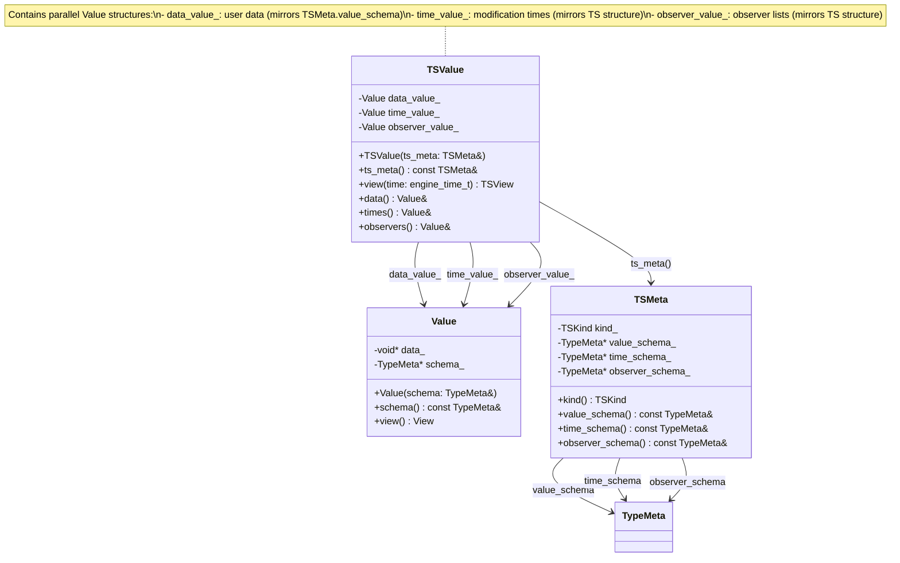
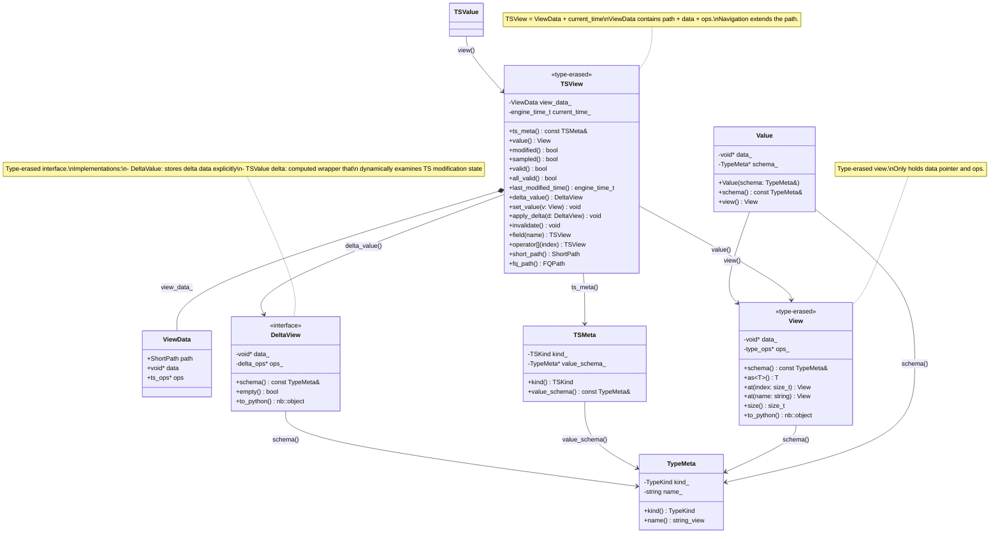
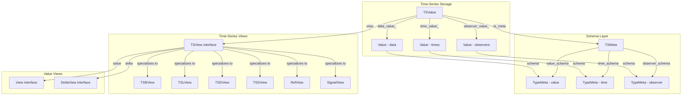
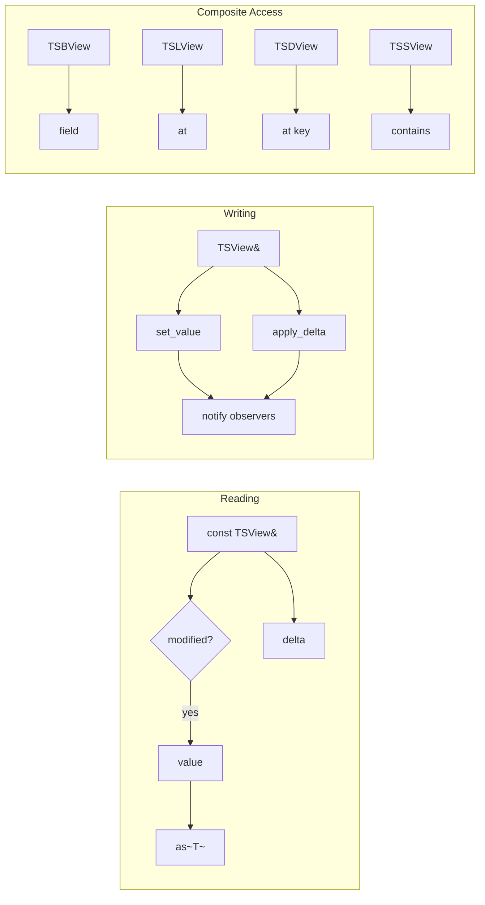
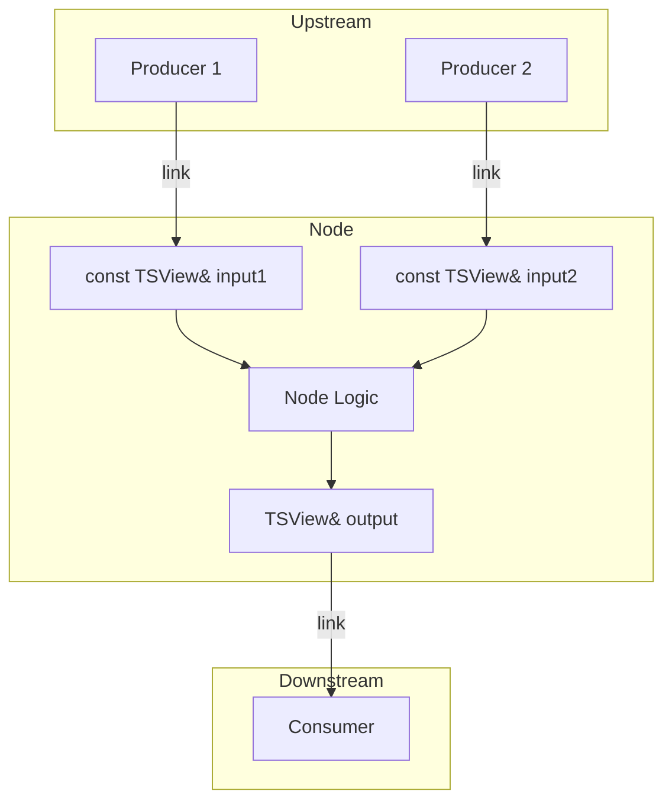

# Time-Series: Values That Change Over Time

**Parent**: [Overview](00_OVERVIEW.md) | **Prerequisite**: [Value](02_VALUE.md)

---

## What Is a Time-Series?

A **time-series** is a value with temporal semantics:
- It tracks **when** it was last modified
- It can notify **observers** when it changes
- It knows whether it has **valid** data

Time-series are the primary abstraction users work with in graph code.

---

## Relationship to Value

A time-series **wraps** a [Value](02_VALUE.md) and adds temporal tracking:

```
┌─────────────────────────────────────┐
│           Time-Series               │
│  ┌───────────────────────────────┐  │
│  │           Value               │  │
│  │  (the actual data)            │  │
│  └───────────────────────────────┘  │
│  + last_modified_time               │
│  + observers                        │
└─────────────────────────────────────┘
```

The Value layer provides:
- Type-erased data storage
- Schema-driven operations (copy, equality, hash)
- Python interop

The Time-Series layer adds:
- Modification time tracking (validity is derived from this - a time-series is valid if it has been modified at least once)
- Observer notifications for reactive updates
- Delta computation for incremental processing

### Accessing the Underlying Value

```cpp
const TSView& price = ...;

// Access the value (type-erased View)
View v = price.value();                   // Returns type-erased View
double current = v.as<double>();          // Extract typed value
nb::object py_val = price.to_python();    // Get as Python object

// Time-series properties (not available on Value)
bool changed = price.modified();          // True if changed this tick
bool is_set = price.valid();              // True if ever been set
engine_time_t last_mod = price.last_modified_time();  // Time of last modification

// For composites - access nested values
const TSBView& quote = ...;  // TSB[bid: TS[float], ask: TS[float]]
double bid = quote.field("bid").value().as<double>();  // Field's current value
nb::object full = quote.to_python();                   // Entire bundle as Python object
```

---

## Time-Series Views and Time Binding

A time-series **view** must be created with a specific **datetime** value. The view is bound to that time and is only meaningful at that point.

```cpp
// Create a view bound to a specific time
engine_time_t current_time = engine.current_time();
TSView price = ts.view(current_time);

// The view is meaningful only at this time
bool changed = price.modified();          // Modified at current_time?
double val = price.value().as<double>();  // Value at current_time (type-erased access)
```

### Why Time Binding?

Time-series track changes across ticks. The view needs to know "when" in order to answer:
- `.modified()` - Was this modified **at this time**?
- `.delta_value()` - What changed **at this time**?

A view created at time T₁ will report different `modified()` results than a view created at time T₂.

### Delta Views Inherit Time Binding

When you extract a delta view from a time-series view, it inherits the time binding:

```cpp
TSView price = ts.view(current_time);

// Delta is bound to the same time as the parent view
DeltaView delta = price.delta_value();  // Delta at current_time
```

This ensures consistency - the delta represents exactly what changed at the view's bound time.

**Important**: The delta view returned from a TSView is a **computed wrapper**, not stored data. It dynamically examines the modification state of the time-series to determine what changed. This is different from `DeltaValue`, which explicitly stores delta information. The wrapper approach is more memory-efficient for time-series since deltas are typically consumed once per tick and don't need persistent storage.

### In Node Context

Within graph nodes, views are typically provided pre-bound to the current engine time:

```cpp
void my_node(const TSView& price) {
    // price is already bound to current engine time
    // No need to specify time explicitly
    if (price.modified()) {
        // ...
    }
}
```

---

## Time-Series Kinds

### TS[T] - Scalar Time-Series

The most common type. Wraps a single scalar value.

```cpp
TSView price = ...;

// Reading
double current_price = price.value().as<double>();  // Get current value (type-erased)
bool did_change = price.modified();                 // True if changed this tick
bool is_set = price.valid();                        // True if ever been set

// Writing (outputs only)
TSView price_out = ...;                             // Non-const for outputs
price_out.set_value(value_from(42.0));              // Set new value (marks modified)
```

### TSB[Schema] - Bundle Time-Series

A bundle where **each field is independently tracked**:

```cpp
// Schema defined via TSMeta
TSBView quote = ...;  // TSB[bid: TS[float], ask: TS[float], timestamp: TS[datetime]]

// Field access - each field is a time-series
double bid = quote.field("bid").value<double>();   // Current bid price
bool bid_changed = quote.field("bid").modified();  // Did bid change?
bool ask_changed = quote.field("ask").modified();  // Did ask change?

// Or via index
double bid = quote[0].value<double>();             // By position

// Container-level queries
bool any_changed = quote.modified();               // Did ANY field change?
bool is_valid = quote.valid();                     // Is the bundle itself valid?
bool all_valid = quote.all_valid();                // Are ALL fields valid?
```

Key insight: `quote.modified()` is true if **any** child changed. You can drill down to see exactly which fields changed.

### TSL[TS[T], Size] - List Time-Series

A list of **independent time-series elements**:

```cpp
// Fixed-size list of 10 floats
TSLView prices = ...;

// Dynamic-size list
TSLView prices_dyn = ...;

// Element access - each element is a time-series
double first = prices[0].value().as<double>();  // Value of first element (type-erased)
bool elem_changed = prices[0].modified();       // Did element 0 change?

// Container queries
size_t count = prices.size();                   // Number of elements
bool any_changed = prices.modified();           // Did ANY element change?

// Iteration
for (auto ts_elem : prices) {
    if (ts_elem.modified()) {
        std::cout << ts_elem.value().as<double>() << "\n";
    }
}
```

### TSD[K, TS[V]] - Dict Time-Series

Maps **scalar keys** to **time-series values**:

```cpp
// Int keys to float time-series
TSDView stock_prices = ...;  // TSD[int, TS[float]]

// Key-based access
double price = stock_prices[123].value();     // Current price for key 123
bool changed = stock_prices[123].modified();  // Did this key change?

// Key existence
bool has_key = stock_prices.contains(123);    // Is key present?

// Key iteration
for (auto key : stock_prices.keys()) {
    if (stock_prices[key].modified()) {
        std::cout << key.as<int64_t>() << ": " << stock_prices[key].value() << "\n";
    }
}

// Key set access (TSS-like view)
auto key_set = stock_prices.key_set();        // View of keys as a set
```

Keys are scalars (not time-series). Values are time-series. The **key set** can change over time (keys added/removed), and this is tracked.

### TSS[T] - Set Time-Series

A **set of scalar values** that changes over time:

```cpp
TSSView active_ids = ...;  // TSS[int]

// Membership
bool is_active = active_ids.contains(42);   // Is 42 in the set?
size_t count = active_ids.size();           // Number of elements

// Change tracking (set-level delta)
for (auto id : active_ids.added()) {        // Elements added this tick
    std::cout << "Added: " << id.as<int64_t>() << "\n";
}
for (auto id : active_ids.removed()) {      // Elements removed this tick
    std::cout << "Removed: " << id.as<int64_t>() << "\n";
}

// Check specific element changes
bool was_added = active_ids.was_added(42);
bool was_removed = active_ids.was_removed(99);

// Iteration over current values
for (auto id : active_ids.values()) {
    std::cout << id.as<int64_t>() << "\n";
}
```

Unlike TSD, TSS contains **scalars** not time-series. The delta tracks which elements were added/removed.

### REF[TS[T]] - Reference Time-Series

REF holds a **TimeSeriesReference** as its value. Conceptually, `REF[TS[T]]` behaves like `TS[TimeSeriesReference]` - it's a time-series containing a reference value.

```cpp
RefView price_ref = ...;

// The value is a TimeSeriesReference
auto ref_value = price_ref.value();   // Returns TimeSeriesReference

// State queries
bool changed = price_ref.modified();  // Did the reference change this tick?
bool has_ref = price_ref.valid();     // Does it contain a valid reference?

// Writing (outputs only)
RefView price_ref_out = ...;          // Non-const for outputs
price_ref_out.set_value(some_ts.ref());  // Set reference to point to some_ts
```

### REF Binding Semantics

In the following, "time-series" refers to any time-series type (TS, TSB, TSL, TSD, TSS, SIGNAL), not just `TS[T]`.

**REF → REF**: Normal scalar binding. The TimeSeriesReference value is copied like any other scalar. No special behavior.

**REF → time-series**: Special conversion. When a REF output is linked to a time-series input:
- The runtime extracts the target time-series from the reference
- A **dynamic link** is established to the target
- When the reference changes, the link is updated to follow the new target
- The input sees the referenced time-series's value and modifications

**time-series → REF**: Special conversion. When a time-series output is linked to a REF input:
- A TimeSeriesReference pointing to the time-series is created
- The REF input's value is this reference

### Sampled Flag on REF Traversal

When a REF link is traversed and the reference itself was modified (i.e., the reference changed to point to a different target), all views obtained through that reference are marked as **sampled**. A sampled view reports `modified() == true` regardless of whether the underlying target time-series was actually modified at the current tick.

```cpp
// TSView API for sampled state
ts_view.sampled();   // True if view was obtained through a modified REF
ts_view.modified();  // Returns true if sampled() OR actual modification
```

This ensures that when a dynamic routing decision changes, downstream consumers are notified:

```cpp
// Example: REF changes from primary to secondary at T2
//
// T1: REF -> primary (price=100), primary.modified()=true
//     consumer sees: price.modified()=true, price.value()=100
//
// T2: REF -> secondary (price=200), REF.modified()=true, secondary.modified()=false
//     consumer sees: price.modified()=true (sampled!), price.value()=200
//     Even though secondary wasn't modified, consumer sees modified=true
//     because the data source changed
//
// T3: REF -> secondary (unchanged), secondary.modified()=false
//     consumer sees: price.modified()=false, price.value()=200
//     Normal behavior - no sampling, no modification
```

```cpp
// Example: Dynamic routing with REF → TS binding
void select_source(
    const TSView& use_primary,
    const TSView& primary,
    const TSView& secondary,
    RefView& output
) {
    // Returns a reference to the selected source
    if (use_primary.value().as<bool>()) {
        output.set_value(primary.ref());    // Reference to primary
    } else {
        output.set_value(secondary.ref());  // Reference to secondary
    }
}

// Consumer with TS input - dynamic link from REF→TS binding
void consumer(const TSView& price, TSView& output) {
    // When wired: consumer(price=select_source(...))
    // The REF→TS binding creates a dynamic link
    // price.value() follows whichever source is selected
    //
    // If the REF was modified (source switched), price.modified() returns true
    // due to the sampled flag, even if the new target wasn't modified
    if (price.modified()) {
        output.set_value(value_from("Price: " + std::to_string(price.value().as<double>())));
    }
}
```

See [Links and Binding](04_LINKS_AND_BINDING.md) for more details on dynamic routing.

### SIGNAL - Event Without Value

A time-series that **ticks** but carries no semantic data. Any time-series can be connected as a peer to a SIGNAL input:

```cpp
SignalView heartbeat = ...;

// Primary query
bool ticked = heartbeat.modified();    // Did it tick?

// value() is available but maps to modified state
bool ticked_alt = heartbeat.value<bool>();  // Returns heartbeat.modified()
```

SIGNAL's value represents its modification state. This allows uniform API access patterns while maintaining the semantics that signals are pure event notifications.

Use signals for:
- Pure event notification (heartbeats, triggers)
- Ignoring the actual value of a time-series and only reacting to "something changed"

---

## Input vs Output

### Inputs (Read-Only)

When a time-series appears as a node **input**, you get a read-only view:

```cpp
// Input view - read-only (const reference)
void my_node(const TSView& price) {
    // Can read
    double v = price.value().as<double>();
    bool m = price.modified();

    // Cannot write - const TSView has no set_value()
}
```

Inputs are **linked** to outputs. See [Links and Binding](04_LINKS_AND_BINDING.md).

### Outputs (Read-Write)

When a time-series is a node **output**, you own it and can write:

```cpp
// Output - writable (non-const reference)
void my_node(TSView& output) {
    // Set value explicitly
    output.set_value(value_from(42.0));
}
```

Writing to an output:
1. Updates the value
2. Sets `last_modified_time` to current engine time
3. Notifies observers (linked inputs)

---

## Key Properties

### `.value()` / `.value<T>()`

Two patterns are available for accessing the current data:

```cpp
// Pattern 1: Type-erased access
View v = price.value();               // Returns type-erased View
double d = v.as<double>();            // Extract typed value

// Pattern 2: Direct typed access (shorthand for value().as<T>())
double d = price.value<double>();     // Equivalent to price.value().as<double>()
```

Both patterns work for scalar and composite access:

```cpp
// Scalar time-series
double v = price.value().as<double>();   // Type-erased then extract
double v = price.value<double>();        // Shorthand

// Bundle field access
double bid = quote.field("bid").value().as<double>();
double bid = quote.field("bid").value<double>();     // Shorthand

// List element access
double first = prices[0].value().as<double>();
double first = prices[0].value<double>();            // Shorthand

// Python interop (always type-erased)
nb::object val = quote.to_python();      // Entire bundle as Python object
```

### `.modified()`

True if the time-series was modified **this tick** (current engine time).

```cpp
if (price.modified()) {
    // React to change
    double new_value = price.value();
}
```

For composite types, `modified()` is true if **any** descendant was modified.

### `.valid()`

True if the time-series has **ever been set** (has meaningful data). A time-series becomes invalid when:
- It has never been written to (initial state)
- It has been explicitly invalidated via `.invalidate()`

```cpp
if (!price.valid()) {
    // No data yet, skip processing
    return;
}

// Safe to access value
process(price.value());
```

### Accessing Invalid/Invalidated Time-Series

When a time-series is not valid (either never set or explicitly invalidated):

| Method | Behavior on Invalid |
|--------|---------------------|
| `.value()` | Returns `None` (Python) / sentinel value |
| `.value<T>()` | Returns `None` (Python) / sentinel value |
| `.delta_value()` | Throws exception |
| Navigation (`.field()`, `[]`) | Throws exception |
| `.to_python()` | Returns `None` |

```cpp
TSView price = ...;  // Never written to

if (!price.valid()) {
    // value() is safe - returns None/sentinel
    auto v = price.value();  // v represents "no value"

    // But delta and navigation throw
    // price.delta_value();  // Would throw
    // price.field("x");     // Would throw
}
```

This design allows safe "peek" operations via `value()` while enforcing explicit validity checks before more complex operations.

### `.all_valid()`

True if the time-series **and all children** are valid. For scalars, returns the same as `.valid()`. For composites, checks all descendants:

```cpp
// Bundle: all fields must be valid
if (quote.all_valid()) {
    // Safe to access all fields
    double spread = quote.field("ask").value<double>() - quote.field("bid").value<double>();
}

// Scalar: same as valid()
if (price.all_valid()) {  // Equivalent to price.valid()
    process(price.value());
}
```

### `.last_modified_time()`

The engine time when this was last modified. Used internally for `modified()` check.

```cpp
// Usually you use .modified() instead
if (price.last_modified_time() == current_engine_time) {
    // Same as price.modified()
}
```

---

## Hierarchical Change Tracking

Changes propagate **upward**:

```
TSB[a: TS[int], b: TS[float]]
         │
         ▼
┌─────────────────────────────────┐
│  TSB (bundle)                   │
│  modified_time: T2              │  ◄── Updated when child changes
│                                 │
│  ┌──────────┐  ┌──────────┐    │
│  │ field a  │  │ field b  │    │
│  │ time: T1 │  │ time: T2 │    │  ◄── Field b changed at T2
│  └──────────┘  └──────────┘    │
└─────────────────────────────────┘
```

When `b` is modified:
1. `b.modified()` → true
2. `b.last_modified_time()` → T2
3. Parent bundle's `last_modified_time()` → T2
4. `bundle.modified()` → true

This continues up to the root.

---

## Delta Access

For composites, you can query **what changed**:

```cpp
// Bundle: which fields changed?
for (auto [name, ts] : quote.modified_items()) {
    std::cout << name << " changed to " << ts.to_string() << "\n";
}

// List: which indices changed?
for (auto [idx, ts] : prices.modified_items()) {
    std::cout << "prices[" << idx.as<size_t>() << "] = " << ts.value() << "\n";
}

// Set: what was added/removed?
for (auto elem : active_ids.added()) {
    std::cout << "Added: " << elem.as<int64_t>() << "\n";
}
for (auto elem : active_ids.removed()) {
    std::cout << "Removed: " << elem.as<int64_t>() << "\n";
}

// Dict: key changes + value changes
for (auto key : stock_prices.added_keys()) {
    std::cout << "New key: " << key.as<int64_t>() << "\n";
}
for (auto [key, ts] : stock_prices.modified_items()) {
    std::cout << "Price update: " << key.as<int64_t>() << " = " << ts.value() << "\n";
}
```

See [Delta and Change Tracking](07_DELTA.md) for details.

---

## Core API Structure

### TSView Internal Structure

TSView is built on **ViewData**, a common structure shared with [Links](04_LINKS_AND_BINDING.md):

- **ViewData** = `ShortPath path` + `void* data` + `ts_ops* ops`
- **TSView** = ViewData + `engine_time_t current_time_`
- **Link** contains ViewData (no current_time needed)

This means:
- Converting a Link to TSView just adds the current_time
- Navigation methods (field, operator[]) extend the path and update data/ops pointers
- Path tracking enables tracing back to the owning node for scheduling and subscription

See [TSOutput and TSInput](05_TSOUTPUT_TSINPUT.md#navigation-paths) for detailed path documentation.

### Class Diagram - Time-Series Views



### Class Diagram - TSValue Structure



### Class Diagram - TSView Interface



### Parallel Value Structure Example

```
TSB[a: TS[int], b: TSL[TS[float], 3]]

┌──────────────────────────────────────────────────────────────────────────────┐
│  TSValue                                                                      │
│                                                                               │
│  ┌─────────────────────────┐  ┌─────────────────────────┐  ┌───────────────┐ │
│  │  data_value_            │  │  time_value_            │  │ observer_val_ │ │
│  │  Schema: Bundle[        │  │  Schema: Bundle[        │  │ Schema: ...   │ │
│  │    a: int,              │  │    _t: engine_time_t,   │  │               │ │
│  │    b: List[float, 3]    │  │    a: engine_time_t,    │  │ (parallel     │ │
│  │  ]                      │  │    b: Bundle[           │  │  structure    │ │
│  │                         │  │      _t: engine_time_t, │  │  for observer │ │
│  │  ┌──────┬────────────┐  │  │      0: engine_time_t,  │  │  lists)       │ │
│  │  │ a: 5 │ b: [1,2,3] │  │  │      1: engine_time_t,  │  │               │ │
│  │  └──────┴────────────┘  │  │      2: engine_time_t   │  │               │ │
│  │                         │  │    ]                    │  │               │ │
│  │                         │  │  ]                      │  │               │ │
│  │                         │  │                         │  │               │ │
│  │                         │  │  ┌──────┬────────────┐  │  │               │ │
│  │                         │  │  │_t: T3│ a: T1      │  │  │               │ │
│  │                         │  │  │      │ b._t: T3   │  │  │               │ │
│  │                         │  │  │      │ b.0: T2    │  │  │               │ │
│  │                         │  │  │      │ b.1: T3    │  │  │               │ │
│  │                         │  │  │      │ b.2: T1    │  │  │               │ │
│  │                         │  │  └──────┴────────────┘  │  │               │ │
│  └─────────────────────────┘  └─────────────────────────┘  └───────────────┘ │
└──────────────────────────────────────────────────────────────────────────────┘

When b[1] is modified at T3:
1. time_value_.b.1 = T3, notify observers from observer_value_.b.1
2. time_value_.b._t = T3, notify observers from observer_value_.b._t
3. time_value_._t = T3, notify observers from observer_value_._t
```

### Relationships Overview



### Time-Series Operations Flow



### Input/Output Pattern



---

## Next

- [Links and Binding](04_LINKS_AND_BINDING.md) - How inputs connect to outputs
- [TSOutput and TSInput](05_TSOUTPUT_TSINPUT.md) - Graph endpoints
- [Access Patterns](06_ACCESS_PATTERNS.md) - Reading, writing, iteration
- [Delta and Change Tracking](07_DELTA.md) - Incremental processing
