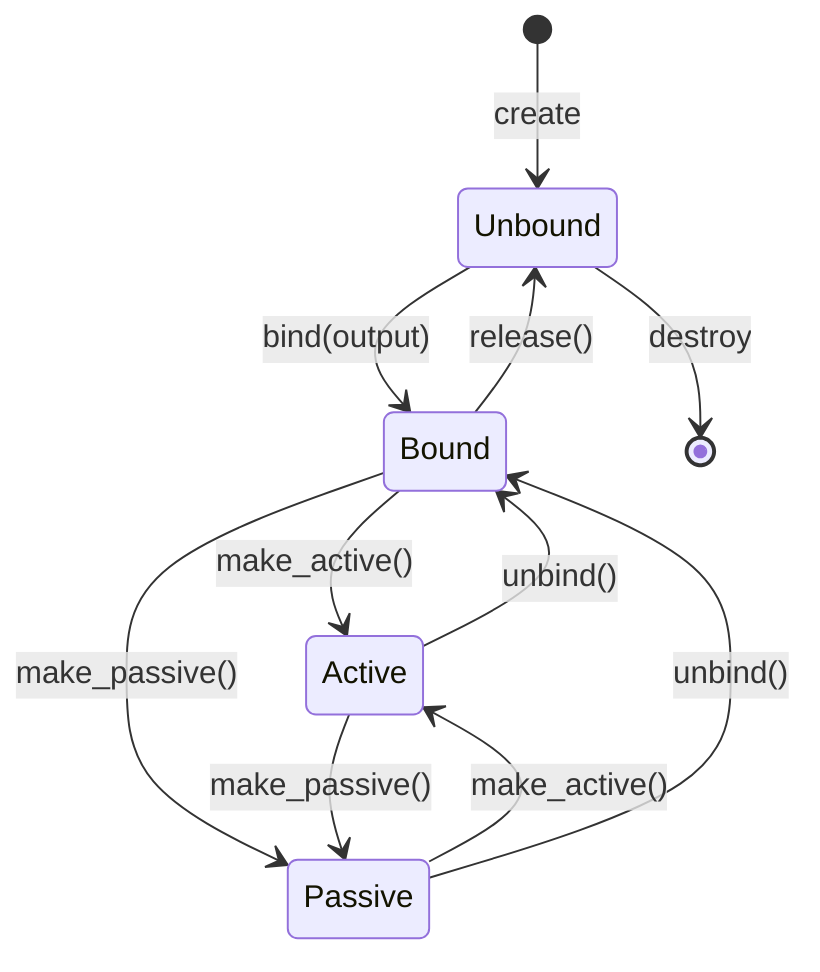
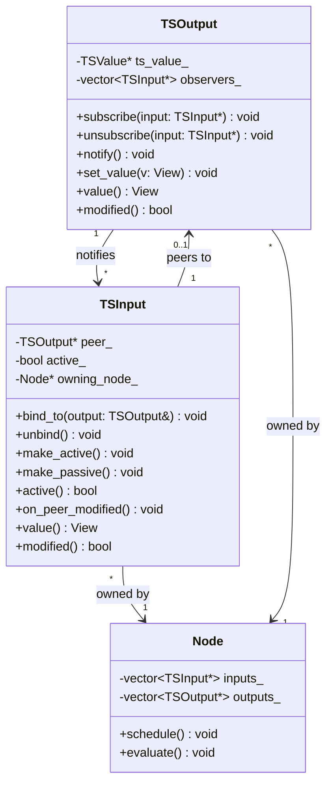
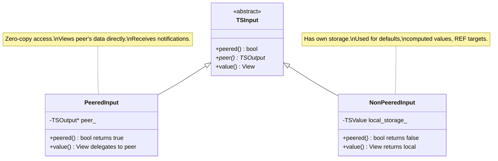
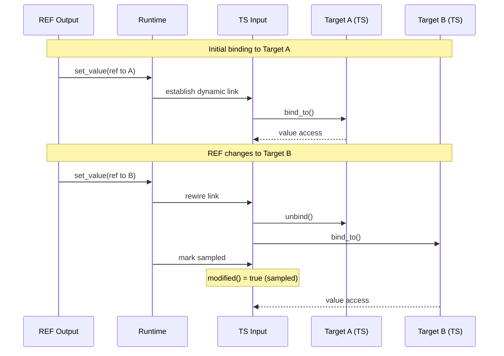
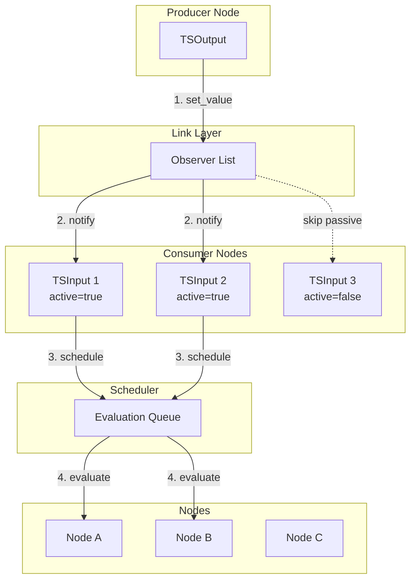
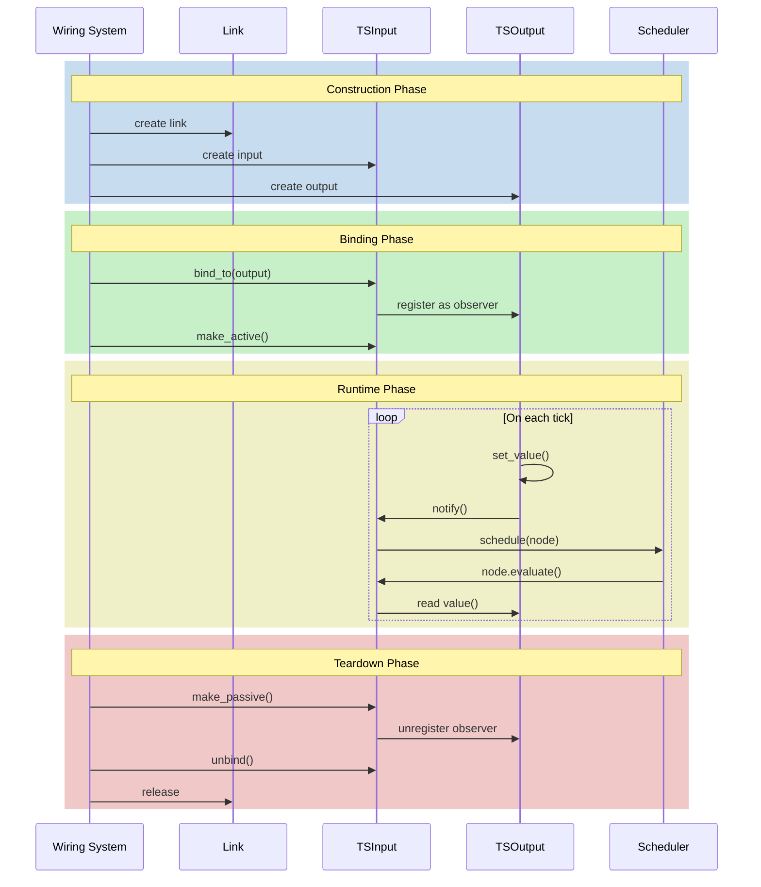
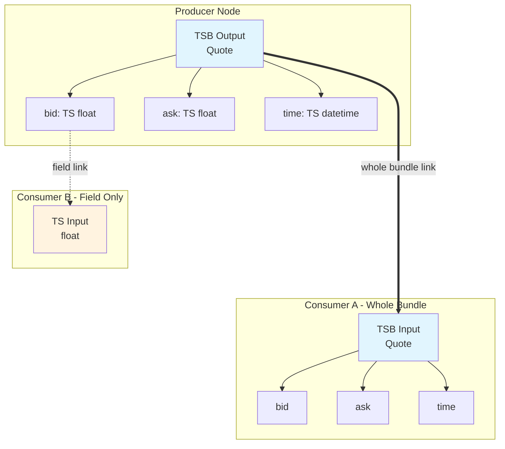
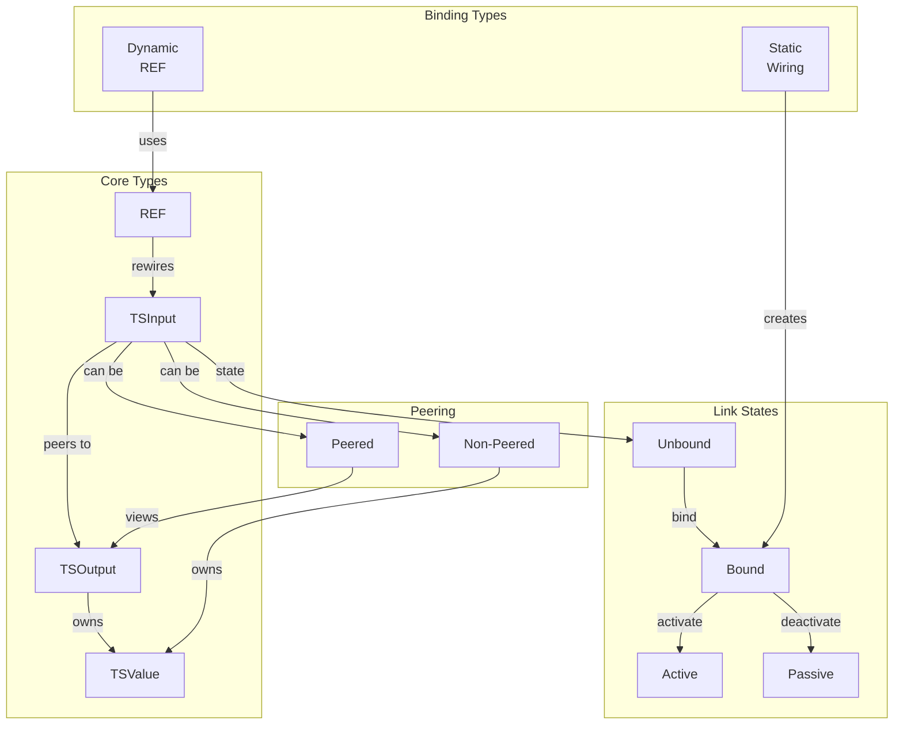

# Links and Binding: How Data Flows Between Nodes

**Parent**: [Overview](00_OVERVIEW.md)

---

## Overview

**Links** are the fundamental mechanism for connecting nodes in a graph. When a node's input is linked to another node's output, the input sees the output's data and receives notifications when it changes.

Links are **not** copies. They are **references** with notification capability.

---

## The Link Model

### What Is a Link?

A link is a connection from an **input** to an **output**:

```
┌────────────────┐         ┌────────────────┐
│   Producer     │         │   Consumer     │
│                │         │                │
│   output ●─────┼─────────┼──▶ input       │
│                │  LINK   │                │
└────────────────┘         └────────────────┘
```

Through the link:
- The input can **read** the output's current value
- The input is **notified** when the output changes
- No data is copied - the input views the output's storage

### Link States

A link can be in one of these states:

| State | Description |
|-------|-------------|
| **Unbound** | Not connected to any output (placeholder) |
| **Bound** | Connected to a specific output |
| **Active** | Bound and currently notifying on changes |
| **Passive** | Bound but not triggering notifications |

Most links are **bound and active** during normal operation.

---

## Binding: Connecting Inputs to Outputs

### Static Binding (Wiring)

Most binding happens at graph construction time. The wiring system:
1. Examines input/output types
2. Creates links between compatible endpoints
3. Binds links before graph execution starts

### Dynamic Binding (REF)

Some links can be **rebound at runtime** using REF:

```cpp
void router(
    const TSView& selector,
    const TSDView& prices,  // TSD[int, TS[float]]
    RefView& output
) {
    // Return a reference that can be bound to different sources
    int64_t key = selector.value().as<int64_t>();
    if (prices.contains(key)) {
        output.set_value(prices[key].ref());  // Bind to selected price
    } else {
        output.clear();  // Return unbound reference
    }
}
```

REF enables:
- Conditional routing based on runtime data
- Late binding when the target isn't known at construction
- Dynamic rewiring without rebuilding the graph

---

## Link Behavior for Different Time-Series Types

### Scalar TS[T]

Simple one-to-one link:

```
Output: TS[float]  ──────▶  Input: TS[float]
        value: 42.0         value: 42.0 (same data)
        modified: true      modified: true (notified)
```

The input sees exactly what the output has.

### Bundle TSB

Links can connect at **any level** of the bundle:

**Whole-bundle link** (most common):
```
Output: TSB[Quote]  ──────▶  Input: TSB[Quote]
```
Input sees entire bundle. Notified when any field changes.

**Field-level link** (selective binding):
```
Output: TSB[Quote]          Input: TS[float]
        └── bid ────────────▶ (only bid field)
```
Input sees only one field. Notified only when that field changes.

### List TSL

**Whole-list link**:
```
Output: TSL[TS[float], 10]  ──────▶  Input: TSL[TS[float], 10]
```
Input sees entire list. Notified when any element changes.

**Element-level link**:
```
Output: TSL[TS[float], 10]
        └── [3] ────────────▶  Input: TS[float] (element 3 only)
```
Input sees one element. Notified only when that element changes.

**Partial peering** (mixed):
```
Output A: TS[float] ──────▶  Input TSL[0]
Output B: TS[float] ──────▶  Input TSL[1]
(local)                      Input TSL[2]  (not linked, uses local storage)
```
Some elements linked to external outputs, others local.

### Dict TSD

**Whole-dict link**:
```
Output: TSD[int, TS[float]]  ──────▶  Input: TSD[int, TS[float]]
```
Input sees entire dict including key changes.

**Key-value link**:
```
Output: TSD[int, TS[float]]
        └── [123] ──────▶  Input: TS[float]
```
Input sees one entry's value.

**Key-set link**:
```
Output: TSD[int, TS[float]]
        └── key_set ───────▶  Input: TSS[int]
```
Input sees only the keys (not values).

---

## Notification and Observation

### How Notification Works

When an output changes:
1. Output marks itself modified (updates timestamp)
2. Output notifies all subscribed observers
3. Each linked input receives notification
4. Input's owning node is scheduled for evaluation

```
Output changes
     │
     ▼
notify observers
     │
     ├──▶ Link 1 ──▶ Node A scheduled
     ├──▶ Link 2 ──▶ Node B scheduled
     └──▶ Link 3 ──▶ Node C scheduled
```

### Input Subscription (Active Flag)

An input must **subscribe** to receive notifications from its peer. This is controlled by the **active** flag:

```cpp
// Input subscribes to notifications
input.make_active();     // Start receiving notifications
input.make_passive();    // Stop receiving notifications
bool is_active = input.active();  // Check if currently subscribed

// When active, modifications to peer trigger notification
// When passive, input can still read peer data, but won't be notified
```

The subscription mechanism:

```
┌────────────────┐                    ┌────────────────┐
│     Output     │                    │     Input      │
│                │                    │                │
│  observers: ───┼────────────────────┼── (subscribed) │
│    [input1,    │   subscription     │  active: true  │
│     input2]    │◀───────────────────┼────────────────│
│                │                    │                │
└────────────────┘                    └────────────────┘

When output.set_value() is called:
1. Output updates its value and timestamp
2. Output iterates through observers list
3. For each subscribed (active) input, calls input.notify()
4. Input's node is scheduled for evaluation
```

### Subscription Lifecycle

```cpp
// Typical lifecycle managed by runtime:
// 1. Input is created (inactive by default)
// 2. Input is bound to output (link established)
// 3. Input subscribes to output (make_active)
// 4. During graph execution, notifications flow
// 5. On teardown, input unsubscribes (make_passive)
// 6. Link is released

// The subscribe/unsubscribe is typically called by the runtime:
void on_bind(TSInput& input, TSOutput& output) {
    input.bind_to(output);      // Establish link
    input.make_active();        // Subscribe to notifications
}

void on_unbind(TSInput& input) {
    input.make_passive();       // Unsubscribe
    input.unbind();             // Release link
}
```

### Observer Pattern Details

The notification system uses the **observer pattern**:

```cpp
// Output maintains list of observers
class TSOutput {
    std::vector<TSInput*> observers_;

public:
    void subscribe(TSInput* input) {
        // Add input to notification list
        observers_.push_back(input);
    }

    void unsubscribe(TSInput* input) {
        // Remove input from notification list
        observers_.erase(
            std::remove(observers_.begin(), observers_.end(), input),
            observers_.end()
        );
    }

    void notify() {
        // Notify all subscribed observers
        for (auto* observer : observers_) {
            observer->on_peer_modified();
        }
    }
};
```

### Active vs Passive Inputs

**Active inputs** subscribe to notifications and trigger node evaluation:

```cpp
void react_to_price(const TSView& price, TSView& output) {
    // price input is active by default
    // This function runs when price changes
    output.set_value(value_from("Price is " + std::to_string(price.value().as<double>())));
}
```

**Passive inputs** are linked but don't subscribe - they can read data but don't trigger:

```cpp
// Passive inputs marked in node signature/metadata
void react_to_trigger(
    const TSView& trigger,      // Active - triggers evaluation
    const TSView& price,        // Passive - readable but doesn't trigger
    TSView& output
) {
    // Only called when trigger changes
    if (trigger.value().as<bool>()) {
        output.set_value(value_from("Price is " + std::to_string(price.value().as<double>())));
    }
}
```

Use passive for:
- Reference data that shouldn't trigger computation
- High-frequency inputs you only want to sample occasionally
- Breaking notification cycles

---

## Peered vs Non-Peered

### Peered (Linked)

An input is **peered** when it's linked to an output:
- No local storage (uses output's storage)
- Zero-copy access
- Automatic notification

```
Input (peered) ──link──▶ Output
     │                      │
     └── sees same data ────┘
```

### Non-Peered (Local)

An input is **non-peered** when it has its own storage:
- Local storage allocated
- Data must be explicitly copied/set
- No automatic notification

```
Input (non-peered)
     │
     └── has own data (not linked)
```

Non-peered is used for:
- Default values
- Computed intermediates
- REF targets before binding

### Mixed Peering (Composites)

Composite inputs can have **some children peered, others not**:

```
Input TSB[
    field_a: linked to Output A    # Peered
    field_b: linked to Output B    # Peered
    field_c: (local storage)       # Non-peered
]
```

Each child independently decides peered vs non-peered.

---

## REF: Dynamic References

### What Is REF?

`REF[TS[T]]` is a time-series that holds a **TimeSeriesReference** as its value. Conceptually, it behaves like `TS[TimeSeriesReference]` - it's a time-series containing a reference value.

```cpp
RefView ref = ...;

// The value is a TimeSeriesReference
auto ref_value = ref.value();      // Returns TimeSeriesReference
bool changed = ref.modified();     // Did the reference change?
bool has_ref = ref.valid();        // Contains a valid reference?

// Writing (outputs only)
RefView ref_out = ...;             // Non-const for outputs
ref_out.set_value(some_ts.ref());  // Set reference to point to some_ts
```

### REF Binding Semantics

The key to understanding REF is knowing how it binds with different types. In the following, "time-series" refers to any time-series type (TS, TSB, TSL, TSD, TSS, SIGNAL), not just `TS[T]`.

**REF → REF**: Normal scalar binding. The TimeSeriesReference value is copied like any other scalar. The input's reference value mirrors the output's reference value.

**REF → time-series**: Special conversion with dynamic link. When a REF output is linked to a time-series input:
- The runtime extracts the target time-series from the reference
- A **dynamic link** is established to that target
- When the reference changes, the link automatically rewires to follow the new target
- The input sees the **target's** value and modification state (not the reference)

**time-series → REF**: Special conversion. When a time-series output is linked to a REF input:
- A TimeSeriesReference is automatically created pointing to the time-series
- The REF input's value is this reference

```
REF output ──(REF→ts)──▶ time-series input
     │                              │
     └── TimeSeriesReference        └── sees target's value (dynamic link)

time-series output ──(ts→REF)──▶ REF input
          │                           │
          └── actual value            └── TimeSeriesReference to output
```

### Sampled Flag on REF Traversal

When a REF→time-series link is traversed and the REF was modified (the reference changed to point to a different target), the resulting TSView is marked as **sampled**. A sampled view reports `modified() == true` even if the new target wasn't modified at the current tick.

This ensures consumers are notified when their data source changes:

```
T1: REF → primary,   primary.modified()=true   → consumer sees modified=true
T2: REF → secondary, secondary.modified()=false → consumer sees modified=true (sampled!)
T3: REF → secondary, secondary.modified()=false → consumer sees modified=false
```

The sampled flag propagates through the view - any child views obtained from a sampled parent are also sampled. See [Time-Series: Sampled Flag](03_TIME_SERIES.md#sampled-flag-on-ref-traversal) for details.

### Use Cases

**1. Conditional routing:**

```cpp
void select_source(
    const TSView& use_primary,
    const TSView& primary,
    const TSView& secondary,
    RefView& output
) {
    if (use_primary.value().as<bool>()) {
        output.set_value(primary.ref());
    } else {
        output.set_value(secondary.ref());
    }
}
```

**2. Dictionary lookup:**

```cpp
void lookup(
    const TSView& key,
    const TSDView& data,  // TSD[int, TS[float]]
    RefView& output
) {
    auto k = key.value().as<int64_t>();
    if (data.contains(k)) {
        output.set_value(data[k].ref());
    } else {
        output.clear();  // No valid target
    }
}
```

### REF vs Direct Link

| Aspect | Direct Link | REF (with REF→TS) |
|--------|-------------|-------------------|
| When target determined | Graph construction | Runtime |
| Can change target | No | Yes |
| Overhead | Zero | Small (indirection + rewiring) |
| Use case | Static wiring | Dynamic routing |

---

## Link Lifecycle

### Construction

Links are created during graph construction:
1. Wiring examines node signatures
2. Compatible input/output pairs identified
3. Link objects created (initially unbound)

### Binding

Links are bound before execution:
1. Graph builder resolves connections
2. Each link's `bind(output)` called
3. Link becomes active

### Runtime

During execution:
1. Outputs write data and notify
2. Links propagate notifications
3. Inputs read through links

### Teardown

When graph stops:
1. Links are deactivated
2. Observers unsubscribed
3. Link references released

---

## UML Diagrams

### Link State Machine



### Observer Pattern - Class Relationships



### Peering Model



### REF Dynamic Binding



### Notification Flow



### Link Lifecycle



### Composite Link Binding



### Relationships Overview



---

## Best Practices

### Prefer Direct Links Over REF

Direct links are zero-overhead. Use REF only when you need dynamic routing.

### Consider Active vs Passive

If an input shouldn't trigger your node, mark it passive. This reduces unnecessary computation.

### Be Aware of Link Depth

Deep composite structures have many potential link points. Bind at the highest level that makes sense to minimize overhead.

---

## Next

- [Access Patterns](05_ACCESS_PATTERNS.md) - Reading and writing through links
- [Delta and Change Tracking](06_DELTA.md) - What changed through the link?
