# Links and Binding: How Data Flows Between Nodes

**Parent**: [Overview](00_OVERVIEW.md)

---

## Overview

**Links** are the fundamental mechanism for connecting nodes in a graph. When a node's input is linked to another node's output, the input sees the output's data and receives notifications when it changes.

Links are **not** copies. They are **references** with notification capability.

> **Note**: For detailed documentation on TSOutput and TSInput - the graph endpoints that use links - see [TSOutput and TSInput](05_TSOUTPUT_TSINPUT.md).

---

## The Link Model

### What Is a Link?

A link is a connection from an **input** to an **output**:

```
┌────────────────┐         ┌────────────────┐
│   Producer     │         │   Consumer     │
│                │         │                │
│   output ●─────┼─────────┼──▶ input       │
│                │  LINK   │                │
└────────────────┘         └────────────────┘
```

Through the link:
- The input can **read** the output's current value
- The input is **notified** when the output changes
- No data is copied - the input views the output's storage

### Link Internal Structure

A Link is **not an exposed data structure** - it's an internal storage mechanism. Conceptually, a Link is like a filesystem symlink: it creates a branch from one position in a TSValue to a position in another TSValue.

Internally, a Link is **ViewData stored at a position** in the value structure:

```cpp
struct ViewData {
    ShortPath path;     // Graph-aware path to source
    void* data;         // Pointer to source data
    ts_ops* ops;        // Operations vtable for source
};
```

When a position contains a Link (ViewData), navigation to that position transparently follows the link and returns a view of the target data.

### Creating Links via TSView

Links are created using `bind()` / `unbind()` operations on a mutable TSView:

```cpp
// TSView binding operations
class TSView {
    void bind(const TSView& source);   // Store source's ViewData as Link
    void unbind();                      // Remove Link at this position
    bool is_bound() const;              // Check if position is a Link
};
```

**TSB (per-field binding):**
```cpp
TSView input_view = input_ts_value.view(time);
TSView output_view = output_ts_value.view(time);

// Bind individual fields
input_view.field("price").bind(output_view.field("price"));
input_view.field("volume").bind(other_output_view);
// Each field independently linked; link_flags tracks which are links
```

**TSL/TSD (whole-collection binding):**
```cpp
// Entire collection binds at once (all-or-nothing)
input_list_view.bind(output_list_view);
// Sets is_linked = true; all elements become ViewData pointing to source
```

After binding, accessing elements returns views of the output's data - Links are followed transparently.

### Link Storage

Links are stored using **REFLink** - a structure that supports both simple linking and REF→TS dereferencing. Link storage is part of TSValue's five parallel structures (see [Time Series](03_TIME_SERIES.md)).

**TSL and TSD (Collection-Level)**

TSL and TSD use a single REFLink for the entire collection. When bound, all navigation through the collection follows the link:

```cpp
// TSL/TSD: Single REFLink stored in link_ value
// When is_linked() == true, navigation follows link to target
```

**TSB (Per-Field)**

Each TSB field has its own REFLink in a fixed-size array:

```cpp
// TSB: fixed_list[REFLink, field_count] stored in link_ value
// Each field can independently be linked or local
```

**Navigation**

When navigating to an element:
1. Check if the position's REFLink is linked (via `is_bound()`)
2. If linked → navigation follows link to target data
3. If local → navigation accesses local data

The caller sees a TSView either way - Links are transparent.

### Link vs Subscription (Active/Passive)

Links and subscriptions are separate concerns:

| Concept | Responsibility |
|---------|----------------|
| **Link** | Data access - where to find the data |
| **Subscription** | Notification - when to be notified of changes |

A Link can exist without a subscription (passive), or with a subscription (active). The TSInputView layer manages subscriptions on top of the Link mechanism:

```cpp
class TSInputView {
    void bind(TSOutputView& output) {
        // 1. Create Link at TSValue level
        ts_view_.bind(output.ts_view());

        // 2. Subscribe for notifications if active
        if (active()) {
            output.subscribe(owning_input_);
        }
    }
};
```

---

## Binding: Connecting Inputs to Outputs

### Static Binding (Wiring)

Most binding happens at graph construction time. The wiring system:
1. Examines input/output types
2. Creates links between compatible endpoints
3. Binds links before graph execution starts

### Dynamic Binding (REF)

Some links can be **rebound at runtime** using REF:

```cpp
void router(
    const TSView& selector,
    const TSDView& prices,  // TSD[int, TS[float]]
    RefView& output
) {
    // Return a reference that can be bound to different sources
    int64_t key = selector.value().as<int64_t>();
    if (prices.contains(key)) {
        output.set_value(prices[key].ref());  // Bind to selected price
    } else {
        output.clear();  // Return unbound reference
    }
}
```

REF enables:
- Conditional routing based on runtime data
- Late binding when the target isn't known at construction
- Dynamic rewiring without rebuilding the graph

---

## Link Behavior for Different Time-Series Types

### Scalar TS[T]

Simple one-to-one link:

```
Output: TS[float]  ──────▶  Input: TS[float]
        value: 42.0         value: 42.0 (same data)
        modified: true      modified: true (notified)
```

The input sees exactly what the output has.

### Bundle TSB

Links can connect at **any level** of the bundle:

**Whole-bundle link** (most common):
```
Output: TSB[Quote]  ──────▶  Input: TSB[Quote]
```
Input sees entire bundle. Notified when any field changes.

**Field-level link** (selective binding):
```
Output: TSB[Quote]          Input: TS[float]
        └── bid ────────────▶ (only bid field)
```
Input sees only one field. Notified only when that field changes.

### List TSL

**Whole-list link**:
```
Output: TSL[TS[float], 10]  ──────▶  Input: TSL[TS[float], 10]
```
Input sees entire list. Notified when any element changes.

**Element-level link**:
```
Output: TSL[TS[float], 10]
        └── [3] ────────────▶  Input: TS[float] (element 3 only)
```
Input sees one element. Notified only when that element changes.

**Partial peering** (mixed):
```
Output A: TS[float] ──────▶  Input TSL[0]
Output B: TS[float] ──────▶  Input TSL[1]
(local)                      Input TSL[2]  (not linked, uses local storage)
```
Some elements linked to external outputs, others local.

### Dict TSD

**Whole-dict link**:
```
Output: TSD[int, TS[float]]  ──────▶  Input: TSD[int, TS[float]]
```
Input sees entire dict including key changes.

**Key-value link**:
```
Output: TSD[int, TS[float]]
        └── [123] ──────▶  Input: TS[float]
```
Input sees one entry's value.

**Key-set link**:
```
Output: TSD[int, TS[float]]
        └── key_set ───────▶  Input: TSS[int]
```
Input sees only the keys (not values).

---

## Notification and Observation

### How Notification Works

When a linked output changes, two things must happen:
1. **Time-accounting**: Modification times are stamped up through the input's schema hierarchy so that composite `modified()` and `valid()` checks work in O(1) without scanning children.
2. **Node-scheduling**: The owning node is scheduled for evaluation.

These are implemented as **two independent notification chains**, each with its own subscription on the output's observer list.

```
Output changes → ObserverList::notify_modified() calls:
├── LinkTarget::notify(et)     → stamp owner time → parent stamp → ... → root stamp
└── ActiveNotifier::notify(et) → TSInput::notify(et) → node scheduled
```

**Time-accounting chain** (always active when bound):
- Each LinkTarget in the input's link storage is subscribed to the target output's observer list at **bind time**
- When notified, it stamps `last_modified_time` at its level, then propagates up to the parent LinkTarget
- This ensures composite types (TSB, TSL, TSD) report correct `modified()` and `valid()` without lazy child scanning

**Node-scheduling chain** (only when active):
- An embedded `ActiveNotifier` in each LinkTarget is subscribed to the target output's observer list at **set_active time**
- When notified, it calls `TSInput::notify()` which schedules the owning node
- Unsubscribed when `make_passive()` is called

### Input Subscription (Active Flag)

An input must **subscribe** to receive notifications from its peer. The **active** flag controls whether the node-scheduling chain is connected:

```cpp
// Input subscribes for node scheduling
input.make_active();     // Subscribe ActiveNotifier → node gets scheduled on changes
input.make_passive();    // Unsubscribe ActiveNotifier → node no longer scheduled
bool is_active = input.active();  // Check if currently subscribed for scheduling

// Note: Time-accounting (LinkTarget subscription) is always active when bound,
// regardless of the active/passive flag. This ensures modified() works correctly
// even for passive inputs.
```

The subscription mechanism:

```
┌────────────────┐                    ┌────────────────┐
│     Output     │                    │     Input      │
│                │                    │                │
│  observers: ───┼────────────────────┼── LinkTarget   │  (time-accounting, always)
│  [link_target, │   subscriptions    │                │
│   active_ntf]  │◀───────────────────┼── ActiveNtf    │  (node-scheduling, if active)
│                │                    │                │
└────────────────┘                    └────────────────┘

When output.set_value() is called:
1. Output updates its value and timestamp
2. Output notifies all observers in its ObserverList
3. LinkTarget stamps modification times up through parent hierarchy
4. ActiveNotifier (if present) schedules the owning node
```

### Subscription Lifecycle

```cpp
// Typical lifecycle managed by runtime:
// 1. Input is created (unbound, inactive)
// 2. Input is bound to output → LinkTarget subscribed (time-accounting always on)
// 3. Input made active → ActiveNotifier subscribed (node-scheduling on)
// 4. During graph execution, both notification chains flow
// 5. On teardown, input made passive → ActiveNotifier unsubscribed
// 6. Input unbound → LinkTarget unsubscribed, link cleared

// The subscribe/unsubscribe is typically called by the runtime:
void on_bind(TSInput& input, TSOutput& output) {
    input.bind_to(output);      // Establish link + subscribe LinkTarget
    input.make_active();        // Subscribe ActiveNotifier
}

void on_unbind(TSInput& input) {
    input.make_passive();       // Unsubscribe ActiveNotifier
    input.unbind();             // Unsubscribe LinkTarget + release link
}
```

### Observer Pattern Details

The notification system uses the **observer pattern**, with observer lists stored in TSValue's `observer_value_` component:

```cpp
// Observer management is handled by TSValue.observer_value_
// TSOutput delegates to its native_value_ (TSValue)
class TSOutputView {
    TSView ts_view_;      // View of TSValue
    TSOutput* output_;    // For context

public:
    void subscribe(Notifiable* observer) {
        // Delegates to TSValue's observer_value_
        // Adds observer to notification list at the appropriate path
        ts_view_.subscribe(observer);
    }

    void unsubscribe(Notifiable* observer) {
        // Removes observer from notification list
        ts_view_.unsubscribe(observer);
    }
};

// Each bound position has up to TWO observers in the target's list:
// 1. LinkTarget* (time-accounting, always present when bound)
// 2. ActiveNotifier* (node-scheduling, present only when active)
```

The `observer_value_` in TSValue mirrors the time-series structure, allowing fine-grained subscription at any level:

```cpp
// For TSB[a: TS[int], b: TSL[TS[float], 2]]
// observer_value_ mirrors the structure:
// Bundle {
//   _observers: vector<Notifiable*>    // Root observers
//   a: vector<Notifiable*>             // Field a observers (LinkTarget + ActiveNotifier)
//   b: Bundle {
//     _observers: vector<Notifiable*>  // TSL root observers
//     0: vector<Notifiable*>           // Element 0 observers
//     1: vector<Notifiable*>           // Element 1 observers
//   }
// }
```

### Composite Notification (TSB Example)

For a bundle `TSB[a: TS[int], b: TS[float]]`, when field `a` changes at time T:

```
Output.a set_value() → notify ObserverList at field a:
  ├── field_a_LinkTarget.notify(T):
  │     1. Stamp field_a time slot = T
  │     2. Call parent_link->notify(T):
  │           Stamp container time slot = T
  │           parent_link is nullptr → stop
  └── field_a_ActiveNotifier.notify(T):
        Call TSInput::notify(T) → schedule node

Result: Both field-level AND container-level modified() return true
```

This eliminates the need for lazy child-scanning in `modified()` and `valid()`.

### Active vs Passive Inputs

**Active inputs** have both chains connected — time-accounting AND node-scheduling:

```cpp
void react_to_price(const TSView& price, TSView& output) {
    // price input is active by default
    // This function runs when price changes
    output.set_value(value_from("Price is " + std::to_string(price.value().as<double>())));
}
```

**Passive inputs** have only the time-accounting chain — they track modifications but don't trigger node evaluation:

```cpp
// Passive inputs marked in node signature/metadata
void react_to_trigger(
    const TSView& trigger,      // Active - triggers evaluation
    const TSView& price,        // Passive - tracks modifications but doesn't trigger
    TSView& output
) {
    // Only called when trigger changes
    // price.modified() still works correctly (time-accounting is always on)
    if (trigger.value().as<bool>()) {
        output.set_value(value_from("Price is " + std::to_string(price.value().as<double>())));
    }
}
```

Use passive for:
- Reference data that shouldn't trigger computation
- High-frequency inputs you only want to sample occasionally
- Breaking notification cycles

---

## Peered vs Non-Peered

### Peered (Linked)

An input is **peered** when it's linked to an output:
- No local storage (uses output's storage)
- Zero-copy access
- Automatic notification

```
Input (peered) ──link──▶ Output
     │                      │
     └── sees same data ────┘
```

### Non-Peered (Local)

An input is **non-peered** when it has its own storage:
- Local storage allocated
- Data must be explicitly copied/set
- No automatic notification

```
Input (non-peered)
     │
     └── has own data (not linked)
```

Non-peered is used for:
- Default values
- Computed intermediates
- REF targets before binding

### Mixed Peering (Composites)

Composite inputs can have **some children peered, others not**:

```
Input TSB[
    field_a: linked to Output A    # Peered
    field_b: linked to Output B    # Peered
    field_c: (local storage)       # Non-peered
]
```

Each child independently decides peered vs non-peered.

---

## REF: Dynamic References

### What Is REF?

`REF[TS[T]]` is a time-series that holds a **TimeSeriesReference** as its value. Conceptually, it behaves like `TS[TimeSeriesReference]` - it's a time-series containing a reference value.

```cpp
RefView ref = ...;

// The value is a TimeSeriesReference
auto ref_value = ref.value();      // Returns TimeSeriesReference
bool changed = ref.modified();     // Did the reference change?
bool has_ref = ref.valid();        // Contains a valid reference?

// Writing (outputs only)
RefView ref_out = ...;             // Non-const for outputs
ref_out.set_value(some_ts.ref());  // Set reference to point to some_ts
```

### REF Binding Semantics

The key to understanding REF is knowing how it binds with different types. In the following, "time-series" refers to any time-series type (TS, TSB, TSL, TSD, TSS, SIGNAL), not just `TS[T]`.

**REF → REF**: Normal scalar binding. The TimeSeriesReference value is copied like any other scalar. The input's reference value mirrors the output's reference value.

**REF → time-series**: Special conversion with dynamic link. When a REF output is linked to a time-series input:
- The runtime extracts the target time-series from the reference
- A **dynamic link** is established to that target
- When the reference changes, the link automatically rewires to follow the new target
- The input sees the **target's** value and modification state (not the reference)

**time-series → REF**: Special conversion. When a time-series output is linked to a REF input:
- A TimeSeriesReference is automatically created pointing to the time-series
- The REF input's value is this reference

```
REF output ──(REF→ts)──▶ time-series input
     │                              │
     └── TimeSeriesReference        └── sees target's value (dynamic link)

time-series output ──(ts→REF)──▶ REF input
          │                           │
          └── actual value            └── TimeSeriesReference to output
```

### Sampled Flag on REF Traversal

When a REF→time-series link is traversed and the REF was modified (the reference changed to point to a different target), the resulting TSView is marked as **sampled**. A sampled view reports `modified() == true` even if the new target wasn't modified at the current tick.

This ensures consumers are notified when their data source changes:

```
T1: REF → primary,   primary.modified()=true   → consumer sees modified=true
T2: REF → secondary, secondary.modified()=false → consumer sees modified=true (sampled!)
T3: REF → secondary, secondary.modified()=false → consumer sees modified=false
```

The sampled flag propagates through the view - any child views obtained from a sampled parent are also sampled. See [Time-Series: Sampled Flag](03_TIME_SERIES.md#sampled-flag-on-ref-traversal) for details.

### Use Cases

**1. Conditional routing:**

```cpp
void select_source(
    const TSView& use_primary,
    const TSView& primary,
    const TSView& secondary,
    RefView& output
) {
    if (use_primary.value().as<bool>()) {
        output.set_value(primary.ref());
    } else {
        output.set_value(secondary.ref());
    }
}
```

**2. Dictionary lookup:**

```cpp
void lookup(
    const TSView& key,
    const TSDView& data,  // TSD[int, TS[float]]
    RefView& output
) {
    auto k = key.value().as<int64_t>();
    if (data.contains(k)) {
        output.set_value(data[k].ref());
    } else {
        output.clear();  // No valid target
    }
}
```

### REF vs Direct Link

| Aspect | Direct Link | REF (with REF→TS) |
|--------|-------------|-------------------|
| When target determined | Graph construction | Runtime |
| Can change target | No | Yes |
| Overhead | Zero | Small (indirection + rewiring) |
| Use case | Static wiring | Dynamic routing |

---

## REFLink: The REF-to-TS Dereferencing Mechanism

### What Is REFLink?

**REFLink** is the internal mechanism that implements REF-to-TS conversion. When an alternative representation needs to dereference a REF (convert a reference to the actual time-series data), REFLink manages the dynamic binding and notification flow.

REFLink is more sophisticated than a simple `LinkTarget` because it must track **two sources**:
1. **The REF source** - the time-series containing the `TSReference` value
2. **The current dereferenced target** - the time-series the reference points to

When the REF source changes (the reference now points to a different target), REFLink automatically rebinds to the new target.

### REFLink vs Simple LinkTarget

| Aspect | LinkTarget | REFLink |
|--------|-----------|---------|
| **Purpose** | Direct link to a fixed target | Dynamic link through a REF |
| **Target changes** | Never (set once at bind) | When REF value changes |
| **Subscriptions** | One (to target) | Two (REF source + current target) |
| **Rebinding** | Not supported | Automatic on REF change |
| **Sampled flag** | Not applicable | Set when REF changes |

`LinkTarget` is a simple structure storing pointers to a target's data. `REFLink` is a `Notifiable` that actively responds to changes in both the REF source and the current target.

### When REFLink Is Used

REFLink is used in **alternative representations** when converting REF elements to their dereferenced form:

```
Primary: TSD[str, REF[TS[int]]]        Alternative: TSD[str, TS[int]]
┌─────────────────────────────┐        ┌─────────────────────────────────┐
│  "a" → REF[TS[int]] ────────┼────────┼──▶ "a" → REFLink → Target A     │
│  "b" → REF[TS[int]] ────────┼────────┼──▶ "b" → REFLink → Target B     │
└─────────────────────────────┘        └─────────────────────────────────┘
         REF source                       REFLink dereferences to target
```

Each element in the alternative uses a REFLink that:
- Watches the corresponding REF element for changes
- Maintains a link to the current dereferenced target
- Provides a TSView of the target data

### REFLink Lifecycle

**1. Binding to the REF Source**

When `bind_to_ref()` is called:
```cpp
REFLink ref_link;
ref_link.bind_to_ref(ref_source_view, current_time);
```

The REFLink:
- Stores the REF source's ViewData
- Subscribes to the REF source's observer list
- Reads the current `TSReference` value
- Resolves and binds to the initial target

**2. Notification When REF Changes**

When the REF source is modified (the reference now points to a different target):
```cpp
// REFLink::notify() is called by the observer system
void REFLink::notify(engine_time_t et) {
    // Rebind to the new target
    rebind_target(et);
}
```

The rebind process:
1. Unsubscribes from the old target's observer list
2. Clears the old target link
3. Reads the new `TSReference` from the REF source
4. Resolves the reference to get the new target
5. Subscribes to the new target's observer list

**3. Target Access**

Consumers access the dereferenced target through:
```cpp
TSView target = ref_link.target_view(current_time);
```

This returns a TSView of the current target, allowing normal value access.

**4. Modification Tracking**

`modified()` returns true if either:
- The REF source changed (reference rebinding occurred)
- The current target's value changed

```cpp
bool REFLink::modified(engine_time_t current_time) const {
    // Check if REF source changed (sampled semantics)
    TSView ref_view(ref_source_view_data_, current_time);
    if (ref_view && ref_view.last_modified_time() >= current_time) {
        return true;  // Reference changed - sampled
    }

    // Check if target changed
    TSView tv = target_view(current_time);
    return tv && tv.modified();
}
```

**5. Cleanup**

When the REFLink is unbound or destroyed:
```cpp
ref_link.unbind();
// or destructor ~REFLink() calls unbind()
```

This:
- Unsubscribes from the REF source's observer list
- Unsubscribes from the current target's observer list
- Clears all stored data

### Sampled Semantics

When the REF source changes, REFLink ensures **sampled semantics**: even if the new target wasn't modified at the current time, consumers see `modified() == true` because their data source changed.

```
T1: REF → Target A, Target A modified    → REFLink.modified() = true
T2: REF → Target B, Target B not modified → REFLink.modified() = true (sampled!)
T3: REF → Target B, Target B not modified → REFLink.modified() = false
```

The sampled flag is determined by checking if the REF source's `last_modified_time()` equals the current time.

### Handling Different Reference Types

`TSReference` can be one of three kinds:

| Kind | Description | REFLink Behavior |
|------|-------------|------------------|
| **EMPTY** | No reference set | Target remains invalid |
| **PEERED** | Points to a single time-series | Resolves and binds to target |
| **NON_PEERED** | Composite reference (e.g., `REF[TSL]`) | Not handled by single REFLink |

For **NON_PEERED** references (like `REF[TSL[TS[int], N]]`), each element has its own individual reference. These require container-level handling where each element in the alternative gets its own REFLink.

### UML: REFLink Rebinding Flow

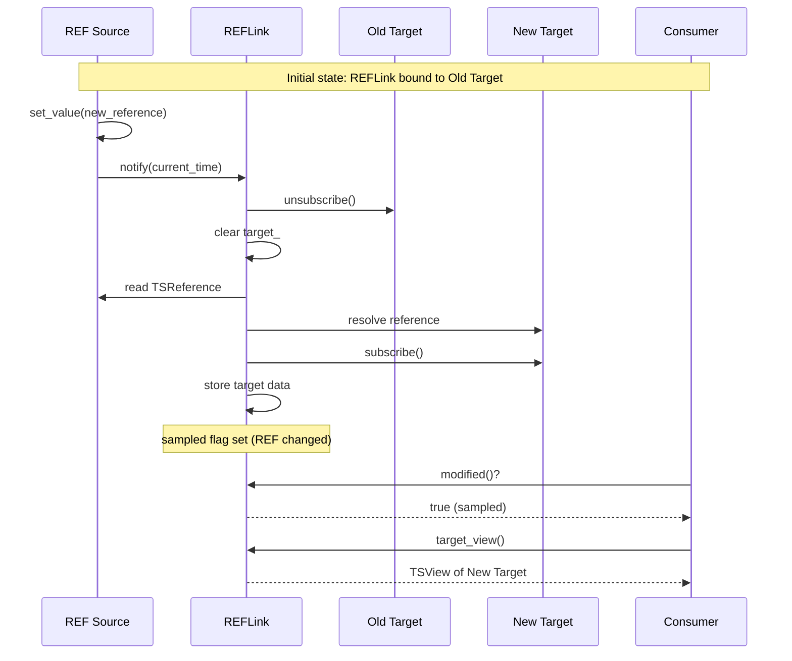

### Implementation Notes

REFLink is stored **inline** in the link schema structure, following the same pattern as LinkTarget:

```cpp
// TSB link schema: fixed_list[REFLink, field_count]
// TSL/TSD link schema: single REFLink (or per-element REFLinks for alternatives)
```

Key implementation details:
- REFLink is **non-copyable** due to active subscriptions
- REFLink is **movable** (transfers subscription ownership)
- Destruction automatically calls `unbind()` for cleanup
- `REFLinkOps` provides TypeOps interface for schema storage

---

## Cast Logic: Schema Conversion at Bind Time

### Overview

When an input's schema differs from an output's schema in a compatible way (e.g., `TS[int]` vs `REF[TS[int]]`), **casting** creates an alternative representation. Cast is an **output-side responsibility** - the output creates and maintains the alternative view, and inputs link to it.

### Why Output Owns the Cast

The output→input relationship is 1:N (one output, many inputs). If the output maintains alternative representations:
- Multiple inputs needing the same shape share the same alternative representation
- The output is responsible for keeping the alternative in sync with the primary data
- Inputs remain lightweight - just a LINK to the appropriate representation

```
┌─────────────────────────────────────────────────────────┐
│  Output: TSD[str, TS[int]]                              │
│                                                         │
│  Primary Data: TSD[str, TS[int]]                        │
│       │                                                 │
│       ├── Alternative Rep 1: TSD[str, REF[TS[int]]]    │
│       │        ▲           ▲                            │
│       │        │           │                            │
│       │     LINK         LINK                           │
│       │        │           │                            │
│       │   Input A      Input B                          │
│       │   (needs REF)  (needs REF)                      │
│       │                                                 │
│       └── Direct LINK ──────────────────▶ Input C       │
│                                           (matches)     │
└─────────────────────────────────────────────────────────┘
```

### Cast Request During Bind

When binding an input to an output, the input's schema determines what representation is needed:

```cpp
// Conceptual API - schema passed to link determines cast requirement
void link(TSOutput& output, const TSMeta& input_schema) {
    if (output.ts_meta() == input_schema) {
        // Direct link - schemas match
        establish_direct_link(output);
    } else {
        // Cast required - request alternative representation
        TSValue& alt_rep = output.get_or_create_alternative(input_schema);
        establish_direct_link(alt_rep);
    }
}
```

The output indexes alternative representations by schema shape, creating them on first request and reusing for subsequent inputs with the same shape.

### Nested Structure Handling

For complex conversions like `TSD[str, TS[int]]` → `TSD[str, REF[TS[int]]]`:

1. **Input requests unpacked form**: The input's schema specifies the desired shape
2. **Output constructs parallel structure**: Creates a TSValue with the alternative schema, including internal REFLinks pointing back to original elements
3. **Input links to result**: Simple LINK to the alternative TSValue
4. **Output maintains sync**: When the primary TSD changes (keys added/removed), output updates the alternative representation

```
Primary: TSD[str, TS[int]]           Alternative: TSD[str, REF[TS[int]]]
┌─────────────────────────┐          ┌─────────────────────────────────┐
│  "a" → TS[int] ●────────┼──────────┼──▶ "a" → REF[TS[int]] (refs ●)  │
│  "b" → TS[int] ●────────┼──────────┼──▶ "b" → REF[TS[int]] (refs ●)  │
│  "c" → TS[int] ●────────┼──────────┼──▶ "c" → REF[TS[int]] (refs ●)  │
└─────────────────────────┘          └─────────────────────────────────┘
         Output manages both              Input links here (lightweight)
```

### REF ↔ TS Conversions

**TS → REF** (wrapping):
- Output creates alternative with REF wrapper
- Each element in the alternative holds a reference to the corresponding element in the primary

**REF → TS** (dereferencing):
- Output creates alternative that follows references
- Alternative structure mirrors the dereferenced shape
- Uses REFLinks internally to track reference changes

Both directions require the output to maintain the parallel structure and keep it synchronized.

### Cast API Options

Several API approaches are possible:

```cpp
// Option 1: Explicit method on output
auto& alt = output.as(input_schema);
link(input, alt);

// Option 2: Cast method
auto& alt = output.cast<TSD<str, REF<TS<int>>>>();
link(input, alt);

// Option 3: Schema parameter to link (cleanest for user)
link(input, output, input.ts_meta());  // Cast happens internally
```

Option 3 may be cleanest as it hides the cast mechanics from the user while still being explicit about what schema the input expects.

---

## Memory Stability Requirements

### The Stability Constraint

**Critical**: Value and TSValue data structures must maintain **memory-stable addresses** for their elements. Once a LINK is established to an element, that element's address must remain valid even when the containing structure is mutated.

### Why This Matters

Consider a TSD where inputs are linked to individual elements:

```
TSD[str, TS[int]]
├── "a" → TS[int]  ◄── Input A linked here
├── "b" → TS[int]  ◄── Input B linked here
└── "c" → TS[int]  ◄── Input C linked here
```

If we add key "d" or remove key "b":
- Input A's link to "a" must remain valid
- Input C's link to "c" must remain valid
- Only Input B's link is affected (element removed)

### Implementation Implications

This constraint affects how collections are implemented:

| Collection | Requirement |
|------------|-------------|
| **TSL (List)** | Fixed-size, elements don't move |
| **TSD (Dict)** | Elements stable on insert/remove |
| **TSB (Bundle)** | Fixed fields, always stable |
| **TSS (Set)** | Elements are scalars (copied), stability less critical |

For TSD specifically, several approaches can provide stability:
- **Node-based storage**: `map<K, unique_ptr<TSValue>>` - simple, stable addresses
- **Slot-based with tombstones**: Contiguous vector with free list - stable indices, better cache locality
- **Pool allocator**: Fixed slots with reuse tracking

The tombstone/free-list approach may be preferable as it maintains contiguous memory (better cache performance) while ensuring that element addresses remain stable. Removed elements are marked as tombstones and their slots are reused for new insertions.

### Alternative Representations and Stability

Alternative representations (from casting) must also be memory-stable:
- When output creates an alternative, element addresses in the alternative must be stable
- The alternative's internal structure parallels the primary, so both need the same stability guarantees

---

## Link Lifecycle

### Construction

Links are created during graph construction:
1. Wiring examines node signatures
2. Compatible input/output pairs identified
3. Link objects created (initially unbound)

### Binding

Links are bound before execution:
1. Graph builder resolves connections
2. Each link's `bind(output)` called
3. Link becomes active

### Runtime

During execution:
1. Outputs write data and notify
2. Links propagate notifications
3. Inputs read through links

### Teardown

When graph stops:
1. Links are deactivated
2. Observers unsubscribed
3. Link references released

---

## UML Diagrams

### Link State Machine

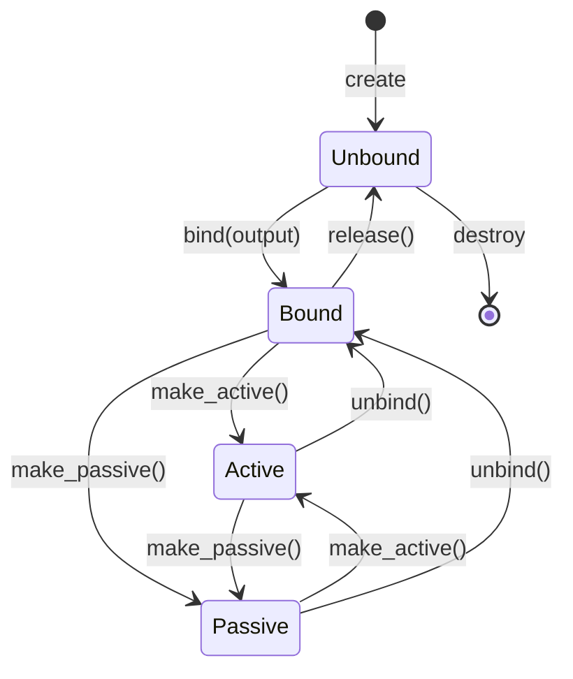

### Input/Output Link Relationship

> For detailed TSOutput and TSInput class structure, see [TSOutput and TSInput](05_TSOUTPUT_TSINPUT.md).

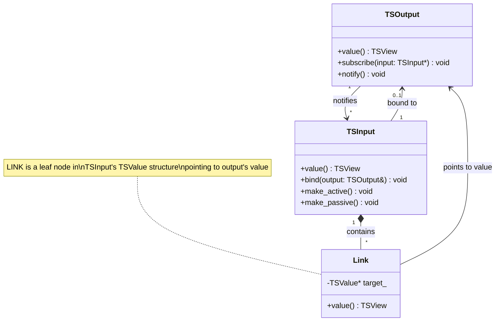

### Observer Pattern - Notification Flow

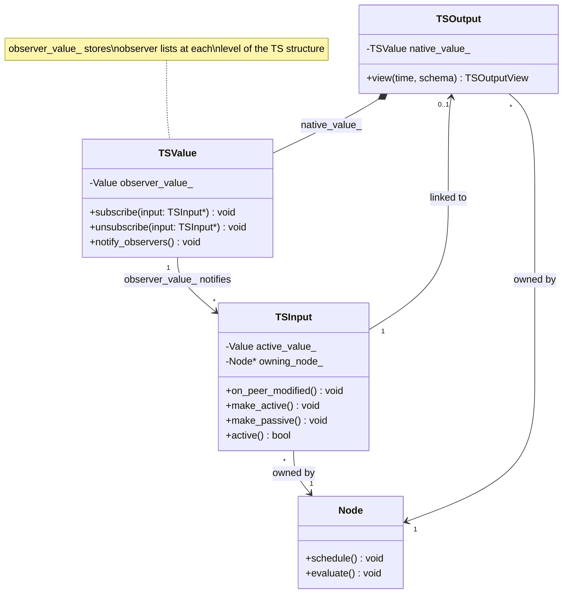

### Peering Model

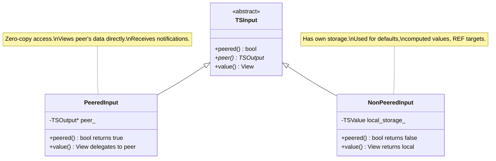

### REF Dynamic Binding

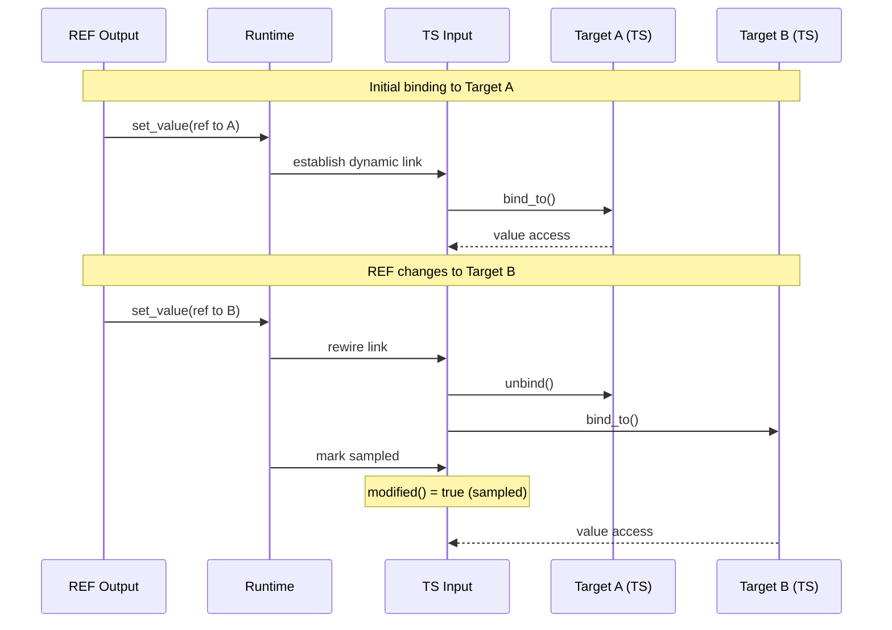

### Notification Flow

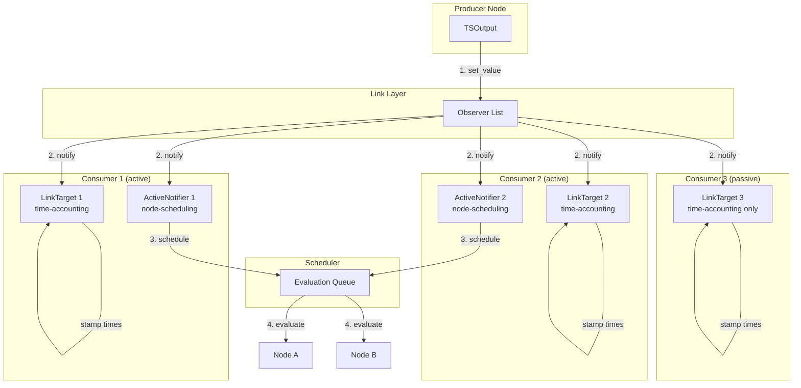

### Link Lifecycle

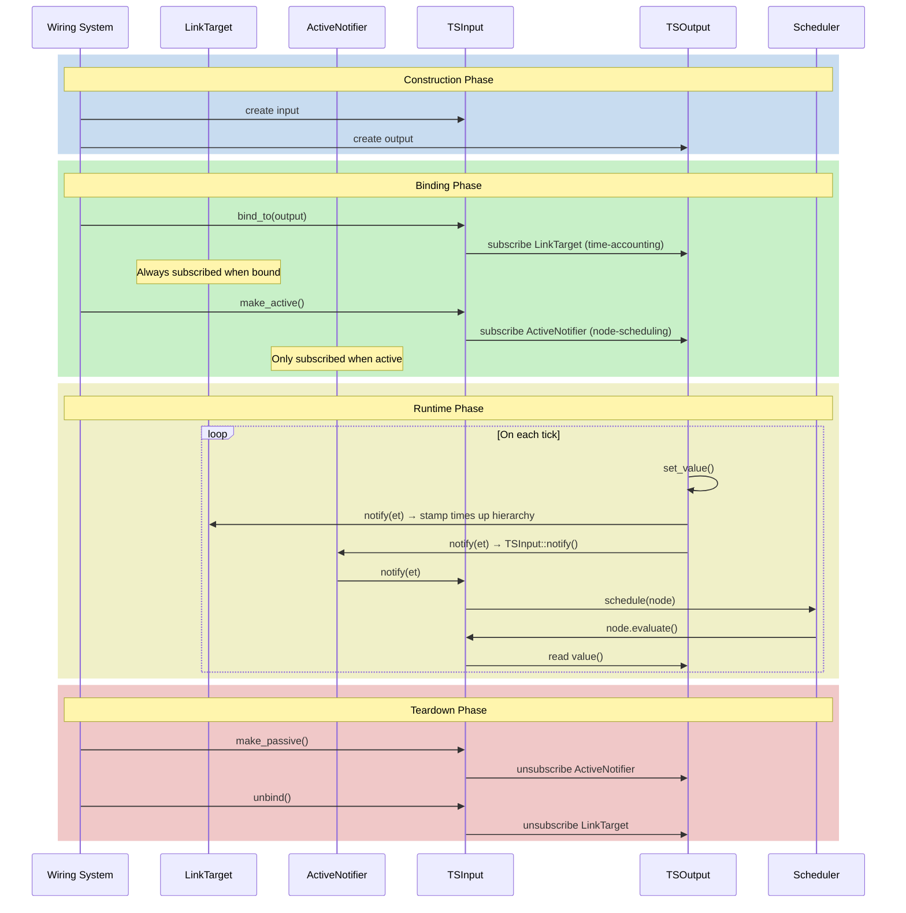

### Composite Link Binding

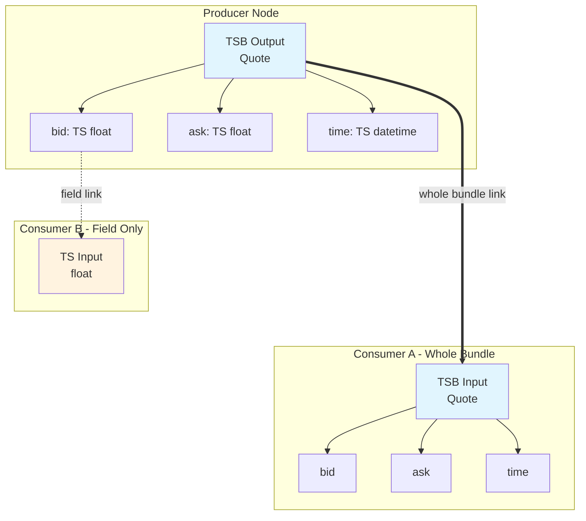

### Cast Mechanism

```mermaid
sequenceDiagram
    participant I as TSInput
    participant L as Link
    participant O as TSOutput
    participant Alt as Alternative Rep

    Note over I,Alt: Bind with schema mismatch
    I->>L: link(output, input_schema)
    L->>O: schemas match?
    O-->>L: No (need cast)
    L->>O: get_or_create_alternative(input_schema)

    alt Alternative exists
        O-->>L: return existing alt
    else Create new
        O->>Alt: create TSValue(input_schema)
        O->>Alt: establish internal sync
        O-->>L: return new alt
    end

    L->>I: establish_link(alt)
    Note over I,Alt: Input now linked to alternative
```

### Alternative Representation Management

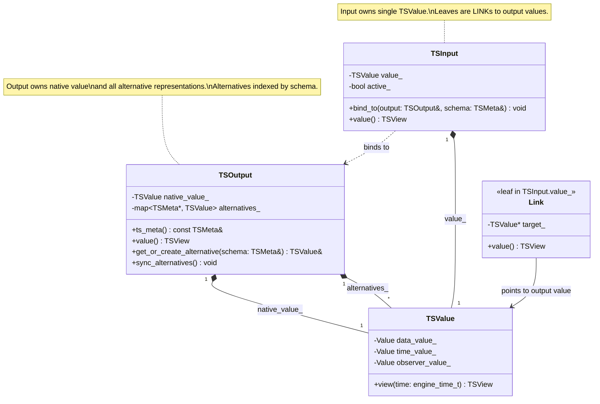

### Memory Stability Model

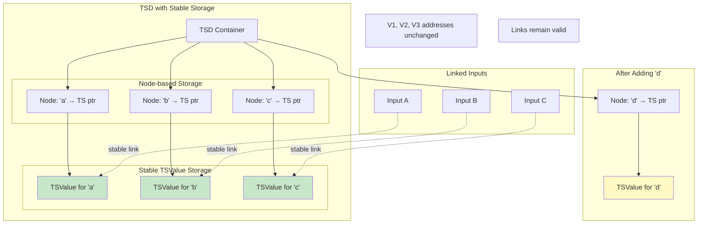

### Relationships Overview

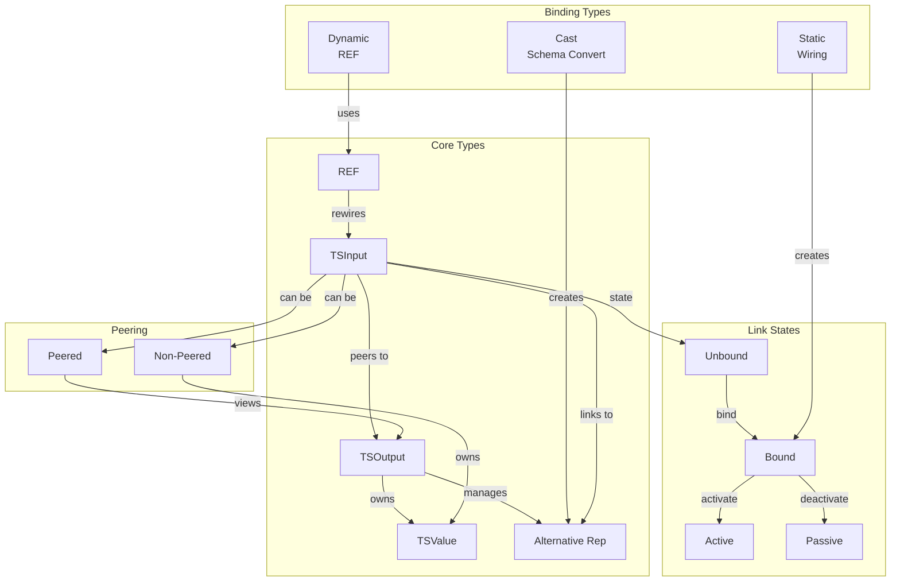

---

## Best Practices

### Prefer Direct Links Over REF

Direct links are zero-overhead. Use REF only when you need dynamic routing.

### Consider Active vs Passive

If an input shouldn't trigger your node, mark it passive. This reduces unnecessary computation.

### Be Aware of Link Depth

Deep composite structures have many potential link points. Bind at the highest level that makes sense to minimize overhead.

### Minimize Cast Requirements

When possible, design schemas so inputs and outputs match directly. Casting creates additional TSValue storage and sync overhead. If many inputs need a cast version, the sharing via output's alternative representation helps, but avoiding the cast entirely is better.

### Understand Memory Stability Implications

When implementing custom collection types or extending the framework:
- TSD elements must use node-based or pointer-indirection storage
- Never use contiguous storage (like `std::vector`) for collections where elements can be individually linked
- Alternative representations inherit the same stability requirements

---

## Implementation Notes

> **Note**: The following details are relevant for implementers and may be migrated to a separate implementation guide.

### Cast Implementation Considerations

1. **Alternative registry**: Outputs should use a map from `TSMeta*` (or schema hash) to alternative TSValues
2. **Lazy creation**: Create alternatives only when first requested
3. **Sync mechanism**: Output must hook its mutation operations to propagate changes to alternatives
4. **Cleanup**: When output is destroyed, all alternatives are destroyed

### Memory Stability Implementation

For TSD (the most complex case), several valid approaches:

```cpp
// Option 1: Node-based - simple, stable addresses
std::map<Key, std::unique_ptr<TSValue>> elements_;

// Option 2: Slot-based with tombstones - stable indices, cache-friendly
struct Slot {
    TSValue value;
    bool alive;
};
std::vector<Slot> slots_;
std::vector<size_t> free_list_;
std::unordered_map<Key, size_t> key_to_slot_;

// NOT stable: naive vector that reallocates
std::vector<std::pair<Key, TSValue>> elements_;  // DON'T DO THIS
```

The slot-based approach offers better cache locality while maintaining stability - elements stay at their allocated indices, and removed slots are marked dead and reused via the free list.

For alternative representations with REF elements:
- The REF values point back to primary elements
- If primary uses stable storage, REF targets remain valid
- REFLinks handle the notification forwarding

### REFLink Storage

REFLink (used for REF→TS dereferencing) is stored **inline** as part of the link schema, not in a separate collection. This follows the same pattern as LinkTarget:

- **Inline storage is stable**: Data in TSValue storage has stable addresses - elements are never moved after insertion
- **Automatic cleanup**: When an element is removed, its inline REFLink is destroyed automatically
- **No tracking needed**: The REFLink is co-located with the position it manages

### Element Removal Lifecycle

Element removal uses a **two-phase lifecycle** to ensure safe notification handling:

**Phase 1: Mark as dead**
- Element is logically removed
- All notification subscriptions are cancelled (unsubscribe)
- No more callbacks will arrive
- Storage persists - other code can still read "last value" this engine cycle

**Phase 2: Later destroy**
- Called when slot is reused or container destroyed
- Destructor runs and frees resources
- Safe because subscriptions were already cancelled

This separation prevents dangling pointer issues - the notification system never has references to destroyed elements because unsubscription happens before destruction.

---

## Next

- [TSOutput and TSInput](05_TSOUTPUT_TSINPUT.md) - Graph endpoints that use links
- [Access Patterns](06_ACCESS_PATTERNS.md) - Reading and writing through views
- [Delta and Change Tracking](07_DELTA.md) - What changed through the link?
