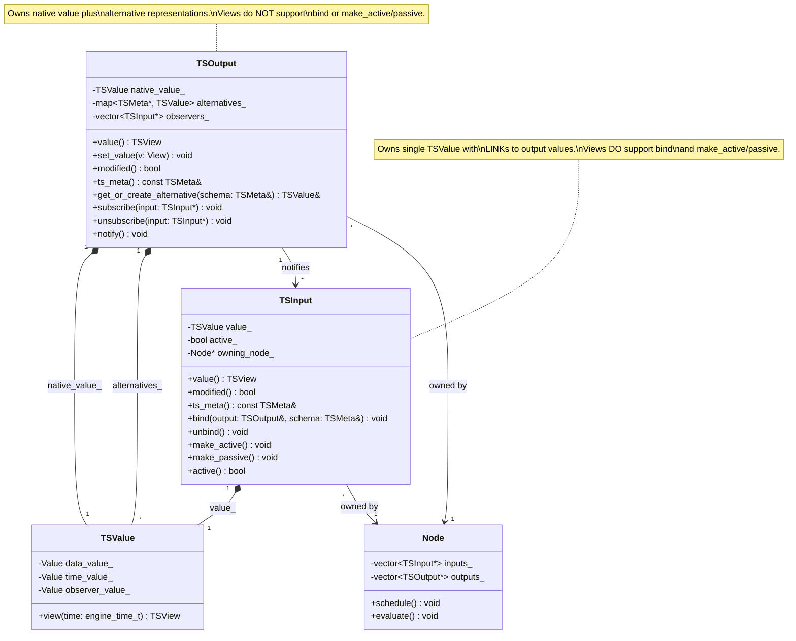
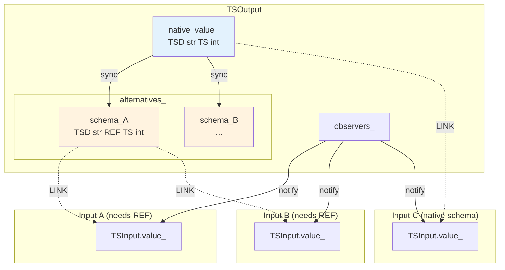
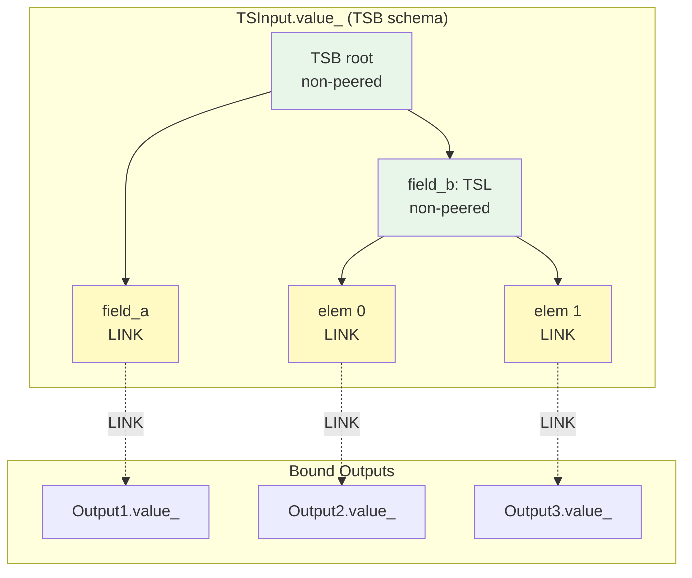

# TSOutput and TSInput: Graph Endpoints

**Parent**: [Overview](00_OVERVIEW.md)

---

## Overview

TSOutput and TSInput are the **graph endpoints** - dedicated objects that connect nodes to the data flow network. They are **not** lightweight TSValue wrappers but rather specialized objects with distinct responsibilities, composed from TSValue while exposing their own API.

- **TSOutput**: The data source - owns and publishes values, manages alternative representations
- **TSInput**: The data consumer - binds to outputs, controls notification subscription

Both utilize [Links](04_LINKS_AND_BINDING.md) internally for their binding behavior.

---

## TSOutput: The Data Source

### Structure

TSOutput owns and manages **multiple representations** of its data:

```
┌─────────────────────────────────────────────────────────────┐
│  TSOutput                                                    │
│                                                              │
│  ┌──────────────────────────────────┐                       │
│  │  native_value_: TSValue          │  ← Always present     │
│  │  (native schema of the output)   │                       │
│  └──────────────────────────────────┘                       │
│                                                              │
│  ┌──────────────────────────────────────────────────────┐   │
│  │  alternatives_: map<TSMeta*, TSValue>                │   │
│  │                                                       │   │
│  │  schema_A → TSValue (cast representation)            │   │
│  │  schema_B → TSValue (cast representation)            │   │
│  │  ...                                                  │   │
│  └──────────────────────────────────────────────────────┘   │
│                                                              │
│  ┌──────────────────────────────────┐                       │
│  │  observers_: vector<TSInput*>    │  ← Notification list  │
│  └──────────────────────────────────┘                       │
│                                                              │
│  API: value(), set_value(), modified(), ts_meta()           │
│       get_or_create_alternative(schema)                     │
│       subscribe(), unsubscribe(), notify()                  │
│                                                              │
│  Views do NOT support: bind, make_active/passive            │
│  (outputs are sources, not bound to anything)               │
└─────────────────────────────────────────────────────────────┘
```

### Responsibilities

1. **Own the native value**: The primary TSValue in the output's declared schema
2. **Manage alternative representations**: Created on-demand when inputs require different schemas (cast)
3. **Keep alternatives in sync**: When native value changes, propagate to all alternatives
4. **Notify observers**: When modified, notify all subscribed inputs

### Native Value

The native value is always present and represents the output's declared type:

```cpp
class TSOutput {
    TSValue native_value_;  // Always exists, schema matches output's declared type

public:
    TSOutput(const TSMeta& ts_meta)
        : native_value_(ts_meta) {}

    // Primary access - returns view of native value
    TSView value() { return native_value_.view(current_time()); }

    // Mutation
    void set_value(View v) {
        native_value_.set_value(v);
        mark_modified();
        notify();
        sync_alternatives();
    }
};
```

### Alternative Representations (Cast)

When an input's schema differs from the output's native schema, the output creates and maintains an alternative representation:

```cpp
class TSOutput {
    std::map<const TSMeta*, TSValue> alternatives_;

public:
    TSValue& get_or_create_alternative(const TSMeta& schema) {
        auto it = alternatives_.find(&schema);
        if (it != alternatives_.end()) {
            return it->second;  // Reuse existing
        }

        // Create new alternative
        auto& alt = alternatives_.emplace(&schema, TSValue(schema)).first->second;
        establish_sync(native_value_, alt);  // Set up synchronization
        return alt;
    }

private:
    void sync_alternatives() {
        for (auto& [schema, alt] : alternatives_) {
            // Propagate changes from native to alternative
            sync_values(native_value_, alt);
        }
    }
};
```

Alternatives are indexed by schema pointer, allowing multiple inputs with the same cast requirement to share a single alternative representation.

### Observer Management

TSOutput maintains a list of subscribed inputs and notifies them on changes:

```cpp
class TSOutput {
    std::vector<TSInput*> observers_;

public:
    void subscribe(TSInput* input) {
        observers_.push_back(input);
    }

    void unsubscribe(TSInput* input) {
        observers_.erase(
            std::remove(observers_.begin(), observers_.end(), input),
            observers_.end()
        );
    }

    void notify() {
        for (auto* observer : observers_) {
            if (observer->active()) {
                observer->on_peer_modified();
            }
        }
    }
};
```

---

## TSInput: The Data Consumer

### Structure

TSInput owns a **single TSValue** representing its view of bound data:

```
┌─────────────────────────────────────────────────────────────┐
│  TSInput                                                     │
│                                                              │
│  ┌──────────────────────────────────┐                       │
│  │  value_: TSValue                 │                       │
│  │  (input's schema)                │                       │
│  │                                  │                       │
│  │  Structure:                      │                       │
│  │  ├── non-peered nodes (local)    │                       │
│  │  └── LINK leaves → output values │                       │
│  └──────────────────────────────────┘                       │
│                                                              │
│  ┌──────────────────────────────────┐                       │
│  │  active_: bool                   │  ← Subscription flag  │
│  │  owning_node_: Node*             │  ← For scheduling     │
│  └──────────────────────────────────┘                       │
│                                                              │
│  API: value(), modified(), ts_meta()                        │
│       bind(), unbind()                                      │
│       make_active(), make_passive(), active()               │
│                                                              │
│  Views DO support: bind, make_active/passive                │
│  (inputs bind to outputs and control notifications)         │
└─────────────────────────────────────────────────────────────┘
```

### Responsibilities

1. **Own local structure**: The TSValue contains non-peered nodes for the input's schema
2. **Maintain LINKs**: Leaf nodes are LINKs pointing to bound output values
3. **Control subscription**: Active/passive state determines notification behavior
4. **Schedule owning node**: When notified, schedule the node for evaluation

### Value Structure

The input's TSValue has a mixed structure:
- **Non-peered nodes**: Internal structure (bundles, lists, etc.) owned locally
- **LINK leaves**: Terminal nodes that point to output values

```
Input Schema: TSB[a: TS[int], b: TSL[TS[float], 2]]

TSInput.value_:
├── TSB (non-peered, local)
│   ├── a: LINK → Output1.native_value_.a
│   └── b: TSL (non-peered, local)
│       ├── [0]: LINK → Output2.native_value_
│       └── [1]: LINK → Output3.native_value_
```

### Binding

When an input binds to an output, it establishes LINKs from its leaf nodes to the appropriate output values:

```cpp
class TSInput {
    TSValue value_;
    bool active_ = false;
    Node* owning_node_;

public:
    void bind(TSOutput& output, const TSMeta& schema) {
        if (output.ts_meta() == schema) {
            // Direct binding - schema matches
            establish_link(value_, output.native_value_);
        } else {
            // Cast required - get alternative representation
            TSValue& alt = output.get_or_create_alternative(schema);
            establish_link(value_, alt);
        }

        // Subscribe if active
        if (active_) {
            output.subscribe(this);
        }
    }

    void unbind() {
        // Remove links and unsubscribe
        clear_links(value_);
        // ... unsubscribe from outputs
    }
};
```

### Subscription Control

The active flag controls whether the input receives notifications:

```cpp
class TSInput {
public:
    void make_active() {
        if (!active_) {
            active_ = true;
            subscribe_to_bound_outputs();
        }
    }

    void make_passive() {
        if (active_) {
            active_ = false;
            unsubscribe_from_bound_outputs();
        }
    }

    bool active() const { return active_; }

    void on_peer_modified() {
        // Called by output when it changes
        owning_node_->schedule();
    }
};
```

---

## API Comparison

| Aspect | TSOutput | TSInput |
|--------|----------|---------|
| **Owns** | Native TSValue + alternatives map | Single TSValue |
| **value()** | Returns view of native value | Returns view (via LINKs to outputs) |
| **Mutation** | set_value(), apply_delta() | Read-only (const view) |
| **Bind** | Not applicable (outputs are sources) | bind(), unbind() |
| **Active/Passive** | Not applicable | make_active(), make_passive() |
| **Cast support** | get_or_create_alternative() | Requests cast at bind time |
| **Observers** | Maintains list, notifies on change | Is an observer, receives notifications |

---

## Composition Model

Both TSOutput and TSInput are **composed from** TSValue rather than inheriting or directly exposing it:

```cpp
class TSOutput {
    TSValue native_value_;
    std::map<const TSMeta*, TSValue> alternatives_;
    std::vector<TSInput*> observers_;

public:
    // Own API - not forwarding TSValue methods
    TSView value();
    void set_value(View v);
    bool modified();
    const TSMeta& ts_meta();
    TSValue& get_or_create_alternative(const TSMeta& schema);
};

class TSInput {
    TSValue value_;
    bool active_;
    Node* owning_node_;

public:
    // Own API with binding and subscription control
    TSView value();
    bool modified();
    const TSMeta& ts_meta();
    void bind(TSOutput& output, const TSMeta& schema);
    void unbind();
    void make_active();
    void make_passive();
    bool active();
};
```

This composition approach:
- Encapsulates the TSValue implementation details
- Allows TSOutput and TSInput to have different APIs appropriate to their roles
- Enables future implementation changes without affecting the external interface

---

## UML Diagrams

### Class Structure



### Input Binding Flow

```mermaid
sequenceDiagram
    participant I as TSInput
    participant O as TSOutput
    participant Alt as Alternative TSValue
    participant N as Node

    Note over I,N: Binding with schema match
    I->>O: bind(output, matching_schema)
    O-->>I: return native_value_
    I->>I: establish_link(value_, native_value_)
    I->>O: subscribe(this)

    Note over I,N: Binding with schema mismatch (cast)
    I->>O: bind(output, different_schema)
    O->>O: get_or_create_alternative(schema)
    O->>Alt: create TSValue(schema)
    O-->>I: return alternative
    I->>I: establish_link(value_, alternative)
    I->>O: subscribe(this)

    Note over I,N: Runtime notification
    O->>O: set_value(new_data)
    O->>O: sync_alternatives()
    O->>I: notify() [if active]
    I->>N: schedule()
```

### Output Alternative Management



### Input Value Structure



---

## Relationship to Other Concepts

### TSValue
TSOutput and TSInput are **composed from** TSValue. See [Time-Series](03_TIME_SERIES.md) for TSValue details.

### Links
The binding mechanism uses [Links](04_LINKS_AND_BINDING.md) - inputs establish LINKs to output values. The LINK provides zero-copy access and notification capability.

### Cast
When input and output schemas differ, [Cast](04_LINKS_AND_BINDING.md#cast-logic-schema-conversion-at-bind-time) creates alternative representations. The output owns and syncs these alternatives.

### Memory Stability
Both native values and alternatives must maintain [memory stability](04_LINKS_AND_BINDING.md#memory-stability-requirements) so that LINKs remain valid under mutation.

---

## Best Practices

### For Output Usage

1. **Prefer native schema**: Design outputs with schemas that most consumers need directly
2. **Minimize alternatives**: Each alternative adds sync overhead
3. **Batch mutations**: Multiple set_value() calls trigger multiple syncs; batch when possible

### For Input Usage

1. **Use passive when appropriate**: If an input shouldn't trigger evaluation, make it passive
2. **Match schemas when possible**: Direct binding is more efficient than cast
3. **Bind at appropriate granularity**: Bind whole structures when you need the whole thing

---

## Next

- [Access Patterns](06_ACCESS_PATTERNS.md) - Reading and writing through views
- [Delta and Change Tracking](07_DELTA.md) - Incremental processing
