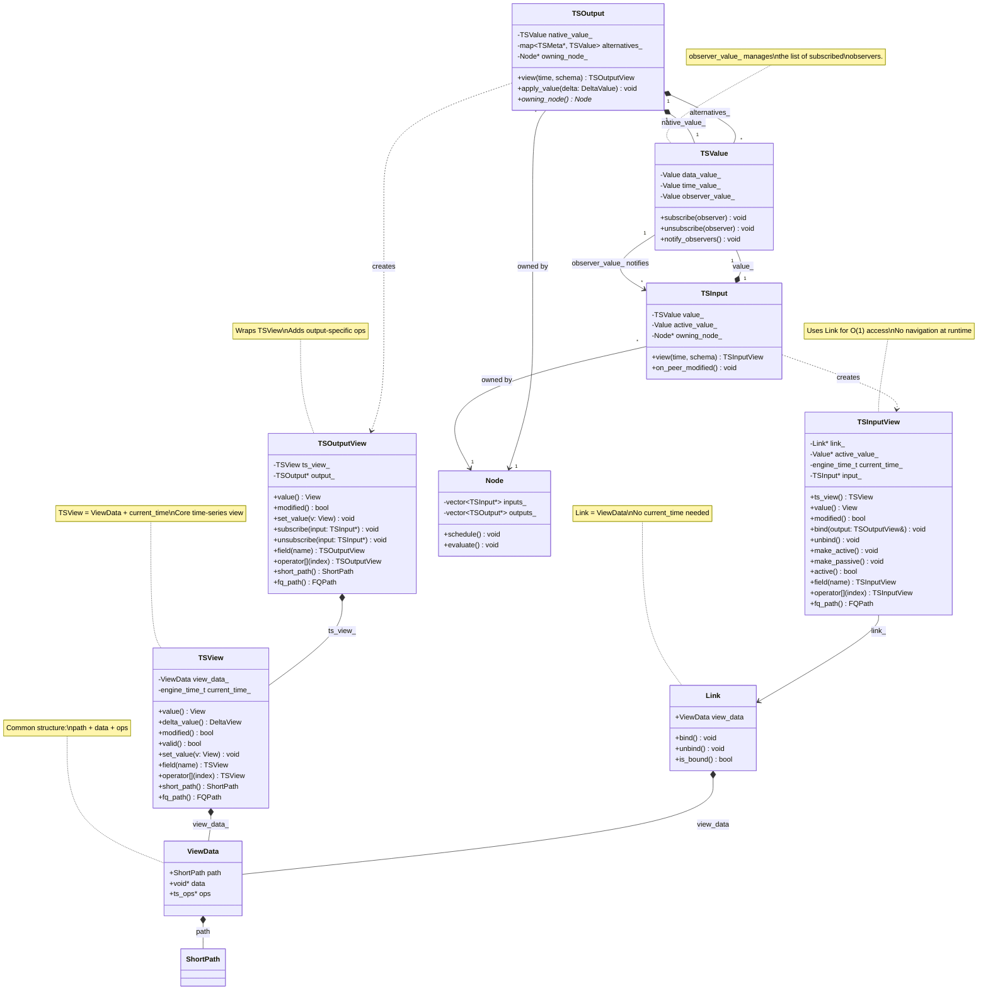
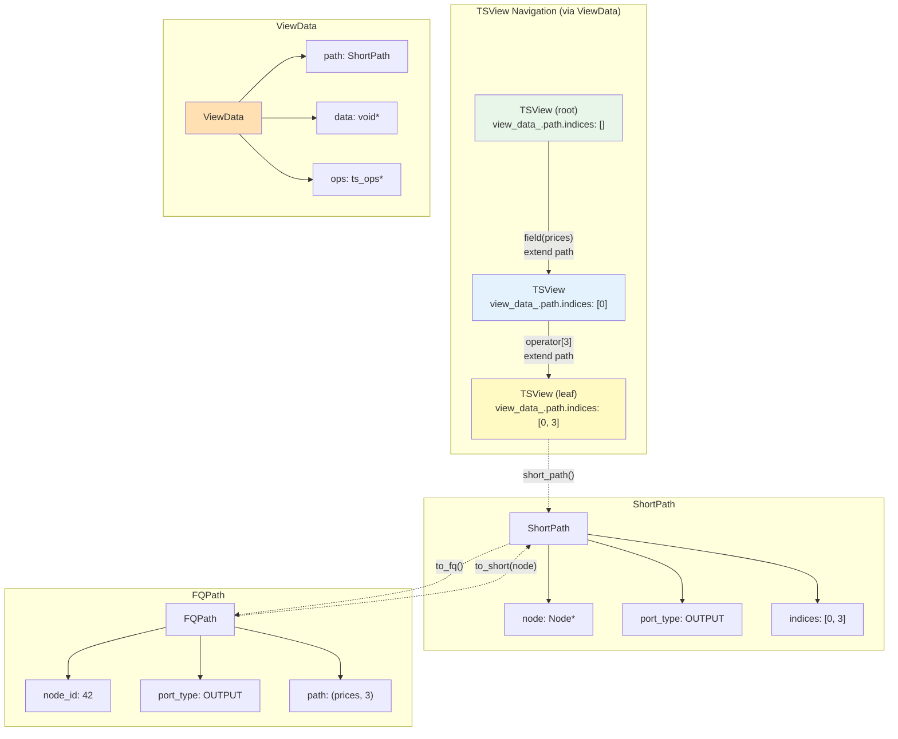
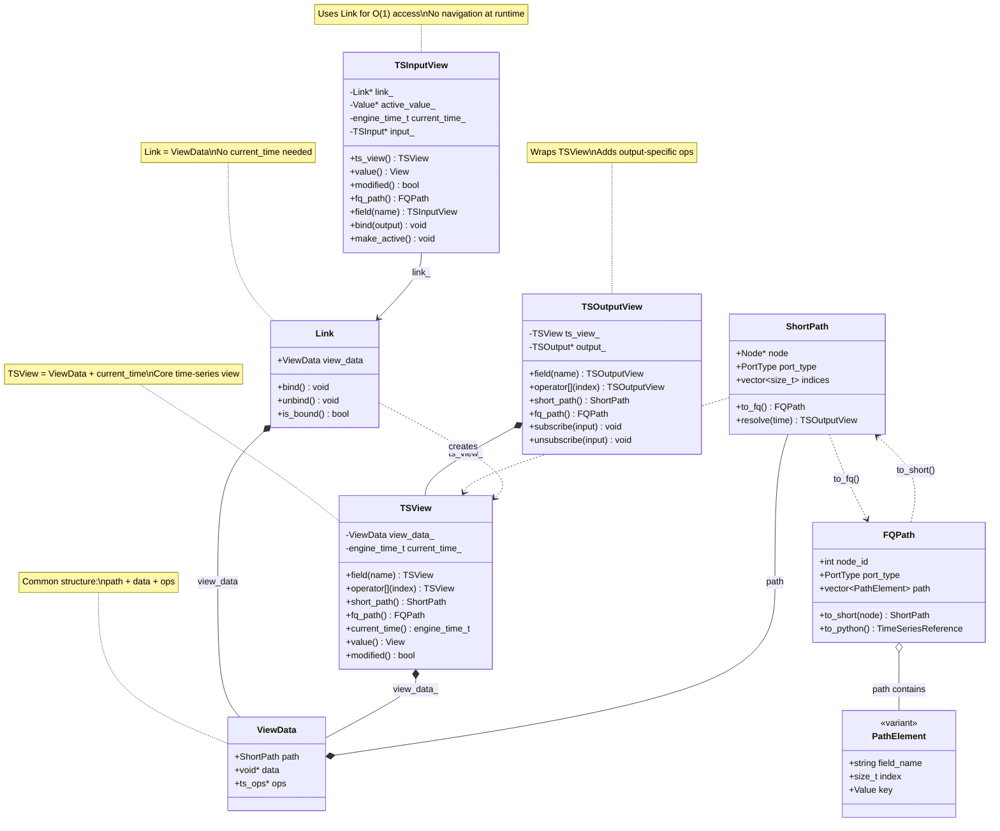
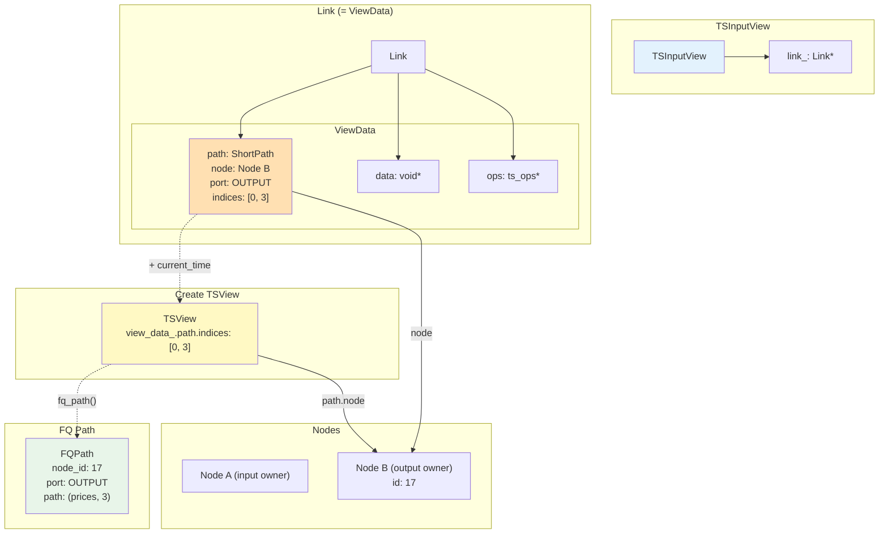

# TSOutput and TSInput: Graph Endpoints

**Parent**: [Overview](00_OVERVIEW.md)

---

## Overview

TSOutput and TSInput are the **graph endpoints** - dedicated objects that connect nodes to the data flow network. They are **not** lightweight TSValue wrappers but rather specialized objects with distinct responsibilities, composed from TSValue while exposing their own API.

- **TSOutput**: The data source - owns and publishes values, manages alternative representations
- **TSInput**: The data consumer - binds to outputs, controls notification subscription

Both utilize [Links](04_LINKS_AND_BINDING.md) internally for their binding behavior.

---

## TSOutput: The Data Source

### Structure

TSOutput owns and manages **multiple representations** of its data:

```
┌─────────────────────────────────────────────────────────────┐
│  TSOutput                                                    │
│                                                              │
│  ┌──────────────────────────────────────────────────────┐   │
│  │  native_value_: TSValue                              │   │
│  │  (native schema of the output)                       │   │
│  │                                                       │   │
│  │  Contains:                                           │   │
│  │  ├── data_value_                                     │   │
│  │  ├── time_value_                                     │   │
│  │  └── observer_value_ ← Manages observer list         │   │
│  └──────────────────────────────────────────────────────┘   │
│                                                              │
│  ┌──────────────────────────────────────────────────────┐   │
│  │  alternatives_: map<TSMeta*, TSValue>                │   │
│  │                                                       │   │
│  │  schema_A → TSValue (cast representation)            │   │
│  │  schema_B → TSValue (cast representation)            │   │
│  │  ...                                                  │   │
│  └──────────────────────────────────────────────────────┘   │
│                                                              │
│  ┌──────────────────────────────────────────────────────┐   │
│  │  owning_node_: Node*                                 │   │
│  └──────────────────────────────────────────────────────┘   │
│                                                              │
│  Core API:                                                   │
│    view(engine_time_t, TSMeta&) → TSOutputView              │
│    apply_value(DeltaValue)                                  │
│                                                              │
│  TSOutputView API (type-erased):                            │
│    value(), delta_value(), modified(), valid()              │
│    set_value(), apply_delta()                               │
│    subscribe(), unsubscribe()                               │
│    Navigation: field(), operator[], navigate()              │
│    (does NOT support: bind, make_active/passive)            │
└─────────────────────────────────────────────────────────────┘
```

**Note**: TSOutput follows the view pattern. Call `view(current_time, schema)` to get a type-erased `TSOutputView`. If the schema matches the native schema, returns a view of `native_value_`. If the schema differs (but is compatible), creates or returns an existing alternative representation. Observer management is handled by the TSValue's `observer_value_` component.

### Responsibilities

1. **Own the native value**: The primary TSValue in the output's declared schema
2. **Manage alternative representations**: Created on-demand when inputs require different schemas (cast)
3. **Keep alternatives in sync**: When native value changes, propagate to all alternatives
4. **Notify observers**: When modified, notify all subscribed inputs

### Native Value

The native value is always present and represents the output's declared type:

```cpp
class TSOutput {
    TSValue native_value_;  // Always exists, schema matches output's declared type
    std::map<const TSMeta*, TSValue> alternatives_;
    Node* owning_node_;

public:
    TSOutput(const TSMeta& ts_meta, Node* owner)
        : native_value_(ts_meta), owning_node_(owner) {}

    // View access - returns type-erased TSOutputView
    // If schema matches native, returns view of native_value_
    // If schema differs (but compatible), creates/returns alternative
    TSOutputView view(engine_time_t time, const TSMeta& schema) {
        if (&schema == &native_value_.ts_meta()) {
            return TSOutputView(&native_value_, this, time);
        }
        // Get or create alternative for this schema
        TSValue& alt = get_or_create_alternative(schema);
        return TSOutputView(&alt, this, time);
    }

    // Bulk mutation via delta (applies to native, syncs to alternatives)
    void apply_value(const DeltaValue& delta) {
        native_value_.apply_delta(delta);
        sync_alternatives();
    }

    Node* owning_node() const { return owning_node_; }

private:
    TSValue& get_or_create_alternative(const TSMeta& schema) {
        auto it = alternatives_.find(&schema);
        if (it != alternatives_.end()) {
            return it->second;
        }
        auto& alt = alternatives_.emplace(&schema, TSValue(schema)).first->second;
        establish_sync(native_value_, alt);
        return alt;
    }
};

// TSOutputView wraps TSView, adds output-specific operations
class TSOutputView {
    TSView ts_view_;                // Core view (ViewData + current_time)
    TSOutput* output_;              // For subscription management

public:
    // Delegates to TSView for data access
    View value() { return ts_view_.value(); }
    DeltaView delta_value() { return ts_view_.delta_value(); }
    bool modified() { return ts_view_.modified(); }
    bool valid() { return ts_view_.valid(); }

    // Output-specific mutation
    void set_value(View v) { ts_view_.set_value(v); }
    void apply_delta(DeltaView dv) { ts_view_.apply_delta(dv); }

    // Observer management (delegates to observer_value_)
    void subscribe(Notifiable* observer);
    void unsubscribe(Notifiable* observer);

    // Navigation - wraps TSView navigation
    TSOutputView field(std::string_view name);
    TSOutputView operator[](size_t index);
    TSOutputView operator[](View key);
    TSOutputView navigate(std::string_view path);
};
```

### Alternative Representations (Cast)

When an input's schema differs from the output's native schema, the `view(time, schema)` method automatically creates and returns a view of an alternative representation:

```cpp
// Input needs TSD[str, REF[TS[int]]] but output is TSD[str, TS[int]]
TSOutputView out_view = output.view(current_time, ref_schema);
// Internally creates alternative if needed, returns view of it

// Multiple inputs with same cast requirement share the alternative
TSOutputView view1 = output.view(current_time, ref_schema);  // Same alternative
TSOutputView view2 = output.view(current_time, ref_schema);  // Same alternative
```

Alternatives are indexed by schema pointer, allowing multiple inputs with the same cast requirement to share a single alternative representation. The `view()` method encapsulates the get-or-create logic.

### Observer Management

Observer management is handled by TSValue's `observer_value_` component. The `TSOutputView` exposes subscription methods:

```cpp
// Usage via view
TSOutput output(ts_meta);
TSOutputView view = output.view(current_time, native_schema);

// Subscribe/unsubscribe through the view
view.subscribe(input_ptr);
view.unsubscribe(input_ptr);

// Internally, TSOutputView delegates to observer_value_
class TSOutputView {
public:
    void subscribe(Notifiable* observer) {
        // Delegates to TSValue's observer_value_
        get_ts_value()->subscribe(observer);
    }

    void unsubscribe(Notifiable* observer) {
        get_ts_value()->unsubscribe(observer);
    }
};
```

---

## TSInput: The Data Consumer

### Structure

TSInput owns a **single TSValue** representing its view of bound data:

```
┌─────────────────────────────────────────────────────────────┐
│  TSInput                                                     │
│                                                              │
│  ┌──────────────────────────────────┐                       │
│  │  value_: TSValue                 │                       │
│  │  (input's schema)                │                       │
│  │                                  │                       │
│  │  Structure:                      │                       │
│  │  ├── non-peered nodes (local)    │                       │
│  │  └── LINK leaves → output values │                       │
│  └──────────────────────────────────┘                       │
│                                                              │
│  ┌──────────────────────────────────────────────────────┐   │
│  │  active_value_: Value                                │   │
│  │  (schema mirrors TS schema structure)                │   │
│  │                                                       │   │
│  │  Tracks active/passive state at each level:          │   │
│  │  ├── TSB[a, b] → Bundle[a: bool, b: ...]            │   │
│  │  ├── TSL[TS[T], N] → List[bool, N]                  │   │
│  │  └── TS[T] → bool (leaf)                            │   │
│  └──────────────────────────────────────────────────────┘   │
│                                                              │
│  ┌──────────────────────────────────┐                       │
│  │  owning_node_: Node*             │  ← For scheduling     │
│  └──────────────────────────────────┘                       │
│                                                              │
│  Core API:                                                   │
│    view(engine_time_t, TSMeta&) → TSInputView               │
│                                                              │
│  TSInputView API (type-erased):                             │
│    value(), delta(), modified(), valid()                    │
│    bind(), unbind()                                         │
│    make_active(), make_passive(), active()                  │
│    Navigation: field(), operator[], navigate()              │
│    (does NOT support: set_value, subscribe/unsubscribe)     │
└─────────────────────────────────────────────────────────────┘
```

**Note**: The `active_value_` mirrors the TS schema structure, allowing active/passive state to be tracked at each level of a composite input. This is analogous to how `time_value_` and `observer_value_` track modification time and observers at each level in TSValue.

### Responsibilities

1. **Own local structure**: The TSValue contains non-peered nodes for the input's schema
2. **Maintain LINKs**: Leaf nodes are LINKs pointing to bound output values
3. **Control subscription**: Active/passive state determines notification behavior
4. **Schedule owning node**: When notified, schedule the node for evaluation

### Value Structure

The input's TSValue has a mixed structure:
- **Non-peered nodes**: Internal structure (bundles, lists, etc.) owned locally
- **LINK leaves**: Terminal nodes that point to output values

```
Input Schema: TSB[a: TS[int], b: TSL[TS[float], 2]]

TSInput.value_:
├── TSB (non-peered, local)
│   ├── a: LINK → Output1.native_value_.a
│   └── b: TSL (non-peered, local)
│       ├── [0]: LINK → Output2.native_value_
│       └── [1]: LINK → Output3.native_value_
```

### Binding

When an input binds to an output, it establishes LINKs from its leaf nodes to the appropriate output values. Binding is done through the `TSInputView`:

```cpp
class TSInput {
    TSValue value_;
    Value active_value_;  // Mirrors TS schema, tracks active state at each level
    Node* owning_node_;

public:
    TSInput(const TSMeta& ts_meta, Node* owner)
        : value_(ts_meta)
        , active_value_(derive_active_schema(ts_meta))  // bool at each TS level
        , owning_node_(owner) {}

    // View access - returns type-erased TSInputView
    TSInputView view(engine_time_t time, const TSMeta& schema) {
        return TSInputView(&value_, &active_value_, this, time, schema);
    }
};

// TSInputView uses Link (ViewData) for O(1) data access
class TSInputView {
    Link* link_;                    // ViewData: path + data + ops
    Value* active_value_;           // Points to active state at this path
    engine_time_t current_time_;    // Context for modification checks
    TSInput* input_;                // Owning input for binding management

public:
    // Delegates to Link's ViewData for read-only access
    View value() { return View{link_->view_data.data, link_->view_data.ops}; }
    DeltaView delta();
    bool modified();
    bool valid();

    // Input-specific binding
    void bind(TSOutputView& output);
    void unbind();

    // Subscription control (operates on active_value_ at current path)
    void make_active();
    void make_passive();
    bool active();        // Active at current path
    bool any_active();    // Any child active (for composites)
    bool all_active();    // All children active (for composites)

    // Navigation - returns new views with child Links (O(1) access)
    TSInputView field(std::string_view name);
    TSInputView operator[](size_t index);
    TSInputView operator[](View key);
    TSInputView navigate(std::string_view path);
};

// Usage - input and output may have different schemas
TSInput input(input_schema, owning_node);
TSInputView in_view = input.view(current_time, input_schema);

TSOutput output(output_schema);
// Output provides view with input's schema - creates alternative if needed
TSOutputView out_view = output.view(current_time, input_schema);

in_view.bind(out_view);  // Establishes LINK, subscribes if active
```

### Subscription Control

The active state controls whether the input receives notifications. Because `active_value_` mirrors the TS schema structure, active/passive can be controlled at any level of a composite input:

```cpp
// Usage via view - active state is per-path
TSInputView view = input.view(current_time, input_schema);

// Make entire input active
view.make_active();

// Or control at finer granularity
view.field("prices").make_active();      // Only prices field active
view.field("metadata").make_passive();   // Metadata passive

// Check active state at current navigation path
bool is_active = view.active();

// For composites, can check if any/all children active
bool any = view.any_active();
bool all = view.all_active();
```

The `active_value_` structure enables fine-grained subscription control:

```cpp
// Example: TSB[prices: TSL[TS[float], 10], metadata: TS[str]]
//
// active_value_ structure:
// Bundle {
//   prices: List[bool, 10]   // Each element can be active/passive
//   metadata: bool           // Leaf active state
// }

// Making prices[3] active subscribes only to that element's output
view.field("prices")[3].make_active();
```

Internally, `make_active()` and `make_passive()` update the corresponding position in `active_value_` and subscribe/unsubscribe from the bound output's `observer_value_`.

---

## Navigation Paths

Paths describe the location of a time-series value within the graph. Two path types are defined:

- **ShortPath**: Compact runtime format with `Node*` pointer - used in Links and for navigation
- **FQPath**: Fully qualified format with `node_id` integer - used for serialization and Python

Paths are tracked only on **TSOutput**. Links contain a ShortPath as their descriptor.

### Path Types

```cpp
// ShortPath: Compact runtime path with Node* pointer
struct ShortPath {
    Node* node;                     // Owning node
    PortType port_type;             // OUTPUT, STATE, or ERROR
    std::vector<size_t> indices;    // Navigation indices

    // Convert to fully qualified path (for serialization/Python)
    FQPath to_fq() const;

    // Produce an OutputView at the given time
    TSOutputView resolve(engine_time_t current_time) const;
};

// FQPath: Fully qualified path with node_id (serializable)
struct FQPath {
    int node_id;                            // Node identifier
    PortType port_type;                     // OUTPUT, STATE, or ERROR
    std::vector<PathElement> path;          // Field names, indices, and keys

    // Convert to ShortPath given a Node* (from graph lookup)
    ShortPath to_short(Node* node) const;

    // Python representation
    nb::object to_python() const;  // Returns TimeSeriesReference
};

// PathElement: Used in FQPath for human-readable paths
using PathElement = std::variant<
    std::string,    // Field name (bundle)
    size_t,         // Index (list)
    Value           // Key (dict)
>;
```

### ShortPath Operations

```cpp
// ShortPath can resolve to an OutputView
TSOutputView ShortPath::resolve(engine_time_t current_time) const {
    // Get root output from node
    TSOutput* output = node->get_output(port_type);

    // Get root view
    TSOutputView view = output->view(current_time);

    // Navigate using indices
    for (size_t idx : indices) {
        view = view[idx];
    }
    return view;
}

// ShortPath can expand to FQPath
FQPath ShortPath::to_fq() const {
    FQPath result{node->id(), port_type, {}};

    // Expand indices to PathElements using schema
    TSOutputView view = node->get_output(port_type)->view(0);  // Schema access only
    for (size_t idx : indices) {
        result.path.push_back(view.index_to_path_element(idx));
        view = view[idx];
    }
    return result;
}
```

### FQPath Operations

```cpp
// FQPath can convert to ShortPath given the Node*
ShortPath FQPath::to_short(Node* node) const {
    ShortPath result{node, port_type, {}};

    // Convert PathElements to indices using schema
    TSOutputView view = node->get_output(port_type)->view(0);  // Schema access only
    for (const auto& elem : path) {
        size_t idx = view.path_element_to_index(elem);
        result.indices.push_back(idx);
        view = view[idx];
    }
    return result;
}

// FQPath to Python
nb::object FQPath::to_python() const {
    // Returns TimeSeriesReference(node_id, port_type, path)
    return make_time_series_reference(node_id, port_type, path);
}
```

### TSOutputView and Path Access

TSOutputView is a graph endpoint wrapper. It provides output-specific operations (like subscribe/unsubscribe) and internally uses TSView for data access. Path tracking is through the underlying TSView:

```cpp
class TSOutputView {
    TSView ts_view_;                // Core time-series view (includes path via ViewData)
    TSOutput* output_;              // Owning output for subscription management

public:
    TSOutputView(TSView view, TSOutput* output)
        : ts_view_(std::move(view)), output_(output) {}

    // Delegate to TSView for data access
    View value() const { return ts_view_.value(); }
    bool modified() const { return ts_view_.modified(); }
    bool valid() const { return ts_view_.valid(); }
    void set_value(View v) { ts_view_.set_value(v); }

    // Path access through TSView
    const ShortPath& short_path() const { return ts_view_.short_path(); }
    FQPath fq_path() const { return ts_view_.fq_path(); }
    engine_time_t current_time() const { return ts_view_.current_time(); }

    // Navigation returns new TSOutputViews wrapping child TSViews
    TSOutputView field(std::string_view name) {
        return TSOutputView{ts_view_.field(name), output_};
    }

    TSOutputView operator[](size_t index) {
        return TSOutputView{ts_view_[index], output_};
    }

    TSOutputView operator[](View key) {
        return TSOutputView{ts_view_[key], output_};
    }

    // Output-specific: observer management
    void subscribe(Notifiable* observer);
    void unsubscribe(Notifiable* observer);
};
```

### ViewData and Link

**ViewData** is the common structure for accessing time-series data, defined in [Time-Series - TSView Internal Structure](03_TIME_SERIES.md#tsview-internal-structure):

- **ViewData** = `ShortPath path` + `void* data` + `ts_ops* ops`
- **TSView** = ViewData + `engine_time_t current_time_`

**Link** contains a ViewData (no current_time needed):

```cpp
struct Link {
    ViewData view_data;             // Path + data access

    // Initial binding populates view_data from ShortPath
    void bind() {
        // Navigate ShortPath to populate data and ops
        // Subscribe to notifications if active
    }

    void unbind() {
        // Unsubscribe from notifications
        // Clear data pointer
    }

    bool is_bound() const {
        return view_data.data != nullptr;
    }
};
```

Converting a **Link to TSView** just adds the current_time:

```cpp
// Link already has ViewData (path + data + ops)
// TSView = ViewData + current_time
TSView view = TSView{link.view_data, current_time};
```

This means:
- **Link = ViewData**: Everything needed to create a view without navigation
- **TSView = ViewData + current_time**: A view is a Link with temporal context
- Converting Link to TSView just adds current_time (no navigation needed)

See [Time-Series](03_TIME_SERIES.md#tsview-internal-structure) for the full TSView definition.

### TSInputView and Link Access

TSInputView is a graph endpoint wrapper. It provides input-specific operations (like bind/unbind, active/passive control) and uses Links (which are ViewData) for data access:

```cpp
class TSInputView {
    Link* link_;                    // ViewData: path + data + ops
    Value* active_value_;           // Points to active state at this path
    engine_time_t current_time_;    // Context for modification checks
    TSInput* input_;                // Owning input for binding management

public:
    // Convert Link to TSView (just adds current_time)
    TSView ts_view() const {
        return TSView{link_->view_data, current_time_};
    }

    // Delegate to Link's ViewData for data access
    View value() const {
        return View{link_->view_data.data, link_->view_data.ops};
    }

    bool modified() const {
        return check_modified(link_->view_data.data, current_time_);
    }

    // Path access via Link's ViewData
    const ShortPath& short_path() const { return link_->view_data.path; }
    FQPath fq_path() const { return link_->view_data.path.to_fq(); }
    engine_time_t current_time() const { return current_time_; }

    // Navigation returns new TSInputViews with child Links
    // Each child has its own Link (ViewData) pre-established during binding
    TSInputView field(std::string_view name) {
        Link* child_link = get_child_link(name);
        Value* child_active = get_child_active(name);
        return TSInputView{child_link, child_active, current_time_, input_};
    }

    TSInputView operator[](size_t index) {
        Link* child_link = get_child_link(index);
        Value* child_active = get_child_active(index);
        return TSInputView{child_link, child_active, current_time_, input_};
    }

    // Input-specific: binding
    void bind(TSOutputView& output);
    void unbind();

    // Input-specific: active/passive control
    void make_active();
    void make_passive();
    bool active() const;
};
```

**Key points**:
- Link contains ViewData (ShortPath + data + ops) - everything needed for O(1) access
- TSInputView = Link* + active_value* + current_time + input*
- No navigation needed at runtime - Link already points to the data
- Each input field/element has its own Link established during binding

### Port Type Enum

The port type distinguishes different node endpoints:

```cpp
enum class PortType : int {
    OUTPUT = 0,     // Regular time-series output (index 0+)
    INPUT = -3,     // Time-series input
    STATE = -2,     // Recordable state output (STATE_PATH)
    ERROR = -1,     // Error output (ERROR_PATH)
};
```

These match the existing wiring constants where `ERROR_PATH = -1` and `STATE_PATH = -2`.

### TSD and Stable Index Strategy

For **TSD** (dict), the short path uses a **stable index** rather than the actual key value. TSD internally maintains a stable mapping from keys to integer offsets:

```cpp
TSDView stock_prices = ...;  // TSD[str, TS[float]]

// Navigate by key
auto view = stock_prices["AAPL"];

// Short path uses the stable index, not the key
// If "AAPL" is at internal offset 7:
// short_path.indices = [7]   (not ["AAPL"])

// The stable index remains constant even as other keys are added/removed
stock_prices["MSFT"];  // Gets offset 8
stock_prices.remove("GOOG");  // "AAPL" still at offset 7
```

This stable index strategy ensures:
- Short path indices remain a uniform `vector<size_t>` for all container types
- Index stability under mutation (important for long-lived views)
- Efficient path comparison without key type knowledge

### Persistent Path (Fully Qualified)

The fully qualified (FQ) persistent path consists of two parts:
1. **node_id**: Identifies the owning node (output or input)
2. **expanded path**: The navigation steps using field names and actual key values

```cpp
TSBView bundle = ...;  // TSB[prices: TSL[TS[float], 10], metadata: TS[str]]

// Navigate to prices[3]
auto view = bundle.field("prices")[3];

// Fully qualified path:
// - node_id: identifier of the owning node
// - expanded_path: ["prices", 3]
FQPath fq_path = view.fq_path();
```

The expanded path uses:
- **Field names** for bundles (not indices)
- **Indices** for positional containers (TSL)
- **Actual key values** for dicts (TSD)

```cpp
// PathElement is a variant that can hold different key types
using PathElement = std::variant<std::string, size_t, /* other key types */>;

// FQPath structure
struct FQPath {
    NodeId node_id;                       // Identifies the owning node
    std::vector<PathElement> expanded;    // Navigation steps
};

// Expanded path examples:
// []                        - root of node
// ["bid"]                   - field "bid"
// ["prices", 3]             - field "prices", element 3
// ["users", "AAPL", "name"] - field "users", key "AAPL", field "name"
```

The FQ path is:
- **Self-describing**: Readable without knowing the schema
- **Globally resolvable**: Can navigate from any context using node_id
- **Stable across schema evolution**: Field names survive reordering
- **Suitable for serialization**: Can be stored and restored

#### TSD Keys in Expanded Path

For **TSD**, the expanded path stores the **actual key value**, not the stable index:

```cpp
TSDView stock_prices = ...;  // TSD[str, TS[float]]

auto view = stock_prices["AAPL"];

// Short path:  node + port + [7]                 (stable index only)
// FQ path:     {node_id: 42, expanded: ["AAPL"]} (actual key value)
```

This means the FQ path can reconstruct navigation even if the TSD's internal layout changes, while the short path provides efficient runtime access within a single session.

### Path Usage

```cpp
// Get current paths
auto sp = view.short_path();    // ShortPath: node + port_type + [0, 3] indices
auto fq = view.fq_path();       // {node_id: 42, expanded: ["prices", 3]}

// Navigate using short path (within same root)
TSOutputView root = output.view(time, schema);
TSOutputView target = root.navigate(sp);    // Same as field("prices")[3]

// Navigate using FQ path (from anywhere)
TSOutputView target2 = graph.resolve(fq);   // Finds node, then navigates

// Compare paths
bool same_location = (view1.short_path() == view2.short_path());  // Includes node + indices
bool same_global = (view1.fq_path() == view2.fq_path());          // Includes node_id + path
```

### When to Use Each Form

| Use Case | Recommended Path |
|----------|-----------------|
| Internal navigation (same node) | Short path (performance) |
| Cross-node references | FQ path (includes node_id) |
| Debugging / logging | FQ path (readable, complete) |
| Serialization | FQ path (stable, restorable) |
| Path comparison (runtime) | Short path (efficient, includes Node*) |
| Path comparison (serialization) | FQ path (uses node_id) |

### Path and Ownership

The navigation path enables tracing back to the owning node:

```cpp
TSInputView view = input.view(time, schema).field("prices")[3];

// The view knows:
// - Its path: ["prices", 3]
// - Its owning TSInput
// - Via TSInput: the owning Node

Node* owner = view.owning_node();  // Traces through path to root
```

This is essential for:
- Scheduling the correct node when an input is notified
- Subscription management (active/passive at specific paths)
- Error reporting with full context

---

## API Comparison

| Aspect | TSOutput / TSOutputView | TSInput / TSInputView |
|--------|-------------------------|----------------------|
| **Core owns** | Native TSValue + alternatives map | Single TSValue |
| **View access** | `view(time, schema)` → TSOutputView | `view(time, schema)` → TSInputView |
| **Read** | `value()`, `delta()`, `modified()` | `value()`, `delta()`, `modified()` |
| **Mutation** | `set_value()`, `apply_delta()` | Read-only (no mutation methods) |
| **Bind** | Not applicable (sources) | `bind()`, `unbind()` |
| **Active/Passive** | Not applicable | `make_active()`, `make_passive()` |
| **Observers** | `subscribe()`, `unsubscribe()` | Is an observer, receives notifications |
| **Cast support** | `view(time, schema)` creates alt if needed | Passes schema to output's `view()` |

---

## Composition Model

Both TSOutput and TSInput are **composed from** TSValue and follow the **view pattern** - access is through type-erased views with schema parameter:

```cpp
class TSOutput {
    TSValue native_value_;  // Contains data, time, AND observer management
    std::map<const TSMeta*, TSValue> alternatives_;
    Node* owning_node_;

public:
    // View access - schema determines native vs alternative
    TSOutputView view(engine_time_t time, const TSMeta& schema);

    // Bulk mutation (applies to native, syncs alternatives)
    void apply_value(const DeltaValue& delta);

    Node* owning_node() const;
};

class TSInput {
    TSValue value_;
    Value active_value_;  // Mirrors TS schema, bool at each level
    Node* owning_node_;

public:
    // View access
    TSInputView view(engine_time_t time, const TSMeta& schema);

    // Notification callback
    void on_peer_modified();
};

// Core time-series view (TSView = ViewData + current_time)
class TSView {
    ViewData view_data_;            // ShortPath + data + ops
    engine_time_t current_time_;

    // Methods: value(), delta(), modified(), set_value()
    // Navigation: field(), operator[]
    // Path access: short_path(), fq_path()
};

// Graph endpoint views wrap TSView or Link
class TSOutputView {
    TSView ts_view_;                // Core time-series view
    TSOutput* output_;              // For subscription management

    // Methods: delegates to ts_view_, plus subscribe/unsubscribe
    // Navigation: wraps ts_view_ navigation
    // Path access: delegates to ts_view_
};

class TSInputView {
    Link* link_;                    // ViewData: path + data + ops
    Value* active_value_;           // Active state at this path
    engine_time_t current_time_;
    TSInput* input_;                // For binding management

    // Methods: value(), delta(), modified(), bind(), make_active()
    // Navigation: via child Links (O(1) access)
    // Path access: fq_path() (delegates to link)
};
```

This composition approach:
- Encapsulates the TSValue implementation details
- Allows TSOutput and TSInput to have different APIs appropriate to their roles
- Enables future implementation changes without affecting the external interface

---

## UML Diagrams

### Class Structure



### Input Binding Flow


### Output Alternative Management


**Note**: Inputs that require REF schema (alternatives) use REFLink, while inputs with native schema use regular Link.

### Input Value Structure


### Navigation Path Structure



### Link and Path Structure



### PathElement Type (FQ Path Only)

PathElement is used only when **expanding ShortPath to FQPath** (for Python/serialization). ShortPath stores indices as `vector<size_t>`.


FQ path expansion requires the schema to convert indices back to field names and TSD stable indices back to actual key values.

### Link-Based Input Access



**Key points**:
- Link = ViewData (ShortPath + data + ops) - no current_time
- TSInputView uses Link for O(1) access without navigation
- TSView = ViewData + current_time - created when needed
- `fq_path()` on TSInputView delegates to Link's ViewData.path

---

## Relationship to Other Concepts

### TSValue
TSOutput and TSInput are **composed from** TSValue. See [Time-Series](03_TIME_SERIES.md) for TSValue details.

### Links
The binding mechanism uses [Links](04_LINKS_AND_BINDING.md) - inputs establish LINKs to output values. The LINK provides zero-copy access and notification capability.

### Cast
When input and output schemas differ, [Cast](04_LINKS_AND_BINDING.md#cast-logic-schema-conversion-at-bind-time) creates alternative representations. The output owns and syncs these alternatives.

### Memory Stability
Both native values and alternatives must maintain [memory stability](04_LINKS_AND_BINDING.md#memory-stability-requirements) so that LINKs remain valid under mutation.

---

## Best Practices

### For Output Usage

1. **Prefer native schema**: Design outputs with schemas that most consumers need directly
2. **Minimize alternatives**: Each alternative adds sync overhead
3. **Batch mutations**: Multiple set_value() calls trigger multiple syncs; batch when possible

### For Input Usage

1. **Use passive when appropriate**: If an input shouldn't trigger evaluation, make it passive
2. **Match schemas when possible**: Direct binding is more efficient than cast
3. **Bind at appropriate granularity**: Bind whole structures when you need the whole thing

---

## Next

- [Access Patterns](06_ACCESS_PATTERNS.md) - Reading and writing through views
- [Delta and Change Tracking](07_DELTA.md) - Incremental processing
