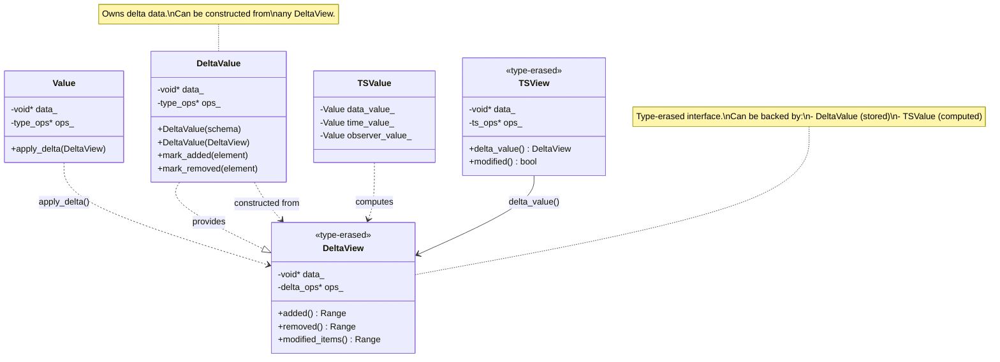
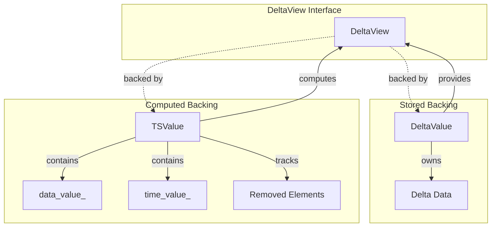
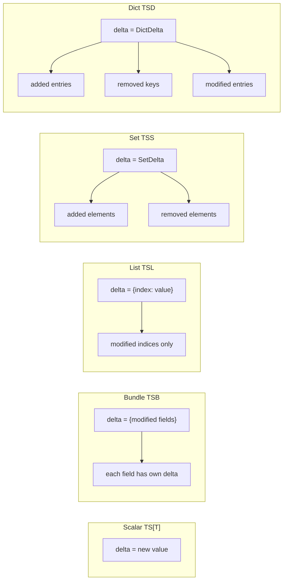
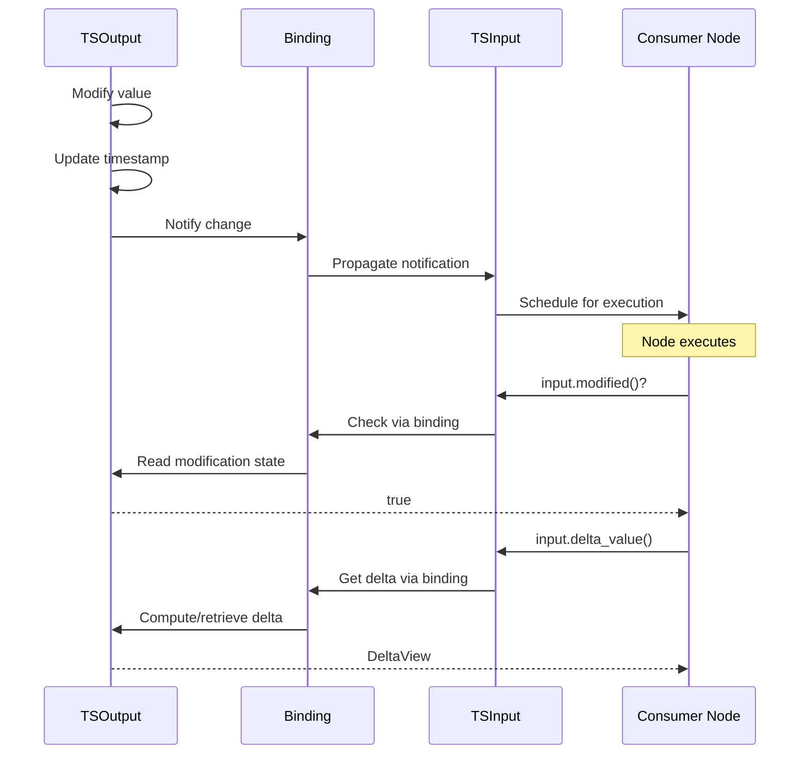
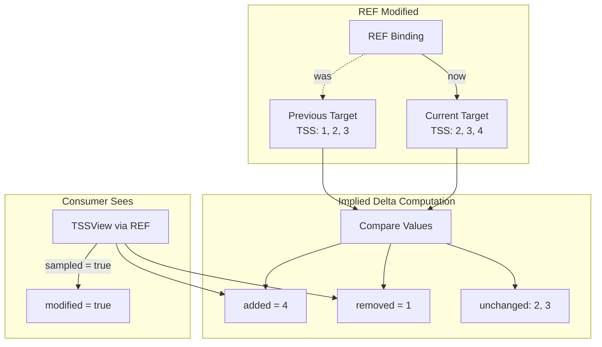
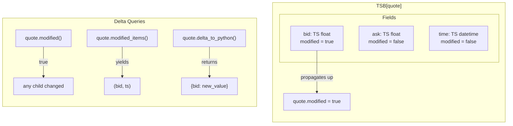
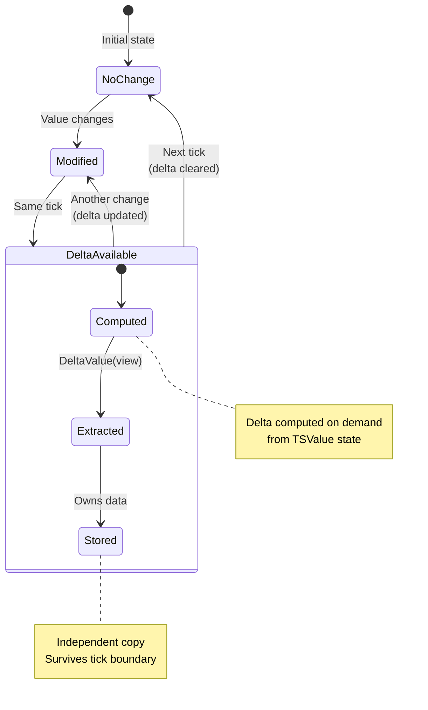

# Delta and Change Tracking: Incremental Processing

**Parent**: [Overview](00_OVERVIEW.md)

---

## Overview

Efficient reactive systems process **only what changed**. The time-series system provides rich delta information so you can:
- Know *that* something changed (`.modified()`)
- Know *what* changed (`.delta_value()`, `.modified_items()`, `.modified_values()`, etc.)
- Know *how* it changed (added, removed, updated)

---

## Modification Tracking Basics

### `.modified()`

True if the time-series changed **this tick**:

```cpp
if (price.modified()) {
    // React to change
    double new_price = price.value().as<double>();
}
```

For composites, `modified()` is true if **any descendant** changed.

### `.last_modified_time()`

The exact engine time of the last modification:

```cpp
// Usually you use .modified() instead
if (price.last_modified_time() == engine.current_time()) {
    // Equivalent to price.modified()
}
```

### Hierarchical Propagation

Changes propagate **upward**:

```
TSB[a: TS[int], b: TS[float]]

If b changes at time T:
├── b.last_modified_time() = T
├── b.modified() = true
├── bundle.last_modified_time() = T  (propagated up)
└── bundle.modified() = true         (because child changed)
```

You can drill down to find exactly which children changed.

---

## Delta for Scalar TS[T]

Scalars have simple delta semantics:

```cpp
TSView price = ...;

// Current value (type-erased)
double current = price.value().as<double>();  // → 42.0

// Delta value (the change itself)
double delta = price.delta_value().as<double>();  // → 42.0 (same as value for scalars)
```

For scalars, `value()` and `delta_value()` are the same - the "change" is the new value.

---

## Delta for Bundle TSB

### Which Fields Changed?

```cpp
TSBView quote = ...;  // TSB[bid: TS[float], ask: TS[float], time: TS[datetime]]

// Check specific field
if (quote.field("bid").modified()) {
    std::cout << "Bid changed to " << quote.field("bid").value<double>() << "\n";
}

// Iterate over modified fields
for (auto [name, ts] : quote.modified_items()) {
    std::cout << name << " changed to " << ts.to_string() << "\n";
}
```

### Value vs Delta Value

```cpp
// Full value - returns Python object (dataclass or dict depending on schema)
nb::object full = quote.to_python();

// Delta value - returns Python dict (only modified fields)
nb::object delta = quote.delta_to_python();

// Or access fields directly without Python conversion
for (auto [name, ts] : quote.modified_items()) {
    // Direct C++ access to modified field values
}
```

**Note**: `to_python()` returns a dataclass instance when the schema has an associated `scalar_type`, otherwise a dict. `delta_to_python()` always returns a dict containing only the modified fields.

---

## Delta for List TSL

### Which Elements Changed?

```cpp
TSLView prices = ...;

// Check specific element
if (prices[3].modified()) {
    std::cout << "Element 3 changed to " << prices[3].value().as<double>() << "\n";
}

// Iterate over modified values only
for (auto ts : prices.modified_values()) {
    std::cout << ts.value().as<double>() << "\n";
}

// Iterate over modified elements with their indices
for (auto [idx, ts] : prices.modified_items()) {
    std::cout << "prices[" << idx << "] = " << ts.value().as<double>() << "\n";
}
```

### Delta Value

```cpp
// Full value - Python list
nb::object full = prices.to_python();  // → [1.0, 2.0, 3.0, 4.0, ...]

// Delta value - Python dict mapping modified indices to values
nb::object delta = prices.delta_to_python();  // → {3: 4.5, 7: 8.2}
```

---

## Delta for Set TSS

Sets track **membership changes**:

```cpp
TSSView active_ids = ...;  // TSS[int]

// Elements added this tick
for (auto id : active_ids.added()) {
    std::cout << "ID added: " << id.as<int64_t>() << "\n";
}

// Elements removed this tick
for (auto id : active_ids.removed()) {
    std::cout << "ID removed: " << id.as<int64_t>() << "\n";
}

// Check specific element
if (active_ids.was_added(42)) {
    std::cout << "ID 42 was just added\n";
}

// Check for any structural change
if (active_ids.modified()) {
    std::cout << "Membership changed\n";
}
```

### Value vs Delta Value

```cpp
// Full value - Python frozenset
nb::object full = active_ids.to_python();

// Delta value - Python SetDelta object
nb::object delta = active_ids.delta_to_python();

// Or direct C++ access (avoids Python conversion)
const auto& added = active_ids.added();      // Range of added elements
const auto& removed = active_ids.removed();  // Range of removed elements
```

**Note**: `delta_to_python()` returns a `SetDelta` object, not a dict. Use `.added` and `.removed` properties to access the changes.

---

## Delta for Dict TSD

Dicts track **key changes** and **value changes** separately:

### Key Changes (Structural)

```cpp
TSDView stock_prices = ...;  // TSD[int, TS[float]]

// Keys added this tick
for (auto key : stock_prices.added_keys()) {
    std::cout << "New key: " << key.as<int64_t>() << "\n";
}

// Keys removed this tick
for (auto key : stock_prices.removed_keys()) {
    std::cout << "Removed key: " << key.as<int64_t>() << "\n";
}

// Added/removed with their values
for (auto [key, ts] : stock_prices.added_items()) {
    std::cout << "New: " << key.as<int64_t>() << " = " << ts.value().as<double>() << "\n";
}
```

### Value Changes (Non-Structural)

```cpp
// Keys whose TS values changed (excludes newly added keys)
for (auto key : stock_prices.modified_keys()) {
    std::cout << key.as<int64_t>() << " updated to " << stock_prices[key].value().as<double>() << "\n";
}

for (auto [key, ts] : stock_prices.modified_items()) {
    std::cout << key.as<int64_t>() << ": " << ts.value().as<double>() << "\n";
}
```

### Key Set Access

```cpp
// Access keys as a TSS-like view
auto key_set = stock_prices.key_set();

// Key set has TSS semantics
for (auto key : key_set.added()) {
    std::cout << "New key: " << key.as<int64_t>() << "\n";
}
```

### Value vs Delta Value

```cpp
// Full value - Python frozendict
nb::object full = stock_prices.to_python();

// Delta value - Python frozendict
nb::object delta = stock_prices.delta_to_python();

// Direct C++ access preferred for performance
for (auto [key, ts] : stock_prices.items()) {
    // Access all current entries
}
```

---

## Validity and Delta

### Valid vs Invalid

```cpp
// Time-series that was never set
if (!price.valid()) {
    // price.delta_value() is undefined or sentinel
}

// Time-series that was set then invalidated
if (!price.valid() && price.modified()) {
    // Was valid, now invalid - this is a change
    std::cout << "Price was invalidated\n";
}
```

### all_valid for Composites

```cpp
TSBView quote = ...;  // TSB[bid: TS[float], ask: TS[float]]

// Individual validity
quote.field("bid").valid();  // Is bid set?
quote.field("ask").valid();  // Is ask set?

// Composite validity
quote.valid();      // Is bundle itself valid?
quote.all_valid();  // Are ALL fields valid?
```

---

## Delta Clearing

Deltas are **ephemeral** - they're valid only for the current tick.

```
At tick T=1:
  active_ids.add(42);
  // active_ids.added() = {42}

At tick T=2 (no changes):
  // active_ids.added() = {}  (automatically cleared)
  // active_ids contains 42   (still present)
```

You don't need to clear deltas manually - the system handles it.

---

## DeltaView Backing: Stored vs Computed

A `DeltaView` is a type-erased interface that can be backed by two different mechanisms:

### 1. DeltaValue Backing (Stored Delta)

A `DeltaValue` is a Value object that **explicitly stores** delta data. The contents depend on the type:

| TS Type | DeltaValue Contents |
|---------|---------------------|
| **TS** | The new value |
| **TSB** | Modified fields (recursive) |
| **TSL** | Modified elements by index (recursive) |
| **TSS** | Added elements + removed elements |
| **TSD** | Added entries + removed keys + updated entries (recursive) |

Delta values are **recursive** - for composite types, each modified child contains its own delta.

```cpp
// Creating a stored delta
DeltaValue delta(set_schema);
delta.mark_added(42);
delta.mark_removed(99);

// Apply to a Value
Value my_set(set_schema);
my_set.apply_delta(delta);
```

### 2. TSValue Backing (Computed Delta)

When you call `.delta_value()` on a TSView, the returned DeltaView is **computed on demand** from the TSValue's internal state:

- **Modification detection**: Uses timestamp information stored in the TSValue to determine which elements were modified at the current tick
- **Removed element tracking**: For TSS/TSD, the **Value layer** tracks removed elements and manages their cleanup, allowing the DeltaView to access them even though they're no longer in the main data structure

```cpp
TSSView active_ids = ...;  // TSS[int]

if (active_ids.modified()) {
    // Delta is computed from TSValue state - not stored separately
    DeltaView delta = active_ids.delta_value();

    // Iterating added/removed computes from TSValue's:
    // - current elements + timestamps (for added)
    // - removed element storage (for removed)
    for (auto elem : active_ids.added()) { ... }
    for (auto elem : active_ids.removed()) { ... }
}
```

### Comparison

| Aspect | DeltaValue (Stored) | TSValue (Computed) |
|--------|---------------------|-------------------|
| **Storage** | Explicit delta data | Uses timestamps + removed tracking |
| **Creation** | Manually built | Automatic from modifications |
| **Use case** | Batch updates, serialization | Normal time-series access |
| **Memory** | Additional allocation | Reuses TSValue storage |

### No-Value in DeltaView

A `DeltaView` must be able to represent **no value** (None/empty). This occurs when:
- A field in a bundle was not modified (no delta for that field)
- An element in a list was not modified
- The time-series itself was not modified this tick

Because `DeltaView` uses type erasure, it can represent "no value" even for types like `TS[int]` that normally require a value. The key is to **always check validity before accessing**:

```cpp
DeltaView field_delta = bundle_delta.field("price");

// Always check before accessing
if (field_delta.valid()) {
    double delta_val = field_delta.value().as<double>();
    // Process the delta
} else {
    // No delta for this field - it wasn't modified
}
```

This extends the type-erased `View` concept to support an explicit "no value" state. The existing `valid()` method on views (which checks `data != nullptr && schema != nullptr`) serves this purpose - an unmodified field returns a `DeltaView` with null data, making `valid()` return false.

**Note**: This is consistent with the existing `ConstValueView::valid()` API. The view is "invalid" when there's no delta to report, which is distinct from an error condition.

### Extracting Delta for External Use

You can extract a delta from a time-series for use elsewhere:

```cpp
TSSView active_ids = ...;  // TSS[int]

if (active_ids.modified()) {
    // Extract the delta as a DeltaView
    DeltaView delta = active_ids.delta_value();

    // Apply to another value
    Value other_set(set_schema);
    other_set.apply_delta(delta);
}
```

### Constructing DeltaValue from DeltaView

A `DeltaValue` (stored delta) can be constructed from a `DeltaView` (which may be computed). This is useful when you need to capture or persist a delta:

```cpp
TSSView active_ids = ...;  // TSS[int]

if (active_ids.modified()) {
    // Get the computed delta view
    DeltaView delta_view = active_ids.delta_value();

    // Construct a stored DeltaValue from the view
    DeltaValue stored_delta(delta_view);

    // Now stored_delta owns the delta data and can be:
    // - Stored for later use
    // - Serialized
    // - Applied multiple times
}
```

This copies the delta information from whatever backing (computed or stored) into a new owned `DeltaValue`.

### Applying DeltaValue to Time-Series

When writing to a time-series output, you can apply a stored `DeltaValue`:

```cpp
TSSOutput active_ids_out = ...;

// Build a delta
DeltaValue delta(set_schema);
delta.mark_added(42);
delta.mark_removed(99);

// Apply to time-series (marks modified, notifies observers)
active_ids_out.apply_delta(delta);
```

This is more efficient than individual `add()`/`remove()` calls when making multiple changes.

See [Value: Bulk Operations](02_VALUE.md#bulk-operations-on-collections) for full `DeltaValue` API.

---

## UML Diagrams

### Delta Type Relationships



### DeltaView Backing Model



### Delta Contents by Type



### Delta Flow Through Links



### REF Delta Computation



### Modification Propagation



### Delta Lifecycle



---

## Delta and Links

### Linked Inputs

When an input is linked to an output, delta flows through:

```
Output modifies value
        │
        ▼
Output computes delta
        │
        ▼
Link notifies input
        │
        ▼
Input sees same delta (via link)
```

The input's `.modified()`, `.delta_value()`, `.added()`, `.removed()`, etc. reflect the output's state.

### Non-Peered Inputs

Non-peered inputs have their own delta tracking:

```cpp
// Non-peered input with local storage
TSView local_cache = ...;  // Not linked, non-const for writing

// When you write to it
local_cache.set_value(value_from(42.0));

// It tracks its own modification
local_cache.modified();  // True this tick
```

### Delta Through REF Links

When navigation passes through a **REF** (reference) link, delta computation has special behavior:

**If the REF itself was modified** (i.e., it now points to a different target):
- All elements accessed through the REF are marked as **modified**
- For collections (TSS, TSD, TSL), the system computes the **implied delta** between the previous value and the current value

```cpp
// REF[TS[float]] that changed targets
REFView price_ref = ...;  // Now points to different TS[float]

if (price_ref.modified()) {
    // The REF changed what it points to
    TSView price = price_ref.value();

    // price.modified() returns true (sampled modification)
    // Even if the underlying TS[float] didn't change this tick
}
```

For collections, this means computing the structural difference:

```cpp
// REF[TSS[int]] that changed targets
REFView ids_ref = ...;

if (ids_ref.modified()) {
    TSSView ids = ids_ref.value();

    // If REF changed from pointing at {1, 2, 3} to {2, 3, 4}:
    // ids.added()   → {4}      (elements in new but not old)
    // ids.removed() → {1}      (elements in old but not new)
    // ids.modified() → true
}
```

This ensures that consumers of REF-accessed data see a consistent delta view, even when the underlying reference changes. The implied delta reflects the actual difference the consumer observes, regardless of whether that difference came from the target changing or the REF switching targets.

**Note**: This is related to the `sampled()` flag on TSView - when a view is obtained through a modified REF, it is marked as "sampled" and `modified()` returns true even if the underlying data wasn't directly modified.

---

## Performance: Delta vs Full Processing

| Approach | When to Use |
|----------|-------------|
| Full recompute | Small data, infrequent changes, complex dependencies |
| Delta processing | Large data, frequent small changes, independent elements |

```cpp
// Delta approach - O(changes)
for (auto key : stock_prices.modified_keys()) {
    process(key.as<int64_t>(), stock_prices[key].value().as<double>());
}

// Full approach - O(total size)
for (auto [key, ts] : stock_prices.items()) {
    process(key.as<int64_t>(), ts.value().as<double>());
}
```

---

## Summary

| Type | Delta Query |
|------|-------------|
| **TS[T]** | `.modified()`, `.delta_value()` |
| **TSB** | `.modified_items()`, `.delta_to_python()` |
| **TSL** | `.modified_values()`, `.modified_items()`, `.delta_to_python()` |
| **TSS** | `.added()`, `.removed()`, `.delta_to_python()` |
| **TSD** | `.added_keys()`, `.removed_keys()`, `.modified_keys()`, `.modified_items()`, `.delta_to_python()` |

Use delta information to build efficient incremental algorithms.
